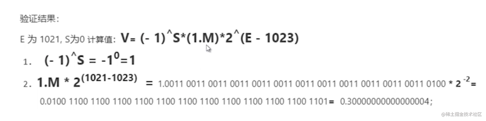

# 04-运算符的妙用以及部分机理解析

推荐文章

[运算符:https://juejin.cn/post/7221418382107869242](https://juejin.cn/post/7221418382107869242)

 [【转载】(0, eval)(‘this’)](https://www.cnblogs.com/qianlegeqian/p/3950044.html)

[MDN-eval:直接应用+间接引用](https://developer.mozilla.org/zh-CN/docs/Web/JavaScript/Reference/Global_Objects/eval)

## 01: 运算符的诡异现象

### 函数基础知识

- 普通函数调用时，this 指向的是调用函数的对象

```javascript
// 浏览器中执行

let myName = 'let的name' // let const 声明的变量 不会挂在 windows 属性上
const person = {
  myName: 'person的Name',
  getName() {
    return this.myName
  },
}

const getName = person.getName

const print = function (prefix, ...args) {
  console.log(prefix.padEnd(20, ' ') + ':', ...args)
}

print('getName', getName()) // undefined
print('person.getName', person.getName()) //  person的Name
print('(person.getName)', (person.getName)()) // person的Name
print('(0, person.getName)', (0, person.getName)()) // undefined
```

### let const 声明的变量不会挂载在 windows 上

```javascript
// 浏览器中执行

var nameVar = 'nameVar'
let nameLet = 'nameLet'
const nameConst = 'nameConst'

console.log('nameVar:', window.nameVar)
console.log('nameLet:', window.nameLet)
console.log('nameConst:', window.nameConst)
```

### 赋值

> (person.getName)()
>
> 有没有赋值操作？？
>
> 赋值的话值给了谁？？

#### 其中的引用

- 内部引用类型不是语言数据类型
- 用于解释诸如 delete typeof 和赋值操作符的行为
- 例如，赋值的**左操作数**应该产生一个引用记录

#### 引用相关的两个重要曹组

- GetValue(V): 即**取值**操作，返回的是确定的值
- PutValue(V,W): 设置值，对某个引用设置
- PutValue **要求第一个参数是引用（查看协议）**

#### v=v的理解

* 可以理解为 `v = GetValue(v)`
* v 在作为左手端的时候，它是引用
* 而作为右手端的时候，它是值

### 其他赋值操作

| *=赋值乘积 | /=赋值商   | %=赋值求余      |
| ---------- | ---------- | --------------- |
| +=赋值求和 | -=赋值求差 | <<==            |
| >>=        | >>>=       | &=              |
| ^=         | \|=        | &&=             |
|            |            | {a,b}={a:1,b:2} |

#### 分组运算符()

* 分组运算符里面可以是表达式，也可以是字面量的值
* **此算法不将 GetValue 应用于计算 Expression(表达式)的结果。这样做的主要原因是，诸如 delete typeof 等操作符可以应用于括号表达式**

#### (person.getName)()

* 并没有产生 getValue 操作，没有发生取值操作，也没有赋值操作

#### (0, person.getName)()

* 分组运算符
* 逗号运算符
  * MDN：逗号运算符，对它的的每个操作数**求值(从左到右)**,并返回最后一个操作数的值
* 此表达式，就产生了赋值操作，等同于(const getName = person.getName)()
* 那么 this 就是全局对象 window
* 结果就是 undefined

```javascript
// 赋值左操作数
var10 = 10;
10 = 10
// { a: 1 }  = { a: 1 }
```

### typeof 未声明变量为什么不报错(非严格模式)

* 未发生求值？？？
* 答案：引用不可答，直接返回 undefined

### 思考题

```javascript
// 浏览器中
var varNum = 10
function evalCode() {
  eval(`var varNum = 20`)
}

function evalCode2() {
  ;(0, eval)(`var varNum = 30`) 
  // 这里算是 eval 的间接引用，间接调用计算出来的是一个值，而不是引用
}
console.log('varNum:', varNum) // 10

evalCode()
console.log('varNum:', varNum) // 10
evalCode2()
console.log('varNum:', varNum) // 30
```

## 02：窥视delete语法的本质

### delete 的返回值是什么

* Boolean 类型
* true 不一定删除成功，代表**删除没有发生异常**
* false 代表一定没有删除成功

```javascript
var a = {
  p1: 1,
  p3: 5,
}

// 对象的属性
console.log('delete a.p1:', delete a.p1)
// 对象上不存在的属性
console.log('delete a.p2:', delete a.p2)
// 全局对象a
console.log('delete var a:', delete a)

console.log('')
console.log('var a:', a)

// 打印结果如下
delete a.p1: true
delete a.p2: true
delete var a: false

var a: { p3: 5 }
```

### delete 不能删除那些属性

```javascript
//var
function testVar() {
  var a = 1
  console.log('delete var a：：：', delete a)
  console.log('var a ：：：', a)
}
testVar()

//let const,
function testLet() {
  let a = 1
  console.log('delete let a：：：', delete a)
  console.log('let a ：：：', a)
}
//作用域在testLet 中
testLet()

//不可配置的
var obj = {}
Object.defineProperty(obj, 'name', { configurable: false })
console.log('delete obj.name', delete obj.name)
console.log('delete undefined：：：', delete undefined)
console.log(Object.getOwnPropertyDescriptor(window, 'undefined'))
console.log('delete Infinity：：：', delete Infinity)
console.log(Object.getOwnPropertyDescriptor(window, 'Infinity'))
console.log('delete NaN：：：', delete NaN)
console.log(Object.getOwnPropertyDescriptor(window, 'NaN'))
console.log('delete window：：：', delete window)
console.log(Object.getOwnPropertyDescriptor(window))
console.log('delete window.document：：：', delete window.document)
Object.getOwnPropertyDescriptor(window, 'document')
// 各种内置原型
console.log('delete Object.prototype：：：', delete Object.prototype)
Object.getOwnPropertyDescriptor(Object, 'prototype')
// 内置Math的函数
console.log('delete Math.PI：：：', delete Math.PI)
Object.getOwnPropertyDescriptor(Math, 'PI')
//函数
function fn() {}
console.log('delete fn：：：', delete fn)
console.log(Object.getOwnPropertyDescriptor(window, 'fn'))
```

* 任何使用 var 声明的属性，不能从全局作用域或者函数的作用域中删除

* 任何使用 let 或者 const 声明的属性，不能从它声明的作用域删除

  ```javascript
  // var let const 
  //var 
  function testVar() {
      var a = 1;
      console.log("delete var a:", delete a);
      console.log("var a :", a);
  }
  testVar();
  
  //let const,
  function testLet() {
      let a = 1;
      console.log("delete let a:", delete a);
      console.log("let a :", a);
  }
  //作用域在testLet 中
  testLet();

* 不可配置(configurable)的属性不能被删除

  ```javascript
  //不可配置的
  var obj = {};
  Object.defineProperty(obj, 'name', { configurable: false });
  console.log("delete obj.name", delete obj.name);
  
  // undefined
  console.log("delete undefined:", delete undefined);
  console.log(Object.getOwnPropertyDescriptor(global, "undefined"));
  
  // Infinity
  console.log("delete Infinity:", delete Infinity);
  console.log(Object.getOwnPropertyDescriptor(global, "Infinity"));
  
  // NaN
  console.log("delete NaN:", delete NaN);
  console.log(Object.getOwnPropertyDescriptor(global, "NaN"));
  
  // window
  // console.log("delete window:", delete window);
  // console.log(Object.getOwnPropertyDescriptor(window));
  
  // document
  // console.log("delete window.document", delete window.document);
  // Object.getOwnPropertyDescriptor(window, "document");
  ```

  ```javascript
  // delete 内置
  // 各种内置原型
  console.log("delete Object.prototype", delete Object.prototype); // false
  Object.getOwnPropertyDescriptor(Object, "prototype")
  
  // 内置Math的函数
  console.log("delete Math.PI", delete Math.PI); // false
  Object.getOwnPropertyDescriptor(Math, "PI")
  ```

### delete 删除原型属性

* delete 不会遍历原型链，或者说姿势不对
* delete Foo.prototype.bar

```javascript
// 原型上的属性
function Foo() {
  this.bar = 10
}
Foo.prototype.bar = 42
var foo = new Foo()
// 返回 true，因为删除的是 foo 对象的自身属性
delete foo.bar
// foo.bar 仍然可用，因为它在原型链上可用。
console.log(foo.bar) //42
// 从原型上删除属性
delete Foo.prototype.bar //true
// 由于已删除“ bar”属性，因此不能再从Foo继承它。
console.log(foo.bar) //undefined
```

````javascript
// delete 删除原型上的属性
function Foo() {
    this.bar = 10;
}
Foo.prototype.bar = 42;
var foo = new Foo();
// 返回 true，因为删除的是 foo 对象的自身属性
delete foo.bar;
// foo.bar 仍然可用，因为它在原型链上可用。
console.log("delete 删除自身属性：：：",foo.bar);   // 42
// 从原型上删除属性
delete Foo.prototype.bar; //true
// 由于已删除“ bar”属性，因此不能再从Foo继承它。
console.log("delete 删除原型属性：：：",foo.bar);    // undefined
````

### delete 到底删除的是什么

```javascript
delete 10; //true
var trees = ["redwood","bay","cedar","oak","maple"];
delete trees[3];
console.log("trees:",trees);
// trees：：： ["redwood", "bay", "cedar", empty, "maple"]
delete {}
var x = 1;
delete x
// 浏览器中运行
var x = 1;
delete window.x;
```

#### delete 协议描述

> If ref is not a Reference Record, return true

#### delete 语法的本质是什么

* 操作表达式结果
* **值，字面量**，不操作，直接返回 true
* **引用类型**，删除引用

#### 严格模式

* SyntaxError: 变量，函数名，函数参数
* TypeError: configurable: false
* ReferenceError: 典型的就是 delete super.property

```javascript
// 严格 变量 SyntaxError 
'use strict'
// 变量
var name = 'name'
delete name

// 函数
function fn() {}
delete fn

function fnArg(name) {
  delete name
}
fnArg()
```

```javascript
// 严格 configurableTypeError  
'use strict'

var person = {
  name: '帅哥',
}

Object.defineProperty(person, 'name', {
  configurable: false,
})

delete person.name
```

```javascript
// 严格 refer
'use strict'

class Parent {
  constructor(name) {
    this.name = name
  }
  getName() {}
}

class Child extends Parent {
  constructor(name, age) {
    super(name)
    this.age = age
  }

  deleteAny() {
    console.log('super', super.getName)
    delete super.getName
  }
}

var child = new Child('child', 18)
delete child.deleteAny() // ReferenceError: Unsupported reference to 'super'
```

```javascript
// var 非var
var nameVar = 'nameVar'
nameNotVar = 'nameNotVar'
console.log('nameVar', Object.getOwnPropertyDescriptor(window, 'nameVar'))
console.log('nameNotVar', Object.getOwnPropertyDescriptor(window, 'nameNotVar'))

// 打印结果如下
nameVar {
  "value": "nameVar",
  "writable": true,
  "enumerable": true,
  "configurable": false
}
nameNotVar {
  "value": "nameNotVar",
  "writable": true,
  "enumerable": true,
  "configurable": true
}
```

### 思考题

```javascript
console.log('delete null     :', delete null) // null 是一个常量 
console.log('delete 11       :', delete 11)
console.log('delete undefined:', delete undefined) // undefined是 window 的属性

a = { c: 12 }
console.log('delete a        :', delete a) 
// 不是通过 var 声明的 configurable 为true 可以被删除

var b = 12
console.log('delete b        :', delete b) 
// 通过 var 声明的 configurable 为false，不可被 delete

console.log('delete xxxxxxxxx:', delete xxxxxxxxx) 
// 不可达未定义，delete 直接返回 true

var obj = {}
console.log('delete .toString:', delete obj.toString)
console.log('obj.toString:', obj.toString)

// 打印结果如下(浏览器中使用)
delete null     : true
delete 11       : true
delete undefined: false
delete a        : true
delete b        : false
delete xxxxxxxxx: true
delete .toString: true
obj.toString: ƒ toString() { [native code] }
```

## 03: 位运算符的妙用：奇偶数，色值换算，换值， 编码等

### 位运算的基础知识

* 操作数是**32位整数**
* 自动转换为整数
* 速度 T0, 在二进制下进行运算

### 按位与 &

* 两个为 1，则为 1，否则为 0

#### 按位与 & 判断奇偶数

* 奇数：num & 1 == 1

* 偶数：num & 1 == 0

  ```javascript
  function checkNum(num) {
    const result = num & 1
    if (result == 1) {
      console.log(num, '::是一个奇数')
      return
    } else if (result === 0) {
      console.log(num, '::是一个偶数')
      return
    }
    console.log(num, '::未识别')
  }
  
  checkNum(0)
  checkNum(1)
  checkNum(5)
  checkNum(12)
  // 结果如下
  0 ::是一个偶数
  1 ::是一个奇数
  5 ::是一个奇数
  12 ::是一个偶数
  ```

### 按位或 |

* 1个位1 则为 1

#### 按位或 | 取整

* x | 0
* 2.2 | 0 = 2

#### 按位或 |

* 自身 | 自身 = 自身，可以用来比较数值相等

### 按位非 ~

* 按位非运算符(~), 反转操作数的位。表象是对数字求负，然后减 1 （-x-1）

  ```javascript
  const a = 5;     // 00000000000000000000000000000101
  const b = -3;    // 11111111111111111111111111111101
  
  console.log(~a); // 11111111111111111111111111111010
  // expected output: -6
  
  console.log(~b); // 00000000000000000000000000000010
  // expected output: 2
  ```

#### 按位非~ 判断数组中是否包含某个元素

* 不存在，indexOf 返回 -1
* ~ -1 = (-1) - 1 = 1 - 1 = 0 

```javascript
const array = [2, 3, 4]

//检查数组中是否包含元素
function inArrayCompare(arr, num) {
  if (arr.indexOf(num) > -1) {
    return true
  }
  return false
}

function inArray(arr, val) {
  // -1 不存在, ~ -1 == 0, 布尔值为 false
  // 其他情况为真值，表示存在
  if (~arr.indexOf(val)) {
    return true
  }
  return false
}

const print = console.log
print(inArrayCompare(array, 2)) // true
print(inArray(array, 2)) // true
```

#### 按位非~ 取整

* ~~x: -(-x-1)-1 = x + 1 - 1 = x

```javascript
console.log(~~54.25)
console.log(54.25 >> 0)
console.log(54.25 >>> 0)
console.log(54.25 | 0)

//原理 ~ ， 实质上是对数字求负，然后减 1 (-x-1).
//那么~~就是对数字求负减一后再求负减1 (-（-x-1）)-1 也就可以用于取整
var result = function (num) {
  console.log(-num - 1)
  const result1 = -num - 1
  console.log(-result1)
  return -result1 - 1
}

console.log('abc==', ~54)
console.log('abc==', result(54))

// 运行结果如下
54
54
54
abc== -55
-55
55
abc== 54
```

### 按位异或^

* 只有一个数位存放 1 时，返回1，否则为 0

#### 按位异或^,归零律

* 归零律：a^a =0 自己异或自己，位数上的值肯定相同

  ```javascript
  // 比较数字相等
  console.log('5 ^ 5==', 5 ^ 5)
  console.log('5 ^ 4==', 5 ^ 4)
  console.log('25 ^ 4==', 25 ^ 4)
  console.log('25 ^ 25==', 25 ^ 25)
  console.log('0 ^ 0==', 0 ^ 0)
  console.log('0 ^ 1==', 0 ^ 1)
  console.log('1 ^ 0==', 1 ^ 0)
  // 结果如下
  5 ^ 5== 0
  5 ^ 4== 1
  25 ^ 4== 29
  25 ^ 25== 0
  0 ^ 0== 0
  0 ^ 1== 1
  1 ^ 0== 1
  ```

#### 按位异或^，恒等律

* 恒等律：a^0 = a 自己异或0，自己是啥结果就是啥

#### 按位异或^，自反，结合律

* 自反：a^a^a = 0^a = a
* 结合律：a^b^c = c^b^a, 与顺序无关

#### 按位异或^ 值交换

* 变量值为数字，完成值的交换（不用增加临时变量）

  ```javascript
  let a = 10
  let b = 20
  a ^= b // a = a ^ b
  b ^= a // b = a ^ a ^ a = a
  a ^= b // a = a ^ b ^ b = b
  console.log(a, b) // 20 10
  ```

### RGB 和 16进制颜色值的转换

#### RGB转16进制

```javascript
function colorRGBToHex(rgb){
  // split 的参数可以是正则
  // rgb(204, 0, 255)
  const rgbArr = rgb.split(/[^\d]+/)
  // ["", "204", "0", "255", ""]
  const color = rgbArr[1] << 16 | rgbArr[2] << 8 | rgbArr[3];
  return "#" + color.toString(16)
}
console.log(colorRGBToHex('rgb(204,0,255)')) // #cc00ff
```

#### 16进制转RGB

```javascript
// # CCOOFF
function colorHexToRGB(hex){
  // 转为6位的16进制 OxCCOOFF
  let newHex = hex.replace("#", "0x")
  let r = newHex >> 16
  let g = newHex >> 8 & oxff // oxff 255
  let b = newHex & 0xff
  return "rgb(" + r + "," + g + "," + b + ")" ;
}
console.log(colorHexToRGB('#CC00FF')) // rgb(204,0,255)
```

### base64 源码

```typescript
/**
 * converts a Uint8Array to a Base64 string.
 * @param {boolean} [urlsafe] URL-and-filename-safe a la RFC4648 §5
 * @returns {string} Base64 string
 */
const fromUint8Array = (u8a: Uint8Array, urlsafe = false) =>
  urlsafe ? _mkUriSafe(_fromUint8Array(u8a)) : _fromUint8Array(u8a)
// This trick is found broken https://github.com/dankogai/js-base64/issues/130
// const utob = (src: string) => unescape(encodeURIComponent(src));
// reverting good old fationed regexp
const cb_utob = (c: string) => {
  if (c.length < 2) {
    var cc = c.charCodeAt(0)
    return cc < 0x80
      ? c
      : cc < 0x800
      ? _fromCC(0xc0 | (cc >>> 6)) + _fromCC(0x80 | (cc & 0x3f))
      : _fromCC(0xe0 | ((cc >>> 12) & 0x0f)) +
        _fromCC(0x80 | ((cc >>> 6) & 0x3f)) +
        _fromCC(0x80 | (cc & 0x3f))
  } else {
    var cc =
      0x10000 + (c.charCodeAt(0) - 0xd800) * 0x400 + (c.charCodeAt(1) - 0xdc00)
    return (
      _fromCC(0xf0 | ((cc >>> 18) & 0x07)) +
      _fromCC(0x80 | ((cc >>> 12) & 0x3f)) +
      _fromCC(0x80 | ((cc >>> 6) & 0x3f)) +
      _fromCC(0x80 | (cc & 0x3f))
    )
  }
}
const re_utob = /[\uD800-\uDBFF][\uDC00-\uDFFFF]|[^\x00-\x7F]/g
/**
 * @deprecated should have been internal use only.
 * @param {string} src UTF-8 string
 * @returns {string} UTF-16 string
 */
const utob = (u: string) => u.replace(re_utob, cb_utob)
//
const _encode = _hasBuffer
  ? (s: string) => Buffer.from(s, 'utf8').toString('base64')
  : _TE
  ? (s: string) => _fromUint8Array(_TE.encode(s))
  : (s: string) => _btoa(utob(s))
/**
 * converts a UTF-8-encoded string to a Base64 string.
 * @param {boolean} [urlsafe] if `true` make the result URL-safe
 * @returns {string} Base64 string
 */
const encode = (src: string, urlsafe = false) =>
  urlsafe ? _mkUriSafe(_encode(src)) : _encode(src)
/**
 * converts a UTF-8-encoded string to URL-safe Base64 RFC4648 §5.
 * @returns {string} Base64 string
 */
const encodeURI = (src: string) => encode(src, true)
// This trick is found broken https://github.com/dankogai/js-base64/issues/130
// const btou = (src: string) => decodeURIComponent(escape(src));
// reverting good old fationed regexp
const re_btou =
  /[\xC0-\xDF][\x80-\xBF]|[\xE0-\xEF][\x80-\xBF]{2}|[\xF0-\xF7][\x80-\xBF]{3}/g
const cb_btou = (cccc: string) => {
  switch (cccc.length) {
    case 4:
      var cp =
          ((0x07 & cccc.charCodeAt(0)) << 18) |
          ((0x3f & cccc.charCodeAt(1)) << 12) |
          ((0x3f & cccc.charCodeAt(2)) << 6) |
          (0x3f & cccc.charCodeAt(3)),
        offset = cp - 0x10000
      return (
        _fromCC((offset >>> 10) + 0xd800) + _fromCC((offset & 0x3ff) + 0xdc00)
      )
    case 3:
      return _fromCC(
        ((0x0f & cccc.charCodeAt(0)) << 12) |
          ((0x3f & cccc.charCodeAt(1)) << 6) |
          (0x3f & cccc.charCodeAt(2)),
      )
    default:
      return _fromCC(
        ((0x1f & cccc.charCodeAt(0)) << 6) | (0x3f & cccc.charCodeAt(1)),
      )
  }
}
```

### 实现简单加密

```javascript
const password = 654
const specialCharacter = '`%_'

function encodeStr(str) {
  let result = ''
  str.split('').map((item) => {
    result += handleCode(item, 1)
  })
  return result
}

function decodeStr(str) {
  let result = ''
  str.split(specialCharacter).map((item) => {
    if (item.length > 0 && /\d/.test(item)) {
      result += handleCode(item, 2)
    } else {
      item.split('').map((charItem) => {
        result += handleCode(charItem, 2)
      })
    }
  })

  return result
}

function handleCode(str, type) {
  if (/\d/.test(str)) {
    //数字类型
    const r = str ^ password
    if (type == 2) return r
    return specialCharacter + r + specialCharacter
  } else {
    //字符类型，直接去code 码
    const code = str.charCodeAt()
    const newCode = code ^ password
    //再次转换为字符
    return String.fromCharCode(newCode)
  }
}

const testStr = '嗨喽， 张三，hello35'
const result = encodeStr(testStr)
console.log('encodeStr===', result)
const decodeResult = decodeStr(result)
console.log('decodeStr===', decodeResult)

```

### 小结

| 位运算符号 | 中文名称 | 特点                                                 | 应用场景                                  |
| ---------- | -------- | ---------------------------------------------------- | ----------------------------------------- |
| &          | 按位与   | 两个操作数都为1，则为1                               | 1. 判断奇偶数                             |
| \|         | 按位或   | 两个操作数至少一个为1，则为1                         | 1. 奇偶数<br />2. 等于某个整数值          |
| ~          | 按位非   | 取反减1，即 -x-1                                     | 1. 取整<br />2. 数组中是否存在某个值      |
| ^          | 按位异或 | 有且只有一个操作数位1，则为1                         | 1. 整数比较<br />2. 数字交互              |
| >>         | 位移     | 移动指定位数，超出的位数将会被清除，缺省位数将会补零 | 1. 转为整数<br />2. 色值转换<br />3. 编码 |

## 04: 计算机是怎样进行数字相加的 

**推荐文章**

[非科班前端人的一道送命题：0.1+0.2 等于 0.3 吗？](https://zhuanlan.zhihu.com/p/363133848)

### 0.1 + 0.2 = 0.30000000000000004

* 十进制和二进制是如何相互转换的
* 浮点数是以什么格式存储的
* 计算机是怎么进行加法的

### 进制转换-十进制转换二进制

* 整数：除2取余，逆序排列
* 小数：乘2取整，顺序排列

#### 例子：9.375

* 整数部分：9 
* 小数部分：0.375
* 最终结果：整数 + 小数 = 1001 + 0.011 = 1001.011

```javascript
console.log((9.375).toString(2))
console.log(Number.prototype.toString.call(9.375, 2))
console.log(Number.prototype.toString.call(Number(9.375), 2))
// 结果如下
1001.011
1001.011
1001.011
```

### 进制转换-二进制转十进制

* 小数点前：**从右到左**用二进制的每个数乘以2的相应**次方递增**
* 小数点后：**从左向右**用二进制的每个数乘以2的相应**负次方递增**

#### 1001.011 转十进制

* 整数部分：1 * 2^0 + 0 * 2^1 + 0 * 2^2 + 1 * 2^3 = 1 + 8 = 9
* 小数部分：0 * 2^-1 + 1 * 2^-2 + 1 * 2^-3 = 0 + 0.25 + 0.125 = 0.375
* 最终结果：9 + 0.375 = 9.375

### IEEE 754 二进制浮点数算术标准

>  **IEEE二进制浮点数算术标准**（**IEEE 754**）是20世纪80年代以来最广泛使用的[浮点数](https://so.csdn.net/so/search?q=浮点数&spm=1001.2101.3001.7020)运算标准，为许多CPU与浮点运算器所采用。这个标准定义了表示浮点数的格式（包括负零-0）与反常值（denormal number）），一些特殊数值（无穷（Inf）与非数值（NaN）），以及这些数值的“浮点数运算符”；它也指明了四种数值舍入规则和五种例外状况（包括例外发生的时机与处理方式）。
>
> IEEE 754规定了四种表示浮点数值的方式：单精确度（32位）、双精确度（64位）、延伸单精确度（43比特以上，很少使用）与延伸双精确度（79比特以上，通常以80比特实做）。只有32位模式有强制要求，其他都是选择性的。大部分编程语言都有提供IEEE浮点数格式与算术，但有些将其列为非必需的。例如，IEEE 754问世之前就有的C语言，现在有包括IEEE算术，但不算作强制要求（C语言的`float`通常是指IEEE单精确度，而`double`是指双精确度）。
>
> 该标准的全称为**IEEE二进制浮点数算术标准（ANSI/IEEE Std 754-1985）**，又称**IEC 60559:1989，微处理器系统的二进制浮点数算术**（本来的编号是IEC 559:1989）。后来还有“与基数无关的浮点数”的“IEEE 854-1987标准”，有规定基数为2跟10的状况。现在最新标准是“IEEE 854-2008标准”。
>
> 在六、七十年代，各家计算机公司的各个型号的计算机，有着千差万别的浮点数表示，却没有一个业界通用的标准。这给数据交换、计算机协同工作造成了极大不便。IEEE的浮点数专业小组于七十年代末期开始酝酿浮点数的标准。在1980年，英特尔公司就推出了单片的8087浮点数协处理器，其浮点数表示法及定义的运算具有足够的合理性、先进性，被IEEE采用作为浮点数的标准，于1985年发布。而在此前，这一标准的内容已在八十年代初期被各计算机公司广泛采用，成了事实上的业界工业标准。

#### 双精度 64 位举例

| 名称      | 长度  | 比特位置  |
| --------- | ----- | --------- |
| 符号位S   | 1bit  | (b63)     |
| 指数位E   | 11bit | (b62-b52) |
| 尾数部分M | 52bit | (b51-b0)  |

#### 双精度SEM

* 符号位S: 1 表示负数，0表示正数
* 指数位E：E = 指数 + 1023(偏移码)
* 尾数部分M：1<=M<2，隐含的以 1 开头，默认存储1后面部分

### 浮点数运算

* 对阶

  * 对阶-保持指数位数字一致

    ```javascript
    123.5 + 1426.00456
    1.235 * 10^2 + 1.42600456 * 10^3
    0.1235 * 10^3 + 1.42600456 * 10^3
    ```

  * 小阶对大阶

  * 对阶--精度丢失问题

    * 小阶对大阶，会右移动，容易丢失位数
    * 相加 或者 相减，值可能溢出

* 尾数运算

  * 尾数运算就是在完成对阶后进行尾数想加减

* 规格化

  * 1.M的形式，例子：17.051 -> 1.7051
  * 左移规格化
  * 右移规格化(可能精度丢失)

* 舍入处理

  * 舍入到最近 (默认)
  * 朝 +∞ 方向舍入
  * 朝 -∞ 方向舍入
  * 朝 0 方向舍入

* 溢出判断

  * 运算结果的阶码的值判断是否溢出
  * 超过最大正数（上溢）：浮点数正数：正上溢；否则，负上溢

## 05：why 0.1 + 0.2 !=0.3 揭秘！

### 换算成 IEEE 754 标准二进制结构

* 0.1 转二进制(小数转二进制)：直到积中的小数部分为0

  ```javascript
  // 特殊
  2 * 0.1   
  2 * 0.2        0
  
  2 * 0.4        0
  2 * 0.8        0
  2 * 1.6        1
  2 * 1.2        1
  
  2 * 0.4        0
  2 * 0.8        0
  2 * 1.6        1
  2 * 1.2        1
  
  2 * 0.4        0
  2 * 0.8        0
  2 * 1.6        1
  2 * 1.2        1
  
  .....无限循环0011....
  ```

* 规格化

  ```javascript
  0.0 0011 00011 (0011)n => 1.1001 1000 (1001)n * 2^-4 
  // 变为1.xxx需要进行左移 4位，所以是 * 2^-4
  ```

* 符号为S: 0

* 指数为：E = 1023 + 指数 = 1023 - 4 = 1019(01111111011)

* 尾数部分M: 由于无限循环(1001), 顾采用就近舍入模式

  ```javascript
  1001 1001 1001 1001 1001 1001 1001 1001 1001 1001 1001 1001 1001 1001 ... （52位）
  ----------------------------------------------------------------------
  1001 1001 1001 1001 1001 1001 1001 1001 1001 1001 1001 1001 1010 // 这里需要进1舍
  ```

* 对阶

  ```javascript
  // 0.1 
  0 - 01111111011 - 10011001 10011001 10011001 10011001 10011001 10011001 1010
  
  // 0.2 
  0 - 01111111100 - 10011001 10011001 10011001 10011001 10011001 10011001 1010
  
  // 对阶：小阶对大阶
  0.1 的指数是 1019
  0.2 的指数是 1020
  所以，0.1 的指数部分要变为 1020， 同时位数右移一位，尾数部分是 1.M 形成
  所以对阶之后，0.1就变为
  0 - 01111111100 - 110011001 10011001 10011001 10011001 10011001 10011001 1010
  ```

* 尾数运算

  ```javascript
    0. 1100 1100 1100 1100 1100 1100 1100 1100 1100 1100 1100 1100 1101 0 // 0.1
  + 1. 1001 1001 1001 1001 1001 1001 1001 1001 1001 1001 1001 1001 1010 	// 0.2
  ------------------------------------------------------------------------------
   10. 0110 0110 0110 0110 0110 0110 0110 0110 0110 0110 0110 0110 0111 0  
  ```

* 结果规格化

  ```javascript
  10. 0110 0110 0110 0110 0110 0110 0110 0110 0110 0110 0110 0110 0111 0  
  // 规格化后
  1. 00110 0110 0110 0110 0110 0110 0110 0110 0110 0110 0110 0110 0111 0  
  ```

* 指数位 +1， 变为 1020 + 1 = 1021， 二进制： 01111111101

* 舍入处理

  ```javascript
  1. 00110 0110 0110 0110 0110 0110 0110 0110 0110 0110 0110 0110 0111 0  // 54位
  ----------------------------------------------------------------------(四舍五入)
  1. 0011 0011 0011 0011 0011 0011 0011 0011 0011 0011 0011 0011 0011 10 需要进1然舍去
  1. 0011 0011 0011 0011 0011 0011 0011 0011 0011 0011 0011 0011 0100 
  ```

* 溢出检查：指数 1021 没有溢出

* 最终的结果

  * 符号为 S: 0
  * 指数位 E: 0.1-1019 0.2-1020 计算完成后 1021 (1111111101)
  * 尾数位：0011 0011 0011 0011 0011 0011 0011 0011 0011 0011 0011 0011 0100 
  * 0-1111111101-0011 0011 0011 0011 0011 0011 0011 0011 0011 0011 0011 0011 0100 

* 计算公式

  

* 验证下述二进制是否正确

  ```javascript
  console.log((0.30000000000000004).toString(2))
  // 结果如下
  0.0100 1100 1100 1100 1100 1100 1100 1100 1100 1100 1100 1100 1101
  ```

### 0.1+0.2=0.30000000000000004的运算过程

```javascript
算法：
0.1*2=0.2 ----------- 取出整数部分0
0.2*2=0.4 ----------- 取出整数部分0
0.4*2=0.8 ----------- 取出整数部分0
0.8*2=1.6 ----------- 取出整数部分1
0.6*2=1.2 ----------- 取出整数部分1

0.2*2=0.4 ----------- 取出整数部分0
0.4*2=0.8 ----------- 取出整数部分0
0.8*2=1.6 ----------- 取出整数部分1
0.6*2=1.2 ----------- 取出整数部分1

我们可以发现在无限循环
0.1的二进制结果 0.0 0011 0011 0011 .....  "0011的无限循环"
0.2的二进制结果 0.0011 0011 0011 0011 .... "0011的无限循环"

取52位进行计算
0.1 = 0.0001 1001 1001 1001 1001 1001 1001 1001 1001 1001 1001 1001 1010
0.2 = 0.0011 0011 0011 0011 0011 0011 0011 0011 0011 0011 0011 0011 0011

计算的结果是： 0.0100 1100 1100 1100 1100 1100 1100 1100 1100 1100 1100 1100 ...也是无限循环

将二进制转换为十进制：
浮点型数据存储转换为十进制的话 只会取前17位
0.300000000000000044408920958 .... = 0.30000000000000004（四舍五入）
所以0.1+0.2的结果是等于0.30000000000000004
```
