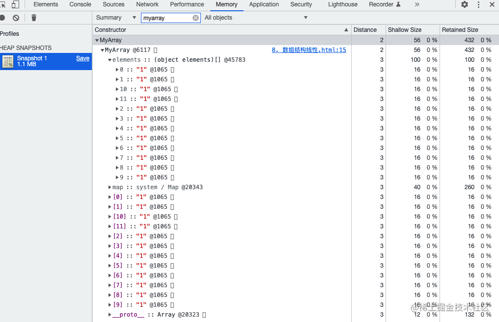
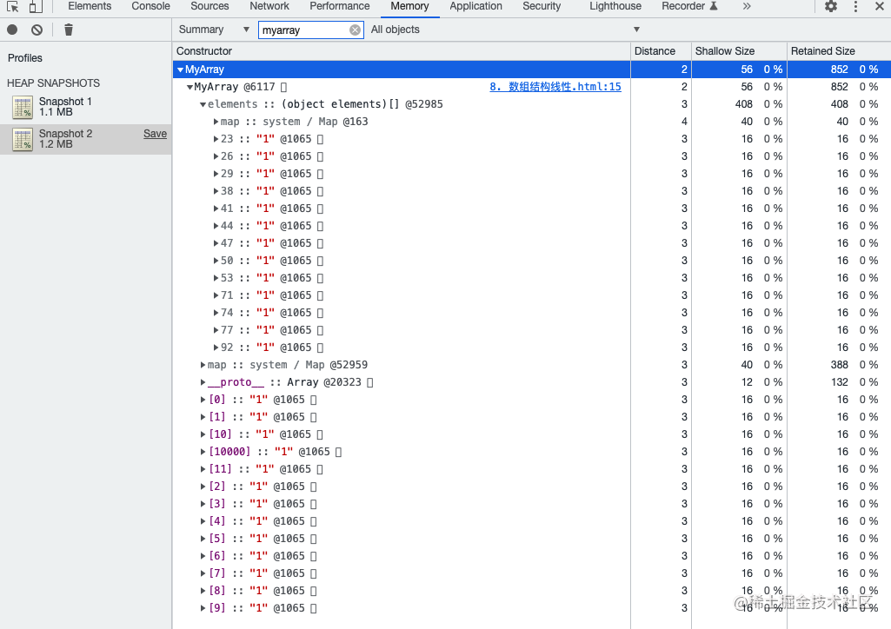

# 05-玩转数组高级技法

## 01：先看2个问题，再一起学习

### 批量制造数据

#### for 循环-(略low)

* 思路：for 循环，push

```javascript
function createData() {
  const data = []
  for (let i = 0; i < 1000; i++) {
    data.push({
      name: `name${i + 1}`,
    })
  }
  return data
}
const data = createData()
console.log(data)
```

#### Array.map

* 思路：创建空数组，然后 map
* 缺点：空数组，没有数据
* 理解：使用 new Array()创建的数组每一项都是 empty, 而 empty 是不参与运算的

```javascript
function createData() {
  return new Array(1000).map((v, i) => ({ name: `name${i + 1}` }))
}
const data = createData()
console.log(data) // [ <1000 empty items> ]
```

#### Array.map + fill

* 思路：创建空数组，填充 null 然后 map
* 缺点：性能变差

```javascript
function createData() {
  return new Array(1000).fill(null).map((v, i) => ({ name: `name${i + 1}` }))
}

const data = createData()
console.log(data)
```

#### Array.from（推荐）

* 思路：Array.from 第二个初始化函数返回数据
* 优点：代码整洁、高效

```javascript
function createData() {
  return Array.from({ length: 1000 }, (v, i) => ({ name: `name${i + 1}` }))
}

const data = createData()
console.log(data)
```

### 数组去重

#### Set

> ES6 的语法，那么 ES5 怎么办

```javascript
const arr1 = [1, 2, 3]
const arr2 = [3, 4, 5]

console.log(new Set([...arr1, ...arr2])) // Set(5) { 1, 2, 3, 4, 5 }
```

#### 非Set

* 思路：for 遍历，indexOf 判断是否存在

```javascript
const arr1 = [1, 2, 3]
const arr2 = [3, 4, 5]

function mergeArray(arr1, arr2) {
  // 克隆
  var arr = arr1.slice(0)
  var v
  for (let i = 0; i < arr2.length; i++) {
    v = arr2[i]
    // 这个操作，
    // 详情参见4.2位运算符的妙用：奇偶数，色值换算，换值， 编码等
    if (~arr.indexOf(v)) {
      continue
    }
    arr.push(v)
  }
  return arr
}

console.log(mergeArray(arr1, arr2)) // [ 1, 2, 3, 4, 5 ]
```

#### 非 Set 的去重 遇到 NaN 会如何 ？

```javascript
const arr1 = [1, 2, 3, NaN]
const arr2 = [3, 4, 5, NaN]

function mergeArray(arr1, arr2) {
  // 克隆
  var arr = [...arr1]
  var v
  for (let i = 0; i < arr2.length; i++) {
    v = arr2[i]
    // 这个操作，
    // 详情参见4.2位运算符的妙用：奇偶数，色值换算，换值， 编码等
    if (~arr.indexOf(v)) {
      continue
    }
    arr.push(v)
  }
  return arr
}

console.log(mergeArray(arr1, arr2))
// [ 1, 2,   3, NaN, 4, 5, NaN ]
```

#### 数组对象去重用 Set 可以吗？

> 不可以

```javascript
const arr1 = [{ id: 1 }, { id: 2 }, { id: 3 }]
const arr2 = [{ id: 3 }, { id: 4 }, { id: 5 }]

console.log(new Set([...arr1, ...arr2]))
// 结果如下
Set(6) {
  { id: 1 },
  { id: 2 },
  { id: 3 },
  { id: 3 },
  { id: 4 },
  { id: 5 }
}
```

#### 数组对象引用去重用 Set 可以吗？

> 可以

```javascript
const obj3 = { id: 3 }
const arr1 = [{ id: 1 }, { id: 2 }, obj3]
const arr2 = [obj3, { id: 4 }, { id: 5 }]

console.log(new Set([...arr1, ...arr2]))
// Set(5) { { id: 1 }, { id: 2 }, { id: 3 }, { id: 4 }, { id: 5 } }
```

#### 对象数组去重-for findIndex

* 思路：for 遍历，find | findIndex 判断是否存在
* 缺点：局限性（目前代码是根据 id 来判断）、性能消耗高（使用find | findIndex消耗高）

```javascript
const arr1 = [{ id: 1 }, { id: 2 }, { id: 3 }]
const arr2 = [{ id: 3 }, { id: 4 }, { id: 5 }]

function mergeArray(arr1, arr2) {
  // 克隆
  var arr = arr1.slice(0)
  var v
  for (var i = 0; i < arr2.length; i++) {
    v = arr2[i]
    // 这个操作，
    // 详情参见4.2位运算符的妙用：奇偶数，色值换算，换值， 编码等
    if (~arr.findIndex((el) => el.id === v.id)) {
      continue
    }
    arr.push(v)
  }
  return arr
}

console.log(mergeArray(arr1, arr2))
// [ { id: 1 }, { id: 2 }, { id: 3 }, { id: 4 }, { id: 5 } ]
```

## 02：深入浅出类数组

### 创建数组的几种方式

* 数组对象字面量
* new Array
* Array.from (ES6)
* Array.of (ES6)
* Array.prototype.slice、Array.prototype.concat 等

```javascript
// 字面量
const arr = [1, 2, 3, ...[4, 5, 6]] // 1,2,3,4,5,6
const arr1 = [, , , , ,] // [empty × 5]
console.log('arr==', arr)
console.log('arr1==', arr1)

// new Array
const arr2 = new Array(1, 2, 3) // 1,2,3
const arr3 = new Array('a') //["a"]
const arr4 = new Array(5) // [empty × 5]
console.log('arr2 new Array==', arr2)
console.log('arr3 new Array==', arr2)
console.log('arr4 new Array==', arr3)

// Array.of
const arr5 = Array.of(5) // [5]
console.log('arr5 Array.of ==', arr5)

// Array.from
const arr6 = Array.from([1, 2, 3]) // [1,2,3]
const arr7 = Array.from({ length: 3 }, function (value, index) {
  return index + 1
}) // [1,2,3]
const arr8 = Array.from({ 0: 'a', 1: 'b', 2: 'c', length: 3 }) // ["a", "b", "c"]
console.log('arr6 Array.from ==', arr6)
console.log('arr7 Array.from ==', arr7)
console.log('arr8 Array.from ==', arr8)

// Array.prototype.slice
const arr9 = Array.prototype.slice.call(document.querySelectorAll('div')) // [div, div, div....]
console.log('arr9 Array.prototype.slice ==', arr9)
// Array.prototype.concat
const arr10 = Array.prototype.concat.call([], [1, 2, 3]) // [1,2,3]
console.log('arr9 Array.prototype.concat ==', arr10)
```

### 什么是类数组

> 是有一个 length 属性和**从零开始索引的属性**，但是没有 Array 的内置方法，比如 forEach 和 map 等一种特殊对象

#### 类数组特征

* 是一个普通对象
* 必须有 length 属性，可以有非负整数索引
* 本身不具备数组所具备的方法

```javascript
const arrayLike = {
  0: 'a',
  1: 'b',
  4: '124',
  name: 'test',
  length: 3,
  push: Array.prototype.push, //自己实现
  splice: Array.prototype.splice,
}

console.log(arrayLike[0]) //"a"

// 由于类数组对象length属性声明了对象有多少个属性,所以可以使用for遍历对象属性:
for (let i = 0; i < arrayLike.length; i++) {
  console.log(arrayLike[i])
}

// 非类数组
const obj = {
  0: 'a',
  1: 'b',
  2: 'c',
}
```

### 常见的类数组

#### arguments 对象

```javascript
function person(name, age, sex) {
  console.log('person arguments:', arguments)
  console.log('person type::', Object.prototype.toString.call(arguments))
}
person('name', 'age', 'sex')
```

#### DOM

* NodeList, HTMLCollection, DOMTokenList 等

```javascript
//Dom 方法的返回结果
var domList = document.querySelectorAll('.s-center-box')
console.log('querySelectorAll type::', Object.prototype.toString.call(domList))
```

#### 奇特-字符串

* 字符串：具备类数组的所有特性，**但是类数组一般是指对象**

```javascript
// 字符串
var str = 'abc'
console.log(Array.from(str))
```

### 类数组和数组的区别

| 方法          | 数组              | 类数组             |
| ------------- | ----------------- | ------------------ |
| toString 返回 | [object Array]    | [object Object]    |
| instanceof    | Array             | Object             |
| constructor   | [Fucntion: Array] | [Fcuntion: Object] |
| Array.isArray | true              | false              |

```javascript
function person(name, age, sex) {
  console.log('类数组 type::', Object.prototype.toString.call(arguments))
  console.log('类数组 instanceof object::', arguments instanceof Object)
  console.log('类数组 constructor::', arguments.constructor)
  console.log('类数组 isArray::', Array.isArray(arguments))
}
person('name', 'age', 'sex')

const array = ['name', 'age', 'sex']
console.log('数组 type::', Object.prototype.toString.call(array))
console.log('数组 instanceof array::', array instanceof Array)
console.log('数组 constructor::', array.constructor)
console.log('数组 isArray::', Array.isArray(array))
// 结果如下
类数组 type:: [object Arguments]
类数组 instanceof object:: true
类数组 constructor:: [Function: Object]
类数组 isArray:: false

数组 type:: [object Array]
数组 instanceof array:: true
数组 constructor:: [Function: Array]
数组 isArray:: true
```

### 代码判断类数组

```javascript
//使用 isFinite() 在检测无穷数：
function isArrayLikeObject(arr) {
  const typeStr = typeof arr
  // if (typeStr === 'string') {
  //     return true
  // }
  if (arr == null || typeStr !== 'object') return false

  const lengthMaxValue = Math.pow(2, 53) - 1
  if (!Object.prototype.hasOwnProperty.call(arr, 'length')) return false
  if (typeof arr.length != 'number') return false
  if (!isFinite(arr.length)) return false
  if (Array === arr.constructor) return false

  if (arr.length >= 0 && arr.length < lengthMaxValue) {
    return true
  } else {
    return false
  }
}

console.log('arr==', isArrayLikeObject(null))

const arr = { 0: 1, 2: 3, length: 2 }
console.log('arr==', isArrayLikeObject(arr))

const arr1 = { 0: 1, 2: 3, length: '' }
console.log('arr==', isArrayLikeObject(arr1))

const arr2 = { 0: 1, 2: 3 }
console.log('arr==', isArrayLikeObject(arr2))

const arr3 = [1, 2]
console.log('arr==', isArrayLikeObject(arr3))

// 结果如下
arr== false
arr== true
arr== false
arr== false
arr== false
```

### 类数组转换为数组

#### Array.prototype.slice、concat等

#### Array.from

#### Array.applay

#### 复制遍历

```javascript
// Array.prototype.slice、concat等
// 类数组
const arrayLikeObj = {
  length: 2,
  0: 1,
  1: 2,
}
const array1 = Array.prototype.slice.call(arrayLikeObj)
console.log(array1) // [ 1, 2 ]

const array2 = Array.prototype.concat.apply([], arrayLikeObj)
console.log(array2) // [ 1, 2 ]
```

```javascript
// Array.from
// 类数组
const arrayLikeObj = {
  length: 2,
  0: 1,
  1: 2,
}
console.log(Array.from(arrayLikeObj)) // [1,2]

const str = 'abc'
console.log(Array.from(str)) // [ 'a', 'b', 'c' ]
```

```javascript
// Array.apply
var arrayLike = {
  length: 2,
  0: 1,
}

console.log(Array.apply(null, arrayLike)) 
// [ 1, undefined ]
```

```javascript
// 遍历复制
var arr = []
var arrayLikeObj = {
  length: 2,
  0: 1,
  1: 2,
}

for (let i = 0; i < arrayLikeObj.length; i++) {
  arr[i] = arrayLikeObj[i]
}

console.log(arr) //  [1, 2]
```

```javascript
// Symbol.iterator
// 借用其他数组的Symbol.iterator
var arrayLikeObj = {
  length: 2,
  0: 1,
  1: 2,
  [Symbol.iterator]: [][Symbol.iterator],
}
console.log([...arrayLikeObj]) // [1,2]

// 自己实现一个 Symbol.iterator

var arrayLikeObj = {
  length: 2,
  0: 1,
  1: 2,
  [Symbol.iterator]() {
    const self = this
    let index = 0
    return {
      next() {
        if (index < self.length) {
          return {
            value: self[index++],
            done: false,
          }
        }
        return { value: undefined, done: true }
      },
    }
  },
}

console.log([...arrayLikeObj]) // [1, 2]
```

### 总结

| 方法/特征     | 数组             | 类数组            |
| ------------- | ---------------- | ----------------- |
| 自带方法      | 多个方法         | 五                |
| length 属性   | 有               | 有                |
| toString 返回 | [object Array]   | [object Object]   |
| instanceof    | Array            | Object            |
| constructor   | [Function Array] | [Function Object] |
| Array.isArray | true             | false             |

## 03: 数组方法使用注意事项

### 各个数组的长度是多少

```javascript
const arr1 = [1]
const arr2 = [1, ,]
const arr3 = new Array('10')
const arr4 = new Array(10)

console.log('arr1 length: ' + arr1.length)
console.log('arr2 length: ' + arr2.length)
console.log('arr3 length: ' + arr3.length)
console.log('arr4 length: ' + arr4.length)

// 结果如下 
arr1 length: 1
arr2 length: 2
arr3 length: 1
arr4 length: 10
```

### 数组空元素 empty

* empty: 数组的空位，指数组的某一位置没有任何值。简单来说，就是数组上没有对应的属性
* 一般的遍历，自动跳过空位，forEach reduce 等

```javascript
const arr2 = [1, ,]

console.log('arr2', arr2)
// arr2 [ 1, <1 empty item> ]
```

#### 基于值进行运算，空位的值作为 undefined

* find findIndex includes等，indexOf 除外
* 被作为迭代的时候，参与 Object.entries、扩展运算符、for.of 等

```javascript
const arr = [1, ,]
console.log('arr:', arr) 
// arr: [ 1, <1 empty item> ]

// 长度
console.log('arr.length:', arr.length)
// arr.length: 2

// 键
console.log('keys', Object.keys(arr))
// keys [ '0' ]

// empty 空位的值为undefined
console.log('0:', arr[0], ',1:', arr[1])
// 0: 1 ,1: undefined

// 怎么判断空位
console.log('hasOwn:0', Object.prototype.hasOwnProperty.call(arr, '1'))
// hasOwn:0 false

console.log('hasOwn:1', Object.prototype.hasOwnProperty.call(arr, '1'))
// hasOwn:1 false
```

#### Join 和 toString，空位怎么处理

> toString 会调用内部 join 方法

* 视为空字符串

```javascript
const arr = [1, , 3]

// 基于键遍历
arr.forEach(function (v, index) {
  console.log('forEach:', v)
})

// 基于值运算
const index = arr.findIndex((v) => v === undefined)
// forEach: 1
// forEach: 3

console.log('findIndex:', index)
// findIndex: 1

console.log('join:', arr.toString())
// join: 1,,3
```

### 稀疏数组

* 有空元素的数组，就是稀疏数组

#### 如何避免创建稀疏数组

* Array.appy(null, Array(3))
* [...new Array(3)]
* Array.from(new Array(3))

### 数组不会自动添加分号

* (, [, +, -, /, 其作为一行代码的开头，很可能产生意外的情况，所以，没事代码最后写个分号，保准没错

```javascript
const objA = { a: 1 }['a']
console.log(objA) // 1

const objB = ['a']['a']
console.log(objB) // undefined


var a = [[1, 2], 2, 3]
console.log(a) // [ [ 1, 2 ], 2, 3 ]
;[0, 2, 3].map((v) => console.log(v * v)) // 去掉分号就回报异常
console.log(a) // 0 4 9 

// =>
// var a = [[1,2],2,3]
// console.log(a);
// [0,2,3].map(v=> console.log(v*v))
// console.log(a)
```

### indexOf 与 includes

| 方法     | 返回值  | 是否能查找NaN | [...] | undefined |
| -------- | ------- | ------------- | ----- | --------- |
| indexOf  | number  | 否            | 否    | 可        |
| includes | boolean | 可            | 可    | 可        |

```javascript
const array1 = [NaN]
console.log('array.includes NaN:', array1.includes(NaN))
console.log('array.indexOf NaN:', array1.indexOf(NaN) > -1)

const array2 = [1, ,]
console.log('array.includes ,,:', array2.includes(undefined))
console.log('array.indexOf ,,:', array2.indexOf(undefined) > -1)

const array3 = [undefined]
console.log('array.includes undefined:', array3.includes(undefined))
console.log('array.indexOf undefined:', array3.indexOf(undefined) > -1)

// 运行结果如下
array.includes NaN: true
array.indexOf NaN: false
array.includes ,,: true
array.indexOf ,,: false
array.includes undefined: true
array.indexOf undefined: true
```

### 数组可变长度问题

* length 代表数组中元素个数，数组额外附加属性不计算在内
* length 可写，可以通过修改 length 改变数组的长度
* 数组操作不存在越界，找不到下标，返回 undefined

```javascript
const array = [1, 2, 3, 4, 5, 6]
array[10] = 10
console.log('array.length:', array.length)

array['test'] = 11
console.log('array.length:', array.length)

array.length = 3
console.log('array.length:', array.length)

console.log('array.length:', array.length)
console.log('array value:', array[Number.MAX_VALUE + 1000])

// 打印如下
array.length: 11
array.length: 11
array.length: 3
array.length: 3
array value: undefined
```

### 数组查找或者过滤

| 方法      | 返回结果类型        | 是否短路操作 | 是否全部满足 | 遍历空元素 |
| --------- | ------------------- | ------------ | ------------ | ---------- |
| some      | boolean             | 可           | 不可         | 不可       |
| find      | undefined \| object | 可           | 不可         | 可         |
| findIndex | numebr              | 可           | 不可         | 可         |
| every     | boolean             | 可           | 可           | 不可       |
| filter    | array               | 不可         | 不可         | 不可       |

```javascript
const array = [
  { name: '张三', age: 15 },
  ,
  { name: '李四', age: 25 },
  { name: '王五', age: 36 },
]

//some
const isExist = array.some((item, index, arr) => {
  console.log('some index:', index)
  return item && item.age > 24
})
console.log('array some:', isExist)

//find
const item = array.find((item, index, arr) => {
  console.log('find index:', index)
  return item && item.age > 24
})
console.log('array find:', item)

//findIndex
const index = array.findIndex((item, index, arr) => {
  console.log('findIndex index:', index)
  return item && item.age > 24
})
console.log('array findIndex:', index)

//every
const isAll = array.every((item, index, arr) => {
  console.log('every index:', index)
  return item && item.age > 15
})
console.log('array every:', isAll)

const result = array.filter((item, index, arr) => {
  console.log('filter index:', index)
  return item && item && item.age > 24
})
console.log('array filter:', result)
```

### 改变自身的方法

* pop、shift、splice 
* unshift、push、sort、reverse
* ES6: copyWithin、fill

```javascript
let array = [1, 2, 3, 4, 5, 6, 7]

array.pop()
console.log('array pop:', array)

array.shift()
console.log('array shift:', array)

array.unshift('unshift')
console.log('array unshift:', array)

array.push('push')
console.log('array push:', array)

array.reverse()
console.log('array reverse:', array)

array.sort()
console.log('array sort:', array)

array.splice(2, 1)
console.log('array splice:', array)

array.copyWithin(2, 0)
console.log('array copyWithin:', array)

array.fill('fill', 3)
console.log('array fill:', array)
```

### sort 注意事项

* 默认按照 ASII 码先后书写顺序排序（10排在2前面）

```javascript
const array = [1, 2, 3, 4, 5, 6, 7, 8, 9, 10]
array.sort()
console.log('array sort:', array)
// array sort: [ 1, 10, 2, 3, 4, 5,  6, 7, 8, 9 ]
console.log('10:'.charCodeAt()) // 49
console.log('1:'.charCodeAt()) // 49
```

### 数组操作非线性存储问题

* 数组默认存储为线性存储
* 存储结构改变必然产生不必要代价，我们尽量线性增加

```html
// 以下代码会破坏 数组的线性存储
<!DOCTYPE html>
<html lang="en">
<head>
	<meta charset="UTF-8">
	<meta http-equiv="X-UA-Compatible" content="IE=edge">
	<meta name="viewport" content="width=device-width, initial-scale=1.0">
	<title>Document</title>
</head>

<body>
	<script>
		class MyArray extends Array {
			constructor() {
				super(...arguments)
			}
		};
		var myArray = new MyArray()
		myArray[0] = "1"
		myArray[1] = "1"
		myArray[2] = "1"
		myArray[3] = "1"
		myArray[4] = "1"
		myArray[5] = "1"
		myArray[6] = "1"
		myArray[7] = "1"
		myArray[8] = "1"
		myArray[9] = "1"
		myArray[10] = "1"
		myArray[11] = "1"
		console.log(myArray)
		function operation() {
			myArray[10000] = "1"
			console.log("myArray[10000]:", myArray)
		}

	</script>
	<button onclick="operation()">操作</button>
</body>
</html>
```

运行代码至浏览器中，可以看到如下操作前的快照如下



点击操作按钮后，快照如下（顺序已经被打乱了）



### delete 误区

* delete 删除数组元素，后面元素不会补齐，delete 删除引用

```javascript
const array = [1, 2, 3, 4, 5]
delete array[2]
console.log('delete array:', array)
// delete array: [ 1, 2, <1 empty item>, 4, 5 ]
```

### push VS concat

* concat 会返回新的数组，而 push 不会
* concat 数据量大时候更加消耗性能，所以推荐使用 push

```javascript
const count = 10000
const array1 = [1, 2, 4, 5, 6]

let newArray = []

console.time('push')
for (let i = 0; i < count; i++) {
  newArray.push(array1[0], array1[1], array1[2], array1[3], array1[4])
}
console.timeEnd('push')

console.time('concat')
for (let i = 0; i < count; i++) {
  newArray = newArray.concat(
    array1[0],
    array1[1],
    array1[2],
    array1[3],
    array1[4],
  )
}
console.timeEnd('concat')
// 结果如下: 性能差异很大啊
push: 4.615ms
concat: 7.116s
```

## 04：数组高级用法（上）

### 万能数据生成器

```javascript
const createValues = (creator, length = 10) => Array.from({ length }, creator)
```

#### 随机数生成器

```javascript
const createRandomValues = (len) => createValues(Math.random, len)
const values = createRandomValues()
console.log('values:', values.length, values)
```

#### 序列生成器

```javascript
const createValues = (creator, length = 10) => Array.from({ length }, creator)

const createRange = (start, stop, step) => createValues((_, i) => start + i * step, (stop - start) / step + 1)
const values = createRange(1, 100, 3)
console.log(values)
// [ 1,  4,  7, 10, 13, 16, 19, 22, 25, 28, 31, 34, 37, 40, 43, 46, 49, 52, 55, 58, 61, 64, 67, 70, 73, 76, 79, 82, 85, 88, 91, 94, 97, 100 ]
```

#### 数据生成器

```javascript
const createValues = (creator, length = 10) => Array.from({ length }, creator)

function createUser(v, index) {
  return {
    name: `user-${index}`,
    age: (Math.random() * 100) >> 0,
  }
}
const users = createValues(createUser, 1000)
console.log('users:', users)
```

### 清空数组

* Array.prototype.splice(0)
* Array.prototype.length = 0

```javascript
const arr = [1, 2, 3]
arr.splice(0)
console.log('splice:', arr)

const arr1 = [1, 2, 3]
arr1.length = 0
console.log('length:', arr1)

// 结果如下
splice: []
length: []
```

### 数组去重

* Array.from(new Set(arr))
* 问题：对于属性健和属性值都相同的对象没有作用
* Array.prototype.filter + key 唯一
  * 问题：如何确保 key 唯一

```javascript
// Set 去重
const arr = [
  'apple',
  'banana',
  1,
  1,
  3,
  3,
  undefined,
  undefined,
  ,
  ,
  NaN,
  NaN,
  null,
  null,
  'true',
  true,
  { a: 1 },
]

const arr1 = Array.from(new Set(arr))
console.log('set:', arr1)

// 结果如下
set: [ 'apple', 'banana', 1, 3, undefined, NaN, null, 'true', true, { a: 1 } ]
```

```javascript
// Set 去重2
function uniqueArray(arr) {
  return Array.from(new Set(arr))
}

const arr = [{ a: 1 }, { a: 1 }]
console.log('set 不同引用：', uniqueArray(arr))

const obj1 = { a: 1 }
const arr2 = [obj1, obj1]
console.log('set 同一引用：', uniqueArray(arr2))

// 结果如下
set 不同引用： [ { a: 1 }, { a: 1 } ]
set 同一引用： [ { a: 1 } ]
```

```javascript
// 数组去重
function uniqueArray(arr = [], key) {
  const keyValues = new Set()
  let val
  return arr.filter((obj) => {
    val = obj[key]
    if (keyValues.has(val)) {
      return false
    }
    keyValues.add(val)
    return true
  })
}

var arr = [{ a: 1 }, { a: 1 }, { a: 2 }]
console.log('filter 去重：', uniqueArray(arr, 'a'))
// filter 去重： [ { a: 1 }, { a: 2 } ]
```

### 求交集

* Arry.prototype.filter + includes 判断
* 问题：
  * 引用类型相同的判断
  * 性能问题
* 引用类型：Array.prototype.forEach + Map + key 唯一
* 基础数据：Array.prototype.forEach + Map + filter

```javascript
// 别人的代码:Arry.prototype.filter + includes 
const arr1 = [0, 1, 2]
const arr2 = [3, 2, 0]

function intersectSet(arr1, arr2) {
  return [...new Set(arr1)].filter((item) => arr2.includes(item))
}
const values = intersectSet(arr1, arr2)
console.log(values) // [ 0, 2 ]
```

```javascript
// 优化
// 引用类型
function intersect(arr1, arr2, key) {
  const map = new Map()
  arr1.forEach((val) => map.set(val[key]))

  return arr2.filter((val) => {
    return map.has(val[key])
  })
}

// 原始数据类型
function intersectBase(arr1, arr2) {
  const map = new Map()
  arr1.forEach((val) => map.set(val))

  return arr2.filter((val) => {
    return map.has(val)
  })
}

var arr1 = [{ p: 0 }, { p: 1 }, { p: 2 }]
var arr2 = [{ p: 3 }, { p: 2 }, { p: 1 }]
const result = intersect(arr1, arr2, 'p')
console.log('result:', result)

const arr3 = [0, 1, 2]
const arr4 = [3, 2, 0]
const result1 = intersectBase(arr3, arr4)
console.log('result1:', result1)

// 结果如下：
result: [ { p: 2 }, { p: 1 } ]
result1: [ 2, 0 ]
```

### 求交集性能对比

| 数组长度 | intersectSet(ms) | intersecBase(ms) |
| -------- | ---------------- | ---------------- |
| 1000     | 0.714            | 0.231            |
| 10000    | 58.058           | 2.106            |
| 100000   | 5221.376         | 24215            |

```javascript
function intersectSet(arr1, arr2) {
  return [...new Set(arr1)].filter((item) => arr2.includes(item))
}

// 原始数据类型
function intersectMap(arr1, arr2) {
  const map = new Map()
  arr1.forEach((val) => map.set(val))

  return arr2.filter((val) => {
    return map.has(val)
  })
}

function createData(length) {
  return Array.from({ length }, (val, i) => {
    return ~~(Math.random() * length)
  })
}

console.time('createData')
var data1 = createData(100000)
var data2 = createData(100000)
console.timeEnd('createData')

console.time('intersectSet')
intersectSet(data1, data2)
console.timeEnd('intersectSet')

console.time('intersectBase')
intersectMap(data1, data2)
console.timeEnd('intersectBase')

// 结果如下
createData: 24.611ms
intersectSet: 4.741s
intersectBase: 21.625ms
```

### 求差集

* 与求交集类似

```javascript
// 引用类型
function difference(arr1, arr2, key) {
  const map = new Map()
  arr1.forEach((val) => map.set(val[key]))

  return arr2.filter((val) => {
    return !map.has(val[key])
  })
}

// 原始数据类型
function differenceBase(arr1, arr2) {
  const map = new Map()
  arr1.forEach((val) => map.set(val))

  return arr2.filter((val) => {
    return !map.has(val)
  })
}

var arr1 = [{ p: 0 }, { p: 1 }, { p: 2 }]
var arr2 = [{ p: 3 }, { p: 2 }, { p: 1 }]
const result = difference(arr1, arr2, 'p')
console.log('result:', result)

const arr3 = [0, 1, 2]
const arr4 = [3, 2, 0]
const result1 = differenceBase(arr3, arr4)
console.log('result1:', result1)

// 结果如下
result: [ { p: 3 } ]
result1: [ 3 ]
```

### 从数组中删除虚值

> 虚值：就是那个转换为布尔值为false的值

* Array.prototype.filter(Boolean)

```javascript
const array = [false, 0, undefined, , '', NaN, 9, true, undefined, null, 'test']
const newArray = array.filter(Boolean)
console.log(newArray) // [ 9, true, 'test' ]
```

### 获取数组中的最大值和最小值

* Math.max.apply(Math, numArray)
* Math.min.apply(Math, numArray)

```javascript
const numArray = [1, 3, 8, 666, 22, 9982, 11, 0]
const max = Math.max.apply(Math, numArray)
const min = Math.min.apply(Math, numArray)
console.log('max:', max + ',min:' + min)
// max: 9982, min:0
```

```javascript
const createValues = (creator, length = 10) => Array.from({ length }, creator)

function createUser(v, index) {
  return {
    name: `user-${index}`,
    age: (Math.random() * 100) >> 0,
  }
}

const users = createValues(createUser, 10)
const ages = users.map((u) => u.age)

const max = Math.max.apply(Math, ages)
const min = Math.min.apply(Math, ages)
console.log(ages)
console.log('max:', max + ',min:' + min)

```

## 05：数组高级用法（下）

### queryString

#### 什么是 queryString

* 作用：页面传递参数
* 规律：地址 url 问号？拼接的键值对

#### queryString 规律

* "?" 之后
* "&" 分割得到一组键值对
* "=" 分割键和值

#### 现代 Web API 查询 queryString

* URLSearchParams

* URL

  > urlObj.searchParams instanceof URLSearchParams // true

```html
<!DOCTYPE html>
<html lang="en">
<head>
  <meta charset="UTF-8">
  <meta http-equiv="X-UA-Compatible" content="IE=edge">
  <meta name="viewport" content="width=device-width, initial-scale=1.0">
  <title>URLSearchParams</title>
</head>

<body>
  <script>
    const urlSP = new URLSearchParams(location.search)
    function getQueryString(key) {
      return urlSP.get(key)
    }
    console.log("words:", getQueryString("words"))  // vue
    console.log("wordss:", getQueryString("wordss"))  // null
  </script>
</body>

</html>
```

```html
// URL
<!DOCTYPE html>
<html lang="en">

<head>
  <meta charset="UTF-8">
  <meta http-equiv="X-UA-Compatible" content="IE=edge">
  <meta name="viewport" content="width=device-width, initial-scale=1.0">
  <title>URL</title>
</head>

<body>
  <script>
    const urlObj = new URL(location.href)
    function getQueryString(key) {
      return urlObj.searchParams.get(key)
    }

    console.log("words:", getQueryString("words")) // vue
    console.log("wordss:", getQueryString("wordss")) // null
  </script>
</body>

</html>
```

```html
// 使用 reduce
<!DOCTYPE html>
<html lang="en">
<head>
  <meta charset="UTF-8">
  <meta http-equiv="X-UA-Compatible" content="IE=edge">
  <meta name="viewport" content="width=device-width, initial-scale=1.0">
  <title>reduce</title>
</head>
<body>
  <script>
    const urtObj = location.search.slice(1)
      .split("&")
      .filter(Boolean)
      .reduce(function (obj, cur) {
        var arr = cur.split("=")
        if (arr.length != 2) {
          return obj
        }
        obj[decodeURIComponent(arr[0])] = decodeURIComponent(arr[1])
        return obj
      }, {})

    function getQueryString(key) {
      return urtObj[key]
    }
    console.log("words:", getQueryString("words")) // vue
    console.log("wordss:", getQueryString("wordss")) // null

  </script>
</body>
</html>
```

### 举个例子：折上折

* 优惠1: 9折
* 优惠2：200减50

#### 青铜版

```javascript
function discount(x) {
  return x * 0.9
}

function reduce(x) {
  return x > 200 ? x - 50 : x
}

const print = console.log
// 享受九折
print(reduce(discount(100))) // 90
// 享受九折 + 满减
print(reduce(discount(250))) // 175
```

#### 黄金版

```javascript
function discount(x) {
  return x * 0.9
}
function reduce(x) {
  return x > 200 ? x - 50 : x
}
function getPriceMethod(discount, reduce) {
  return function _getPrice(x) {
    return reduce(discount(x))
  }
}
const method = getPriceMethod(discount, reduce)
const print = console.log

print(method(100)) // 90
print(method(250)) // 175
```

#### 王者版

> 如果再来一个折，上述就需要进行极大的修改，假如我们只需要传入折扣函数，上一个折扣函数的值作为下一个折扣参数的入参值，就极大的提高了可扩展性。那么该如何修改呢？

```javascript
function compose(...funcs) {
  if (funcs.length === 0) {
    return arg => arg
  }
  // 这里通过 reduce 实现函数以此拿上一个函数的返回值作为入参
  // 注意 b(a(...args))) 与 a(b(...args))导致的顺序执行的差异性
  return funcs.reduce((a, b) => (...args) => b(a(...args)))
}

function discount(x) {
  console.log('discount')
  return x * 0.9
}
function reduce(x) {
  console.log('reduce')
  return x > 200 ? x - 50 : x
}
function discountPlus(x) {
  console.log('discountPlus')
  return x * 0.95
}
const getPrice = compose(discount, reduce, discountPlus );
const print = console.log;

print(getPrice(200)) // discount reduce discountPlus 171
print(getPrice(250)) // discount reduce discountPlus 166.25
```

### 例子二：

1. 先进行登录
2. 获取用户信息
3. 通过上一步中的用户 id 获取用户订单

```typescript
// 伪代码
function login(): Promise<any> { }
function getUserInfo(): Promise<any> { }
function getOrders(): Promise<any> { }

function async orders(loginData) {
	const loginRes = await login(loginData)
  const userRes = await login(loginRes)
  const orderRes = await login(userRes)
}
```

```javascript
// 订单：Promise 顺序执行
function runPromises(promiseCreators, initData) {
  return promiseCreators.reduce(function (promise, next) {
    return promise.then((data) => next(data))
  }, Promise.resolve(initData))
}

const initData = { name: 'name', pwd: 'pwd' }

Promise.resolve(initData)
  .then((data) => login(data))
  .then((data) => getUserInfo(data))
  .then((data) => getOrders(data))
  .then((data) => console.log('orders', data))

function login(data) {
  console.log('login: data', data)
  return new Promise((resolve) => {
    setTimeout(() => {
      return resolve({
        token: 'token',
      })
    }, 500)
  })
}

function getUserInfo(data) {
  console.log('getUserInfo: data', data)
  return new Promise((resolve) => {
    setTimeout(() => {
      return resolve({
        name: 'user-1',
        id: 988,
      })
    }, 300)
  })
}

function getOrders(data) {
  console.log('getOrders: data', data)
  return new Promise((resolve) => {
    setTimeout(() => {
      return resolve([
        {
          orderId: 1,
          productId: 100,
          price: 100,
        },
      ])
    }, 100)
  })
}

// runPromises([login, getUserInfo, getOrders],
//     initData)
//     .then(res => {
//         console.log("res", res);
//     })


// 执行结果如下
login: data { name: 'name', pwd: 'pwd' }
getUserInfo: data { token: 'token' }
getOrders: data { name: 'user-1', id: 988 }
orders [ { orderId: 1, productId: 100, price: 100 } ]
```

### 数组分组

* 含义：数据按照某个特性归类

```javascript
const hasOwn = Object.prototype.hasOwnProperty
function group(arr, fn) {
  // 不是数组
  if (!Array.isArray(arr)) {
    return arr
  }
  // 不是函数
  if (typeof fn !== 'function') {
    throw new TypeError('fn必须是一个函数')
  }
  var v
  return arr.reduce((obj, cur, index) => {
    v = fn(cur, index)
    if (!hasOwn.call(obj, v)) {
      obj[v] = []
    }
    obj[v].push(cur)
    return obj
  }, {})
}

// 按照长度分组
let result = group(['apple', 'pear', 'orange', 'peach'], (v) => v.length)
console.log(result)

// 按照份数分组
result = group(
  [
    {
      name: 'tom',
      score: 60,
    },
    {
      name: 'Jim',
      score: 40,
    },
    {
      name: 'Nick',
      score: 88,
    },
  ],
  (v) => v.score >= 60,
)

console.log(result)

// 结算结果如下
{ '4': [ 'pear' ], '5': [ 'apple', 'peach' ], '6': [ 'orange' ] }
{
  true: [ { name: 'tom', score: 60 }, { name: 'Nick', score: 88 } ],
  false: [ { name: 'Jim', score: 40 } ]
}
```

## 06：手写数组的多个方法（上）

### Array.isArray

#### 基本使用

* 作用：确认传递的值是否是一个 Array

  ```javascript
  const arr = ['1']
  
  const log = console.log
  log('isArray:', Array.isArray(arr)) // isArray: true
  ```

#### 非基本使用

```javascript
const arr = ['1']
const proxy = new Proxy(arr, {})
const log = console.log

log('isArray:', Array.isArray(proxy)) // isArray: true
```

原型上的代码示例

```javascript
const arr = ['1']
const proxy = new Proxy(arr, {})
const log = console.log

log('__proto__:', proxy.__proto__ === Array.prototype) // __proto__: true
log('instanceof:', proxy instanceof Array) // instanceof: true
console.log('-------------------')
log('toString', Object.prototype.toString.call(Proxy)) // toString [object Function]
log('Proxy.prototype:', Proxy.prototype) // Proxy.prototype: undefined
log('proxy instanceof Proxy:', proxy instanceof Proxy) // TypeError: Function has non-object prototype 'undefined' in instanceof check
```

#### Proxy 的玄机

* Proxy 是函数，但是本身没有 prototype
* Proxy 不改变被代理对象的外在表现

### Array.isArray-手写推荐写法

* Object.prototype.toString
* typeof + instanceof
* constructor

```javascript
// 手写 toString
Array.isArray = function (obj) {
  return Object.prototype.toString.call(obj) === '[object Array]'
}

const arr = ['1']
const proxy = new Proxy(arr, {})

const log = console.log
log(Array.isArray(arr)) // true
log(Array.isArray(proxy)) // true
```

```javascript
// typeof + instanceof
Array.isArray = function (obj) {
  if (typeof obj !== 'object' || obj === null) {
    return false
  }
  return obj instanceof Array
}

const arr = ['1']
const proxy = new Proxy(arr, {})
const log = console.log
log(Array.isArray(arr)) // true
log(Array.isArray(proxy)) // true
```

#### Array.isArray 其他实现思路

| 方法               | 基础数据 | 引用关系 | 注意事项                 |
| ------------------ | -------- | -------- | ------------------------ |
| typeof             | 可       | 不可     | NaN, object document.all |
| constructor        | 可(部分) | 不可     | 可以被改写               |
| instanceof         | 不可     | 可       | 右边构造函数 或者 class  |
| isPrototypeOf      | 不可     | 可       |                          |
| toString           | 可       | 可       | 小心内置原型             |
| 鸭子类型           |          | 可       | 不得以或者兼容           |
| Symbol.toStringTag | 不可     | 可       | 识别自定义类型           |
| 等比较             | 可       | 可       | 特殊对象                 |

### Array.prototype.entries 

#### 基本使用

* 作用：返回一个新的 Aray Iterator 对象，该对象包含数组中每个索引的键值/对

```javascript
const arr = [1, undefined, null, {}]

console.log(arr.entries())
// next访问
const iter = arr.entries()
console.log('next:', iter.next())

// for of迭代
for (let [k, v] of arr.entries()) {
  console.log(k, v)
}

// 打印信息如下
Object [Array Iterator] {}
next: { value: [ 0, 1 ], done: false }
0 1
1 undefined
2 null
3 {}
```

#### entries next 返回

```javascript
const arr = [1, 2, 3]

const iter = arr.entries()

console.log('iter.next():', iter.next())
console.log('iter.next():', iter.next())
console.log('iter.next():', iter.next())
console.log('iter.next():', iter.next())

// 打印如下
iter.next(): { value: [ 0, 1 ], done: false }
iter.next(): { value: [ 1, 2 ], done: false }
iter.next(): { value: [ 2, 3 ], done: false }
iter.next(): { value: undefined, done: true }
```

#### entries iterator next

```javascript
Array.prototype.entries = function () {
  const O = Object(this)
  let index = 0
  const length = O.length
  return {
    next() {
      if (index < length) {
        return { value: [index, O[index++]], done: false }
      }
      return { value: undefined, done: true }
    },
  }
}

const arr = [1, 2, 3]

const iter = arr.entries()
console.log('iter.next().value:', iter.next().value)
console.log('iter.next().value:', iter.next().value)
console.log('iter.next().value:', iter.next().value)

for (let [k, v] of arr.entries()) {
  console.log(`k:${k}`, `v:${v}`)
}

// 打印如下
iter.next().value: [ 0, 1 ]
iter.next().value: [ 1, 2 ]
iter.next().value: [ 2, 3 ]

TypeError: arr.entries is not a function or its return value is not iterable
```

#### entries iterator symbol

```javascript
Array.prototype.entries = function () {
  const O = Object(this)
  let index = 0
  const length = O.length

  function next() {
    if (index < length) {
      return { value: [index, O[index++]], done: false }
    }
    return { value: undefined, done: true }
  }
  return {
    next,
    [Symbol.iterator]() {
      return {
        next,
      }
    },
  }
}

const arr = [1, 2, 3]

const iter = arr.entries()
console.log('iter.next().value:', iter.next().value)
console.log('iter.next().value:', iter.next().value)
console.log('iter.next().value:', iter.next().value)

for (let [k, v] of arr.entries()) {
  console.log(`k:${k}`, `v:${v}`)
}


// 打印如下
iter.next().value: [ 0, 1 ]
iter.next().value: [ 1, 2 ]
iter.next().value: [ 2, 3 ]
k:0 v:1
k:1 v:2
k:2 v:3
```

#### entries iterator proto

```javascript
Array.prototype[Symbol.iterator] = function () {
  const O = Object(this)
  let index = 0
  const length = O.length

  function next() {
    if (index < length) {
      return { value: O[index++], done: false }
    }
    return { value: undefined, done: true }
  }

  return {
    next,
  }
}

Array.prototype.entries = function () {
  const O = Object(this)
  const length = O.length
  var entries = []

  for (var i = 0; i < length; i++) {
    entries.push([i, O[i]])
  }

  const itr = this[Symbol.iterator].bind(entries)()
  return {
    next: itr.next,
    [Symbol.iterator]() {
      return itr
    },
  }
}

Array.prototype.keys = function () {
  const O = Object(this)
  const length = O.length
  var keys = []

  for (var i = 0; i < length; i++) {
    keys.push([i])
  }

  const itr = this[Symbol.iterator].bind(keys)()
  return {
    next: itr.next,
    [Symbol.iterator]() {
      return itr
    },
  }
}

const arr = [1, 2, 3]

var iter = arr.entries()
console.log('iter.next().value:', iter.next().value)
console.log('iter.next().value:', iter.next().value)
console.log('iter.next().value:', iter.next().value)

for (let [k, v] of arr.entries()) {
  console.log(`k:${k}`, `v:${v}`)
}

var iter = arr.keys()
console.log('iter.next().value:', iter.next().value)
console.log('iter.next().value:', iter.next().value)
console.log('iter.next().value:', iter.next().value)

for (let k of arr.keys()) {
  console.log(`k:${k}`)
}

// 打印如下
iter.next().value: [ 0, 1 ]
iter.next().value: [ 1, 2 ]
iter.next().value: [ 2, 3 ]
k:0 v:1
k:1 v:2
k:2 v:3
iter.next().value: [ 0 ]
iter.next().value: [ 1 ]
iter.next().value: [ 2 ]
k:0
k:1
k:2
```

#### 考察知识点

* 迭代器的本质和实现
* ES6 Symbol 符号
* 逻辑复用

### Array.prototype.includes

#### 基本用法

```javascript
const arr = [1, 2, 3, { a: 1 }, null, undefined, NaN, '']

console.log('includes null:', arr.includes(null))
console.log('indexOf null:', arr.indexOf(null))
console.log('includes NaN:', arr.includes(NaN))
console.log('indexOf NaN:', arr.indexOf(NaN))

// 打印如下
includes null: true
indexOf null: 4
includes NaN: true
indexOf NaN: -1
```

#### 手写实现

```javascript
Number.isNaN = function (param) {
  if (typeof param === 'number') {
    return isNaN(param)
  }
  return false
}

Array.prototype.includes = function (item, fromIndex) {
  // call, apply调用，严格模式
  if (this == null) {
    throw new TypeError('无效的this')
  }
  var O = Object(this)

  var len = O.length >> 0
  if (len <= 0) {
    return false
  }

  const isNAN = Number.isNaN(item)
  for (let i = 0; i < len; i++) {
    if (O[i] === item) {
      return true
    } else if (isNAN && Number.isNaN(O[i])) {
      return true
    }
  }
  return false
}

const obj = { a: 3 }
const arr = [1, 2, 3, { a: 1 }, null, undefined, NaN, '', 0, obj, obj]

console.log('includes null:', arr.includes(null))
console.log('includes NaN:', arr.includes(NaN))

// 打印如下
includes null: true
includes NaN: true
```

#### .includes 第二个参数

[相关协议：https://tc39.es/ecma262/#sec-properties-of-the-array-prototype-object](https://tc39.es/ecma262/#sec-properties-of-the-array-prototype-object)

* 转为整数：ToIntegerOrInfinity
* +Infinity, -Infinity
* 可以是负数

```javascript
Number.isNaN = function (params) {
  if (typeof params === 'number') {
    return isNaN(params)
  }
  return false
}

function ToIntegerOrInfinity(argument) {
  var num = Number(argument)
  // + 0 和 -0
  if (Number.isNaN(num) || num == 0) {
    return 0
  }
  if (num === Infinity || num == -Infinity) {
    return num
  }
  var inter = Math.floor(Math.abs(num))
  if (num < 0) {
    inter = -inter
  }
  return inter
}

Array.prototype.includes = function (item, fromIndex) {
  // call, apply调用，严格模式
  if (this == null) {
    throw new TypeError('无效的this')
  }
  var O = Object(this)

  var len = O.length >> 0
  if (len <= 0) {
    return false
  }

  var n = ToIntegerOrInfinity(fromIndex)
  if (fromIndex === undefined) {
    n = 0
  }
  if (n === +Infinity) {
    return false
  }
  if (n === -Infinity) {
    n = 0
  }

  var k = n >= 0 ? n : len + n
  if (k < 0) {
    k = 0
  }

  const isNAN = Number.isNaN(item)
  for (let i = k; i < len; i++) {
    if (O[i] === item) {
      return true
    } else if (isNAN && Number.isNaN(O[i])) {
      return true
    }
  }
  return false
}

const arr = ['a', 'b', 'c']
console.log('arr include -100->0:', arr.includes('c', -100))
console.log('arr include -100->0:', arr.includes('a', -1))
console.log('arr include 1:', arr.includes('a', -Infinity))
console.log('arr include 1:', arr.includes('a', Infinity))

// 打印如下
arr include -100->0: true
arr include -100->0: false
arr include 1: true
arr include 1: false
```

#### 考察知识点

* 协议标准
* Infinity 无穷
* 特殊值 NaN

### Array.from

* 第一次参数 arrayLike: 类数组对象 或者 可遍历对象（Map,Set）等
* 第二个参数：mapFn 可选参数，在最后生成数组后执行一次 map 方法后返回
* 第三个参数：thisArg 可选参数，实际是 Array.from(obj).map(mapFn, thisArg)

#### 特殊值的处理如下

```javascript
console.log('Array.from:', Array.from({}))
console.log('Array.from:', Array.from(''))
console.log('Array.from:', Array.from({ a: 1, length: '10' }))
console.log('Array.from:', Array.from({ a: 1, length: 'ss' }))
console.log('Array.from:', Array.from([NaN, null, undefined, 0]))

// console.log("Array.from:", Array.from({ 0: 1, 1: 2, length: max - 1 }));
// console.log("Array.from:", Array.from({ 0: 1, 1: 2, length: max }));
console.log('Array.from: end')

// 打印如下
Array.from: []
Array.from: []
Array.from: [
  undefined, undefined,
  undefined, undefined,
  undefined, undefined,
  undefined, undefined,
  undefined, undefined
]
Array.from: []
Array.from: [ NaN, null, undefined, 0 ]
Array.from: end
```

#### 数组大小验证

```javascript
const max = Math.pow(2, 32)
console.log('Array.from:', Array.from({ 0: 1, 1: 2, length: max - 1 }))
console.log('Array.from:', Array.from({ 0: 1, 1: 2, length: max }))
```

#### 实现

```javascript
//类数组的特征
var maxSafeInteger = Math.pow(2, 32) - 1

var ToIntegerOrInfinity = function (value) {
  var number = Number(value)
  if (isNaN(number)) {
    return 0
  }
  if (number === 0 || !isFinite(number)) {
    return number
  }
  return (number > 0 ? 1 : -1) * Math.floor(Math.abs(number))
}

var ToLength = function (value) {
  var len = ToIntegerOrInfinity(value)
  return Math.min(Math.max(len, 0), maxSafeInteger)
}

var isCallable = function (fn) {
  return typeof fn === 'function' || toStr.call(fn) === '[object Function]'
}

Array.from = function (arrayLike, mapFn, thisArg) {
  var C = this
  //判断对象是否为空
  if (arrayLike == null) {
    throw new TypeError(
      'Array.from requires an array-like object - not null or undefined',
    )
  }
  //检查mapFn是否是方法
  if (typeof mapFn !== 'function' && typeof mapFn !== 'undefined') {
    throw new TypeError(mapFn + 'is not a function')
  }
  var items = Object(arrayLike)
  //判断 length 为数字，并且在有效范围内。
  var len = ToLength(items.length)
  if (len <= 0) return []
  var A = isCallable(C) ? Object(new C(len)) : new Array(len)
  for (var i = 0; i < len; i++) {
    var value = items[i]
    if (mapFn) {
      A[i] =
        typeof thisArg === 'undefined'
          ? mapFn(value, i)
          : mapFn.call(thisArg, value, i)
    } else {
      A[i] = value
    }
  }
  return A
}

// console.log("Array.from:", Array.from({ a: 1, length: "10" }));
// console.log("Array.from:", Array.from({ a: 1, length: "ss" }));

// console.log("Array.from:", Array.from({ 0: 1, 1: 2, 4: 5, length: 4 }, x => x + x));

function MyArray(length) {
  const len = length * 2
  return new Array(len)
}

function MyObject(length) {
  return {
    length,
  }
}

console.log('Array.from:MyArray', Array.from.call(MyArray, { length: 5 }))
console.log('Array.from:MyObject', Array.from.call(MyObject, { length: 5 }))

```

#### 注意点

* 类数组的特征
* length 为字符串的处理
* from 函数本身 this 也是可以被改写的

### Array.prototype.flat

#### 基本功能

* 指定的深度递归遍历数组，并将所有元素与遍历到的子数组中的元素合并为一个新数组返回

```javascript
const array = [1, 3, 4, [4, 5], [6, [7, 8]], [, ,], [undefined, null, NaN]]

console.log('flat 1:', array.flat(1))
console.log('flat 2:', array.flat(2))
// 打印如下
flat 1: [ 1, 3, 4, 4, 5, 6, [ 7, 8 ], undefined, null, NaN ]
flat 2: [ 1, 3, 4, 4, 5, 6, 7, 8, undefined, null, NaN ]
```

#### 网络版本

> 存在的问题：
>
> 1：躺平的深度不够
>
> 2：性能如何呢？
>
> 3：会丢数据

```javascript
const array = [1, [1, , ,]]

const flat = (arr) => {
  return arr.reduce((pre, cur) => {
    return pre.concat(Array.isArray(cur) ? flat(cur) : cur)
  }, [])
}

console.log(flat(array)
// [ 1, 1 ]
```

#### 正规实现版本

```javascript
var array = [
  1,
  3,
  [4, 5],
  [6, [7, 8, [9, , 10]]],
  [, ,],
  [undefined, null, NaN],
]

var has = Object.prototype.hasOwnProperty

var maxSafeInteger = Math.pow(2, 32) - 1

var toInteger = function (value) {
  const number = Number(value)
  if (isNaN(number)) {
    return 0
  }
  if (number === 0 || !isFinite(number)) {
    return number
  }
  return (number > 0 ? 1 : -1) * Math.floor(Math.abs(number))
}

var toLength = function (value) {
  var len = toInteger(value)
  return Math.min(Math.max(len, 0), maxSafeInteger)
}

var push = Array.prototype.push

Array.prototype.flat = function (deep) {
  var O = Object(this)
  var sourceLen = toLength(O.length)
  var depthNum = 1
  if (deep !== undefined) {
    depthNum = toLength(deep)
  }
  if (depthNum <= 0) {
    return O
  }
  var arr = []

  var val
  for (var i = 0; i < sourceLen; i++) {
    if (has.call(O, i)) {
      val = O[i]
      if (Array.isArray(val)) {
        push.apply(arr, val.flat(depthNum - 1))
      } else {
        arr.push(val)
      }
    } else {
      arr.push(undefined)
    }
  }

  return arr
}

console.log(array.flat(2))

// 打印如下
[
  1,
  3,
  4,
  5,
  6,
  7,
  8,
  [ 9, <1 empty item>, 10 ],
  undefined,
  undefined,
  undefined,
  null,
  NaN
]
```

#### 考察知识点

* 递归
* 性能
* 空值

### Array.prototype.flat 的三个思考题

* 目前是基于递归实现，如何进一步优化性能
* 不基于递归如何实现
* 类数组在 flat 的实现

## 08：数据合并 

### 模拟场景

```javascript
// data.js
export const usersInfo = Array.from({ length: 200 }, (val, index) => {
  return {
    uid: `${index + 1}`,
    name: `user-name-${index}`,
    age: index + 10,
    avatar: `http://www.my-avatar.com/${index + 1}`,
  }
})

export const scoresInfo = Array.from({ length: 10 }, (val, index) => {
  return {
    uid: `${index + 191}`,
    score: ~~(Math.random() * 10000),
    comments: ~~(Math.random() * 10000),
    stars: ~~(Math.random() * 1000),
  }
})
// 那么如何根据 uid 把 scoresInfo 的数据合并到 usersInfo 中
```

### 基础版本

* 缺点：遍历次数太多，太低效

```typescript
// 双循环
import * as data from './data.js'
const { usersInfo, scoresInfo } = data

console.time('merge data')
for (let i = 0; i < usersInfo.length; i++) {
  var user: any = usersInfo[i]
  for (let j = 0; j < scoresInfo.length; j++) {
    var score = scoresInfo[j]
    if (user.uid == score.uid) {
      user.score = score.score
      user.comments = score.comments
      user.stars = score.stars
    }
  }
}
console.timeEnd('merge data')
console.log(usersInfo)
```

### hash 基础版本

* 方案：数组转换为对象，数组查找变为属性查找
* 一次循环，性能已经得到了大幅度提升(耗时 0.1ms-0.7ms)

```typescript
import * as data from './data.js'

const { usersInfo, scoresInfo } = data
console.time('merge data')

const scoreMap = scoresInfo.reduce((obj, cur) => {
  obj[cur.uid] = cur
  return obj
}, Object.create(null))

for (let i = 0; i < usersInfo.length; i++) {
  const user: any = usersInfo[i]
  const score = scoreMap[user.uid]

  if (score != null) {
    user.score = score.score
    user.comments = score.comments
    user.stars = score.stars
  }
}
console.timeEnd('merge data')
console.log(usersInfo)
```

### hash 跳出版

* 

```typescript
import * as data from './data.js'
const { usersInfo, scoresInfo } = data
console.time('merge data')
const scoreMap = scoresInfo.reduce((obj, cur) => {
  obj[cur.uid] = cur
  return obj
}, Object.create(null))

// 被合并数据的条数
const len = scoresInfo.length
// 已合并的条数
let count = 0
// 已遍历的次数
let walkCount = 0
for (let i = 0; i < usersInfo.length; i++) {
  const user: any = usersInfo[i]
  const score = scoreMap[user.uid]

  walkCount++
  if (score != null) {
    count++
    user.score = score.score
    user.comments = score.comments
    user.stars = score.stars

    if (count >= len) {
      break
    }
  }
}

console.timeEnd('merge data')
console.log(
  `合并完毕:遍历次数${walkCount}, 实际命中次数${count}, 预期命中次数${len}`,
)
console.log(usersInfo)
```

### hash 基础版-跳出-倒序

* 在跳出版的基础上，一个是从前向后，一个是从后往前
* 适应场景：分页拉取数据，新数据添加在最后，倒序更快

```javascript
import * as data from './data.js'
const { usersInfo, scoresInfo } = data
console.time('merge data')

const scoreMap = scoresInfo.reduce((obj, cur) => {
  obj[cur.uid] = cur
  return obj
}, Object.create(null))

const len = scoresInfo.length
let count = 0
let walkCount = 0
// 循环顺序发生变化
for (let i = usersInfo.length - 1; i >= 0; i--) {
  const user: any = usersInfo[i]
  const score = scoreMap[user.uid]

  walkCount++
  if (score != null) {
    count++
    user.score = score.score
    user.comments = score.comments
    user.stars = score.stars

    if (count >= len) {
      break
    }
  }
}
console.timeEnd('merge data')
console.log(
  `合并完毕：遍历次数${walkCount}, 实际命中次数${count}, 预期命中次数${len}`,
)
console.log(usersInfo)
```

### 怎么样抽离，应付各种场景

* 倒序遍历
* 顺序遍历
* 合并多级属性

#### 求取开源

* underscore 和 lodash
* array-union, array-merge-by-key, deep-merger
* ...

#### 多级属性合并

* 属性的读取和设置（lodash）

  ```javascript
  // get
  var object = { a: [{ b: { c: 3 } }] }
  
  _get(object, 'a[0].b.c')
  // 3
  _get(object, ['a', '0', 'b', 'c'])
  // 3
  _get(object, 'a.b.c', 'default')
  // default
  
  // set
  var object = { a: [{ b: { c: 3 } }] }
  _.set(object, 'a[0].b.c', 4)
  console.log(object.a[0].b.c)
  // 4
  
  _.set(object, ['x', '0', 'y', 'z'], 5)
  console.log(object.x[0].y.z)
  // 5
  ```

* 拿来主义

  * stringToPath: 路径转换为数组

    ```typescript
    // https://github.com/lodash/lodash/blob/master/.internal/stringToPath.js
    
    const charCodeOfDot = '.'.charCodeAt(0)
    const reEscapeChar = /\\(\\)?/g
    const rePropName = RegExp(
      // Match anything that isn't a dot or bracket.
      '[^.[\\]]+' +
        '|' +
        // Or match property names within brackets.
        '\\[(?:' +
        // Match a non-string expression.
        '([^"\'][^[]*)' +
        '|' +
        // Or match strings (supports escaping characters).
        '(["\'])((?:(?!\\2)[^\\\\]|\\\\.)*?)\\2' +
        ')\\]' +
        '|' +
        // Or match "" as the space between consecutive dots or empty brackets.
        '(?=(?:\\.|\\[\\])(?:\\.|\\[\\]|$))',
      'g',
    )
    
    /**
     * Converts `string` to a property path array.
     *
     * @private
     * @param {string} string The string to convert.
     * @returns {Array} Returns the property path array.
     */
    const stringToPath = (string: string) => {
      const result = []
      if (string.charCodeAt(0) === charCodeOfDot) {
        result.push('')
      }
      string.replace(rePropName, ((match, expression, quote, subString) => {
        let key = match
        if (quote) {
          key = subString.replace(reEscapeChar, '$1')
        } else if (expression) {
          key = expression.trim()
        }
        result.push(key)
      }) as any)
      return result
    }
    
    export default stringToPath
    ```

  * getProperty：读属性

  * setProperty: 设属性

    ```javascript
    import { isIndexLike, isObject } from '.'
    import stringToPath from './string'
    
    /**
     * 获取对象属性
     * https://github.com/lodash/lodash/blob/master/.internal/baseGet.js
     * @param obj
     * @param key
     * @param defaultValue
     * @returns
     */
    function getProperty(obj: Object, key: string, defaultValue: any = undefined) {
      if (!isObject(obj)) {
        return defaultValue
      }
    
      const path = stringToPath(key)
    
      let index = 0
      const length = path.length
    
      while (obj != null && index < length) {
        obj = obj[path[index++]]
      }
      return index && index == length ? obj : undefined || defaultValue
    }
    
    /**
     * 设置属性值
     * https://github.com/lodash/lodash/blob/master/.internal/baseSet.js
     * @param obj
     * @param path
     * @param value
     * @returns
     */
    function setProperty(obj: Object, path: string, value: any = undefined) {
      if (!isObject(obj)) {
        return obj
      }
      const keys = stringToPath(path)
    
      const length = keys.length
      const lastIndex = length - 1
    
      let index = -1
      let nested = obj
    
      while (nested != null && ++index < length) {
        const key = keys[index]
        let newValue = value
    
        if (index != lastIndex) {
          const objValue = nested[key]
          newValue = undefined
          if (newValue === undefined) {
            newValue = isObject(objValue)
              ? objValue
              : isIndexLike[keys[index + 1]]
              ? []
              : {}
          }
        }
        nested[key] = newValue
        nested = nested[key]
      }
      return obj
    }
    
    /**
     * 提取属性生成新的对象
     */
    function extractObject(object: Object, kMap: Record<string, string> = null) {
      if (object === null || typeof object !== 'object') {
        return object
      }
    
      const ret = Object.create(null)
      if (kMap == null) {
        return Object.assign(ret, object)
      }
      Object.keys(kMap).reduce((obj: Object, key: string) => {
        // 只复制自己有的属性
        if (object.hasOwnProperty(key)) {
          setProperty(obj, kMap[key], getProperty(object, key))
        }
        return obj
      }, ret)
    
      return ret
    }
    
    /**
     * 合并对象生成新的对象
     * // TODO:: 无限合并
     * @param obj1
     * @param obj2
     * @param ob1KMap
     * @param ob2KMap
     * @returns
     */
    export function mergeObject<T = any, S = any, R = any>(
      obj1: T,
      obj2: S,
      ob1KMap: Record<string, string> = null,
      ob2KMap: Record<string, string> = null,
    ): R {
      const ret = Object.create(null)
    
      Object.assign(ret, extractObject(obj1, ob1KMap))
    
      Object.assign(ret, extractObject(obj2, ob2KMap))
    
      return ret
    }
    ```

* 正序和倒序(迭代器)

  * 传统方式：if/else + 两个 for while 数组的 forEach reduce 等
  * 弊端：逻辑判断倒叙和逆序，代码可读性变差
  * 解决方案：自己实现迭代器：hasNext 和 current

  ```javascript
  // 迭代器 1
  function getStepIter(min, max, desc) {
    let start = desc ? max : min
    let end = desc ? min : max
  
    if (desc) {
      return {
        hasNext() {
          return start >= end
        },
        get current() {
          return start
        },
        next() {
          return --start
        },
      }
    }
  
    return {
      hasNext() {
        return end >= start
      },
      get current() {
        return start
      },
      next() {
        return ++start
      },
    }
  }
  
  // 迭代器 2
  function getStepIter(min, max, desc) {
    let [start, end, step] = desc ? [max, min, -1] : [min, max, 1]
    const hasNext = () => (desc ? start >= end : end >= start)
    return {
      hasNext() {
        return hasNext()
      },
      get current() {
        return start
      },
      next() {
        return (start += step)
      },
    }
  }
  
  var arr = [11, 22, 33, 44, 55, 66]
  
  const stepIter = getStepIter(0, arr.length - 1, false)
  while (stepIter.hasNext()) {
    console.log(stepIter.current, arr[stepIter.current])
    stepIter.next()
  }
  ```

### 具体实现

* 源码实现移步：[arrayMerge:https://github.com/TehShrike/deepmerge/tree/master](https://github.com/TehShrike/deepmerge/tree/master)
* 数据合并演示

### 数组合并-思考

* 按照 ES6 标准实现迭代器
* 当前版本还有哪些改进方案
* 当前的版本还有什么问题？应该怎么解决


