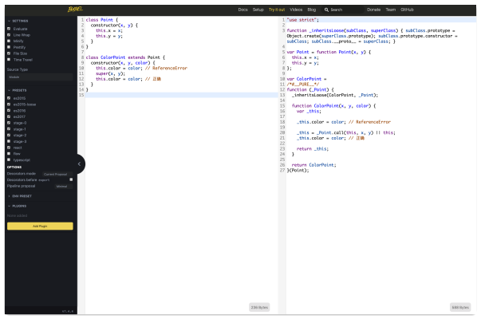

# 04-ES6 中可能遇到的知识点


>青年是学习智慧的时期，中年是付诸实践的时期。—— 卢梭

**ES6**（ECMAScript 6，ES2015）原来指的是 ESMA 组织在 2015 年发布的 ECMAScript 2015 标准，以后发布的 ECMAScript 2016 对应 ES7，依此类推。今年发布的 ECMAScript 2019 标准对应的就是 ES10。相比于之后发布的这些版本，ES6 的改变幅度非常大，因此我们通常说的 ES6 广义上也包括 ES5 之后的所有更新。

> **注意：** 本文属于基础篇，如果你已经对本文相关知识点非常了解，那么可以跳过本文。如果你不够了解，或者了解得还不完整，那么可以通过本文来复习一下 ~

下面介绍几个会在后文设计模式中用到的 ES6 知识点，简单一起过一遍吧。

另外推介一个网站 [Babel - ES6在线编译器](https://babeljs.io/repl)，这里可以输入你的 ES6 语法，会实时将你的代码转化成 ES5。



## 1. let、const

一个显而易见特性是 `let` 声明的变量还可以更改，而 `const` 一般用来声明常量，声明之后就不能更改了：

```javascript
let foo = 1;
const bar = 2;
foo = 3;
bar = 3;   // 报错 TypeError
```

### 1.1 作用域差别

刚学 JavaScript 的时候，我们总是看到类似于「JavaScript 中没有块级作用域，只有函数作用域」的说法。举个例子：

```javascript
var arr = [];
for (var i = 0; i < 4; i++) {
  arr[i] = function () {
    console.log(i)
  }
}
arr[2]()	 // 期望值：2，输出: 4
```

因为 `i` 变量是 `var` 命令声明的，`var` 声明的变量的作用域是函数作用域，因此此时 `i` 变量是在全局范围内都有效，也就是说全局只有一个变量 `i`，每次循环只是修改**同一个变量** `i` 的值。虽然函数的定义是在循环中进行，但是每个函数的 `i` 都指向这个全局唯一的变量 `i`。在函数执行时，`for` 循环已经结束，`i` 最终的值是 `4`，所以无论执行数组里的哪个函数，结果都是 `i` 最终的值 `4`。

ES6 引入的 `let`、`const` 声明的变量是仅在块级作用域中有效：

```javascript
var arr = [];
for (let i = 0; i < 4; i++) {
  arr[i] = function () {
    console.log(i)
  }
}
arr[2]()	 // 期望值：2，输出: 2
```

这个代码中，变量 `i` 是 `let` 声明的，也就是说 `i` 只在本轮循环有效，所以每次循环 `i` 都是一个**新的变量**，最后输出的是 `2`。

那如果我们不使用 ES6 的 `let`、`const` 怎样去实现？可以使用函数的参数来缓存变量的值，让闭包在执行时索引到的变量为函数作用域中缓存的函数参数变量值：

```javascript
var arr = []
for (var i = 0; i < 4; i++) {
    (function(j) {
        arr[i] = function(j) {
            console.log(j)
        }
    })(i)
}
arr[2]()	 // 输出: 2
```

这个做法归根结底还是使用函数作用域来变相实现块级作用域，事实上 Babel 编译器也是使用这个做法，我们来看看 Babel 编译的结果：

```javascript
// 编译前，ES6 语法
var arr = [];
for (let i = 0; i < 4; i++) {
  arr[i] = function () {
    console.log(i)
  }
}
arr[2]()   // 输出: 2

// 编译后，Babel 编译后的 ES5 语法
"use strict";
var arr = [];
var _loop = function _loop(i) {
  arr[i] = function () {
    console.log(i);
  };
};

for (var i = 0; i < 4; i++) {
  _loop(i);
}

arr[2]();   // 输出: 2
```

可以看到 Babel 编译后的代码，也是使用了这个做法。

### 1.2 不存在变量提升

`var` 命令声明的变量会发生**变量提升**的现象，也就是说变量在声明之前使用，其值为 `undefined`，`function` 声明的函数也是有这样的特性。而 `let`、`const` 命令声明的变量没有变量提升，如果在声明之前使用，会直接报错。

```javascript
// var 命令存在变量提升
console.log(tmp)  // undefined
var tmp = 1
console.log(tmp)  // 1

// let、const 命令不存在变量提升
console.log(boo)  // 报错 ReferenceError
let boo = 2
```

### 1.3 暂时性死区

在一个块级作用域中对一个变量使用 `let`、`const` 声明前，该变量都是不可使用的，这被称为**暂时性死区**（Temporal Dead Zone, TDZ）：

```javascript
tmp = 'asd';
if (true) {
  // 虽然在这之前定义了一个全局变量 tmp，但是块内重新定义了一个 tmp
  console.log(tmp); // 报错 ReferenceError
  let tmp;
}
```

### 1.4 不允许重复声明

`let`、`const` 命令是不允许重复声明同一个变量的：

```javascript
if (true) {
  let tmp;
  let tmp;  // 报错 SyntaxError
}

function func(arg) {	// 因为已经有一个 arg 变量名的形参了
  let arg;
}
func()  // 报错 SyntaxError
```

## 2. 箭头函数

### 2.1 基本用法

ES6 中可以使用箭头函数来定义函数。下面例子中，同名函数的定义是等价的：

```javascript
// 基础用法
const test1 = function (参数1, 参数2, …, 参数N) { 函数声明 }
const test1 = (参数1, 参数2, …, 参数N) => { 函数声明 }

// 当只有一个参数时，圆括号是可选的
const test2 = (单一参数) => { 函数声明 }
const test2 = 单一参数 => { 函数声明 }

// 没有参数时，圆括号不能省略
const test3 = () => { 函数声明 }

// 当函数体只是 return 一个单一表达式时，可以省略花括号和 return 关键词
const test4 = () { return 表达式（单一） }
const test4 = () => 表达式（单一）

// 函数体返回对象字面表达式时，如果省略花括号和 return 关键词，返回值需要加括号
const test5 = () => { return {foo: 'bar'} }
const test5 = () => ({foo: 'bar'})  // 输出 {foo: 'bar'}
const test6 = () => {foo: 'bar'}    // 输出 undefined，大括号被识别为代码块
```

总结：

1. 参数如果只有一个，可以不加圆括号 `()`；
2. 没有参数时，不能省略圆括号 `()`；
3. 如果函数体只返回单一表达式，那么函数体可以不使用大括号 `{}` 和 `return`，直接写表达式即可；
4. 在 3 的基础上，如果返回值是一个对象字面量，那么返回值需要加圆括号 `()`，避免被识别为代码块。

### 2.2 箭头函数中的 this

箭头函数出来之前，函数在执行时才能确定 `this` 的指向，所以会经常出现闭包中的 `this` 指向不是期望值的情况。在以前的做法中，如果要给闭包指定 `this`，可以用 `bind、call、apply`，或者把 `this` 值分配给封闭的变量（一般是 `that`）。箭头函数出来之后，给我们提供了不一样的选择。

箭头函数不会创建自己的 `this`，只会从自己定义位置的作用域的上一层直接继承 `this`。

```javascript
function Person(){
  this.age = 10;

  setInterval(() => {
    this.age++;    // this 正确地指向 p 实例
  }, 1000);
}

var p = new Person();  // 1s后打印出 10
```

另外因为箭头函数没有自己的 `this` 指针，因此对箭头函数使用 `call`、`apply`、`bind` 时，只能传递函数，不能绑定 `this`，它们的第一个参数将被忽略：

```javascript
this.param = 1

const func1 = () => console.log(this.param)
const func2 = function() {
    console.log(this.param)
}
func1.apply({ param: 2 })   // 输出: 1
func2.apply({ param: 2 })   // 输出: 2
```

总结一下：

1. 箭头函数中的 `this` 就是**定义时所在的对象**，而不是使用时所在的对象；
2. 无法作为构造函数，不可以使用 `new` 命令，否则会抛错；
3. 箭头函数中不存在 `arguments` 对象，但我们可以通过 Rest 参数来替代；
4. 箭头函数无法使用 `yield` 命令，所以不能作为 Generator 函数；
5. 不可以通过 `bind`、`call`、`apply` 绑定 `this`，但是可以通过 `call`、`apply` 传递参数。

## 3. class 语法

在 class 语法出来之前，我们一般通过上一章介绍的一些方法，来间接实现面向对象三个要素：封装、继承、多态。ES6 给我们提供了更面向对象（更 OO，Object Oriented）的写法，我们可以通过 `class` 关键字来定义一个类。

基本用法：

```javascript
// ES5 方式定义一个类
function Foo() { this.kind = 'foo' }

Foo.staticMethod = function() { console.log('静态方法') }

Foo.prototype.doThis = function() { console.log(`实例方法 kind:${ this.kind }`) }

// ES6 方式定义一个类
class Foo {
  /* 构造函数 */
  constructor() { this.kind = 'foo' }

  /* 静态方法 */
  static staticMethod() { console.log('静态方法') }

  /* 实例方法 */
  doThis() {
    console.log(`实例方法 kind:${ this.kind }`)
  }
}
```

ES6 方式实现继承：

```javascript
// 接上
class Bar extends Foo {
  constructor() {
    super()
    this.type = 'bar'
  }

  doThat() {
    console.log(`实例方法 type:${ this.type } kind:${ this.kind }`)
  }
}

const bar = new Bar()
bar.doThat()   // 实例方法 type:bar kind:foo
```

总结一下：

1. `static` 关键字声明的是静态方法，不会被实例继承，只可以直接通过类来调用；
2. `class` 没有变量提升，因此必须在定义之后才使用；
3. `constructor`为构造函数，子类构造函数中的`super` 代表父类的构造函数，必须执行一次，否则新建实例时会抛错；
4. `new.target` 一般用在构造函数中，返回 `new` 命令作用于的那个构造函数；
5. `class` 用 `extends` 来实现继承，子类继承父类所有实例方法和属性。

## 4. 解构赋值

ES6 允许按照一定方式，从数组和对象中提取值。本质上这种写法属于**模式匹配**，只要等号两边的模式相同，左边的变量就会被赋予相对应的值。

数组解构基本用法：

```javascript
let [a, b, c] = [1, 2, 3]          // a:1 b:2 c:3
let [a, [[b], c]] = [1, [[2], 3]]  // a:1 b:2 c:3
let [a, , b] = [1, 2, 3]           // a:1 b:3
let [a,...b] = [1, 2, 3]           // a:1 b:[2, 3]
let [a, b,...c] = [1]              // a:1 b:undefined c:[]
let [a, b = 4] = [null, undefined] // a:null b:4
let [a, b = 4] = [1]						   // a:1 b:4
let [a, b = 4] = [1, null]				 // a:1 b:null
```

1. 解构不成功，变量的值为 `undefined`；
2. **解构可以指定默认值，如果被解构变量的对应位置没有值，即为空，或者值为 `undefined`，默认值才会生效。**

对象解构基本用法：

```javascript
let { a, b } = { a: 1, b: 2 }      // a:1 b:2
let { c } = { a: 1, b: 2 }         // c:undefined
let { c = 4 } = { a: 1, b: 2 }     // c:4
let { a: c } = { a: 1, b: 2 }      // c:1
let { a: c = 4, d: e = 5 } = { a: 1, b: 2 }   // c:1 e:5
let { length } = [1, 2]            // length:2
```

1. 解构不成功，变量的值为 `undefined`；
2. 解构可以指定默认值，如果被解构变量严格为 `undefined` 或为空，默认值才会生效；
3. 如果变量名和属性名不一致，可以赋给其它名字的变量 `{a:c}`，实际上对象解构赋值 `{a}` 是简写 `{a:a}`，对象的解构赋值是先找到同名属性，再赋给对应的变量，真正被赋值的是后者。

## 5. 扩展运算符

扩展运算符和 Rest 参数的形式一样 `...`，作用相当于 Rest 参数的逆运算。它将一个数组转化为逗号分割的参数序列。事实上实现了迭代器（Iterator）接口的对象都可以使用扩展运算符，包括 `Array`、`String`、`Set`、`Map`、`NodeList`、`arguments` 等。

数组可以使用扩展运算符：

```javascript
console.log(...[1, 2, 3])               // 1 2 3
console.log(1, ...[2, 3, 4], 5)         // 1 2 3 4 5
[...document.querySelectorAll('div')]   // [<div>, <div>, <div>]
[...[1], ...[2, 3]]                     // [1, 2, 3]

const arr = [1]
arr.push(...[2, 3])                     // arr:[1, 2, 3]
```

对象也可以使用扩展运算符，通常被用来合并对象：

```javascript
{...{a: 1}, ...{a: 2, b: 3}}            // {a: 2, b: 3}
```

## 6. 默认参数

ES6 允许给函数的参数设置默认值，如果不传递、或者传递为 `undefined` 则会采用默认值：

```javascript
function log(x, y = 'World') {
    console.log(x, y)
}

log('Hello')             // Hello World
log('Hello', undefined)  // Hello World
log('Hello', 'China')    // Hello China
log(undefined, 'China')  // undefined China
log(, 'China')           // 报错 SyntaxError
log('Hello', '')         // Hello
log('Hello', null)       // Hello null
```

注意：

1. 参数不传递或者传递 `undefined` 会让参数等于默认值，但是如果参数不是最后一个，不传递参数会报错；
2. 特别注意，传递 `null` 不会让函数参数等于默认值。

默认参数可以和解构赋值结合使用：

```javascript
function log({x, y = 'World'} = {}) {
    console.log(x, y)
}

log({x: 'hello'})            // hello World
log({x: 'hello',y: 'China'}) // hello China
log({y: 'China'})            // undefined "China"
log({})                      // undefined "World"
log()                        // undefined "World"
```

分析一下后两种情况：

1. 传递参数为 `{}` 时，因为被解构变量既不为空，也不是 `undefined`，所以不会使用解构赋值的默认参数 `{}`。虽然最终形参的赋值过程还是 `{x, y = 'World'} = {}`，但是这里等号右边的空对象是调用时传递的，而不是形参对象的默认值；
2. 不传参时，即被解构变量为空，那么会使用形参的默认参数 `{}`，形参的赋值过程相当于 `{x, y = 'World'} = {}`，注意这里等号右边的空对象，是形参对象的默认值。

上面是给被解构变量的整体设置了一个默认值 `{}`。下面细化一下，给默认值 `{}` 中的每一项也设置默认值：

```javascript
function log({x, y} = {x: 'yes', y: 'World'}) {
    console.log(x, y)
}

log({x: 'hello'})            // hello undefined
log({x: 'hello',y: 'China'}) // hello China
log({y: 'China'})            // undefined "China"
log({})                      // undefined undefined
log()                        // yes World
```

也分析一下后两种情况：

1. 传递参数为 `{}` 时，被解构变量不为空，也不为 `undefined`，因此不使用默认参数 `{x, y: 'World'}`，形参的赋值过程相当于 `{x, y} = {}`，所以 `x` 与 `y` 都是 `undefined`；
2. 不传参时，等式右边采用默认参数，形参赋值过程相当于 `{x, y} = {x: 'yes', y: 'World'}`。

## 7. Rest 参数

我们知道 `arguments` 是类数组，没有数组相关方法。为了使用数组上的一些方法，我们需要先 用`Array.prototype.slice.call(arguments)` 或者 `[...arguments]` 来将 `arguments` 类数组转化为数组。

ES6 允许我们通过 Rest 参数来获取函数的多余参数：

```javascript
// 获取函数所有的参数，rest 为数组
function func1(...rest){ /* ... */}

// 获取函数第一个参数外其他的参数，rest 为数组
function func1(val, ...rest){ /* ... */}
```

注意，Rest 参数只能放在最后一个，否则会报错：

```javascript
// 报错 SyntaxError: Rest 参数必须是最后一个参数
function func1(...rest, a){ /* ... */}
```

> 形参名并不必须是 `rest`，也可以是其它名称，使用者可以根据自己的习惯来命名。