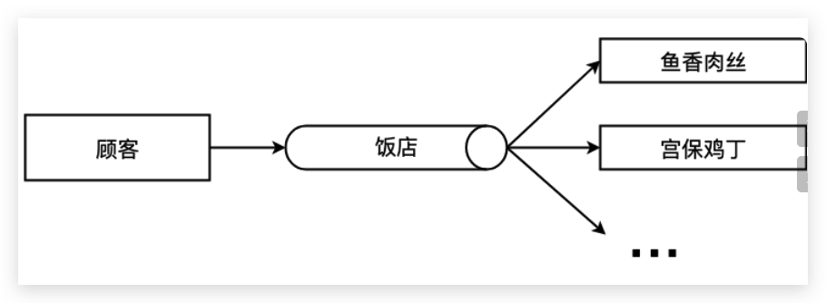

# 08-工厂模式：去小餐馆下馆子


> 虚心使人进步，骄傲使人落后。——毛泽东

**工厂模式** （Factory Pattern），根据不同的输入返回不同类的实例，一般用来创建同一类对象。工厂方式的主要思想是**将对象的创建与对象的实现分离**。

> **注意：** 本文用到 ES6 的语法 [let/const](http://es6.ruanyifeng.com/#docs/let) 、[Class](http://es6.ruanyifeng.com/#docs/class)、[变量的解构赋值](http://es6.ruanyifeng.com/#docs/destructuring) 等，如果还没接触过可以点击链接稍加学习 ~

## 1. 你曾见过的工厂模式

今天你的老同学找你来玩，你决定下个馆子（因为不会做饭），于是你来到了小区门口的饭店，跟老板说，来一份鱼香肉丝，一份宫保鸡丁。等会儿菜就烧好端到你的面前，不用管菜烧出来的过程，你只要负责吃就行了。



上面这两个例子都是工厂模式的实例，老板相当于工厂，负责生产产品，访问者通过老板就可以拿到想要的产品。

在类似场景中，这些例子有以下特点：

1. 访问者只需要知道产品名，就可以从工厂获得对应实例；
2. 访问者不关心实例创建过程；

## 2. 实例的代码实现

如果你使用过 [document.createElement](https://developer.mozilla.org/zh-CN/docs/Web/API/Document/createElement) 方法创建过 DOM 元素，那么你已经使用过工厂方法了，虽然这个方法实际上很复杂，但其使用的就是工厂方法的思想：访问者只需提供标签名（如 div、img），那么这个方法就会返回对应的 DOM 元素。

我们可以使用 JavaScript 将上面饭馆例子实现一下：

```javascript
/* 饭店方法 */
function restaurant(menu) {
  switch (menu) {
    case '鱼香肉丝':
      return new YuXiangRouSi()
    case '宫保鸡丁':
      return new GongBaoJiDin()
    default:
      throw new Error('这个菜本店没有 -。-')
  }
}

/* 鱼香肉丝类 */
function YuXiangRouSi() {
  this.type = '鱼香肉丝'
}

YuXiangRouSi.prototype.eat = function () {
  console.log(this.type + ' 真香~')
}

/* 宫保鸡丁类 */
function GongBaoJiDin() {
  this.type = '宫保鸡丁'
}

GongBaoJiDin.prototype.eat = function () {
  console.log(this.type + ' 让我想起了外婆做的菜~')
}

const dish1 = restaurant('鱼香肉丝')
dish1.eat() // 输出: 鱼香肉丝 真香~
const dish2 = restaurant('红烧排骨') // 输出: Error 这个菜本店没有 -。-
```

工厂方法中这里使用 `switch-case` 语法，你也可以用 `if-else`，都可以。

下面使用 ES6 的 class 语法改写一下：

```javascript
/* 饭店方法 */
class Restaurant {
  static getMenu(menu) {
    switch (menu) {
      case '鱼香肉丝':
        return new YuXiangRouSi()
      case '宫保鸡丁':
        return new GongBaoJiDin()
      default:
        throw new Error('这个菜本店没有 -。-')
    }
  }
}

/* 鱼香肉丝类 */
class YuXiangRouSi {
  constructor() {
    this.type = '鱼香肉丝'
  }

  eat() {
    console.log(this.type + ' 真香~')
  }
}

/* 宫保鸡丁类 */
class GongBaoJiDin {
  constructor() {
    this.type = '宫保鸡丁'
  }

  eat() {
    console.log(this.type + ' 让我想起了外婆做的菜~')
  }
}

const dish1 = Restaurant.getMenu('鱼香肉丝')
dish1.eat() // 输出: 鱼香肉丝 真香~
const dish2 = Restaurant.getMenu('红烧排骨') // 输出: Error 这个菜本店没有 -。-
```

这样就完成了一个工厂模式，但是这个实现有一个问题：工厂方法中包含了很多与创建产品相关的过程，如果产品种类很多的话，这个工厂方法中就会罗列很多产品的创建逻辑，每次新增或删除产品种类，不仅要增加产品类，还需要对应修改在工厂方法，违反了开闭原则，也导致这个工厂方法变得臃肿、高耦合。

严格上这种实现在面向对象语言中叫做**简单工厂模式**。适用于产品种类比较少，创建逻辑不复杂的时候使用。

**工厂模式**的本意是将实际创建对象的过程推迟到子类中，一般用抽象类来作为父类，创建过程由抽象类的子类来具体实现。JavaScript 中没有抽象类，所以我们可以简单地将工厂模式看做是一个实例化对象的工厂类即可。关于抽象类的有关内容，可以参看抽象工厂模式。

然而作为灵活的 JavaScript，我们不必如此较真，可以把易变的参数提取出来：

```javascript
/* 饭店方法 */
class Restaurant {
  constructor() {
    this.menuData = {}
  }

  /* 创建菜品 */
  getMenu(menu) {
    if (!this.menuData[menu]) throw new Error('这个菜本店没有 -。-')
    const { type, message } = this.menuData[menu]
    return new Menu(type, message)
  }

  /* 增加菜品种类 */
  addMenu(menu, type, message) {
    if (this.menuData[menu]) {
      console.Info('已经有这个菜了!')
      return
    }
    this.menuData[menu] = { type, message }
  }

  /* 移除菜品 */
  removeMenu(menu) {
    if (!this.menuData[menu]) return
    delete this.menuData[menu]
  }
}

/* 菜品类 */
class Menu {
  constructor(type, message) {
    this.type = type
    this.message = message
  }

  eat() {
    console.log(this.type + this.message)
  }
}

const restaurant = new Restaurant()
restaurant.addMenu('YuXiangRouSi', '鱼香肉丝', ' 真香~') // 注册菜品
restaurant.addMenu('GongBaoJiDin', '宫保鸡丁', ' 让我想起了外婆做的菜~')

const dish1 = restaurant.getMenu('YuXiangRouSi')
dish1.eat() // 输出: 鱼香肉丝 真香~
const dish2 = restaurant.getMenu('HongSaoPaiGu') // 输出: Error 这个菜本店没有 -。-
```

我们还给 `Restaurant` 类增加了 `addMenu/removeMenu` 私有方法，以便于扩展。

当然这里如果菜品参数不太一致，可以在 `addMenu` 时候注册构造函数或者类，创建的时候返回 `new` 出的对应类实例，灵活变通即可。

## 3. 工厂模式的通用实现

根据上面的例子我们可以提炼一下工厂模式，饭店可以被认为是工厂类（Factory），菜品是产品（Product），如果我们希望获得菜品实例，通过工厂类就可以拿到产品实例，不用关注产品实例创建流程。主要有下面几个概念：

1. **Factory** ：工厂，负责返回产品实例；
2. **Product** ：产品，访问者从工厂拿到产品实例；

结构大概如下：


下面用通用的方法实现，这里直接用 class 语法：

```javascript
/* 工厂类 */
class Factory {
  static getInstance(type) {
    switch (type) {
      case 'Product1':
        return new Product1()
      case 'Product2':
        return new Product2()
      default:
        throw new Error('当前没有这个产品')
    }
  }
}

/* 产品类1 */
class Product1 {
  constructor() {
    this.type = 'Product1'
  }

  operate() {
    console.log(this.type)
  }
}

/* 产品类2 */
class Product2 {
  constructor() {
    this.type = 'Product2'
  }

  operate() {
    console.log(this.type)
  }
}

const prod1 = Factory.getInstance('Product1')
prod1.operate() // 输出: Product1
const prod2 = Factory.getInstance('Product3') // 输出: Error 当前没有这个产品
```

上一个小节介绍的灵活方式也有实用价值，读者可以参考一下。

注意，由于 JavaScript 的灵活，简单工厂模式返回的产品对象不一定非要是类实例，也可以是字面量形式的对象，所以读者可以根据场景灵活选择返回的产品对象形式。

## 4. 源码中的工厂模式

### 4.1 Vue/React 源码中的工厂模式

和原生的 `document.createElement` 类似，Vue 和 React 这种具有虚拟 DOM 树（Virtual Dom Tree）机制的框架在生成虚拟 DOM 的时候，都提供了 `createElement` 方法用来生成 VNode，用来作为真实 DOM 节点的映射：

```javascript
// Vue
createElement('h3', { class: 'main-title' }, [
  createElement('img', { class: 'avatar', attrs: { src: '../avatar.jpg' } }),
  createElement('p', { class: 'user-desc' }, '长得帅老的快，长得丑活得久'),
])

// React
React.createElement(
  'h3',
  { className: 'user-info' },
  React.createElement('img', { src: '../avatar.jpg', className: 'avatar' }),
  React.createElement(
    'p',
    { className: 'user-desc' },
    '长得帅老的快，长得丑活得久',
  ),
)
```

`createElement` 函数结构大概如下：

```javascript
class Vnode (tag, data, children) { ... }

function createElement(tag, data, children) {
  	return new Vnode(tag, data, children)
}
```

可以看到 `createElement` 函数内会进行 VNode 的具体创建，创建的过程是很复杂的，而框架提供的 `createElement` 工厂方法封装了复杂的创建与验证过程，对于使用者来说就很方便了。

### 4.2 vue-router 源码中的工厂模式

工厂模式在源码中应用频繁，以 vue-router 中的源码为例，代码位置：[vue-router/src/index.js](https://github.com/vuejs/vue-router/blob/v3.0.6/src/index.js)

```javascript
// src/index.js
export default class VueRouter {
  constructor(options) {
    this.mode = mode // 路由模式

    switch (
      mode // 简单工厂
    ) {
      case 'history': // history 方式
        this.history = new HTML5History(this, options.base)
        break
      case 'hash': // hash 方式
        this.history = new HashHistory(this, options.base, this.fallback)
        break
      case 'abstract': // abstract 方式
        this.history = new AbstractHistory(this, options.base)
        break
      default:
      // ... 初始化失败报错
    }
  }
}
```

稍微解释一下这里的源码。`mode` 是路由创建的模式，这里有三种 History、Hash、Abstract，前两种我们已经很熟悉了，History 是 H5 的路由方式，Hash 是路由中带 `#` 的路由方式，Abstract 代表非浏览器环境中路由方式，比如 Node、weex 等；`this.history` 用来保存路由实例，vue-router 中使用了工厂模式的思想来获得响应路由控制类的实例。

源码里没有把工厂方法的产品创建流程封装出来，而是直接将产品实例的创建流程暴露在 `VueRouter` 的构造函数中，在被 `new` 的时候创建对应产品实例，相当于 `VueRouter` 的构造函数就是一个工厂方法。

如果一个系统不是 SPA （Single Page Application，单页应用），而是是 MPA（Multi Page Application，多页应用），那么就需要创建多个 `VueRouter` 的实例，此时 `VueRouter` 的构造函数也就是工厂方法将会被多次执行，以分别获得不同实例。

## 5. 工厂模式的优缺点

工厂模式将**对象的创建和实现分离**，这带来了优点：

1. 良好的封装，代码结构清晰，**访问者无需知道对象的创建流程**，特别是创建比较复杂的情况下；
2. 扩展性优良，通过工厂方法隔离了用户和创建流程隔离，**符合开放封闭原则**；
3. 解耦了高层逻辑和底层产品类，**符合最少知识原则**，不需要的就不要去交流；

工厂模式的缺点：带来了**额外的系统复杂度**，增加了抽象性；

## 6. 工厂模式的使用场景

那么什么时候使用工厂模式呢：

1. 对象的创建比较复杂，而访问者无需知道创建的具体流程；
2. 处理大量具有相同属性的小对象；

什么时候不该用工厂模式：滥用只是增加了不必要的系统复杂度，过犹不及。

## 7. 其他相关模式

### 7.1 工厂模式与抽象工厂模式

这两个方式可以组合使用，具体联系与区别在抽象工厂模式中讨论。

### 7.2 工厂模式与模板方法模式

这两个模式看起来比较类似，不过主要区别是：

1. **工厂模式** 主要关注产品实例的创建，对创建流程封闭起来；
2. **模板方法模式** 主要专注的是为固定的算法骨架提供某些步骤的实现；

这两个模式也可以组合一起来使用，比如在模板方法模式里面，使用工厂方法来创建模板方法需要的对象。
