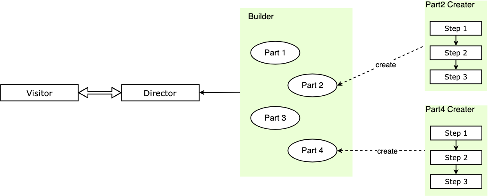

# 10-建造者模式：组装小汽车


> 人只有献身于社会，才能找出那短暂而有风险的生命的意义。 ——爱因斯坦

**建造者模式**（Builder Pattern）又称生成器模式，分步构建一个复杂对象，并允许按步骤构造。同样的构建过程可以采用不同的表示，将一个复杂对象的**构建层与其表示层分离**。

在工厂模式中，创建的结果都是一个完整的个体，我们对创建的过程并不关心，只需了解创建的结果。而在建造者模式中，我们关心的是对象的创建过程，因此我们通常将创建的复杂对象的模块化，使得被创建的对象的每一个子模块都可以得到高质量的复用，当然在灵活的 JavaScript 中我们可以有更灵活的实现。

> **注意：** 本文用到 ES6 的语法 [let/const](http://es6.ruanyifeng.com/#docs/let) 、[Class](http://es6.ruanyifeng.com/#docs/class) 等，如果还没接触过可以点击链接稍加学习 ~

## 1. 你曾见过的建造者模式

假定我们需要建造一个车，车这个产品是由多个部件组成，车身、引擎、轮胎。汽车制造厂一般不会自己完成每个部件的制造，而是把部件的制造交给对应的汽车零部件制造商，自己只进行装配，最后生产出整车。整车的每个部件都是一个相对独立的个体，都具有自己的生产过程，多个部件经过一系列的组装共同组成了一个完整的车。


类似的场景还有很多，比如生产一个笔记本电脑，由主板、显示器、壳子组成，每个部件都有自己独立的行为和功能，他们共同组成了一个笔记本电脑。笔记本电脑厂从部件制造商处获得制造完成的部件，再由自己完成组装，得到笔记本电脑这个完整的产品。

在这些场景中，有以下特点：

1. 整车制造厂（指挥者）无需知道零部件的生产过程，零部件的生产过程一般由零部件厂商（建造者）来完成；
2. 整车制造厂（指挥者）决定以怎样的装配方式来组装零部件，以得到最终的产品；

## 2. 实例的代码实现

我们可以使用 JavaScript 来将上面的装配汽车的例子实现一下。

```javascript
// 建造者，汽车部件厂家，提供具体零部件的生产
function CarBuilder({ color = 'white', weight = 0 }) {
  this.color = color
  this.weight = weight
}

// 生产部件，轮胎
CarBuilder.prototype.buildTyre = function (type) {
  switch (type) {
    case 'small':
      this.tyreType = '小号轮胎'
      this.tyreIntro = '正在使用小号轮胎'
      break
    case 'normal':
      this.tyreType = '中号轮胎'
      this.tyreIntro = '正在使用中号轮胎'
      break
    case 'big':
      this.tyreType = '大号轮胎'
      this.tyreIntro = '正在使用大号轮胎'
      break
  }
}

// 生产部件，发动机
CarBuilder.prototype.buildEngine = function (type) {
  switch (type) {
    case 'small':
      this.engineType = '小马力发动机'
      this.engineIntro = '正在使用小马力发动机'
      break
    case 'normal':
      this.engineType = '中马力发动机'
      this.engineIntro = '正在使用中马力发动机'
      break
    case 'big':
      this.engineType = '大马力发动机'
      this.engineIntro = '正在使用大马力发动机'
      break
  }
}

/* 奔驰厂家，负责最终汽车产品的装配 */
function benChiDirector(tyre, engine, param) {
  var _car = new CarBuilder(param)
  _car.buildTyre(tyre)
  _car.buildEngine(engine)
  return _car
}

// 获得产品实例
var benchi1 = benChiDirector('small', 'big', { color: 'red', weight: '1600kg' })

console.log(benchi1)

// 输出：
// {
//   color: "red"
//   weight: "1600kg"
//   tyre: Tyre {tyreType: "小号轮胎", tyreIntro: "正在使用小号轮胎"}
//   engine: Engine {engineType: "大马力发动机", engineIntro: "正在使用大马力发动机"}
// }
```

如果访问者希望获得另一个型号的车，比如有「空调」功能的车，那么我们只需要给 `CarBuilder` 的原型 `prototype` 上增加一个空调部件的建造方法，然后再新建一个新的奔驰厂家指挥者方法。

也可以使用 ES6 的写法改造一下：

```javascript
// 建造者，汽车部件厂家，提供具体零部件的生产
class CarBuilder {
  constructor({ color = 'white', weight = 0 }) {
    this.color = color
    this.weight = weight
  }

  /* 生产部件，轮胎 */
  buildTyre(type) {
    const tyre = {}
    switch (type) {
      case 'small':
        tyre.tyreType = '小号轮胎'
        tyre.tyreIntro = '正在使用小号轮胎'
        break
      case 'normal':
        tyre.tyreType = '中号轮胎'
        tyre.tyreIntro = '正在使用中号轮胎'
        break
      case 'big':
        tyre.tyreType = '大号轮胎'
        tyre.tyreIntro = '正在使用大号轮胎'
        break
    }
    this.tyre = tyre
  }

  /* 生产部件，发动机 */
  buildEngine(type) {
    const engine = {}
    switch (type) {
      case 'small':
        engine.engineType = '小马力发动机'
        engine.engineIntro = '正在使用小马力发动机'
        break
      case 'normal':
        engine.engineType = '中马力发动机'
        engine.engineIntro = '正在使用中马力发动机'
        break
      case 'big':
        engine.engineType = '大马力发动机'
        engine.engineIntro = '正在使用大马力发动机'
        break
    }
    this.engine = engine
  }
}

/* 指挥者，负责最终汽车产品的装配 */
class BenChiDirector {
  constructor(tyre, engine, param) {
    const _car = new CarBuilder(param)
    _car.buildTyre(tyre)
    _car.buildEngine(engine)
    return _car
  }
}

// 获得产品实例
const benchi1 = new BenChiDirector('small', 'big', {
  color: 'red',
  weight: '1600kg',
})

console.log(benchi1)

// 输出：
// {
//   color: "red"
//   weight: "1600kg"
//   tyre: Tyre {tyreType: "小号轮胎", tyreIntro: "正在使用小号轮胎"}
//   engine: Engine {engineType: "大马力发动机", engineIntro: "正在使用大马力发动机"}
// }
```

作为灵活的 JavaScript，我们还可以使用链模式来完成部件的装配，对链模式还不熟悉的同学可以看一下后面有一篇单独介绍链模式的文章～

```javascript
// 建造者，汽车部件厂家
class CarBuilder {
  constructor({ color = 'white', weight = '0' }) {
    this.color = color
    this.weight = weight
  }

  /* 生产部件，轮胎 */
  buildTyre(type) {
    const tyre = {}
    switch (type) {
      case 'small':
        tyre.tyreType = '小号轮胎'
        tyre.tyreIntro = '正在使用小号轮胎'
        break
      case 'normal':
        tyre.tyreType = '中号轮胎'
        tyre.tyreIntro = '正在使用中号轮胎'
        break
      case 'big':
        tyre.tyreType = '大号轮胎'
        tyre.tyreIntro = '正在使用大号轮胎'
        break
    }
    this.tyre = tyre
    return this
  }

  /* 生产部件，发动机 */
  buildEngine(type) {
    const engine = {}
    switch (type) {
      case 'small':
        engine.engineType = '小马力发动机'
        engine.engineIntro = '正在使用小马力发动机'
        break
      case 'normal':
        engine.engineType = '中马力发动机'
        engine.engineIntro = '正在使用中马力发动机'
        break
      case 'big':
        engine.engineType = '大马力发动机'
        engine.engineIntro = '正在使用大马力发动机'
        break
    }
    this.engine = engine
    return this
  }
}

// 汽车装配，获得产品实例
const benchi1 = new CarBuilder({ color: 'red', weight: '1600kg' })
  .buildTyre('small')
  .buildEngine('big')

console.log(benchi1)

// 输出：
// {
//   color: "red"
//   weight: "1600kg"
//   tyre: Tyre {tyre: "小号轮胎", tyreIntro: "正在使用小号轮胎"}
//   engine: Engine {engine: "大马力发动机", engineIntro: "正在使用大马力发动机"}
// }
```

这样将最终产品的创建流程使用链模式来实现，相当于将指挥者退化，指挥的过程通过链模式让用户自己实现，这样既增加了灵活性，装配过程也一目了然。如果希望扩展产品的部件，那么在建造者上增加部件实现方法，再适当修改链模式即可。

## 3. 建造者模式的通用实现

我们提炼一下建造者模式，这里的生产汽车的奔驰厂家就相当于指挥者（Director），厂家负责将不同的部件组装成最后的产品（Product），而部件的生产者是部件厂家相当于建造者（Builder），我们通过指挥者就可以获得希望的复杂的产品对象，再通过访问不同指挥者获得装配方式不同的产品。主要有下面几个概念：

1. **Director：** 指挥者，调用建造者中的部件具体实现进行部件装配，相当于整车组装厂，最终返回装配完毕的产品；
2. **Builder：** 建造者，含有不同部件的生产方式给指挥者调用，是部件真正的生产者，但没有部件的装配流程；
3. **Product：** 产品，要返回给访问者的复杂对象；

建造者模式的主要功能是构建复杂的产品，并且是复杂的、需要分步骤构建的产品，其构建的算法是统一的，构建的过程由指挥者决定，只要配置不同的指挥者，就可以构建出不同的复杂产品来。也就是说，建造者模式**将产品装配的算法和具体部件的实现分离**，这样构建的算法可以扩展和复用，部件的具体实现也可以方便地扩展和复用，从而可以灵活地通过组合来构建出不同的产品对象。

概略图如下：



下面是通用的实现。

首先使用 ES6 的 class 语法：

```javascript
// 建造者，部件生产
class ProductBuilder {
  constructor(param) {
    this.param = param
  }

  /* 生产部件，part1 */
  buildPart1() {
    // ... Part1 生产过程
    this.part1 = 'part1'
  }

  /* 生产部件，part2 */
  buildPart2() {
    // ... Part2 生产过程
    this.part2 = 'part2'
  }
}

/* 指挥者，负责最终产品的装配 */
class Director {
  constructor(param) {
    const _product = new ProductBuilder(param)
    _product.buildPart1()
    _product.buildPart2()
    return _product
  }
}

// 获得产品实例
const product = new Director('param')
```

结合链模式：

```javascript
// 建造者，汽车部件厂家
class CarBuilder {
  constructor(param) {
    this.param = param
  }

  /* 生产部件，part1 */
  buildPart1() {
    this.part1 = 'part1'
    return this
  }

  /* 生产部件，part2 */
  buildPart2() {
    this.part2 = 'part2'
    return this
  }
}

// 汽车装配，获得产品实例
const benchi1 = new CarBuilder('param').buildPart1().buildPart2()
```

如果希望扩展实例的功能，那么只需要在建造者类的原型上增加一个实例方法，再返回 `this` 即可。

值得一提的是，结合链模式的建造者模式中，装配复杂对象的链式装配过程就是指挥者 Director 角色，只不过在链式装配过程中不再封装在具体指挥者中，而是由使用者自己确定装配过程。

## 4. 实战中的建造者模式

### 4.1 重构一个具有很多参数的构造函数

有时候你会遇到一个参数很多的构造函数，比如：

```javascript
// 汽车建造者
class CarBuilder {
  constructor(engine, weight, height, color, tyre, name, type) {
    this.engine = engine
    this.weight = weight
    this.height = height
    this.color = color
    this.tyre = tyre
    this.name = name
    this.type = type
  }
}

const benchi = new CarBuilder(
  '大马力发动机',
  '2ton',
  'white',
  '大号轮胎',
  '奔驰',
  'AMG',
)
```

如果构造函数的参数多于 3 个，在使用的时候就很容易弄不清哪个参数对应的是什么含义，你可以使用对象解构赋值的方式来提高可读性和使用便利性，也可以使用建造者模式的思想来进行属性赋值，这是另一个思路。代码如下：

```javascript
// 汽车建造者
class CarBuilder {
  constructor(engine, weight, height, color, tyre, name, type) {
    this.engine = engine
    this.weight = weight
    this.height = height
    this.color = color
    this.tyre = tyre
    this.name = name
    this.type = type
  }

  setCarProperty(key, value) {
    if (Object.getOwnPropertyNames(this).includes(key)) {
      this[key] = value
      return this
    }
    throw new Error(`Key error : ${key} 不是本实例上的属性`)
  }
}

const benchi = new CarBuilder()
  .setCarProperty('engine', '大马力发动机')
  .setCarProperty('weight', '2ton')
  .setCarProperty('height', '2000mm')
  .setCarProperty('color', 'white')
  .setCarProperty('tyre', '大号轮胎')
  .setCarProperty('name', '奔驰')
  .setCarProperty('type', 'AMG')
```

每个键都是用一个同样的方法来设置，或许你觉得不太直观，我们可以将设置每个属性的操作都单独列为一个方法，这样可读性就更高了：

```javascript
// 汽车建造者
class CarBuilder {
  constructor(engine, weight, height, color, tyre, name, type) {
    this.engine = engine
    this.weight = weight
    this.height = height
    this.color = color
    this.tyre = tyre
    this.name = name
    this.type = type
  }

  setPropertyFuncChain() {
    Object.getOwnPropertyNames(this).forEach((key) => {
      const funcName = 'set' + key.replace(/^\w/g, (str) => str.toUpperCase())
      this[funcName] = (value) => {
        this[key] = value
        return this
      }
    })
    return this
  }
}

const benchi = new CarBuilder()
  .setPropertyFuncChain()
  .setEngine('大马力发动机')
  .setWeight('2ton')
  .setHeight('2000mm')
  .setColor('white')
  .setTyre('大号轮胎')
  .setName('奔驰')
  .setType('AMG')
```

这里用到了点正则的知识，如果不太理解的同学可以参见 [JS 正则表达式必知必会](https://juejin.im/post/5b61b0f86fb9a04fd343af8f#heading-25)

### 4.2 重构 React 的书写形式

**注意：** 这个方式不一定推荐，只是用来开阔视野。

当我们写一个 React 组件的时候，一般结构形式如下；

```javascript
class ContainerComponent extends Component {
  componentDidMount() {
    this.props.fetchThings()
  }
  render() {
    return <PresentationalComponent {...this.props} />
  }
}

ContainerComponent.propTypes = {
  fetchThings: PropTypes.func.isRequired,
}

const mapStateToProps = (state) => ({
  things: state.things,
})
const mapDispatchToProps = (dispatch) => ({
  fetchThings: () => dispatch(fetchThings()),
  selectThing: (id) => dispatch(selectThing(id)),
  blowShitUp: () => dispatch(blowShitUp()),
})

export default connect(mapStateToProps, mapDispatchToProps)(ContainerComponent)
```

通过建造者模式重构，我们可以将组件形式写成如下方式：

```javascript
export default ComponentBuilder('ContainerComponent')
  .render((props) => <PresentationalComponent {...props} />)
  .componentDidMount((props) => props.fetchThings())
  .propTypes({
    fetchThings: PropTypes.func.isRequired,
  })
  .mapStateToProps((state) => ({
    things: state.things,
  }))
  .mapDispatchToProps((dispatch) => ({
    fetchThings: () => dispatch(fetchThings()),
    selectThing: (id) => dispatch(selectThing(id)),
    blowShitUp: () => dispatch(blowShitUp()),
  }))
  .build()
```

至于建造者的实现，可以参见 [Github 代码](https://github.com/SHERlocked93/imooc-frontend-design-pattern/blob/20190704/10-建造者模式/10-08.builder react.js)，这里就不多加演示了～

## 5. 建造者模式的优缺点

建造者模式的优点：

1. 使用建造者模式可以**使产品的构建流程和产品的表现分离**，也就是将产品的创建算法和产品组成的实现隔离，访问者不必知道产品部件实现的细节；
2. **扩展方便**，如果希望生产一个装配顺序或方式不同的新产品，那么直接新建一个指挥者即可，不用修改既有代码，符合开闭原则；
3. **更好的复用性**，建造者模式将产品的创建算法和产品组成的实现分离，所以产品创建的算法可以复用，产品部件的实现也可以复用，带来很大的灵活性；

建造者模式的缺点：

1. 建造者模式一般适用于产品之间组成部件类似的情况，**如果产品之间差异性很大、复用性不高**，那么不要使用建造者模式；
2. 实例的创建增加了许多额外的结构，无疑增加了许多复杂度，**如果对象粒度不大**，那么我们最好直接创建对象；

## 6. 建造者模式的适用场景

1. 相同的方法，不同的执行顺序，产生不一样的产品时，可以采用建造者模式；
2. 产品的组成部件类似，通过组装不同的组件获得不同产品时，可以采用建造者模式；

## 7. 其他相关模式

### 7.1 建造者模式与工厂模式

建造者模式和工厂模式最终都是创建一个完整的产品，但是在建造者模式中我们更关心对象创建的过程，将创建对象的方法模块化，从而更好地复用这些模块。

当然建造者模式与工厂模式也是可以组合使用的，比如建造者中一般会提供不同的部件实现，那么这里就可以使用工厂模式来提供具体的部件对象，再通过指挥者来进行装配。

### 7.2 建造者模式与模版方法模式

指挥者的实现可以和模版方法模式相结合。也就是说，指挥者中部件的装配过程，可以使用模版方法模式来固定装配算法，把部件实现方法分为模板方法和基本方法，进一步提取公共代码，扩展可变部分。

是否采用模版方法模式看具体场景，如果产品的部件装配顺序很明确，但是具体的实现是未知的、灵活的，那么你可以适当考虑是否应该将算法骨架提取出来。

推介阅读

1. [React Component Builder Pattern – Jacob Gardner](https://medium.com/@jagardner2113/react-component-builder-pattern-5cb864ce5fc0)
2. [Java - When would you use the Builder Pattern?](https://stackoverflow.com/questions/328496/when-would-you-use-the-builder-pattern)
3. [JS 正则表达式必知必会](https://juejin.im/post/5b61b0f86fb9a04fd343af8f)
