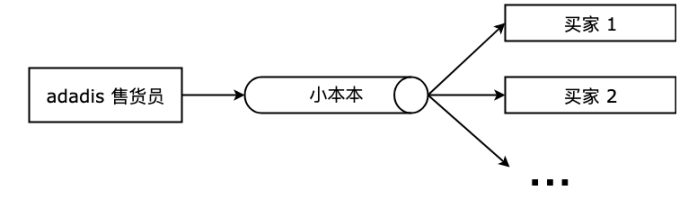
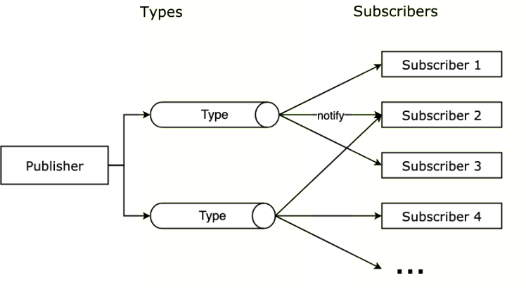
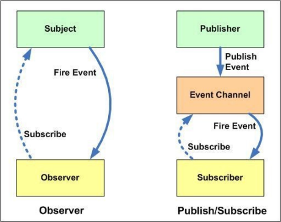

# 18-**发布-订阅模式：去 adadis 买鞋**


> 困难只能吓倒懦夫懒汉，而胜利永远属于敢于等科学高峰的人。 ——茅以升

在众多设计模式中，可能最常见、最有名的就是发布-订阅模式了，本篇我们一起来学习这个模式。

**发布-订阅模式** （Publish-Subscribe Pattern, pub-sub）又叫观察者模式（Observer Pattern），它定义了一种一对多的关系，让多个订阅者对象同时监听某一个发布者，或者叫主题对象，这个主题对象的状态发生变化时就会通知所有订阅自己的订阅者对象，使得它们能够自动更新自己。

当然有人提出发布-订阅模式和观察者模式之间是[有一些区别的](https://www.zcfy.cc/article/observer-vs-pub-sub-pattern-hacker-noon)，但是大部分情况下你可以将他们当成是一个模式，**本文将不对它们之间进行区分**，文末会简单讨论一下他们之间的微妙区别，了解即可。

> **注意：** 本文可能用到一些编码技巧比如 [IIFE](https://developer.mozilla.org/zh-CN/docs/Glossary/立即执行函数表达式)（Immediately Invoked Function Expression, 立即调用函数表达式），ES6 的语法 [let/const](http://es6.ruanyifeng.com/#docs/let)、[箭头函数](http://es6.ruanyifeng.com/#docs/function)、[rest 参数](http://es6.ruanyifeng.com/#docs/function)等，如果还没接触过可以点击链接稍加学习 ~

## 1. 你曾遇见过的发布-订阅模式

在现实生活中其实我们会经常碰到发布-订阅模式的例子。

比如当我们进入一个聊天室/群，如果有人在聊天室发言，那么这个聊天室里的所有人都会收到这个人的发言。这是一个典型的发布-订阅模式，当我们加入了这个群，相当于订阅了在这个聊天室发送的消息，当有新的消息产生，聊天室会负责将消息发布给所有聊天室的订阅者。

再举个栗子，当我们去 adadis 买鞋，发现看中的款式已经售罄了，售货员告诉你不久后这个款式会进货，到时候打电话通知你。于是你留了个电话，离开了商场，当下周某个时候 adadis 进货了，售货员拿出小本本，给所有关注这个款式的人打电话。

这也是一个日常生活中的一个发布-订阅模式的实例，虽然不知道什么时候进货，但是我们可以登记号码之后等待售货员的电话，不用每天都打电话问鞋子的信息。

上面两个小栗子，都属于发布-订阅模式的实例，群成员/买家属于消息的订阅者，订阅消息的变化，聊天室/售货员属于消息的发布者，在合适的时机向群成员/小本本上的订阅者发布消息。

adadis 售货员这个例子的各方关系大概如下图：



在这样的逻辑中，有以下几个特点：

1. 买家（订阅者）只要声明对消息的一次订阅，就可以在未来的某个时候接受来自售货员（发布者）的消息，不用一直轮询消息的变化；
2. 售货员（发布者）持有一个小本本（订阅者列表），对这个本本上记录的订阅者的情况并不关心，只需要在消息发生时挨个去通知小本本上的订阅者，当订阅者增加或减少时，只需要在小本本上增删记录即可；
3. 将上面的逻辑升级一下，一个人可以加多个群，售货员也可以有多个小本本，当不同的群产生消息或者不款式的鞋进货了，发布者可以按照不同的名单/小本本分别去通知订阅了不同类型消息的订阅者，这里有个消息类型的概念；

## 2. 实例的代码实现

如果你在 DOM 上绑定过事件处理函数 [addEventListener](https://developer.mozilla.org/zh-CN/docs/Web/API/EventTarget/addEventListener)，那么你已经使用过发布-订阅模式了。

我们经常将一些操作挂载在 [onload](https://developer.mozilla.org/en-US/docs/Web/API/Window/load_event) 事件上执行，当页面元素加载完毕，就会触发你注册在 `onload` 事件上的回调。我们无法预知页面元素何时加载完毕，但是通过订阅 window 的 `onload` 事件，window 会在加载完毕时向订阅者发布消息，也就是执行回调函数。

```javascript
window.addEventListener('load', function () {
  console.log('loaded!')
})
```

这与买鞋的例子类似，我们不知道什么时候进货，但只需订阅鞋子的消息，进货的时候售货员会打电话通知我们。

在现实中和编程中我们还会遇到很多这样类似的问题，我们可以将 adadis 的例子提炼一下，用 JavaScript 来实现：

```javascript
const adadisPub = {
  adadisBook: [], // adadis售货员的小本本
  subShoe(phoneNumber) {
    // 买家在小本本是登记号码
    this.adadisBook.push(phoneNumber)
  },
  notify() {
    // 售货员打电话通知小本本上的买家
    for (const customer of this.adadisBook) {
      customer.update()
    }
  },
}

const customer1 = {
  phoneNumber: '152xxx',
  update() {
    console.log(this.phoneNumber + ': 去商场看看')
  },
}

const customer2 = {
  phoneNumber: '138yyy',
  update() {
    console.log(this.phoneNumber + ': 给表弟买双')
  },
}

adadisPub.subShoe(customer1) // 在小本本上留下号码
adadisPub.subShoe(customer2)

adadisPub.notify() // 打电话通知买家到货了

// 152xxx: 去商场看看
// 138yyy: 给表弟买双
```

这样我们就实现了在有新消息时对买家的通知。

当然还可以对功能进行完善，比如：

- 在登记号码的时候进行一下判重操作，重复号码就不登记了；
- 买家登记之后想了一下又不感兴趣了，那么以后也就不需要通知了，增加取消订阅的操作；

```javascript
const adadisPub = {
  adadisBook: [], // adadis售货员的小本本
  subShoe(customer) {
    // 买家在小本本是登记号码
    if (!this.adadisBook.includes(customer))
      // 判重
      this.adadisBook.push(customer)
  },
  unSubShoe(customer) {
    // 取消订阅
    if (!this.adadisBook.includes(customer)) return
    const idx = this.adadisBook.indexOf(customer)
    this.adadisBook.splice(idx, 1)
  },
  notify() {
    // 售货员打电话通知小本本上的买家
    for (const customer of this.adadisBook) {
      customer.update()
    }
  },
}

const customer1 = {
  phoneNumber: '152xxx',
  update() {
    console.log(this.phoneNumber + ': 去商场看看')
  },
}

const customer2 = {
  phoneNumber: '138yyy',
  update() {
    console.log(this.phoneNumber + ': 给表弟买双')
  },
}

adadisPub.subShoe(customer1) // 在小本本上留下号码
adadisPub.subShoe(customer1)
adadisPub.subShoe(customer2)
adadisPub.unSubShoe(customer1)

adadisPub.notify() // 打电话通知买家到货了

// 138yyy: 给表弟买双
```

到现在我们已经简单完成了一个发布-订阅模式。

但是还可以继续改进，比如买家可以关注不同的鞋型，那么当某个鞋型进货了，只通知关注了这个鞋型的买家，总不能通知所有买家吧。改写后的代码：

```javascript
const adadisPub = {
  adadisBook: {}, // adadis售货员的小本本
  subShoe(type, customer) {
    // 买家在小本本是登记号码
    if (this.adadisBook[type]) {
      // 如果小本本上已经有这个type
      if (!this.adadisBook[type].includes(customer))
        // 判重
        this.adadisBook[type].push(customer)
    } else this.adadisBook[type] = [customer]
  },
  unSubShoe(type, customer) {
    // 取消订阅
    if (!this.adadisBook[type] || !this.adadisBook[type].includes(customer))
      return
    const idx = this.adadisBook[type].indexOf(customer)
    this.adadisBook[type].splice(idx, 1)
  },
  notify(type) {
    // 售货员打电话通知小本本上的买家
    if (!this.adadisBook[type]) return
    this.adadisBook[type].forEach((customer) => customer.update(type))
  },
}

const customer1 = {
  phoneNumber: '152xxx',
  update(type) {
    console.log(this.phoneNumber + ': 去商场看看' + type)
  },
}

const customer2 = {
  phoneNumber: '138yyy',
  update(type) {
    console.log(this.phoneNumber + ': 给表弟买双' + type)
  },
}

adadisPub.subShoe('运动鞋', customer1) // 订阅运动鞋
adadisPub.subShoe('运动鞋', customer1)
adadisPub.subShoe('运动鞋', customer2)
adadisPub.subShoe('帆布鞋', customer1) // 订阅帆布鞋

adadisPub.notify('运动鞋') // 打电话通知买家运动鞋到货了

// 152xxx: 去商场看看运动鞋
// 138yyy: 给表弟买双运动鞋
```

这样买家就可以订阅不同类型的鞋子，售货员也可以只通知关注某特定鞋型的买家了。

## 3. 发布-订阅模式的通用实现

我们可以把上面例子的几个核心概念提取一下，买家可以被认为是订阅者（Subscriber），售货员可以被认为是发布者（Publisher），售货员持有小本本（SubscriberMap），小本本上记录有买家订阅（subscribe）的不同鞋型（Type）的信息，当然也可以退订（unSubscribe），当鞋型有消息时售货员会给订阅了当前类型消息的订阅者发布（notify）消息。

主要有下面几个概念：

1. **Publisher** ：发布者，当消息发生时负责通知对应订阅者
2. **Subscriber** ：订阅者，当消息发生时被通知的对象
3. **SubscriberMap** ：持有不同 type 的数组，存储有所有订阅者的数组
4. **type** ：消息类型，订阅者可以订阅的不同消息类型
5. **subscribe** ：该方法为将订阅者添加到 SubscriberMap 中对应的数组中
6. **unSubscribe** ：该方法为在 SubscriberMap 中删除订阅者
7. **notify** ：该方法遍历通知 SubscriberMap 中对应 type 的每个订阅者

现在的结构如下图



下面使用通用化的方法实现一下。

首先我们使用立即调用函数 IIFE（Immediately Invoked Function Expression） 方式来将不希望公开的 `SubscriberMap` 隐藏，然后可以将注册的订阅行为换为回调函数的形式，这样我们可以在消息通知时附带参数信息，在处理通知的时候也更灵活：

```javascript
const Publisher = (function () {
  const _subsMap = {} // 存储订阅者
  return {
    /* 消息订阅 */
    subscribe(type, cb) {
      if (_subsMap[type]) {
        if (!_subsMap[type].includes(cb)) _subsMap[type].push(cb)
      } else _subsMap[type] = [cb]
    },
    /* 消息退订 */
    unsubscribe(type, cb) {
      if (!_subsMap[type] || !_subsMap[type].includes(cb)) return
      const idx = _subsMap[type].indexOf(cb)
      _subsMap[type].splice(idx, 1)
    },
    /* 消息发布 */
    notify(type, ...payload) {
      if (!_subsMap[type]) return
      _subsMap[type].forEach((cb) => cb(...payload))
    },
  }
})()

Publisher.subscribe('运动鞋', (message) => console.log('152xxx' + message)) // 订阅运动鞋
Publisher.subscribe('运动鞋', (message) => console.log('138yyy' + message))
Publisher.subscribe('帆布鞋', (message) => console.log('139zzz' + message)) // 订阅帆布鞋

Publisher.notify('运动鞋', ' 运动鞋到货了 ~') // 打电话通知买家运动鞋消息
Publisher.notify('帆布鞋', ' 帆布鞋售罄了 T.T') // 打电话通知买家帆布鞋消息

// 输出:  152xxx 运动鞋到货了 ~
// 输出:  138yyy 运动鞋到货了 ~
// 输出:  139zzz 帆布鞋售罄了 T.T
```

上面是使用 IIFE 实现的，现在 ES6 如此流行，也可以使用 class 语法来改写一下：

```javascript
class Publisher {
  constructor() {
    this._subsMap = {}
  }

  /* 消息订阅 */
  subscribe(type, cb) {
    if (this._subsMap[type]) {
      if (!this._subsMap[type].includes(cb)) this._subsMap[type].push(cb)
    } else this._subsMap[type] = [cb]
  }

  /* 消息退订 */
  unsubscribe(type, cb) {
    if (!this._subsMap[type] || !this._subsMap[type].includes(cb)) return
    const idx = this._subsMap[type].indexOf(cb)
    this._subsMap[type].splice(idx, 1)
  }

  /* 消息发布 */
  notify(type, ...payload) {
    if (!this._subsMap[type]) return
    this._subsMap[type].forEach((cb) => cb(...payload))
  }
}

const adadis = new Publisher()

adadis.subscribe('运动鞋', (message) => console.log('152xxx' + message)) // 订阅运动鞋
adadis.subscribe('运动鞋', (message) => console.log('138yyy' + message))
adadis.subscribe('帆布鞋', (message) => console.log('139zzz' + message)) // 订阅帆布鞋

adadis.notify('运动鞋', ' 运动鞋到货了 ~') // 打电话通知买家运动鞋消息
adadis.notify('帆布鞋', ' 帆布鞋售罄了 T.T') // 打电话通知买家帆布鞋消息

// 输出:  152xxx 运动鞋到货了 ~
// 输出:  138yyy 运动鞋到货了 ~
// 输出:  139zzz 帆布鞋售罄了 T.T
```

## 4. 实战中的发布-订阅模式

### 4.1 使用 jQuery 的方式

我们使用 jQuery 的时候可以通过其自带的 API 比如 `on`、`trigger`、`off` 来轻松实现事件的订阅、发布、取消订阅等操作：

```javascript
function eventHandler() {
  console.log('自定义方法')
}

/* ---- 事件订阅 ---- */
$('#app').on('myevent', eventHandler)
// 发布
$('#app').trigger('myevent')

// 输出：自定义方法

/* ---- 取消订阅 ---- */
$('#app').off('myevent')
$('#app').trigger('myevent')

// 没有输出
```

甚至我们可以使用原生的 `addEventListener`、`dispatchEvent`、`removeEventListener` 来实现发布订阅：

```javascript
// 输出：自定义方法
function eventHandler(dom) {
  console.log('自定义方法', dom)
}

var app = document.getElementById('app')

/* ---- 事件订阅 ---- */
app.addEventListener('myevent', eventHandler)
// 发布
app.dispatchEvent(new Event('myevent'))

// 输出：自定义方法+DOM

/* ---- 取消订阅 ---- */
app.removeEventListener('myevent', eventHandler)
app.dispatchEvent(new Event('myevent'))

// 没有输出
```

### 4.2 使用 Vue 的 EventBus

和 jQuery 一样，Vue 也是实现有一套事件机制，其中一个我们熟知的用法是 `EventBus`。在多层组件的事件处理中，如果你觉得一层层 `$on`、`$emit` 比较麻烦，而你又不愿意引入 Vuex，那么这时候推介使用 `EventBus` 来解决组件间的数据通信：

```javascript
// event-bus.js

import Vue from 'vue'
export const EventBus = new Vue()
```

使用时：

```javascript
// 组件A
import { EventBus } from './event-bus.js'

EventBus.$on('myevent', (args) => {
  console.log(args)
})
// 组件B
import { EventBus } from './event-bus.js'

EventBus.$emit('myevent', 'some args')
```

实现组件间的消息传递，不过在中大型项目中，还是推介使用 Vuex，因为如果 Bus 上的事件挂载过多，事件满天飞，就分不清消息的来源和先后顺序，对可维护性是一种破坏。

## 5. 源码中的发布-订阅模式

发布-订阅模式在源码中应用很多，特别是现在很多前端框架都会有的双向绑定机制的场景，这里以现在很火的 Vue 为例，来分析一下 Vue 是如何利用发布-订阅模式来实现视图层和数据层的双向绑定。先借用官网的双向绑定原理图：


下面稍微解释一下这个图（框架源码整个过程比较复杂，如果现在看不懂下面几段也没关系，大致了解一下即可)。

组件渲染函数（Component Render Function）被执行前，会对数据层的数据进行响应式化。响应式化大致就是使用 [Object.defineProperty](https://developer.mozilla.org/en-US/docs/Web/JavaScript/Reference/Global_Objects/Object/defineProperty) 把数据转为 [getter/setter](https://developer.mozilla.org/zh-CN/docs/Web/JavaScript/Guide/Working_with_Objects#定义_getters_与_setters)，并为每个数据添加一个订阅者列表的过程。这个列表是 `getter` 闭包中的属性，将会记录所有依赖这个数据的组件。

也就是说，响应式化后的数据相当于**发布者**。

每个组件都对应一个 Watcher **订阅者**。当每个组件的渲染函数被执行时，都会将本组件的 Watcher 放到自己所依赖的响应式数据的订阅者列表里，这就相当于完成了**订阅**，一般这个过程被称为依赖收集（Dependency Collect）。

> 组件渲染函数执行的结果是生成虚拟 DOM 树（Virtual DOM Tree），这个树生成后将被映射为浏览器上的真实的 DOM 树，也就是用户所看到的页面视图。

当响应式数据发生变化的时候，也就是触发了 `setter` 时，`setter` 会负责**通知**（Notify）该数据的订阅者列表里的 Watcher，Watcher 会触发组件重渲染（Trigger re-render）来更新（update）视图。

我们可以看看 Vue 的[源码](https://github.com/vuejs/vue/blob/v2.5.18/src/core/observer/index.js#L157-L194)：

```javascript
// src/core/observer/index.js 响应式化过程

Object.defineProperty(obj, key, {
  enumerable: true,
  configurable: true,
  get: function reactiveGetter() {
    // ...
    const value = getter ? getter.call(obj) : val // 如果原本对象拥有getter方法则执行
    dep.depend() // 进行依赖收集，dep.addSub
    return value
  },
  set: function reactiveSetter(newVal) {
    // ...
    if (setter) {
      setter.call(obj, newVal)
    } // 如果原本对象拥有setter方法则执行
    dep.notify() // 如果发生变更，则通知更新
  },
})
```

而这个 `dep` 上的 `depend` 和 `notify` 就是订阅和发布通知的具体方法。

简单来说，响应式数据是消息的发布者，而视图层是消息的订阅者，如果数据更新了，那么发布者会发布数据更新的消息来通知视图更新，从而实现数据层和视图层的双向绑定。

## 6. 发布-订阅模式的优缺点

发布-订阅模式最大的优点就是**解耦**：

1. **时间上的解耦** ：注册的订阅行为由消息的发布方来决定何时调用，订阅者不用持续关注，当消息发生时发布者会负责通知；
2. **对象上的解耦** ：发布者不用提前知道消息的接受者是谁，发布者只需要遍历处理所有订阅该消息类型的订阅者发送消息即可（迭代器模式），由此解耦了发布者和订阅者之间的联系，互不持有，都依赖于抽象，不再依赖于具体；

由于它的解耦特性，发布-订阅模式的使用场景一般是：当一个对象的改变需要同时改变其它对象，并且它不知道具体有多少对象需要改变。发布-订阅模式还可以帮助实现一些其他的模式，比如**中介者模式**。

发布-订阅模式也有缺点：

1. **增加消耗** ：创建结构和缓存订阅者这两个过程需要消耗计算和内存资源，即使订阅后始终没有触发，订阅者也会始终存在于内存；
2. **增加复杂度** ：订阅者被缓存在一起，如果多个订阅者和发布者层层嵌套，那么程序将变得难以追踪和调试，参考一下 Vue 调试的时候你点开原型链时看到的那堆 deps/subs/watchers 们…

缺点主要在于理解成本、运行效率、资源消耗，特别是在多级发布-订阅时，情况会变得更复杂。

## 7. 其他相关模式

### 7.1 发布-订阅模式和观察者模式

观察者模式与发布-订阅者模式，在平时你可以认为他们是一个东西，但是某些场合（比如面试）下可能需要稍加注意，借用网上一张流行的图：



区别主要在发布-订阅模式中间的这个 Event Channel：

1. **观察者模式** 中的观察者和被观察者之间还存在耦合，被观察者还是知道观察者的；
2. **发布-订阅模式** 中的发布者和订阅者不需要知道对方的存在，他们通过**消息代理**来进行通信，解耦更加彻底；

### 7.2 发布-订阅模式和责任链模式

发布-订阅模式和责任链模式也有点类似，主要区别在于：

1. **发布-订阅模式** 传播的消息是根据需要随时发生变化，是发布者和订阅者之间约定的结构，在多级发布-订阅的场景下，消息可能完全不一样；
2. **责任链模式** 传播的消息是不变化的，即使变化也是在原来的消息上稍加修正，不会大幅改变结构；

推介阅读：

> 1. [观察者模式 vs 发布订阅模式，千万不要再混淆了](https://www.zcfy.cc/article/observer-vs-pub-sub-pattern-hacker-noon)
> 2. [ECMAScript 6 入门 - 阮一峰](http://es6.ruanyifeng.com/)
> 3. [Vue 源码阅读 - 依赖收集原理](https://juejin.im/post/5b40c8495188251af3632dfa)
