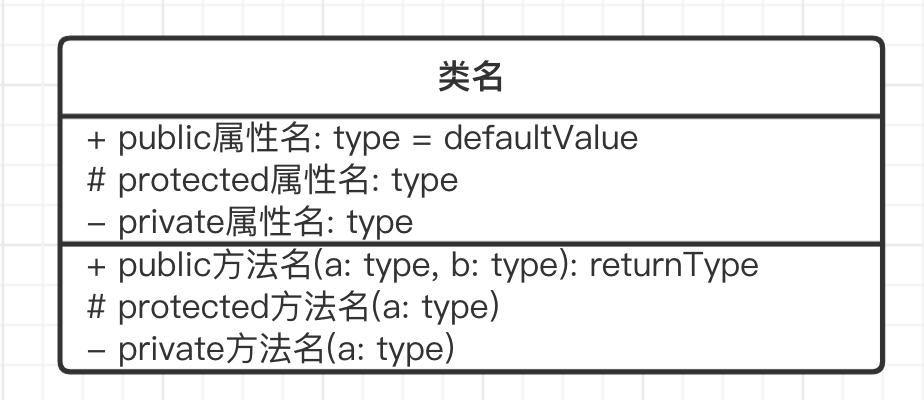
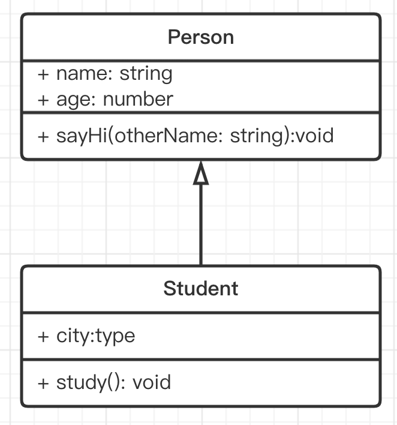
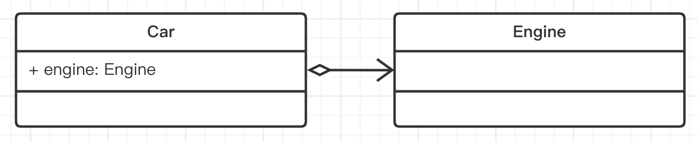
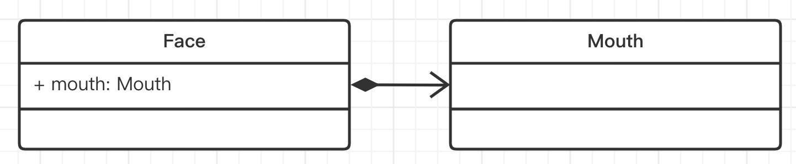
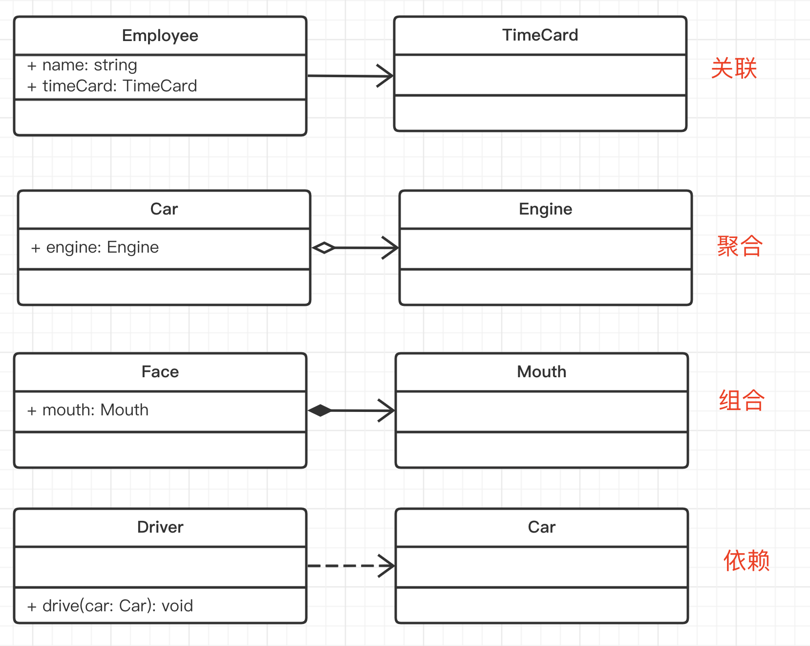

# 02-面向对象 OOP 和 UML 类图-前端开发的必备编程思想

## 01: 面向对象 和 UML 类图

### 主要内容

- 介绍 TS 类型
- 面向对象的概念和应用
- 画 UML 类图

### 学习方法

- 开发环境可直接下载源代码，节省效率
- UML 类图一定要结合代码，综合理解
- 要动手画 UML 类图

### 注意事项

- TS 知识点很多，本章先讲基础，以后用到再补充

## 02: 介绍-讲义

## 03：Typescript 介绍 - 前端最热门的编程语言

## 04: TS 简介-讲义

### TS 简介

TS 是 JS 的超级 Super-Set ，即包含 JS 所有能力，然后再有自己自己的能力 —— 静态类型。

PS：大型系统的量大研发保障：1. 静态类型； 2. 自动化测试；

注意，TS 类型的知识点非常多，先介绍常用的，其他的遇到再说。

### TS 最终编译为 JS

TS 只是开发环境的工具，构建之后产出 JS 在浏览器运行。

https://www.tslang.cn/play/index.html

### 基础类型

值类型

- `boolean`
- `number`
- `string`
- `symbol`
- `any` —— 重要

数组：`number[]` 或 `Array<number>`

元组 `Array<number | string>`

对象 `object` —— 不常用，一般会用 interface 或 class 代替

函数 `Function` —— 不常用，一般用自定义 type 代替

类型断言：让 TS 计算你需要的类型，而不用自己定义

### 函数

- 参数类型
- 返回值类型，有 `void`

### 自定义 type

基础类型不能满足，就自定义

```ts
type infoType = string | number
type fnType = (a: number, b: string) => void

const a: infoType = 10
const fn: fnType = (a: number, b: string) {}
```

### 接口 interface

一些类型的集合，也可以用自定义 type 和其他 interface

```ts
// 注意，interface 的写法
interface IPerson {
  name: string
  age: number
  sayHi: (otherName: string) => void
}

const zhangsan: IPerson = {
  name: '张三',
  age: 20,
  sayHi(otherName: string) {
    alert(`你好 ${otherName}`)
  },
}
```

### 类 class

在 ES6 class 基础上增加了类型，class 可实现 interface

```ts
class Person implements IPerson {
  name: string
  age: number

  constructor(name: string, age: number) {
    this.name = name
    this.age = age
  }

  sayHi(otherName: string) {
    alert(`你好 ${otherName}`)
  }
}
```

class 还有一些特性，在下一节面向对象介绍

### 小结

- 基础类型
- 函数
- 自定义 type
- interface
- class

## 05：Typescript 基础类型

## 06：Typescript 自定义类型和 interface

## 07：面向对象 - 前端主流的编程思想
### 定义
- 面向对象编程，Object-Oriented-Program（简称 OOP）是一种目前主流的编程思想。已有几十年的历史，1990 年代开始，和 Java 一起开始发展壮大。
- 编程本来是抽象的，像做数学题一样。
- 一开始的汇编语言，直接操作寄存器、内存，写底层计算。后来的 C 语言，各种函数和指针。
- 而 OOP 引入了“对象”概念，对象即对应生活中的实物，这样就把编程具象化了。具象化之后学习成本就低了，也就随着计算机革命普及开来。
- 设计模式就是基于 OOP 编程思想的，不适用于其他编程思想（如函数式编程）
### 类和对象
* 类，即模板
  ```ts
  class People {
    name: string
    age: number
  
    constructor(name: string, age: number) {
      this.name = name
      this.age = age
    }
  
    // 如果函数不写返回值类型，则默认为 void
    eat() {
      alert(`${this.name} eat something`)
    }
  
    speak() {
      alert(`My name is ${this.name}, age ${this.age}`)
    }
  }
  ```
* 对象，即实例。一个类可以 `new` 出很多个对象。
  ```ts
  // 创建实例
  let zhang = new People('zhang', 20)
  zhang.eat()
  zhang.speak()
  
  // 创建实例
  let wang = new People('wang', 21)
  wang.eat()
  wang.speak()
  ```
###  三要素

- 继承
- 封装
- 多态
#### 继承
* 继承：抽离公共代码，实现代码复用

  ```ts
  class Student extends People {
    school: string
  
    constructor(name: string, age: number, school: string) {
      super(name, age)
      this.school = school
    }
    study() {
      alert(`${this.name} study`)
    }
  }
  // 可继续派生其他子类
  
  let xiaoming = new Student('xiaoming', 10, 'A小学')
  xiaoming.study()
  console.log(xiaoming.school)
  let xiaohong = new Student('xiaohong', 11, 'B小学')
  xiaohong.study()
  ```
#### 封装
* 封装：高内聚，低耦合
* 可见性修饰符
  - `public` 外部可访问，默认
  - `protected` 内部或子类可访问
  - `private` 只有内部可访问

  ```ts
  // People 中增加 protected weight: number
  // Student 中增加 private girlfriend: string
  ```
#### 多态
> 多态：保证扩展性
- 重写 - 覆盖父组件的方法
- 重载 - 支持多种参数形式
  ```ts
  interface IStyleInfo {
    [key: string]: string
  }
  
  class JQuery {
    // 函数重载
    css(key: string, value: string)
    css(styleInfo: IStyleInfo)
    css(keyOrStyleInfo: string | IStyleInfo, value?: string) {
      if (typeof keyOrStyleInfo === 'string') {
        // key-value 形式
        const key = keyOrStyleInfo
        console.log('Set CSS', key, value)
      } else {
        // object 形式
        const styleInfo = keyOrStyleInfo
        for (const key in styleInfo) {
          const value = styleInfo[key]
          console.log('Set CSS', key, value)
        }
      }
    }
  }
  
  const jquery = new JQuery()
  jquery.css('color', 'red')
  jquery.css({ color: 'red', 'font-size': '14px' })
  ```

### Vue React 组件也是对象
* 组件定义就相当于 class ，组件使用就相当于 new class

  ```html
  <!-- 定义一个 SomeComponent.vue 组件 -->
  
  <!-- page1 -->
  <template>
    <some-component :name="a"></some-component>
  </template>
  
  <!-- page2 -->
  <template>
    <some-component :name="b"></some-component>
  </template>
  ```

### 总结

- 类和对象
- 三个特点（重要）
- Vue React 组件也是对象

## 08：UML 类图

### **介绍**

* UML - Unified Modeling Language - 统一建模语言

* 软件工程（不仅是编程）中的任何设计都可以用它来表述，包含：

  - **类图**

  - 用例图

  - 对象图

  - 顺序图

  - 协作图

  - 状态图

  - 活动图

  - 组件图

  - 配置图

### **UML 类图的作用**

* 需求指导设计，设计指导开发
* 开发之前，写技术方案设计文档，并评审
* UML 类图就是一个重要的工具和表达方式。如果你和同事都熟悉 UML 类图，那会减少很多沟通成本，不用看代码就可以知道你的代码结构，核心属性和方法

### **画图工具**

* [https://www.processon.com/](https://www.processon.com/)

* MS Visio

### **单个类**

三个区域

* 类名

* 属性

* 方法

权限描述

*  `+` public

*  `#` protected
*  `-` private


### 类图的几种关系

- 实现 - 实现接口
- 泛化 - 继承
- 关联 - A 是 B 的一个属性
    - 聚合 - 整体包含部分，部分可以脱离整体单独存在
    - 组合 - 整体包含部分，部分不可脱离整体
    - 依赖 - 不是属性，函数参数、返回值


【注意】聚合、组合、依赖，**都属于关联关系**，更加细化了。日常工作中没必要区分那么细致，都当做关联关系即可。

#### 实现接口

注意：TS 的 interface 和 Java 的不一样，TS 有属性，而 Java 的没有属性。而 UML 类图是依据 Java 语法而画的（没有属性区域），课程里也合并到一个区域了。


```typescript
interface IPerson {
  name: string
  age: number
  sayHi(otherName: string): void
}

class Person implements IPerson{
  name: string
  age: number
  constructor(name:string, age:number) {
    this.name = name
    this.age = age
  }
  sayHi(otherName: string): void {
    alert(`Hi, ${otherName}`)
  }
}
```
#### 泛化 - 继承父类



```typescript
class Person {
  name: string
  age: number
  constructor(name: string, age: number) {
    this.name = name
    this.age = age
  }
  sayHi(otherName: string): void {
    alert(`Hi, ${otherName}`)
  }
  eat() {
    console.log(`${this.name} eats something`)
  }
}

class Student extends Person {
  constructor(name: string, age: number) {
    super(name, age)
  }
  city() {}
  study() {}
}
```
#### 关联

分类
- 单项关联 - 最常见
- 双向关联
- 自关联


```typescript
class Emplpyee {
  name: string
  timeCard: TimeCard
  constructor(name: string, timeCard: TimeCard) {
    this.name = name
    this.timeCard = timeCard
  }
}
class TimeCard {}
```

### 关联关系的细化

#### 聚合

> 整体包含部分，部分可以脱离整体单独存在



#### 组合

> 整体包含部分，部分**不可**脱离整体



#### 依赖

> 不是属性，函数参数、返回值


### 总结

再次体会 UML 类图的作用

- 单个类
- 类之间的关系
- 关联关系的细分，不必过于较真




## 09：总结

### 内容回顾

- 搭建 webpack + TS 环境
- 介绍 TS 类型
- 面向对象的概念和应用
- 画 UML 类图

### 重要细节

- TS 自定义 type 和 interface
- TS 中的 `public` `protected` `private`
- 面向三要素：继承 封装 多态
- UML 类图 - 类之间的关系（箭头）

### 注意事项

- TS 知识点很多，本章先讲基础，以后用到再补充
- UML 类图一定要结合代码，综合理解
