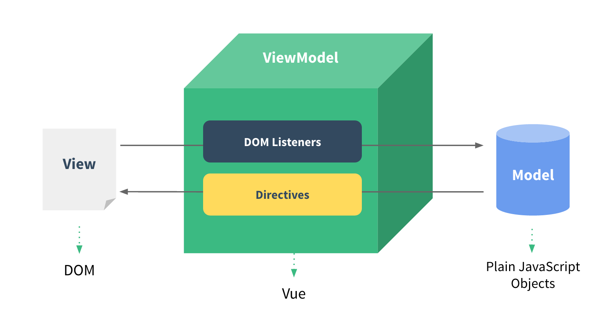

# 11-其他设计模式

虽然有些模式不常用，但其编程思路很常用

> 除了上述常用的设计模式之外，还有其他一些不太常用、但对日常编程启发很大的设计模式，也值得一起学习。本章讲详细介绍这些设计模式，包括职责链模式、策略模式、适配器模式、组合模式，以及常见的 MVC 和 MVVM。

## 01: 开始

### 重要内容

- 职责链模式
- 策略模式
- 适配器模式
- MVC 和 MVVM

### 学习方法

- 结合场景和实战

### 注意事项

- 非常用设计模式，不要细扣概念，要领悟它对于实际开发的指导意义
- MVC 和 MVVM 要结合实战

## 02： 职责链模式

顾名思义，就是一步操作可能分位多个职责角色来完成，把这些角色都分开，然后用一个链串起来。这样就将请求者和处理者、包括多个处理者之间进行了分离。

- 一个流程，需要多个角色处理
- 把多个角色分开，通过一个 “链” 串联起来
- 各个角色相互分离，互不干扰

前端最常见的就是**链式操作**。

### jQuery 链式操作

```js
$('#div1').show().css('color', 'red').append($('#p1'))
```

### Promise 链式操作

```ts
// 加载图片
function loadImg(src: string) {
  const promise = new Promise((resolve, reject) => {
    const img = document.createElement('img')
    img.onload = () => {
      resolve(img)
    }
    img.onerror = () => {
      reject('图片加载失败')
    }
    img.src = src
  })
  return promise
}

const src = 'https://www.imooc.com/static/img/index/logo_new.png'

const result = loadImg(src)
result
  .then((img: HTMLImageElement) => {
    console.log('img.width', img.width)
    return img
  })
  .then((img: HTMLImageElement) => {
    console.log('img.height', img.height)
  })
  .catch((err) => {
    console.log(err)
  })
```

## 03: 策略模式

### 用途

主要解决多个 `if...else` 或者 `switch...case` 的问题。

把每种情况分成多种策略，分别实现。

### 不适用策略模式时

```ts
class User {
  private type: string
  constructor(type: string) {
    this.type = type
  }
  buy() {
    const { type } = this
    if (type === 'ordinary') {
      console.log('普通用户购买')
    }
    if (type === 'member') {
      console.log('会员购买')
    }
    if (type === 'vip') {
      console.log('VIP 用户购买')
    }
  }
}

const u1 = new User('ordinary')
u1.buy()
const u2 = new User('member')
u2.buy()
const u3 = new User('vip')
u3.buy()
```

### 使用策略模式时

```ts
interface IUser {
  buy: () => void
}

class OrdinaryUser implements IUser {
  buy() {
    console.log('普通用户购买')
  }
}

class MemberUser implements IUser {
  buy() {
    console.log('会员购买')
  }
}

class VipUser implements IUser {
  buy() {
    console.log('VIP 用户购买')
  }
}

const u1 = new OrdinaryUser()
u1.buy()
const u2 = new MemberUser()
u2.buy()
const u3 = new VipUser()
u3.buy()
```

## 04: 适配器模式

### 介绍

我们需要一个对象的 API 提供能力，但它的格式不一定完全适合我们的格式要求。这就要转换一下。

例如电脑、手机的电源适配器


### 演示

```ts
// 电源插口
class Source {
  supply() {
    return '220V 电源'
  }
}

// 适配器
class Adapter {
  source = new Source()
  adaptedSupply() {
    const sourceRes = this.source.supply()
    return `${sourceRes} --> 12V 电源`
  }
}

// 手机使用
const adapter = new Adapter()
const res = adapter.adaptedSupply()
console.log(res)
```

### 场景

Vue computed

```js
// Vue 组件配置
{
  data() {
    return {
      userList: [
        { id: 1, name: '张三' },
        { id: 2, name: '李四' },
        { id: 3, name: '王五' },
      ]
    }
  },
  computed: {
    userNameList() {
      this.userList.map(user => user.name) // ['张三', '李四', ... ]
    }
  }
}
```

## 05: MVC 和 MVVM

MVC 和 MVVM 不属于经典的 23 种设计模式，但也可以说他们是设计模式。

本来设计模式就是一种抽象的定义，而且随着时代的发展，它也需要慢慢的改变。

如何称呼无所谓，关键是理解它们的内容。

### MVC

MVC 原理

- View 传送指令到 Controller
- Controller 完成业务逻辑后，要求 Model 改变状态
- Model 将新的数据发送到 View，用户得到反馈


### MVVM

MVVM 直接对标 Vue 即可

- View 即 Vue template
- Model 即 Vue data
- VM 即 Vue 其他核心功能，负责 View 和 Model 通讯




### 总结

- MVC
- MVVM (结合 vue)

PS：先了解概念，再去实战，先“文”而后“化”
