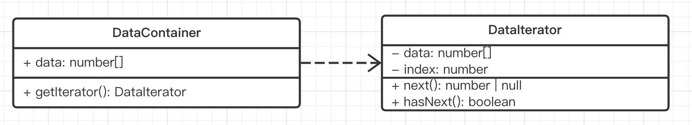

# 07-迭代器模式

> 遍历数据不仅仅是 for 和 forEach ，还有 Iterator

## 01: 章介绍

### 主要内容

- 概念介绍 + 解决的问题
- UML 类图和代码演示
- 应用场景 + Generator 生成器

### 学习方法

- 结合使用场景学习
- 代码要结合 UML 类图

### 注意事项

- 前面可能听不懂，后面会豁然开朗，耐心学完
- 简单的 for 循环不是迭代器

## 02：普通 for 循环不是迭代器

### 迭代器

用于顺序访问集合对象的元素，不需要知道集合对象的底层表示。

### for 循环不是迭代器模式

简单的 for 循环并不是迭代器模式，因为 for 循环需要知道对象的内部结构。

如下面的例子

- 要知道数组的长度
- 要知道通过 `arr[i]` 形式来得到 item

```js
const arr = [10, 20, 30]
const length = arr.length
for (let i = 0; i < length; i++) {
  console.log(arr[i])
}
```

### 简易迭代器

有些对象，并不知道他的内部结构

- 不知道长度
- 不知道如何获取 item

```js
const pList = document.querySelectorAll('p')
pList.forEach((p) => console.log(p))
```

forEach 就是最建议的迭代器

### 总结

- 顺序访问有序结构（如数组、NodeList）
- 不知道数据的长度和内部结构
- 高内聚、低耦合

## 03: 演示

注意，这个示例也许你会感觉繁琐，不理解。但慢慢的把这一章看完，你就能明白她的意义。



### 代码示例

```ts
class DataIterator {
  private data: number[]
  private index = 0

  constructor(container: DataContainer) {
    this.data = container.data
  }

  next(): number | null {
    if (this.hasNext()) {
      return this.data[this.index++]
    }
    return null
  }

  hasNext() {
    if (this.index >= this.data.length) return false
    return true
  }
}

class DataContainer {
  data: number[] = [10, 20, 30, 40]
  getIterator() {
    return new DataIterator(this)
  }
}

const container = new DataContainer()
const iterator = container.getIterator()
while (iterator.hasNext()) {
  const num = iterator.next()
  console.log(num)
}
```

### 是否符合设计原则 ？

5 大设计原则中，最重要的就是：**开放封闭原则**，对扩展开放，对修改封闭

- 使用者和目标数据分离，解耦
- 目标数据自行控制内部迭代逻辑
- 使用者不关心目标数据的内部结构

## 04：场景

- 有序结构
- Symbol.iterator 和 迭代器
- 迭代器的应用

### 有序结构

JS 有序对象，都内置迭代器

- 字符串
- 数组
- NodeList 等 DOM 集合
- Map
- Set
- arguments

【注意】对象 object 不是有序结构

### Symbol.iterator

- 每个有序对象，都内置了 `Symbol.iterator` 属性，属性值是一个函数。
- 执行该函数讲返回 iterator 迭代器，有 `next()` 方法，执行返回 `{ value, done }` 结构。

```js
// 拿数组举例，其他类型也一样

const arr = [10, 20, 30]
const iterator = arr[Symbol.iterator]()

iterator.next() // {value: 10, done: false}
iterator.next() // {value: 20, done: false}
iterator.next() // {value: 30, done: false}
iterator.next() // {value: undefined, done: true}
```

另外，有些对象的 API 也会生成有序对象

```js
const map = new Map([
  ['k1', 'v1'],
  ['k2', 'v2'],
])
const mapIterator = map[Symbol.iterator]()
mapIterator.next() // value: ['k1', 'v1'], done: false
mapIterator.next() // value: ['k2', 'v2'], done: false
mapIterator.next() //value: undefined, done: true

const values = map.values() // 并不是 Array, 是 MapIterator {'v1', 'v2'}
const valuesIterator = values[Symbol.iterator]()
valuesIterator.next() // {value: 'v1', done: false}
valuesIterator.next() // {value: 'v2', done: false}
valuesIterator.next() // {value: undefined, done: true}

// 还有 keys entries
```

### 自定义迭代器

```ts
interface IteratorRes {
  value: number | undefined
  done: boolean
}

class CustomIterator {
  private length = 3
  private index = 0

  next(): IteratorRes {
    this.index++
    if (this.index <= this.length) {
      return { value: this.index, done: false }
    }
    return { value: undefined, done: true }
  }

  [Symbol.iterator]() {
    return this
  }
}

const iterator = new CustomIterator()
console.log(iterator.next())
console.log(iterator.next())
console.log(iterator.next())
console.log(iterator.next())
```

### 有序结构的作用

#### for...of

所有有序结构，都支持 for...of 语法

#### 数组操作

数组解构

```js
const [node1, node2] = someDomList
```

扩展操作符

```js
const arr = [...someDomList]
```

Array.from()

```js
const arr = Array.form(someDomList)
```

#### 创建 Map 和 Set

> Map、Set 支持 有些结构数据为参数

```js
const map = new Map([
  ['k1', 'v1'],
  ['k2', 'v2'],
])

const set = new Set(someDomList)
const strSet = new Set('abc') // Set(3) {'a', 'b', 'c'}
```

#### Promise.all 和 Promise.race

```js
Promise.all([promise1, promise2, promise3])
Promise.race([promise1, promise2, promise3])
```

#### yield\* 操作符

下一节讲

### 总结

- 有序结构
- Symbol.iterator 生成迭代器
- 迭代器的应用

## 05：Generator 生成器

> 迭代器和生成器，两者密不可分

### 基本使用

```js
function* genNums() {
  yield 10
  yield 20
  yield 30
}

const numsIterator = genNums()
numsIterator.next() // {value: 10, done: false}
numsIterator.next() // {value: 20, done: false}
numsIterator.next() // {value: 30, done: false}
numsIterator.next() // {value: undefined, done: true}

// for (let n of numsIterator) {
//     console.log(n)
// }
```

### yield\* 语法

上一节说过，有序结构可用于 `yield*`

```js
function* genNums() {
  yield* [100, 200, 300] // 相当于：循环数组，分别 yield

  // 效果类似下面的代码
  // const arr = [100, 200, 300]
  // for (let i = 0; i < arr.length; i++) {
  //   yield arr[i]
  // }
}
const numsIterator = genNums()
numsIterator.next() // {value: 100, done: false}
numsIterator.next() // {value: 200, done: false}
numsIterator.next() // {value: 300, done: false}
numsIterator.next() // {value: undefined, done: true}

// for (let n of numsIterator) {
//     console.log(n)
// }
```

最简单的自定义迭代器

```js
class CustomIterator {
  private data: number[]

  constructor() {
    this.data = [10, 20, 30]
  }

  * [Symbol.iterator]() {
    yield* this.data
  }
}

const iterator = new CustomIterator()
for (let n of iterator) {
    console.log(n)
}
```

### yield 遍历 DOM 树

有助于深入理解 Generator

```js
function* traverse(elemList: Element[]): any {
  for (const elem of elemList) {
    yield elem

    const children = Array.from(elem.children)
    if (children.length) {
      yield* traverse(children)
    }
  }
}

const container = document.getElementById('container')
if (container) {
  for (let node of traverse([container])) {
    console.log(node)
  }
}
```

### 总结

- 基本使用
- yield\* 语法
- 遍历 DOM 树

## 06: 总结

### 内容回顾

- 概念介绍 + 解决的问题
- UML 类图和代码演示
- 场景 Symbol.iterator 和 Generator

### 重要细节

- for...of 和迭代器的关系
- Generator 和迭代器的关系
- 对象 object 不是有序结构

### 注意事项

- 一开始可能听不懂，坚持一下，后面会豁然开朗
- 简单的 for 循环不是迭代器，迭代器是解决 for 循环的问题
