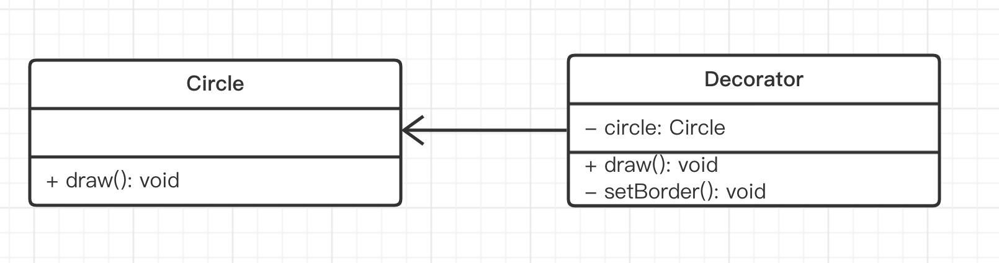
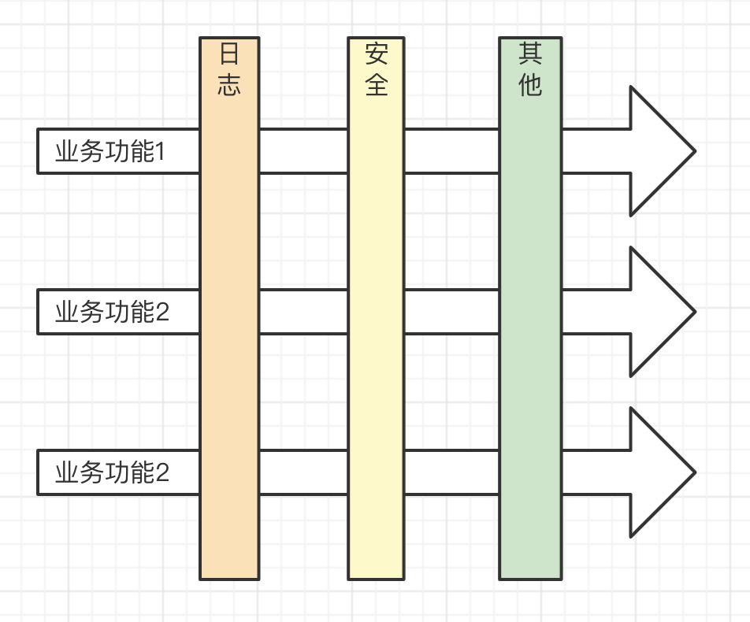

# 09-装饰器模式

## 01: 开始

### 主要内容

- 概念介绍 + 解决的问题
- 代码演示和 UML 类图
- 使用场景：ES Decorator 和 AOP

### 学习方法

- 结合场景学习
- 代码结合 UML 类图

### 注意事项

- Angular 只为演示，国内应用不多
- AOP 先了解概念，不急于详细掌握（需要长时间才能理解，如 OOP ）

## 02: 介绍

> 装饰器模式（Decorator Pattern）允许向一个现有的对象添加新的功能，同时又不改变其结构。这种类型的设计模式属于结构型模式，它是作为现有的类的一个包装。动态地给一个对象添加一些额外的职责。就增加功能来说，装饰器模式相比生成子类更为灵活。

- 针对一个对象
- 动态的添加新功能
- 但是不改变原有的功能

例如，手机上套一个壳可以保护手机，壳上粘一个指环，可以挂在手指上不容易滑落，这就是一种装饰。手机还是那个手机，手机的功能一点都没变，只是在手机的外面装饰了一些其他附加的功能。日常生活中，这样的例子非常多。


```ts
function decorate(phone) {
  phone.fn3 = function () {
    console.log('指环')
  }
}
const phone = {
  name: 'iphone12',
  fn1() {}
  fn2() {}
}
const newPhone = decorate(phone)
```

而 ES 语法允许我们这样写（其实就是语法糖），后面会详细讲

```ts
// 伪代码，不能运行
@decorate
const phone = { ... }
```

## 03: 演示

### UML 类图以及 代码演示



```ts
class Circle {
  draw() {
    console.log('画一个圆')
  }
}

class Decorator {
  private circle: Circle
  constructor(circle: Circle) {
    this.circle = circle
  }
  draw() {
    this.circle.draw() // 原有属性
    this.setBorder() // 装饰方法
  }
  private setBorder() {
    console.log('设置边框颜色')
  }
}

const circle = new Circle()
circle.draw()

const decorator = new Decorator(circle)
decorator.draw()
```

### 是否符合设计原则？

5 大设计原则中，最重要的就是：**开放封闭原则**，对扩展开放，对修改封闭

- 装饰器和目标分离，解耦
- 装饰器可自行扩展
- 目标也可自行扩展

## 04: 场景

ES 引入了 Decorator 语法，TS 也支持

PS：在 tsconfig.json 中加 `experimentalDecorators: true`

### 装饰 class

```ts
// 装饰器
function testable(target: any) {
  target.isTestable = true
}

@testable
class Foo {
  static isTestable?: boolean
}

console.log(Foo.isTestable) // true
```

可以传入参数

```ts
// 装饰器工厂函数
function testable(val: boolean) {
  // 装饰器
  return function (target: any) {
    target.isTestable = val
  }
}

@testable(false)
class Foo {
  static isTestable?: boolean
}

console.log(Foo.isTestable) // false
```

### 装饰 class 方法

```ts
function readOnly(target: any, key: string, descriptor: PropertyDescriptor) {
  // console.log('target', target)
  // console.log('key', key)
  descriptor.writable = false
}

function configurable(val: boolean) {
  return function (target: any, key: string, descriptor: PropertyDescriptor) {
    descriptor.configurable = val
  }
}

class Foo {
  private _name = '张三'
  private _age = 20

  @readOnly
  getName() {
    return this._name
  }

  @configurable(false)
  getAge() {
    return this._age
  }
}

const f = new Foo()
// f.getName = () => { return 'hello' } // 会报错
console.log(f.getName())

// @ts-ignore
// console.log( Object.getOwnPropertyDescriptor(f.__proto__, 'getAge') ) // { configurable: false }
console.log(f.getAge)
```

PS：其实 TS 本身有 `readOnly` 语法，但这里就是一个演示。

### react-redux

react-redux 的基本使用如下。文档参考 https://www.redux.org.cn/docs/basics/UsageWithReact.html

```js
import { connect } from 'react-redux'

const VisibleTodoList = connect(mapStateToProps, mapDispatchToProps)(TodoList)

export default VisibleTodoList
```

如果使用装饰器就是

```js
import { connect } from 'react-redux'

// 装饰器
@connect(mapStateToProps, mapDispatchToProps)
export default VisibleTodoList extends React.Component { }
```

### Angular 定义组件

文档 https://angular.io/start

```ts
import { Component, OnInit } from '@angular/core'

// 装饰器，定义 class 为组件
@Component({
  selector: 'app-product-alerts',
  templateUrl: './product-alerts.component.html',
  styleUrls: ['./product-alerts.component.css'],
})
export class ProductAlertsComponent implements OnInit {
  constructor() {}
  ngOnInit() {}
}
```

### 总结

- 装饰 class 和 class 方法
- 装饰器是一个函数，结合 ES 的 Decorator 语法
- react-redux 和 Angular

## 05: AOP

### 介绍

AOP - Aspect Oriented Programming 面向切面编程

简单来说：业务和系统基础功能分离，用 Decorator 很合适



PS：AOP 和 OOP 并不冲突

### 实现 log

```ts
function log(target: any, key: string, descriptor: PropertyDescriptor) {
  const oldValue = descriptor.value // fn1 函数

  // 重新定义 fn1 函数
  descriptor.value = function () {
    console.log(`记录日志...`)
    return oldValue.apply(this, arguments)
  }
}

class Foo {
  @log // 不影响业务功能的代码，只是加了一个 log 的“切面”
  fn1() {
    console.log('业务功能1')
  }
}

const f = new Foo()
f.fn1()
```

## 06: 总结

### 内容回顾

- 概念介绍 + 解决的问题
- 代码演示和 UML 类图
- 使用场景：ES Decorator 和 AOP

### 重要细节

- tsconfig.json 中 `experimentalDecorators: true`
- 装饰器如何传递参数（装饰器工厂函数）
- 装饰器函数的第三个参数：属性描述符

### 注意事项

- Angular 只为演示，国内应用不多
- AOP 先了解概念，不急于详细掌握（需要长时间才能理解，如 OOP ）
