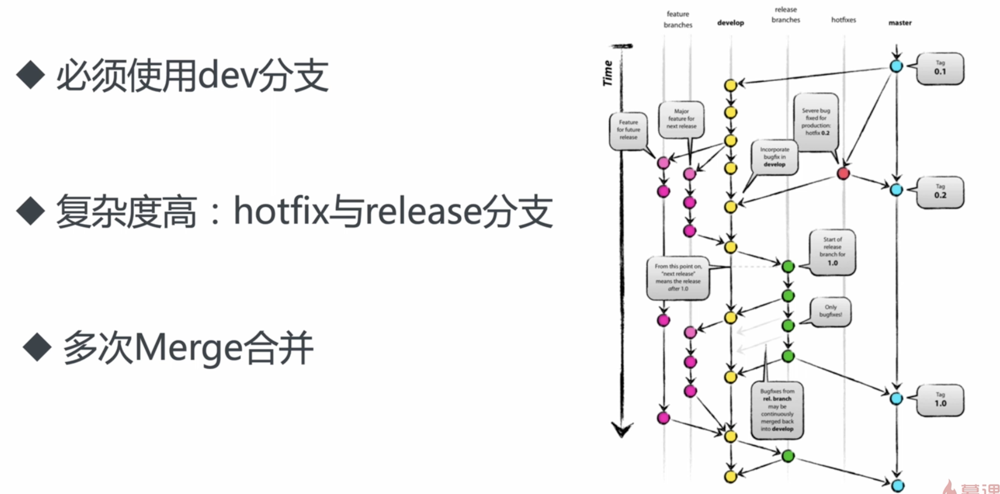
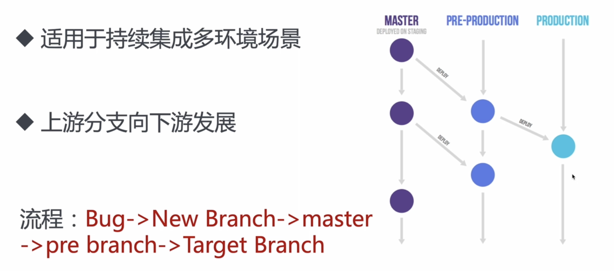
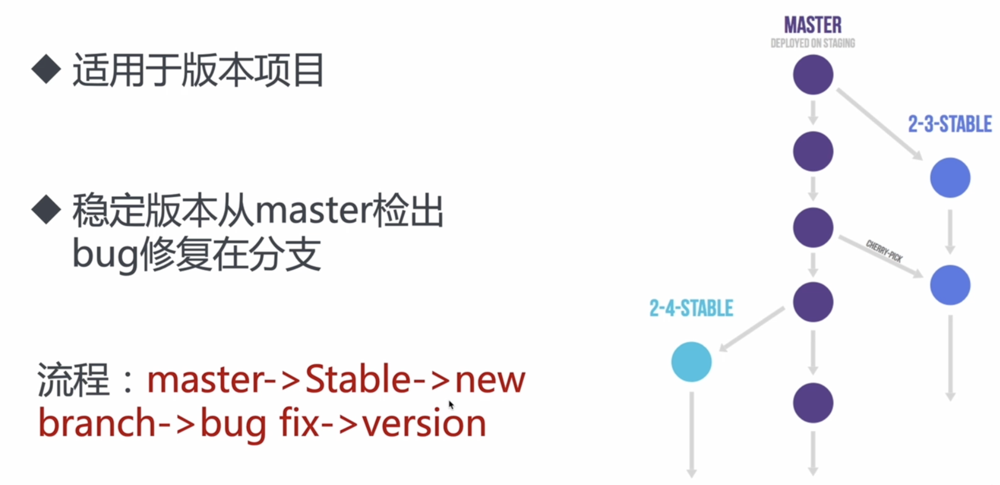
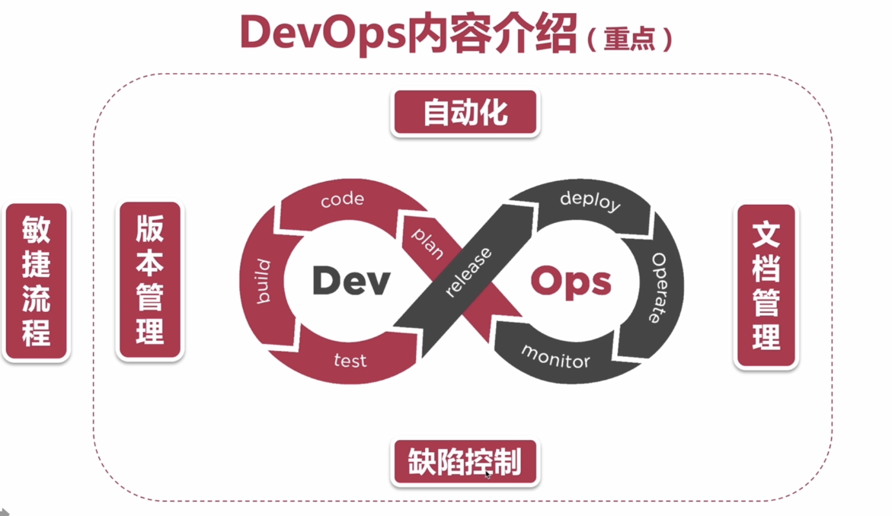
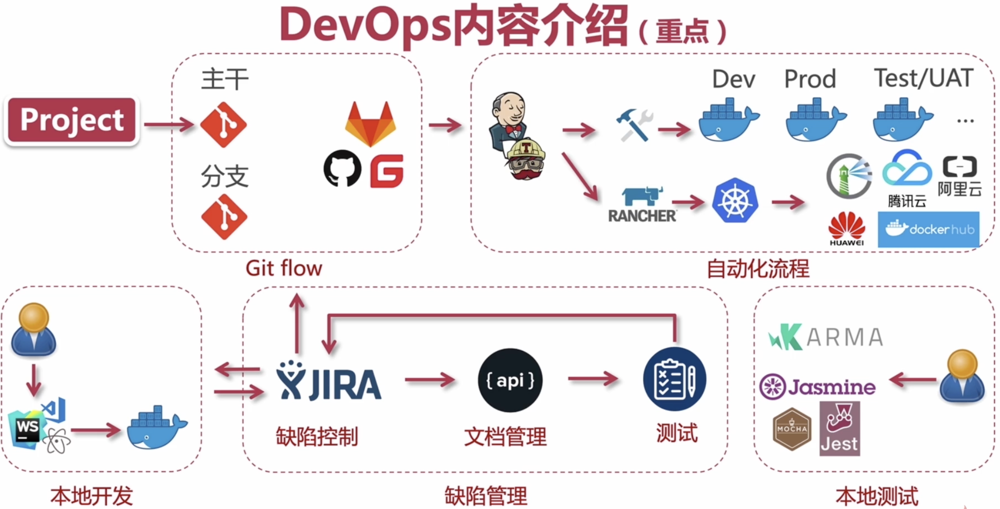

# 05- 场景五：自动化流程及缺陷管理

## 01: 四款文档管理工具介绍最近学习

### 协同工具

- 国内
  - Wps 云
  - 石墨
  - 有道云
  - 一起写
  - 其他
- 国外
  - Google Docs
  - Office 365
  - Alfresco
  - LogicalDOC CE

### 接口文档

- [showdoc](https://www.showdoc.com.cn/)
- [eolinker](https://www.eolink.com/#/)
- [MinDoc](https://mindoc.com.cn/docs/yqlj)
- [apizza](https://www.apizza.net/?utm_source=juejin&utm_medium=blog&utm_campaign=product&utm_content=0001)

### 其他

- gitbook
- blog
- 注释产出 API 文档
- mock

### 接口文档工具

- **接口模板，分组**
- 权限控制、团队协作
- 版本控制、本地部署

## 02: 项目开发团队协作——版本管理

### git Flow (重点)

### 经典模型的问题

### Git Flow

## 03: 关于 Git 你需要知道的知识点

## 04: 缺陷控制概念&最佳实践

软件开发

### 需求不明确 => 可能会导致返工

1. 需求不明确
2. 需求文档不清晰
3. 客户未确定需求
4. 内部反推动的工作风气
5. 功能模块未讨论清楚，分工不具体，人员未指定
6. 。。。。

### 进度有超期 => 可能会导致加班

1. 经常项目上线加班
2. 经常前期推不动，重度依赖 UI 设计，产品经理
3. 无人 PUSH 放风式管理
4. 自驱力不足
5. 。。。

### 工程有 Bug => 可能会导致难维护

1. 无代码风格指南
2. 无代码质量监控
3. 测试流程紊乱
4. 没有自动化测试闭环
5. 发布环境/测试环境
6. 。。。

### 协同有问题 => 可能会导致效率地下

1. 项目经理太忙
2. 项目经验经验不足
3. 有想法的人太多
4. 没有具体的分工
5. 缺少协同工具，人员的协同能力不同

### 缺陷控制概念

**缺陷控制**就是在项目全生命周期中，**保障项目质量的**一系列行为。

**缺陷跟踪系统/软件**是被设计用来帮助质量保证和程序员在工作中维护软件缺陷的跟踪报告，或者称作问题跟踪管理系统

主要的作用是提供**集中概览、开发状态、提供报告**

### 缺陷控制方法

- 需求不明确 => 持续沟通/督办
- 进度有超期 => 缺陷跟踪
- 工程有 Bug => 代码 Lint/规范
- 协同有问题 => 清单/待办

### 总结办法

- 分工明确，责任道人
- 借助工具，提升效率
- **量体裁衣，按需取用**

**用动态的眼光看问题，长远的角度实施计划**

### 最佳实践

- 小公司团队/扁平管理/项目外包/业务多样简单
- 传统团队/二级公司/流程冗长/业务花样复杂
- 中大型公司/KPI 驱动/技术单一/业务重复度高/技术深入

### 总结案例

- 无章办事/代码优化/代码质量
- 督办意识/工具看板/轻重缓急
- 意识薄弱/形同虚设/领导意识/团队意识

### 看似美好，实则难办？

#### 流程介绍

代码 => 团队 => 项目 => 公司

- 代码阶段
  - 自检代码
  - 质量监控
  - 版本控制
  - 代码风格
  - Snippets
- 团队
  - 互相监督
  - 意识形态
  - 定期培训、自检
  - 分工明确
  - 协同待办
  - 代码 Review
- 项目
  - 指定计划
  - 项目经理 push
  - 版本控制
  - 协商沟通
  - 定期检验
  - 纠正措施
  - 备选方案
- 公司
  - 缺陷管理软件
  - 公司流程
  - 奖惩有度
  - 抽样检查
  - 质量改进
  - 总结推演

## 05: ESLint 是如何使用和实现的？

## 06: 什么是前端自动化？什么是 CICD？

### 自动化相关概念

**前端自动化**是指前端代码的自动化构建、打包、测试以及部署等流畅

持续集成（Continuous Integration)

持续部署（Continuous Deployment)

前端自动化通常与 **CI/CD** 流程相结合

### 为什么要结合自动化流程？

#### 自动化流程的意义

* **减少人为失误，提高软件质量**
* 效率迭代，便捷部署
* 快速交付，便于管理
