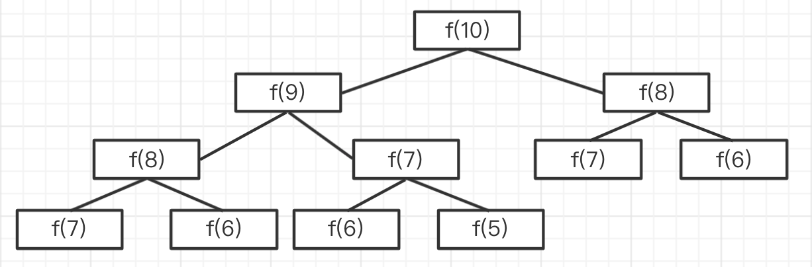

# 03: 数据结构和算法（下），大厂面试必考

## 01: 求二叉搜索树的第 K 小的值

### 题目

一个二叉搜索树，求其中的第 K 小的节点的值。
如下图，第 3 小的节点是 `4`


### 二叉树

树，大家应该都知道，如前端常见的 DOM 树、vdom 结构。

二叉树，顾名思义，就是每个节点最多能有两个子节点。

树节点的数据结构是 `{ value, left, right }`

```ts
interface ITreeNode {
  value: number // 或其他类型
  left?: ITreeNode | null
  right?: ITreeNode | null
}
```

### 二叉树的遍历

- 前序遍历：`root -> left -> right`
- 中序遍历：`left -> root -> right`
- 后序遍历：`left -> right -> root`

### 二叉树遍历的三种方式代码演示

```typescript
// 数据结构演示
const bst: ITreeNode = {
  value: 5,
  left: {
    value: 3,
    left: {
      value: 2,
      left: null,
      right: null,
    },
    right: {
      value: 4,
      left: null,
      right: null,
    },
  },
  right: {
    value: 7,
    left: {
      value: 6,
      left: null,
      right: null,
    },
    right: {
      value: 8,
      left: null,
      right: null,
    },
  },
}
```

#### 前序遍历

```typescript
export interface ITreeNode {
  value: number
  left: ITreeNode | null
  right: ITreeNode | null
}

/**
 * 二叉树前序遍历
 * @param node tree node
 */
function preOrderTraverse(node: ITreeNode | null) {
  if (node == null) return
  console.log(node.value)
  preOrderTraverse(node.left)
  preOrderTraverse(node.right)
}

// 前序遍历结果
preOrderTraverse(bst) // 5 3 2 4 7 6 8
```

#### 中序遍历

```typescript
/**
 * 二叉树中序遍历
 * @param node tree node
 */
function inOrderTraverse(node: ITreeNode | null) {
  if (node == null) return
  inOrderTraverse(node.left)
  console.log(node.value)
  inOrderTraverse(node.right)
}

// 中序遍历结果
inOrderTraverse(bst) // 2 3 4 5 6 7 8
```

#### 后序遍历

```typescript
/**
 * 二叉树后序遍历
 * @param node tree node
 */
function postOrderTraverse(node: ITreeNode | null) {
  if (node == null) return
  postOrderTraverse(node.left)
  postOrderTraverse(node.right)
  console.log(node.value)
}

// 后序遍历结果
postOrderTraverse(bst) // 2 4 3 6 8 7 5
```

### 二叉搜索树 BST

- left(包括其后代) value <= 根节点(root value)
- right(包括其后代) value >= 根节点(root value)

### 分析题目

根据 `BST` 的特点，中序遍历的结果，正好是按照从小到大排序的结果。

所以，中序遍历，求数组的 `arr[k]` 即可。

### 答案

```typescript
interface ITreeNode {
  value: number
  left: ITreeNode | null
  right: ITreeNode | null
}

const arr: number[] = []

function inOrderTraverse(node: ITreeNode | null) {
  if (node == null) return
  inOrderTraverse(node.left)
  arr.push(node.value)
  inOrderTraverse(node.right)
}

/**
 * 寻找 BST 里的第 K 小值
 * @param node tree node
 * @param k 第几个值
 */
function getKthValue(node: ITreeNode, k: number): number | null {
  inOrderTraverse(node)
  return arr[k - 1] || null
}

console.log(getKthValue(bst, 3)) // 4
```

### 划重点

- 二叉搜索树的特点
- 前序、中序、后序遍历
- 二叉树的特点：`left <= root`, `right >= root`
- 二叉搜索树的价值：可使用 **二分法** 进行快速查找

## 02：为什么二叉树很重要，而不是三叉树四岔树

### 如何让性能整体最优？

有序结构

- 数组：查找易 O(1)，增删难 O(n)
- 链表：查找难 O(n), 增删易 O(1)

将两者优点结合起来 —— 二叉搜索树 BST ：查找易，增删易 —— 可使用二分算法

二叉搜索树 BST

- 左节点（包括其后代） <= 根节点
- 右节点（包括其后代） >= 根节点


### 高级二叉树

二叉搜索树 BST ，如果左右不平衡，也无法做到最优。

极端情况下，它就成了链表 —— 这不是我们想要的。

#### **平衡二叉搜索树 BBST** ：

- 要求树左右尽量平衡

* 树高度 `h` 约等于 `logn`
* 查找、增删，时间复杂度都等于 `O(logn)`

#### **红黑树**：

- 一种自动平衡的二叉树

* 节点分 红/黑 两种颜色，通过颜色转换来维持树的平衡
* 相比于普通平衡二叉树，它维持平衡的效率更高


#### B 树：

- 物理上是多叉树，但逻辑上是一个 BST 。
- 用于高效 I/O ，如关系型数据库就用 B 树来组织数据结构。


### 小结

- 数组、链表，各有各的缺点
- 特定的二叉树（BBST）可以让整体效果最优
- 各种高级二叉树，继续优化，满足不同场景

## 03：堆有什么特点，和二叉树有什么关系

### 堆栈模型

JS 执行时代码中的变量

- 值类型 - 存储到栈

- 引用类型 - 存储到堆


#### 堆

- 节点的值，总是不大于（或不小于）其父节点的值
- 完全二叉树
- 最大堆：父节点 >= 子节点
- 最小堆：父节点 <= 子节点


### 逻辑结构 VS 物理结构

- 堆，**逻辑结构**是一个二叉树
- 但是**物理结构**是一个数组
- 数组：适合连续存储 + 节省空间（回顾堆栈模型）


```js
// 上图是一个堆（从小到大），可以用数组表示
const heap = [-1, 10, 14, 25, 33, 81, 82, 99] // 忽略 0 节点

// 节点关系
const parentIndex = Math.floor(i / 2)
const leftIndex = 2 * i
const rightIndex = 2 * i + 1
```

### 堆 VS BST

#### 对比

堆的排序规则，没有 `BST` 那么严格，这就造成了

- 查询比 `BST` 慢
- 增删比 BST 快，维持平衡也更快
- 但整体复杂度都是 `O(logn)` 级别，即树的高度

#### 堆的使用场景

- 特别适合 "堆栈模型"
- 堆的数据，都是在栈中引用的，不会直接从根节点搜索

- 堆的物理结构是数组，根据栈的地址，可用 O(1)找到目标，所以查询复杂度就是 `O(1)`

### 总结

- 物理结构是数组（空间更小），逻辑结构是二叉树（操作更快）
- 适用于“堆栈”结构

### 答案

- 二叉树，可以充分利用二分法
- 二叉树可以同时规避数组和链表的缺点
- 引申到 `BST` `BBST` 等其他扩展结构

### 划重点

- 二分法的神奇力量
- 各个高级数据结构的存在价值、设计初衷
- 数据结构是基本功能

## 04: 求斐波那契数列的第 n 值

> 递归算法会导致运行崩溃

### 题目

用 Javascript 计算第 n 个斐波那契数列的值，注意时间复杂度。

### 分析

斐波那契数列很好理解

- `f(0) = 0`

- `f(1) = 1`

- `f(n) = f(n - 1) + f(n - 2)` 前两个值的和

### 递归计算

但这种方式会导致很多重复计算。

时间复杂度是 `O(2^n)` ，爆炸式增长，不可用。（可以试试 `n: 100` ，程序会卡死）



### 优化

- 不用递归，用循环
- 记录中间结果
- 时间复杂度降低到 `O(n)`

### 动态规划

即，把一个大问题，拆解为不同的小问题，递归向下。

【注意】一般使用动态规划的思路（递归）分析问题，再转换为循环来解决问题。

### 三大算法思维

- 贪心（递归）
- 二分
- 动态规划

### 答案

```typescript
// /**
//  * 斐波那契数列（递归）--不可用，时间复杂度太高
//  * @param n n
//  */
// function fibonacci(n: number): number {
//     if (n <= 0) return 0
//     if (n === 1) return 1

//     return fibonacci(n - 1) + fibonacci(n - 2)
// }
```

```typescript
/**
 * 斐波那契数列（循环）
 * @param n n
 */
export function fibonacci(n: number): number {
  if (n <= 0) return 0
  if (n === 1) return 1

  let n1 = 1 // 记录 n-1 的结果
  let n2 = 0 // 记录 n-2 的结果
  let res = 0

  for (let i = 2; i <= n; i++) {
    res = n1 + n2

    // 记录中间结果
    n2 = n1
    n1 = res
  }

  return res
}
```

### 划重点

- 动态规划的思路
- 识别出时间复杂度

## 05：连环问：青蛙跳台阶

青蛙跳台阶：一只青蛙，一次可以跳 1 个台阶，也可以跳 2 个台阶，问该青蛙跳上 n 级台阶，总共有多少种方式？

用动态规划分析

- 要跳到 跳 1 级台阶，只有一种方式， `f(1) = 1`
- 要跳到 跳 2 级台阶，有 2 种方式，`f(2) = 2`
- `f(n) = f(n - 1) + fn(n - 2)` 跳 n 级，可拆分为两个问题
  - 第一次跳，要么 1 级，要么 2 级，只有这两种
  - 第一次跳 1 级，剩下有 `f(n - 1)` 种方式
  - 第一次跳 2 级，剩下有 `f(n - 2)` 种方式

看公式，和斐波那契数列一样。

## 06: 移动 0 到数组的末尾

> splice 会导致性能问题

### **题目**

定义一个函数，将数组种所有的 `0` 都移动到末尾，例如输入 `[1, 0, 3, 0, 11, 0]` 输出 `[1, 3, 11, 0, 0, 0]`。要求：

- 只移动 `0` ，其他数字顺序不变

- 考虑时间复杂度

- 必须在原数组就行操作

### 如果不限制“必须在原数组修改”

- 定义 `part1` `part2` 两个空数组
- 遍历数组，非 `0` push 到 `part1` ，`0` push 到 `part2`
- 返回 `part1.concat(part2)`

时间复杂度 `O(n)` 空间复杂度 `O(n)` ，

所以，遇到类似问题，要提前问面试官：**是否能在原数组基础上修改？**

### 传统方式

#### 思路

- 遍历数组
- 遇到 `0` 则 push 到数组末尾
- 然后用 splice 截取掉当前元素

#### 分析性能

- 空间复杂度没有问题 `O(1)`
- 时间复杂度
  - 看似是 `O(n)`
  - 但实际上 `splice` 和 `unshift` 一样，修改数组结构，时间复杂度是 `O(n)`
  - 总体看来时间复杂度是 `O(n^2)`，**不可用**

【注意】网上有很多人对这种方式点赞，切不可随意从众，要对思考！

```typescript
/**
 * 移动 0 到数组的末尾（嵌套循环）
 * @param arr number arr
 */
export function moveZero1(arr: number[]): void {
  const length = arr.length
  if (length === 0) return

  let zeroLength = 0

  // O(n^2)
  for (let i = 0; i < length - zeroLength; i++) {
    if (arr[i] === 0) {
      arr.push(0)
      arr.splice(i, 1) // 本身就有 O(n)
      i-- // 数组截取了一个元素，i 要递减，否则连续 0 就会有错误
      zeroLength++ // 累加 0 的长度
    }
  }
}
```

#### 功能测试

```typescript
const arr = [1, 0, 3, 4, 0, 0, 11, 0]
moveZero1(arr)
console.log(arr)
```

### 优化-双指针

思路

- 指针 1 指向第一个 0 ，指针 2 指向第一个非 0
- 把指针 1 和 指针 2 进行交换，指针继续向后移
- 只遍历一次，所以时间复杂度是 `O(n)`

性能分析

- 时间复杂度 `O(n)`
- 空间复杂度 `O(1)`

性能测试，实际对比差距非常大。

```typescript
/**
 * 移动 0 到数组末尾（双指针）
 * @param arr number arr
 */
export function moveZero2(arr: number[]): void {
  const length = arr.length
  if (length === 0) return

  let i
  let j = -1 // 指向第一个 0

  for (i = 0; i < length; i++) {
    if (arr[i] === 0) {
      // 第一个 0
      if (j < 0) {
        j = i
      }
    }

    if (arr[i] !== 0 && j >= 0) {
      // 交换
      const n = arr[i]
      arr[i] = arr[j]
      arr[j] = n

      j++
    }
  }
}
```

### 划重点

- 咨询面试官，确认是否必须要修改原数据？
- 数组是有序结构，连续存储，不能随意使用 `splice` `unshift`等 API
- 双指针的思路

## 07：获取字符串中连续最多的字符以及次数

### 题目

给一个字符串，找出连续最多的字符，以及次数

例如字符串 `'aabbcccddeeee11223'` 连续最多的是 `e` ，4 次。

### 传统方式

嵌套循环，找出每个字符的连续次数，并记录比较。

时间复杂度看似是 `O(n^2)`，因为是嵌套循环。 **但实际上它的时间复杂度是 `O(n)`，因为循环中有跳转**。

#### 代码展示

```typescript
interface IRes {
  char: string
  length: number
}

/**
 * 求连续最多的字符和次数（嵌套循环）
 * @param str str
 */
export function findContinuousChar1(str: string): IRes {
  const res: IRes = {
    char: '',
    length: 0,
  }

  const length = str.length
  if (length === 0) return res

  let tempLength = 0 // 临时记录当前连续字符的长度

  // O(n)
  for (let i = 0; i < length; i++) {
    tempLength = 0 // 重置

    for (let j = i; j < length; j++) {
      if (str[i] === str[j]) {
        tempLength++
      }

      if (str[i] !== str[j] || j === length - 1) {
        // 不相等，或者已经到了最后一个元素。要去判断最大值
        if (tempLength > res.length) {
          res.char = str[i]
          res.length = tempLength
        }

        if (i < length - 1) {
          i = j - 1 // 跳步
        }

        break
      }
    }
  }
  return res
}
```

#### 功能测试

```typescript
const str = 'aabbcccddeeee11223'
console.info(findContinuousChar1(str))
```

### 双指针

- 定义指针 i 和 j. j 不动，i 移动
- 如果 i 和 j 的值相等，则 i 继续移动
- 直到 i 和 j 的值不相等，记录此时的长度处理。并让 j 追上 i，继续移动指针比较处理

#### 代码演示

```typescript
/**
 * 求连续最多的字符和次数（双指针）
 * @param str str
 */
export function findContinuousChar2(str: string): IRes {
  const res: IRes = {
    char: '',
    length: 0,
  }

  const length = str.length
  if (length === 0) return res

  let tempLength = 0 // 临时记录当前连续字符的长度
  let i = 0
  let j = 0

  // O(n)
  for (; i < length; i++) {
    if (str[i] === str[j]) {
      tempLength++
    }

    if (str[i] !== str[j] || i === length - 1) {
      // 不相等，或者 i 到了字符串的末尾
      if (tempLength > res.length) {
        res.char = str[j]
        res.length = tempLength
      }
      tempLength = 0 // reset

      if (i < length - 1) {
        j = i // 让 j “追上” i
        i-- // 细节
      }
    }
  }

  return res
}
```

更好理解的一个代码解法

```typescript
function findContinuousChar3(str: string): IRes {
  let j = 0,
    maxNumber = 1,
    maxWord = str[0] || ''
  for (let i = 1; i < str.length; i++) {
    if (str[j] !== str[i]) {
      if (i - j > maxNumber) {
        maxNumber = i - j
        maxWord = str[i - 1]
      }
      j = i
    } else if (i === str.length - 1) {
      // 如果到了末尾，长度需要 进行 i- j + 1
      if (i - j + 1 > maxNumber) {
        maxNumber = i - j + 1
        maxWord = str[i]
      }
    }
  }
  return {
    char: maxWord,
    length: maxNumber,
  }
}
```

上面使用了两个判断，我们可以遍历时多往字符串后面遍历一位，因为最后一位是 undefined,肯定不相等，这样就不用做末尾处理了

```typescript
function findContinuousChar4(str: string): IRes {
  let j = 0,
    maxNumber = 1,
    maxWord = str[0] || ''
  // 注意：i < str.length + 1
  for (let i = 1; i < str.length + 1; i++) {
    if (str[j] !== str[i]) {
      if (i - j > maxNumber) {
        maxNumber = i - j
        maxWord = str[i - 1]
      }
      j = i
    }
  }
  return {
    char: maxWord,
    length: maxNumber,
  }
}
```

### 性能测试

```typescript
let str = ''
for (let i = 0; i < 100 * 10000; i++) {
  str += i.toString()
}

console.time('findContinuousChar1')
findContinuousChar1(str)
console.timeEnd('findContinuousChar1') // 125.692ms

console.time('findContinuousChar2')
findContinuousChar2(str)
console.timeEnd('findContinuousChar2') // 110.623ms
```

### 网络上的其他方式

- 正则表达式 —— 正则表达式的效率非常低，可进行性能测试（代码 `x-reg.ts` ）

  ```typescript
  const str = '100abc'
  const reg = /^\d+/

  console.time('reg')
  for (let i = 0; i < 100 * 10000; i++) {
    reg.test(str)
  }
  console.timeEnd('reg') // reg: 36.837ms

  console.time('indexOf')
  for (let i = 0; i < 100 * 10000; i++) {
    str.indexOf('100')
  }
  console.timeEnd('indexOf') // indexOf: 4.632ms
  ```

- 使用对象累计各个字符串的长度，然后求出最大值 —— 增加空间复杂度，面试官不会喜欢

【注意】算法尽量用**基础代码**实现，尽量不要用现成的 API 或语法糖 —— 方便，但你不好直观判断时间复杂度

### **划重点**

- 注意实际的时间复杂度，不要被代码所迷惑

- 双指针的思路（常用于解决嵌套循环）
- 算法题慎用正则表达式（实际工作数据量不大时，可以使用）

## 08：用 JS 实现快速排序并说明时间复杂度

### 题目

用 Javascript 实现快速排序，并说明时间复杂度。

### 思路

快速排序是基础算法之一，算法思路是固定的

- 找到中间位置 `midValue`
- 遍历数组，小于 `midValue` 放在 `left` ，大于 `midValue` 放在 `right`
- 继续递归，`concat` 拼接

### 细节：获取 midValue

代码实现时，获取 midValue 可以通过 `splice` 和 `slice` 两种方式

理论分析，`slice` 要优于 `splice` ，因为 `splice` 会修改原数组。<br>
但实际性能测试发现两者接近。

但是，即便如此还是倾向于选择 **`slice`** —— **因为它不会改动原数组**，类似于函数式编程

### 性能分析

- 快速排序 时间复杂度 `O(n*logn)` —— 有遍历，有二分

- 普通的排序算法（如冒泡排序）时间复杂度时 `O(n^2)`

### 答案

#### 使用 splice

```typescript
/**
 * 快速排序（使用 splice）
 * @param arr number arr
 */
export function quickSort1(arr: number[]): number[] {
  const length = arr.length
  if (length === 0) return arr

  const midIndex = Math.floor(length / 2)
  const midValue = arr.splice(midIndex, 1)[0]

  const left: number[] = []
  const right: number[] = []

  // 注意：这里不用直接用 length ，而是用 arr.length 。因为 arr 已经被 splice 给修改了
  for (let i = 0; i < arr.length; i++) {
    const n = arr[i]
    if (n < midValue) {
      // 小于 midValue ，则放在 left
      left.push(n)
    } else {
      // 大于 midValue ，则放在 right
      right.push(n)
    }
  }

  return quickSort1(left).concat([midValue], quickSort1(right))
}
```

#### 使用 slice 方案

```typescript
/**
 * 快速排序（使用 slice）
 * @param arr number arr
 */
export function quickSort2(arr: number[]): number[] {
  const length = arr.length
  if (length === 0) return arr

  const midIndex = Math.floor(length / 2)
  const midValue = arr.slice(midIndex, midIndex + 1)[0]

  const left: number[] = []
  const right: number[] = []

  for (let i = 0; i < length; i++) {
    if (i !== midIndex) {
      const n = arr[i]
      if (n < midValue) {
        // 小于 midValue ，则放在 left
        left.push(n)
      } else {
        // 大于 midValue ，则放在 right
        right.push(n)
      }
    }
  }

  return quickSort2(left).concat([midValue], quickSort2(right))
}
```

### 功能测试

```typescript
const arr1 = [1, 6, 2, 7, 3, 8, 4, 9, 5]
console.info(quickSort1(arr1))
console.info(quickSort2(arr1))
```

### 性能测试

#### 以上实现方式性能比较

```typescript
const arr1 = []
for (let i = 0; i < 10 * 10000; i++) {
  arr1.push(Math.floor(Math.random() * 1000))
}
console.time('quickSort1')
quickSort1(arr1)
console.timeEnd('quickSort1') // quickSort1: 106.125ms

const arr2 = []
for (let i = 0; i < 10 * 10000; i++) {
  arr2.push(Math.floor(Math.random() * 1000))
}
console.time('quickSort2')
quickSort2(arr2)
console.timeEnd('quickSort2') // quickSort2: 85.003ms
```

#### 单独比较 splice 和 slice

```typescript
const arr1 = []
for (let i = 0; i < 10 * 10000; i++) {
  arr1.push(Math.floor(Math.random() * 1000))
}
console.time('splice')
arr1.splice(5 * 10000, 1)
console.timeEnd('splice') // splice: 0.153ms

const arr2 = []
for (let i = 0; i < 10 * 10000; i++) {
  arr2.push(Math.floor(Math.random() * 1000))
}
console.time('slice')
arr2.slice(5 * 10000, 5 * 10000 + 1)
console.timeEnd('slice') // slice: 0.016ms
```

#### splice 和 slice 没有区分出来

- 算法本身的时间复杂度就够高 `O(n * logn)`
- 外加，`splice`是逐步二分之后执行的，二分会快速消减数量级
- 如果单独比较 `splice` 和 `slice`，效果会比较明显

### 划重点

- 排序算法（基本功）
- 二分法的时间复杂度
- 注意数组的操作（ `splice` vs `slice` ）

## 09: 获取 1-10000 之前所有的对称数（回文数)

### 题目

打印 1-10000 之间的对称数(回文)

例如： 0, 1-9, 11, 22, 101, 232, 1221,

### 思路 1：使用数组反转

- 数字转换为字符串
- 字符串转换为数组 reverse ，再 join 生成字符串
- 比较前后的字符串

```typescript
export function findPalindromeNumbers1(max: number): number[] {
  const res: number[] = []
  if (max <= 0) return res

  for (let i = 1; i <= max; i++) {
    // 转换为字符串，转换为数组，再反转，比较
    const s = i.toString()
    if (s === s.split('').reverse().join('')) {
      res.push(i)
    }
  }

  return res
}
```

### 思路 2：使用字符串头尾比较

- 数字转换为字符串
- 字符串头尾比较 -（也可以使用**栈**，像括号匹配，但要注意奇偶数）

```typescript
/**
 * 查询 1-max 的所有对称数（字符串前后比较）
 * @param max 最大值
 */
export function findPalindromeNumbers2(max: number): number[] {
  const res: number[] = []
  if (max <= 0) return res

  for (let i = 1; i <= max; i++) {
    const s = i.toString()
    const length = s.length

    // 字符串头尾比较
    let flag = true
    let startIndex = 0 // 字符串开始
    let endIndex = length - 1 // 字符串结束
    while (startIndex < endIndex) {
      if (s[startIndex] !== s[endIndex]) {
        flag = false
        break
      } else {
        // 继续比较
        startIndex++
        endIndex--
      }
    }

    if (flag) res.push(i)
  }

  return res
}
```

### 思路 3：生成反转数(更推荐)

- 通过 `%` 和 `Math.floor` 将数字生成一个反转数
- 比较前后的数字
- (全程操作数字，没有字符串类型)

```typescript
/**
 * 查询 1-max 的所有对称数（翻转数字）
 * @param max 最大值
 */
export function findPalindromeNumbers3(max: number): number[] {
  const res: number[] = []
  if (max <= 0) return res

  for (let i = 1; i <= max; i++) {
    let n = i
    let rev = 0 // 存储翻转数

    // 生成翻转数
    // 比如，当 i = 123 时
    // 第一次，n = 123, rev = 0,执行后， rev = 3 n = 12
    // 第二次，执行后，rev = 30 + 2 = 32 n = 1
    // 第三次，执行后，rev = 320 + 1 = 321, n = 0, while 结束
    while (n > 0) {
      rev = rev * 10 + (n % 10)
      n = Math.floor(n / 10)
    }

    if (i === rev) res.push(i)
  }

  return res
}
```

### 功能测试

```typescript
console.info(findPalindromeNumbers1(200))
console.info(findPalindromeNumbers2(200))
console.info(findPalindromeNumbers3(200))

// [ 1,2,3,4,5,6,7,8,9,11,22,33,44,55,66,77,88,99,101,111,121,131,141,151,161,171,181,191 ]
```

### 性能测试

```typescript
console.time('findPalindromeNumbers1')
findPalindromeNumbers1(100 * 10000)
console.timeEnd('findPalindromeNumbers1')
// findPalindromeNumbers1: 237.039ms

console.time('findPalindromeNumbers2')
findPalindromeNumbers2(100 * 10000)
console.timeEnd('findPalindromeNumbers2')
// findPalindromeNumbers2: 38.668ms

console.time('findPalindromeNumbers3')
findPalindromeNumbers3(100 * 10000)
console.timeEnd('findPalindromeNumbers3')
// findPalindromeNumbers3: 32.306ms
```

### 性能分析

- 时间复杂度看似相当，都是 `O(n)`

- 但 方案 1 涉及到了数组的转换和操作，就需要耗费大量的时间

  - 数组 reverse 需要时间

  - 数组和字符串的转换需要时间

- 方案 2、3 比较，数字操作最快。电脑的原型就是计算器，所以处理数字是最快的。
- 思路 2 要用栈，不合适。因为栈一般用数组实现，会慢

### 划重点

- 尽量不要使用内置 API ，不好判断时间复杂度
- 尽量不要转换数据格式，尤其注意数组（有序结构，不能乱来～）
- 数字操作最快，其次是字符串

## 10：如何实现高效的英文单词前缀匹配

### 题目

请描述算法思路，不要求写出代码。

- 先给一个英文单词库（数组），里面有几十万个英文单词
- 再给一个输入框，输入字母，搜索单词
- 输入英文字母，要实时给出搜索结果，按前缀匹配

要求

- 尽量快
- 不要使用防抖（输入过程中就及时识别）

### 常规思路

`keyup` 之后，拿当前的单词，遍历词库数组，通过 `indexOf` 来前缀匹配。

性能分析

- 算法思路的时间复杂度是 `O(n)`
- 外加 `indexOf` 也需要时间复杂度。实际的复杂度要超过 `O(n)`

### 优化数据结构

英文字母一共 26 个，可按照第一个字母分组，分为 26 组。这样搜索次数就减少很多。

可按照第一个字母分组，那也可以按照第二个、第三个字母分组

即，在程序初始化时，把数组变成一个树，然后按照字母顺序在树中查找。

```js
const arr = [
  'abs',
  'arab',
  'array',
  'arrow',
  'boot',
  'boss',
  // 更多...
]

const obj = {
  a: {
    b: {
      s: {},
    },
    r: {
      a: {
        b: {},
      },
      r: {
        a: {
          y: {},
        },
        o: {
          w: {},
        },
      },
    },
  },
  b: {
    o: {
      o: {
        t: {},
      },
      s: {
        s: {},
      },
    },
  },
  // 更多...
}
```

这样时间复杂度就大幅度减少，从 `O(n)` 降低到 `O(m)` （`m` 是单词的最大长度）

### 性能分析

- 如遍历数组，时间复杂度至少 O(n)起步（n 是数组长度）
- 而改为树，时间复杂度降低到 O(m)（m 是单词的长度）
- PS: 哈希表（对象）通过 key 查询，时间复杂度是 O(1)

### 划重点

- 考虑优化原始数据结构（需要和面试官沟通确认）
- 对于已经明确的范围的数据（如 26 个英文字母），可以考虑使用哈希表(对象)
- 以空间换时间，定义数据结构最重要

## 11：用 JS 实现数字千分位格式化

### **题目**

- 将数字按照千分位生成字符串，即每三位加一个逗号。不考虑小数。

- 如输入数字 `78100200300` 返回字符串 `'78,100,200,300'`

- 注意：逆序判断

### 常规思路

- 思路 1：转换为数组，reverse, 每 3 位拆分
- 思路 2：使用正则表达式（工作中可以使用，算法面试中不建议使用）
- 思路 3：使用字符串拆分

#### 思路 1：转换为数组

```typescript
/**
 * 千分位格式化（使用数组）
 * @param n number
 */
export function format1(n: number): string {
  n = Math.floor(n) // 只考虑整数

  const s = n.toString()
  const arr = s.split('').reverse()
  return arr.reduce((prev, val, index) => {
    if (index % 3 === 0) {
      if (prev) {
        return val + ',' + prev
      } else {
        return val
      }
    } else {
      return val + prev
    }
  }, '')
}
```

#### 思路 2：使用正则表达式

```typescript
function toThousands(num) {
  let str = num.toString()
  return str.replace(/(\d)(?=(?:\d{3})+$)/g, '$1,')
}
toThousands(123) //123
toThousands(1234546) //123,456
toThousands(12345678) //12,345,678
```

#### 思路 3：使用字符串拆分（推荐）

```typescript
/**
 * 数字千分位格式化（字符串分析）
 * @param n number
 */
export function format2(n: number): string {
  n = Math.floor(n) // 只考虑整数

  let res = ''
  const s = n.toString()
  const length = s.length

  for (let i = length - 1; i >= 0; i--) {
    const j = length - i
    if (j % 3 === 0) {
      if (i === 0) {
        // 如果到了首字母，直接拼接即可，
        res = s[i] + res
      } else {
        // 否则需要拼接分隔符 ,
        res = ',' + s[i] + res
      }
    } else {
      // 如果遍历过的长度不是三位的倍数，则直接相加即可
      res = s[i] + res
    }
  }
  return res
}
```

#### 测试

#### 功能测试

```typescript
const n = 10201004050
console.info('format1', format1(n))
console.info('format2', format2(n))
```

### 性能分析

- 数组转换，影响性能
- 正则表达式，性能较差
- 操作字符串，性能较好(推荐)

### 划重点

- 从尾向头计算，和日常遍历的顺序相反
- 慎用数组操作，尽量不要转换数据结构
- 慎用正则表达式

## 12：切换字母大小写

### 题目

切换字母大小写，输入 `'aBc'` 输出 `'AbC'`

### 分析

需要判断字母是大写还是小写

- 正则表达式
- `charCodeAt` 获取 ASCII 码（ASCII 码表，可以网上搜索）

### 答案

#### 思路 1：正则表达式

```typescript
/**
 * 切换字母大小写（正则表达式）
 * @param s str
 */
export function switchLetterCase1(s: string): string {
  let res = ''

  const length = s.length
  if (length === 0) return res

  const reg1 = /[a-z]/
  const reg2 = /[A-Z]/

  for (let i = 0; i < length; i++) {
    const c = s[i]
    if (reg1.test(c)) {
      res += c.toUpperCase()
    } else if (reg2.test(c)) {
      res += c.toLowerCase()
    } else {
      res += c
    }
  }

  return res
}
```

#### 思路 2：ASCII 编码

```typescript
/**
 * 切换字母大小写（ASCII 编码）
 * @param s str
 */
export function switchLetterCase2(s: string): string {
  let res = ''

  const length = s.length
  if (length === 0) return res

  for (let i = 0; i < length; i++) {
    const c = s[i]
    const code = c.charCodeAt(0)

    if (code >= 65 && code <= 90) {
      res += c.toLowerCase()
    } else if (code >= 97 && code <= 122) {
      res += c.toUpperCase()
    } else {
      res += c
    }
  }

  return res
}
```

### 功能测试

```typescript
const str = '100aBcD$#xYz'
console.info(switchLetterCase1(str))
console.info(switchLetterCase2(str))
```

### 性能测试

```typescript
const str =
  '100aBcD$#xYz100aBcD$#xYz100aBcD$#xYz100aBcD$#xYz100aBcD$#xYz100aBcD$#xYz'
console.time('switchLetterCase1')
for (let i = 0; i < 10 * 10000; i++) {
  switchLetterCase1(str)
}
console.timeEnd('switchLetterCase1')
// switchLetterCase1: 283.361ms

console.time('switchLetterCase2')
for (let i = 0; i < 10 * 10000; i++) {
  switchLetterCase2(str)
}
console.timeEnd('switchLetterCase2')
// switchLetterCase2: 144.54ms
```

### 性能分析

- 正则表达式性能较差
- ASCII 码性能较好

### 划重点

- 慎用正则表达式
- 常见字符的 ASCII 码最好掌握

## 13: 为什么 0.1+0.2!==0.3

### 题目

为何 `0.1 + 0.2 !== 0.3`

### 答案

- 计算机用二进制存储数据。

- 整数用二进制没有误差，如 `9` 表示为 `1001` 。

- 而有的小数无法用二进制表示，如 `0.2` 用二进制表示就是 `1.10011001100...`

- 所以，累加小数时会出现误差。

- 这不仅仅是 JS ，所有的计算机语言都这样。

### 扩展

- 可以使用第三方库 [https://www.npmjs.com/package/mathjs](https://www.npmjs.com/package/mathjs)

## 14: 扩展：总结前端开发中常见的数据结构

前端开发中常见的数据结构

### 栈 Stack

栈 Stack 是一种“先进后出”的数据结构。


```js
// 数组实现 栈
const stack = []
stack.push(100) // 压栈
stack.pop() // 出栈
```

### 队列 Queue

队列 Queue 是一种“先进先出”的数据结构。


```js
// 数组实现 队列
const queue = []
queue.push(100) // 入队
queue.shift() // 出队
```

### 链表 Linked list

链表不是连续的数据结构，而是由一系列的节点组成，节点之间通过指针连接。


```ts
// 链表节点的数据结构
interface IListNode {
  data: any
  next: IListNode | null
}
```

### 树 Tree

树，是一种有序的层级结构。每个节点下面可以有若干个子节点。例如常见的 DOM 树。


```ts
// 树节点的数据结构
interface ITreeNode {
  data: any
  children: ITreeNode[] | null
}
```

### 二叉树 Binary Tree

二叉树，首先它是一棵树，其次它的每个节点，最多有两个子节点，分别为 `left` 和 `right`


```ts
// 二叉树节点的数据结构
interface IBinaryTreeNode {
  data: any
  left: IBinaryTreeNode | null
  right: IBinaryTreeNode | null
}
```

## 15: 扩展：算法时间复杂度

本文总结一下前端算法常用的时间复杂度，对比学习。


### O(1)

代码就是平铺直叙的执行，没有任何循环。

### O(logn)

有循环，但其中使用了二分法，例如：二分查找算法

二分法是非常重要的算法思维，它可以极大的减少复杂度，而且计算量越大、减少的越明显。可以看看本文上面的图。

### O(n)

普通的循环。

### O(n\*logn)

嵌套循环，一层是普通循环，一层有二分算法。例如：快速排序算法。

### O(n^2)

两个普通循环的嵌套，例如常见的冒泡排序。

## 16: 总结

### 内容总结

本章讲解前端数据结构和算法的面试题。
包含了数组、栈、队列、链表、二叉树这些常见的数据结构。
常用的算法思维如贪婪、二分、动态规划，以及如何计算时间复杂度。

### 划重点

- 有序数据考虑用二分
- 双指针可以解决嵌套循环

### 注意事项

- 注意区分逻辑结构和物理结构，否则思维会很混乱
- 要有“算法敏感度”，条件反射般的根据数据结构分析时间复杂度
