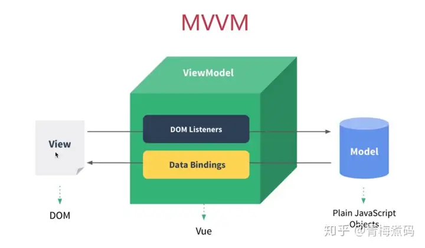
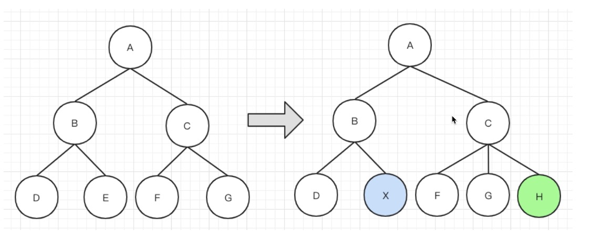
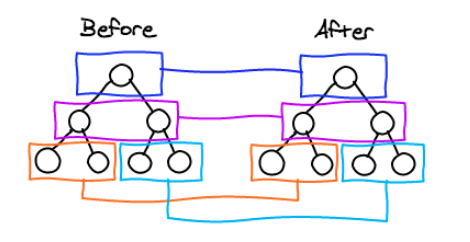
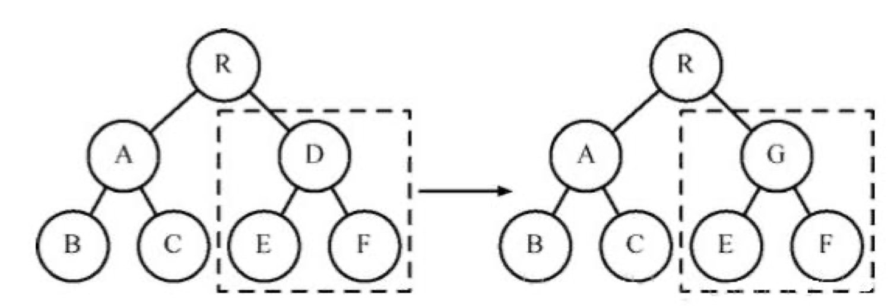
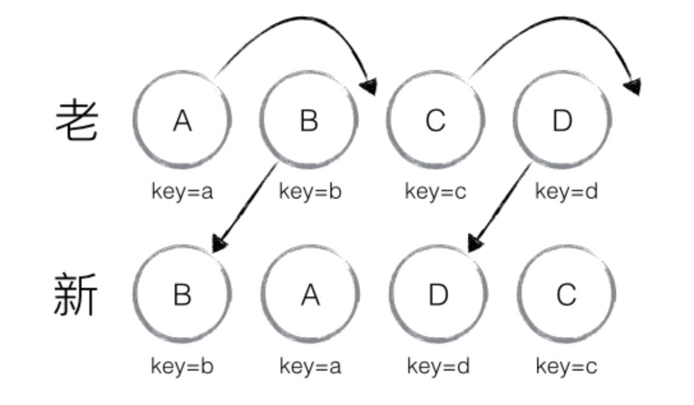
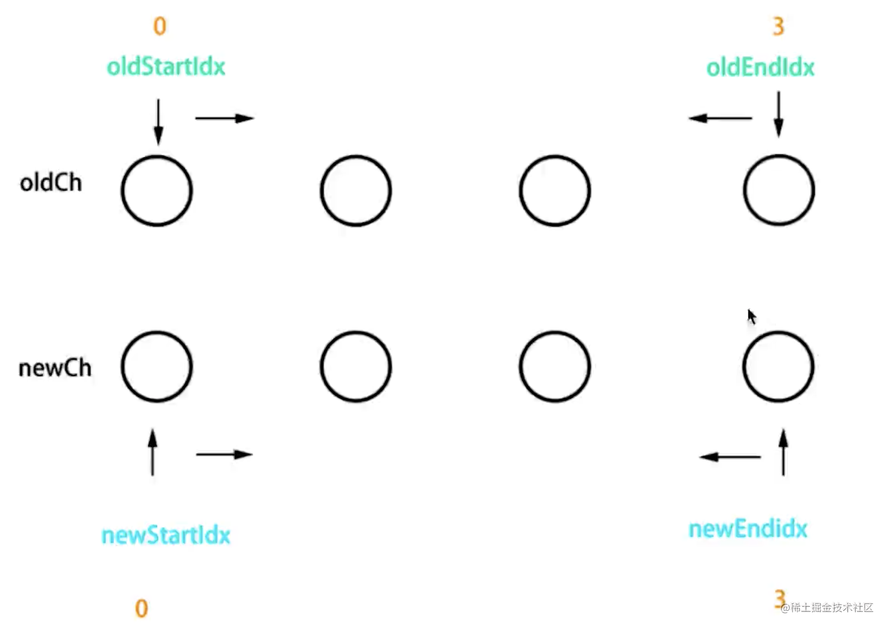
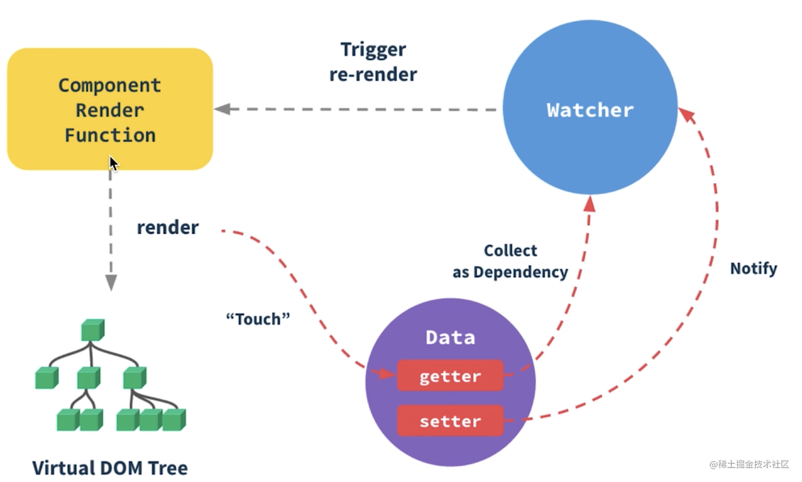

# 04-Vue 原理

## 01- vue 原理-大厂必考

- 面试为何会考察原理 ？
- 面试中如何考察？以何种方式？
- Vue 原理包括哪些？

### 面试为何会考察原理

- 知其然知其所以然 - 各行各业通用的道理
- 了解原理，才能应用的更好 - 竞争激烈，择优录取
- 大厂造轮子（有钱有资源，业务定制，技术 KPI）

### 面试中如何考察？

- 考察重点，而不是考察细节。掌握 2/8 原则
- 和使用相关联的原理，如 VDom、模板渲染
- 整体流程是否全面？热门技术是否有深度？

### Vue 原理包括哪些？

- 组件化
- 响应式
- VDom 和 diff
- 模板编译
- 渲染过程
- 前端路由

## 02-组件化基础

- "很久以前"，就有组件化
- 数据驱动视图（MVVM， setState）

#### "很久以前"的组件化

- asp jsp php 已经有组件化了
- nodejs 也有类似的组件化

### 数据视图更新

- 传统组件，只是静态渲染，更新还要依赖于操作 DOM
- 数据驱动视图 - Vue MVVM
- 数据驱动视图 - React setState(后续讲解)

### MVVM

MVVM 的实现主要是三个核心点：

- 响应式：vue 如何监听 data 的属性变化
- 模板解析：vue 的模板是如何被解析的
- 渲染：vue 模板是如何被渲染成 HTML 的



可以看到 MVVM 分别指 View，Model，View-Model，View 通过 View-Model 的 DOM Listeners 将事件绑定到 Model 上，而 Model 则通过 Data Bindings 来管理 View 中的数据，View-Model 从中起到一个连接桥的作用。

```vue
<!-- view 部分-->
<template>
  <div id="app">
    <p @click="changeName">{{ name }}</p>
    <ul>
      <li v-for="(item, index) in list" :key="index">
        {{ item }}
      </li>
    </ul>
    <button @click="addItem">添加一项</button>
  </div>
</template>

<!-- Model 部分  -->
<script>
export default {
  name: 'app',
  data() {
    return {
      name: 'vue',
      list: ['a', 'b', 'c'],
    }
  },
  methods: {
    changeName() {
      this.name = '双越'
    },
    addItem() {
      this.list.push(`${Date.now()}`)
    },
  },
}
</script>
```

### 总结

- 组件化
- 数据驱动视图
- MVVM

## 03-数据响应式

- 组件 data 数据一旦变化，立刻触发视图的更新
- 实现数据驱动视图的第一步
- 考察 Vue 原理的第一步

### Vue 响应时

- 核心 API - Object.defineProperty
- 如何实现响应时，代码演示
- Object.defineProperty 的一些缺点（Vue3.0 已经启用 Proxy）

### Proxy 有兼容性问题

- Proxy 兼容性不好，且无法 polyfill
- Vue2.x 还会存在一段时间，所以得学
- Vue3.0 相关知识，后续会讲

### Object.defineProperty 的基本使用

```javascript
const data = {}
const name = '张三'
Object.defineProperty(data, 'name', {
  get: function () {
    console.log('get')
    return name
  },
  set: function (newVal) {
    console.log('set')
    name = newVal
  },
})

// 测试
console.log(data.name) // get 张三
data.name = 'list' // set
```

### Object.defineProperty 实现响应式

- 监听对象，监听数组
- 复杂对象，深度监听
- 几个缺点

#### 代码演示

```html
<!-- index.html -->
<!DOCTYPE html>
<html>
  <head>
    <meta charset="UTF-8" />
    <meta
      name="viewport"
      content="width=device-width, initial-scale=1, minimum-scale=1,maximum-scale=1,user-scalable=no"
    />
    <meta name="format-detection" content="telephone=no" />
    <title>Observe demo</title>
  </head>
  <body>
    <p>响应式 demo</p>

    <script src="./observe.js"></script>
  </body>
</html>
```

```javascript
// observe.js
// 触发更新视图
function updateView() {
  console.log('视图更新')
}

// 重新定义数组原型
const oldArrayProperty = Array.prototype
// 创建新对象，原型指向 oldArrayProperty ，再扩展新的方法不会影响原型
const arrProto = Object.create(oldArrayProperty)
;['push', 'pop', 'shift', 'unshift', 'splice'].forEach((methodName) => {
  arrProto[methodName] = function () {
    updateView() // 触发视图更新
    oldArrayProperty[methodName].call(this, ...arguments)
    // Array.prototype.push.call(this, ...arguments)
  }
})

// 重新定义属性，监听起来
function defineReactive(target, key, value) {
  // 深度监听
  observer(value)

  // 核心 API
  Object.defineProperty(target, key, {
    get() {
      return value
    },
    set(newValue) {
      if (newValue !== value) {
        // 深度监听
        observer(newValue)

        // 设置新值
        // 注意，value 一直在闭包中，此处设置完之后，再 get 时也是会获取最新的值
        value = newValue

        // 触发更新视图
        updateView()
      }
    },
  })
}

// 监听对象属性
function observer(target) {
  if (typeof target !== 'object' || target === null) {
    // 不是对象或数组
    return target
  }

  // 如下做，会污染全局的 Array 原型
  // Array.prototype.push = function () {
  //     updateView()
  //     ...
  // }

  if (Array.isArray(target)) {
    target.__proto__ = arrProto
  }

  // 重新定义各个属性（for in 也可以遍历数组）
  for (let key in target) {
    defineReactive(target, key, target[key])
  }
}

// 准备数据
const data = {
  name: 'zhangsan',
  age: 20,
  info: {
    address: '北京', // 需要深度监听
  },
  numbers: [10, 20, 30],
}

// 监听数据
observer(data)

// 测试
// data.name = 'lisi'
// data.age = 21
// // console.log('age', data.age)
// data.x = '100' // 新增属性，监听不到 —— 所以有 Vue.set
// delete data.name // 删除属性，监听不到 —— 所有已 Vue.delete
// data.info.address = '上海' // 深度监听
data.numbers.push(4) // 监听数组
```

### Object.defineProperty 监听的缺点

- 深度监听，需要递归到底，一次性计算量大
- 无法监听新增属性、删除属性（Vue.set Vue.delete）
- 无法原生监听数组，需要特殊处理

## 04: 虚拟 DOM-面试里的网红

### 虚拟 DOM (Virtual DOM )和 Diff

- VDom 是实现 vue 和 react 的重要基石
- diff 算法是 VDom 中最核心、最关键的部分
- VDom 是一个热门话题，也是面试中的热门话题

### 背景

- DOM 操作非常损耗性能
- 以前用 jQuery，可以执行控制 DOM 操作的时机，手动调整
- Vue 和 React 是数据驱动视图，如何有效控制 DOM 操作呢？

### 解决方案： VDom

- 有了一定复杂度，想减少计算次数比较难
- 能不能把计算，更多的转移为 JS 计算？因为 JS 执行速度很快
- VDom: 先用 JS 模拟 DOM 结构，计算出最小的变更，操作 DOM

#### 用 JS 模拟 DOM

```html
<div id="div1" class="container">
  <p>VDom</p>
  <ul style="font-size: 20px">
    <li>a</li>
  </ul>
</div>
```

```javascript
{
  tag: "div",
  props: {
    className: "container",
    id: "div1"
  },
  children: [
    { tag: "p", children: "VDom" },
    {
      tag: "ul",
      props: {
        style : "font-size: 20px",
      },
      children: [
        { tag: "li", children:"a" }
      ]
    }
  ]
}
```

### 通过 snabbdom 学习 VDom

- 简洁强大的 VDom 库，易学易用
- Vue 参考它实现的 VDom 和 Diff
- [https://github.com/snabbdom/snabbdom](https://github.com/snabbdom/snabbdom)
- Vue3.0 重写了 VDom 的代码，优化了性能
- 但是 VDom 的基本理念不变，面试考点也不变
- React VDom 的具体实现和 Vue 也不同，但是不妨碍统一学习

### snabbdom 代码演示

```html
<!DOCTYPE html>
<html>
  <head>
    <meta charset="UTF-8" />
    <title>Document</title>
  </head>
  <body>
    <div id="container"></div>
    <button id="btn-change">change</button>

    <script src="https://cdn.bootcss.com/snabbdom/0.7.3/snabbdom.js"></script>
    <script src="https://cdn.bootcss.com/snabbdom/0.7.3/snabbdom-class.js"></script>
    <script src="https://cdn.bootcss.com/snabbdom/0.7.3/snabbdom-props.js"></script>
    <script src="https://cdn.bootcss.com/snabbdom/0.7.3/snabbdom-style.js"></script>
    <script src="https://cdn.bootcss.com/snabbdom/0.7.3/snabbdom-eventlisteners.js"></script>
    <script src="https://cdn.bootcss.com/snabbdom/0.7.3/h.js"></script>
    <script src="./demo1.js"></script>
  </body>
</html>
```

```javascript
// demo1.js
const snabbdom = window.snabbdom

// 定义 patch
const patch = snabbdom.init([
  snabbdom_class,
  snabbdom_props,
  snabbdom_style,
  snabbdom_eventlisteners,
])

// 定义 h
const h = snabbdom.h
const container = document.getElementById('container')

// 生成 vnode
const vnode = h('ul#list', {}, [
  h('li.item', {}, 'Item 1'),
  h('li.item', {}, 'Item 2'),
])
patch(container, vnode)

document.getElementById('btn-change').addEventListener('click', () => {
  // 生成 newVnode
  const newVnode = h('ul#list', {}, [
    h('li.item', {}, 'Item 1'),
    h('li.item', {}, 'Item B'),
    h('li.item', {}, 'Item 3'),
  ])
  patch(vnode, newVnode)

  // vnode = newVnode // patch 之后，应该用新的覆盖现有的 vnode ，否则每次 change 都是新旧对比
})
```

### table-with-vdom 代码样式

```html
<!DOCTYPE html>
<html>
  <head>
    <meta charset="UTF-8" />
    <title>Document</title>
  </head>
  <body>
    <div id="container"></div>
    <button id="btn-change">change</button>

    <script src="https://cdn.bootcss.com/snabbdom/0.7.3/snabbdom.js"></script>
    <script src="https://cdn.bootcss.com/snabbdom/0.7.3/snabbdom-class.js"></script>
    <script src="https://cdn.bootcss.com/snabbdom/0.7.3/snabbdom-props.js"></script>
    <script src="https://cdn.bootcss.com/snabbdom/0.7.3/snabbdom-style.js"></script>
    <script src="https://cdn.bootcss.com/snabbdom/0.7.3/snabbdom-eventlisteners.js"></script>
    <script src="https://cdn.bootcss.com/snabbdom/0.7.3/h.js"></script>
    <script type="text/javascript">
      const snabbdom = window.snabbdom
      // 定义关键函数 patch
      const patch = snabbdom.init([
        snabbdom_class,
        snabbdom_props,
        snabbdom_style,
        snabbdom_eventlisteners,
      ])

      // 定义关键函数 h
      const h = snabbdom.h

      // 原始数据
      const data = [
        {
          name: '张三',
          age: '20',
          address: '北京',
        },
        {
          name: '李四',
          age: '21',
          address: '上海',
        },
        {
          name: '王五',
          age: '22',
          address: '广州',
        },
      ]
      // 把表头也放在 data 中
      data.unshift({
        name: '姓名',
        age: '年龄',
        address: '地址',
      })

      const container = document.getElementById('container')

      // 渲染函数
      let vnode
      function render(data) {
        const newVnode = h(
          'table',
          {},
          data.map((item) => {
            const tds = []
            for (let i in item) {
              if (item.hasOwnProperty(i)) {
                tds.push(h('td', {}, item[i] + ''))
              }
            }
            return h('tr', {}, tds)
          }),
        )

        if (vnode) {
          // re-render
          patch(vnode, newVnode)
        } else {
          // 初次渲染
          patch(container, newVnode)
        }

        // 存储当前的 vnode 结果
        vnode = newVnode
      }

      // 初次渲染
      render(data)

      const btnChange = document.getElementById('btn-change')
      btnChange.addEventListener('click', () => {
        data[1].age = 30
        data[2].address = '深圳'
        // re-render
        render(data)
      })
    </script>
  </body>
</html>
```

### snabbdom 重点总结

- h 函数
- vnode 数据结构
- patch 函数

### vdom 总结

- 用 JS 模拟 DOM 结构（vnode）
- 新旧 VNode 对比，得出最小的更新范围，最后更新 DOM
- 数据驱动视图的模式下，有效控制 DOM 操作

## 05: 虚拟 DOM-diff 算法概述

### diff 算法

- diff 算法是 VDom 中最核心、最关键的部分
- diff 算法能在日常使用 Vue React 中体现出来（如 key）
- diff 算法是前端热门话题，面试“宠儿”

### diff 算法概述

- diff 即对比，是一个广泛的概念，如 linux diff 命令、git diff 等
- 两个 JS 对象之间也可以做 diff, 如：[JSON Diff and Patch: https://github.com/cujojs/jiff](https://github.com/cujojs/jiff)
- 两棵树做 diff, 如这里的 VDom diff



### 树 diff 的时间复杂度 O(n^3)

> 将两颗树中所有的节点一一对比需要 O(n²)的复杂度，在对比过程中发现旧节点在新的树中未找到，那么就需要把旧节点删除，删除一棵树的一个节点(找到一个合适的节点放到被删除的位置)的时间复杂度为 O(n),同理添加新节点的复杂度也是 O(n),合起来 diff 两个树的复杂度就是 O(n³)

- 第一，遍历 tree1
- 第二，遍历 tree2
- 第三 排序
- 1000 个节点，要计算 1 亿次，算法不可用

### 优化时间复杂度到 O(n)

- 只比较同一层级，不跨级比较

  

- tag 不相同，则直接删除重建，不再深度比较

  

- tag 和 key，两者都相同，则认为是相同节点，不再深度比较

  > 通过 key 来标识区分相同节点

  

## 06: 深入 diff 算法源码-生成 vnode

### snabbdom - 源码解读

[https://github.com/gy1001/Javascript/tree/main/frame-project-interview/snabbdom-source](https://github.com/gy1001/Javascript/tree/main/frame-project-interview/snabbdom-source)

### h 函数

> h 函数接收不同的参数个数以及类型，然后返回的是一个 对象，里面包含了一系列相关的 dom 属性

```typescript
export function h(sel: string): VNode
export function h(sel: string, data: VNodeData | null): VNode
export function h(sel: string, children: VNodeChildren): VNode
export function h(
  sel: string,
  data: VNodeData | null,
  children: VNodeChildren,
): VNode

export function h(sel: any, b?: any, c?: any): VNode {
  // ...
  // 返回 vnode
  return vnode(sel, data, children, text, undefined)
}

export function vnode(
  sel: string | undefined,
  data: any | undefined,
  children: Array<VNode | string> | undefined,
  text: string | undefined,
  elm: Element | Text | undefined,
): VNode {
  let key = data === undefined ? undefined : data.key
  return { sel, data, children, text, elm, key }
}
```

### patch 函数

```typescript
// snabbdom.ts 里面

// 官网展示代码，patch 函数是调用 init 函数产生的
var patch = snabbdom.init([
  // Init patch function with chosen modules
  require('snabbdom/modules/class').default, // makes it easy to toggle classes
  require('snabbdom/modules/props').default, // for setting properties on DOM elements
  require('snabbdom/modules/style').default, // handles styling on elements with support for animations
  require('snabbdom/modules/eventlisteners').default, // attaches event listeners
])

export function init(modules: Array<Partial<Module>>, domApi?: DOMAPI) {
  ...
  return function patch(oldVnode: VNode | Element, vnode: VNode): VNode {
    ...
  }
}
```

path 函数内部代码

```typescript
const emptyNode = vnode('', {}, [], undefined, undefined)

function sameVnode(vnode1: VNode, vnode2: VNode): boolean {
  // key 和 sel 都相等
  // undefined === undefined // true
  return vnode1.key === vnode2.key && vnode1.sel === vnode2.sel
}

function isVnode(vnode: any): vnode is VNode {
  return vnode.sel !== undefined
}

// 以下为返回的 path 函数
function patch(oldVnode: VNode | Element, vnode: VNode): VNode {
  let i: number, elm: Node, parent: Node
  const insertedVnodeQueue: VNodeQueue = []
  // 执行 pre hook: https://github.com/gy1001/Javascript/tree/main/frame-project-interview/snabbdom-source#hooks
  for (i = 0; i < cbs.pre.length; ++i) cbs.pre[i]()

  // 第一个参数不是 vnode
  if (!isVnode(oldVnode)) {
    // 创建一个空的 vnode ，关联到这个 DOM 元素
    oldVnode = emptyNodeAt(oldVnode)
  }

  // 相同的 vnode（key 和 sel 都相等）
  if (sameVnode(oldVnode, vnode)) {
    // vnode 对比
    patchVnode(oldVnode, vnode, insertedVnodeQueue)

    // 不同的 vnode ，直接删掉重建
  } else {
    elm = oldVnode.elm!
    parent = api.parentNode(elm)

    // 重建
    createElm(vnode, insertedVnodeQueue)

    if (parent !== null) {
      api.insertBefore(parent, vnode.elm!, api.nextSibling(elm))
      removeVnodes(parent, [oldVnode], 0, 0)
    }
  }

  for (i = 0; i < insertedVnodeQueue.length; ++i) {
    insertedVnodeQueue[i].data!.hook!.insert!(insertedVnodeQueue[i])
  }
  for (i = 0; i < cbs.post.length; ++i) cbs.post[i]()
  return vnode
}

// sameVnode 函数使用了 .key 与 .sel 来进行比较
function sameVnode(vnode1: VNode, vnode2: VNode): boolean {
  // key 和 sel 都相等
  // undefined === undefined // true
  return vnode1.key === vnode2.key && vnode1.sel === vnode2.sel
}
```

### patchVnode 函数，重点

```typescript
function isDef<A>(s: A): s is NonUndefined<A> {
  return s !== undefined
}

function patchVnode(
  oldVnode: VNode,
  vnode: VNode,
  insertedVnodeQueue: VNodeQueue,
) {
  // 执行 prepatch hook
  const hook = vnode.data?.hook
  hook?.prepatch?.(oldVnode, vnode)

  // 设置 vnode.elem
  const elm = (vnode.elm = oldVnode.elm!)

  // 旧 children
  let oldCh = oldVnode.children as VNode[]
  // 新 children
  let ch = vnode.children as VNode[]

  if (oldVnode === vnode) return

  // hook 相关
  if (vnode.data !== undefined) {
    for (let i = 0; i < cbs.update.length; ++i) cbs.update[i](oldVnode, vnode)
    vnode.data.hook?.update?.(oldVnode, vnode)
  }

  // vnode.text === undefined （意味着vnode.children 一般有值）
  if (isUndef(vnode.text)) {
    // 新旧都有 children
    if (isDef(oldCh) && isDef(ch)) {
      if (oldCh !== ch) updateChildren(elm, oldCh, ch, insertedVnodeQueue)
      // 新 children 有，旧 children 无 （旧 text 有）
    } else if (isDef(ch)) {
      // 清空 text
      if (isDef(oldVnode.text)) api.setTextContent(elm, '')
      // 添加 children
      addVnodes(elm, null, ch, 0, ch.length - 1, insertedVnodeQueue)
      // 旧 child 有，新 child 无
    } else if (isDef(oldCh)) {
      // 移除 children
      removeVnodes(elm, oldCh, 0, oldCh.length - 1)
      // 旧 text 有
    } else if (isDef(oldVnode.text)) {
      api.setTextContent(elm, '')
    }

    // else : vnode.text !== undefined （vnode.children 无值）
  } else if (oldVnode.text !== vnode.text) {
    // 移除旧 children
    if (isDef(oldCh)) {
      removeVnodes(elm, oldCh, 0, oldCh.length - 1)
    }
    // 设置新 text
    api.setTextContent(elm, vnode.text!)
  }
  hook?.postpatch?.(oldVnode, vnode)
}
```

### updateChildren 函数

```typescript
// 返回一个对象，里面是包含所有节点的健
function createKeyToOldIdx(
  children: VNode[],
  beginIdx: number,
  endIdx: number,
): KeyToIndexMap {
  const map: KeyToIndexMap = {}
  for (let i = beginIdx; i <= endIdx; ++i) {
    const key = children[i]?.key
    if (key !== undefined) {
      map[key] = i
    }
  }
  return map
}

function updateChildren(
  parentElm: Node,
  oldCh: VNode[],
  newCh: VNode[],
  insertedVnodeQueue: VNodeQueue,
) {
  let oldStartIdx = 0,
    newStartIdx = 0
  let oldEndIdx = oldCh.length - 1
  let oldStartVnode = oldCh[0]
  let oldEndVnode = oldCh[oldEndIdx]
  let newEndIdx = newCh.length - 1
  let newStartVnode = newCh[0]
  let newEndVnode = newCh[newEndIdx]
  let oldKeyToIdx: KeyToIndexMap | undefined
  let idxInOld: number
  let elmToMove: VNode
  let before: any

  while (oldStartIdx <= oldEndIdx && newStartIdx <= newEndIdx) {
    if (oldStartVnode == null) {
      oldStartVnode = oldCh[++oldStartIdx] // Vnode might have been moved left
    } else if (oldEndVnode == null) {
      oldEndVnode = oldCh[--oldEndIdx]
    } else if (newStartVnode == null) {
      newStartVnode = newCh[++newStartIdx]
    } else if (newEndVnode == null) {
      newEndVnode = newCh[--newEndIdx]

      // 开始和开始对比
    } else if (sameVnode(oldStartVnode, newStartVnode)) {
      patchVnode(oldStartVnode, newStartVnode, insertedVnodeQueue)
      oldStartVnode = oldCh[++oldStartIdx]
      newStartVnode = newCh[++newStartIdx]

      // 结束和结束对比
    } else if (sameVnode(oldEndVnode, newEndVnode)) {
      patchVnode(oldEndVnode, newEndVnode, insertedVnodeQueue)
      oldEndVnode = oldCh[--oldEndIdx]
      newEndVnode = newCh[--newEndIdx]

      // 开始和结束对比
    } else if (sameVnode(oldStartVnode, newEndVnode)) {
      // Vnode moved right
      patchVnode(oldStartVnode, newEndVnode, insertedVnodeQueue)
      api.insertBefore(
        parentElm,
        oldStartVnode.elm!,
        api.nextSibling(oldEndVnode.elm!),
      )
      oldStartVnode = oldCh[++oldStartIdx]
      newEndVnode = newCh[--newEndIdx]

      // 结束和开始对比
    } else if (sameVnode(oldEndVnode, newStartVnode)) {
      // Vnode moved left
      patchVnode(oldEndVnode, newStartVnode, insertedVnodeQueue)
      api.insertBefore(parentElm, oldEndVnode.elm!, oldStartVnode.elm!)
      oldEndVnode = oldCh[--oldEndIdx]
      newStartVnode = newCh[++newStartIdx]

      // 以上四个都未命中
    } else {
      if (oldKeyToIdx === undefined) {
        oldKeyToIdx = createKeyToOldIdx(oldCh, oldStartIdx, oldEndIdx)
      }
      // 拿新节点 key ，能否对应上 oldCh 中的某个节点的 key
      idxInOld = oldKeyToIdx[newStartVnode.key as string]

      // 没对应上
      if (isUndef(idxInOld)) {
        // New element
        api.insertBefore(
          parentElm,
          createElm(newStartVnode, insertedVnodeQueue),
          oldStartVnode.elm!,
        )
        newStartVnode = newCh[++newStartIdx]

        // 对应上了
      } else {
        // 对应上 key 的节点
        elmToMove = oldCh[idxInOld]

        // sel 是否相等（sameVnode 的条件）
        if (elmToMove.sel !== newStartVnode.sel) {
          // New element
          api.insertBefore(
            parentElm,
            createElm(newStartVnode, insertedVnodeQueue),
            oldStartVnode.elm!,
          )

          // sel 相等，key 相等
        } else {
          patchVnode(elmToMove, newStartVnode, insertedVnodeQueue)
          oldCh[idxInOld] = undefined as any
          api.insertBefore(parentElm, elmToMove.elm!, oldStartVnode.elm!)
        }
        newStartVnode = newCh[++newStartIdx]
      }
    }
  }
  if (oldStartIdx <= oldEndIdx || newStartIdx <= newEndIdx) {
    if (oldStartIdx > oldEndIdx) {
      before = newCh[newEndIdx + 1] == null ? null : newCh[newEndIdx + 1].elm
      addVnodes(
        parentElm,
        before,
        newCh,
        newStartIdx,
        newEndIdx,
        insertedVnodeQueue,
      )
    } else {
      removeVnodes(parentElm, oldCh, oldStartIdx, oldEndIdx)
    }
  }
}
```



## 07: diff 算法总结

- patchVnode
- addVnodes removeVnodes
- updateChildren (key 的重要性)

### vdom 和 diff 总结

- 细节不重要，updateChildren 的过程也不重要，不要深究
- vdom 的核心概念很重要：h、vnode、patch、diff、key 等
- vdom 存在的价值更加重要：数据视图驱动，控制 DOM 操作

## 08: 模板编译前置知识点-with 语法

### 模板编译

- 模板是 Vue 开发中最常用的部分，即与使用相关联的原理
- 它不是 html，指令、插值、JS 表达式，到底是什么？
- 面试不会直接问，但是会通过 “组件渲染和更新过程” 考察
- 前置知识：JS 的 with 语法
- vue template compiler 将模板编译为 render 函数
- 执行 render 函数生成 vnode

### with 语法

- 使用 with 能改变 {} 内 自由变量的查找方式，将 {} 内自由变量当做 obj 的属性来查找
- 如果找不到匹配的 obj 属性，就会报错
- with 要慎用，它打破了作用域规则，易读性变差

```javascript
const obj = { a: 100, b: 200 }
console.log(obj.a)
console.log(obj.b)
console.log(obj.c) // undefined
```

```javascript
// 使用 with 能改变 {} 内 自由变量的查找方式，将 {} 内自由变量当做 obj 的属性来查找
with (obj) {
  console.log(a)
  console.log(b)
  console.log(c) // 会报错！
}
```

## 09: vue 模板被编译成什么

- 模板不是 html ,他有指令、插值、JS 表达式，能实现判断、循环
- html 只是标签语言，只有 js 才能实现判断、循环（图灵完备的）
- 因此，模板一定是转换为某种 JS 代码，即模板编译

// ---------------分割线--------------
从 vue 源码中找到缩写函数的含义

```javascript
function installRenderHelpers(target) {
  target._o = markOnce
  target._n = toNumber
  target._s = toString
  target._l = renderList
  target._t = renderSlot
  target._q = looseEqual
  target._i = looseIndexOf
  target._m = renderStatic
  target._f = resolveFilter
  target._k = checkKeyCodes
  target._b = bindObjectProps
  target._v = createTextVNode
  target._e = createEmptyVNode
  target._u = resolveScopedSlots
  target._g = bindObjectListeners
  target._d = bindDynamicKeys
  target._p = prependModifier
}
```

### 插值

```javascript
const compiler = require('vue-template-compiler')
const template = `<p>{{message}}</p>`

// 编译
const res = compiler.compile(template)
console.log(res.render)

// 结果为
// 这里的 this 对应 new Vue
// _c: 对应 createElement, 最终的结果返回 vnode
// _v 对应： createTextVNode
// _s 对应 toString
with (this) {
  return _c('p', [_v(_s(message))])
}
```

### 含有表达式

```javascript
const compiler = require('vue-template-compiler')
const template = `<p>{{flag ? message : 'no message found'}}</p>`
const res = compiler.compile(template)
console.log(res.render)

// 编译后的结果如下
with (this) {
  return _c('p', [_v(_s(flag ? message : 'no message found'))])
}
```

### 属性和动态属性

```javascript
const compiler = require('vue-template-compiler')
const template = `
    <div id="div1" class="container">
        
    </div>
`
const res = compiler.compile(template)
console.log(res.render)

// 编译后的结果如下
with (this) {
  return _c('div', { staticClass: 'container', attrs: { id: 'div1' } }, [
    _c('img', { attrs: { src: imgUrl } }),
  ])
}
```

### 条件

```javascript
const compiler = require('vue-template-compiler')
const template = `
    <div>
        <p v-if="flag === 'a'">A</p>
        <p v-else>B</p>
    </div>
`
const res = compiler.compile(template)
console.log(res.render)

// 编译后的结果如下
with (this) {
  return _c('div', [flag === 'a' ? _c('p', [_v('A')]) : _c('p', [_v('B')])])
}
```

### 循环

```javascript
const compiler = require('vue-template-compiler')
const template = `
    <ul>
        <li v-for="item in list" :key="item.id">{{item.title}}</li>
    </ul>
`
const res = compiler.compile(template)
console.log(res.render)

// 编译后的结果如下
// _l 对应 renderList
with (this) {
  return _c(
    'ul',
    _l(list, function (item) {
      return _c('li', { key: item.id }, [_v(_s(item.title))])
    }),
    0,
  )
}
```

### v-model

```javascript
const compiler = require('vue-template-compiler')
const template = `<input type="text" v-model="name">`
const res = compiler.compile(template)
console.log(res.render)

// 编译后的结果如下
// _l 对应 renderList
with (this) {
  return _c('input', {
    directives: [
      { name: 'model', rawName: 'v-model', value: name, expression: 'name' },
    ],
    attrs: { type: 'text' },
    domProps: { value: name },
    on: {
      input: function ($event) {
        if ($event.target.composing) return
        name = $event.target.value
      },
    },
  })
}
```

### 事件

```javascript
const compiler = require('vue-template-compiler')
const template = `
    <button @click="clickHandler">submit</button>
`
const res = compiler.compile(template)
console.log(res.render)

// 编译后的结果如下
// _l 对应 renderList
with (this) {
  return _c('button', { on: { click: clickHandler } }, [_v('submit')])
}
```

### 模板编译

- 模板编译为 render 函数，执行 render 函数返回 vnode
- 基于 VNode 在执行 patch 和 diff
- 使用 webpack vue-loader 会在开发环境下编译模板（重要）

## 10: vue 组件可用 render 代替 template

- 讲完模板编译，再讲这个 render，就比较好理解了
- 在有些复杂情况下，不能用 template，可以考虑使用 render
- React 一直都用 render（没有模板），和这里一样

```javascript
Vue.component('heading', {
  // template: "xxx",
  render: function (createElement) {
    return createElement('h' + this.level, [
      createElement(
        'a',
        {
          attrs: {
            name: 'headerId',
            href: '#' + 'headerId',
          },
        },
        'this is a tag',
      ),
    ])
  },
})
```

## 11: 回顾和复习已学的知识点

### 组件 渲染/更新 过程

- 一个组件渲染到页面，修改 data 触发更新（数据驱动视图）
- 其背后原理是什么，需要掌握哪些要点
- 考察对流程了解的全面程度

### 回顾和复习已学的知识点

- 响应式：监听 data 属性 getter 和 setter(包括数组)
- 模板编译：模板到 render 函数，再到 vnode
- vdom: path(elem, vnode) 和 patch(vnode, newVnode)

### 组件 渲染/更新 过程

- 初次渲染过程
- 更新过程
- 异步渲染

## 12: vue 组件是如何渲染和更新的

### 初次渲染过程

- 解析模板为 render 函数（或在开发环境已完成，vue-loader）
- 触发响应式，监听 data 属性 getter setter
- 执行 render 函数，生成 vnode, patch(elem, vnode)
  注意：执行 render 函数时候会触发 getter

```vue
<template>
  <p>{{ message }}</p>
</template>
<script>
export default {
  data() {
    return {
      message: 'hello', // 会触发 get
      city: '北京', // 不触发 get，因为模板没有用到，即和视图没有关系
    }
  },
}
</script>
```

### 更新过程

- 修改 data，触发 setter（此前 在 getter 中已被监听）
- 重新执行 render 函数，生成 newVnode
- patch(vnode, newVnode)

### 完成流程图



## 13: vue 组件是异步渲染的

- 回顾 this.$nextTick
- 汇总 data 的修改，一次性更新视图
- 减少 DOM 操作次数，提高性能

### 总结

- 渲染和响应式的关系
- 渲染和 模板编译的关系
- 渲染和 vdom 的关系
- 初次渲染
- 更新过程
- 异步渲染

## 14: 如何用 JS 实现 hash 路由

### 前端路由原理

- 稍微复杂一点的 spa, 都需要路由
- vue-router 也是 vue 全家桶的标配之一
- 属于 “和日常使用相关联的原理”，面试常考
- 回顾 vue-router 的路由模式
- hash
- H5 history

### hash 的特点

- hash 变化会触发网页跳转，即浏览器的前进、后退
- hash 变化不会刷新页面，SPA 必须的特点
- hash 永远不会提交到 server 端（前端自生自灭）

```html
<!DOCTYPE html>
<html lang="en">
  <head>
    <meta charset="UTF-8" />
    <meta name="viewport" content="width=device-width, initial-scale=1.0" />
    <meta http-equiv="X-UA-Compatible" content="ie=edge" />
    <title>hash test</title>
  </head>
  <body>
    <p>hash test</p>
    <button id="btn1">修改 hash</button>

    <script>
      // hash 变化，包括：
      // a. JS 修改 url
      // b. 手动修改 url 的 hash
      // c. 浏览器前进、后退
      window.onhashchange = (event) => {
        console.log('old url', event.oldURL)
        console.log('new url', event.newURL)

        console.log('hash:', location.hash)
      }

      // 页面初次加载，获取 hash
      document.addEventListener('DOMContentLoaded', () => {
        console.log('hash:', location.hash)
      })

      // JS 修改 url
      document.getElementById('btn1').addEventListener('click', () => {
        location.href = '#/user'
      })
    </script>
  </body>
</html>
```

## 15: 如何用 JS 实现 H5 history 路由

### H5 history

- 用 url 规范的路由，但跳转时不刷新页面
- history.pushState
- window.onPopstate

```html
<!DOCTYPE html>
<html lang="en">
  <head>
    <meta charset="UTF-8" />
    <meta name="viewport" content="width=device-width, initial-scale=1.0" />
    <meta http-equiv="X-UA-Compatible" content="ie=edge" />
    <title>history API test</title>
  </head>
  <body>
    <p>history API test</p>
    <button id="btn1">修改 url</button>

    <script>
      // 页面初次加载，获取 path
      document.addEventListener('DOMContentLoaded', () => {
        console.log('load', location.pathname)
      })

      // 打开一个新的路由
      // 【注意】用 pushState 方式，浏览器不会刷新页面
      document.getElementById('btn1').addEventListener('click', () => {
        const state = { name: 'page1' }
        console.log('切换路由到', 'page1')
        history.pushState(state, '', 'page1') // 重要！！
      })

      // 监听浏览器前进、后退
      window.onpopstate = (event) => {
        // 重要！！
        console.log('onpopstate', event.state, location.pathname)
      }

      // 需要 server 端配合，可参考
      // https://router.vuejs.org/zh/guide/essentials/history-mode.html#%E5%90%8E%E7%AB%AF%E9%85%8D%E7%BD%AE%E4%BE%8B%E5%AD%90
    </script>
  </body>
</html>
```

### 总结

- hash: window.onhashchange
- H5 history: history.pushState 和 window.onpopstate
- H5 history 需要后端支持

### 两者支持

- to B 的系统推荐使用 hash, 简单易用，对 url 规范不敏感
- to C 的系统 可以考虑选择 H5 history, 但需要服务端支持
- 能选择简单的，就别用复杂的，要考虑成本和收益

## 16: vue 原理-考点总结和复习

- 组件化
- 响应式
- vdom 和 diff
- 模板编译
- 渲染过程
- 前端路由

### 组件化

- 组件化的历史
- 数据驱动视图
- MVVM

### 响应式

- Object.defineProperty
- 监听对象（深度），监听数组
- Object.defineProperty 的缺点（Vue3 用 Proxy ，后面会讲）

### vdom 和 diff

- 应用背景
- vnode 解构
- snabbdom 使用： vnode h patch

### 模板编译

- with 语法
- 模板编译为 render 函数
- 执行 render 函数生成 vnode

### 组件、渲染过程

- 初次渲染过程
- 更新过程
- 异步渲染

### 前端路由原理

- hash
- H5 history
- 两者对比

## 17:【任务】vnode 之于 Vue 的作用
