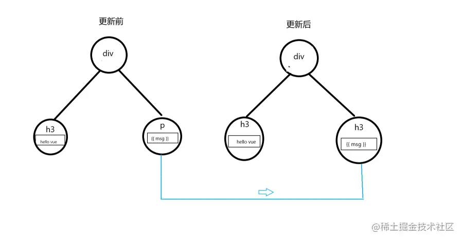

# 06- Vue3 学习

## 01: Vue3 对 Vue2 有什么优势

- 性能更好
- 体积更小
- 更好的 TS 支持
- 更好的代码组织
- 更好的逻辑抽离
- 更多新功能

## 02: vue3 和 vue2 的生命周期有什么区别

### options Api 生命周期


### composition Api 生命周期


- beforeDestroy 改为 beforeUmount
- destroyed 改为 unmounted
- 其他沿用 vue2 生命周期

### 注意：

#### Vue3.0 的 setup 执行时机和注意点

1. 时机位于 beforeCreate 和 created 之前

2. beforeCreate:表示组件刚刚被创建出来，组件的 data 和 methods 还没初始化好

3. created:表示组件刚刚被创建出来，并且组件的 data 和 methods 已经初始化好

注意点

1. 由于在执行 setup 函数时候，还没有执行 created 生命周期方法,所以在 setup 函数中，是无法使用 data 和 methods

2. 由于我们不能在 setup 函数中使用 data 和 methods,所以 VUE 为了避免我们错误的使用,它直接将 setup 函数中 this 修改成了 undefined

3. setup 函数只能是同步的不能是异步的

### 代码示例

```vue
<template>
  <p>生命周期 {{ msg }}</p>
</template>

<script>
import {
  onBeforeMount,
  onMounted,
  onBeforeUpdate,
  onUpdated,
  onBeforeUnmount,
  onUnmounted,
} from 'vue'

export default {
  name: 'LifeCycles',

  props: {
    msg: String,
  },

  // 等于 beforeCreate 和 created
  setup() {
    console.log('setup')

    onBeforeMount(() => {
      console.log('onBeforeMount')
    })
    onMounted(() => {
      console.log('onMounted')
    })
    onBeforeUpdate(() => {
      console.log('onBeforeUpdate')
    })
    onUpdated(() => {
      console.log('onUpdated')
    })
    onBeforeUnmount(() => {
      console.log('onBeforeUnmount')
    })
    onUnmounted(() => {
      console.log('onUnmounted')
    })
  },

  // beforeCreate() {
  //     console.log('beforeCreate')
  // },
  // created() {
  //     console.log('created')
  // },
  // beforeMount() {
  //     console.log('beforeMount')
  // },
  // mounted() {
  //     console.log('mounted')
  // },
  // beforeUpdate() {
  //     console.log('beforeUpdate')
  // },
  // updated() {
  //     console.log('updated')
  // },
  // // beforeDestroy 改名
  // beforeUnmount() {
  //     console.log('beforeUnmount')
  // },
  // // destroyed 改名
  // unmounted() {
  //     console.log('unmounted')
  // }
}
</script>
```

执行顺序如下 (不建议同时使用，这里只是用来做示例)

```shell
setup
beforeCreate
created
onBeforeMount
beforeMount
onMounted
mounted

# 更新时
onBeforeUpdate
beforeUpdate
onUpdated
updated

# 卸载时
onBeforeUnmount
beforeUnmount
onUnmounted
unmounted
```

### 重点

- beforeDestroy 改为 beforeUmount
- destroyed 改为 unmounted

## 03: 如何理解 Composition API 和 Options API

### Composition API 带来了什么

[官方文档：为什么要有组合式 API？](https://cn.vuejs.org/guide/extras/composition-api-faq.html#better-logic-reuse)

- 更灵活的代码组织
  

- 更好的逻辑复用 -（有一道专门的面试题）
- 更好的类型推导
- 更小的生产包体积

### Composition API 和 Options API 如何选择

- 不建议公用，会引起混乱
- 小型项目、业务逻辑简单的项目，可以考虑使用 Options API
- 中大型项目、业务逻辑复杂的项目，可以考虑使用 Composition API

### 别误解 Composition API

- Composition API 属于高阶技巧，不是基础必会
- Composition API 是为解决复杂业务逻辑而设计
- Composition API 就像 Hooks 在 React 中的地位

## 04: 如何理解 ref toRef 和 toRefs

### 是什么

### 最佳使用方式

### 进阶，深入理解

#### ref

- 生成值类型的响应式数据
- 可用于模板和 reactive
- 通过 .value 修改值

```vue
<template>
  <p>ref demo {{ ageRef }} {{ state.name }}</p>
</template>

<script>
import { ref, reactive } from 'vue'

export default {
  name: 'Ref',
  setup() {
    // 建议 ref 变量都增加 xxxRex 后缀
    const ageRef = ref(20) // 值类型 响应式
    const nameRef = ref('双越')

    const state = reactive({
      name: nameRef,
    })

    setTimeout(() => {
      console.log('ageRef', ageRef.value)

      ageRef.value = 25 // .value 修改值
      nameRef.value = '双越A'
    }, 1500)

    return {
      ageRef,
      state,
    }
  },
}
</script>
```

ref 还可以用于获取当前元素节点

```vue
<template>
  <p ref="elemRef">我是一行文字</p>
</template>

<script>
import { ref, onMounted } from 'vue'

export default {
  name: 'RefTemplate',
  setup() {
    const elemRef = ref(null)

    onMounted(() => {
      console.log('ref template', elemRef.value.innerHTML, elemRef.value)
    })

    return {
      elemRef,
    }
  },
}
</script>
```

## 05: toRef 和 toRefs 如何使用

### toRef

- 针对一个响应式对象（reactive 封装）的 prop
- 创建一个 ref, 具有响应式
- 两者保持引用关系

```vue
<template>
  <p>toRef demo - {{ ageRef }} - {{ state.name }} {{ state.age }}</p>
</template>

<script>
import { ref, toRef, reactive } from 'vue'

export default {
  name: 'ToRef',
  setup() {
    const state = reactive({
      age: 20,
      name: '双越',
    })

    const age1 = computed(() => {
      return state.age + 1
    })

    // // toRef 如果用于普通对象（非响应式对象），产出的结果不具备响应式
    // const state = {
    //     age: 20,
    //     name: '双越'
    // }

    const ageRef = toRef(state, 'age')

    setTimeout(() => {
      state.age = 25
    }, 1500)

    setTimeout(() => {
      ageRef.value = 30 // .value 修改值
    }, 3000)

    return {
      state,
      ageRef,
    }
  },
}
</script>
```

### toRefs

- 将响应式对象（reactive）封装为普通对象
- 对象的每个 prop 都是对应的 ref
- 两者保持引用关系
- 合成函数返回响应式对象

```vue
<template>
  <p>toRefs demo {{ age }} {{ name }}</p>
</template>

<script>
import { ref, toRef, toRefs, reactive } from 'vue'

export default {
  name: 'ToRefs',
  setup() {
    const state = reactive({
      age: 20,
      name: '双越',
    })

    const stateAsRefs = toRefs(state) // 将响应式对象，变成普通对象

    // 每个属性，都是 ref 对象
    // const { age: ageRef, name: nameRef } = stateAsRefs
    // return {
    //     ageRef,
    //     nameRef
    // }

    setTimeout(() => {
      state.age = 25
    }, 1500)

    return stateAsRefs
  },
}
</script>
```

#### 合成函数返回响应式对象

```vue
<template>
  <p>why ref demo {{ state.age }} - {{ age1 }}</p>
</template>

<script>
import { ref, toRef, toRefs, reactive, computed } from 'vue'

function useFeatureX() {
  const state = reactive({
    x: 1,
    y: 2,
  })
  // ...

  // 返回时转换为 ref
  return toRefs(state)
}

export default {
  name: 'WhyRef',
  setup() {
    // 可以在不失去响应性的情况下破坏结构
    const { x, y } = useFeatureX()

    const state = reactive({
      age: 20,
      name: '双越',
    })

    // computed 返回的是一个类似于 ref 的对象，也有 .value
    const age1 = computed(() => {
      return state.age + 1
    })

    setTimeout(() => {
      state.age = 25
    }, 1500)

    return {
      state,
      age1,
      x,
      y,
    }
  },
}
</script>
```

## 06: ref toRef 和 toRefs 的最佳使用方式

- 用 reactive 做对象的响应式，用 ref 做值类型响应式
- setup 中返回 toRefs(state), 或者 toRef(state, "xxx")
- ref 的变量名都用 xxxRef
- 合成函数返回响应式对象时，使用 toRefs

## 07: 为什么需要用 ref

> 进入，深入理解

- 返回值类型，会丢失响应式
- 如在 setup、computed、合成函数，都有可能返回值类型
- Vue 如不定义 ref, 用户将自造 ref, 反而混乱

## 08: 为何 ref 需要 value 属性

> 进入，深入理解

- ref 是一个对象（不丢失响应式），value 存储值
- 通过 .value 属性的 get 和 set 实现响应式
- 用于模板、reactive 时，不需要 .value, 其他情况都需要

```javascript
// 错误
function computed1(getter) {
  let value = null
  setTimeout(() => {
    value = getter()
  }, 1500)
  return value
}
// 正确
function computed2(getter) {
  let ref = {
    value: null,
  }
  setTimeout(() => {
    ref.value = getter()
  }, 1500)
  return ref
}

// 测试代码1
let a = computed1(() => 100)
console.log(a) // null
// 过一段时间在打印
console.log(a) // null

// 测试代码2
let b = computed2(() => 100)
console.log(b) // { value: null }
// 过一段时间在打印
console.log(b) // { value: 100 }
```

## 09: 为什么需要 toRef 和 toRefs

> 进入，深入理解

[Vue3 源码系列之 ref、toRef 及 toRefs 的实现](https://juejin.cn/post/7006997092442996766)

- 初衷： 在不丢失响应式的情况下，把对象数据 **分解、扩散**
- 前提：针对的是响应式对象（reactive 封装的）非普通对象
- 注意：它们**不创造**响应式，而是**延续**响应时

### 代码实现

ref 代码实现

```javascript
function ref(value) {
  // 将普通对象变为一个对象
  return createRef(value)
}

function createRef(newValue, shallow = false) {
  return new RefImpl(newValue, shallow)
}

const covert = val => isObject(val) ? reactive(val) : val

class RefImpl {
  public _value; // 表示声明了一个 _value 属性，但是没有赋值
  public __v_isRef = true;// 产生的实例会被添加  __v_isRef 表示是一个 ref 属性
  constructor(public rawValue, public shallow){
    // 参数中前面增加修饰符，标识此属性放到了 实例上
    this._value = newValue
  }
  // 类的属性访问器
  get value(){
    track(this, TrackOpTypes.GET, "value")
    return this._value
  }
  set value(newValue){
    if(hasChanged(newValue, this.rawValue)){
      this.rawValue = newValue // 新值会作为老值
      this._value = this.shallow ? newValue : covert(newValue)
      trigger(this, TrackOpTypes.SET, "value", newValue)
    }
  }
}
```

toRef 核心源码

```javascript
// 把一个对象的值转为 ref 类型
function toRef(target, key) {
  return new ObjectRefImpl(target, key)
}
class ObjectRefImpl{
  public __v_is_ref = true
  constructor(public target, public key){}
  get value(){
    return this.target[this.key]
  }
  set value(newValue){
    this.target[this.key] = newValue
  }
}
```

toRefs 核心源码

```javascript
function toRefs(object) {
  // object 可能传递的是一个数组或者
  const ref = isArray(object) ? new Array(object.length) : {}
  for (let key in object) {
    ret[key] = toRef(object, key)
  }
  return ret
}
```

## 10: vue3 升级了哪些重要功能

[Vue3 官方文档----Vue 3 迁移指南](https://v3-migration.vuejs.org/zh/)

- createApp

  ```javascript
  // vue2.x
  const app = new Vue({ ... })

  Vue.mixin(...)
  Vue.component(...)
  Vue.directive(...)

  // vue 3.x
  const app = Vue.createApp({ ... })
  app.use( ... )
  app.mixin(...)
  app.component(...)
  app.directive(...)
  ```

- emits 属性

  ```html
  <!-- 父组件 -->
  <HelloWorld :msg="msg" @sayHello="sayHello"></HelloWorld>
  ```

  ```javascript
  export default {
    name: 'HelloWorld',
    props: {
      msg: String,
    },
    emits: ['check'],
    setup(props, { emit }) {
      emit('check', 'bbb')
    },
  }
  ```

- 生命周期
  - destroyed 生命周期选项被重命名为 unmounted
  - beforeDestroy 生命周期选项被重命名为 beforeUnmount
- 多事件

  ```html
  <button @click="one($event), two($event)"></button>
  ```

- Fragment
  - vue2.x 组件模板
    ```html
    <template>
      <div class="blog-post">
        <h3>{{title}}</h3>
        <div v-html="content"></div>
      </div>
    </template>
    ```
  - vue3.x 组件模板
    ```html
    <template>
      <h3>{{title}}</h3>
      <div v-html="content"></div>
    </template>
    ```
- 移除 .sync

  - vue2.x 组件模板

    ```vue
    <MyComponent v-bind:title.sync="title" />
    ```

  - vue3.x 组件模板

    ```vue
    <MyComponent v-model:title="title" />
    ```

- 异步组件的写法

  - vue2.x 组件模板
    ```javascript
    new Vue({
      // ...
      components: {
        'my-component': () => import('./my-async-component.vue'),
      },
    })
    ```
  - vue3.x 组件模板
    ```javascript
    import { createApp, defineAsyncComponent } from 'vue'
    createApp({
      // ...
      components: {
        'my-component': defineAsyncComponent(() =>
          import('./my-async-component.vue'),
        ),
      },
    })
    ```

- 移除 filter

  ```html
  <!-- 从 Vue 3.0 开始，过滤器已移除，且不再支持。 -->

  <!-- vue2.x 中 -->
  <!-- 在花括号中 -->
  <p>{{ accountBalance | currencyUSD }}</p>
  <!-- 在 v-bind 中 -->
  <div v-bind:id="rawId | formatId"></div>
  ```

- Teleport

  ```vue
  <button @click="open = true">Open Modal</button>

  <Teleport to="body">
    <div v-if="open" class="modal">
      <p>Hello from the modal!</p>
      <button @click="open = false">Close</button>
    </div>
  </Teleport>
  ```

- Suspense

  ```vue
  <Suspense>
    <!-- 具有深层异步依赖的组件 -->
    <Dashboard />
    
    <!-- 在 #fallback 插槽中显示 “正在加载中” -->
    <template #fallback>
      Loading...
    </template>
  </Suspense>
  ```

- Composition API
  - reactive
  - ref 相关
  - readonly
  - watch 和 watchEffect
  - setup
  - 生命周期钩子函数
- v-if 与 v-for 优先级
  - Vue2.x 版本中在一个元素上同时使用 v-if 和 v-for 时，v-for 会优先作用。
  - Vue3.x 版本中 v-if 总是优先于 v-for 生效。

## 11: Composition API 如何实现逻辑复用

- 抽离逻辑代码到一个函数
- 函数命名约定为 useXXX 格式（React Hooks 也是）
- 在 setup 中引用 useXXX 函数

```vue
<template>
  <p>mouse position {{ x }} {{ y }}</p>
</template>

<script>
import { reactive } from 'vue'
import useMousePosition from './useMousePosition'
// import useMousePosition2 from './useMousePosition'

export default {
  name: 'MousePosition',
  setup() {
    const { x, y } = useMousePosition()
    return {
      x,
      y,
    }

    // useMousePosition2 不能直接进行解构，因为解构会失去响应性
    // const state = useMousePosition2()
    // return {
    //    state
    // }
  },
}
</script>
```

```javascript
import { reactive, ref, onMounted, onUnmounted } from 'vue'
function useMousePosition() {
  // 建议抽离的函数内的变量使用 ref
  const x = ref(0)
  const y = ref(0)

  function update(e) {
    x.value = e.pageX
    y.value = e.pageY
  }

  onMounted(() => {
    console.log('useMousePosition mounted')
    window.addEventListener('mousemove', update)
  })

  onUnmounted(() => {
    console.log('useMousePosition unMounted')
    window.removeEventListener('mousemove', update)
  })

  return {
    x,
    y,
  }
}

export default useMousePosition

// function useMousePosition2() {
//     const state = reactive({
//         x: 0,
//         y: 0
//     })

//     function update(e) {
//         state.x = e.pageX
//         state.y = e.pageY
//     }

//     onMounted(() => {
//         console.log('useMousePosition mounted')
//         window.addEventListener('mousemove', update)
//     })

//     onUnmounted(() => {
//         console.log('useMousePosition unMounted')
//         window.removeEventListener('mousemove', update)
//     })

//     return state
// }

// export default useMousePosition2
```

## 12: Vue3 如何实现响应式

- 回顾 Vue2.x 的 Object.defineProperty
- 学习 Proxy 语法
- Vue3 如何使用 Proxy 实现响应式

### 回顾 Vue2.x 的 Object.defineProperty

```javascript
// 触发更新视图
function updateView() {
  console.log('视图更新')
}

// 重新定义数组原型
const oldArrayProperty = Array.prototype
// 创建新对象，原型指向 oldArrayProperty ，再扩展新的方法不会影响原型
const arrProto = Object.create(oldArrayProperty)
;['push', 'pop', 'shift', 'unshift', 'splice'].forEach((methodName) => {
  arrProto[methodName] = function () {
    updateView() // 触发视图更新
    oldArrayProperty[methodName].call(this, ...arguments)
    // Array.prototype.push.call(this, ...arguments)
  }
})

// 重新定义属性，监听起来
function defineReactive(target, key, value) {
  // 深度监听
  observer(value)

  // 核心 API
  Object.defineProperty(target, key, {
    get() {
      return value
    },
    set(newValue) {
      if (newValue !== value) {
        // 深度监听
        observer(newValue)

        // 设置新值
        // 注意，value 一直在闭包中，此处设置完之后，再 get 时也是会获取最新的值
        value = newValue

        // 触发更新视图
        updateView()
      }
    },
  })
}

// 监听对象属性
function observer(target) {
  if (typeof target !== 'object' || target === null) {
    // 不是对象或数组
    return target
  }

  // 污染全局的 Array 原型
  // Array.prototype.push = function () {
  //     updateView()
  //     ...
  // }

  if (Array.isArray(target)) {
    target.__proto__ = arrProto
  }

  // 重新定义各个属性（for in 也可以遍历数组）
  for (let key in target) {
    defineReactive(target, key, target[key])
  }
}

// 准备数据
const data = {
  name: 'zhangsan',
  age: 20,
  info: {
    address: '北京', // 需要深度监听
  },
  nums: [10, 20, 30],
}

// 监听数据
observer(data)

// 测试
// data.name = 'lisi'
// data.age = 21
// // console.log('age', data.age)
// data.x = '100' // 新增属性，监听不到 —— 所以有 Vue.set
// delete data.name // 删除属性，监听不到 —— 所有已 Vue.delete
// data.info.address = '上海' // 深度监听
data.nums.push(4) // 监听数组
```

缺点

- 深度监听，需要一次性递归
- 无法监听新增属性、删除属性（Vue.set Vue.delete)
- 无法原生监听数组，需要特殊处理

### Proxy 实现响应式

- 基本使用
- Reflect
- 实现响应式

## 13: Proxy 基本使用

```javascript
// const data = {
//     name: 'zhangsan',
//     age: 20,
// }
const data = ['a', 'b', 'c']

const proxyData = new Proxy(data, {
  get(target, key, receiver) {
    // 只处理本身（非原型的）属性
    // 比如 数组的代理对象进行 push 的时候，会触发两次。分别是 get push、get length
    // push 是原型上的方法，我们继续过滤掉，来防止多次重复触发
    const ownKeys = Reflect.ownKeys(target)
    if (ownKeys.includes(key)) {
      console.log('get', key) // 监听
    }

    const result = Reflect.get(target, key, receiver)
    return result // 返回结果
  },
  set(target, key, val, receiver) {
    // 重复的数据，不处理
    // 数组的代理对象 push 的时候，首先会触发 key:为索引值，val：为添加的新值，
    // 然后也会触发 key：为length 的属性，此处多了一个触发 val：为新的 length值
    // 我们可以通过 拦截 如果属性值 与 val 相同就拦截（因为 push 触发的后 length 已经更新了，后续触发 length 变化时候，进行拦截即可）
    if (val === target[key]) {
      return true
    }

    const result = Reflect.set(target, key, val, receiver)
    console.log('set', key, val)
    // console.log('result', result) // true
    return result // 是否设置成功
  },
  deleteProperty(target, key) {
    const result = Reflect.deleteProperty(target, key)
    console.log('delete property', key)
    // console.log('result', result) // true
    return result // 是否删除成功
  },
})
```

### Reflect 的作用

- 与 Proxy 能力一一对应
- 规范化、标准化、函数式
- 代替 Object 上的工具函数
  ```javascript
  const obj = { a: 100, b: 200 }
  Object.getOwnPropertyNames(obj)
  // ["a", "b"]
  Reflect.ownKeys(obj)
  // ["a", "b"]
  ```

## 14: vue3 用 Proxy 实现响应式

[Proxy 代理深层属性](https://juejin.cn/post/7088155921670471716)

> 对于一个代理对象，a.b.c，如果只代理了一层，先触发 a.b 这时就会返回一个非代理对象，后续触发.c 属性并不会触发更新，所以我们在 getter 函数中通过判断拿到的结果 result 是一个对象的话，就进行 reactive(result) 处理, 代码如下

```javascript
// 创建响应式
function reactive(target = {}) {
  if (typeof target !== 'object' || target == null) {
    // 不是对象或数组，则返回
    return target
  }

  // 代理配置
  const proxyConf = {
    get(target, key, receiver) {
      // 只处理本身（非原型的）属性
      const ownKeys = Reflect.ownKeys(target)
      if (ownKeys.includes(key)) {
        console.log('get', key) // 监听
      }

      const result = Reflect.get(target, key, receiver)

      // 深度监听
      // 性能如何提升的？
      // 这里并不是一次性深度监听完，而是再触发 get 的时候进行代理递归，惰性响应式
      return reactive(result)
    },
    set(target, key, val, receiver) {
      // 重复的数据，不处理
      if (val === target[key]) {
        return true
      }

      const ownKeys = Reflect.ownKeys(target)
      if (ownKeys.includes(key)) {
        console.log('已有的 key', key)
      } else {
        console.log('新增的 key', key)
      }

      const result = Reflect.set(target, key, val, receiver)
      console.log('set', key, val)
      // console.log('result', result) // true
      return result // 是否设置成功
    },
    deleteProperty(target, key) {
      const result = Reflect.deleteProperty(target, key)
      console.log('delete property', key)
      // console.log('result', result) // true
      return result // 是否删除成功
    },
  }

  // 生成代理对象
  const observed = new Proxy(target, proxyConf)
  return observed
}

// 测试数据
const data = {
  name: 'zhangsan',
  age: 20,
  info: {
    city: 'beijing',
    a: {
      b: {
        c: {
          d: {
            e: 100,
          },
        },
      },
    },
  },
}

const proxyData = reactive(data)
```

### 总结

- proxy 能规避 Object.defineProperty 的问题
- Proxy 无法兼容所有浏览器，无法 polyfill

### 注意

- ES6 的拦截层可以自动处理数组的方法，是由方法决定的。
- indexOf、includes、lastIndexOf 三个方法是不会被监听的。
  > [从 vue3 源码重新认识数组的 indexOf, lastIndexOf, includes](https://juejin.cn/post/6854573216707706887)
  ```javascript
  const arrayInstrumentations: Record = {}
  ;['includes', 'indexOf', 'lastIndexOf'].forEach(key => {
  arrayInstrumentations[key] = function(...args): any {
    const arr = toRaw(this) as any
    for (let i = 0, l = (this as any).length; i < l; i++) {
      track(arr, TrackOpTypes.GET, i + '')
    }
    const res = arr[key](...args)
    if (res === -1 || res === false) {
      return arr[key](...args.map(toRaw))
    } else {
      return res
    }
  }
  })
  ```

## 15: v-model 参数的用法

index.vue

```vue
<template>
  <p>{{ name }} {{ age }}</p>

  <user-info v-model:name="name" v-model:age="age"></user-info>
</template>

<script>
import { reactive, toRefs } from 'vue'
import UserInfo from './UserInfo.vue'

export default {
  name: 'VModel',
  components: { UserInfo },
  setup() {
    const state = reactive({
      name: '双越',
      age: '20',
    })

    return toRefs(state)
  },
}
</script>
```

UserInfo.vue

```vue
<template>
  <input :value="name" @input="$emit('update:name', $event.target.value)" />
  <input :value="age" @input="$emit('update:age', $event.target.value)" />
</template>

<script>
export default {
  name: 'UserInfo',
  props: {
    name: String,
    age: String,
  },
}
</script>
```

## 16: watch 和 watchEffect 的区别

[vue3 中的 watch 和 watchEffect](https://blog.csdn.net/weixin_43613849/article/details/120270156)

- 两者都可以监听 data 属性变化
- watch 需要明确监听哪个属性
- watchEffect 会根据其中的属性，自动监听变化

```vue
<template>
  <p>watch vs watchEffect</p>
  <p>{{ numberRef }}</p>
  <p>{{ name }} {{ age }}</p>
</template>

<script>
import { reactive, ref, toRefs, watch, watchEffect } from 'vue'

export default {
  name: 'Watch',
  setup() {
    const numberRef = ref(100)
    const state = reactive({
      name: '双越',
      age: 20,
    })

    watchEffect(() => {
      // 初始化时，一定会执行一次（收集要监听的数据）
      console.log('hello watchEffect')
    })
    watchEffect(() => {
      console.log('state.name', state.name)
    })
    watchEffect(() => {
      console.log('state.age', state.age)
    })
    watchEffect(() => {
      console.log('state.age', state.age)
      console.log('state.name', state.name)
    })
    setTimeout(() => {
      state.age = 25
    }, 1500)
    setTimeout(() => {
      state.name = '双越A'
    }, 3000)

    // watch(numberRef, (newNumber, oldNumber) => {
    //     console.log('ref watch', newNumber, oldNumber)
    // }
    // // , {
    // //     immediate: true // 初始化之前就监听，可选
    // // }
    // )

    // setTimeout(() => {
    //     numberRef.value = 200
    // }, 1500)

    // watch(
    //     // 第一个参数，确定要监听哪个属性
    //     () => state.age,

    //     // 第二个参数，回调函数
    //     (newAge, oldAge) => {
    //         console.log('state watch', newAge, oldAge)
    //     },

    //     // 第三个参数，配置项
    //     {
    //         immediate: true, // 初始化之前就监听，可选
    //         // deep: true // 深度监听
    //     }
    // )

    // setTimeout(() => {
    //     state.age = 25
    // }, 1500)
    // setTimeout(() => {
    //     state.name = '双越A'
    // }, 3000)

    return {
      numberRef,
      ...toRefs(state),
    }
  },
}
</script>
```

## 17: setup 中如何获取组件实例

- 在 setup 中 和 其他 Composition API 没有 this
- 可通过 getCurrentInstance 获取当前实例
- 若使用 Options API 可照常使用 this

```vue
<template>
  <p>get instance</p>
</template>

<script>
import { onMounted, getCurrentInstance } from 'vue'

export default {
  name: 'GetInstance',
  data() {
    return {
      x: 1,
      y: 2,
    }
  },
  setup() {
    console.log('this1', this) // undefined

    onMounted(() => {
      console.log('this in onMounted', this)
      console.log('x', instance.data.x)
    })

    const instance = getCurrentInstance()
    // 这时候 x 还是 undefined ，因为 setup 声明周期比较提前
    console.log('instance', instance)
    console.log('x', instance.data.x)
  },
  mounted() {
    console.log('this2', this)
    console.log('y', this.y)
  },
}
</script>
```

## 18: 为什么 Vue3 比 Vue2 快

- Proxy 响应式
  - 不是一次性遍历响应，而是惰性响应
  - 等等
- PatchFlag
- HoistStatic
- CacheHandler
- SSR 优化
- Tree-shaking

## 19: 什么是 PatchFlag

### PatchFlag

> patchFlag 是在编译 template 模板时，给 vnode 添加的一个标识信息，这个标识信息反映了 vnode 的哪些部位绑定了动态值，这样在 runtime 阶段，可以根据 patchFlag 判断出哪些内容需要更新，实现靶向更新。

```javascript
export const enum PatchFlags {
  // 表示vnode具有动态textContent的元素
  TEXT = 1,
  // 表示vnode具有动态的class
  CLASS = 1 << 1,
  // 表示具有动态的style
  STYLE = 1 << 2,
  // 表示具有动态的非class和style的props
  PROPS = 1 << 3,
  // 表示props具有动态的key，与CLASS、STYLE、PROPS冲突
  FULL_PROPS = 1 << 4,
  // 表示有监听事件(在同构期间需要添加)
  HYDRATE_EVENTS = 1 << 5,
  // 表示vnode是个children顺序不会改变的fragment
  STABLE_FRAGMENT = 1 << 6,
  // 表示children带有key的fragment
  KEYED_FRAGMENT = 1 << 7,
  // 表示children没有key的fragment
  UNKEYED_FRAGMENT = 1 << 8,
  // 表示vnode只需要非props的patch。例如只有标签中只有ref或指令
  NEED_PATCH = 1 << 9,
  // 表示vnode存在动态的插槽。例如动态的插槽名
  DYNAMIC_SLOTS = 1 << 10,
  // 表示用户在模板的根级别存在注释而创建的片段，这是一个仅用于开发的标志，因为注释在生产中被剥离
  DEV_ROOT_FRAGMENT = 1 << 11,

  // 以下都是一些特殊的flag，它们不能使用位运算进行匹配
  // 表示vnode经过静态提升
  HOISTED = -1,
  // diff算法应该退出优化模式
  BAIL = -2
}
```

- 编译模板时，动态节点做标记
- 标记，分为不同的类型，如 TEXT PROPS
- DIFF 算法，可以区分静态及诶单，以及不同类型的动条节点

[演示网址：https://template-explorer.vuejs.org/](https://template-explorer.vuejs.org/)

template 部分

```html
<div>
  <span>Hello World</span>
  <span>{{ msg }}</span>
  <span :class="name">孙悟空</span>
  <span :class="name">{{ nickName }}</span>
  <span :class="name" :id="id" title="齐天大圣">弼马温</span>
</div>
```

经过动态编译后，解析为如下部分

```javascript
import {
  createElementVNode as _createElementVNode,
  toDisplayString as _toDisplayString,
  normalizeClass as _normalizeClass,
  openBlock as _openBlock,
  createElementBlock as _createElementBlock,
} from 'vue'

export function render(_ctx, _cache, $props, $setup, $data, $options) {
  return (
    _openBlock(),
    _createElementBlock('div', null, [
      _createElementVNode('span', null, 'Hello World'),
      _createElementVNode(
        'span',
        null,
        _toDisplayString(_ctx.msg),
        1 /* TEXT */,
      ),
      _createElementVNode(
        'span',
        {
          class: _normalizeClass(_ctx.name),
        },
        '孙悟空',
        2 /* CLASS */,
      ),
      _createElementVNode(
        'span',
        {
          class: _normalizeClass(_ctx.name),
        },
        _toDisplayString(_ctx.nickName),
        3 /* TEXT, CLASS */,
      ),
      _createElementVNode(
        'span',
        {
          class: _normalizeClass(_ctx.name),
          id: _ctx.id,
          title: '齐天大圣',
        },
        '弼马温',
        10 /* CLASS, PROPS */,
        ['id'],
      ),
    ])
  )
}

// Check the console for the AST
```

### shapeFlag

> vnode 的 shapeFLag 属性使用二进制的方式描述了组件的类型。shapeFLag 的值的类型是个枚举：

```javascript
export const enum ShapeFlags {
  ELEMENT = 1, // 表示一个普通的HTML元素
  FUNCTIONAL_COMPONENT = 1 << 1, // 函数式组件
  STATEFUL_COMPONENT = 1 << 2,  // 有状态组件
  TEXT_CHILDREN = 1 << 3, // 子节点是文本
  ARRAY_CHILDREN = 1 << 4, // 子节点是数组
  SLOTS_CHILDREN = 1 << 5, // 子节点是插槽
  TELEPORT = 1 << 6, // 表示vnode描述的是个teleport组件
  SUSPENSE = 1 << 7, // 表示vnode描述的是个suspense组件
  COMPONENT_SHOULD_KEEP_ALIVE = 1 << 8, // 表示需要被keep-live的有状态组件
  COMPONENT_KEPT_ALIVE = 1 << 9, // 已经被keep-live的有状态组件
  COMPONENT = ShapeFlags.STATEFUL_COMPONENT | ShapeFlags.FUNCTIONAL_COMPONENT // 组件，有状态组件和函数式组件的统称
}
```

### diff 中的应用优化

- vue 2.x 中

  > vue2 中的 VNode 在进行更新 patch 操作 diff 过程为全量对比

  

  我们看到，在发生数据更新的时候，只有 p 标签绑定的 msg 为动态值，可是在进行新旧 VNode diff 过程中，不会发生变化的节点也会参与其中进行完整的 VNode 树进行 diff。

- vue 3.x 中

  > 在 vue3 中，由于在 compile 阶段对 VNode 每一个元素做了对应的 PatchFlags 进行标记，所以在 diff 过程中，我们就可以根据具体哪些发生了变化，进行有目标的 diff 实现靶向更新，这正是 vue3 中 compile 和 runtime 两个阶段的巧妙结合之处。

  

## 20: 什么是 HoistStatic 和 CacheHandler

### HoistStatic

> Hoist：提升， Static: 静态

[Vue3 实践指南二 —— Vue3 性能提升分析](https://juejin.cn/post/7030398495731220510)

> Vue3 的编译器会将模板中的静态节点、子树、数据对象，并在生成的代码中将他们提升到渲染函数之外，一次来避免每次调用渲染函数的时候重新创建这些对象，从而大大提高内存使用率并减少垃圾回收频率。

- 将静态节点的定义，提升到父级作用域，缓存起来
- 多个相邻的静态节点，会被合并起来
- 典型的拿空间换空间的优化策略

对于上一节中的模板，编译，我们在右上角 `options` 中开启选项 `hoistStatic`，转换结果如下

template 部分

```html
<div>
  <span>Hello World</span>
  <span>{{ msg }}</span>
  <span :class="name">孙悟空</span>
  <span :class="name">{{ nickName }}</span>
  <span :class="name" :id="id" title="齐天大圣">弼马温</span>
</div>
```

开启 hoistStatic 后的结果

```javascript
import {
  createElementVNode as _createElementVNode,
  toDisplayString as _toDisplayString,
  normalizeClass as _normalizeClass,
  openBlock as _openBlock,
  createElementBlock as _createElementBlock,
} from 'vue'

const _hoisted_1 = /*#__PURE__*/ _createElementVNode(
  'span',
  null,
  'Hello World',
  -1 /* HOISTED */,
)
const _hoisted_2 = ['id']

export function render(_ctx, _cache, $props, $setup, $data, $options) {
  return (
    _openBlock(),
    _createElementBlock('div', null, [
      _hoisted_1,
      _createElementVNode(
        'span',
        null,
        _toDisplayString(_ctx.msg),
        1 /* TEXT */,
      ),
      _createElementVNode(
        'span',
        {
          class: _normalizeClass(_ctx.name),
        },
        '孙悟空',
        2 /* CLASS */,
      ),
      _createElementVNode(
        'span',
        {
          class: _normalizeClass(_ctx.name),
        },
        _toDisplayString(_ctx.nickName),
        3 /* TEXT, CLASS */,
      ),
      _createElementVNode(
        'span',
        {
          class: _normalizeClass(_ctx.name),
          id: _ctx.id,
          title: '齐天大圣',
        },
        '弼马温',
        10 /* CLASS, PROPS */,
        _hoisted_2,
      ),
    ])
  )
}

// Check the console for the AST
```

如果相邻的静态变量达到一定程度，就会进行合并，例如下面的模板

```html
<div>
  <span class="foo"></span>
  <span class="foo"></span>
  <span class="foo"></span>
  <span class="foo"></span>
  <span class="foo"></span>
  <span :class="name" :id="id" title="齐天大圣">弼马温</span>
</div>
```

经过编译后，结果如下

```javascript
import {
  createElementVNode as _createElementVNode,
  normalizeClass as _normalizeClass,
  createStaticVNode as _createStaticVNode,
  openBlock as _openBlock,
  createElementBlock as _createElementBlock,
} from 'vue'

const _hoisted_1 = /*#__PURE__*/ _createStaticVNode(
  '<span class="foo"></span><span class="foo"></span><span class="foo"></span><span class="foo"></span><span class="foo"></span>',
  5,
)
const _hoisted_6 = ['id']

export function render(_ctx, _cache, $props, $setup, $data, $options) {
  return (
    _openBlock(),
    _createElementBlock('div', null, [
      _hoisted_1,
      _createElementVNode(
        'span',
        {
          class: _normalizeClass(_ctx.name),
          id: _ctx.id,
          title: '齐天大圣',
        },
        '弼马温',
        10 /* CLASS, PROPS */,
        _hoisted_6,
      ),
    ])
  )
}

// Check the console for the AST
```

### CacheHandler: 事件监听缓存

默认情况下 onClick 会被视为动态绑定，所以每次都会追踪他的变化。但是函数还是同一个函数所以没必要追踪，直接缓存起来复用就好了，这就是所说的事件监听缓存。Vue3 就做了这一缓存机制去提升性能。

- 未开启事件缓存 CacheHandler 时的模板编译，会将 click 事件添加上 flag 类型：

  ```html
  <div>
    <span @click="handlerClick" :class="name" :id="id" title="齐天大圣">
      弼马温
    </span>
  </div>
  ```

  编译后的结果

  ```javascript
  import {
    normalizeClass as _normalizeClass,
    createElementVNode as _createElementVNode,
    openBlock as _openBlock,
    createElementBlock as _createElementBlock,
  } from 'vue'

  export function render(_ctx, _cache, $props, $setup, $data, $options) {
    return (
      _openBlock(),
      _createElementBlock('div', null, [
        _createElementVNode(
          'span',
          {
            onClick: _ctx.handlerClick,
            class: _normalizeClass(_ctx.name),
            id: _ctx.id,
            title: '齐天大圣',
          },
          '弼马温',
          10 /* CLASS, PROPS */,
          ['onClick', 'id'],
        ),
      ])
    )
  }

  // Check the console for the AST
  ```

- 开启 cacheHandler 缓存后的结果

  ```javascript
  import {
    normalizeClass as _normalizeClass,
    createElementVNode as _createElementVNode,
    openBlock as _openBlock,
    createElementBlock as _createElementBlock,
  } from 'vue'
  
  export function render(_ctx, _cache, $props, $setup, $data, $options) {
    return (
      _openBlock(),
      _createElementBlock('div', null, [
        _createElementVNode(
          'span',
          {
            onClick:
              _cache[0] ||
              (_cache[0] = (...args) =>
                _ctx.handlerClick && _ctx.handlerClick(...args)),
            class: _normalizeClass(_ctx.name),
            id: _ctx.id,
            title: '齐天大圣',
          },
          '弼马温',
          10 /* CLASS, PROPS */,
          ['id'],
        ),
      ])
    )
  }
  
  // Check the console for the AST
  ```

## 21: SSR 和 Tree-shaking 的优化

### SSR 优化

- 静态节点直接输出，绕过了 vdom
- 动态节点，还是需要动条渲染

template 部分

```html
<div>
  <span>Hello World</span>
  <span>{{ msg }}</span>
  <span :class="name">孙悟空</span>
  <span :class="name">{{ nickName }}</span>
  <span :class="name" :id="id" title="齐天大圣">弼马温</span>
</div>
```

经过 SSR 编译后的结果

```javascript
import { mergeProps as _mergeProps } from 'vue'
import {
  ssrRenderClass as _ssrRenderClass,
  ssrRenderAttr as _ssrRenderAttr,
  ssrRenderAttrs as _ssrRenderAttrs,
  ssrInterpolate as _ssrInterpolate,
} from 'vue/server-renderer'

export function ssrRender(
  _ctx,
  _push,
  _parent,
  _attrs,
  $props,
  $setup,
  $data,
  $options,
) {
  const _cssVars = { style: { color: _ctx.color } }
  _push(
    `<div${_ssrRenderAttrs(
      _mergeProps(_attrs, _cssVars),
    )}><span>Hello World</span><span>${_ssrInterpolate(
      _ctx.msg,
    )}</span><span class="${_ssrRenderClass(
      _ctx.name,
    )}">孙悟空</span><span class="${_ssrRenderClass(
      _ctx.name,
    )}">${_ssrInterpolate(_ctx.nickName)}</span><span class="${_ssrRenderClass(
      _ctx.name,
    )}"${_ssrRenderAttr('id', _ctx.id)} title="齐天大圣">弼马温</span></div>`,
  )
}

// Check the console for the AST
```

### Tree-shaking 的优化

- 编译时，根据不同的情况，引入不同的 API

## 22: Vite 为什么启动非常快

> Vite（法语意为 "快速的"，发音 /vit/，发音同 "veet"）是一种新型前端构建工具，能够显著提升前端开发体验,它主要由两部分组成：

- 一个开发服务器，它基于 原生 ES 模块 提供了 丰富的内建功能，如速度快到惊人的 模块热更新（HMR）。
- 一套构建指令，它使用 Rollup 打包你的代码，并且它是预配置的，可输出用于生产环境的高度优化过的静态资源。

### Vite 是什么

- 一个前端打包工具，Vite 作者发起的项目
- 借助 Vue 的影响力，发展较快，和 webpack 竞争
- 优势：开发环境下无序打包，启动快

### Vite 为何启动快

- 开发环境使用 ES6 Module, 无需打包 --- 非常快
- 生产环境下使用 rollup, 并不会快很多

## 23: ES Module 在浏览器中的应用

```javascript
// add.js
import print from './print.js'

export default function add(a, b) {
  print('print', 'add')
  return a + b
}

// math.js
export function add(a, b) {
  return a + b
}

export function multi(a, b) {
  return a * b
}

// print.js
export default function (a, b) {
  console.log(a, b)
}

// index.js
import { add, multi } from './math.js'
console.log('add res', add(10, 20))
console.log('multi res', multi(10, 20))
```

### 基本演示

```html
<!DOCTYPE html>
<html>
  <head>
    <meta charset="UTF-8" />
    <meta name="viewport" content="width=device-width, initial-scale=1.0" />
    <title>ES Module demo</title>
  </head>
  <body>
    <p>基本演示</p>

    <script type="module">
      import add from './src/add.js'

      const res = add(1, 2)
      console.log('add res', res)
    </script>

    <script type="module">
      import { add, multi } from './src/math.js'
      console.log('add res', add(10, 20))
      console.log('multi res', multi(10, 20))
    </script>
  </body>
</html>
```

### 外链引入

```html
<!DOCTYPE html>
<html>
  <head>
    <meta charset="UTF-8" />
    <meta name="viewport" content="width=device-width, initial-scale=1.0" />
    <title>ES Module demo</title>
  </head>
  <body>
    <p>外链</p>

    <script type="module" src="./src/index.js"></script>
  </body>
</html>
```

### 远程引用

```html
<!DOCTYPE html>
<html>
  <head>
    <meta charset="UTF-8" />
    <meta name="viewport" content="width=device-width, initial-scale=1.0" />
    <title>ES Module demo</title>
  </head>
  <body>
    <p>远程引用</p>

    <script type="module">
      import { createStore } from 'https://unpkg.com/redux@latest/es/redux.mjs'
      console.log('createStore', createStore)
    </script>
  </body>
</html>
```

### 动态引入

```html
<!DOCTYPE html>
<html>
  <head>
    <meta charset="UTF-8" />
    <meta name="viewport" content="width=device-width, initial-scale=1.0" />
    <title>ES Module demo</title>
  </head>
  <body>
    <p>动态引入</p>
    <button id="btn1">load1</button>
    <button id="btn2">load2</button>

    <script type="module">
      document.getElementById('btn1').addEventListener('click', async () => {
        const add = await import('./src/add.js')
        const res = add.default(1, 2)
        console.log('add res', res)
      })
      document.getElementById('btn2').addEventListener('click', async () => {
        const { add, multi } = await import('./src/math.js')
        console.log('add res', add(10, 20))
        console.log('multi res', multi(10, 20))
      })
    </script>
  </body>
</html>
```

## 24: Composition API 和 React Hooks 的对比

- 前者 setup 只会被调用一次，后者函数会被多次调用
- 前者无需 useMemo useCallback， 因为 setup 只会调用一次
- 前者无需顾虑调用顺序，而后者需要保证 hooks 的顺序一致
- 前者 reactive + ref 比后者 useState，更难理解
-

## 25: vue3 考点总结

### vue3 新功能

- createApp
- emits 属性
- 多事件处理
- Fragment
- 移除 .sync 改为 v-model 参数
- 异步组件的引用方式
- 移除 filter
- Teleport
- Suspense
- composition API
  - reactive
  - ref toRef toRefs
  - readonly
  - computed
  - watch/ watchEffect
  - 钩子函数生命周期

### Vue3 原理

- Proxy 实现响应式
- 编译优化
  - patchFlag 静态标记
  - hoistStatic 静态提升
  - cacheHandler 缓存事件
  - SSR 优化
  - Tree-Shaking 优化
- Vite
  - Es Module
