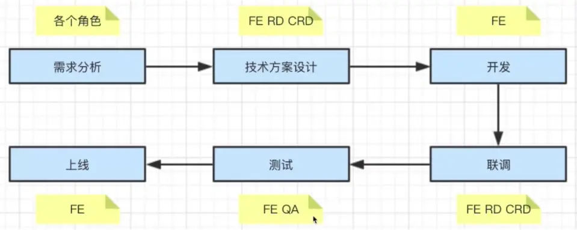

# 12-项目流程

## 01:面试为何会考察项目流程

- 确定你真正参与过实际项目（而不是个人项目、毕业设计等）
- 确定你能真正解决项目的问题
- 看你能否独立承担起一个项目（作为项目负责人）

### 看几个面试题

- PM 想在项目开发过程中增加需求，该怎么办？
- 项目即将延期了，该怎么办？
- 你将如何保证项目质量？

### 如何讲解

- 项目中的所有角色
- 项目的全流程
- 各个阶段中的常见问题

## 02: 12-3 和前端开发相关的项目角色有哪些

### 项目角色

- PM：产品经理 （Project Manager），项目主管或项目经理
- UE：视觉设计师（User Experience，简称 UX 或 UE）
- FE：前端（Front-End）；前端开发（Front-End Development）
- CRD:客户端；移动端 （Client Research and Development）
- RD：后端开发（Research and Development）
- QA：测试（QUALITY ASSURANCE，中文意思是“质量保证”）
- OP：运维（Operations）

## 03 :一个完整的项目要分哪些阶段

### 完整的项目流程

## 04: 评审项目需求时需要注意哪些事项

### Stage1 - 需求分析

- 了解背景(为什么要做这个)
- 质疑需要是否合理
- 需求是否闭环(比如点赞后有什么目的吗,今后有什么用)
- 开发难度如何(比如做一个动画，如果为了炫而做一个高难度的动画，前端很难完成
- 是否需要其他支持
- 不要急于给排期(千万不要在会上给排期，中间如果有事怎么办，要看整个部门的安排，然后最后通过考虑后给一个排期)

## 05: 如何做好技术方案设计

### Stage2 - 技术方案设计

- 求简，不过度设计(合理使用技术)。
- 产出文档(不要自己想当然，比如 2 年以后再看，你还记得住吗，文档)。
- 找准设计重点（组件设计，组件拆分，数据结构设计，对接）
- 组内评审(最好要，万一组内有好的技术解决方案)
- 和 RD 和 CRD 沟通(三方都认同了)
- 发出会议结论

## 06: 如何保证代码质量

### Stage3-开发 （如何保证代码质量）

- 如何反馈排期(预留 buf，比如 3 天能开发完，你说 4 天，留好并行工作【如果还有其他工作的话】，还要搞定上一级 UI 或者后端排期就是大家的整体排期，工作量可以先给)。
- 符合开发规范，如 css、注释，模块名称等等。
- 写出开发文档(代码注释文档)。
- 及时单元测试。
- Mock API(如果大家没有写好接口，可以做一个虚拟的接口)。
- Code Review(让别人看看自己代码有没有什么不好的地方)。

## 07: 项目过程中 PM 加需求怎么办

### Stage4- 联调

- 和 RD 和 CRD 进行技术联调 （接口能力联调）
- 让 UE 确定视觉效果(让 UE 和 PM 尽早的看到，避免回滚)。
- 让 PM 确定产品功能

### PM 加需求怎么办？

- 不能拒绝，走需要变更流程计课 你无权拒绝，你不是一个领导
- 如果公司有规定，按规定走
- 否则 发起项目组和 leader'的评审，重新评估排期(如果比较少就在群里发个通知就好了)
  （让 PM 的 leader 和我的 leader 都知道，他们同意后重新排期）

## 08: 不要对 QA 说：我电脑没问题！

### Stage 5- 测试

- 发起提测邮件，抄送项目组（PM 来发，前端，后端分开发）
- 测试问题要详细记录
- 有问题及时沟通，QA 和 FE 天生信息不对称 （想法和思维就不一样）
  （他们工作就是找问题，你总觉得自己代码没有问题）

### 我电脑没有问题呀！

- 不要说这句话
- 当面讨论，让 QA 帮你复现
- 如果需要特定设备才能复现，让 QA 提供设备

## 09: 项目上线

### Stage6 -上线

- 上线后及时通知 QA 回归测试（你不通知他也会盯着）
- 上线后及时同步给 PM 和项目组（他比你还关心）
- 如果有问题，及时回滚，先线上 ok，再排查问题（不要在线上排查问题）

## 10: 项目沟通的重要性

### 项目沟通

- 多人协作，沟通是最重要的
  （沟通比你写文档 ，技术设计，写代码都重要）
- 每日一沟通（站会），有事说事，无事报平安
  （更可以临时沟通，我明天要请假）
- 及时识别风险，及时汇报（不要等到发生后说事）
  （明天要做页面，今天还没出来设计图，我的可能要延期）

## 11: 项目流程总结

- 为何考察-确定有项目经验
- 项目分多阶段
- 项目需要计划和执行
- 项目角色
- 项目流程和阶段
- 遇到的问题
