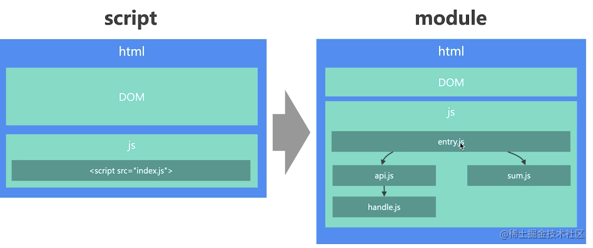
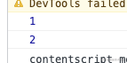
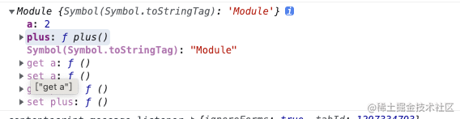
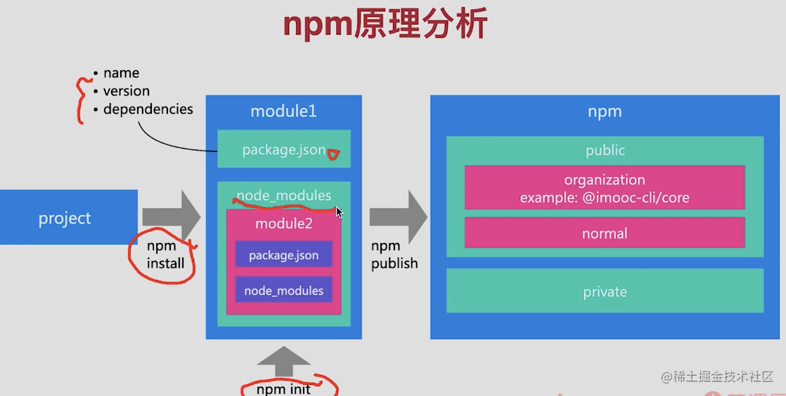
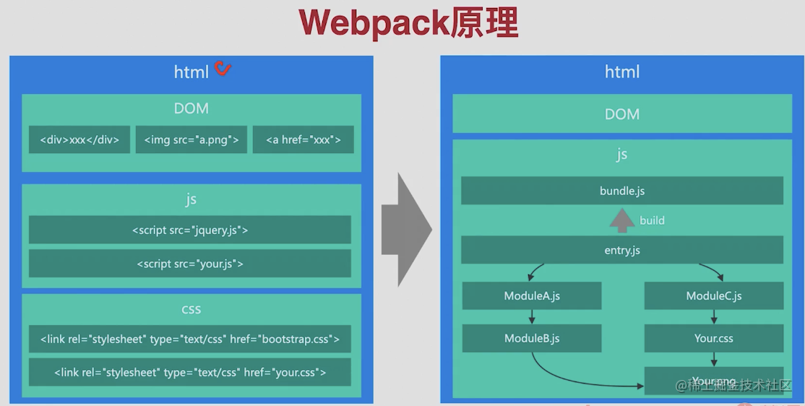

# 02-零基础：极速入门前端工程化基石之模块化技术

## 01：【起航】阶段概览

### 阶段目标

- 完成前端原生`JS`项目升级模块化开发+`MVVM`框架
- 掌握并实践`Webpack`各种优化技巧
- 掌握`Vue2`和`Vue3`框架搭建原理和方法

### 课程安排

- `webpack`核心概念入门：`bundle`、`chunk`、`loader`、`plugin`等
- `ZBestPC` 商城项目源码分析和工程化痛点分析
- `ZBestPC`商场项目从原生`JS项目`升级到`Webpack工程化`开发
- `ZBestPC`商城项目升级到`Vue2`、`Vue3`框架开发

### 课程收获

- 掌握`webpack`的基本概念和企业级项目的完整实践过程
- 解决`Webpack`实际应用过程中碰到的问题
- 掌握`Vue2`和`Vue3`框架的搭建和升级的具体方法
- 掌握`SPA`和`MPA`架构的区别和搭建方法

### 学习方法

- 本阶段项目非常注重理论和实践的结合
- 需要先掌握工程化、模块化、`Webpack`、`MVVM`等概念后在做项目
- 实践过程中一定要理解背后的问题再动手解决，解决过程中要不断思考和总结，并进行持续迭代和优化

### 开源项目

[ZBestPc-github](https://github.com/NewCoder798/ZBestPC.git)

## 02:前端工程化发展历史

### 思考以下问题

- 前端工厂化是如何一步步发展到今天的？
- 前端开发模式是如何逐步演化的？

### 前端历史大事件

- 1995 年 Brendan Eich 发明 JavaScript
- 2005 年 Ajax（Asynchronous JavaScript And XML）广泛应用
- 2008 年 V8 引擎发布
- 2009 年 Nodejs 发布
- 2010 年 NPM 0.1 版本发布
- 2013 年 Webpack 1.0 版本发布
- 2013 年 React 1.0 版本发布
- 2014 年 Vue 1.0 版本发布

### 前端开发模式进化过程

- 前后端混合(1995-2005):服务端渲染，`JavaScript`仅实现交互
- 前后端分离(2005-2013):借助 ajax 实现`前后端分离`、`SPA`等新模式
- 模块化开发（2013-2014）：`Npm`管理模块，`Webpack`编译打包资源
- 模块化+MVVM（2014-至今）：基于`React`或者`Vue`，开发`Html`成为历史

### 前端工程化解决了什么问题

- 前端开发效率、开发规范、访问性能
  - 问题 1：`js` 全局作用域冲突
  - 问题 2：编码规范问题
  - 问题 3：资源合并和压缩问题
  - 问题 4：高版本 `js` 预发降级

## 03：前端工程化的应用场景

### 请思考下面的问题

- 你目前所在企业的前端研发流程是什么？

思考这个问题的原因呢？

- 前端工程化贯穿于整个研发流程，解决研发流程中的问题
- 工程化的核心目标是三点：**效率、规范、性能**
- 只有了解了前端研发流程的痛点，才能够进行诊断和优化
- 需要站在研发场景的角度去思考研发流程痛点

### 企业前端项目面临的真实问题

- 项目量级别增加：几千行代码=>几万行代码
- 项目数量扩大：几个项目=>几千个项目
- 项目复杂度高：Web 项目=>H5/PC/小程序/服务端/脚手架
- 团队人数增加：几个前端=>几百个前端

### 企业前端工程问题解决

- 项目量级增加：模块化（Common js 和 ESM）、npm、webpack
- 项目数量扩大：研发平台、研发脚手架
- 项目复杂度高：工程脚手架（统一解决不同技术栈的工程差异）
- 团队人数增加：研发平台、研发脚手架

### 企业前端工程化应用场景

- 项目研发模式升级（模块化+MVVM）
- 工程脚手架
- 研发脚手架
- 项目性能优化

### 课程三大项目介绍

- 项目 1：`ZBestPC`项目架构升级，原生 js=>`webpack+vue`
- 项目 2：`vue-elm`项目架构升级，工程架构升级+性能优化
- 项目 3：`imooc-build`工程化脚手架开发，`vue-cli=>imooc-build`

### 课程三大项目解决问题一览

- 项目研发模式升级：<= ZBestPc 架构升级 + vue-elm 架构升级
- 工程脚手架 <= imooc-build 工程化脚手架
- 研发脚手<=imooc-cli 脚手架（web 前端架构师课程项目）
- 项目性能优化<=vue-elm 架构升级

### 04：前端工程化关键技术之模块化详解

### 本节核心内容和目标

- 内容：讲解前端工程化关键技术 **模块化** 的实现原理
- 范围：覆盖主流模块化规范：Commonjs、AMD、CMD、ESM
- 目标：对前端工程化知识体系建立基础认知

### 前端模块化的背景

- 前端模块化是一种标准，而不是实现
- 理解模块化是理解前端工程化的前提
- 前端模块化是前端项目规模化的必然结果

### 什么是前端模块化

- 将复杂程序根据规范拆分为若干模块，一个模块包括**输入**和**输出**
- 模块的内部实现是**私有的**，对外暴露接口与其他模块通信
- 一个`HTML`页面可以引入的`script`包括：脚本和模块

### 脚本和模块的区别



### 前端模块化的进化过程

#### 第一阶段：全局 function 函数，将不同功能封装成不同函数

缺陷：**容易引发全局明明空间冲突**

```javascript
//  inde_function.js
// 调用后端接口
function api() {
  return {
    code: 0,
    data: {
      a: 1,
      b: 2,
    },
  }
}
// 处理后端接口
function handle(data, key) {
  return data.data[key]
}

// 数据运算
function sum(a, b) {
  return a + b
}

const data = api()
const a = handle(data, 'a')
const b = handle(data, 'b')
const c = sum(a, b)
console.log(c)
```

#### 第二阶段：全局**namespace**模式，通过对象封装模块

缺陷：外部能够修改模块内部数据

```javascript
//  inde_namespace.js
window.__Moudle = {
  // 调用后端接口
  api() {
    return {
      code: 0,
      data: {
        a: 1,
        b: 2,
      },
    }
  },
  // 处理后端接口
  handle(data, key) {
    return data.data[key]
  },

  // 数据运算
  sum(a, b) {
    return a + b
  },
}
const m = window.__Moudle
const data = m.api()
const a = m.handle(data, 'a')
const b = m.handle(data, 'b')
const c = m.sum(a, b)
console.log(c)
```

上述问题的一个解决方案：**函数作用域+闭包**

```javascript
function test() {
  var a = 1
  return {
    set(v) {
      a = v
    },
    get() {
      return a
    },
  }
}
const handle = test()
console.log(handle.get()) // 1
console.log(handle.set(2))
console.log(handle.get()) // 2
```

#### 第三阶段：IIFE 模式，通过自执行函数创建闭包

缺陷：**无法解决模块相互依赖问题**

> iife: immediately-invoked function expression

```javascript
;(function (global) {
  var a = 1
  function api() {
    return {
      code: 0,
      data: {
        a: 1,
        b: 2,
      },
    }
  }
  // 处理后端接口
  function handle(data, key) {
    return data.data[key]
  }

  // 数据运算
  function sum(a, b) {
    return a + b
  }
  function setA(v) {
    a = v
  }
  function getA() {
    return a
  }
  global.__Module = {
    api,
    handle,
    sum,
    setA,
    getA,
  }
})(window)
const m = window.__Moudle
const data = m.api()
const a = m.handle(data, 'a')
const b = m.handle(data, 'b')
const c = m.sum(a, b)
console.log(c)
console.log(m.getA())
m.setA(3)
console.log(m.getA())
```

#### 第四阶段：IIEF 模式增强，支持传入自定义依赖

缺陷：

- 多依赖传入时，代码阅读困难
- 无法支持大规模的模块化开发
- 无特定语法支持，代码简陋

```javascript
;(function (global) {
  var a = 1
  function api() {
    return {
      code: 0,
      data: {
        a: 1,
        b: 2,
      },
    }
  }
  // 处理后端接口
  function handle(data, key) {
    return data.data[key]
  }
  global._Module_API = {
    api,
    handle,
  }
})(window)
;(function (global, moduleAPI) {
  // 数据运算
  function sum(a, b) {
    return a + b
  }
  global.__Module = {
    api: moduleAPI.api,
    handle: moduleAPI.handle,
    sum,
  }
})(window, window._Module_API)
```

## 05：前端工程化关键技术之 CommonJS 规范详解

### CommonJS 规范介绍

- `Nodejs`默认模块化规范，每个文件都是一个模块，有自己的作用域
- `Nodejs`中`Cjs模块`加载采用同步加载方式
- 通过`require`加载模块，通过`exports`或者`module.exports`输出模块
- 所有代码都运行在模块作用域，不会污染全局作用域
- 模块可以多次加载。**第一次加载时会运行模块，模块输出结果会被缓存**，再次加载时，会从缓存结果中直接读取模块输出结果
- 模块加载的顺序，按照其在代码中出现的顺序

```javascript
// cjs/sum.js
function sum(a, b) {
  return a + b
}
module.exports = sum

// cjs/handle.js
// 处理后端接口
function handle(data, key) {
  return data.data[key]
}
module.exports = handle

// /cjs/api.js
const handle = require('./handle')
function api() {
  return {
    code: 0,
    data: {
      a: 1,
      b: 2,
    },
  }
}

module.exports = { api, handle }

// /cjs/entry.js: 入口文件
const { api, handle } = require('./api')
const { sum } = require('./sum')
const data = api()
const a = handle(data, 'a')
const b = handle(data, 'b')
const c = sum(a, b)
console.log(c)
```

### CommonJS 规范特点

- 所有代码都运行在模块作用域，不会污染全局作用域
- 模块可以多次加载。**第一次加载时会运行模块，模块输出结果会被缓存**，再次加载时，会从缓存结果中直接读取模块输出结果
- 模块加载的顺序，按照其在代码中出现的顺序
- **模块输出的值是值的拷贝**，类似 IIFE 方案中的内部变量

### ComoonJS 规范打包

- 安装 Browserify: `npm install browserify -g`
- 模块化打包命令：`browserify module_test/cjs/entry.js -o dist/bundle.js`
- 注意，当存在多个模块时，每个模块都需要单独打包

### browserify 打包原理

- 本质还是通过自执行函数实现模块化
- 将每个模块编号，存入一个对象，每个模块标记依赖模块
- 实现了`require`方法，核心是通过`call`方法调用模块，并传入`require/module/exports`方法，通过`module`存储模块信息，通过`exports`存储模块输出信息

## 06：前端工程化关键技术之 ESModule 规范详解

### AMD 规范介绍

- AMD 规范采用非同步加载模块，允许指定回调函数
- Node 模块通常都位于本地，加载速度快，所以适用于同步加载
- 浏览器环境下，模块需要请求获取，所以适用于异步加载
- Require.js 就是 AMD 的一个具体实现库

### CMD 规范介绍

- CMD 整合了 CommonJS 和 AMD 的优点，模块加载时异步的
- CMD 专门用于浏览器，sea.js 是 CMD 规范的一个实现
- AMD 和 CMD 最大的问题就是没有通过语法升级解决模块化

### ESModule 规范介绍

- ESModule 设计理念是希望在编译时就确定模块依赖关系及输入输出
- CommonJS 和 AMD 必须在运行时才能确定依赖和输入、输出
- ESModule 通过 import 加载模块，通过 export 输出模块

```javascript
// esm 规范的
// esm/api.js
import { handle } from './handle.js'

function api() {
  return {
    code: 0,
    data: {
      a: 1,
      b: 2,
    },
  }
}

export default { api, handle }

// esm/handle.js
// 处理后端接口
function handle(data, key) {
  return data.data[key]
}
export default handle

// esm/sum.js
function sum(a, b) {
  return a + b
}
export default sum

// esm/entry.js
import { api, handle } from './api.js'
import sum from './sum.js'
const data = api()
const a = handle(data, 'a')
const b = handle(data, 'b')
const c = sum(a, b)
console.log(c)
```

### CommonJS 和 ESModule 规范对比

- `CommonJS` 模块输出的值是值的拷贝，`ES Modules` 模块输出的是值的引用
- `CommonJS` 模块是运行时加载，`ES Modules` 模块是编译时输出接口
- `CommonJS` 模块是单个值导出，`ES Modules` 可以导出多个
- `CommonJS` 模块为同步加载，`ES Modules` 支持异步加载
- `CommonJS` 的 this 是当前模块，`ES Modules` 的 this 是 undefined
- `CommonJS` 和 `ES Module` 的语法不同

#### 测试用例

##### 测试 ES6 Module

先测试 ES6 模块

```javascript
// Test/test-cjs/test.cjs.js
export let a = 1

// Test/test-cjs/index.js
import { a } from './test.cjs'

console.log(a)
a++
console.log(a)
```

新建测试示例`test-cjs/index.html`

```html
<!DOCTYPE html>
<html lang="en">
  <head>
    <meta charset="UTF-8" />
    <meta http-equiv="X-UA-Compatible" content="IE=edge" />
    <meta name="viewport" content="width=device-width, initial-scale=1.0" />
    <title>Document</title>
  </head>
  <body></body>
  <script type="module" src="./test.esm.js"></script>
  <script type="module" src="./index.js"></script>
  <script type="module" src="./test.js"></script>
</html>
```

用`live server`打开，发现如下报错


注意：**`export` 的都是只读的，没法直接修改，你可以通过设置 set 方法这样修改。**

修改测试

```javascript
// Test/test-cjs/test.cjs.js
export let a = 1
export function plus() {
  a++
}

// Test/test-cjs/index.js
import { a, plus } from './test.esm.js'

console.log(a) // 1
plus()
console.log(a) // 2

// Test/test-cjs/test.js
import { a } from './test.esm.js'
setTimeout(() => {
  console.log(a) // 2 注意，这时候结果已经发生了变化
}, 2000)
```

可以看到打印结果如下



```javascript
// 修改 Test/test-cjs/test.js 如下，它支持异步
import('./test.esm.js').then((res) => {
  console.log(res)
})
console.log(this) // undefined
```

打印结果如下



##### 测试 CommonJS

```javascript
// Test/test-cjs/test.cjs.js
let a = 1
exports.a = a
exports.plus = function () {
  a++
}

//Test/test-cjs/index.js
const { a, plus } = require('./test.cjs')
console.log(a) // 1
plus()
console.log(a) // 1

console.log(this === module.exports) // true
```

运行`node test-cjs.index.js`结果如下


其实对于上述`commonjs`规范的输出可以理解为如下

```javascript
module.exports = {
  a: 1,
  plus,
}
// 所以获取后的 a 的值是不会变化的
```

| CommonJS                                                 | ES Module                  |
| -------------------------------------------------------- | -------------------------- |
| 加载模块：require                                        | 加载模块：import           |
| 输出模块：module.exports 或者 exports                    | 输出模块：export           |
| Nodejs 默认采用的模块化规范 <br />Node 14 后默认支持 ESM | 浏览器默认采用的模块化规范 |

### 脚本和模块对比

- 模块具备更高的开发效率（可读性强、复用高效）
- 脚本具备更高的页面性能（模块文件多、加载速度慢）
- 模块在浏览器中运行会存在兼容性问题，要特别注意

### 浏览器模块化的局限

- 缺乏模块管理能力，模块分散在各个项目中
- 性能加载慢，无法大型项目中直接使用
- 这两个问题是`npm`和`webpack`核心解决的问题

## 07：前端工程化关键技术之 npm+webpack 原理

### npm 诞生背景

- npm 是由程序员[Isaacs](https://github.com/isaacs)发明
- 初步思路
  - 集中管理所有模块，所有模块都上传到仓库（registry）
  - 模块内创建 `package.json` 标注模块的基本信息
  - 通过 `npm publish` 发布模块，上传到仓库(registry)
  - 通过 `npm install` 安装模块，模块安装到`node_modules`目录
- npm 于 2014 年商业化，2020 被 Github 收购
- npm 解决的核心问题就是模块管理问题
- npm 包含 cli、模块仓库、官网三大部分



### npm 原理总结

- `npm init` 创建模块，`npm install` 安装模块，`npm publish` 发布模块
- `npm link` 本地开发，`npm config` 调整配置 ，`npm run` 调用 `scripts`
- `npm` 规范：`package.json`管理模块信息，`node_modules`保存依赖

### npm 的局限

- npm 只能解决模块的高效管理和获取问题
- npm 无法解决性能加载的问题
- 模块发明后，制约其广泛应用的因素就是**性能问题**

### webpack 诞生背景

- webpack 于 2012 年 3 月 10 号诞生，作者是 Tobias(德国)
- 移植了 GWT(google web toolkit)的功能（code splitting)
- 2014 年 Instagram 团队分享性能优化时，提到使用 Webpack 的 code spliting 特性
- Webpack 的出现模糊了任务和构建的边界，使之融为一体



### Webpack 的原理

- 最初的 webpack 核心解决的问题就是**代码合并与拆分**
- webpack 的核心理念就是将资源都视为模块，统一进行打包和处理
- webpack 提供了 loader 和 plugins 完成功能扩展

## 08：ZBestPC 工程化改造需求分析

### 项目需求

- 第一阶段：项目 webpack 改造，使原生 js 项目能够支持模块开发以及打包
- 第二阶段：Vue SPA(单页面应用)改造，使项目能够使用 Vue 进行单页面应用开发
- 第三阶段：Vue MPA(多页面应用)改造，使项目能够使用 Vue 进行多页面应用开发
