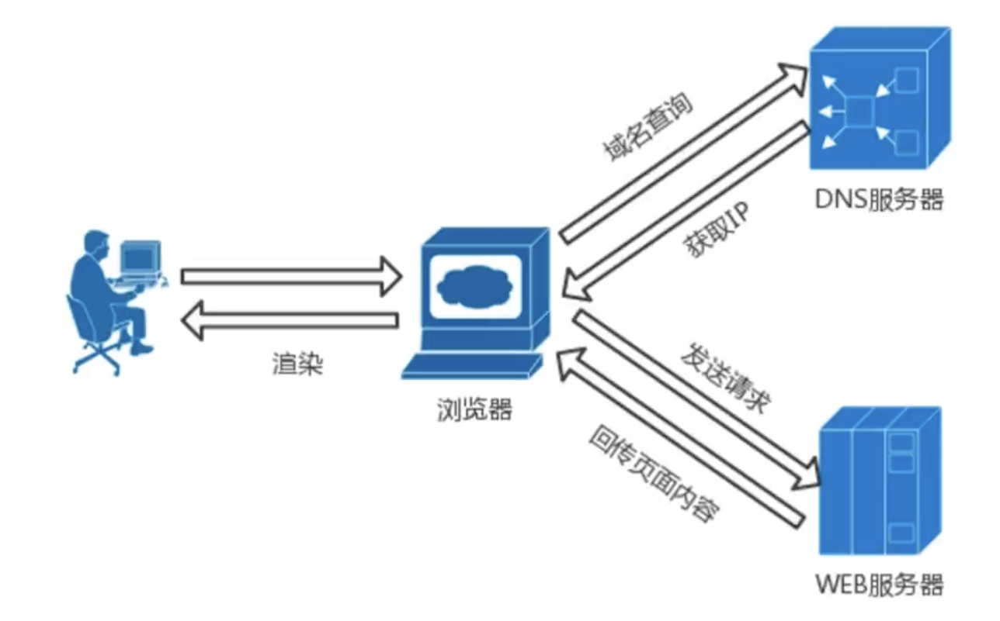
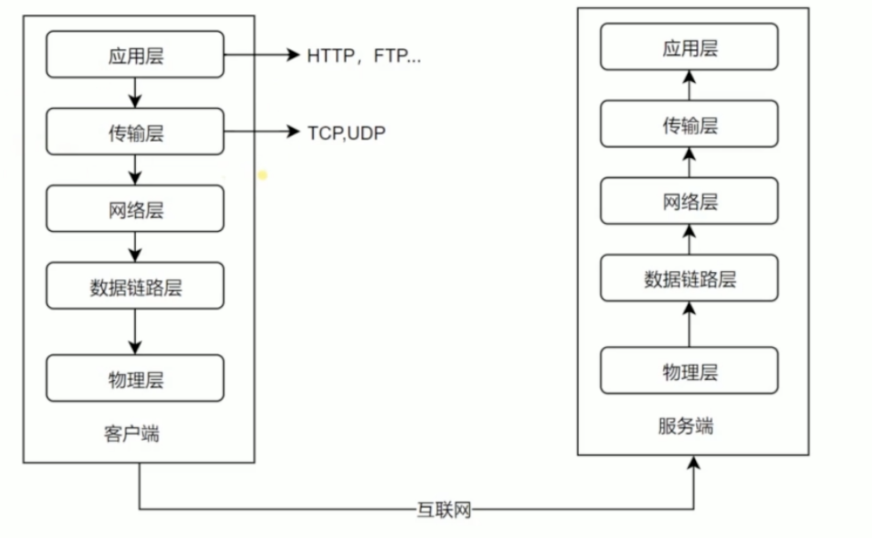
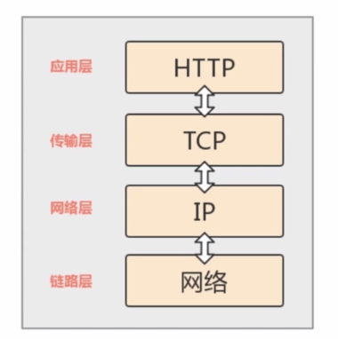
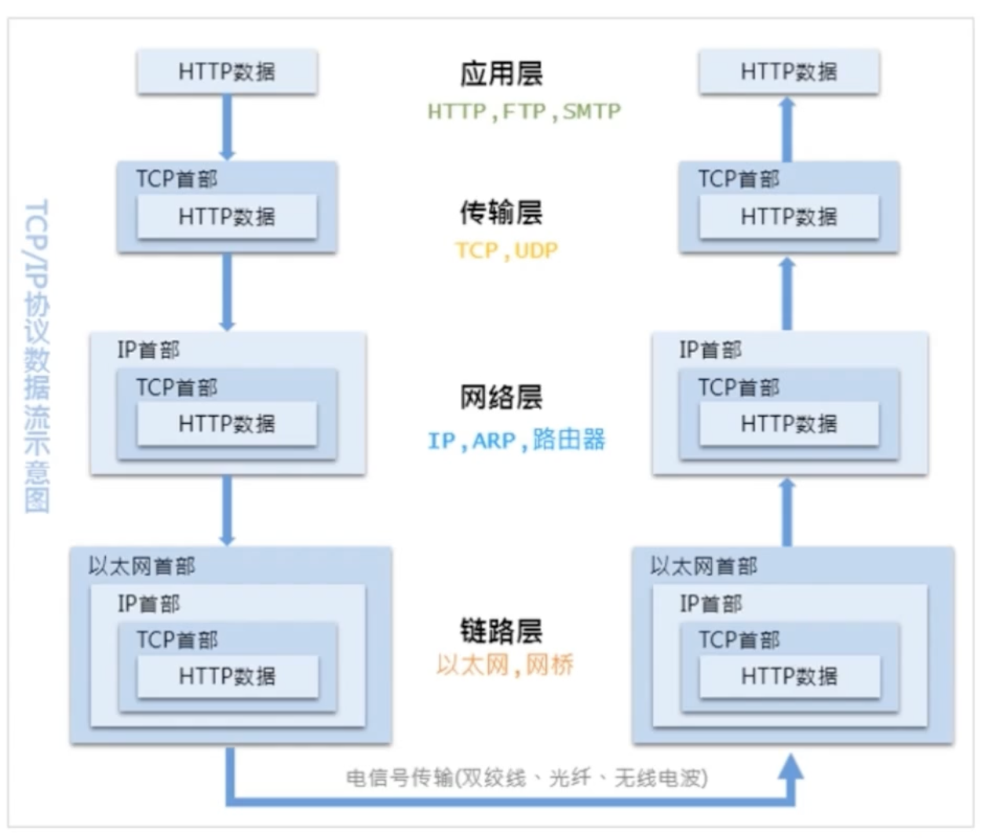
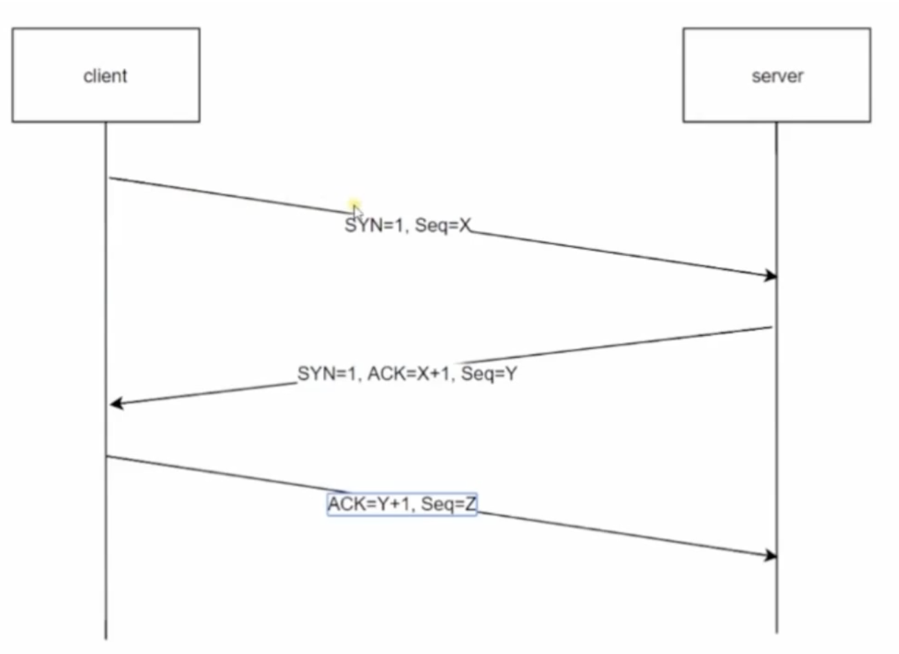
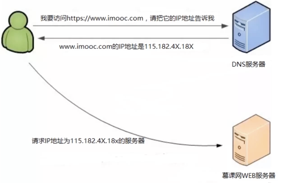
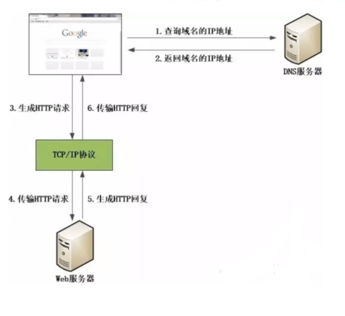
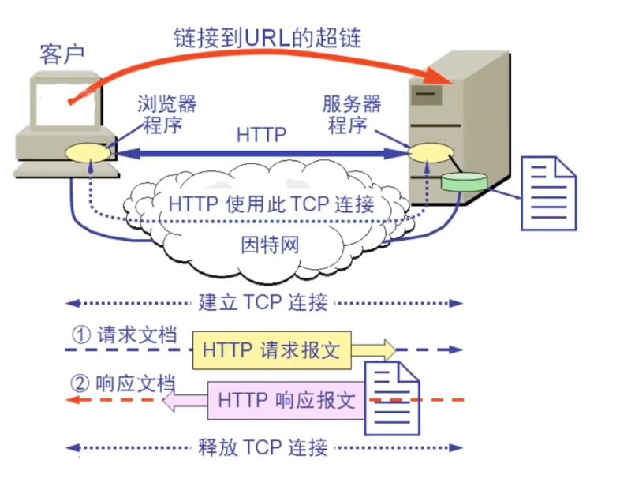

## 1. 了解 HTTP 协议

### 1.1. 浏览器背后的故事

访问网站通过域名，域名解析到服务器，服务器将数据返回给浏览器，浏览器渲染页面，用户看到页面。

- 域名～dns解析为ip
- 域名易记，ip难记！类似通讯录的电话号码
- 通讯需要共同语言：协议相关，比如 http协议
- 浏览器拿到后台返回的文本后，需要渲染出来给用户看，里面涉及到依赖资源的加载，js、css、图片、视频等，浏览器下载解析渲染合并图层等最终显示到页面中

### 1.2. HTTP

- HTTP协议(超文本传输协议HyperText Transfer Protocol)，它是基于TCP协议的应用层传输协议，简单来说就是客户端和服务端进行数据传输的一种规则。
- 它允许将超文本标记语言（HTML）从 WEB 服务器传送给客户端的浏览器
- HTTP 是一个属于应用层的面向对象的协议。由于其简捷、快速的方式，适用于分不超媒体信息系统。它于 1990 年提出，经过几年的使用与发展，得到不断地完善和扩展

### 1.3. HTTP 与 WEB

- WEB 是一种基于超文本和 HTTP 的、全球性的、动态交互的、跨平台的分布式图形信息系统
- 建立在 Internet 上的一张网络服务，为浏览折在 Internet 上查找和浏览信息提供了图形化的、易于访问的直观界面，其中的文档即超级链接 internet 上的信息节点组织成一个互为关联的网状结构

## 2. HTTP 协议的前世今生

- 1990年10月 万维网之父 Tim Berners-Lee 最早提出了 HTTP 协议
- 1991年，HTTP 0.9 诞生

- **只有一个get的的技能**，而且只能传递HTML格式的字符串
- 没有 HEADER 等描述数据的信息
- 服务器发送完毕，就关闭 TCP 链接
- 所以在0.9版本它是比较弱化的一个协议形式。而且在这个版本里每个HTP请求都是短链接

- 1996年5月，HTTP 1.0 发布

- 增加很多命令：像 post 和 head
- 增加了 status Code 和 header,
- 多字符集支持，多部分发送、权限、缓存等

- 1997年1月，HTTP 1.1 发布

- HTTP 技能更加的多，比如像options could delete，trees connected 等等方法。
- 也引入了现在常用的**持久连接、管道机制**，分块传输等等（一个 TCP 链接中进行多个 http 请求）
- HTTP 1.1 是我们目前为止最常用的 HTTP 版本

- 2015年5月，HTTP 2.0 发布

- 所有数据以**二进制传输**
- **同一链接里面发送多个请求不再需要按照顺序来**
- **头信息压缩**以及**推送**等提高效率的功能

- HTTP 3.0 QUIC 协议

## 3. 透过 TCP/IP 看 HTTP

- HTTP 协议是构建在 TCP/IP 协议之上的，是 TCP/IP 协议的一个子集
- 为了更好的理解 HTTP 协议，我们先了解一下 TCP/IP 的相关知识

### 3.1. TCP 协议族

- TCPIP协议，其实是一系列的与互联网相关联的协议集合起来的总称。
- 而在TCPIP协议组里面，**分层管理** 是它的一个非常重要的特征。我们来看一看它到底是怎样来进行分层的。

#### 3.1.1. 经典五层模型

#### 3.1.2. 低三层

- 物理层主要作用是定义物理设备如何传输数据，如：硬件设备
- 数据链路层在通信的实体间建立数据链路连接
- 网络层为数据在结点之间传输创建逻辑链路

#### 3.1.3. 传输层

向用户提供可靠的端到端（End to End）服务

传输层向高层屏蔽了下层数据通信的细节

#### 3.1.4. 应用层

为应用软件提供了很多服务

构建于TCP 协议之上

屏蔽网络传输相关细节

### 3.2. TCP 协议族分层

- TCP IP协议组它是由一个四层协议来组成的系统。这四层我们分别叫做应用层、传输层、网络层 和数据链路层，我们可以简单称为叫链路层。我们分别来看一下，我们自顶向下的来进行了解。

#### 3.2.1. 应用层

- 应用层一般是我们编写的应用程序，它决定了向用户提供的应用服务。
- 应用层可以通过系统调用与传输层向下进行通信。如 FTP、DNS、HTTP 等

比如说我们比较常见的，我们通过FTP去下载文件。很多同学的公司内部都是在用FTP，这个FTP也是我们的应用层级

接下来我们前面介绍过的DNS也是应用层。再有我们的HTTP协议更是我们的应用层的上层系。

#### 3.2.2. 传输层

- 传输层是通过系统调用向应用层提供处于网络连接中两台计算机之间的数据传输功能。
- 在传输层里有两个性质不同的协议，一个我们叫做 TCP，另外一个叫做 UDP

TCP 是面向连接的，而UDP是无连接的; 这就决定了 TCP 虽然它比较可靠，但是因为需要建立连接，就像我们前面讲的效率就比较低。

UDP它没有连接，所以它效率特别高。

但是同样的，因为你没有去建立连接，没有这样的校验机制，所以可靠性就稍微低一点儿。

这是两种性质不同的协议。所以在正常使用中，我们使用哪种协议是取决于你的场景来决定的。

#### 3.2.3. 网络层

- 网络层我们又叫做叫网络互联层。
- 网络层是用来处理在网络上流动的一些数据包，数据包是我们网络传输的一个最小的数据单位
- 该层规定了通过怎样的路径，也就是我们说的传输路线到达对方的计算机，并且把数据包传送给对方，与对方计算机之间，通过多台计算机和网络设备来进行传输的时候，网络层它所起到的作用就是在众多的选项之中选择一条传输路线。
- 这是我们网络层的意义

链路层

- 链路层我们又叫做数据链路层，或者有的还叫做网络接口层。
- 但是链路层是我们最常用的一种称呼，它用来处理我们连接网络里面的硬件部分
- 包括我们的控制操作系统，硬件的设备驱动，然后网卡，光纤物理等等这些
- 还包括像我们的连接器等等一切的传输媒介，这些硬件上的范畴均在链路层的作用范围之内

### 3.3. 数据包的封装过程

我们来聊一聊数据封装的过程。就是说我们的上层协议的数据到底是怎么样转变成为下层协议数据的呢？

这就是通过我们叫做封装来实现的应用程序。

数据在发布到我们的数据网络之前，会沿着这个协议栈从上往下去进行传递。而每层协议都将在我们的上层协议的基础之上加上自己的头部信息。链路层还会加上尾部信息。

以此来实现我们所有层它的一个数据封装，最终为我们到达我们的网络提供所有的必要信息，这就叫做我们的数据包的封装过程。

#### 3.3.1. HTTP 数据传输过程

那我们来看看它的一个传输的过程，我们利用TCPIP协议族进行网络传输通信的时候，会通过分层的顺序与对方进行通信。

- 发送端从应用层往下走，接收端从应用层向上走。
- 发送端发送数据时，数据会从上层传输到下层，每经过一层都会被打上该层的头部信息。
- 而接收端接收数据时，数据会从下层传输到上层，传输前会把下层的头部信息删除

我们就用HTP来举例说明。

首先作为发送端的客户端，在应用层也就是通过我们的HTTP协议发出一个想看某个web页面的HTTP请求。

接下来为了传输方便，在传输层就是我们的通过TCP协议把应用层收到的数据，就是我们的HTP的请求报文进行分割，并且在各个报文上打上标记序号、端口号等等一系列的信息发送到我们的网络层。在网络层也就是通过我们的IP协议增加作为通讯目的地的MAC地址，然后转发给链路层。

这样一来，发往网络的通信请求就准备齐全了。

接收端的服务器在链路层接收到请求的数据，按顺序向上层发送，一直发送到应用层。

当我们传输到应用层的时候，才算我们真真正正的接受到了由客户端发送过来的HTTP请求。

那就像我们刚刚说的，发送端在层与层之间传输数据的时候，每经过一层必定会打上一个该层所属的头部的信息。反过来说，在接收端就相反，在层与层之间去传输数据的时候，每经过一层都要把对应的头部信息、手部信息给它消去。

这就是说我们 HTTP 数据通信到底是怎样去进行的，我们的封装是怎样实现的。

Ok 接下来我们来说一说非常重要的，对于我们这样面向 TCP 面向连接的这样的协议的方式，到底它是怎么样来进行一个通讯过程的那我们说使用 TCP 协议来进行通信，双方必须先建立连接，然后才能开始传输数据。

为了确保连接双方的可靠性，所以双方在建立连接的时候，TCP协议 通通采用了三次握手的策略。

### 3.4. 传输层-TCP三次握手

- 使用 TCP 协议进行通信的双方必须先建立连接，然后才能开始传输数据
- 为了确保连接双方的可靠性，在双方建立连接时，TCP 协议才用了三次握手策略

#### 3.4.1. 第一次握手

- 客户端发送带有 SYN 标志的链接请求报文，然后进入 SYN_SEND 状态，等待服务端的确认

#### 3.4.2. 第二次握手

- 服务端接收到客户端的 `SYN` 报文段后，需要发送 `ACK` 信息对这个 `SYN` 报文段进行确认。同时，还要发生那个自己的 `SYN` 请求信息，服务端会将上述的信息放到一个报文段（`SYN + ACK` 报文段）中，一并发送给客户端，此时服务端将会进入 `SYN_RECV` 状态

#### 3.4.3. 第三次握手

- 客户端接收到服务端的 SYN + ACK 报文段后，会向服务端发送 ACK 确认报文段，这个报文段发送完毕后，客户端和服务端都进入 ESTABLISHED 状态，完成 TCP 三次握手

### 3.5. 三次握手过程的目的和作用

三次握手链接过程是为了**确认客户端和服务端的发送和接受能力都是正常的**

- 通过第一次握手，客户端确认了自己的发送能力，而服务端确认了自己的接收能力
- 通过第二次握手，客户端确认了服务端的接收能力，而服务端确认了客户端的发送能力
- 通过第三次握手，服务端再次确认了客户端的接收能力

通过这三次握手，客户端和服务端可以建立起一个正常的通信连接。每一次握手都是相互关联的，都能够得出更深入的结论，确保双方的发送和接收能力都是正常的。

我们发现每次都是接收到数据包的一方能够得到一些结论，发送的一方其实没有任何头绪。我虽然有发包的动作，但是我怎么能知道我有没有发出去，而对方有没有接收到呢？我不可能知道。

所以从这个过程我们得出一个结论，**想要建立一个连接，我们最少是需要三次握手过程的。**两次达不到让双方都得出自己和对方接收发送能力都正常的。

那么其实每一次我们收到网络包的一方，至少是可以得到对方发送和我方接收是正常的。但是就像我们刚刚说的这好像还是个推理过程，是不是有点烧脑的过程。每一次握手相互之间都是关联的，所以每到后面我们都要想一想，它是因为能够接到前一次我发送的数据，才能够给我这一次的响应，从而得出更深入的结论。

举例子：A 和 B 之间相互发送短信

A 给 B 发送，B 给 A 回复，然后需要 A 再给 B 回复

证明 A 和 B 的发送能力、接收能力，都是通畅的且双方均验证通过

这就是三次握手的意义

### 3.6. 总结

`HTTP协议`是在一个非常庞大的叫做`TCP/IP的协议家族`里面。它仅仅是这个家族应用层里面的一个小孩子。所以大家谁要是能跟HTP协议在一起了，就可以算是一脚踏入了豪门。

同时这个家族里面有着非常严谨的交流方式，这个交流方式叫做封装的方式。

同时由于我们的 HTTP 跟传输层的 TCP 紧密关联，所以每次操作的时候，每次连接的时候都要进行**三次握手**来建立连接，非常麻烦，规矩非常多。

当然认识一个人，除了知道他的家庭出身，还得去看看他的朋友。毕竟像HTTP协议这样大家族的孩子，还得通过他的朋友圈来观察一下他的人品情况。

所以在下一节中我们将认识一下他的朋友 DNS

## 4. 你是如何访问慕课的”--DNS域名解析

### 4.1. DNS服务与HTTP请求的关系

通常我们访问一个网站，使用的是主机名或者域名来进行访问。因为相对于 IP 地址（一组纯数字），域名更容易让人记住。但是 TCP/IP 协议使用的是是 IP 地址进行访问的，所以必须有个机制或者服务把域名转换为 IP 地址。

**DNS 服务**就是用来解决这个问题的，它**提供域名到 IP 地址之间的解析服务**

我们从微观的角度来看，为了提高效率，其实DNS这一个服务它的解析是有层次的。

具体的原则是什么呢？其实是一个**就近的原则。**

- 首先我们本地电脑会将一些我们经常使用的域名和响应的IP地址建立一个映射关系，并且保存到系统文件里边。

- 所以正常情况下，在进行我们DNS解析的时候，系统我们会优先从 host文件里边去寻找对应的IP地址。
- 如果找到就直接使用 host文件里面的 IP地址，毕竟这是最快的。
- host 大家有没有印象，比如我们有时候想要去访问一些像我们想要访问谷歌，现在网上有一些修改house文件的方式，如果大家不知道的话，可以去查一下。
- 通过这样我们修改了host之后，就把我们谷歌的地址指向了某一个IP。这个IP可能是一个镜像，可能是一个其他的，比如香港或者网上互联网上的一些地址。
- 这就是我们做了一个强制的DNS的转换，让我们能够把这个IP地址链接过去。

- 其次如果我们本地的 HOST 文件里边没有域名一起对应的IP地址映射。那么这时候我们要求助于哪呢
- 求助于我们本地的DNS服务器。

- 我们大家本地都有自己的一个DNS服务，大概的就是系统向本地的DNS服务器发送请求，去查询域名对应的IP地址。
- 本地的DNS服务器想请求找到IP地址，并将结果返回给浏览器。
- 当然这个本地其实它是有限的。所以如果本地的DNS服务没有找到对应的IP地址，那么本地的 DNS 服务会一层一层的向上一级的DNS服务器发送请求，直到DNS根服务器。
- 如果找到的话就会进行回传，最终把找到的IP地址返回给浏览器。

那以上不管是我们前面说过的 `HOST文件`，还是`本地DNS`，还是`更高级的DNS服务器`，还是`根DNS服务器`，目的就一个，就是把DNS服务器的服务做好。就是把域名的解析必须得有一个结果。

要么你给我一个IP地址，要不你告诉我这个域名压根儿就不存在。

没有的话，那可能就是域名错误这样的一个情况。

**所以，我们再细致一点来说，我们访问慕课网的真实情况是什么样的呢 ？**

- 首先我们在浏览器里输入了慕课网的域名，操作系统会检查自己本地的 host 文件是否有这个网址的映射关系。如果有就先调用这个IP进行映射。如果host没用这个域名映射，查找本地的DNS服务器，有直接返回，没有继续向下。
- 如果 host 与 本地DNS解析缓存都没有相应的网址的映射关系，那么首先会在 TCP/IP 参数里边设置的首选DNS服务器。大家记不记得我们在配置网络的时候，经常会配置一个DNS服务器。我们会找那个首选的DNS服务器。比如说我们经常用的就是8.8.8.8，或者114.114.11 4.114。在这儿，我们叫它本地DNS服务器。这个服务器在收到查询的时候，如果要查询域名包含在本地配置区域资源里面，就会返回给客户机。
- 如果本地DNS服务器，本地区域文件的缓存解析都失效的话，那这个时候我们就根据本地的 DNS服务器的设置，这里边有一个设置叫做是否设置转发。进行查询，如果没用转发模式，那本地DNS就直接把请求发到 13台根DNS。如果你设置了的话，它就会一层一层的向上去找。比如你找的是慕课，那它就会一直向上，直到找到DNS，直到找到它的主机IP。如果你用的是非转发模式的话，他就直接找13台根DNS，然后一台一台去找这样的一个模式。

### 4.2. DNS服务器的处理模式和CDN的关联

CDN服务器跟这个DNS服务器有没有什么关联呢？有没有什么不一样的地方呢？

其实CDN它是一个相当于，我简单来说，比如我现在我在北京，有的同学在上海，有的同学在深圳，有的同学在新疆。我现在都想在网上看一个视频，但是我这个视频资源我假如只存一份儿，我比如这个服务器我放在上海了，那我新疆的同学，我天津的同学可能都会访问比较慢，那怎么办呢？所以我在DNS之上，我挂载CDN，然后先由CDN来进行内容的分发。也就是他告诉我，根据我自己的区域来决定我应该访问到哪一边的服务器，然后再通过DNS服务器去返回给我们。所以，相对过程来说，就是在DNS服务器上面又增加了一个CDN这样的模式。所以CDN和DNS不是一个东西，而且更不是取代的东西。

## 5. 回溯 HTTP 事务处理过程

- 当客户端访问 WEB 站点时，首先通过 DNS 服务查询到域名的 IP 地址
- 然后浏览器生成 HTTP 请求，并通过 TCP/IP 协议族需要进行什么？需要进行三次握手，然后再传输 HTTP 请求，生成回复，传送给 WEB 服务器
- WEB服务器接收到请求后，会根据请求生成相应内容，并通过 TCP/IP 协议返回给客户端

再细化一下就是下面这个图：

- 我们从头来说，如果我们用客户端浏览器浏览一个页面的话，那么我们就要从中分解出我们的协议名、我们的主机名、我们的端口、我们的对象路径等等等等等。我们得到协议，我们用的是HTTP的协议，主机，可能是慕课的主机，然后端口是80端口，我的对象路径是慕课的根节点。在这一步我们就需要通过DNS的服务器，就是我们 DNS的服务来解析出它的IP地址。
- 接下来下一步是封装我们的HTTP请求的数据包。把以上部分结合本机自己的信息封装成一个HTTP请求的数据包。再接下来再把这个数据包向下，我们HTTP协议是什么？是最上层的应用层，再往下是传输层，所以我们把这个包再封装成TCP包，这样我开始建立我的TCP连接，这样就是我们的TCP的三次握手
- 在HTTP开始工作之前，客户机，我们首先要通过网络与服务器进行连接，这个连接就是TCP来完成的。这个协议与IP协议共同构建了我们整个互联网，也就是我们前面说过的TCP/IP协议族。所以我们的互联网也有人称作叫TCP/IP。
- HTTP因为是比TCP更高层次的，所以只有低层协议建立之后才进行更高层次的连接。所以这时候我们要先建立TCP连接，然后接下来我们发送请求。建立连接以后，客户端发送一个请求给服务器，然后请求方式的格式就是我们HTP的一个格式，然后服务器来进行能响应，这就是到达我们响应的报文。响应以后，这个过程里面它消息里边消息体会有一个状态码，会有一个什么协议的版本号。然后成功包括失败的代码，包括我们的map信息，包括我们的服务器信息，我们的实体信息等等。然后最后还有很关键的一步，就是一般来说web服务器向浏览器发送请求数据，我们就要关闭掉我们的TCP连接。其实就是把连接释放掉。这样的一个完整过程，就是我们HTTP请求真正的一个完整的，我们可以换个名词，叫做一个完整的工作方式