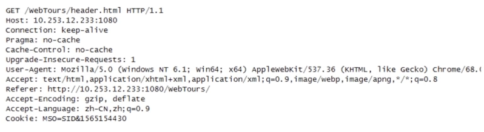

## 1. HTTP协议特点

### 1.1. 支持客户/服务器模式

- 客户/服务器模式工作的方式：是由客户端向服务端发出请求，服务器端响应请求，并进行相应服务

### 1.2. 简单快速

- 客户向服务器请求服务时，只需要传送请求方法和路径
- 请求的方法常用的有`GET、HEAD、POST`。每种方法规定了客户与服务器联系的类型不同
- 由于`HTTP 协议`简单，使得 HTTP 服务器的程序规模小，因而通信速度很快

### 1.3. 灵活

- `HTTP` 允许传输任意类型额数据对象
- 正在传输的类型由 `Content-Type`（`Content-Type` 是 `HTTP` 包中用来表示内容类型的标识）加以标记

### 1.4. 无连接

- 无连接的含义是限制每次链接只处理一个请求
- 服务器处理完客户的请求，并收到客户的应答后，即断开连接
- 采用这种方式可以节省传输时间

- 后续细讲长连接、短连接

发散问题：一个页面有好多个 HTTP 请求来回断开，这样不会效率很低吗？

早期这么做的原因是HTTP的协议产生于互联网，因此服务器需要处理时面向全世界有有数十万上百万客户端的网页访问。但是每个客户端，也就是我们在用的浏览器与服务器之间交换数据的间歇性特别大。也就是说我们传输这个东西，它是有突发性、瞬时性的。并且网页浏览的联想性、发散性，导致两次或者更多次传送的数据关联性很低。大部分的通道实际上它是会很空闲的，也就无端的占用了资源。所以 HTTP 的设计者有意利用这样的特点，将协议设计为请求的时候，连接请求完就释放连接，以尽快的将资源释放出来，服务于其他的客户端。

当然随着这个时间的推移，网页它变得越来越复杂，里面可能嵌入很多的图片。这时候每次我们访问图片都需要建立一次TCP连接，这样它就显得特别低效。所以后来有一个叫做 `keep-live`的功能被提出，用来解决这样的效率低的问题。从名称来说我们就很容易理解了，所以我们叫`keep-alive`，翻译过来就是保持存活。`Keep-live`的功能就是让这个客户端对服务器端的连接能够持续有效。当出现对服务器的后续请求的时候，`keep-live`的功能就能够避免建立或者重新建立用户。这个我们在后面会更加详细的去为大家介绍长连接短连接这样的问题。

市场上现在大部分的web服务器，包括像我们的熟知的IIS或者Apach都支持HTTP的keep live。对于提供一些静态内容的网站来说，这个功能它是非常有用的。但是对于负担较重的网站来说，这里存在另外一个问题。虽然我们为客户保留打开的连接它有一定的好处，但是它同样还是像我们刚刚说的，影响了性能。因为在处理暂停期间，本来可以释放的资源仍旧被占用着。这样一来客户端和服务器之间的 HTTP 连接就会保持不会断开。

当然我们又设计了一下，让我们前面提到的 keep live 不是永久都有效的。这样它有自己的规定的超时时间，超过了那规定的时间或者意外断电了都会断开。同样既然我们要让它有效性，只要还在有效期内，只要没有断开，当同一个客户端发送另外一个请求的时候，就可以使用这条已经建立好的链接。

这里面我先说一下，这里面我们说没有断开重复使用的连接是什么连接呢？大家想一下是TCP连接。Ok这是我们的一个大前提。后面我们在介绍的时候还会应用到这样一个概念。但是无论怎样，对于同一个客户端来说，还是每次只处理了一个请求的。所以我们也能看出来HTTP协议的另一个优点。虽然他是大家族的孩子，但是很专一。

### 1.5. 无状态

- HTTP 协议是无状态协议
- 无状态是指协议对于事务处理没有记忆能力。

- 缺少状态意味着如果后续连续处理需要前面的信息，则它必须重传，这样可能导致每次链接传送的数据量增大

- 另一方面因为服务器不需要先前信息，应答很快，这也是优点之一

客户端与服务器在进行动态交互的web应用程序出现之后，HTTP无状态的特性了就严重阻碍了这些应用程序的实现。毕竟我们交互还是需要承前启后的。比如说我们简单的一个购物车程序，也需要知道用户到底在之前都选择了什么商品。所以两种用于保持HTP连接状态的技术就应运而生了，一个叫cookie另外一个则是session。这两种技术我们先放一下，后面再详细介绍。有了这两种技术，我们就可以让 HTTP 协议仍然保持着一个简单的状况。

意味着什么？意味着我们往好处想，就是HTTP 协议不记仇，无论之前你注意他做了什么，他都对你保持依旧。但是坏处也是一样的，那就是你不要妄想着他能够记住什么历史的纪念日，甚至他跟鱼一样，你刚刚说过的话7秒，不不不，连7秒都不中，2秒钟他就会忘掉。不过幸好我们刚刚说了，我们有一个另外的方式能够辅助他的记忆，就是我们的cookie 和 session

## 2. URL URI URN

[https://zhuanlan.zhihu.com/p/38120321](https://zhuanlan.zhihu.com/p/38120321)

### 2.1. URI

**Uniform Resource Identifier 统一资源标识符**

是一个字符串用来标示抽象或物理资源

URI的格式也由三部分组成：

- 访问资源的命名机制
- 存放资源的主机名
- 资源本身的名称，由路径表示

一个完整的URI可能看起来像这样：`http://www.example.com/index.html?key=value#section` 在这个例子中，方案是 `http`，主机是 `www.example.com`，路径是 `/index.html`，查询字符串是 `key=value`，片段标识符是 `section`

### 2.2. URL

**Uniform Resource Locator 统一资源定位符**

- 它是对可以从互联网上得到的资源的位置和访问方法的一种简洁的表示，是互联网上标准资源的地址。
- URL的格式一般由下列三部分组成：

1. 协议(或称为服务方式)
2. 存有该资源所在的服务器的名称或IP地址(包括端口号);
3. 主机资源的具体地址

### 2.3. URN

**Uniform Resource Name 统一资源名称**

### 2.4. 迷之兄弟：URI 与 URL

- URI：一个紧凑的字符串用来标示抽象或者物理资源
- A URI 可以进一步被分为定位符、名字或者两者都是
- 属于 URL（Uniform Resource Locator）是 URI 的子集，除了确定一个资源，还提供一种定位资源的主要访问机制（如网络“位置”）

### 2.5. 无所不能的维基百科

- URI 可以分为 URL，URN 或者 具备 locators 和 names 特性的一个东西
- URN 作用就好像一个人的名字，URL 就像一个人的地址
- 换句话说：URN 确认了东西的身份，URL 提供了找到它的方式

### 2.6. 安能辨我是雄雌

- ftp://ftp.is.co.za/rfc/rfc1808.txt
- http://www.ietf.org/rfc/rfc2496.txt

- ldap://[2001:db8::7]/c=GB?objectClass?one
- mailto:John.Done@example.com

- news:comp.infosystems.www.servers.unix
- tel:+1-816-555-1212

  

- telnet://192.0.2.16:80/
- urn:oasis:names:specification:docbook:dtd:xml:4.1.2

### 2.7. 总结

URL是一种具体的URI，它不仅唯一标识资源，而且还提供了定位该资源的信息。

URI是一种语义上的抽象概念，可以是绝对的，也可以是相对的，而URL则必须提供足够的信息来定位。

URI：统一资源标识  
URL：统一资源定位  
URN：统一资源名称

例如：  
[http://www.baidu.com](http://www.baidu.com/)是URL.  
[http://www.baidu.com/index.html](http://www.baidu.com/index.html) 是URL 同时也是URI。  
所以，URL 就是 URI 的 定位。

但 URI 不一定是 URL。  
因为 URI有一类子集是 URN，它是命名资源 但不指定如何定位资源。  
如： mailto 需要 加上 相应的结构参数，才能进行 统一资源定位。  
如： mailto: xxxxx@qq.com

因此，三者之间的关系是：  
URL 一定是 URI  
URN + URL 就是 URI

## 3. HTTP 报文结构分析

请求报文

### 3.1. HTTP 报文头

- HTTP 的报文头大体可以分为四类，

- 通用报文头
- 请求报文头
- 相应报文头
- 实体报文头

- 在 HTTP1.1 里一共规范了 47 种报文头字段

#### 3.1.1. 通用报文头

#### 3.1.2. 请求报文头

#### 3.1.3. 响应报文头

#### 3.1.4. 实体报文头

### 3.2. Accept

- 作用：浏览器可以接受的媒体类型

`Accept: text/html` 代表浏览器可以接受服务器返回发的类型为 text/html 也就是我们常说的 html 文档，如果服务器无法返回 text/html 类型的数据，服务器应该返回一个 406 错误（Non Acceptable）

`Accept: */*` 代表浏览器可以处理所有类型

如果想要给显示的媒体类型增加优先级，则使用 q= 来额外表示权重值；重值 q 的范围是 0-1（可精确到小数点后3位），且 1 为最大值。不指定权重 q 值时，默认权重为 q = 1.0 当服务器提供多种类型时，将会首先返回权重值最高的媒体类型

### 3.3. Accept-Encoding

- 作用：浏览器申明自己接收的编码方法，通常指定压缩方法，是否支持压缩，支持什么压缩方法（gzip、deflate）

Accep-Encoding: gzip, deflate

### 3.4. Accept-Language

- 作用：浏览器声明自己接收的语言[链接](about:blank)

Accept-Language: zh-cn;q=0.7,en-us,en;q=0.3;

客户端在服务器有中文版资源的情况下，会请求返回中文版对应的响应，没有中文版时，则请求返回英文版响应

### 3.5. Connection

- Connection: keep-alive 当一个网页打开完成后，客户端和服务器之间用于传输 HTTP 数据的 TCP 链接不会关闭，如果客户端再次访问这个服务器上的网页，会继续使用这一条已经建立的连接
- Connection: close 代表一个 request 完成后，客户端和服务器之间用于传输 http 数据的 TCP 链接会关闭，当客户端再次发送 Request，需要重新建立 TCP 连接

### 3.6. Host

- 作用：请求报头域主要用于指定被请求资源额 Internet 主机和端口号，它通常从 HTTP URL 中提取出来的

我们再浏览器中输入：http://www.fljf.com:8080

浏览器发送的请求消息中，就会包含 Host 请求报头域，如下：

Host:www.fljf.com:8080

### 3.7. Refer

- 当浏览器向 Web 服务器发送请求的时候，一般会带上 Refer，告诉服务器我是从哪个页面链接过来的，服务器借此可以获得一些信息用于处理

### 3.8. User-Agent

- 作用：告诉 HTTP 服务器，客户端使用的操作系统和浏览器的名称和版本
- 很多情况下我们会通过 User-Agent 来判断浏览器类型，从而进行不同的兼容设计

### 3.9. Content-Type

- 作用：说明了报文体内对象的媒体类型

**text 类型**

- text/html: HTML 格式
- text/plain: 纯文本格式
- text/html: XML 格式
- image/gif: gif 图片格式
- image/jpeg: jpg 图片格式
- image/png: png 图片格式

**applicaiton 类型**

- application/xhml+xml：XHTML 格式
- application/xml: XML 数据格式
- application/atom + xml: Atom XML聚合格式
- application/json: JSON 数据格式
- application/pdf: pdf 格式
- application/msword: Word 文档格式
- application/octet-stream: 二进制流数据（如常见的文件下载）
- application/x-www-form-urlencoded: 表单提交

响应报文

## 4. HTTP请求方法剖析

### 4.1. http/1.1 常用方法

1. GET
2. POST
3. PUT
4. HEAD
5. DELETE
6. OPTIONS
7. CONNECT

### 4.2. GET: 获取资源

- GET 方法用来请求访问已被 URI 识别的资源
- 指定的资源经服务器端解析后返回响应内容

- GET 方法也可以用来提交表单和其他数据

`http://localhost:/login.php?username=aa&password=1234`从上面的 URL 请求中，很容易就可以辨认出表单提交的内容

### 4.3. POST

- POST 方法与 GET 功能类似，一般用来传输实体的主体
- POST 方法的主要目的不是获取响应主体的内容

### 4.4. PUT

- 从客户端向服务器传送的数据取代指定的文档的内容
- PUT 方法与 POST 方法最大的不同就是：PUT 是幂等的，而 POST 是不幂等的
- 因此，我们更多时候将 PUT 方法用作传输资源

### 4.5. HEAD/DELETE

- HEAD

- 类似于 GET 请求，只不过返回的响应中没有具体的内容，用于获取报头

- DELETE

- 请求服务器删除指定的资源

### 4.6. OPTIONS

- 用来查询针对请求 URI 指定的资源支持的方法

### 4.7. TRACE/CONNECT

## 5. HTTP响应状态码拆解

### 5.1. 状态码

- 是用以表示网页服务器超文本传输协议响应状态的3位数字代码

### 5.2. HTTP 状态码详解

|   |   |
|---|---|
|分类|含义|
|1XX|表示消息  这一类型的状态码，代表请求已被接受，需要继续处理。这类响应是临时消息，只包含状态行和某些可选的响应头信息，并以空行结束|
|2XX|表示成功  这一类型的状态码，代表请求已经成功被服务器接收、理解并接受|
|3XX|表示重定向  这类状态码代表需要客户端采用进一步的操作才能完成请求。通常，这些状态码用来重定向，后续的请求地址（重定向目标）在本次响应的 Location 域中指明|
|4XX|表示错误处理  这类的状态码代表了客户端看起来可能发生了错误，妨碍了服务器的处理。除非响应的是一个 HEAD 请求，否咋服务器就应该返回一个解释当前错误状态的实体，以及这是临时的还是永久性的状况。这些状态码适用于任何请求方法。浏览器应当向用户展示任何包含在此类错误响应中的实体内容|
|5XX|表示服务器错误。这类状态码代表了服务器在处理请求的过程中有错误或者异常状态发生，也有可能是服务器意识到以当前的软硬件资源无法完成对请求的处理。除非这是一个 HEAD 请求，否则服务器应当包含一个解释当前错误状态以及这个状况是临时的还是永久的解释信息实体。浏览器应当向用户展示任何在当前响应中被包含的实体。|

### 5.3. 2XX 状态码

|   |   |   |
|---|---|---|
|状态码|状态码英文名称|描述|
|200|OK|请求已成功  请求所希望的响应头或者数据体将随着此响应返回|
|202|Accepted|已接受，已经接受请求，但是未处理完成|
|206|Paritial Content|部分内容，服务器成功处理了部分 GET 请求|

### 5.4. 3XX 状态码

|   |   |   |
|---|---|---|
|状态码|状态码英文名称|描述|
|301|Moved Permanently|永久移动，请求的资源已被永久的移动到新的URI，返回的信息会包含新的 URI，浏览器会自动定向到新 URI。今后任何新的请求都应使用新的 URI 代替|
|302|Found|临时移动，与302 类似。但资源只是临时被移动。客户端继续使用原有 URI|

### 5.5. 4XX 状态码

|   |   |   |
|---|---|---|
|状态码|状态码英文呢名称|描述|
|400|Bad Request|客户端请求的语法错误，服务器无法理解|
|401|Unauthorized|请求要求用户的身份认证|
|403|Forbidden|服务器理解请求客户端的请求，但是拒绝执行此请求|
|404|Not Found|服务器无法根据客户端的请求找到资源（网页）|
|405|Method not allowed|方法不被允许|

### 5.6. 5XX 状态码

|   |   |   |
|---|---|---|
|状态码|状态码英文呢名称|描述|
|500|Internal Server Error|服务器内容错误，无法完成请求|
|502|Bad Gateway|充当网关或者代理的服务器，从远端服务器接收到一个无效的请求|

## 6. HTTP状态管理：Cookie与Session

### 6.1. Cookie

#### 6.1.1. 定义

- Cookie 实际上是一小段的文本信息。客户端请求服务器，如果服务器需要记录该用户状态，就向客户端浏览器颁发一个 Cookie
- 客户端浏览器会把 Cookie 保存起来，当浏览器再请求该网站时，浏览器把请求的网址连同 Cookie 一同提交给服务器。服务器检查该 Cookie，以此来辨认用户状态

#### 6.1.2. Cookie 属性

- `Max-Age` 和 `Expires` 设置过期时间
- `Secure` 只在 `HTTPS` 的时候发送
- `HttpOnly` 无法通过 `document.cookie` 访问
- `Cookie`的有效时间默认为-1，**如果不进行设置的话，就会默认在浏览器会话关闭时结束**
- `**Domain**` **二级域名下设置 cookie , 三级域名下可以获得该 cookie**

#### 6.1.3. Cookie 是什么样子

在百度页面中的地址栏中输入以下信息：`javascript:alert(document.cookie)`可以看到如下信息

#### 6.1.4. Cookie 的工作原理

### 6.2. Session

#### 6.2.1. 定义

- Session 是另一种记录客户状态的机制，保存在服务器上。客户端浏览器访问服务器的时候，服务器把客户端信息以某种形式记录在服务器上。
- 客户端浏览器再次访问时只需要从该 Session 中查找该客户的状态就可以了

#### 6.2.2. Session 的工作原理

#### 6.2.3. 保存 Session ID 的方式

- Cookie
- URL 重写

- 

- 隐藏表单

#### 6.2.4. Session 的有效期

- Session 超时失效
- 程序调用：`HTTPSession.invalidate()`
- 服务器异常终止

### 6.3. Cookie 与 Session

- 存放位置不同
- 安全性（隐私策略）的不同
- 有效期上的不同
- 对服务器压力的不同