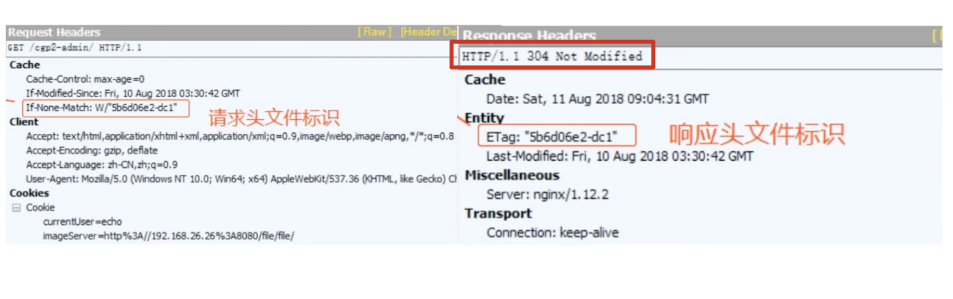

## 1. **聊聊HTTP协议中的编码和解码**

### 1.1. 字符集和编码

我们的疑惑

- 什么是编码？
- 为什么需要编码？
- 什么时候会出现乱码？

#### 1.1.1. 计算机是如何显示文字的？

#### 1.1.2. 常见编码规范介绍

#### 1.1.3. 乱码的由来

- 解码过程
- 编码过程

#### 1.1.4. URL 的编码与解码

- `URL` 是采用 `ASCII` 字符集进行编码的，所以如果 `URL` 中含有非 `ASCII` 字符集中的字符，要对其进行编码
- `URL` 中一些保留字符，如 `&` 表示参数分隔符，如果想要在 `URL` 中使用这些保留字，那就需要编码
- "%编码" 规范
- 对 URL 中属于 ASCII 字符集的非保留字不做编码，对 URL 中的保留字需要取其 ASCII 内码，然后加上 % 前缀将该字符进行编码；对于 URL 中的非 ASCII 字符需要取其 Unicode 内码，然后加上 % 前缀将该字符进行编码

## 2. **HTTP协议之基本认证**

[https://www.huoxiaoqiang.com/experience/httpe/6451.html](https://www.huoxiaoqiang.com/experience/httpe/6451.html)

[https://www.huoxiaoqiang.com/experience/httpe/20249.html](https://www.huoxiaoqiang.com/experience/httpe/20249.html)

### 2.1. HTTP 协议之身份认证

#### 2.1.1. 身份认证信息

- 密码
- 动态令牌
- 数字证书
- 生物认证
- IC 卡等

#### 2.1.2. 常见认证方式

- BASIC 认证（基本认证）
- DIGEST 认证（摘要认证）
- SSL 客户端认证
- FormBase 认证（基于表单认证）

#### 2.1.3. BASIC（基本）认证

##### 2.1.3.1. 什么是 BASIC 认证

- **步骤 1**： 当请求的资源需要 BASIC 认证时，服务器会随状态码 401 Authorization Required，返回带 WWW-Authenticate 首部字段的响应。该字段内包含认证的方式（BASIC） 及 Request-URI 安全域字符串（realm）。
- **步骤 2**： 接收到状态码 401 的客户端为了通过 BASIC 认证，需要将用户 ID 及密码发送给服务器。发送的字符串内容是由用户 ID 和密码构成，两者中间以冒号（:）连接后，再经过 Base64 编码处理。

假设用户 ID 为 guest，密码是 guest，连接起来就会形成 guest:guest 这样的字符串。然后经过 Base64 编码，最后的结果即是Z3Vlc3Q6Z3Vlc3Q=。把这串字符串写入首部字段 Authorization 后，发送请求。  
当用户代理为浏览器时，用户仅需输入用户 ID 和密码即可，之后，浏览器会自动完成到 Base64 编码的转换工作。

- **步骤 3**： 接收到包含首部字段 Authorization 请求的服务器，会对认证信息的正确性进行验证。如验证通过，则返回一条包含 Request-URI资源的响应。

##### 2.1.3.2. 优点：简单

- 简单，被广泛支持

##### 2.1.3.3. 缺点：不安全

1. 用户名和密码明文（Base64）传输，需要配合HTTPS来保证信息传输的安全。
2. 即使密码被强加密，第三方仍可通过加密后的用户名和密码进行重放攻击。
3. 没有提供任何针对代理和中间节点的防护措施。
4. 假冒服务器很容易骗过认证，诱导用户输入用户名和密码

#### 2.1.4. DIGEST（摘要） 认证

##### 2.1.4.1. 什么是 DIGEST 认证

为了弥补 BASIC 认证存在的缺点，从 HTTP/1.1 起就有了 DIGEST 认证

DIGEST 认证同样使用质询/响应的方式，但不会像 BASIC 那样直接发送明文密码

- **步骤 1**： 请求需认证的资源时，服务器会随着状态码 401 Authorization Required，返回带 WWW-Authenticate 首部字段的响应。该字段内包含质问响应方式认证所需的临时质询码（随机数，nonce）。首部字段 WWW-Authenticate 内必须包含 realm 和 nonce 这两个字段的信息。客户端就是依靠向服务器回送这两个值进行认证的。nonce 是一种每次随返回的 401 响应生成的任意随机字符串。该字符串通常推荐由 Base64 编码的十六进制数的组成形式，但实际内容依赖服务器的具体实现。
- **步骤 2**： 接收到 401 状态码的客户端，返回的响应中包含 DIGEST 认证必须的首部字段 Authorization 信息。首部字段 Authorization 内必须包含 username、realm、nonce、uri 和 response 的字段信息。其中，realm 和 nonce 就是之前从服务器接收到的响应中的字段。username 是 realm 限定范围内可进行认证的用户名。uri（digest-uri）即 Request-URI 的值，但考虑到经代理转发后 Request-URI 的值可能被修改，因此事先会复制一份副本保存在 uri 内。response 也可叫做 Request-Digest，存放经过 MD5 运算后的密码字符串，形成响应码。
- **步骤 3**： 接收到包含首部字段 Authorization 请求的服务器，会确认认证信息的正确性。认证通过后则返回包含 Request-URI 资源的响应。并且这时会在首部字段 Authentication-Info 写入一些认证成功的相关信息。

##### 2.1.4.2. 摘要认证的缺陷

- DIGEST 认证提供了高于 BASIC 认证的安全等级，但是和 HTTPS 的客户端认证相比仍旧很弱
- DIGEST 认证提供防止密码被窃听的保护机制，但并不存在防止用户伪装的保护机制
- DIGEST 认证和 BASIC 认证一样，使用上不那么便捷灵活，且仍达不到多数 Web 网站对高度安全等级的追求标准。**因此它的适用范围也有所受限。**

#### 2.1.5. 基于表单（Form-Based）的SSL客户端认证

从使用用户 ID 和密码的认证方式方面来讲，只要二者的内容正确，即可认证是本人的行为。

但如果用户 ID 和密码被盗，就很有可能被第三者冒充。

利用 SSL 客户端认证则可以避免该情况的发生。

##### 2.1.5.1. 什么是 SSL 客户端认证

- SSL 客户端认证是借由 HTTPS 的客户端证书完成认证的方式。
- 凭借 SSL 客户端证书（在 HTTPS 一章已讲解）认证，服务器可确认访问是否来自已登录的客户端。

为达到 SSL 客户端认证的目的，需要事先将客户端证书分发给客户端，且客户端必须安装此证书。

- **步骤 1**： 接收到需要认证资源的请求，服务器会发送 Certificate Request 报文，要求客户端提供客户端证书。
- **步骤 2**： 用户选择将发送的客户端证书后，客户端会把客户端证书信息以 Client Certificate 报文方式发送给服务器。
- **步骤 3**： 服务器验证客户端证书验证通过后方可领取证书内客户端的公开密钥，然后开始 HTTPS 加密通信。

在多数情况下，SSL 客户端认证不会仅依靠证书完成认证，一般会和基于表单认证（稍后讲解）组合形成一种双因素认证（Two-factor authentication）来使用。

所谓双因素认证就是指，认证过程中不仅需要密码这一个因素，还需要申请认证者提供其他持有信息，从而作为另一个因素，与其组合使用的认证方式。

换言之，第一个认证因素的 SSL 客户端证书用来认证客户端计算机，另一个认证因素的密码则用来确定这是用户本人的行为。

通过双因素认证后，就可以确认是用户本人正在使用匹配正确的计算机访问服务器。

#### 2.1.6. 基于表单认证

- 基于表单的认证方法并不是在 HTTP 协议中定义的
- 使用由 Web 应用程序各自实现基于表单的认证方式
- 通过 Cookie 和 Session 的方式来保持用户的状态

- **步骤 1**： 客户端把用户 ID 和密码等登录信息放入报文的实体部分，通常是以 POST 方法把请求发送给服务器。而这时，会使用 HTTPS 通信来进行 HTML 表单画面的显示和用户输入数据的发送。
- **步骤 2**： 服务器会发放用以识别用户的 Session ID。通过验证从客户端发送过来的登录信息进行身份认证，然后把用户的认证状态与 Session ID 绑定后记录在服务器端。向客户端返回响应时，会在首部字段 Set-Cookie 内写入 Session ID（如 PHPSESSID=028a8c…）。你可以把 Session ID 想象成一种用以区分不同用户的等位号。

然而，如果 Session ID 被第三方盗走，对方就可以伪装成你的身份进行恶意操作了。因此必须防止 Session ID 被盗，或被猜出。为了做到这点，Session ID 应使用难以推测的字符串，且服务器端也需要进行有效期的管理，保证其安全性。另外，为减轻跨站脚本攻击（XSS）造成的损失，建议事先在 Cookie内加上 httponly 属性。

- **步骤 3**： 客户端接收到从服务器端发来的 Session ID 后，会将其作为 Cookie 保存在本地。下次向服务器发送请求时，浏览器会自动发送 Cookie，所以 Session ID 也随之发送到服务器。服务器端可通过验证接收到的Session ID 识别用户和其认证状态。

另外，服务器端应如何保存用户提交的密码等登录信息呢？

通常，一种安全的保存方法是，先利用给密码加盐（salt）的方式增加额外信息，再使用散列（hash）函数计算出散列值后保存。

盐（salt） 其实就是由服务器随机生成的一个字符串，但是要保证长度足够长，并且是真正随机生成的。然后把它和密码字符串相连接（前后都可以）生成散列值。

当两个用户使用了同一个密码时，由于随机生成的 salt 值不同，对应的散列值也将是不同的。

这样一来，很大程度上减少了密码特征，攻击者也就很难利用自己手中的密码特征库进行破解。

## 3. HTTP 中的长连接与短连接

[https://www.cnblogs.com/gotodsp/p/6366163.html](https://www.cnblogs.com/gotodsp/p/6366163.html)

- HTTP 协议是基于请求/响应模式的，因此只要服务端给了响应，本次 HTTP 请求就结束了
- HTTP 的长连接和短连接本质上是 TCP 长连接和短连接

### 3.1. 什么是长连接、短连接？

- HTTP 1.0 中，默认使用的是短连接。也就是说，浏览器和服务器每进行一次 HTTP 操作，就建立一次 TCP 链接，结束就中断
- HTTP 1.1 起，默认使用长连接，用以保持连接性，会在响应头加入这行代码：

`Connection: Keep-alive`

在使用长连接的情况下，当一个网页打开完成后，客户端和服务器之间用于传输 HTTP 数据的 TCP 连接不会关闭，客户端再次访问这个服务器时，会继续使用这一条已经建立的连接。

Keep-Alive 不会永久保持连接，它有一个保持时间，可以在不同的服务器软件（如Apache）中设定这个时间

实现长连接需要客户端和服务端都支持长连接

### 3.2. 短连接

建立连接 => 数据传输 => 关闭连接 =>... => 建立连接 => 数据传输 => 关闭连接

#### 3.2.1. 优点

- 管理起来比较简单，存在的连接都是有用的连接，不需要额外的控制手段

#### 3.2.2. 缺点：

- 如果客户请求频繁，将在TCP的建立和关闭操作上浪费较多时间和带宽。

### 3.3. 长连接

建立连接 => 数据传输 => 保持连接 ... => 数据传输 => 关闭连接

#### 3.3.1. 优点

- 长连接可以省去较多的TCP建立和关闭的操作，减少浪费，节约时间。
- 对于频繁请求资源的客户端适合使用长连接。

长连接和短连接的产生在于 client 和 server 采取的关闭策略，具体的应用场景采用具体的策略，**没有十全十美的选择，只有合适的选择。**

#### 3.3.2. 注意：

TCP 的保活功能主要为服务器应用提供。如果客户端已经消失而连接未断开，则会使得服务器上保留一个半开放的连接，而服务器又在等待来自客户端的数据，此时服务器将永远等待客户端的数据。

保活功能就是试图在服务端器端检测到这种半开放的连接

如果一个给定的连接在两小时内没有任何动作，服务器就向客户发送一个探测报文段，根据客户端主机响应探测4个客户端状态：

- 客户主机依然正常运行，且服务器可达。此时客户的 TCP 响应正常，服务器将保活定时器复位。
- 客户主机已经崩溃，并且关闭或者正在重新启动。上述情况下客户端都不能响应TCP。服务端将无法收到客户端对探测的响应。服务器总共发送10个这样的探测，每个间隔75秒。若服务器没有收到任何一个响应，它就认为客户端已经关闭并终止连接。
- 客户端崩溃并已经重新启动。服务器将收到一个对其保活探测的响应，这个响应是一个复位，使得服务器终止这个连接。
- 客户机正常运行，但是服务器不可达。这种情况与第二种状态类似。

### 3.4. 什么时候用长连接、短连接

**长连接**多用于操作频繁，点对点的通讯，而且连接数不能太多情况。每个TCP连接都需要三步握手，这需要时间，如果每个操作都是先连接，再操作的话那么处理速度会降低很多，所以每个操作完后都不断开，次处理时直接发送数据包就OK了，不用建立TCP连接。例如：数据库的连接用长连接， 如果用短连接频繁的通信会造成 socket 错误，而且频繁的 socket 创建也是对资源的浪费。  

而像 WEB网站的 http 服务一般都用**短链接**，因为长连接对于服务端来说会耗费一定的资源，而像 WEB 网站这么频繁的成千上万甚至上亿客户端的连接用短连接会更省一些资源，如果用长连接，而且同时有成千上万的用户，如果每个用户都占用一个连接的话，那可想而知吧。所以并发量大，但每个用户无需频繁操作情况下需用短连好。

## 4. HTTP 中介之代理

### 4.1. 典型的代理服务器

- fiddler、charel

### 4.2. 代理的作用

- 抓包
- FQ：

- 虽然用的最多是 vpn，但是 vpn 和 代理 不一样，对于构建 VPN 来说，隧道技术用来在 IP公网 中仿真条点到点的通路，实现两个节点间（VPN 网关之间，或 VPN 网关与 VPN 远程用户之间）的安全通信，使数据包在公共网络上的专用隧道内传输。 封装是构建隧道的基本手段。从隧道的两端来看，封装就是用来创建、维持和撤销一个隧道，来实现信息的隐蔽和抽象。而如果流经隧道的数据不加密，那么整个隧道就暴露在公共网络中，虚拟专用网络的安全性和私有性就得不到体现。
- 

- 匿名访问

- 经常听新闻，说”某某某“在网络上发布帖子，被跨省追缉了。 假如他使用匿名的代理服务器，就不容易暴露自己的身份了。
- http代理服务器的匿名性是指： HTTP 代理服务器通过删除HTTP报文中的身份特性（比如客户端的IP地址， 或cookie,或URI的会话ID）， 从而对远端服务器隐藏原始用户的IP地址以及其他细节。 同时HTTP代理服务器上也不会记录原始用户访问记录的log(否则也会被查到)。

- 过滤器

- 很多教育机构， 会利用过滤器代理来阻止学生访问成人内容。
- 

### 4.3. HTTP 代理优点点

- 突破自身 IP 访问限制，访问国外站点

- 如：教育网、169网等网络用户可以通过代理访问国外网站。

- 访问呢一些单位或者团体内部资源

- 如某大学FTP(前提是该代理地址在该资源的允许访问范围之内)，使用教育网内地址段免费。
- 代理服务器，就可以用于对教育网开放的各类FTP下载上传，以及各类资料查询共享等服务

- 突破中国电线的 IP 封锁

- 中国电信用户有很多网站是被限制访问的，这种限制是人为的
- 不同Serve对地址的封锁是不同的，所以不能访问时可以换一个国外的代理服务器试试。

- 提高访问速度

- 通常代理服务器都设置一个较大的硬盘缓冲区
- 当有外界的信息通过时，同时也将其保存到缓冲区中
- 当其他用户再访问相同的信息时，则直接由缓冲区中取出信息，传给用户，以提高访问速度。

- 隐藏真实 IP：上网者也可以通过这种方法隐藏自己的IP，免受攻击

## 5. HTTP 中介之网关

### 5.1. 什么是网关

- 网关可以作为某种翻译器来使用，它抽象出了一种能够达到资源的方法。网关是资源和应用程序之间的粘合剂
- 网关扮演的是 “协议转换器” 的角色

### 5.2. Web 网关

Web网关在一侧使用 HTTP 协议，在另一侧使用另一种协议 客户端协议 / 服务器端协议

1. (HTTP/)服务器端网关：通过HTTP协议与客户端对话，通过其他协议与服务器通信
2. (/HTTP)客户端网关：通过其他协议与客户端对话，通过HTTP协议与服务器通信

### 5.3. 常见的网关类型

- （HTTP/*） 服务器端 WEB 网关

- 请求流入原始服务器时，服务器端 Web 网关会将客户端 HTTP 请求转换为其他协议与服务器进行连接，完成获取资源以后，会将对象放在一条http 响应中发送给客户端

- （HTTP/HTTPS）服务器端安全网关

- 一个组织可以通过网关对所有的输入 Web 请求加密，以提供额外的隐私和安全性保护。
- 客户端可以用普通的HTTP浏览 Web 内容，但网关会自动加密对话。

- （HTTPS/HTTP）客户端安全加速器网关

- 将HTTPS/HTTP 网关作为安全加速器使用的情况越来越多了，这些 HTTPS/HTTP 网关位于Web服务器之前，通常作为不可见的拦截网关或反向代理使用。它们接收安全的 HTTPS 流量，对安全流量进行解密，并向 Web服务器发送普通的HTTP请求。
- 这些网关中通常都包含专用的解密硬件，以比原始服务器有效的多的方式来解密安全流量，以减轻原始服务器的负荷。
- 这些网关在网关和原始服务器之间发送的是未加密的流量。所以，要谨慎使用，确保网关和原始服务器之间的网络是安全的。

- 资源网关（最常见的网关，）

- 应用程序服务器，会将目标服务器与网关结合在一个服务器中实现。
- 应用程序服务器是服务器端网关，与客户端通过HTTP进行通信，并与服务器端的应用程序相连。
- 客户端是通过HTTP连接到应用程序服务器的。
- 但应用程序服务器并没有回送文件，而是将请求通过一个网关应用编程接口(Application Programming Interface，API)发送给运行在服务器上的应用程序。

## 6. HTTP 缓存

[https://juejin.cn/post/7134246969232326669#heading-7](https://juejin.cn/post/7134246969232326669#heading-7)

[https://zhuanlan.zhihu.com/p/330166166](https://zhuanlan.zhihu.com/p/330166166)

- 为什么要使用 HTTP 缓存

- 在 HTTP 请求与响应交互过程中是一个相当耗时且占用资源的过程，而 HTTP 缓存可以存储与请求相关联的响应，并将存储的响应复用于后续请求中，当响应可复用时，源服务器不需要处理请求——因为它不需要解析和路由请求、根据 cookie 恢复会话、查询数据库以获取结果或渲染模板引擎。这减少了服务器上的负载。

- 缓存的内容又是什么

- 主要针对 CSS、JS、图片等更新不频繁的静态资源文件

### 6.1. HTTP 缓存头部字段

#### 6.1.1. Cache-Control：请求/响应头，缓存控制字段

- no-store: 所有内容都不缓存
- no-cache: 缓存，但是浏览器使用缓存前，都会请求服务器判断资源是否是最新
- max-age=x(单位秒)请求缓存后的 X 秒不再发起请求
- s-maxage=x(单位秒) 代理服务器请求源站缓存后的 X 秒不再发起请求，只对 CDN 缓存有效
- public 客户端和代理服务器（CDN）都可缓存
- private 只有客户端可以缓存

#### 6.1.2. Expires

响应头，代表资源过期时间，由服务器返回提供，是 HTTP 1.0 的属性，在与 max-age 共存的情况下，优先级要低

#### 6.1.3. Last-Modified

响应头，资源最新更新时间，由服务器告诉浏览器

#### 6.1.4. if-Modified-Since

请求头，资源最新修改时间，由浏览器告诉服务器，和 Last-Modified 是一对，它两会进行对比

#### 6.1.5. Etag

响应头：资源标识，由服务器告诉浏览器

#### 6.1.6. if-None-Match

请求头，缓存资源标识，由浏览器告诉服务器（其实就是上述给的 Etag)，和 Etag 是一对，它两会进行对比

### 6.2. HTTP 缓存工作方式

#### 6.2.1. 使用 Expires

让服务器与浏览器约定一个文件过期时间 Expires

- 约定过期时间
- 但是存在，到了约定的过期时间，文件存在未修改的可能

#### 6.2.2. **Last-Modified/If-Modified-Since**

在`HTTP/1.0`中，我们使用的是`Last-Modified/If-Modified-Since`相配合的方式：

让服务器与浏览器在约定文件时间的基础上，再加一个文件最新修改时间的对比----`Last-Modified` 与 `if-Modified-Since`

- 第一次请求服务器给客户端一个GMT格式的时间（这个时间是就是发送时刻的`Last-Modified`）
- 当需要协商时，客户端向服务器发送这个 GMT 时间，也就是 If-Modified-Since的值
- 服务器将收到的 `If-Modified-Since` 的值和最新的 `Last-Modified` 做比较，若无变化则返回 304，有变化返回 200 和新的 `Last-Modified`

**但是这种方式存在着一些缺点，例如：**

- 负载均衡的服务器，各个服务器生成的 `Last-Modified` 可能有所不同
- GMT 格式有最小单位，例如，如果在一秒内有更改将不能被识别
- 如果只单纯编辑了下文件，并没有更新内容，Last-Modified会被更新，导致缓存失效

#### 6.2.3. **ETag/If-None-Match**

**在HTTP/1.1中，我们对上述问题做了改进，使用的是**`**ETag/If-None-Match**`**相配合的方式：**

Etag是服务器响应请求时，返回当前资源文件的一个唯一标识序列，当资源有变化时，Etag就会重新生成。具体流程和 `Last-Modified/If-Modified-Since` 类似

- 第一次请求服务器给客户端一个`ETag`（这个标识是就是发送时刻的 ETag）
- 当需要协商时，客户端向服务器发送这个 ETag，也就是 `If-None-Match` 的值
- 服务器将收到的 `If-None-Match` 的值和`最新的 ETag` 做比较，若无变化则返回 304，有变化返回 200 和新的 `ETag`

**这种方式的缺点：**

- `ETag` 的生成需要消耗一定时间，效率不及前一种方法

#### 6.2.4. 问题

上述方案存在一个较大的缺陷：如果 `max-age`、或者 `Expries` 不过期期间，文件内容有所改变，那么该怎么通知浏览器进行获取最新的资源呢？

浏览器是没有办法主动感知服务器的资源变化的？？

#### 6.2.5. 缓存改进方案

- `MD5/HASH` 缓存

通过不缓存 Html 文件，为静态资源添加 `MD5` 或者 `HASH` 表示，解决浏览器无法跳过缓存过期时间主动感知文件变化的问题

- `CDN` 缓存

`CDN` 是构建在网络之上的内容分发网络，依靠部署在各地的边缘服务器，通过中心平台的负载均衡、内容分发、调度等功能的模块，使用户就近获取所需内容，降低网络拥塞，提高用户访问响应速度和命中率

#### 6.2.6. CDN 缓存工作方式

- 第一次请求

- 后续请求

#### 6.2.7. 浏览器操作对 HTTP 缓存的影响

|   |   |   |
|---|---|---|
|用户操作|Expires/Cache-Control|Last-Modified/Etag|
|地址栏回车|有效|有效|
|页面链接跳转|有效|有效|
|新开窗口|有效|有效|
|前进、后退|有效|有效|
|F5 刷新|无效|有效|
|Ctrl + F5 刷新|无效|无效|

## 7. HTTP 内容协商机制（数据协商）

### 7.1. 什么是内容协商机制

- **客户端和服务器端就响应的资源内容进行交涉，然后提供给客户端最合适的资源，内容协商会以响应资源的语言、字符集、编码方式等作为判断的基准**

就如一个网站面向英语、法语两种语言的用户，因此理想情况下，该网站就需要向英语用户提供英文版的网站内容、向法语用户提供法文版的网站内容

HTTP 内容协商机制就可以在客户端、服务端之间做这样的决定，使得单一的 URL 就可以代表不同的资源（同一个网站不同语言版本）

### 7.2. 内容协商方式

#### 7.2.1. 客户端驱动

客户端发送请求，服务器返回可选列表，客户端做出选择后发送第二次请求

##### 7.2.1.1. 优点

- 尊重用户真实意愿

##### 7.2.1.2. 缺点

- 需要两次请求，增加了延时

#### 7.2.2. 服务端驱动（现在最常用）

服务器检查客户端的请求头部集并决定提供哪个版本的页面

##### 7.2.2.1. 优点

- 只要一次请求，相对于客户端驱动更快，并且提供了权重机制（q=0.7）服务器端可以近似匹配

##### 7.2.2.2. 缺点

- 客户端、服务端头部集都不匹配时，服务器要进行猜测

##### 7.2.2.3. 客户端-服务器对应的头部集合

|   |   |
|---|---|
|**客户端-请求头**|**服务端-响应头**|
|Accept：告诉服务器发送何种媒体类型|Content-Type|
|Accept-Language：告诉服务器发送何种语言|Content-Language|
|Accept-Charset: 告诉服务器发送何种字符集|Content-Type|
|Accept-Encoding: 告诉服务器采用何种编码|Content-Encoding|

##### 7.2.2.4. 请求头都可以设置权重值来进行近似匹配

如：Accept-Language:en;q=0.5,fr;q=0.0,nl;q=1.0,tr;q=0.0

表示用户最愿意接受nl（荷兰语），其次是en（英语），不接受fr（法语）和tr（土耳其语）

假如服务器端既没有 nl 也没有 en，这时候服务器端就要进行猜测，通常会设置一个默认，都没有的话就返回默认语言

#### 7.2.3. 透明协商

某个中间设备（通常是缓存代理）代表客户端进行协商

##### 7.2.3.1. 优点

- 节省了 Web 服务器的协商

##### 7.2.3.2. 缺点

- 不是 HTTP 标准的协商方式，所以没有响应的规范

## 8. HTTP 断点续传与多线程下载

[https://zhuanlan.zhihu.com/p/268826375](https://zhuanlan.zhihu.com/p/268826375)

[https://blog.csdn.net/weixin_41755556/article/details/120581685](https://blog.csdn.net/weixin_41755556/article/details/120581685)

### 8.1. 断点续传？多线程下载？

HTTP 是通过 Header 里两个参数实现的，客户端发送请求时候对应的是 Range。服务器端响应时对应的是 Content-Range

### 8.2. Range

用于请求头中，指定第一个字节的位置和最后一个字节的位置，一般格式

`Ragne:(unit=first byte pos)-[last byte pos]`

举例子：

Range: bytes=0-499

Range: bytes=500-999

Range: bytes=500

Range: bytes=500-

Range: bytes=500-600,601-999

### 8.3. Content-Range

而在响应完成后，返回的响应头内容也不同

HTTP/1.1 200 OK（不使用断点续传方式）

HTTP/1.1 206 Partial Content（使用断点续传方式）

### 8.4. 完整的断点续传过程

1. 客户端下载一个 1024KB 的文件，已经下载了其中的 512KB
2. 网络突然中断，客户端请求续传，因此需要在 HTTP 头中申明本次需要续传的片段 `Range:bytes=512000-` 这个头通知服务端从文件的 512KB 位置开始传输文件
3. 服务端收到断点续传请求，从文件的 512KB 位置开始传输，并且在 HTTP 头部增加 `Content-Range:bytes 512000-/10124000` 并且此时服务端返回的 HTTP 状态码应该是 206，而不是 200

### 8.5. 多线程下载

多线程的下载步骤其实就类似断点续传，只不过断点续传是被动地增量下载，而多线程下载则是主动地分片下载，同样使用Range的模式

如将一个100M的文件分成100片进行多线程下载：

那么第一个Range范围就是0-1024000

第二个Range范围就是1024001-2048000

…

一直到第一百个Range

## 9. HTTP中的CSP

Content Security Policy ) 内容安全策略

[https://juejin.cn/post/6856676636251652110](https://juejin.cn/post/6856676636251652110)

[https://developer.mozilla.org/zh-CN/docs/web/http/csp](https://developer.mozilla.org/zh-CN/docs/web/http/csp)