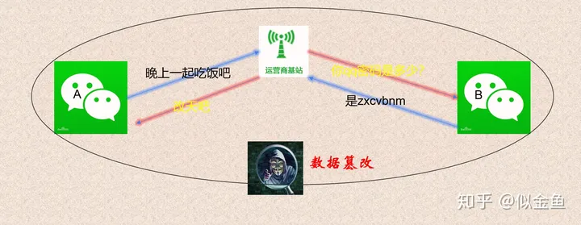
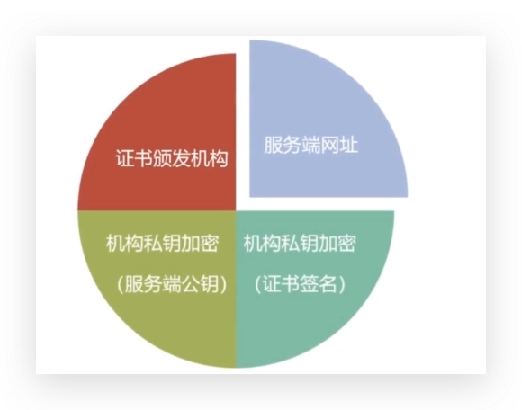
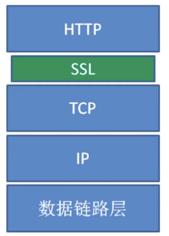
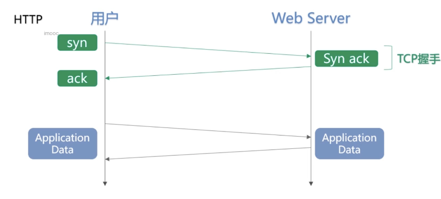
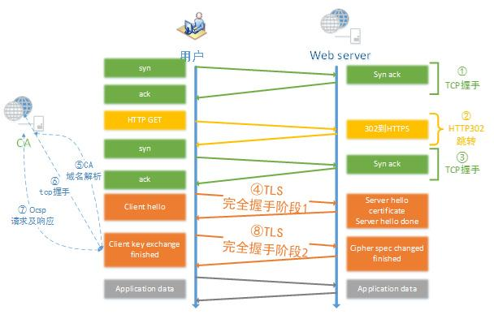

[https://juejin.cn/post/7003478288270098462#heading-0](https://juejin.cn/post/7003478288270098462#heading-0)

[https://zhuanlan.zhihu.com/p/59061649](https://zhuanlan.zhihu.com/p/59061649)

[https://www.cnblogs.com/Yang-Sen/p/11388031.html#:~:text=%E6%B5%81%E7%A8%8B%E5%A6%82%E4%B8%8B%EF%BC%9A%201.%E4%BD%9C%E4%B8%BA%E6%9C%8D%E5%8A%A1%E7%AB%AF%E7%9A%84%E5%B0%8F%E7%BA%A2%EF%BC%8C%E9%A6%96%E5%85%88%E6%8A%8A%E8%87%AA%E5%B7%B1%E7%9A%84%E5%85%AC%E9%92%A5%E5%8F%91%E7%BB%99%E8%AF%81%E4%B9%A6%E9%A2%81%E5%8F%91%E6%9C%BA%E6%9E%84%EF%BC%8C%E5%90%91%E8%AF%81%E4%B9%A6%E9%A2%81%E5%8F%91%E6%9C%BA%E6%9E%84%E7%94%B3%E8%AF%B7%E8%AF%81%E4%B9%A6%E3%80%82,2.%E8%AF%81%E4%B9%A6%E9%A2%81%E5%8F%91%E6%9C%BA%E6%9E%84%E8%87%AA%E5%B7%B1%E4%B9%9F%E6%9C%89%E4%B8%80%E5%AF%B9%E5%85%AC%E9%92%A5%E7%A7%81%E9%92%A5%E3%80%82%20%E6%9C%BA%E6%9E%84%E5%88%A9%E7%94%A8%E8%87%AA%E5%B7%B1%E7%9A%84%E7%A7%81%E9%92%A5%E6%9D%A5%E5%8A%A0%E5%AF%86Key1%EF%BC%8C%E5%B9%B6%E4%B8%94%E9%80%9A%E8%BF%87%E6%9C%8D%E5%8A%A1%E7%AB%AF%E7%BD%91%E5%9D%80%E7%AD%89%E4%BF%A1%E6%81%AF%E7%94%9F%E6%88%90%E4%B8%80%E4%B8%AA%E8%AF%81%E4%B9%A6%E7%AD%BE%E5%90%8D%EF%BC%8C%E8%AF%81%E4%B9%A6%E7%AD%BE%E5%90%8D%E5%90%8C%E6%A0%B7%E7%BB%8F%E8%BF%87%E6%9C%BA%E6%9E%84%E7%9A%84%E7%A7%81%E9%92%A5%E5%8A%A0%E5%AF%86%E3%80%82](https://www.cnblogs.com/Yang-Sen/p/11388031.html#:~:text=%E6%B5%81%E7%A8%8B%E5%A6%82%E4%B8%8B%EF%BC%9A%201.%E4%BD%9C%E4%B8%BA%E6%9C%8D%E5%8A%A1%E7%AB%AF%E7%9A%84%E5%B0%8F%E7%BA%A2%EF%BC%8C%E9%A6%96%E5%85%88%E6%8A%8A%E8%87%AA%E5%B7%B1%E7%9A%84%E5%85%AC%E9%92%A5%E5%8F%91%E7%BB%99%E8%AF%81%E4%B9%A6%E9%A2%81%E5%8F%91%E6%9C%BA%E6%9E%84%EF%BC%8C%E5%90%91%E8%AF%81%E4%B9%A6%E9%A2%81%E5%8F%91%E6%9C%BA%E6%9E%84%E7%94%B3%E8%AF%B7%E8%AF%81%E4%B9%A6%E3%80%82,2.%E8%AF%81%E4%B9%A6%E9%A2%81%E5%8F%91%E6%9C%BA%E6%9E%84%E8%87%AA%E5%B7%B1%E4%B9%9F%E6%9C%89%E4%B8%80%E5%AF%B9%E5%85%AC%E9%92%A5%E7%A7%81%E9%92%A5%E3%80%82%20%E6%9C%BA%E6%9E%84%E5%88%A9%E7%94%A8%E8%87%AA%E5%B7%B1%E7%9A%84%E7%A7%81%E9%92%A5%E6%9D%A5%E5%8A%A0%E5%AF%86Key1%EF%BC%8C%E5%B9%B6%E4%B8%94%E9%80%9A%E8%BF%87%E6%9C%8D%E5%8A%A1%E7%AB%AF%E7%BD%91%E5%9D%80%E7%AD%89%E4%BF%A1%E6%81%AF%E7%94%9F%E6%88%90%E4%B8%80%E4%B8%AA%E8%AF%81%E4%B9%A6%E7%AD%BE%E5%90%8D%EF%BC%8C%E8%AF%81%E4%B9%A6%E7%AD%BE%E5%90%8D%E5%90%8C%E6%A0%B7%E7%BB%8F%E8%BF%87%E6%9C%BA%E6%9E%84%E7%9A%84%E7%A7%81%E9%92%A5%E5%8A%A0%E5%AF%86%E3%80%82)

[https://www.ruanyifeng.com/blog/2011/08/what_is_a_digital_signature.html](https://www.ruanyifeng.com/blog/2011/08/what_is_a_digital_signature.html)

[https://juejin.cn/post/7039339824737681438](https://juejin.cn/post/7039339824737681438)

[https://juejin.cn/post/6995549209348816909#comment](https://juejin.cn/post/6995549209348816909#comment)

## 1. 趣解HTTP与HTTPS

实际上，HTTP 与 HTTPS 可以算是两种不同的网络传输协议，虽然就差一个字母，但是本质却大不相同，千万不能掉以轻心

CIA 三要素

- 机密性：Confidentiality
- 完整性: integrity
- 可用性: Avaliability

### 1.1. HTTP 存在的一些安全问题

HTTP在数据传输过程中，数据就是以明文的方式传输的，由于数据没有被加密，所以很容易出现数据窃听、篡改或者是身份伪造的不安全的行为。

- 窃听风险
- 篡改风险
- 伪装风险

### 1.2. 如何实现传输安全

- **加密--防窃听：**将明文转换为密文，只有期望的接收方有能力将密文解密为明文，即使密文被攻击者窃取也无法理解数据的内容；
- **验证完整性--防止篡改：**对原始数据计算摘要，并将数据和摘要一起交付给通信对方。接收方收到后也对数据计算摘要，并比较是否和接受的摘要一致，借此判断接收的数据是否被篡改。不过，因为收到的摘要也可能被篡改，所以需要使用更安全的手段：数字签名；
- **认证数据来源--防止伪装：**数字签名能够验证数据完整性，同时也能认证数据来源，防止伪装。

### 1.3. 加密

#### 1.3.1. 对称加密

对明文使用同一把密钥进行加密和解密

##### 1.3.1.1. 优点

- 数据高吞吐量，便于软硬件实现：一些硬件实现达到了每秒加密几百兆字节，软件实现的吞吐量也达到了兆字节每秒的量级。
- 密钥相对较短
- 可作为要素构造各种密码机制：如：伪随机数生成器，杂凑函数，快速数字签名方案。
- 可合成强密码：简单变换容易被分析，但研究其弱点后，可用来构造乘积密码。
- 历史较久远

##### 1.3.1.2. 缺点

- 通信双方的密钥均需要保密
- 大型网络中需要管理许多密钥对。其结果是，有效的密钥管理者需要有一个无条件可信的TTP(在所有事情上都是可信的，它可以访问用户的私钥，还承担着公钥与标识符的联系)，该TTP需要实时使用。
- 密钥需要时常更换，甚至每次会话都需要更换。
- 源自对称密钥加密的数字签名机制通常需要关于公开验证函数的大密钥，或通信协议

##### 1.3.1.3. 举例子

- A、B 进行聊天
- A、B 约定用 密钥 KEY 进行加密通讯
- 但是过了一段时间，发现 A、B 的聊天都被 C 进行了拦截，并且 C 通过一定的手段拦截到了（或者破解）加密的密钥，并对信息进行了解密处理。
- 那不就尴尬了，对于 C 来说还是明文传输，那么该怎么办呢？
- 可以试试非对称加密

#### 1.3.2. 非对称加密

非对称加密，即：原文加密和密文加密使用的是两个不同的密钥，一把称之为公钥，一把称之为私钥，使用公钥加密的内容可以通过私钥进行解密，同样，使用私钥加密的内容使用公钥可以进行解密。

公钥和私钥是相对而言的，通常而言，保留在己方不对外泄露称之为私钥，可公布公开的称之为公钥。

##### 1.3.2.1. 举例子

- A 产生一对非对称加密的私钥 P_A 和公钥 Key_A，然后把公钥 Key_A 发送给 B
- B 把准备进行对称加密的 KEY_COMMON ，用公钥 Key_A 加密后传送给 A
- A 接收到后，用自己的私钥 P_A进行解密，得到 KEY_COMMON
- 然后双方各自都有一个约定的公钥加密 KEY_COMMON，就可以愉快的进行聊天了
- 但是没有过太久
- 中间人 C 拦截到了第一次 A 传送给 B 的公钥 KEY_A，同时他自己产生了一对私钥 P_C 和 公钥 KEY_C
- 中间人 C 把自己的公钥 KEY_C 传送给了 B
- B 接收到了公钥 KEY_C, 它以为是 A 传递的，其实是中间人 C 篡改后的结果；B 用它对后续要加密的对称密钥 KEY_COMMON 进行加密，发送出去
- 中间人 C 拦截后，用自己的私钥 P_C 解密，得到了这个后续要进行对称加密的密钥 KEY_COMMON，并且用之前拦截第一步得到的A 的公钥 KEY_A, 对其进行加密，发送给 A
- A 得到数据后，用自己的私钥 P_A 进行解密，发现可以解密，并得到了对称加密密钥 KEY_COMMON，它不知道这已经是被中间人拦截返回的，只当是 B 发送过来的，所以就像往常一样使用这个对称加密串 KEY_COMMON 进行加密传输
- 中间人 C 得到数据后加密，得到原文后，并把原来的加密后的信息又发送给 B
- 这期间 A、B 觉得是正常加密传输，但是实际上传输的信息已经暴露在中间人 C 这里了

### 1.4. 中间人攻击

上面的中间人 C 的拦截处理过程，其实就可以理解为中间人攻击，那么该怎么避免呢？

### 1.5. CA 证书机构

HTTPS 加密的过程

1. 客户端发送 Client Hello 开始通信，同时发送过去 SSL 版本、它支持的加密组件列表，还会生成一个随机数，后面要用，姑且记作随机数 A。
2. 服务端回应一个 Server Hello，同时把它会从客户端的加密组件列表中选择一个，发送回去，当然了 SSL 版本也要发回去。并且也和上一步一样，给客户端返回一个随机数，记作随机数 B。
3. 服务端发送证书，这个证书就是权威机构给颁布的，里面有服务端的公钥。后续，等客户端收到，验证无误后，要用这个公钥把后续的对称加密的密钥发过来。

这里是怎么验证证书的合法性呢？这里就用到私钥加密&公钥解密了。权威机构在颁布证书的时候，会对它的证书做摘要，生成指纹，再使用它的私钥对这段指纹进行加密，生成一个数字签名。当接收方收到证书后，先用证书指定的算法对证书做摘要，然后再用公钥对数字签名解密，如果和摘要的结果一致就证明是可信的。

4. 服务端发送 Server Hello Done 报文，好了，第一阶段就结束了。
5. 当客户端收到证书后，验证的方法就是从本机的证书中找，大多数浏览器和操作系统内都内置了一些备受信赖的权威机构的证书。接下来客户端进行验证，验证确实是可信的，好了，就使用上一步服务端发来证书里的公钥去加密自己生成的一个随机数 Pre-master 。这个阶段也叫发送 Client Key Exchange 报文。
6. 接着，还是客户端发送 Change Cipher Spec 报文。这个是用来提示服务端使用 Pre-master Secret 密钥加密的。那这个 Pre-master Secret 是什么呢？在第 1、2 步中，客户端、服务端各自生成了一个随机数，并发送给了对方。同时双方也都有随机数 Pre-master。对称密钥就是随机数 A 、随机数 B、Pre-master 三者生成的。也就是后续加密过程中使用的对称密钥。
7. 客户端发送 Finished 报文。该报文包含一个整体校验值，用于判断完整性。
8. 服务端发送 Change Cipher Spec 报文，告诉客户端可以使用那个对称密钥
9. 服务端发送 Finished 报文。
10. 服务端、客户端的 Finished 报文交换完毕，SSH 的连接就建立完成了，后续就是发送 HTTP 请求了...

上面是 TLS 1.2 的实现，看数目就知道交换次数太多了，于是在 TLS 1.3 做了优化。

1. 协议规定好仅仅支持几种加密套件，客户端支持的加密套件变得比较少，在发送时，会生成这几种加密方式所有的公钥、私钥。并把所有的公钥发给服务端
2. 服务端选择一种，然后把相应的公钥发给客户端
3. 客户端根据服务端发来的公钥加自己的私钥生成对称加密的密钥
4. 服务端也做第三步这样的事情。值得注意的是，3、4 生成的密钥是一样的。
5. 这样就能交换信息了 ~

## 2. **HTTPS 协议概述**

- HTTPS 可以认为是 HTTP + TLS
- TLS 是传输层加密协议，它的前身是 SSL 协议

### 2.1. TLS/SSL

### 2.2. HTTP 内容介绍

- 内容加密
- 身份认证
- 数据完整性

## 3. HTTPS 使用成本

- 证书费用以及更新维护
- HTTPS 降低用户访问速度，当然如果使用的好，也不会
- 消耗 CPU 资源，需要增加大量机器

## 4. HTTPS 对性能的影响

[https://zhuanlan.zhihu.com/p/65394830](https://zhuanlan.zhihu.com/p/65394830)

- 协议交互所增加的网络 RTT （Round-Trip Time）

- 在计算机网络中它是一个重要的性能指标，表示从发送端发送数据开始，到发送端收到接收端的确认（接收端收到数据后便立即发送确认），总共经历的时延
- 往返时延（RTT）由三部分决定：即链路的传播时间、末端系统的处理时间以及路由器的缓存中的排队和处理时间。其中，前面两个部分的值作为一个 TCP 链接相对固定，路由器的缓存中的排队和处理时间会随着整个网络拥塞程度的变化而变化。
- 所以RTT 的变化在一定程度上反应了网络拥塞程度的变化

- 加解密相关的计算耗时

### 4.1. 网络耗时

由于 HTTP 和 HTTPS 都需要 DNS 解析，并且大部分情况下使用了 DNS 缓存，为了突出对比效果，忽略主域名的 DNS 解析时间。

#### 4.1.1. HTTP

上图可见，用户只需要完成 TCP 三次握手建立 TCP 链接就能够直接发送 HTTP 请求获得相应的数据，此外在整个访问过程中也没有需要消耗计算资源的地方

#### 4.1.2. HTTPS

HTTPS 相对就比较复杂很多，在部分场景下，使用 HTTPS 访问有可能增加 7 个 RTT。

解释如下

1. 三次握手建立 TCP 链接，需要一个 RTT
2. 使用 HTTP 发起 GET 请求，服务端返回 302 跳转到 baidu.com, 需要一个 RTT 已经 302 跳转延时

3. 大部分情况下用户不会手动输入 https:baidu.com 来访问 HTTPS, 服务端只能返回 302 强制浏览器跳转到 302
4. 浏览器处理 302 跳转也需要耗时

5. 三次握手重新建立 TCP 链接，耗时一个 RTT

6. 302 跳转到 HTTPS 服务器之后，由于端口和服务器不同，需要重新建立三次握手，建立 TCP 链接

7. TLS 完全握手阶段，耗时至少一个 RTT

8. 这个阶段主要是完成加密套件的协商和证书的身份认证
9. 服务端和浏览器会协商相同的密钥交换算法、对称加密算法、内容一致性校验算法、证书签名算法、椭圆曲线（非 ECC 算法不需要）等
10. 浏览器获得证书后需要校验证书的有效性，比如是否过期，是否撤销

11. 解析 CA 的站点的 DNS，耗时一个 RTT

12. 浏览器获得证书后，有可能要发起 OCSP 或者 CRL 请求，查询证书状态
13. 浏览器首先获取证书里的 CA 域名
14. 如果没有命中缓存，浏览器需要解析 CA 的 DNS

15. 三次握手建立 CA 站点的 TCP 链接，耗时一个 RTT

16. DNS 解析到 IP 后，需要完成三次握手建立 TCP 链接

17. 发起 OCSP 请求，获取响应。耗时一个 RTT
18. 完全握手阶段二，耗时一个 RTT 以及计算时间

19. 完全握手阶段二主要是密钥协商

20. 完全握手后，浏览器和服务器之间进行应用层(也就是 HTTP) 数据传输

注意：

当然不是每个请求都需要增加 7个 RTT 才能完成 HTTPS 首次交互，大概只有不到 0.01% 的请求才有可能需要经历上述步骤， 它们需要满足如下条件

1. 必须是首次请求，即建立 TCP 链接后发起的第一个请求，该连接上的后续请求都不需要发生上述行为
2. 必须要完全握手，而正常情况下 80% 的请求能实现简化握手
3. 浏览器需要开启 OCSP 或者 CRL 功能。Chrome 默认关闭了 OCSP 功能，firefox 和 IE 都默认开启
4. 浏览器没有命中 OCSP 缓存。OCSP 一般的更新周期是 7天，firefox 的查询周期也是 7天，也就是说 7天中才会发生一次 ocsp 的查询
5. 浏览器没有命中 CA 站点的 DNS 缓存。只有没有命中 DNS 缓存的情况下才会接下 CA 的 DNS

### 4.2. 计算耗时

上节还只是简单描述了 HTTPS 关键路径上必须消耗的纯网络耗时，没有包括非常消耗 CPU 资源的计算耗时，事实上计算耗时也不小（30ms 以上），从浏览器和服务器的角度分别介绍一下：

#### 4.2.1. 浏览器计算耗时

1. RSA 证书签名校验，浏览器需要解密签名，计算证书哈希值。如果有多个证书链，浏览器需要校验多个证书。
2. RSA 密钥交换时，需要使用证书公钥加密 premaster。耗时比较小，但如果手机性能比较差，可能也需要 1ms 的时间。
3. ECC 密钥交换时，需要计算椭圆曲线的公私钥。
4. ECC 密钥交换时，需要使用证书公钥解密获取服务端发过来的 ECC 公钥。
5. ECC 密钥交换时，需要根据服务端公钥计算 master key。
6. 应用层数据对称加解密。
7. 应用层数据一致性校验。

#### 4.2.2. 服务端计算耗时

1. RSA 密钥交换时需要使用证书私钥解密 premaster。这个过程非常消耗性能。
2. ECC 密钥交换时，需要计算椭圆曲线的公私钥。
3. ECC 密钥交换时，需要使用证书私钥加密 ECC 的公钥。
4. ECC 密钥交换时，需要根据浏览器公钥计算共享的 master key
5. 应用层数据对称加解密。
6. 应用层数据一致性校验。

由于客户端的 CPU 和操作系统种类比较多，所以计算耗时不能一概而论。手机端的 HTTPS 计算会比较消耗性能，单纯计算增加的延迟至少在 50ms 以上。PC 端也会增加至少 10ms 以上的计算延迟。

服务器的性能一般比较强，但由于 RSA 证书私钥长度远大于客户端，所以服务端的计算延迟也会在 5ms 以上。

## 5. HTTPS 常见问题

- HTTPS 加密 是不是需要我在电脑上安装证书/保存密码？？
- https 是不是在 HTTP 后面加个s, 很难吗
- Https 解决了所有劫持问题吗？