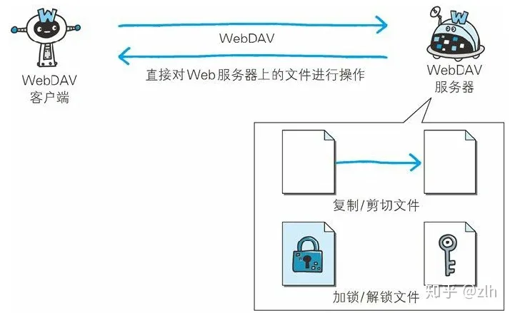
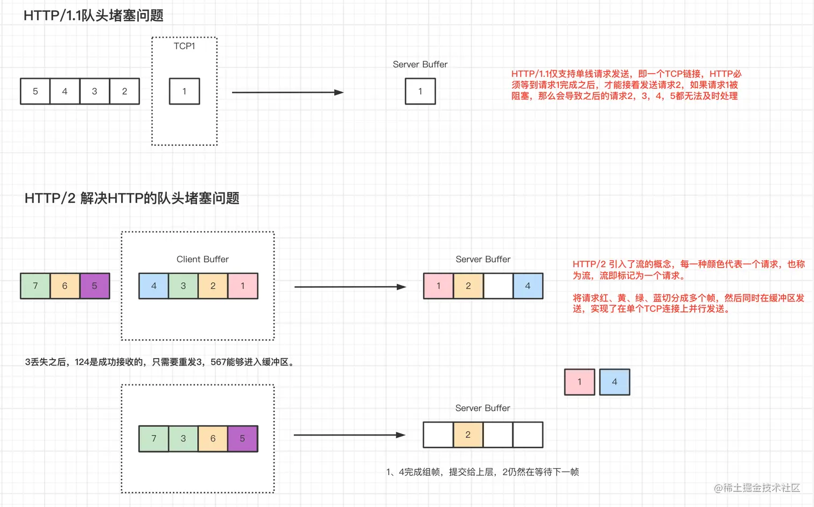
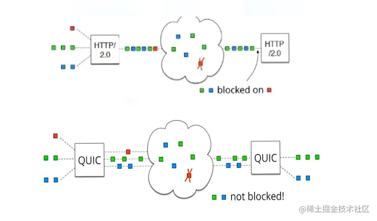

## 1. HTTP 协议的瓶颈

### 1.1. 影响 HTTP 网络请求的因素

#### 1.1.1. 带宽

#### 1.1.2. 延迟

- 浏览器的阻塞

### 1.2. HTTP 协议的瓶颈

- 一条链接上只能发送一个请求
- 请求只能从客户端开始，客户端不可以接收出响应以外的指令
- 请求、响应首部未经压缩就发送。首部信息越多延迟越大
- 发送冗长的首部。每次互相发送相同的首部造成的浪费较多
- 可以任意选择数据压缩格式。非强制压缩发送

## 2. 双工通信的 WebSocket

基于 HTTP 基础上的协议

为了实现 WebSocket 通信，在 HTTP 连接建立之后，需要完成一次“握手”（Handshaking）的步骤。

### 2.1. 握手请求

为了实现 WebSocket 通信，需要用到 HTTP 的 Upgrade 首部字段，告知服务器通信协议发生改变，以达到握手的目的。

```
GET /chat HTTP/1.1
Host: server.example.com
Upgrade: websocket
Connection: Upgrade
Sec-WebSocket-Key: dGhlIHNhbXBsZSBub25jZQ==
Origin: Example Domain
Sec-WebSocket-Protocol: chat, superchat
Sec-WebSocket-Version: 13
```

`Sec-WebSocket-Key` 字段内记录着握手过程中必不可少的键值。

`Sec-WebSocket-Protocol` 字段内记录使用的子协议。

子协议按 WebSocket 协议标准在连接分开使用时，定义那些连接的名称。

### 2.2. **握手 响应**

对于之前的请求，返回状态码 101 Switching Protocols 的响应。

```
HTTP/1.1 101 Switching Protocols
Upgrade: websocket
Connection: Upgrade
Sec-WebSocket-Accept: s3pPLMBiTxaQ9kYGzzhZRbK+xOo=
Sec-WebSocket-Protocol: chat
```

`Sec-WebSocket-Accept` 的字段值是由握手请求中的 `Sec-WebSocket-Key` 的字段值生成的

成功握手确立 `WebSocket` 连接之后，通信时不再使用 `HTTP` 的数据帧，而采用 `WebSocket` 独立的数据帧

### 2.3. WebSocket API

JavaScript 可调用“The WebSocket API”（[http://www.w3.org/TR/websockets/，由](http://www.w3.org/TR/websockets/%EF%BC%8C%E7%94%B1) W3C 标准制定）内提供的 WebSocket 程序接口，以实现 WebSocket 协议下全双工通信。

以下为调用 WebSocket API，每 50ms 发送一次数据的实例。

```
var socket = new WebSocket('ws://game.example.com:12010/updates');
socket.onopen = function () {
  setInterval(function() {
    if (socket.bufferedAmount == 0)
      socket.send(getUpdateData());
  }, 50);
};
```

### 2.4. WebSocket 的特点

#### 2.4.1. 推送功能

支持由服务器向客户端推送数据的推送功能。这样，服务器可直接发送数据，而不必等待客户端的请求

#### 2.4.2. 减少通信量

只要建立起 WebSocket 连接，就希望移植保持连接状态，和 HTTP 相比，不但每次连接时的总开销减少，而且由于 WebSocket 的首部信息很少，通信量也相应减少，为了实现 WebSocket 通信，在HTTP连接建立之后，需要完成一次“握手”的步骤

## 3. 探索式的实践-SPDY

Google在 2010 年发布了SPDY，其开发目标旨在解决HTTP的性能瓶颈，缩短Web页面的加载时（50%）

### 3.1. SPDY 的改进

#### 3.1.1. **多路复用流**

通过单一的TCP连接，可以无限制处理多个HTTP请求。所有请求的处理都在一条TCP连接上完成，因此TCP的处理效率得到提高

#### 3.1.2. **赋予请求优先级**

SPDY不仅可以无限制地并发处理请求，还可以给请求逐个分配优先级顺序，这样主要是为了在发送多个请求时，解决因带宽低而导致响应变慢的问题。

#### 3.1.3. **压缩HTTP首部**

压缩 HTTP 请求和响应的首部。这样一来，通信产生的数据包数量和发送的字节数就更少了。

#### 3.1.4. **推送功能**

支持服务器主动向客户端推送数据的功能。这样，服务器可直接发送数据，而不必等待客户端的请求。

#### 3.1.5. **服务器提示功能**

服务器可以主动提示客户端请求所需的资源。由于在客户端发现资源之前就可以获知资源的存在，因此在资源已缓存等情况下，可以避免发送不必要的请求。

### 3.2. **SPDY消除Web瓶颈了吗？**

希望使用 SPDY 时，Web的内容端不必做什么特别改动，而Web浏览器及Web服务器都要为对应SPDY做出一定程度上的改动。把该技术导入实际的Web网站却进展不佳，

因为SPDY基本上只能将单个域名的通信多路复用，所以当一个Web网站上使用多个域名下的资源，改善效果就会受到限制。

SPDY的确是一种可有效消除HTTP瓶颈的技术，但很多Web网站存在的问题并非仅仅由HTTP瓶颈所导致。对Web本身的速度提升，还应该从其他可细致钻研的地方入手，比如改善Web内容的编写方式等。

## 4. 期待已久的 HTTP/2.0

### 4.1. HTTP2.0 性能增强的核心：二进制分帧

HTTP2.0中所有加强性能的核心是二进制传输，在HTTP1.x中，我们是通过文本的方式传输数据。

基于文本的方式传输数据存在很多缺陷，文本的表现形式有多样性，因此要做

到健壮性考虑的场景必然有很多，但是二进制不同，只有0和1的组合，因此选择了二进制传输，实现方便且健壮。为了保证HTTP不受影响，那就需要在应用层（HTTP2.0）和传输层（TCP/UDP）之间增加一个二进制分帧层。

在二进制分帧层上，HTTP2.0会将所有传输的信息分为更小的消息和帧，并赐啊用二进制分帧层。

在二进制分帧层上，HTTP2.0会将所有传输的信息分为更小的消息和帧，并采用二进制格式编码，其中HTTP1.x的首部信息会被封装到Headers帧，而Request Body则封装到Data帧。

### 4.2. HTTP2.0: **Header压缩**

HTTP2.0中使用HPACK压缩格式对传输的header进行编码，减少了header的大小。

并在两端维护了索引表，用于记录出现过的header，后面在传输的过程中就可以传输已经记录过的header的键名，对端收到数据后就可以通过键名找到相应的值

### 4.3. **多路复用：**

HTTP2.0中，有两个概念非常重要：帧（frame）和流（stream），帧是最小的数据单位，每个帧会标识出属于哪个流，流是多个帧组成的数据流。

所谓多路复用，即在一个TCP连接中存在多个流，即可以发送多个请求，对端可以通过帧中的表示知道该帧属于哪个请求。

在客户端，**这些帧乱序发送**，到对端后在根据每个帧的首部的流标识符重新组装。通过该技术，可以避免HTTP旧版本的队头阻塞问题，极大提高传输性能。

### 4.4. **推送**

在HTTP2.0中，服务端可以在客户端某个请求后，主动推送其他资源

### 4.5. 安全

HTTP2.0中，使用了tls的拓展ALPN做为协议升级，除此之外，HTTP2.0对 tls 的安全性做了进一步的加强，通过黑名单机制禁用了几百种不再安全的加密算法。

## 5. Web服务器管理文件的WebDAV

WebDAV（Web-based Distributed Authoring and Versioning，基于万维网的分布式创作和版本控制）是一个可对Web服务器上的内容直接进行文件复制、编辑等操作的分布式文件系统。

除了创建、删除，还具备文件创建者管理、文件编辑过程中禁止其他用户内容覆盖的加锁功能，以及对文件内容修改的版本控制功能。



### 5.1. WebDAV 内新增的方法及状态码

WebDAV 为实现远程文件管理，向 HTTP/1.1 中追加了以下这些方法。

- PROPFIND ：获取属性
- PROPPATCH ：修改属性
- MKCOL ：创建集合
- COPY ：复制资源及属性
- MOVE ：移动资源
- LOCK ：资源加锁
- UNLOCK ：资源解锁

为配合扩展的方法，状态码也随之扩展。

- 102 Processing ：可正常处理请求，但目前是处理中状态
- 207 Multi-Status ：存在多种状态
- 422 Unprocessible Entity ：格式正确，内容有误
- 423 Locked ：资源已被加锁
- 424 Failed Dependency ：处理与某请求关联的请求失败，因此不再维持依赖关系
- 507 Insufficient Storage ：保存空间不足

## 6. HTTP 的大跃进-QUIC 与 HTTP3.0

[https://zhuanlan.zhihu.com/p/151639428](https://zhuanlan.zhihu.com/p/151639428)

### 6.1. HTTP协议所作的工作和主要问题

HTTP协议做了大量的工作，试图提高基于TCP/IP协议栈的网路效率，包括但不限于：

1. HTTP/1.1 中的**管道化**，在一个TCP连接的基础上支持多个对象的请求和响应；支持缓存(头部的if-modify-since)。
2. HTTP/2中的**多路复用**，引入流的概念，流就相当于请求/响应，HTTP2的内部采用一个流ID来标识一个请求，它采用分流技术，解决了HTTP本身的队头阻塞问题，但是TCP层面的队头阻塞问题仍然存在。
3. HTTP/2采用二进制编码替代ASCII编码，节省编解码的时间；采用服务器推送技术，主动推送客户端可能需要的资源。

但是无论怎么修改，只要基于TCP协议，那么就会有如下的问题：

1. **TCP协议本身实现可靠传输的工作效率低下（基于确认）**
2. **建立链接成本高**：基础三次握手需要消耗1个RTT，而后续的TLS加密协议需要消耗2个RTT，即广泛使用的HTTPs建立连接需要3个RTT才能完成建立数据传输链路；传输还需要经过慢开始等等阶段才能到达满速。
3. **存在队头堵塞问题**
4. **内核态，协议细节无法做到热插拔的设计**
5. **TCP四元组带来的IP地址变动链接恢复问题（重新建立连接，重新握手等等）**



### 6.2. QUIC 的 特性

- **Quic支持快速握手**，如果搭配TLS1.3协议，在之前建立过连接的情况下，只需要0个RTT即可开始发送数据。（HTTP/2需要3个RTT）



- Quic仍然采用流的概念来管理请求，但是**它不会存在TCP头端阻塞的问题**，因为本身不存在请求队列这一结构，也不会存在有序的流执行的顺序，自然也不会阻塞
- **高效的差错恢复/无状态重试**，以及可插拔的拥塞控制机制
- **可支持连接迁移技术**
- **基于用户态实现，不需要更新操作系统即可更新Quic相关的内容**。

### 6.3. HTTP3

HTTP3 的实现思路是：HTTP2 Slimmed + Quic协议。