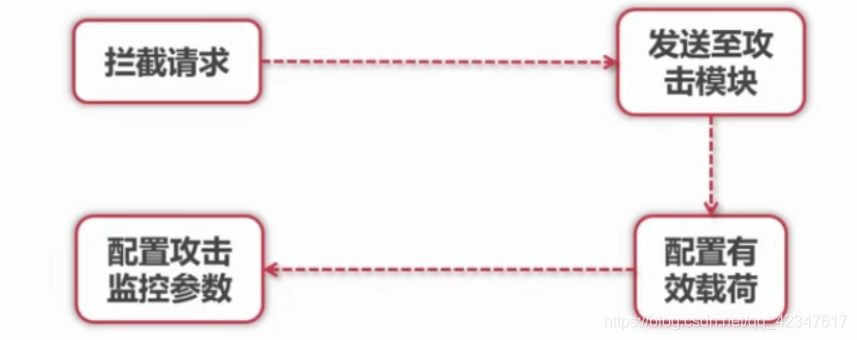

## 1. Web 安全攻击概述

### 1.1. Web 应用的概念

- Web 应用是动态脚本、编译过的代码等组合而成
- 它通常架设在 Web 服务器上，用户在 Web 浏览器上发送请求
- 这些请求使用 HTTP 协议，由 Web 应用和企业后台的数据库以及其他动态内容通信

### 1.2. Web 应用三层架构

- 典型的Web 应用通常是标准的三层架构模型


数据层：DOC层  
业务逻辑层：Server层

**安全问题一般在：Web层和业务逻辑层之间 (Web层发起HTTP请求)**

- 应用  
    验证码：防止机器人  
    长时间操作，session失效：放弃他人盗用

### 1.3. 日常生活中的”安全“

- 为什么我们登录的时候需要输入一个”验证码“？
- 在一个网站上，长时间没有操作，session 为什么会失效？

### 1.4. WASC 将 Web 应用安全危险分为六大类

Web Application Secutity Consority

1. Authentication(验证)：用来确认用户，服务或是应用身份的攻击手段
2. Authorization(授权)：用来决定是否某用户、服务或是应用具有执行请求动作必要权限的攻击手段
3. Client-Side Attack(客户端攻击)：用来扰乱或是探测Web站点用户的攻击手段 eg. 绕过
4. Command Execution(命令执行)：在Web站点上执行远程命令的攻击手段
5. Information Disclosure(信息泄露)：用来获取Web站点具体系统信息的攻击手段
6. Logical Attack(逻辑性攻击）：用来扰乱或是探测Web应用逻辑流程的攻击手段

### 1.5. OWASP 漏洞分类

[https://zhuanlan.zhihu.com/p/393635352](https://zhuanlan.zhihu.com/p/393635352)

#### 1.5.1. 注入Injection

将不受信任的数据作为命令或查询的一部分发送到解析器时，会产生诸如SQL注入、NoSQL注入、OS注入和LDAP注入的注入缺陷。

#### 1.5.2. **失效的身份认证**

通常，通过错误使用应用程序的身份认证和会话管理功能，攻击者能够破译密码、密钥或会话令牌，或者利用其它开发缺陷来暂时性或永久性冒充其他用户的身份

#### 1.5.3. **敏感数据泄露**

许多Web应用程序和API都无法正确保护敏感数据，例如：财务数据、医疗数据和PII数据。攻击者可以通过窃取或修改未加密的数据来实施信用卡诈骗、身份盗窃或其他犯罪行为。

未加密的敏感数据容易受到破坏，因此，我们需要对敏感数据加密，这些数据包括：传输过程中的数据、存储的数据以及浏览器的交互数据。

#### 1.5.4. **XML外部实体(XXE)**

XXE 全称为XML External Entity attack 即XML(可扩展标记语言) 外部实体注入攻击，

许多较早的或配置错误的XML处理器评估了XML文件中的外部实体引用。攻击者可以利用外部实体窃取使用URI文件处理器的内部文件和共享文件、监听内部扫描端口、执行远程代码和实施拒绝服务攻击。

#### 1.5.5. 失效的访问控制

未对通过身份验证的用户实施恰当的访问控制。攻击者可以利用这些缺陷访问未经授权的功能或数据，例如：访问其他用户的帐户、查看敏感文件、修改其他用户的数据、更改访问权限等。

#### 1.5.6. 安全配置错误

安全配置错误是最常见的安全问题，这通常是由于不安全的默认配置、不完整的临时配置、开源云存储、错误的HTTP 标头配置以及包含敏感信息的详细错误信息所造成的。因此，我们不仅需要对所有的操作系统、框架、库和应用程序进行安全配置，而且必须及时修补和升级它们。

#### 1.5.7. **跨站脚本（xss）**

xss攻击全称为跨站脚本攻击,

当应用程序的新网页中包含不受信任的、未经恰当验证或转义的数据时，或者使用可以创建HTML或JavaScript 的浏览器API 更新现有的网页时，就会出现XSS 缺陷。XSS 让攻击者能够在受害者的浏览器中执行脚本，并劫持用户会话、破坏网站或将用户重定向到恶意站点。

#### 1.5.8. **不安全的反序列化**

不安全的反序列化会导致远程代码执行。即使反序列化缺陷不会导致远程代码执行，攻击者也可以利用它们来执行攻击，包括：重播攻击、注入攻击和特权升级攻击。

#### 1.5.9. **使用含有已知漏洞的组件**

组件（例如：库、框架和其他软件模块）拥有和应用程序相同的权限。如果应用程序中含有已知漏洞的组件被攻击者利用，可能会造成严重的数据丢失或服务器接管。同时，使用含有已知漏洞的组件的应用程序和API可能会破坏应用程序防御、造成各种攻击并产生严重影响。

#### 1.5.10. **不足的日志记录和监控**

这个和等保有一定的关系，不作介绍

不足的日志记录和监控，以及事件响应缺失或无效的集成，使攻击者能够进一步攻击系统、保持持续性或转向更多系统，以及篡改、提取或销毁数据。大多数缺陷研究显示，缺陷被检测出的时间超过200天，且通常通过外部检测方检测，而不是通过内部流程或监控检测。

## 2. 验证机制安全

### 2.1. 验证机制概述

Web应用程序最简单的一种安全机制。防御恶意攻击的核心机制，也是最外层机制（入口的三层：验证机制 -> 会话管理（cookie， session） -> 访问控制（权限））

1. 验证机制是 Web 应用程序中最简单的一种安全机制

2. 一般来说，应用程序必须核实用户提交的用户名和密码是否正确。正确则允许登录，否则则禁止登录

3. 验证机制是应用程序防御恶意攻击的**核心机制**

4. 它处在安全防御的最前沿，如果被用户轻易突破，通常应用程序的全部功能、数据都会被其控制
5. 缺乏安全有效的验证机制，其他核心安全机制都无法实施（会话管理和访问控制）

### 2.2. 典型的身份验证模式


### 2.3. 验证技术

1. 基于 HTML 表单验证
2. 多元机制，如组合型密码
3. 客户端 SSL 证书，如建行网盾 U 盘

#### 2.3.1. HTML 表单验证

##### 2.3.1.1. 弱密码

许多 Web 应用程序没有或者很少对用户密码强度进行控制

- 非常短或者空白密码
- 以常用字典词汇为密码（如 password、123456）
- 密码与用户名完全相同
- 长时间使用默认密码

#### 2.3.2. 暴力破解

- 登录功能的公开性会诱使攻击者试图猜测用户名和密码，从而获得访问应用程序的权力
- 如果应用程序允许攻击者用不同的密码暴力尝试，直到他找到正确的密码，这个程序就非常容易遭受攻击

举例：安全渗透工具：Burp Suite（执行暴力攻击)



#### 2.3.3. 暴力破解-安全措施

##### 2.3.3.1. 验证码技术

- 最常见和有效的应对方式，需要注意以下几个问题

- 验证码是否真实有效
- 验证码复杂度（OCR 识别工具 => 模糊图片，防止识别）
- 打码服务器 => 分发给客户端打验证码 => 点击型、滑动型、问答型

##### 2.3.3.2. Cookie 和 会话检测

- 有些应用程序会设置一个 Cookie, 如 failedlogin = 0，登录失败尝试，递增该值，达到某个上限，检测到这个值并拒绝再次处理登录

有用吗：**没用，**cookie在客户端，截取后将failedlogin修改，使其无法达到上限

#### 2.3.4. 双因子认证

- 双因子认证的核心是综合 What you know(个人密码)和 What you have（手机）来达到双重认证效果
- 目前很多电商、银行都才用了该认证方式

用户名，密码 + 验证码

登陆密码 + 交易密码

### 2.4. 谁忘记了你的密码

- 当前互联网网站大多提供”忘记密码“功能，但是呢，这里面往往会存在一些典型的安全问题
- 核心问题就是忘记密码的流程跳过了”身份验证“

如果不考虑通过客服找回密码的话，通常网站有三种认证方式来认证客户

- 用户设定的安全问题
- 用户注册时留下的**安全邮箱**
- 给**预留手机号**发送验证码短信

### 2.5. 安全问题

例子1：

- 某网站登录页面中的找回密码功能，再点击下面的”网上申诉“
- 再申诉页面的源代码里，不但有密码提示问题，Hide 表单里面竟然**泄露问题答案**
- **这样，**可获得任意用户修改密码问题答案，从而轻松修改任意用户邮箱密码

例子2：

- 某网站贴心的实现了”重新发送找回密码邮件“功能
- 不幸的是，在 GET 请求的 URL 里，目标 Email **参数是明文的**
- 从而可以将任意用户的**密码重置邮件**发送给指定邮箱

例子三

- 手机验证码

例子四：MD5 加密依赖

- 太过依赖 MD5 加密，实际上
- 大多数时候，MD5 不是神奇： =》彩虹表：用大数据库中存储所有MD5加密的明文和密文

例子五：多阶登录机制

- 人们常常认为，多阶段登录机制比标准的用户名/密码验证的安全漏洞更少，这是错误的
- 实际上，阶段越多，漏洞可能的越多

## 3. 会话管理概述

- 绝大多数 Web 应用程序中，**会话管理机制是一个基本的安全组件**
- 会话管理在应用程序执行登录功能时显得特别重要
- 因为，它可以在用户通过请求提交他们的证书后，持续向应用程序保证特定用户身份的真实性

  

- 由于会话管理机制所发挥的关键作用，它们成为针对应用程序的**恶意攻击**的主要目标
- 若攻击者能够**破坏**应用程序的会话管理，他就能避开真实的验证机制，不需要用户证书即可伪装成其他应用程序用户
- 如果攻击者可以用这种用户攻击一个管理用户，那么他就能够控制整个应用程序


- 攻击者可以生成大量可能有效的令牌，实施攻击
- 令牌可预测：

- 隐含序列
- 时间依赖

- 会话令牌生成漏洞：

- 生成随机数强度不足（伪随机数）

- 会话传输过程漏洞：

- 会话终止攻击：手动终止会话防止安全问题
- 有些应用程序，不提供终止会话功能，并未真正在服务端删除令牌

- 会话劫持攻击：（目前最多）

- 攻击者通过网络嗅探，XSS 攻击等方式获取被攻击者会话令牌

### 3.1. 会话管理漏洞的防御

1. 令牌传输安全：

2. 采用HTTPS传送令牌
3. 用HTTP cookie传送令牌时，应标记为secure，以防止浏览器用HTTP传送它们

4. 增加软硬会话过期

5. **软会话过期**：用户一段时间无交互，自动Session失效
6. **硬会话过期**：时间到了，强制终止会话（以前一些银行…会用）

7. 提供完善的注销功能：

8. 用户可以手动地使用当前会话过期。这就是我们在几乎所有网站上看到的 LogOut 按钮
9. TIPS： 要保证注销不会存在会话终止漏洞

## 4. SQL 注入原理

- 几乎每一个 Web 都需要使用数据库，Web应用经常会建立用户提交数据的SQL语句  
    如果建立这种语句的方法不够安全，就很容易收到SQL注入
- 最严重的情况下，攻击者，可利用SQL注入读取甚至修改数据库中的数据  
    用户提交一段数据库查询代码，获取程序返回的结果

用一个简单的例子


按照上图的输入，点击登录后，正常登录成功了，为什么？？

我们从数据库原理来一起分下下？？

- 拼接 SQL 语句
- 拼接SQL语句：

`SELECT COUNT(*) FROM user WHERE username = ‘’ or **1=1** AND password = …`

### 4.1. SQL 注入危害

- **探知数据库**的具体结构来进行攻击，**SQL盲注**
- **泄漏数据**：尤其是机密信息、账户信息等
- **取得更高权限**，来修改表数据甚至内部结构

### 4.2. 防御方法

- 参数化查询是对 SQL 注入根本性的防御策略，也叫做预处理语句。在建立一个包含用户输入的 SQL 语句时分为两步：

1. 先指定查询结构，用户输入预留占位符
2. 再指定占位符内容（隔离开业务语句和用户输入）

## 5. 跨站脚本攻击 XSS（Cross Site Scripting）

攻击者将恶意的 JS等脚本代码，植入到用户使用的页面中，用户观看网页，恶意脚本就会自动执行

- 通常通过注入HTML或JS等脚本来发动攻击
- 攻击成功后，攻击者可以得到私密网页内容和cookie（会话令牌）等

### 5.1. XSS 攻击危害

- 盗取各类用户的账号：如机器登录账号、用户网银账号、各类管理员账号
- 控制数据
- 盗取商业资料
- 非法转账
- 强制发送网站挂马
- 控制受害者机器向其他网站发起攻击

### 5.2. XSS 攻击真实实例

- 2005年，年仅19岁的Samy Kamkar发起了对 [http://MySpace.com](http://myspace.com/) 的XSS Worm攻击
- 百度空间 Worm

### 5.3. XSS 分类

针对 XSS 的攻击方式不同，把 XSS 分为如下三大类

#### 5.3.1. 反射式 XSS

非永久性XSS，出现在服务器直接使用客户端提交的数据，如URL数据，HTML表单中提交数据等, 并且没有对数据进行无害化处理

如果提交的数据中含有HTML控制字符没有被正确处理，XSS 就发生了

#### 5.3.2. 存储式 XSS

也称为**永久性 XSS，** 危害更大，但易被清除

浏览信息的用户会被盗取会话cookie或其他信息

#### 5.3.3. 基于 DOM 的 XSS

反射式 XSS 和 存储式 XSS 都是通过服务器端提取用户提交的数据

基于DOM 的 XSS 仅通过前端通过动态JS执行

### 5.4. XSS攻击载荷

载荷：可能攻击的位置

#### 5.4.1. 会话令牌

最常用的攻击方式：截取会话令牌，劫持他的会话，然后冒充它

#### 5.4.2. 虚拟置换

注入恶意数据，例如HTML，诱导用户进入钓鱼网址等

攻击者实际上没有修改保存在服务器上的内容，而是利用程序处理并显示用户

#### 5.4.3. 注入木马

比虚拟置换严重

注入登录表单：攻击者注入的功能向用户显示一个木马登录表单，要求他们向攻击者控制的服务器提交他们自己的证书

#### 5.4.4. XSS 防御措施

1. 输入验证

2. 数据是不是太长
3. 数据仅包含某组合法字符
4. 数据与一个特殊的正则表达式相匹配
5. 根据应用程序希望在每个字段中收到的数据类型，应尽可能限制性地对姓名、电子邮件地址、账号等应用不同的确认规则

6. 输出编码

7. 净化可能遇到的恶意字符，将 response 的内容编码，例如将’, "等字符编码
8. HTML 编码是指用对应的 HTML 实体替代字面量字符。这样做可以确保浏览器安全处理可能为恶意的字符，把它们当做 HTML 文档的内容而非结构处理

## 6. CSRF 攻击原理

CSRF： Cross-Site Request Forgery 跨站请求伪造，是一种对网站的恶意利用

尽管听起来像跨站脚本共计 XSS，但是它与 XSS 非常不同，并且攻击方式几乎相左

- XSS 利用站点内的信任用户（受害者），而 CSRF 通过伪装来自受信任用户的请求来利用受信任的网站
- 通过社会工程学的手段（如通过电子邮件发送一个连接）来蛊惑受害者进行一些敏感性的操作，如修改密码、修改E-mail、转账等，而受害者还不知道他已经中招。

### 6.1. CSRF 攻击危害

- CSRF 的破坏力依赖于受害者的权限
- 如果受害者只是个普通的用户，则一个成功的 CSRF 攻击会危害用户的数据以及一些功能
- 如果受害者具有管理员权限，则一个成功的 CSRF 攻击甚至会威胁整个网站的安全

### 6.2. 典型的 CSRF 攻击传递

- Alice 登录了一个 金融网站 mybank.com
- Bob 知道这个金融网站 mybank.com, 并且发现这个网站的转账功能有 CSRF 漏洞
- 于是，Bob 在 mybolog.com 上发表了一个 bolg, 这个 blog 支持 img 自定义功能
- 所以 Bob 插入了这样一行代码

```

```

- Alice 在自己的浏览器上打开了另一个标签正好也读到这个 blog
- 于是 Alice 的账户就在不知不觉地向 Bob 的账户转账 300元 而他自己毫不知情

### 6.3. 攻击过程深度剖析

1. Web 浏览器对于 Cookie 和 HTTP 身份验证信息之类的会话信息的处理方式

2. 目前，浏览器会自动地发送标识用户对话的信息，而无需用户干预
3. 换句话说，当浏览器发送这些身份信息的时候，用户根本感觉不到
4. 假设 站点 A 上有一个 Web 应用程序，并且受害者正好已经在该站点上通过了身份认证，这时，相应消息中就会由 Cookie 来记录这个信息
5. 这个 Cookie 主要用来作为用户会话的标志

6. 应用程序赖以管理会话的信息对浏览器的透明性问题

### 6.4. CSRF 攻击预防

1. 增加一些确认操作

2. 比如：确认弹框

3. 重新认证

4. 在敏感操作的时候，要求用户重新输入密码等二次验证
5. 多了一步操作
6. 所以，安全性和易用性，不得不做出取舍

7. 使用 Token