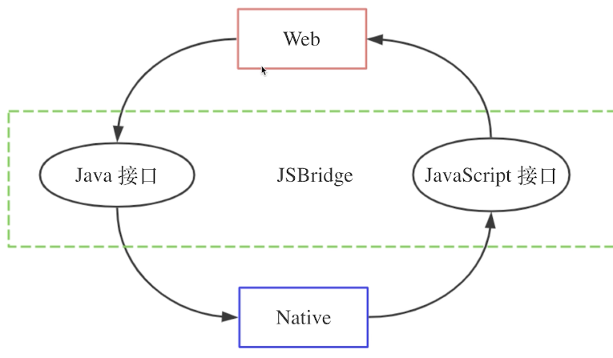
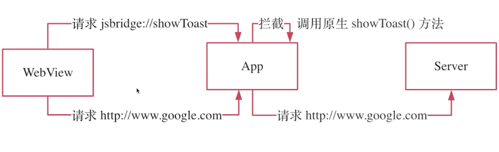
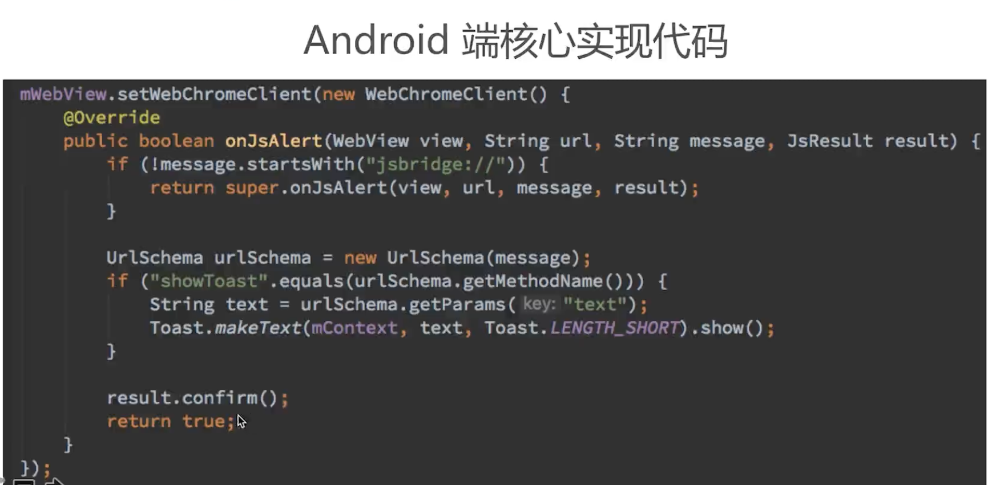
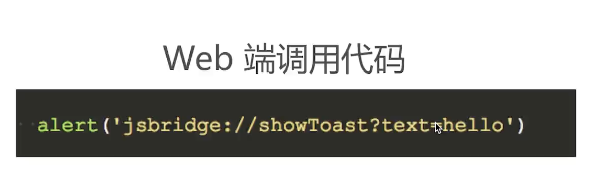
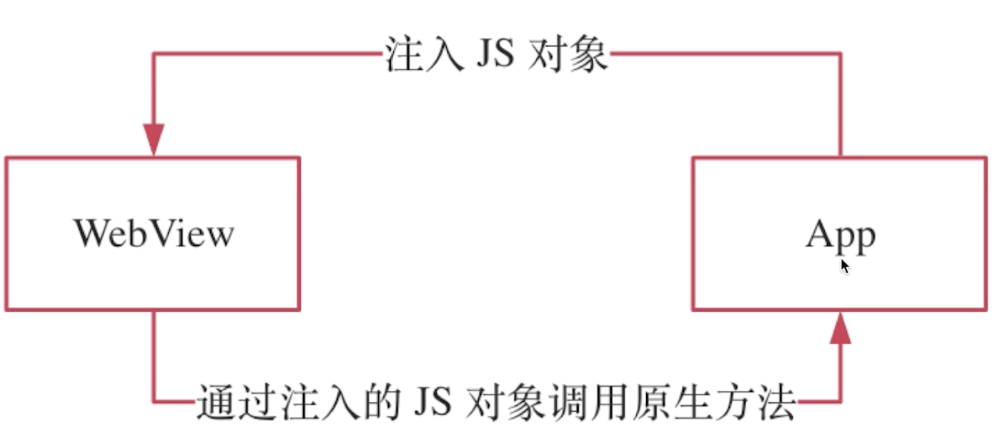

# 02: 混合开发核心技术 JSBridge

## 01：JSBridge 实现原理

* 类似 Client/Sever 模式
* 将 Native 端原生接口封装成 JavaScript 接口
* 将 Web 端 JavaScript 接口封装成原生接口
* Web 端和 Native 端之间双向通信

## 02：JSBridge 实现方式一：拦截 URL Schema

* URL Schema 是类 URL 的一种请求格式
* `<protocol>://<domain>/<path>?<query>`
* `https://www.google.com/search?keyword=jsbridge`
* 自定义 JSBridge 通信的 URL Schema
* `jsbridge://<method>?<params>`
* 例子：`jsbridge://showToast?text=hello&a=b`

### 这种方式的优缺点

* 优点：兼容性好
* 缺点：不直观，URL 长度有限

## 03：JSBridge 实现方式一：注入 JS API

* 优点：简单直观
* 缺点：有兼容性问题：（Android 4.2+）

## 03：带回调的 JSBridge

### 什么是带回调的 JSBridge

* 在对端执行操作并返回结果
* 有输入有输出才是完整的调用

## 04：使用 JSBridge 的开源实现

### 学习 JSBridge 的目的

* 掌握原理
* 具备造轮子的能力
* 避免重复造轮子

### JSBridge 的开源实现

* JsBridge：拦截 URLSchema
* DSBridge: 注入 JS API

