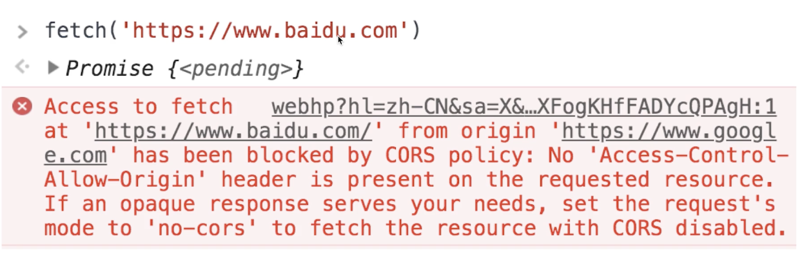
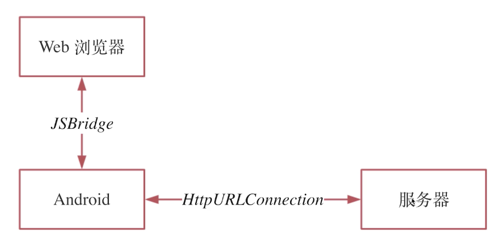

# 03:实现一个简单的混合 APP

## 01：Web 端发送原生 HTTP 请求

### Web 端 HTTP 请求存在的问题

* Web 发送请求接口 XMLHttpRequest 和 fetch
* 浏览器同源策略 CORS 安全限制
* 不够安全、无法优化网络

### Web 端跨域请求

### web 端发送原生的 HTTP 请求优点

* 没有浏览器的跨域限制
* 安全加密、签名校验
* 弱网优化、流量优化

## 02：Native 端沉浸式换肤

* Native 端包括标题栏、状态栏、导航栏
* Web 端包含页面背景

