# 08-V8垃圾回收机制精讲

通过前面的学习我们知道，当一个网页运行时，浏览器会给网页分配一段连续的内存空间以供网页使用。

并且通过使用方式的不同，内存空间会被分为栈内存与堆内存。栈内存只用于管理函数的执行顺序，堆内存用于存储其他所有对象。

我们还知道，程序的运行过程中，会使用内存。而内存空间是有限的，因此，内存空间的重复利用就变得非常重要。垃圾回收的概念也因此而生。

在学习垃圾回收概念之前，我们先明确几个概念

**引用**：内存的原始地址

**弱引用**：WeakMap、WeakSet

**垃圾**：无任何引用的对象

**回收**：清空被垃圾占用的内存

**垃圾回收区域**：堆内存

首先要考虑的问题是：**如何识别垃圾？？？** 

ECMAScript 规范中并没有明确指出 JS引擎必须使用哪种算法来识别垃圾，因为我们这里介绍几种常用的方式

## 01：引用计数法

堆中的每个对象都有一个引用计数器。当一个对象被创造初始化后，该变量计数器就设置为 1

```javascript
var a = new Object() // 计数变量 = 1
```

每当有一个地方引用它时，计数器的值就加 1

```javascript
var a = new Object() // 计数变量 = 1
var b = a   // 计数变量 + 1 = 2
```

当引用失效时，计数器的数值就减少 1

```java
var a = new Object() // 计数变量 = 1
var b = a   // 计数变量 + 1 = 2
var c = a   // 计数变量 + 1 = 3

a = null    // 引用失效，计数变量 -1 = 2
b = {}      // 引用失效，计数变量 -1 = 1
```

当该对象的计数值为 0 时，就表示失去了所有的引用，该对象就成为了垃圾。

```javascript
var a = new Object() // 计数变量 = 1
var b = a   // 计数变量 + 1 = 2
var c = a   // 计数变量 + 1 = 3

a = null    // 引用失效，计数变量 -1 = 2
b = {}      // 引用失效，计数变量 -1 = 1
c = null    // 引用失效，计数变量 -1 = 0
```

知识体系关联：这样的管理方式，类似于数组的 length 字段

**优点**：引用计数收集器执行简单，实现简单，判定效率高，无延迟，对程序不被长时间打断的**实时**环境比较有利

**缺点**：赋值时需要更新计数器，增加了微量时间开销，影响不大。最严重的问题是引用计数器无法处理循环引用的问题

```javascript
var p = { 
  n: 1, 
  next: {
   n: 2,
   next: p
  }
}

p = null
```

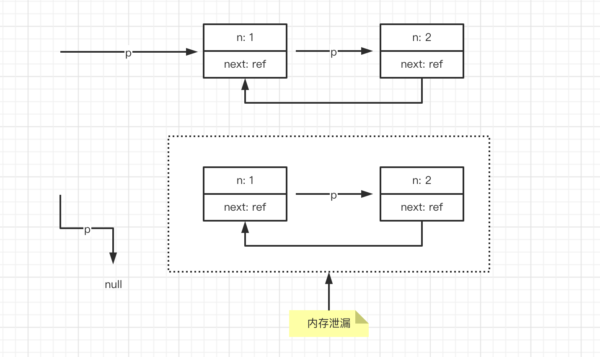

对象不可访问，计数器不为 0，无法被回收，导致内存泄漏

引用计数器虽然有这样致命的缺陷，但是由于其性能的优越性，依然有开发语言采用该算法，例如早起的 Java，以及现在的 python。并通过手动解除、或者在循环引用的环节使用弱引用的方式。

## 02: 根搜索算法 Tracing Collector

首先了解一个概念：GC Roots Set(根集)，他是可访问的引用集合。Roots Set中的引用变量可以用于访问对象的属性以及调用对象的方法

这种算法的基本思路就是: 先通过一系列`GC Roots` 的对象作为起点，遍历寻找对应的引用节点。找到这些节点之后，继续向下递归寻找节点。

搜索所走过的路径称为引用链，当一个对象 GC Roots 没有任何引用链相连时，就证明该对象是不可用的。

如果不考虑循环引用，Roots Set 会表现为一棵棵树状结构，如果考虑弱引用，则会呈现出如图结构

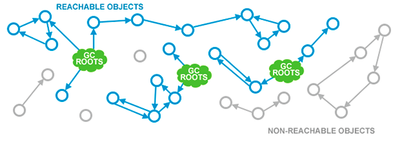

哪些对象可以作为根节点

1. 所有正在运行的栈上的引用变量
2. 所有的全局对象全局变量
3. 所有的内置对象

在内存中对整个堆进行遍历，先从 GC 根对象开始，然后找到根对象引用的其他对象，能访问到的所有对象都标记为存活

关于标记阶段有几个关键点是值得注意的

1. 开始进行标记钱，需要先暂停应用线程，否咋如果对象图一直在变化的话是无法真正去遍历它的。这就是后面我们会提到的`stop-the-world`
2. 暂停时间的长短并不取决于堆内对象的多少也不是堆的大小，而是存活对象的多少。因此，调高堆的大小并不会影响到标记阶段的时间长短。
3. 在 Blink 引擎的垃圾回收器 Olipan 中，则某个对象再被回收之前，可能会执行一个回收之前需要做什么的生命周期函数 `finalize`

如果该对象被判定为有必要执行 `finalize()` 方法，那么这个对象将会被放置在一个名为 `finalization-queue` 队列中，并在稍后由一条低优先级的 `Finalizer` 线程去执行这些任务。`finalize` 方法是对象逃脱死亡命运的最后一次机会，稍后 GC 对 `finalization-queue` 中的对象进行第二次小规模的标记，如果要在 `finalize()` 中成功拯救自己，只要让该对象重新引用链上的任何一个对象建立关联即可。而如果对象这时还没有关联到任何链上的引用，那它就会被回收掉。

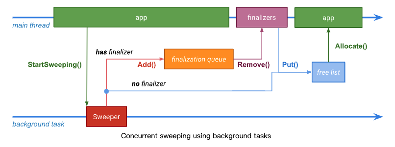

而在 V8 引擎的实现中，由于我们无法访问垃圾回收器，因此就没有提供这样的生命周期函数让 JavaScript 开发者有所作为。

4. GC 判断对象是否可达看的时强引用，而非弱引用

## 03: V8的垃圾回收器

V8 的垃圾回收器名为 `Orinoco`。

上面我们也提到，垃圾回收器无论在进行标记或者回收行为时，我们都会暂停 JS 主线程的执行。

因此早期的 `Orinoco` 采用了这种 `stop-the-world` 的方式。

任何垃圾收集器都有一些必须定期执行的基本任务：

1. 识别活/死对象
2. 回收/重用死对象占用的内存
3. 压缩/碎片整理内存（可选）

这些任务可以按顺序执行，也可以任意交错执行。 `stop-the-world` 的方式暂停 JavaScript 执行并在主线程上按顺序执行这些任务。 当然这种方式的副作用就是会导致主线程出现卡顿和延迟，用户感知明显。

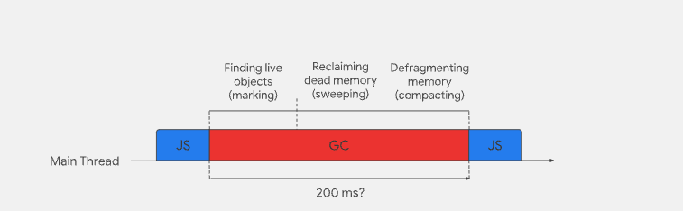

那么这种方式会做什么事呢？

首先，标记存活对象。

GC 通过根搜索算法验证活跃对象的可达性，在这个过程中，GC 可以收集任何无法访问的对象。

收集到了所有无法访问的对象之后，就会清空对应的内存空间。于此同时，会在一个 `free-list` 的列表记录这些清理出来的内存位置与大小，当有新的对象需要分配内存空间时，就会在 `free-list` 中查找。

如果不做任何特殊的处理，新的对象所需要的内存空间不可能完整的跟 `free-list` 的空闲内存大小一致，因此最后就会存在许多难以利用的内存缝隙。为了解决这个问题，我们还需要在回收过程中，对内存进行碎片整理。以确保我们总能够得到连续的空闲内存分配给新的对象。

在过去几年中，`Orinoco` 有了很大的转变。我们接着往下继续了解。

## 04：**V8 中的堆内存区域划分**

V8 主要将堆内存划分为两个区域，新生代 `Young Generation` 与 老生代 `Old Generation`。从概念上来说，新生代主要用于存储生命短暂的对象，例如执行上下文，老生代用于存储生命漫长的对象例如函数声明。

> 新生代又被进一步划分为两个区域，如下图，在后面的分析中，我们用 From、To 来称呼他们

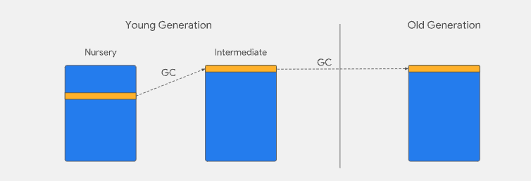

在 GC 中有一个重要的术语：`The Generational Hypothesis`。也就是说，我们大胆的预测大多数对象都会在新生代中死亡，实际上也是这样，这是 `Orinoco` 具体实现的大前提。V8 的内存区域分布则利用了这一假设，只有少数对象能在新生代中存活下来，然后移动到老生代中。所以大多数对象都是隐式垃圾，用完即走。

所以，GC 复制算法得以在 V8 中被使用，因为被复制的对象一定是少数。后面我们分析复制算法。

## 05: **Major GC (Full Mark-Compact)**

在 `Orinoco` 中，存在两个不同的 GC。Major GC：用于回收老生代的垃圾， 与 Minor GC：用于回收新生代的垃圾。

Major GC 管理整个堆内存，主要是对老生代区域的内存进行回收。Major GC 采用了 `Mark-compact` 算法「标记-整理」来管理内存。

他是为了解决 `Mark-Sweep` 算法所带来的内存缝隙而提出来的优化方案。标记方式依然通过根搜索算法进行标记，`compact` 整理算法我们用图例来讲解一下。

在这之前，我们要明确 `compact` 要做的两件事情

1. 把存活的对象移动到该去的位置
2. 修改引用，让他们指向新的地址

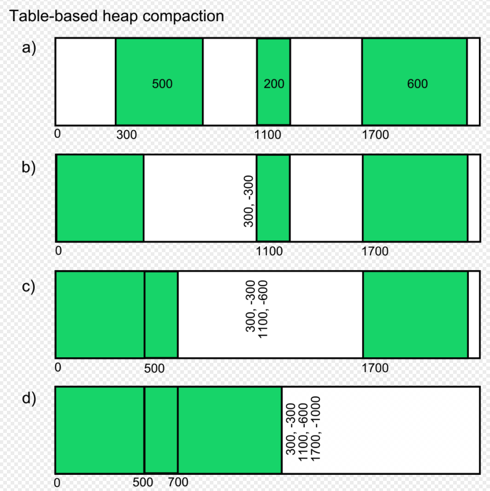

通过这样的方式之后，我们就得到一个整理之后的新布局。不过这样的方式也存在一些问题，因为要对堆内存遍历很多遍，因此内存越大，性能消耗就越大。不过得益于老生代中的内存对象比较少，并且变动比较小，因此 V8 依然选中该方法来管理老生代对象。

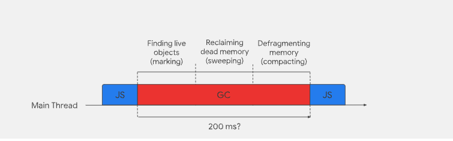

## 06: **Minor GC (Scavenger)**

Minor GC 专门用于管理新生代内存。并且使用了一种名为 `cheney` 的 GC 复制算法。一种使用空间换取时间的方法。因此，了解新生代内存空间到底是如何管理的，实际上就需要对空间复制算法有深刻的理解。

首先我们要明确大的前提，随着程序的运行，新生代会产生大量的内存占用，如果我们继续采用简单的遍历手段来清理，时间效率就会大打则扣。那么空间复制算法是如何解决这个问题的呢？

空间复制算法将新生代空间均等的一分为二。From-space 与 To-space。新的对象产生之后，会首先占用 `From-space`，`From-space` 被占满「或者达到某个阈值」之后，就会开始执行清理任务。并将剩余的活动对象复制到 `To-space`。执行过程如下：

首先我们模拟一个内存布局，情况如下：

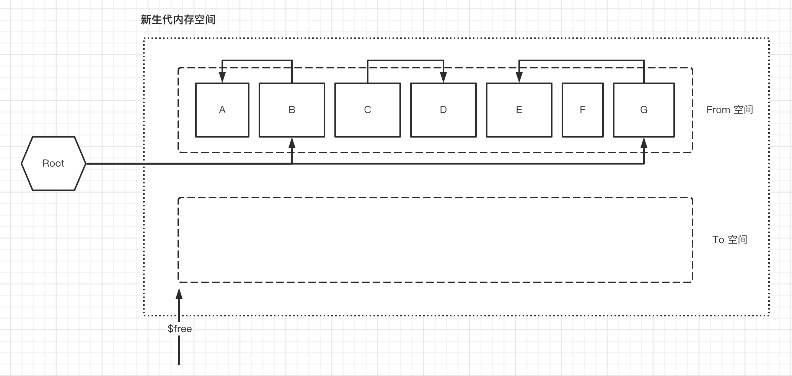

在 From 空间中，共有 A、B、C、D、E、F、G 7个对象。我们用箭头标明了各个对象之间的引用关系。`$free` 指针用于指向当前对应空间的可分配内存的起始地址。

当 GC 开始执行，根据根搜索算法，我们先从 Root 中的引用开始查询，首先找到了活动对象 B。然后将 B 复制到 `To-space`。并在 `From-space` 中将 B 对象标记为已复制「图中使用置灰来表示」。`$free` 指针移动到新的起始位置。

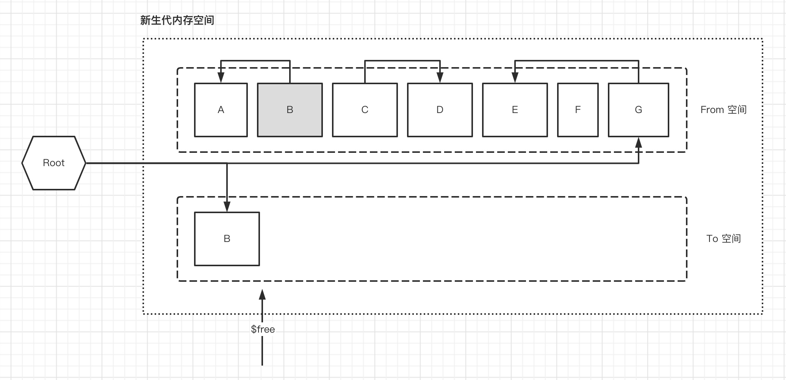

然后再接着查询 B 的引用，找到了 B 的子对象 A，于是就将 对象 A 复制到 `To-space` 。这是一个递归过程。

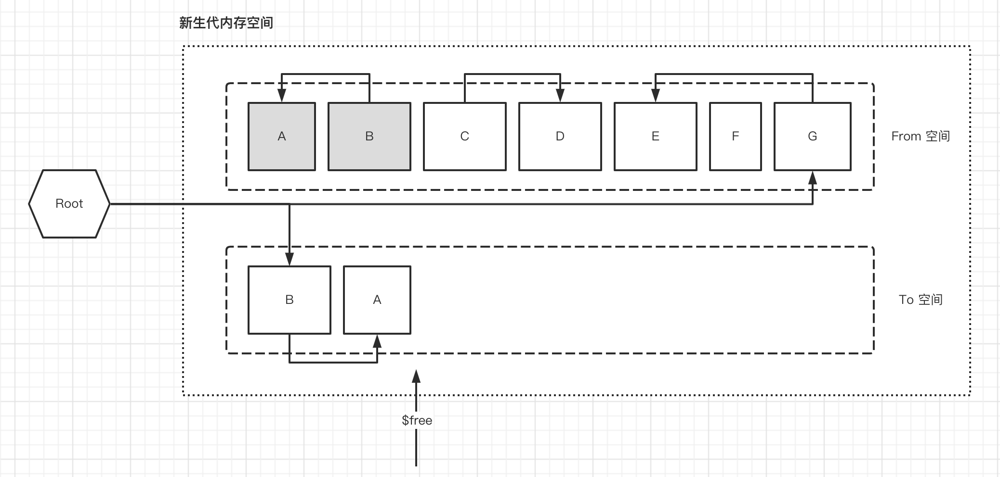

此时查询 A，发现 A 没有往下的引用了，所以结束。回过头继续执行根节点别的引用。此时我们模拟的案例中，还有这样一个路径 `Root -> B -> E`，按照上面一样的方式复制即可。

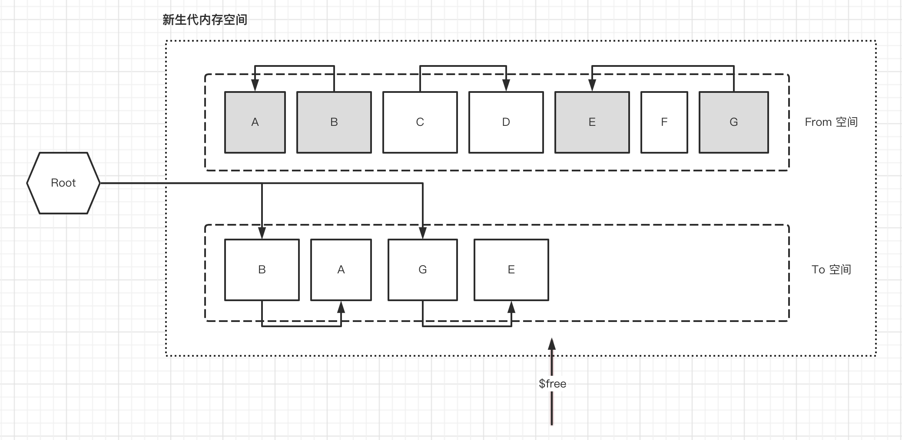

此时，活跃对象已经被全部复制到了 `To-space`。接下来我们只需要将 `From-space` 全部清空，然后将两个空间互换。这样我们就能够得到一个全新的 `To-space`。

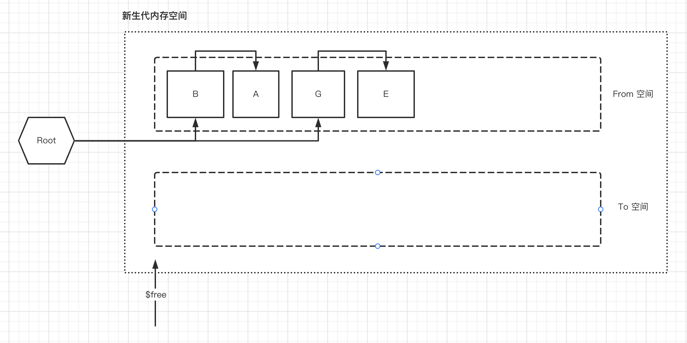

> 此时我们需要考虑一个问题，为什么要把已经复制过的对象还保留在 `From-space` 中。关键提示：一个对象可以被多个对象同时引用

我们会发现，对象 C、D、F 在该算法中压根就没管过他们，因此我们结合根节点使用深度优先搜索，能够在非常短的时间之内完成整个 GC，和一般的 `Mark-sweep` 「标记-清除」相比，它在时间上的高效要大大超出。并且当堆内存中的对象越多，GC 复制算法的优势就越大，当对象不断增加时，`Mark-sweep` 所花费的时间会不断增加，而 GC 复制算法则不会。

领会这个优势的时候，我们不要忘记刚才所提到的假设前提：大多数对象都是死亡对象。

除此之外，我们还发现在 GC 复制算法中，我们并不需要维护一个 `free-list` 来记录分配空间，只需要一个 `$free` 指针，我们就能够知道哪些空间是可以分配的，这也极大的简化了算法的复杂程度。

当然，还有最重要的一点，GC 复制算法不会产生内存碎片，我们不需要花费额外的精力去考虑如何整理它。

除此之外，许多 CPU 都会借助缓存机制，通过压缩把有引用关系的对象安排在堆中较近的位置，以达到高速访问对象的目的。GC 复制算法则在某种程度上迎合了 CPU 的这个优化策略，有引用关系的对象被安排在相邻的位置。

当然 GC 复制算法的缺点也很明显，对于内存的使用效率偏低，新生代中只有一半的内存空间可供分配。当然，对于 V8 而言，使用空间去换取高效的时间，这是非常愿意接受的事情。

在深度优先搜索的过程中，我们需要递归的去查询和复制子对象。由此带来的额外负担不可忽视，对于栈内存的消耗也具有很大的风险「栈溢出」，因此，相比递归算法，迭代算法更值得我们采纳。

`Oninoco` 中采用的 `Cheney` 算法，则是使用的迭代来解决该问题。

## 07: **Cheney GC 复制算法**

`Cheney` 算法引入了新的指针 `$scan`。该指针用于标记 `To-space` 中，还没有被向下搜索过子对象的起始位置。此时 `To-sapce` 我们应当将其看做是一个对象。往 `To-space` 中复制对象的行为为入队，`$scan` 按照队列中的对象依次搜索的行为为出队。

此时，复制与搜索行为就是队列的入队与出队。我们依然从根节点开始搜索。模拟的新生代初始情况如下图。

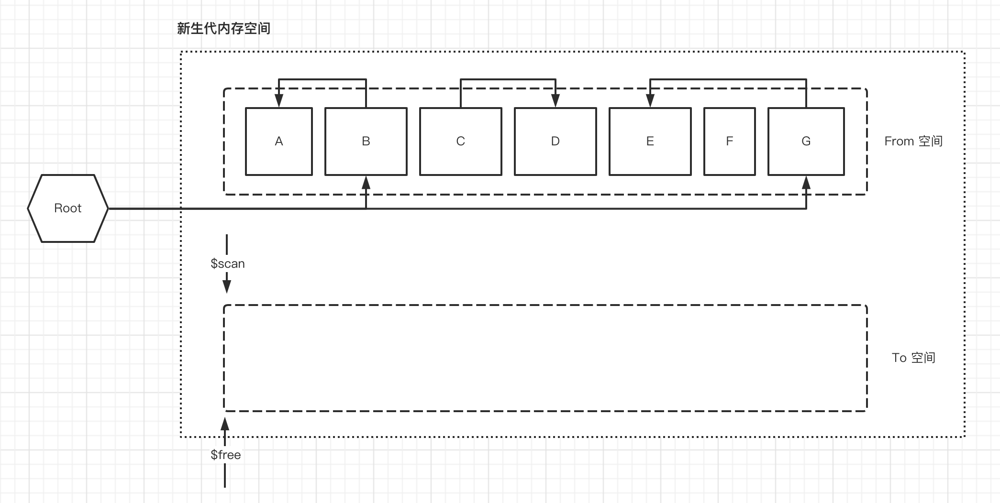

从根节点搜索依次发现两个对象，B、G。与普通 GC 复制算法不同的是，此时我们会直接将 B 、G 依次复制到 `To-space` 中。`$scan` 指针暂时保持不变，`$free` 指针向右移动。

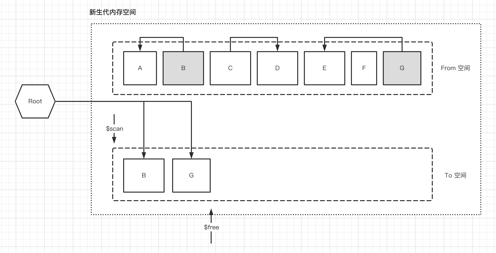

Root 节点中没有别的引用了，此时队列中的对象成为了新的 Root 节点，我们就开始从队列的头部开始搜索，`$scan` 指针开始从队列头部依次向右移动。搜索当前队列中的第一个对象 B，发现新的引用 A，于是 A 复制进入队列。

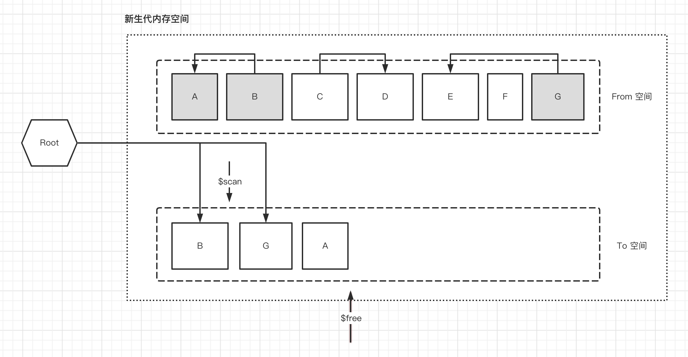

此后，`$scan` 接着往右移动，依次出队，发现新的对象就复制入队，直到`$scan` 指针与 `$free` 指针再次重合为止。

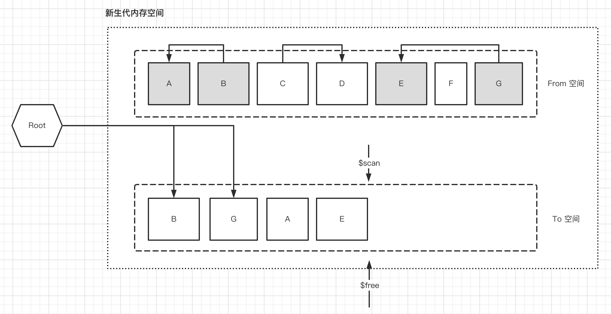

OK，剩下的就是清理空间然后互换。

> 知识体系关联：与 Promise 的任务队列方式相似

我们可以发现，`Cheney` 算法采用的是广度优先遍历。此时指针 `$scan` 与 `$free` 之间的对象成为了一个队列，`$scan` 左边是已经遍历过的对象，右边是没有遍历的对象。这样把堆用做队列的方式，消除了普通GC算法的递归风险，不用特意为队列流出多余的空间就能够完成遍历，这就是迭代。也是 `Cheney` 算法的一大优点。

当然，付出的代价就是 `Cheney` 算法不再考虑临近的对象放在一起了。访问速度上与普通的GC算法相比，可能会稍微慢一些。

> 知识体系关联：优先级队列的算法，在 React Fiber 架构中也有运用到。我们在学习 React 底层原理的时候也会遇到。

当然，如果仅仅只是这样的话，新生代的内存空间很快就会消耗殆尽。因此，新生代中的对象如何能在第二次 GC 中幸存下来，就会被疏散到老生代区域中。

> 在复制过程中，每个复制对象都会留下一个转发地址，用于更新原始指针指向新的位置。

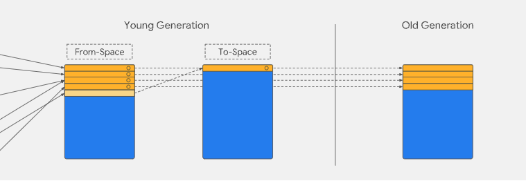

不过一定要注意的是，清理过程中，GC 执行了标记、疏散、指针更新等行为，这些都是交替执行的，而不是在特定不同的阶段执行。

## 08: **进一步的优化**

在了解了新生代和老生代分别的内存管理策略以及对应的算法之后，在特定的场景之下，GC 还需要继续优化。内存清理行为我们可以统一为一个行为，采用 `stop-the-world` 的方式，暂停 JS 的执行。但这样做的代价就是页面明显卡顿。对于浏览器来说，这是不可接受的事实。

因此 `Orinoco` 还继续做了优化。这里我们需要理解几个词汇。Parallel 并行，Incremental 增量，Concurrent 并发。

## 09: **Incremental**

2011年，V8 从 `stop-the-world` 切换到 `Incremental` 增量标记 + `Lazy Sweeping`惰性清理的模式。

增量执行的意思是主线程间歇性的执行一部分工作。我们会将 GC 任务拆分成多个小任务，然后在主线程的间隙中执行这些小任务。

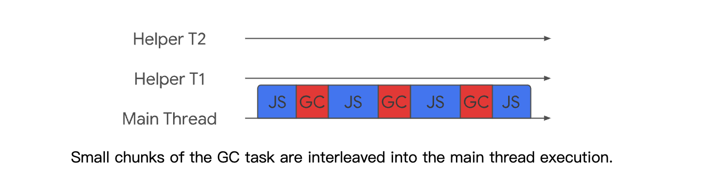

当增量标记完成之后，假如当前的可用内存足以让我们快速的执行代码，其实我们没必要立即清理内存。可以将清理的过程延迟一下，让 JavaScript 逻辑代码先执行，也无需一次性清理完所有的垃圾，而是按需逐步清理，直到所有的页面都清理完毕。

结合浏览器自带的任务调度的空闲时间`Idle`，增量标记与惰性清理的出现，使主线程的最大停顿时间减少了 80%。页面更加流畅了。

但是这种实现方式比较困难，因为 JavaScript 会继续执行，可能会在增量工作中改变堆的状态，也就意味着会导致之前的任务无效，为了解决这个问题，V8 引入了写屏障技术`Write-barrier`来记录这些引用关系的变化，这也为整个标记过程带来了额外的执行成本。并且从图中可以看出，GC 的整体时间并没有减少，只是分散开了而已。

## 10: **Parallel 与 Concurrent**

Parallel 表示并行。指的是主线程和辅助线程同时执行大致数量相等的任务。该方案依然是采用了 `stop-the-world` 的方式，但是将清理任务分别交给多个线程来执行，可以极大的减少暂停时间。如下图，从实现方式上来说，这是实现起来最简单的方案。

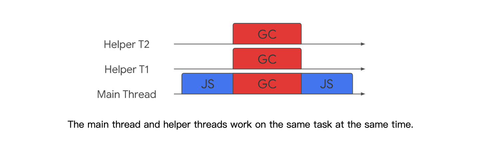

Concurrent 表示并发。也就是说，在我们不暂停JavaScript 代码执行的同时，辅助线程在后台执行 GC 工作。这是三种技术中实现起来难度最高的。因为 JavaScript 会随时更改堆中的情况，最重要的时，如果辅助线程与 JavaScript 主线程同时读取或者修改同一个对象，就更难处理。

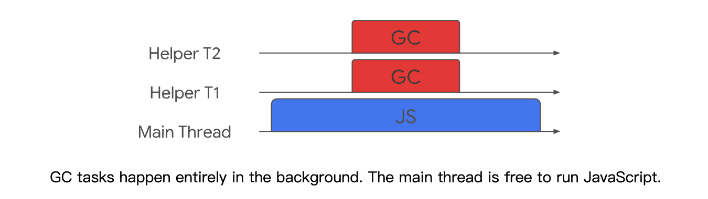

2018年，V8 同时引入了并行与并发，让垃圾回收的时间进一步大幅度缩短。

在新生代中，使用并行机制。在将活动对象从 `From-space` 复制到 `to-space` 时，启用多个辅助线程，并行的进行整理。由于多个线程可能会竞争同一个对象，因此第一个线程对该对象操作之后，都必须维护这个对象的转发地址，以便于其他线程能够快速判断该对象是否已经被复制。

在老生代中，如果堆中的内存大小超过某个阈值，会启用并发（Concurrent）标记任务。每个辅助线程都会去追踪每个标记到的对象的指针以及对这个对象的引用，而在JavaScript代码执行时候，并发标记也在后台的辅助进程中进行，当堆中的某个对象指针被JavaScript代码修改的时候，写入屏障（write barriers）技术会在辅助线程在进行并发标记的时候进行追踪。

当并发标记完成或者动态分配的内存到达极限的时候，主线程会执行最终的快速标记步骤，这个时候主线程会挂起，主线程会再一次的扫描根集以确保所有的对象都完成了标记，由于辅助线程已经标记过活动对象，主线程的本次扫描只是进行check操作，确认完成之后，某些辅助线程会进行清理内存操作，某些辅助进程会进行内存整理操作，由于都是并发的，并不会影响主线程JavaScript代码的执行。

## 11: **结语**

V8 中的垃圾收集器自诞生以来已经走过了漫长的道路。向现有 GC 添加并行、增量和并发技术是一项多年的努力，现在已经取得了显著的回报。将大量工作转移到后台任务，极大地改善了暂停时间、延迟和页面加载，使动画、滚动和用户交互更加流畅。并行 Scavenger 将主线程新生代垃圾收集的总时间减少了大约 20%–50%，这具体取决于工作负载。 Idle-time GC 可以在 Gmail 空闲时将其 JavaScript 堆内存减少 45%。并发标记和清除已将重型 WebGL 游戏的暂停时间减少了多达 50%。

但是性能优化的工作依然没有完成。减少垃圾收集暂停时间对于为用户提供最佳网络体验仍然很重要，V8 团队也正在研究更先进的技术。最重要的是，Blink（Chrome 中的渲染器）还有一个垃圾收集器（称为 Oilpan），V8 团队正在努力改善两个收集器之间的合作，并将一些新技术从 Orinoco 移植到 Oilpan。

大多数开发人员在开发 JavaScript 程序时不需要考虑 GC，但是了解一些内部机制可以帮助您考虑内存使用和有用的编程模式。例如，从垃圾回收的角度来看，短生命周期对象的使用成本实际上非常低，而长生命周期对象的维护成本则会偏高。因此，对于闭包/无效函数声明等对象的使用就应该非常严谨。

> 优化手段：
>
> 1. shaking 技术；
> 2. 2. 减少闭包对象的大小，而非不适用闭包

> 本文是作者`这波能反杀_`的付费电子书籍《JavaScript 核心进阶》的补充章节，有个哥们要去大厂面试紧急需要垃圾回收机制的底层知识，所以花了一天时间把这篇文章肝出来，目的就是为了比大厂面试官更懂垃圾回收。
>
> 除此之外，作者正在为该书每个章节录制视频上传到 B 站，欢迎大家到B站搜索 `这波能反杀_` 关注

**参考文档：**

[https://v8.dev/blog/high-performance-cpp-gc](https://v8.dev/blog/high-performance-cpp-gc)

[https://v8.dev/blog/concurrent-marking](https://v8.dev/blog/concurrent-marking)

[https://v8.dev/blog/trash-talk#incremental](https://v8.dev/blog/trash-talk#incremental)
