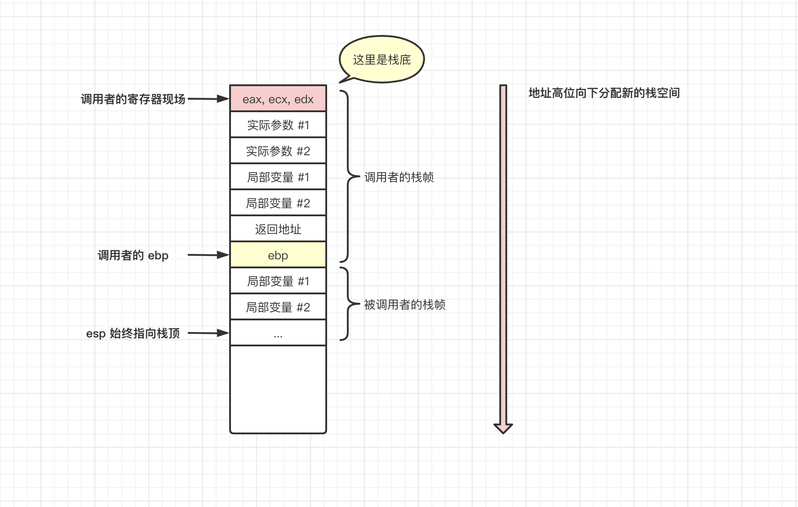
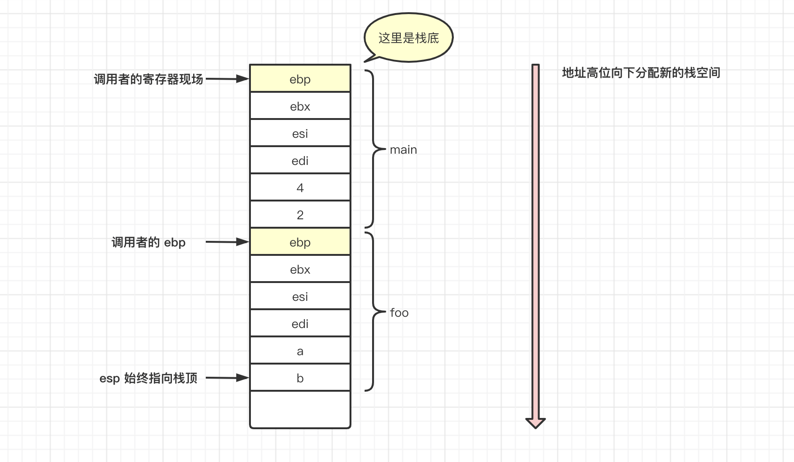

# 16-栈操作原理与函数调用

如果大家对寄存器的存在还是不够理解的话，可以简单粗暴的将寄存器理解为变量。每一个变量都用于存储特定的值，以协助 CPU 进行运算。

一个栈空间中的情况大概如下

现有如下函数

```javascript
function foo(a, b) {
  a = a + 3;
  b = b + 5;
  return a + b;
}

function main() {
  var r = foo(2, 4)
  console.log(r)
  return 0;
}
```

我们观察 main 函数，发现内部调用了函数 foo。我们称 main 为**调用者「caller」**，foo 为**被调用者「callee」**。他们翻译成汇编语言**简化**之后的代码如下

```c#
// main 函数
push   ebp        // 先让 ebp 入栈，保留现场，用于函数出栈时还原现场
mov    ebp, esp   // 调整当前 ebp 的值为当前的栈顶元素 esp
sub    esp, 40h   // 调整栈顶元素，预留一部分空间给临时变量
push   ebx        // 后面就是函数的内部操作，参数入栈，变量入栈
push   esi
push   edi
lea    edi, [ebp - 40h]   // 也是一个赋值操作，与mov类似，但有一些区别，这里是真实的值
mov    ecx, 10h
mov    eax, 0ccccch
push   4          // 这里准备要调用 foo 方法，先让 foo 的参数入栈
push   2
call   foo
add    esp, 8     
push   eax
call   console.log
add    esp, 8
pop    edi        //  相关寄存器依次出栈
pop    esi
pop    ebx
mov    esp, ebp   // 调整栈顶元素为 刚开始函数入栈时的位置，准备还原现场
pop    ebp        // ebp 出栈，回到上一个函数的执行中去
ret               // 执行结束
```

关键的逻辑注意看注释。

test 的调用也是类似。

```javascript
// test 函数
push   ebp
mov    ebp, esp
sub    esp, 40h
push   ebx
push   esi
push   edi
lea    edi, [ebp - 40h]
mov    ecx, 10h
mov    eax, 0ccccch
mov    eax, [ebp + 8]
add    eax, 3
mov    ecx, [ebp + 8]
add    ecx, 5
mov    eax, ecx     // 将最后结果保存在 eax 并返回
pop    edi
pop    esi
pop    ebx
mov    esp, ebp
pop    ebp
ret
```

与之对应的栈中情况如下：



## 00-思考题

结合之前的作用域链与这里的栈内存原理，思考一个问题，如下例子中，函数 main 中访问的变量 a，与函数 foo 中也能访问的变量 a ，在内存中是否是同一个地方？

```javascript
function main() {
  const a = 20  
  
  // 函数 main 中能访问 a
  
  function foo() {
    
    函数 foo 中，也能访问 a
    console.log(a)
  }
}
```