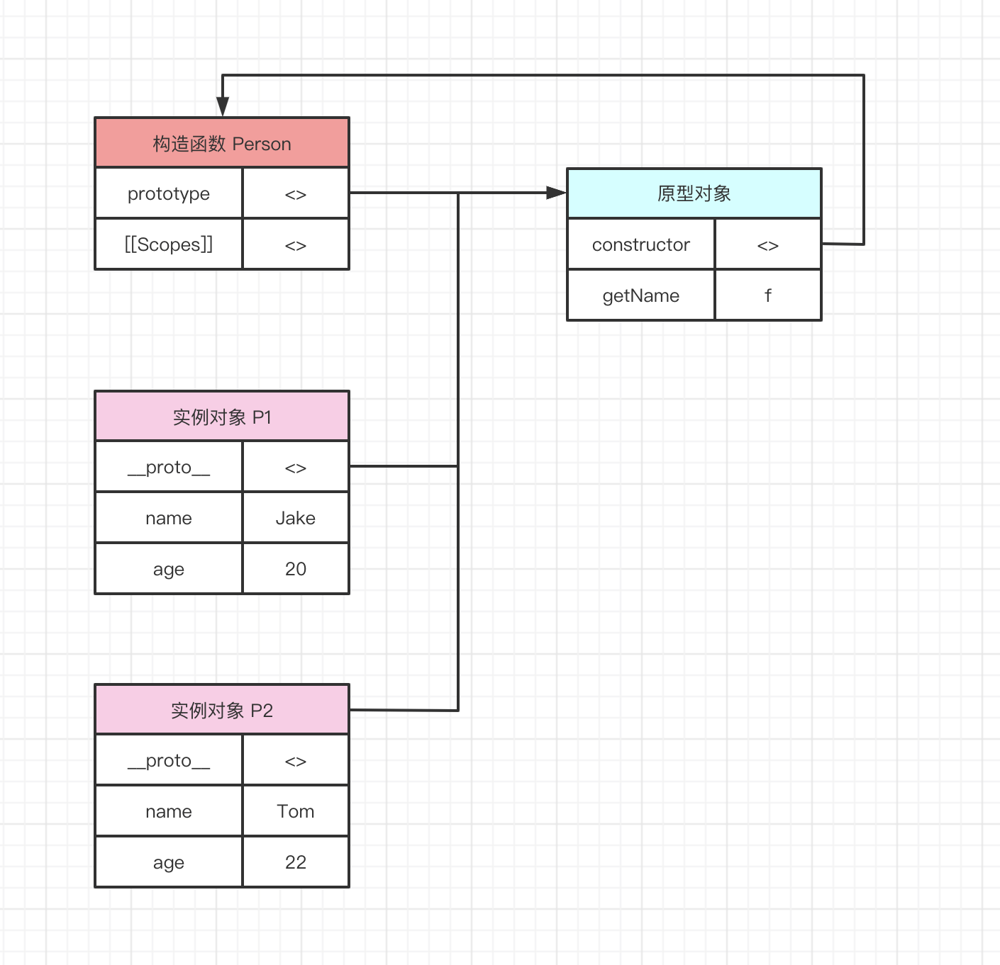

# 30-构造函数

在上一章节中，为了帮助大家能够更加清晰的了解到面向对象思维的必要性，我们通过一步一步的场景分析，给出了最后的解决方案。创建对象的方式大概如下：

```javascript
function createPerson(name, age) {
  this.name = name
  this.age = age
}
createPerson.prototype.run = function () {
  console.log(`调用此方法${this.name}就会开始奔跑`)
}

const p1 = New(createPerson, 'TOM', 20)
const p2 = New(createPerson, 'Jake', 22)
const p3 = New(createPerson, 'Amy', 21)
```

我们需要关注两个点，createPerson 与 聚合共有方法的原型对象。

createPerson 会在实例被创建时执行，这样的函数，我们称之为**构造函数**。也正因此如此，构造函数常常被用于初始化实例对象。

**构造函数中，this 指向实例对象**

上一章节，为了让构造函数，与 run 方法的内部函数 this 指向同样的对象，通过高阶函数 New 强制约定了构造函数内部的 this 指向，当构造函数通过 New 创建实例对象时，构造函数内部的 this 指向，会指向实例对象。

在标准的语法中，使用如下方式创建新的实例

```javascript
const p1 = new Person('Tom', 20)
```

new 关键字是官方支持的语法，思路与我们上一章节的分析几乎一致。因此，当我们使用 new 创建实例时，构造函数依然会被立即执行，并且构造函数的内部 this 会指向实例对象 p1。

**构造函数内部声明的属性，属于单个实例特有**

在构造函数中，我们会将一些属性或者方法挂载到 this 对象上。

```javascript
function Person(name, age) {
  this.name = name
  this.age = age
}
```

通过上一章节的分析我们知道，**属于属于所有实例共享的属性与方法，都被抽离出来放在了原型对象中，而属于每一个实例特有的属性与方法，都会留在构造函数。**

例如，每一个实例的名字，只能属于每个实例特有，不可能所有实例共享名字。

**new 关键字都干了什么**

构造函数与普通函数并无不同，使用场景的不同，导致了构造函数拥有特殊的含义。因此，我们约定，所有的构造函数，首字母都需要大写。便于一眼就能够分辨出来该函数的用意。

我们都知道，构造函数需要与 new 关键字结合使用，new 关键字可以理解为构造函数的高阶函数，用以增强构造函数的逻辑**，因此，构造函数在创建之初，就需要考虑到与 new 关键字的配合，**这样才能完美的实现逻辑。因此，new 关键干了什么，就是我们每个人都需要了解的重要知识。

上一章节中，我们已经自己实现过了 new 的逻辑，因此此处只需要总结一下即可：

```javascript
// 将构造函数以参数形式传入
function New(func) {
  // 声明一个中间对象，该对象为最终返回的实例
  const res = {}
  if (func.prototype !== null) {
    // 将实例的原型指向构造函数的原型
    res.__proto__ = func.prototype
  }

  // ret为构造函数执行的结果，这里通过apply，将构造函数内部的this指向修改为指向res，即为实例对象
  const ret = func.apply(res, Array.prototype.slice.call(arguments, 1))

  // 当我们在构造函数中明确指定了返回对象时，那么new的执行结果就是该返回对象
  if ((typeof ret === 'object' || typeof ret === 'function') && ret !== null) {
    return ret
  }

  // 如果没有明确指定返回对象，则默认返回res，这个res就是实例对象
  return res
}
```

- 创建一个空的实例对象，等待被初始化
- 将空实例对象的原型，指向构造函数的原型
- 将构造函数内部的 this，强制指向该实例对象，并执行构造函数，初始化实例对象
- 最后返回该实例对象

有如下代码：

```javascript
function Person(name, age) {
  this.name = name
  this.age = age
}

Person.prototype.getName() {
  return this.name
}

const p1 = new Person('Jake', 20)
const p2 = new Person('Tom', 22)
```

该案例中，构造函数，原型对象，实例对象之间的关系，如下图所示：



构造函数的 prototype 与所有实例的 **\_proto\_** 都指向原型对象，原型对象中有一个 constructor 属性，指向构造函数。

需要注意的是，如果构造函数与原型对象中，同时声明了同名的方法/属性时，会优先访问构造函数中的方法/属性，如下例

```javascript
function Person(name) {
  this.name = name
  this.getName = function () {
    console.log('你访问了构造函数中的 getName')
    return this.name
  }
}

Person.prototype.getName = function () {
  console.log('你访问了原型对象中的 getName')
  return this.name
}

const p1 = new Person('Tom')
p1.getName() // 你访问了构造函数中的 getName
```

**思考题**

你如何看待构造函数返回值的问题？
