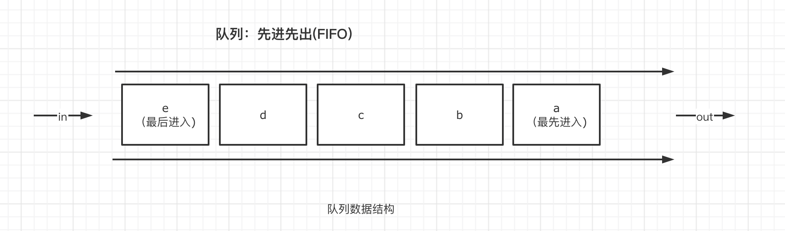

# 05-数据结构队列

队列是一种先进先出的数据结构。



如果要将队列运用到实践中，很容易就能够想到会有如下操作

1. 从队列最后入队
2. 从队列头部出队
3. 从队列任意位置离队「有其他事情」
4. 从队列任意位置插队「特殊权利」
5. 清空队列

如果要用代码来实现一个队列对象，应该怎么办？

## 01-代码实现

在思考这个问题之前，我们需要讨论一下使用什么样的基础数据结构来保存队列的数据。如果你对数组很熟悉，那么就能够很自然的想到使用数组来存储队列数据，但是我们仔细分析一下会发现，上面这些方法，数组全都已经实现过了。因此我们常常在实践中可以直接使用数组来表达一个队列。不过这样的话，就失去了学习的意义。因此我们基于更基础的对象字面量来表达队列，使用从 0 开始的数字作为 key 值，构建一个类数组对象，如下

```javascript
this.queue = {
  0: 'A',
  1: 'B',
  2: 'C',
  3: 'D'
}
```

序列表示队列位置，序列对应的值，表示队列成员。

那么，队列对象的基本代码结构就应该如下

```javascript
class Queue {
  constructor() {
    this.length = 0
    this.queue = {}
  }

  // 从队列尾部进入
  push(node) {}

  // 从队列头部出队
  shift() {}

  // 特殊情况的插队处理，在 i 前面插队
  inset(i, node) {}

  // 特殊情况的离队处理，队列中的任意位置离队
  out(i) {}

  clear() {}
}
```

接下来就是实现具体的功能函数。

push，从队列尾部进入队列，该方法实现比较简单，当有一个成员入队，那么队列的长度自然要加 1，并且新增序列，用于对应新加入的队列成员

```javascript
push(node) {
  this.queue[this.length] = node
  this.length++
  return this.queue
}
```

**shift**，从队列头部出队。假设我们已经有这样一个队列，如下

```javascript
this.queue = {
  0: 'A',
  1: 'B',
  2: 'C',
  3: 'D',
  4: 'F'
}
```

从队列首部删除一个，那么队列就变成

```javascript
this.queue = {
  0: 'B',
  1: 'C',
  2: 'D',
  3: 'F'
}
```

很容易能发现，序列始终保持从 0 开始，这也是队列的基本规则。之前的首位出去之后，第二个元素成为了新的队首。最终序列 4 消失不见，而队列成员对应的序列则依次向前进了一位。明白这个变化之后，代码实现就变得容易了

```javascript
// 从队列头部出队
shift() {
  const rq = this.queue[0]
  for (let i = 0; i < this.length - 1; i++) {
    this.queue[i] = this.queue[i + 1]
  }
  delete this.queue[this.length - 1]
  this.length--;
  return rq
}
```

insert 方法 与 out 方法同理，删除或者新增一个队列成员之后，我们针对性的调整序列与成员之间的对应关系即可。完整代码如下：

```javascript
class Queue {
  constructor() {
    this.length = 0
    this.queue = {}
  }

  // 从队列尾部进入
  push(node) {
    this.queue[this.length] = node
    this.length++
    return this.queue
  }

  // 从队列头部出队
  shift() {
    const rq = this.queue[0]
    for (let i = 0; i < this.length - 1; i++) {
      this.queue[i] = this.queue[i + 1]
    }
    delete this.queue[this.length - 1]
    this.length--;
    return rq
  }

  // 特殊情况的插队处理，在 i 前面插队
  inset(i, node) {
    this.length++
    for (let k = this.length - 1; k > i; k--) {
      this.queue[k] = this.queue[k - 1]
    }
    this.queue[i] = node
    return this.queue
  }

  // 特殊情况的离队处理，队列中的任意位置离队
  out(i) {
    const rq = this.queue[i]
    for (let k = i; k < this.length - 1; k++) {
      this.queue[k] = this.queue[k + 1]
    }
    
    delete this.queue[this.length - 1]
    this.length--
    return rq
  }

  clear() {
    this.length = 0
    this.queue = {}
  }
}
```

运用到实践中时，可能还会新增更多额外的处理方式，例如：

- 判断某个成员，是否正在队列中
- 由于紧急情况，成员需要在队列中处于挂起状态去处理别的事情，激活之后不需要重新排队，而是直接处于队列的原有位置「如果队列往前移动了，也跟着移动，始终不出队」
- 按照优先级排队，始终让优先级最高的队列成员，处于队首。因此这种情况之下，任何队列成员的变动都需要重新排序，确保队首的成员优先级最高，我们上一章节学习过的二叉堆，就可以实现这种**优先级队列**

## 02-思考题

10 个员工处理 1000+ 个来访客户的业务。这 1000+ 个客户会在一天内的不同时间陆续来访。那么如何利用队列的思维，来保证来访者的公平性「先到先处理」，以及保证来访任务的相对合理分配？

除此之外，你还能在生活中，发现哪些队列的运用场景？
