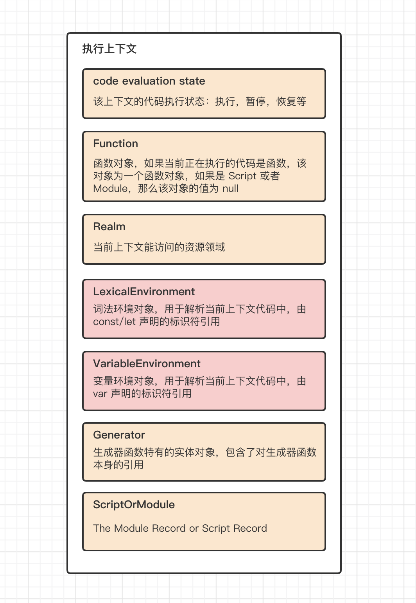
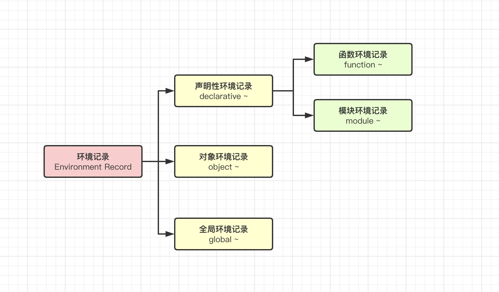
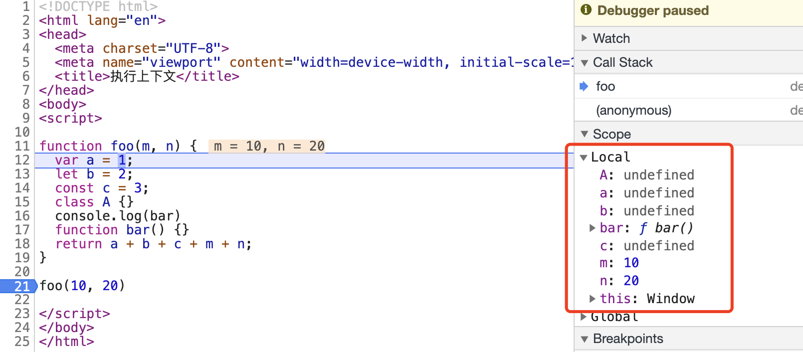

# 17-执行上下文

在 ECMAScript 中，执行上下文是一种用于跟踪代码执行状态的抽象规范。每一个函数调用，都会创建一个新的执行上下文。我们前面章节学过的**函数调用栈**，用于管理所有的执行上下文。在任何时候，只能有一个执行上下文正在执行，我们可以称之为**运行时上下文**「the running execution context」，运行时上下文始终处于栈顶。当代码执行过程中，有新的函数调用，新的执行上下文会被创建，入栈，并且成为新的运行时上下文。

执行上下文包含了跟踪对应可执行代码执行进度所需要的所有状态，每个执行上下文中都有特定的实体对象用于记录这些特定状态。学习执行上下文，除了要学会管理执行上下文的函数调用栈之外，还需要对组成执行上下文的实体对象有更加具体的理解。

## 01-执行上下文组成

在 ECMAScript 中，使用 Component 来统一称呼这些实体对象。



**code evaluation state**

该组件必包含。

当一个执行上下文处于栈顶时，该上下文正在执行，如果执行过程中有函数调用，那么该上下文就需要处于挂起状态，如果后续产生的新上下文执行完毕，该上下文需要从挂起状态中恢复并继续执行。因此每一个执行上下文在生命周期过程中，都包含不同的状态。code evaluation state 用于记录并控制上下文进入不同的状态中。

**Function**

该组件必包含。

function object，函数对象。可以通过函数表达式的形式被调用。普通对象包含 [[HasProperty]], [[GetOwnProperty]] 等内部方法，函数对象还额外包含 [[Call]] 与 [[Construct]] 两个内部方法。Call 表示函数可以被其他对象调用，Construct 表示函数可以被当成构造函数用于创建对象。

this 为内部方法 [[Call]] 的第一个参数。

当前执行上下文处于栈顶时，其对应的 Function Object 可以称为 active function object。

**Realm**

该组件必包含。

资源域。需要注意的是这个域也表示范围，但是它与作用域是不同的概念。它表示的是当前代码的运行环境范围。例如，两个不同的页面，对应两个不同的域。一个页面中，包含一个 iframe 标签，也表示他们是不同的两个域。

在代码执行之前，所有的代码都必须与一个域进行关联。从概念上来说，一个域由所有内置对象，全局环境，以及在该全局环境中加载的所有 ECMAScript 代码以及其他关联的状态和资源组成。

一个 Realm 域由一个 Realm 记录对象呈现，具体包含如下内部属性：

- [[Intrinsics]] 该属性对应所有的内置对象，例如 Map，JSON 等，以及一些全局方法 isNaN，[具体可查看](https://tc39.es/ecma262/#table-well-known-intrinsic-objects)
- [[GlobalObject]] 全局对象
- [[GlobalEnv]] 全局环境记录
- [[TemplateMap]] 模板对象列表
- [[HostDefined]] 保留供主机使用的字段，表示与领域相关联的其他信息，通常为 undefined

#### LexicalEnvironment

词法环境。具体体现为一个环境记录对象。let/const 声明的变量标识符，将会解析到该环境记录对象中。

关于环境记录对象的详细知识我们在下面中深入。

**VariableEnvironment**

变量环境。具体体现为一个环境记录对象。var 声明的变量标识符，将会解析到该环境记录对象中。

需要注意的是：词法环境与变量环境，都是词法环境对象，并且在初始化时，他们具备相同的值。之所以会在一个执行上下文中，同时存在功能类似的两个环境记录对象，原因在于 let/const 与 var 的不同。这是历史原因导致的。**在后续的内容中，如果没有特殊的说明，我们将词法环境和变量环境统称为词法环境。**

**ScriptOrModule**

该组件必包含

对应 script 标签或者模块。当代码处于其他环境时，该值为 null

## 02-环境记录对象

环境记录对象是执行上下文的重要组成部分。它用于根据代码的词法嵌套结构来绑定标识符与特定变量与函数之间的关联关系。因此每一个环境记录对象，都对应一些特定的语法结构。例如函数声明，try catch 等。

通俗来说，环境记录就是用于收集各种变量声明，函数声明等。

除此之外，每一个环境记录对象都有一个内部字段 [[OuterEnv]]，用于指向外部环境记录。

与执行上下文一样，环境记录是纯粹的规范机制，**无法从外部访问或者操作这些值。**

**环境记录的分类**

从大的分类来看，环境记录可以分为声明性环境记录「declarative Environment Record」，对象环境记录「object Environment Record」, 全局环境记录「global Environment Record」。其中函数环境记录与模块环境记录都属于声明性环境记录。

函数环境记录对应函数的调用。它包含了在函数内部所有声明的变量与方法。并且能够建立一个新的 this 绑定。还支持捕获 super 方法调用所需要的所有参数。

模块环境记录包含了所有顶层模块的声明。也包括显示导入的模块。他的内部属性 [[OuterEnv]] 指向全局环境记录。

对象环境记录主要对应的是 with 语句创建的上下文环境。

全局环境记录对应全局声明。它没有外部环境，内部属性 [[OuterEnv]] 的值为 null。它可能预装了标识符绑定，并且包括一个关联的全局对象，该对象的属性提供了某些全局环境的标识符绑定。在代码执行过程中，可以往该全局对象中添加新的属性并修改其值。

## 03-函数环境记录

函数环境记录应该是我们学习执行上下文时应该关注的重中之重。一个简单的函数记录示例如下

```javascript
function foo() {
  const a = 20
  const b = 30
  return a + b
}

// 那么 foo 对应的环境记录可以粗略表示为
fooRecord = {
  a: 20,
  b: 30,
  [[outerEnv]]: GlobalEnvironmentRecord,
}
```

在内部实现中，变量标识符与环境记录是绑定关系，我们这里只是使用 key-value 的形式来表达这种关系，并非真实呈现。每一个声明性环境记录通过 **var、const、let、class、module、import、function** 等方式与标识符进行绑定。

每个环境记录中都有如下方法

#### HasBinding(N)

判断当前环境记录中，是否存在字符串 N 的绑定，如果有返回 true，没有返回 false。

#### CreateMutableBinding(N, D)

在当前环境记录中，创建一个新的，但未被初始化的可变绑定。字符串 N 为该可变绑定的名称。D 为一个布尔类型的值，当该值为 true 时，该绑定可以被删除。

#### CreateImmutableBinding(N, S)

在当前环境记录中，创建一个新的，但未被初始化的不可变绑定。字符串 N 为该绑定的名称。S 为一个布尔类型的值，当该值为 true 时，无论是否处于严格模式，后续修改该绑定的值，都会抛出异常。

#### InitializeBinding(N, V)

设置当前环境记录中已经添加了绑定，但是未被初始化的值。N 为绑定的名称，V 为对应的值。

#### SetMutableBinding(N, V, S)

设置当前环境记录中，已经存在的可变绑定的值。N 为绑定的名称，V 为新的值。S 为一个布尔类型的值，如果为 true，并且无法设置绑定，则抛出 TypeError 异常。

#### GetBindingValue(N, S)

返回环境记录中已经存在的绑定的值。字符串值 N 是绑定名称。 S 用于标识源自严格模式代码的引用，或者以其他方式要求严格模式引用语义的引用。 如果 S 为 true 并且绑定不存在，则引发 ReferenceError 异常。 如果绑定存在但未初始化，则无论 S 的值如何，都会引发 ReferenceError。

#### DeleteBinding(N)

删除绑定

#### HasThisBinding()

判断当前环境记录是否建立了 this 绑定。

#### HasSuperBinding()

判断当前环境记录是否建立了 super 方法绑定

#### WithBaseObject()

如果该环境记录对象与 with 语句关联，则返回其关联的 with 对象。否则返回 undefined

使用表格整理如下：

| **HasBinding(N)**                | 判断当前环境记录中，是否存在字符串 N 的绑定，如果有返回 true，没有返回 false。                                                                                                                                                                                          |
| :------------------------------- | :---------------------------------------------------------------------------------------------------------------------------------------------------------------------------------------------------------------------------------------------------------------------- |
| **CreateMutableBinding(N, D)**   | 在当前环境记录中，创建一个新的，但未被初始化的可变绑定。字符串 N 为该可变绑定的名称。D 为一个布尔类型的值，当该值为 true 时，该绑定可以被删除。                                                                                                                         |
| **CreateImmutableBinding(N, S)** | 在当前环境记录中，创建一个新的，但未被初始化的不可变绑定。字符串 N 为该绑定的名称。S 为一个布尔类型的值，当该值为 true 时，无论是否处于严格模式，后续修改该绑定的值，都会抛出异常。                                                                                     |
| **InitializeBinding(N, V)**      | 设置当前环境记录中已经添加了绑定，但是未被初始化的值。N 为绑定的名称，V 为对应的值。                                                                                                                                                                                    |
| **SetMutableBinding(N, V, S)**   | 设置当前环境记录中，已经存在的可变绑定的值。N 为绑定的名称，V 为新的值。S 为一个布尔类型的值，如果为 true，并且无法设置绑定，则抛出 TypeError 异常。                                                                                                                    |
| **GetBindingValue(N, S)**        | 返回环境记录中已经存在的绑定的值。字符串值 N 是绑定名称。 S 用于标识源自严格模式代码的引用，或者以其他方式要求严格模式引用语义的引用。 如果 S 为 true 并且绑定不存在，则引发 ReferenceError 异常。 如果绑定存在但未初始化，则无论 S 的值如何，都会引发 ReferenceError。 |
| **DeleteBinding(N)**             | 删除绑定                                                                                                                                                                                                                                                                |
| **HasThisBinding()**             | 判断当前环境记录是否建立了 this 绑定。                                                                                                                                                                                                                                  |
| **HasSuperBinding()**            | 判断当前环境记录是否建立了 super 方法绑定                                                                                                                                                                                                                               |
| **WithBaseObject()**             | 如果该环境记录对象与 with 语句关联，则返回其关联的 with 对象。否则返回 undefined                                                                                                                                                                                        |

对于函数环境记录而言，除了上面列举的方法之外，还包含了一些其他的字段

| **[[ThisValue]]**         | 对应上下文中的 this 指向                                                                                                               |
| :------------------------ | :------------------------------------------------------------------------------------------------------------------------------------- |
| **[[ThisBindingStatus]]** | 其值可能为 lexical/initialized/uninitialized. 当值为 lexical 时，表示该函数为一个箭头函数，不存在 this 值                              |
| **[[FunctionObject]]**    | 调用函数时创建的函数对象                                                                                                               |
| **[[HomeObject]]**        | 该属性默认值为 undefined，如果函数不为箭头函数，该属性用于与 super 关联                                                                |
| **[[NewTarget]]**         | 如果当前环境记录是通过内部方法 [[Construct]] 创建，则 [[NewTarget]] 的值为 [[Construct]] 方法的 newTarget 属性。否则，该值为 undefined |

同时还包含如下一些方法

| **BindThisValue(V)** | 设置内部属性 [[ThisValue]] 的值，当其值已经被初始化时，记录其状态                                                                                            |
| :------------------- | :----------------------------------------------------------------------------------------------------------------------------------------------------------- |
| **GetThisBinding()** | 返回此环境记录的 this 绑定的值。 如果此绑定尚未初始化，则抛出 ReferenceError。                                                                               |
| **GetSuperBase()**   | 返回作为此环境记录中绑定的 super 属性访问基础的对象。该对象是从此环境记录的 [[HomeObject]] 字段派生而来。 值 undefined 表示 super 属性访问将产生运行时错误。 |

这里需要重点关注的是，在函数环境记录对象中，存在一个 this 属性。该属性在函数声明时并不确定，只有在函数被调用时，才能明确得知该值的具体指向。

通过以上的知识，我们可以总结出，执行上下文的生命周期大概如下：

## 04-变量提升

环境记录用于收集各种声明的绑定。在内部实现中，我们可以关注环境记录用于初始化变量声明绑定的方法的描述，例如 **CreateMutableBinding，** 该方法用于创建一个新的未被初始化的可变绑定，这里我们重点关注「未被初始化」几个字，也就意味着，此方法将会用于收集某种声明，并且不会立即赋值。可以用一个简单的例子验证。

使用 let 声明一个变量 a，并且在声明之前访问该变量。注意观察报错信息。

```javascript
console.log(a) // Uncaught ReferenceError: Cannot access 'a' before initialization

let a = 20
```

Cannot access 'a' before initialization，未初始化之前不能访问变量 a。也就意味着，当我们使用 console.log 访问 a 时，a 已经完成了绑定，只不过还没有赋值。

这就是变量提升。在代码执行之前，环境记录会提前收集所有的声明绑定。

当我们把上面例子中，变量声明的方式由 let 修改为 var 时，变量提升的影响会变得更为明显。在声明之前访问变量 a 的值，会发现该值为 undefined。这也是 let/const 与 var 的不同之处。

```javascript
console.log(a) // undefined

var a = 20
```

undefined 并非表达一个具体的值，而只是一个代指，表示没有任何值，编译之后也不会存在 undefined。因此 undefined 可以表示为未被初始化。而只有 null 才表达一个空值。因此大多数情况下使用 undefined 容易造成误解。由于历史原因，之前版本使用 var 来声明变量，并使用 undefined 来表示该变量未被初始化，此时在声明之前访问变量 a，就不会产生报错。从而让许多人在使用过程中，由于变量提升带来了许多负面影响。因此 ES6 中，新的声明方式 let/const 避免了这种误解产生，在声明之前访问之前抛出异常。

上面的例子可以表达为

```javascript
var a = undefined
console.log(a)
a = 20


<!-- 或者内部实现可以体现为 -->
// 初始化阶段创建绑定
envRec.CreateMutableBinding('a', true)

// 执行阶段设置值
console.log(a)
envRec.SetMutableBinding('a', 20, true)
```

使用 function 关键字声明的函数，在变量提升中的体现与 var/let/const 都不一样。function 声明的函数，在初始化时，就会直接赋值指向对应的函数体。

```javascript
console.log(foo) // ƒ foo() {}

function foo() {}
```

使用 class 声明的对象，在变量提升中的体现与 let/const 一致。

```javascript
console.log(A) // Uncaught ReferenceError: Cannot access 'A' before initialization

class A {}
```

新版本中的异常提示：在初始化之前不能访问变量，是在传递一种弱化变量提升概念的意图，变量提升是之前版本对于 undefined 的理解带来的历史遗留问题。本质的核心是我们应该理解在执行上下文的创建阶段，环境记录对象会提前收集所有的声明绑定。而在代码执行阶段才会针对每个变量绑定进行赋值操作。

## 05-Local 对象

在作用域链的章节中，我们知道，对于一个函数而言，完整的作用域包含一个函数自身的 Local 对象。

Local 对象，由**函数参数，var 声明的变量，let/const 声明的变量，function 声明的变量，class 声明的变量，this 指向等**共同组成。

仅仅只有处于栈顶的执行上下文，才会生成 Local 对象。并且 Local 对象的具体内容会在执行上下文的生命周期中不断变化。也就意味着，在执行上下文的创建阶段，只有函数参数、function 声明的变量、this 指向 能够明确具体的值，其他变量的初始值都为 undefined，然后在代码执行过程中逐步明确赋值。



需要注意的是，Local 对象与环境记录对象非常相似，但他们并非相同的对象。不过这样的差别仅仅只是体现在具体的实现上，从理解执行上下文运行机制的理论角度来说，我们可以认为他们是同一个对象。

## 06-思考题

如下代码中，函数 bar 的 Local 对象中，是否包含变量 a ？

```javascript
function foo() {
  var a = 20

  function bar() {
    a = 30
    console.log(a)
  }

  bar()
}

foo()
```

---

我们能够在代码的任何地方，直接访问 Math 对象，为什么？在执行上下文中是如何体现的？
