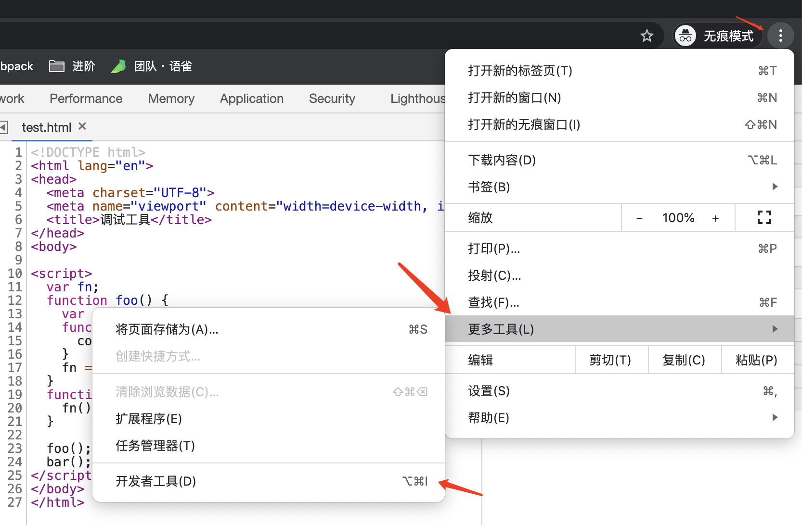
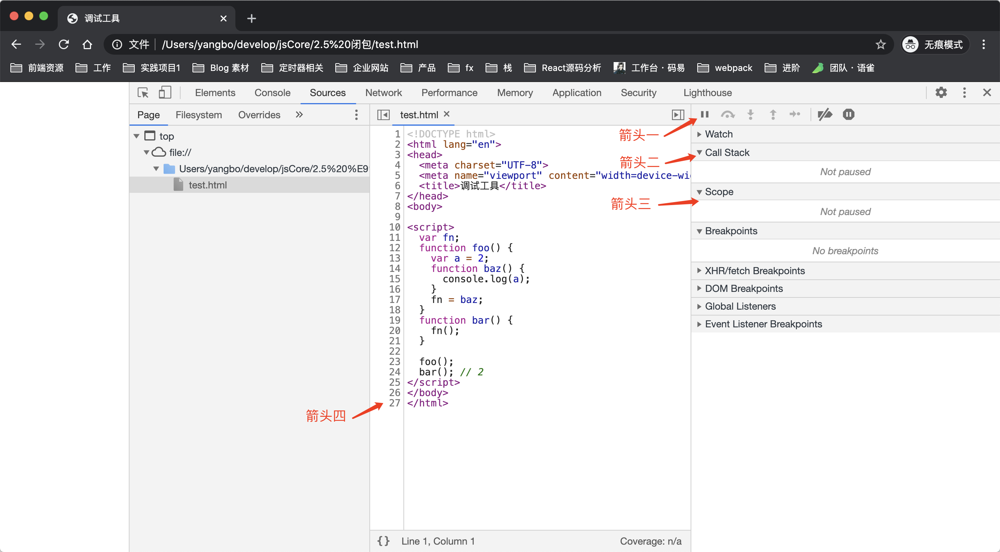
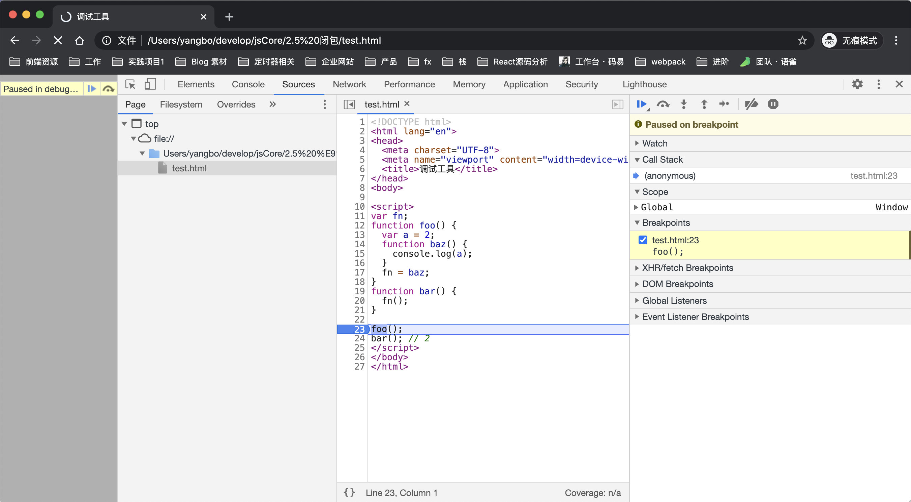
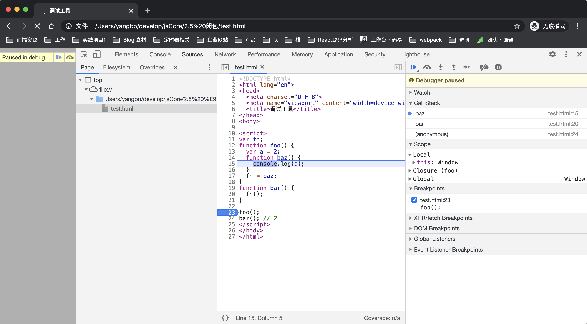
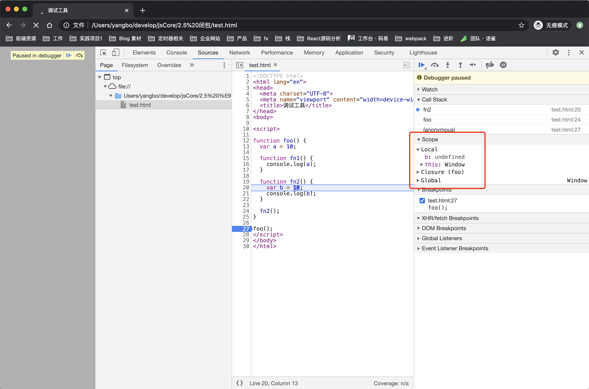

# 21-chrome 调试工具

前端迅猛发展，知识也会过时。

也许前面我们学的某个知识点，在未来的某个节点就会悄然发生变化，因此我们需要掌握一些技能，来确保知识发生变化时，我们能够具备辨别自己所学知识是否发生了变差的能力。

而这里，我们将要掌握的一个非常重要的技能，叫做**断点调试。**

在 chrome 的开发者工具中，通过断点调试，我们可以非常方便的一步一步观察代码在执行过程中的细节变化。能够直观的感受到函数调用栈，作用域链，闭包，this 等关键信息的变化过程，因此断点调试对于快速定位问题，了解代码执行过程有着非常重要的作用，这也是我们前端开发必不可少的一个高级技能。

## 01-认识断点调试工具

通过下面的方式，在最新版本的 chrome 浏览器中，调出开发者工具

浏览器页面右上角竖着的三点 -> 更多工具 -> 开发者工具 -> Sources

得到的界面如下，我将我们需要关注的重点使用箭头标注出来



**箭头一** 指向的区域有一排图标。

可以通过这一排图标来控制函数的执行过程，从左到右他们依次是：

**resume/pause script execution** 恢复/暂停脚本执行

**step over next function call** 跨过。实际表现是不遇到函数时，执行下一步，遇到函数时，不进入函数执行上下文

**step into next function call**跨入。实际表现是不遇到函数时，执行下一步，遇到函数时，进入函数执行上下文

**step out of current function**跳出当前函数

**step**单步执行，遇到函数，进入函数执行，表现与 step into 大致相同。

**deactivate breakpoints**停用/启用断点

**don't pause on exceptions**不暂停异常捕获

其中，step over，step into，step out 是在调试过程中，使用最多的三个动作。

**箭头二**所指的区域为 call Stack，当前的函数调用栈。

**箭头三**所指的区域为 Scope，当前函数的作用域链。其中 Local 对象表示当前正在执行的活动对象，Closure 表示闭包对象。我们可以借助此处对作用域链的展示，观察到闭包。

**箭头四**所指的区域，表示代码的行数，当我们点击某一行时，可以在该行设置一个断点。设置断点后刷新页面，代码会执行到断点位置处暂停，这时我们就可以通过上面介绍的几个图标操作调试我们的代码了。

> 在单独的变量声明「没有赋值操作」与函数声明的那一行，无法设置断点

## 02-案例一

```javascript
var fn
function foo() {
  var a = 2
  function baz() {
    console.log(a)
  }
  fn = baz
}
function bar() {
  fn()
}

foo()
bar() // 2
```

这是一个闭包的案例，我们可以先思考一下闭包是如何产生的，然后通过调试工具来验证自己的想法是否正确。

在函数 foo 中，声明了函数 baz，并且 baz 访问了 foo 中声明的变量，因此，此时闭包产生。fn 在 foo 中获得了 baz 的引用，因此当 fn 执行时，其实就是 baz 在执行。

**第一步：** 设置断点，经过简单的分析可以看出，代码的执行阶段，是从 foo() 开始的，在这里设置一个断点。然后刷新页面。

此时函数调用栈中，只有一个匿名函数，这里表达的是 script 标签的上下文环境。

```javascript
CallStack = [anonymous]
```

当前代码的执行环境的作用域链，是全局对象，因此只包含了全局对象 Global

```javascript
Scope = [Global]
```

**第二步：** 多次点击 step into，该按钮能够让代码按照正确的执行顺序，一步一步向下执行，注意观察每一次点击之后，相关信息的变化。

多次点击，直到函数 baz 执行，如图所示

此时的函数调用栈中，已经有了多个函数

```javascript
CallStack = [baz, bar, anonymous]
```

正在执行的函数 baz ，处于栈顶

与此同时，Scope 也表达的是函数 baz 的完整作用域链

```javascript
Scope = [Local, Closure(foo), Global]
```

我们要关注代码执行过程中，各个变量的变化情况，以及调用栈与作用域链的变化。

我们继续关注一个特殊的例子

## 03-案例二

```javascript
function foo() {
  var a = 10

  function fn1() {
    console.log(a)
  }

  function fn2() {
    var b = 10
    console.log(b)
  }

  fn2()
}

foo()
```

花一点时间思考一下，当函数 fn2 执行时，对 fn2 来说，有没有闭包？

答案是有的。

根据闭包的定义来看，fn1 在 foo 的内部声明，并且访问了在 foo 中声明的变量，闭包就会产生。但是对于 fn2 来说，这并不属于定义的范围。那 fn2 的作用域链中，为什么会有一个闭包对象呢？

我们知道，闭包是在解析过程时产生，而此时的闭包，并非由 fn2 与 foo 的关系产生。而是 fn1 与 foo 产生。一次同时我们还知道，原则上来说，作用域链会包含每一个上层作用域中的变量对象，但是因为 v8 引擎在实现过程中，如果发现当前函数中，没有访问上层变量对象中的方法就不会再创建一个变量对象放入到 [[Scopes]] 属性中，这是一个优化方案。而此时，既然 foo 的闭包对象已经产生，那么对于 fn2 来说，已经产生的闭包对象就不会被优化，闭包对象对于 fn1 和 fn2 来说，**是共享的。**

关于闭包的共享特性，我们在闭包章节的例子中也有体现，大家可以回过头去温习一下那个案例。

## 04-思考题

你能总结出代码中，哪些地方能够打断点，哪些地方不能打断点吗？
