# 52-事件循环

事件循环机制「Event Loop」，负责是整个 JavaScript 执行环境的代码执行顺序的问题。

> 准确的说，事件循环机制，是执行环境的机制，不是 JavaScript 的机制。函数调用栈是 JavaScript 的代码顺序机制。

在前面我们的章节已经学习到，如果没有异步事件，函数调用栈能够负责几乎所有的代码执行顺序问题。

但是异步事件的存在，让代码执行顺序变得更加复杂。

例如下面的例子

```javascript
setTimeout(() => {
  console.log('index 1')
}, 1000)

console.log('index 2')
```

setTimeout 是一个很常见的异步事件。回调函数中的 `index 1` 并不会马上执行，而是要等到 1s 之后才会执行。

而 `index 2` 则会立即执行。

事件循环机制，就是异步事件代码执行顺序的解决方案。

因此，在此之前，我们要学习在浏览器中，到底有哪些异步事件。以及他们各自有什么特点。

## 1-线程


完整的理解事件循环机制，一定要对 JavaScript 执行环境的线程有非常清晰的认知。因为许多异步事件，都是由线程负责处理。

JavaScript 是一个单线程的语言。

但是 JavaScript 的执行环境，是由多个线程协同工作的结果。不同的线程，对应着不同的异步事件。我们一一简单了解一下。

### **GUI 渲染线程**

> 更详细的与性能有关的渲染知识，点击 https://xiaozhuanlan.com/topic/4203159786

GUI 负责浏览器界面 HTML 元素的渲染。

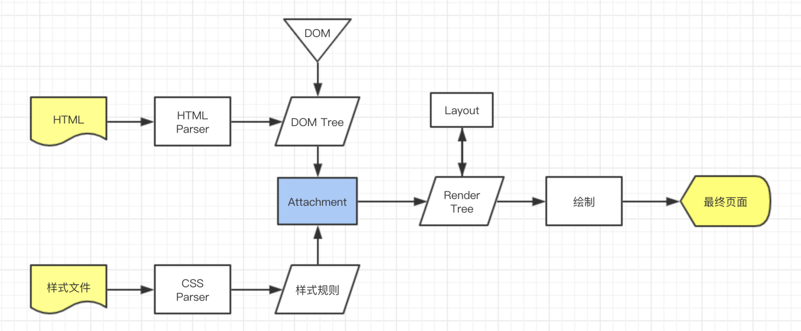

图中的样式规则，就是 CSSOM。

和常规的认知不同的是，**DOM 的渲染过程，是异步的。**

用一个简单的例子来验证这个结论。

```html
<!DOCTYPE html>
<html>
  <head>
    <meta charset="UTF-8" />
    <title>DOM 渲染是否异步</title>
  </head>

  <body>
    <div id="d">默认文本</div>
    <script>
      d.onclick = function () {
        console.log('开始更改DOM')
        this.innerHTML = '往div里添加的新文本' //更改一个节点
        console.log('DOM 更改完毕')
        document.body.appendChild(document.createElement('input')) //插入一个节点
        for (var i = 0; i < 10000000000; i++);
        console.log('xxxx')
      }
    </script>
  </body>
</html>
```

这段代码的核心，是使用大数据量的 for 循环拉长 JavaScript 代码的执行时间，让执行步骤能够清晰的被感知。

用常规思维分析一下这段代码的执行顺序。

当我点击 div 时。按照顺序，执行过程应该如下

```
1. 打印 开始更改DOM
2. 修改 div 的文本内容为 "往div里添加的新文本"
3. 打印 DOM 更改完毕
4. 插入新的 input 节点
5. 循环
6. 打印 xxxx
```

可事实上并非如此。

验证一下，真实的执行顺序为

```
1. 打印 开始更改DOM
2. 打印 DOM 更改完毕
3. 循环
4. 打印 xxxx

// DOM 的渲染，实际上最后才执行
5. 修改 div 的文本内容为 "往div里添加的新文本"
6. 插入新的 input 节点
```

我们可以发现，UI 的渲染，明显滞后于代码的执行位置。

因此我们可以得出结论，UI 的渲染过程，与 setTimeout 类似，都被事件循环机制，放在了后面执行。

> 需要注意的是，div 的文本内容修改，是同步修改 DOM 的结构，但是 DOM 结构修改之后，并没有立刻渲染到页面中，这里是两个步骤。
>
> 场景：改变已经存在的 DOM
>
> 这里涉及到的更深层的问题，是对 DOM 的理解。DOM 本质是一个 JS 对象。因此操作 DOM 和渲染 DOM 是不同的。操作 DOM 本质上是操作 JavaScript 对象，这是同步的过程。渲染 DOM，是 GUI 线程来完成的工作，这是异步的。
>
> DOM 跟 React 的虚拟 DOM，几乎是一样的逻辑。

### **JavaScript 引擎线程**

浏览器并不能直接运行 JavaScript 代码。需要在浏览器中植入内核，为 JavaScript 的运行提供环境。chrome 中，这个内核就是 V8。

每一个网页进程，浏览器只会启动一个 JavaScript 引擎线程来配合完成网页的交互。

### **定时器线程**

setTimeout、setInterval 的逻辑是由专门的定时器线程在负责。

写入定时器回调函数中的逻辑并不会立刻执行，即使我们将时间设置为 0.

```javascript
setTimeout(() => {
  console.log('定时器的回调逻辑')
}, 0)
console.log('代码的最后位置')

// 执行结果
// 代码的最后位置
// 定时器的回调逻辑
```

### **I/O 事件触发线程**

当我们鼠标点击、滑动，键盘输入等都会触发一些事件。而这些事件的触发逻辑的处理，就是依靠事件触发线程来完成。

与上面的线程一样，该线程会把事件的逻辑放入队列之中，等待 JavaScript 引擎处理。

### **http 线程**

http 线程的主要作用，是使用无状态短连接的 http 请求，在应用层基于 http 协议的基础之上，达到与服务端进行通信的目的「在服务端，也会有专门的 http 线程来处理通信过程」。

当然，该线程的触发逻辑，事件监听等也不是在 JS 引擎线程中，这个过程仍然是异步的。

### **requestAnimationFrame 「简称：raf」**

可能新人朋友对这个 api 不是很熟悉，但是他却是动画的重要实现手段。必须要掌握。这也是一个异步方式。他和前面介绍的异步方式大有不同，跟 UI render 紧密相关。

该方法使用非常简单。

```javascript
requestAnimationFrame(() => {
  console.log('requestAnimationFrame')
})
```

要正确的理解它，必须需要结合浏览器的渲染机制来共同理解。

常规显示器的刷新率为 60Hz，也就是说，1 秒钟把页面刷新 60 次，是最合理的频率。

> 当然，如果是其他刷新频率，会根据刷新率动态调整

这也是浏览器在进行 UI render 的合理频率。因此，每一次的渲染时间，都应该控制在 1000 / 60 ms 以内。对于浏览器来说，这样的频率才不会超负荷工作。

requestAnimationFrame 是完全符合浏览器刷新频率的回调方式。

我们通常喜欢将一次 UI render 描述为一帧「frame」。

顾名思义，**requestAnimationFrame 的回调，只会在每一帧开始渲染之前执行。**


### **requestIdleCallback 「简称：ric」**

ric 也能执行一个回调函数，通常我们会将优先级不高的任务放在 ric 中执行。它的执行频率也跟 UI render 的频率是一样。**但是它会在每一帧的最后执行。**

这样的目的，是为了利用空闲时间，执行优先级不高的任务。如上图。

## 2-Promise

在浏览器中，线程对应的异步事件，并不能涵盖所有的异步事件类型。

Promise 就是一个特例。

Promise 是 JavaScript 的内部逻辑，并非由浏览器额外的线程来执行。因此，Promise 的异步逻辑与线程对应的异步逻辑是不一样的。

在 JavaScript 引擎的处理逻辑中，Promise 有自己的事件队列，并且该队列在所有 JavaScript 代码执行完成之后执行。

简单梳理一下 Promise 的队列扭转逻辑，该逻辑来源于 ECMAScript 标准。

现有简单的示例代码如下

```javascript
// 创建一个 promise 实例
const p = new Promise((resolve, reject) => {})

p.then(f, r)
```

### **job**

我们在 `then` 中添加的回调函数，就是一个 job。也就是此处的 f 与 r。catch 同理。

### **执行队列**

ECMAScript 提供了一个用于存储 Promise 异步逻辑的队列 `PromiseJobs`。

**该队列中的逻辑在所有 JS 代码执行完之后执行。**

> 或者说，在 call stack 清空之后执行

### **状态**

一个 promise 实例有三种状态，

- pending：等待结果状态
- fulfilled：已出结果，结果符合预期完成状态
- rejected：已出结果，结果不符合预期完成状态

当一个 promise 实例创建时，初始处于 pending 状态。

pending 状态中，不会向 PromiseJobs 队列中加入任何 job。

当 resolve 函数调用时，pending -> fulfilled

当 reject 函数调用时，pending -> rejected

当 promise 的状态有了结果，不再是 pending，那么我们称该 promise 的状态被固定：settled。

### **何时进入队列 PromiseJobs**

当代码中调用 `p.then(f, r)` 时，会将 job `f` 放入 `[[PromiseFulfillReactions]]` 队列尾部。将 job `r` 放入 `[[PromiseRejectReactions]]` 队列尾部。

此处的两个队列，是临时中间队列，该队列中的 job 只会移入到 PromiseJobs 队列中而不会有自己的执行过程。PromiseJobs 才有执行 job 的逻辑。

当 `resolve/reject` 调用，promise 状态产生了结果，此时会根据不同的结果：`p.then(f, r)`，将不同的 job「f/r」 加入到 PromiseJobs 队列中。

如果在创建 promise 对象时，就已经 settled，那么 job 会直接进入到 PromiseJobs 队列中。

```javascript
const p = new Promise((resolve, reject) => {
  // 直接敲定状态
  resolve()
})
```

链式调用时，后续的 then 如何将 job 加入到 PromiseJobs 队列，需要根据上一个 then 的反馈结果来决定。

当不确定返回结果时，而 then 函数已经调用，那么，对应的 job 放入临时队列中。

确定了返回结果之后，才会将 job 移入到 PromiseJobs 队列中。

### **PromiseJobs 队列如何执行**

经过之前的知识，我们已经知道 job 何时进入 PromiseJobs 队列。那么进入队列之后，job 是如何执行的呢？

当然，队列的执行逻辑很简单，就是直接先进入的 job 先执行。但是这里有一个需要注意的地方在于，当 job 执行时，又会产生新的 job 进入到该队列。因此 PromiseJobs 在执行过程中会动态变化。

PromiseJobs 的执行有如下规则：

1. 当所有的代码执行完毕，PromiseJobs 的队列开始出队执行。
2. PromiseJobs 处于动态变化中，只有当 PromiseJobs 队列为空时，才会结束执行。即使 job 在执行过程中，产生了新 job 加入队列。

文字表达可能难以理解，我们可以用下面的代码来表达同样的含义

```javascript
const PromiseJobs = []

let job
// 将先进入队列的 job 移出队列，并执行
// 每一个job 的执行过程，都有可能向 PromiseJobs 队列中添加新的 Job，因此这里只能使用 while 来处理这种动态循环才符合场景，而不能使用 for 循环
while ((job = PromiseJobs.shift())) {
  job()
}
```

那么我们来分析一下下面例子的执行顺序。

```javascript
const p1 = new Promise((resolve) => {
  resolve()
})
  .then(function f1() {
    console.log(1)
    const p2 = new Promise((resolve) => {
      resolve()
    })
      .then(function f3() {
        console.log(2)
      })
      .then(function f4() {
        console.log(4)
      })
  })
  .then(function f2() {
    console.log(3)
  })

console.log(0)

// 执行结果为 0 1 2 3 4
```

p1 实例在创建时，直接调用了 resolve，状态也直接被固定。因此 f1 能马上加入到 PromiseJobs 队列。

但是 f2 却不行。因为 f2 是否加入该队列，需要得到 f1 的执行结果。因此此时 f2 进入临时队列

```javascript
PromiseFulfillReactions = [f2]
PromiseJobs = [f1]
```

p1 的声明逻辑代码结束之后，还有一个 console.log 逻辑，此时直接执行，首先输出 0.

此时所有的代码已经执行完毕，开始执行 `PromiseJobs` 队列中的逻辑。队列中只有 f1，因此执行 `f1()`

f1 执行，先输出 1，然后下面的代码发现又声明了一个新的 Promise 对象，并且该对象在创建时状态一样直接被固定，因此 f3 可以直接进入 PromiseJobs，但是 f4 却需要知道 f3 的执行结果才能确定是否加入 PromiseJobs，此时 f4 进入临时队列

```javascript
PromiseFulfillReactions = [f2, f4]
PromiseJobs = [f3]
```

当 f1 执行完毕，可以得知 f1 返回了 undefined，根据 Promise 链式调用的传递规则，当上一个 then 的 job 返回 undefined，等价于 `resolve(undefined)`。

此时 f1 有了执行结果，f2 就能够明确如何响应，此时 f2 进入 PromiseJobs

```javascript
PromiseFulfillReactions = [f4]
PromiseJobs = [f3, f2]
```

f1 执行完毕之后，PromiseJobs 中还有 job，继续执行。此时 f3 在队列首位， f3 执行。输出 2

```javascript
PromiseFulfillReactions = [f4]
PromiseJobs = [f2]
```

f3 执行完毕之后，返回 undefined，因此 f4 进入 PromiseJobs 队列

```javascript
PromiseFulfillReactions = []
PromiseJobs = [f2, f4]
```

然后依次执行 f2, f4，没有产生新的 job，PromiseJobs 队列变成空，当前循环结束。

```javascript
PromiseFulfillReactions = []
PromiseJobs = []
```

这里需要注意的是，PromiseJobs 的逻辑，其实是 JavaScript 代码的内部逻辑，不会因为在 Job 的执行过程中产生了新的 Job，就认为一轮循环的结束。而是要直接将队列中的 job 执行到不会产生新的 Job，才算结束。

### **PromiseJobs 的逻辑是一个内循环。**

我们也可以使用同样的逻辑，自定义新的内循环。

简单调整上面的例子，

```javascript
const p1 = new Promise((resolve) => {
  resolve()
})
  .then(function f1() {
    console.log(1)
    const p2 = new Promise((resolve) => {
      resolve()
    })
      .then(function f3() {
        console.log(2)
      })
      .then(function f4() {
        console.log(4)
      })
  })
  .then(function f2() {
    console.log(3)
    const queue = []

    // 定义一个事件分发器
    function rafx(cb) {
      queue.push(cb)
    }

    rafx(() => {
      console.log(0.1)
    })

    rafx(() => {
      console.log(0.2)

      rafx(() => {
        console.log(0.21)
      })
    })

    rafx(() => {
      console.log(0.3)
    })

    rafx(() => {
      console.log(0.4)
    })

    rafx(() => {
      console.log(0.5)
    })

    let cb
    while ((cb = queue.shift())) {
      cb()
    }
  })

console.log(0)
```

我在 f2 中，定义了一个队列，queue，queue 队列不为空，f2 的执行就不会结束。大家通过代码，感受一下结果。

同样的道理，大家可以分析一下如下代码的执行顺序

```javascript
new Promise((resolve) => {
  resolve()
})
  .then(() => {
    new Promise((resolve) => {
      resolve()
    })
      .then(() => {
        console.log(1)
      })
      .then(() => {
        console.log(2)
      })
      .then(() => {
        console.log(3.1)
      })
  })
  .then(() => {
    console.log(1.1)
    new Promise((resolve) => {
      resolve()
    })
      .then(() => {
        new Promise((resolve) => {
          resolve()
        })
          .then(() => {
            console.log(4)
          })
          .then(() => {
            console.log(6)
          })
      })
      .then(() => {
        console.log(5)
      })
  })
  .then(() => {
    console.log(3)
  })
console.log(0)
```

## 3-事件循环机制

我们已经知道，单纯的依靠 call stack 不能完全的覆盖所有的代码执行逻辑，call stack 的代码执行顺序永远都是同步的逻辑。对于许多线程引发的异步逻辑，则需要依靠队列机制。


每一个异步行为，都有对应的执行队列。

**执行队列**：会在一轮循环中直接执行的队列，例如 PromiseJobs

**临时队列**：不会马上执行，处于等待状态的任务队列，在 promise 中，有两个临时队列，PromiseFulfillReactions 与 PromiseRejectReactions。再满足条件之后，才会将该队列中的任务，移入执行队列中。有的临时队列的名称又被称为 Event Table.

目前我们知道的执行队列有：

---

**scriptJobs**：指的是 script 标签，代码执行的起点

> 当有多个 script 标签时，不同的浏览器对该队列的理解和实现差别很大，因此这里我们不讨论这种情况

---

**rafs**：requestAnimationFrame 对应的队列

**UI render**：渲染 UI 的任务队列

**ric**：requestIdleCallback 对应的队列

---

**event queue**：I/O 事件队列

**timer Queue**：定时器队列，由 setTimeout/setInterval 分发

**http queue**：http 队列

---

**PromiseJobs**：Promise 队列，由 p.then 分发

---

> 因为每一种队列都有各自很鲜明的特点，因此我们这里就不简单粗暴的把这些异步队列划分为宏任务队列还是微任务队列。而是直接明确的以队列名来进行理解。如果非要这样理解，那么除了 PromiseJobs，其他的都可以理解为宏任务。有的浏览器，把 scriptJobs 理解为更顶层的宏任务，因为差别太大，这里我们不深入探讨，大家可以自行研究

**关于临时队列的理解：**

通常，在我们的代码中，setTimeout，事件 I/O，http 请求，都会通过回调的方式，编写这些事情完成之后的逻辑。

例如

```javascript
function foo() {
  // 点击之后执行的逻辑
}
d.onclick = foo
```

foo 就是回调函数。

这些逻辑不会立刻执行，而是要等到条件满足之后才会执行。

因此，与 Promise 的逻辑一样，不会直接把这些回调函数放到执行队列中去，而是先注册在一个叫做 `Event Table` 的临时中间列表中。

> 叫法不重要，也有叫别的名字。核心是中间临时队列

条件满足之后，才会将这些回调逻辑，放入到执行队列中。

执行队列中的每一个任务，都是在主线程中，依托于函数调用栈来执行。因此

**同一时间，不会存在有两个任务同时执行的情况。**

> UI 渲染也是一个任务，也不会与其他任务同时执行，因此我们常常说，UI 渲染与 js 代码是互斥的关系。

我们知道，PromiseJobs 是内循环，所以一轮循环的起点，永远都不可能从 PromiseJobs 中开始。

UI render 的渲染，由 GUI 执行。因此 UI render 队列，也不会是一轮循环的起点。

除此之外，其他的所有队列中任务「称之为 task」，都有可能是一轮循环的起点。

**所有的背景与基础都了解之后，接下来这段内容特别重要**

事件循环的顺序，决定了 JavaScript 代码的执行顺序。它从 script 开始第一次循环。

1. 所有能作为起点的队列中的任务，都是进入主线程执行，借助函数调用栈，依次执行，直到 PromiseJobs 为空，当次任务结束。PromiseJobs 是 task 的内循环。
2. 当次任务执行过程中，可能会产生新的任务，这些任务会放入到临时队列或者下一次循环的执行队列，当次循环的执行队列是执行一个少一个，直到清空为止。
3. 多个执行队列之间存在先后关系

raf -> ui render -> [event，http，timer] -> ric

> 中括号的先后关系不同浏览器实现不同，我认为谁先谁后影响不大，所以统一理解为 task


1. `raf | ui render | ric` 三个队列中的 task 不会每次循环都执行，他们的执行频率要和刷新率保持一致。因此很多次循环中，他们都不会执行「执行队列为空」
2. 任务分发时，多半都是进入临时队列，满足条件之后，进入执行队列。
3. 当次循环所有的执行队列都清空之后，一轮循环完毕。一轮循环完毕的标志是最后一个 task 中的内循环 PromiseJobs 队列清空。
4. 下一轮循环从执行队列中的第一个任务继续开始执行，直到当次执行队列清空为止

我们在理解时，还需要特别关注的是任务进入执行队列的时机。

以 setTimeout 为例。

```javascript
document.onclick = () => {
  console.log('s')
  setTimeout(() => {
    console.log(0)
  }, 0)

  setTimeout(() => {
    console.log(1)
  }, 1000)

  setTimeout(() => {
    console.log(2)
  }, 2000)

  for (var i = 0; i < 5000000000; i++);
  console.log('e')
}

// 点击之后的输出结果
// 先立刻输出 s
// 10s 之后，依次快速输出
// e 0 1 2
```

这个例子中，我希望每隔 1s 执行一个任务。因此 setTimeout 的时间一次为 0，1000， 2000。但是最终的结果呢，我们会发现，0、1、2 会同时先后输出。

分一下：

setTimeout 执行时，三个 task 进入了临时队列。

但 for 循环的执行时间非常长，超过了 setTimeout 的设定时间，因此，在 for 循环的执行过程中，定时器线程发现 timer 临时队列中的任务满足了条件，就直接放入到了执行队列。

只要 for 循环的时间超过了 3s，此时三个 task 都会已经进入到了执行队列。所以就直接执行了。

到这里，还能看懂的点个赞啊！

我们再来分析一下 setInterval 和 setTimeout

先说 setInterval，一个简单的例子如下：

```javascript
setInterval(function f1() {
  func()
}, 100)
```

调用 `setInterval` 时，将 f1 放入临时队列。每隔 100 ms，会将 f1 这个任务，重复的放入 执行队列中。

这个时候就会有一个问题，如果任务 f1 的执行时间，超过了 100 ms。那么一轮循环里，执行队列里，就必然会出现多个 f1 的任务。这个时候，timer 的队列，原本只应该有一个，但是出现了多个，就会让循环的时间拉长，后面队列的任务就会等待更多时间。

假设 f1 的执行时间是 200ms

```javascript
// 第一轮循环，时间不满足 100 ms ，因此 timer 执行队列为空
// 第二轮循环，时间超出了 100ms，进入一个任务到执行队列
;[][f1][
  // f1 执行，但是执行时间是 200ms，因此这个时候，定时器线程会推送 2个 f1 到执行队列
  (f1, f1)
][
  // 第三轮循环，要把这两个执行完，总耗时 400ms，那么就会被推入 4 个 task
  (f1, f1, f1, f1)
][
  // 第四轮需要 800ms 执行完，这个时候就能推送 8 个任务
  (f1, f1, f1, f1, f1, f1, f1, f1)
]

// 依次类推，阻塞会越来越严重
```

所以在 chrome 中，为了弱化这种情况的影响，tiemr 队列往往会放在最后执行「仅仅比 ric 早」。它有可能会让别的队列任务等待更多的时间。

也正是由于这个原因，我们应该避免使用 setInterval，不合理的使用可能会造成页面严重卡顿。

我们常常使用 `setTimeout` 的递归调用来取代 setInterval

```javascript
function fn() {
  console.log(2)
  // 这句代码一定要放在最后
  setTimeout(fn, 100)
}

fn()
```

这种递归的方式，每次 fn 执行完的时候，才会 push 一个任务到临时队列。然后临时队列满足 100ms 的时间之后推入执行队列。执行队列再次执行 fn 时，才会又分发一个新的 task 到临时队列。

也就是说，执行队列中的任务始终都只会有一个。所以，即使 fn 的执行时间超过了 100ms，它的影响也仅此而已，不会像 setInterval 那样持续累加。

我们再通过两个例子来分析一下事件循环的执行顺序。

```javascript
setTimeout(function s1() {
  console.log(5)
}, 1)

setTimeout(function s2() {
  console.log(6)
}, 0)

new Promise(function (resolve) {
  console.log(1)
  for (var i = 0; i < 1000; i++) {
    i == 99 && resolve()
  }
  console.log(2)
}).then(function p1() {
  console.log(4)
})

console.log(3)
```

首先，起手式。事件循环从 script 开始。此时，只有 scriptJobs 队列中有任务。

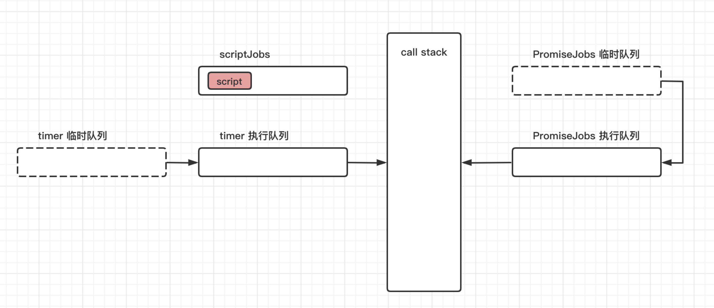

然后进入到代码在主线程中执行，首先执行第一个 setTimeout 函数, setTimeout 函数进入到 call stack

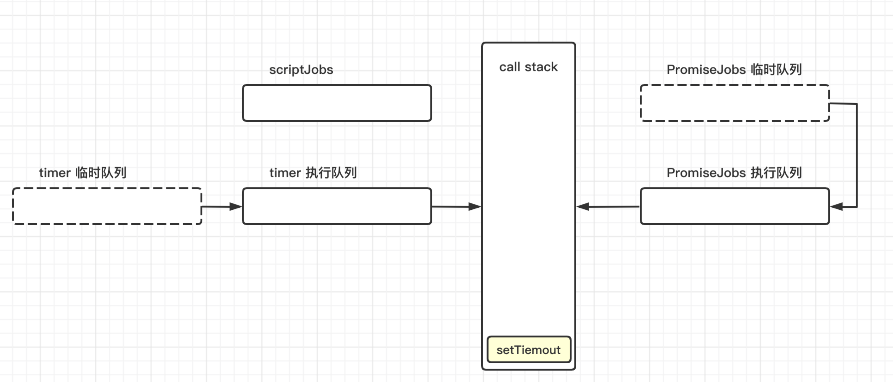

setTimeout 分发一个 task s1 进入到临时队列，1ms 时间太短，因此会立刻进入到执行队列。

如果改成 2ms ，就可能不会这么快，这里取决于调度的执行时间

> 临时队列的虚线框，表示曾经存在过，已经不在了

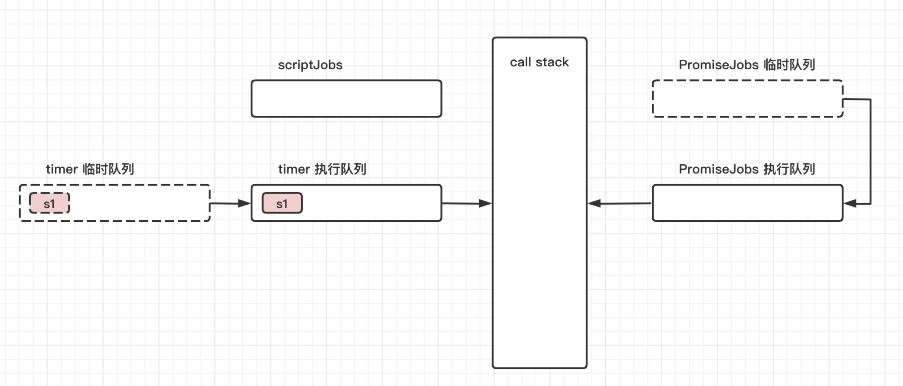

第一个 setTimeout 执行完，第二个 setTimeout 进入调用栈执行

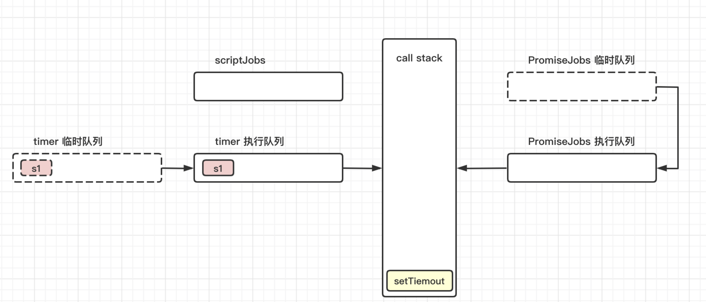

第二个 setTimeout 分发 task s2，因为延迟时间为 0，因此直接进入执行队列

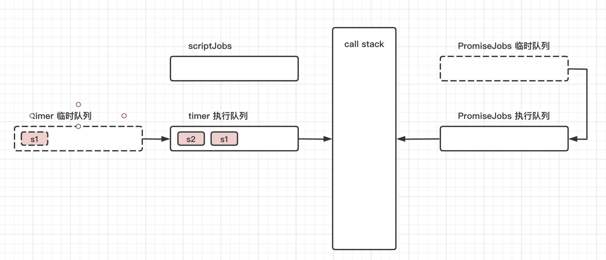

接下来代码执行到 Promise 的创建，因此 Promise 构造函数进栈

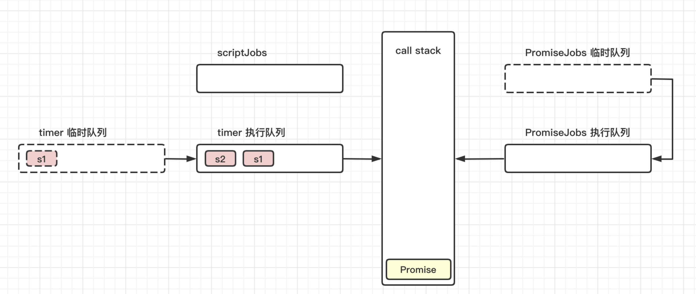

构造函数中的第一个参数为一个函数，我们命名为 executor，该函数会在 Promise 内部直接执行

因此 executor 进栈


executor 的执行，会依次输出 1，执行 resolve，然后输出 2，这个过程中，resolve 进栈

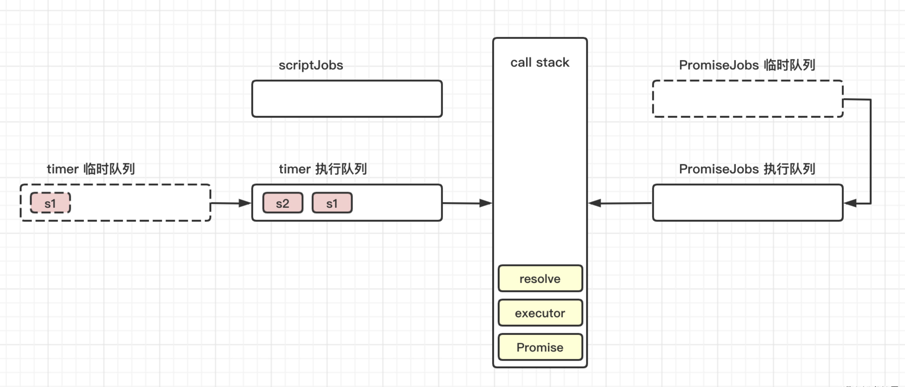

执行完之后，对应的函数依次出栈

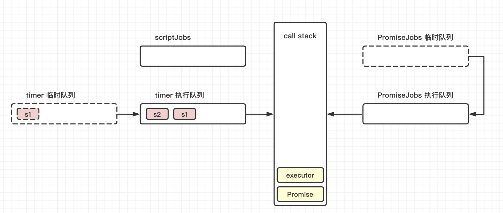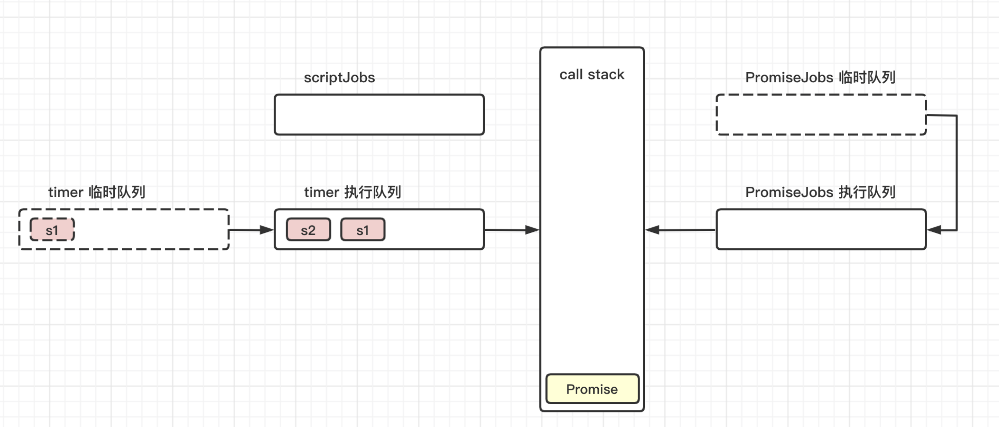

Promise 执行完之后，接着执行 then 方法，因此，then 进栈

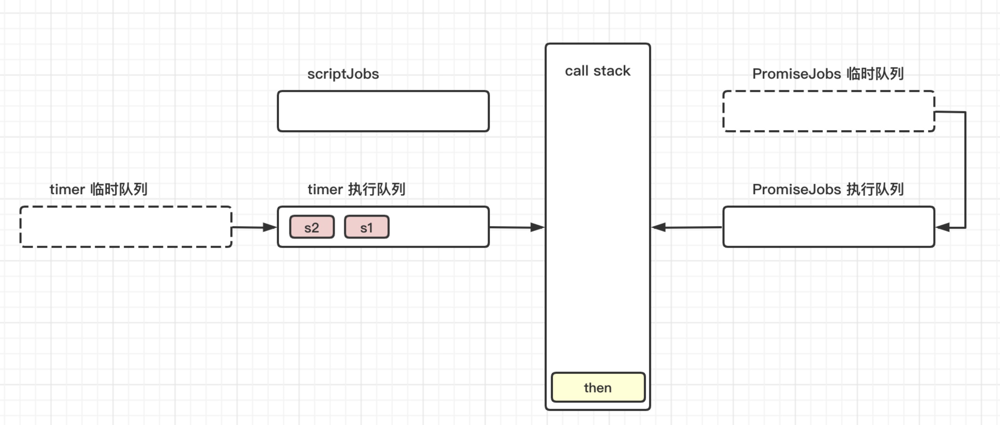

then 方法是 Promise 的异步分发器。因此 p1 本来应该直接进入 Promise 的临时队列。但是 resolve 已经直接执行过，状态被固定，因此已经知道如何执行，这里 p1 直接进入执行队列 PromiseJobs

p1 进入 PromiseJobs 队列之后，then 执行完毕，then 出栈，这里的步骤在图中合并一下

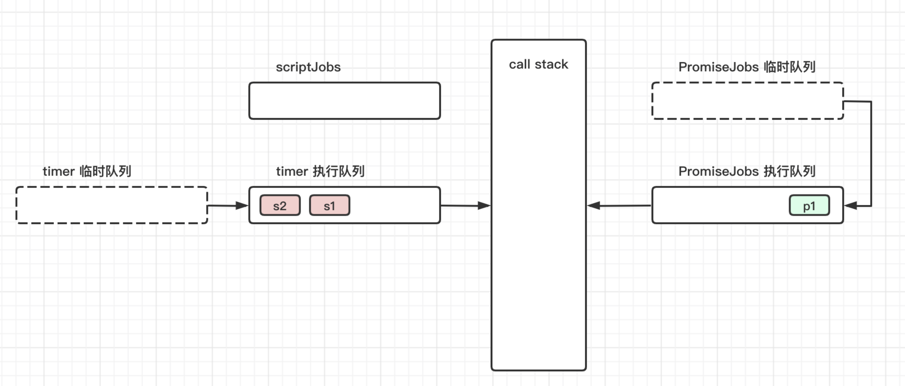

最后执行 console.log(3) ，这里的 log 方法也有一个执行进栈，执行完出栈的过程，前面相关的过程在图中是省略掉的。

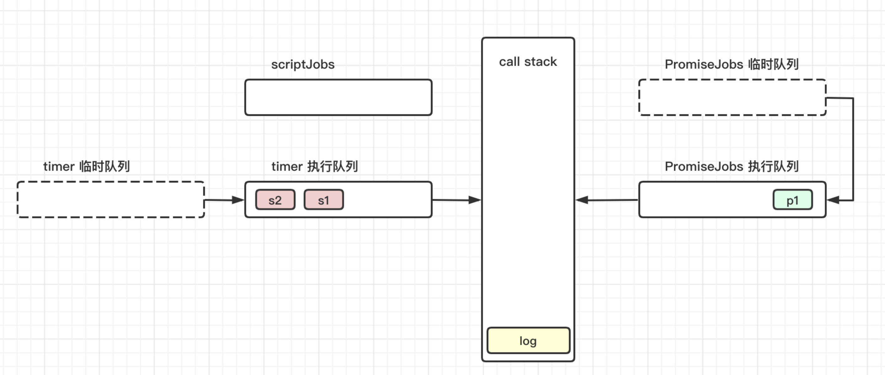

到这里，主线程中的代码已经被执行完毕了，同时调用栈也被清空。

因此接下来就需要执行 PromiseJobs 内循环。

p1 出队，并进入到调用栈中执行

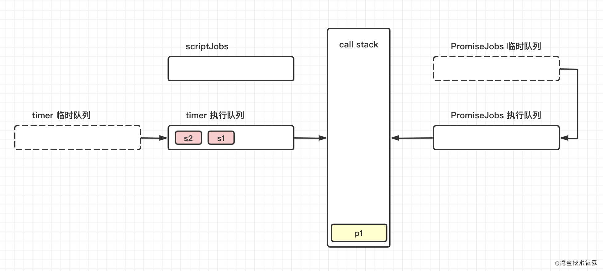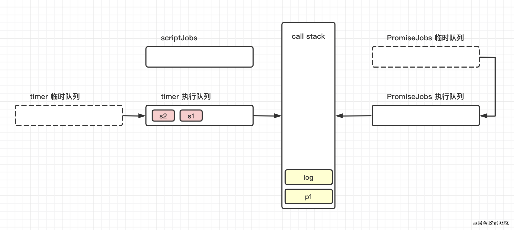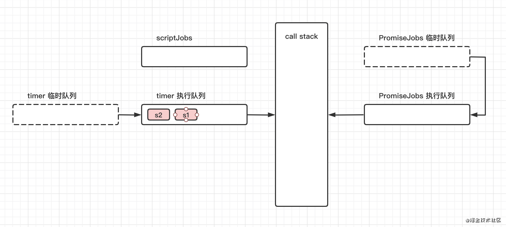

当 p1 执行完毕，我们发现 PromiseJobs 里也已经清空。内循环执行完毕。

当轮循环产生的 setTimeout 的任务，应该放在下一轮循环执行。从这个角度理解，第一轮的事件循环就已经结束了。此时我们需要从其他队列开始第二轮循环。

> 「也可以不用理解为第二轮循环，」

这个时候发现，只有 timer 执行队列里有内容。因此从 timer 队列开始出队执行，此时 s1 出队，并入栈执行。

s1 执行，输出 5

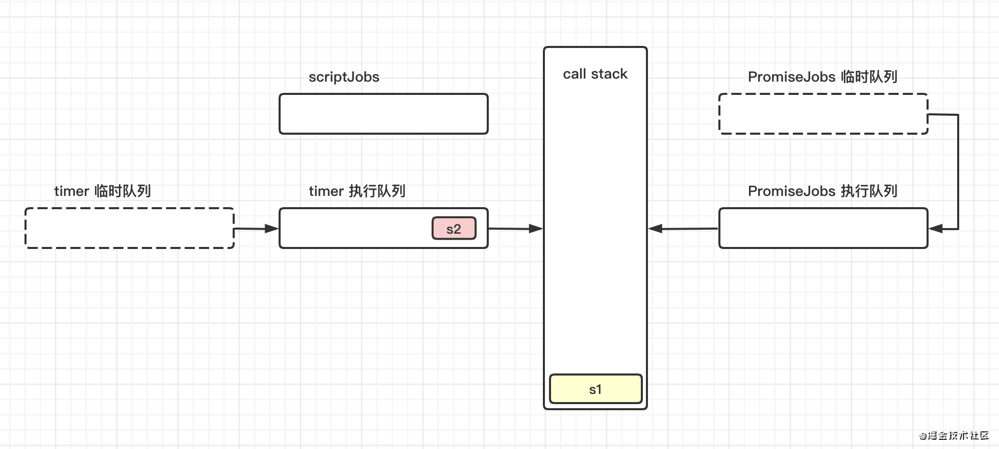

s1 执行完毕之后，出栈

s2 出队、入栈执行，输出 6

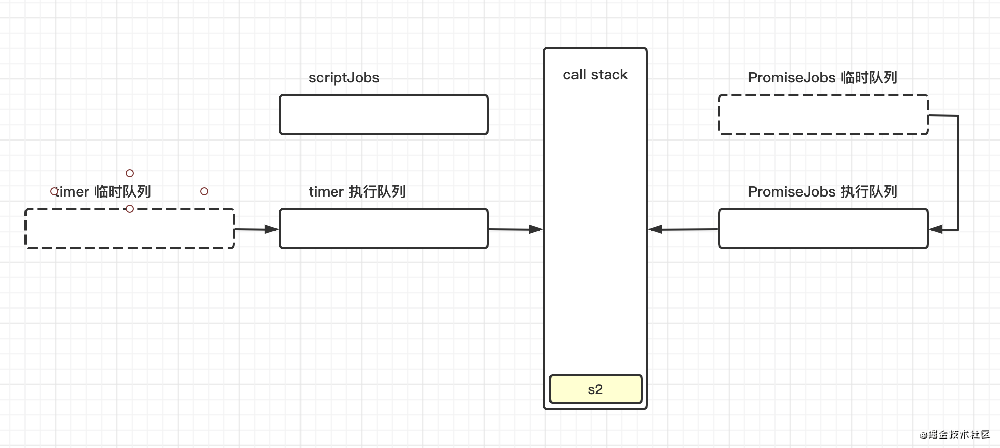

最后 s2 执行完毕，出栈


s2 执行完之后，所有的代码都执行完了，队列也被清空了，表示程序的可执行代码执行完毕。

上面我们已经模拟了一个内循环的事件分发器，我们也可以模拟一个外循环的事件分发器。

简单实现一个没有临时队列的简易版。

```javascript
// 用数组模拟一个队列
var tasks = []

// 模拟一个事件分发器
var addFn1 = function (task) {
  tasks.push(task)
}

// 执行所有的任务
var flush = function () {
  tasks.map(function (task) {
    task()
  })
}

// 最后利用setTimeout/或者其他你认为合适的方式丢入事件循环中
setTimeout(function () {
  flush()
})

// 当然，也可以不用丢进事件循环，而是我们自己手动在适当的时机去执行对应的某一个方法
var dispatch = function (name) {
  tasks.map(function (item) {
    if (item.name == name) {
      item.handler()
    }
  })
}

// 当然，我们把任务丢进去的时候，多保存一个name即可。
// 这时候，task的格式就如下
demoTask = {
  name: 'demo',
  handler: function () {},
}

// 于是，一个订阅-通知的设计模式就这样轻松的被实现了
```
