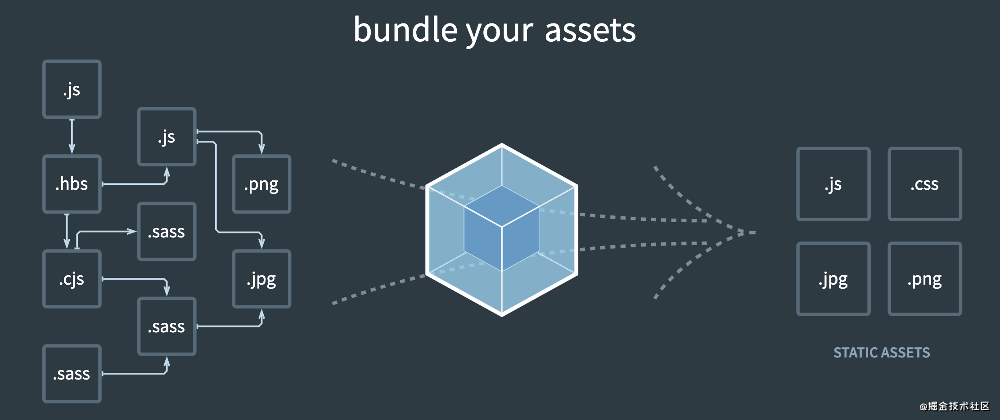
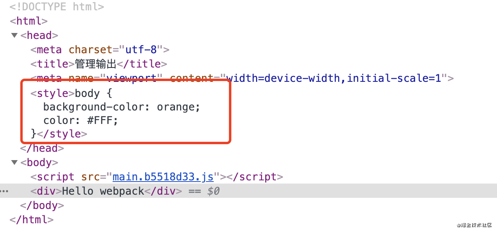
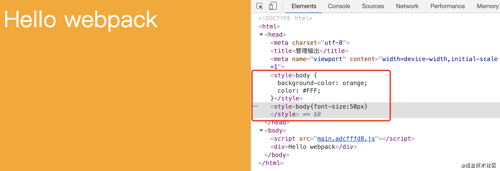

# 58-webpack



webpack 是一个资源打包工具。

对于 webpack 来说，每一个资源，都被看成是一个模块，而不仅仅只是 js 文件。

得益于 webpack 的这个特性，我们可以将一个组件的所有资源，以模块的形式组合成为一个整体，成为组件。

也正因为得益于 webpack 等打包工具，让前端工程化得以持续推进。create react app 也是基于 webpack 集成的脚手架工具。因此，webpack，是前端进阶的必备技能。

本文会给大家介绍一下 webpack，为深入学习它抛砖引玉。

本文项目地址：[点击这里](https://github.com/yangbo5207/jsCore/tree/master/7.2webpack)

## 01-安装

首先我们创建一个目录，并在该努力下初始化项目，以及安装 webpack，webpack-cli

```bash
// 初始化 npm 项目
npm init -y
npm install webpack webpack-cli --save-dev
```

新增 `.gitignore` 文件，文件内容如下，忽略掉一些不需要提交到原创仓库的代码。

```
# See https://help.github.com/articles/ignoring-files/ for more about ignoring files.

# dependencies
/node_modules
/.pnp
.pnp.js

# testing
/coverage

# production
/build

# misc
.DS_Store
.env.local
.env.development.local
.env.test.local
.env.production.local

npm-debug.log*
yarn-debug.log*
yarn-error.log*
```

我们案例中，需要工具模块 lodash ，因此提前安装它

```bash
npm install lodash --save
```

在根目录下新增入口 html 文件 `index.html`

```html
<!DOCTYPE html>
<html>
  <head>
    <meta charset="utf-8" />
    <title>webpack 起步</title>
  </head>

  <body>
    <script src="./src/index.js"></script>
  </body>
</html>
```

然后在根目录创建 `src` 目录，并在 src 目录下，创建入口 js 文件 `index.js`

```javascript
// src/index.js
import _ from 'lodash'

function component() {
  const element = document.createElement('div')
  element.innerHTML = _.join(['Hello', 'webpack'], ' ')

  return element
}

document.body.appendChild(component())
```

我们可以直接执行如下指令，开始打包。

```javascript
npx webpack

// 该指令运行的是 `./node_modules/.bin/webpack` 文件，
// 该文件为一个二进制文件
```

此时会将 `src/index.js` 作为入口起点，并将打包的结果放入 `dist` 目录中「打包时自动生成」。

此时没有自动生成 html 文件，因此我们手动创建一个，内容跟上面的 `index.html` 一样，但是引入的 js 文件，要修改成为打包生成的 `main.js`

```html
dist/index.html
<!DOCTYPE html>
<html>
  <head>
    <meta charset="utf-8" />
    <title>webpack 起步</title>
  </head>

  <body>
    <script src="./main.js"></script>
  </body>
</html>
```

我们在浏览器中运行 `dist/index.html`，如果发现页面显示结果为 `Hello webpack`，表示我们的目的已经达到。打包结果符合预期。

## 02-配置文件

我们仍然需要一个配置文件去明确的告诉 webpack，打包开始时，入口文件是什么，打包之后应该放在哪里，用什么样的方式打包等。

根目录下创建 `webpack.config.js`

```javascript
const path = require('path')

module.exports = {
  entry: './src/index.js',
  output: {
    filename: 'main.js',
    path: path.resolve(__dirname, 'dist'),
  },
}
```

entry：表示入口，用于告诉 webpack 应该使用哪个模块来作为构建其内部依赖图的开始。默认值是 `src/index.js`。

output：表示打包结果，用于告诉 webpack 在哪里输出它创建的 bundle 文件，以及如何命名这些文件。默认值为 `dist/main.js`，其他生成的文件默认放置在 `dist` 目录中。

执行如下指令就可以开始依据配置文件打包

```bash
npx webpack --config webpack.config.js
```

但是这样太麻烦了，我们可以利用 `package.json` 中的 `scripts` 字段，来配置快捷指令。

```json
{
  "name": "7.2webpack",
  "version": "1.0.0",
  "description": "",
  "main": "index.js",
  "scripts": {
    "test": "echo \"Error: no test specified\" && exit 1",
+   "build": "webpack --config webpack.config.js"
  },
  "keywords": [],
  "author": "",
  "license": "ISC",
  "devDependencies": {
    "webpack": "^5.15.0",
    "webpack-cli": "^4.3.1"
  },
  "dependencies": {
    "lodash": "^4.17.20"
  }
}
```

然后，我们就可以使用 `npm run build` 来代替之前的指令打包了。

目前打包仍然不会自动创建一个 html 文件，因此使用同样的方式手动创建并验证打包结果。

借助一个插件 `HtmlWebpackPlugin` 可以自动生成 html 文件

先在项目中安装他

```
npm install html-webpack-plugin --save-dev
```

然后修改 `webpack.config.js` 中的逻辑

```javascript
const path = require('path')
const HtmlWebpackPlugin = require('html-webpack-plugin')

module.exports = {
  entry: './src/index.js',
  output: {
    filename: '[name].bundle.js',
    path: path.resolve(__dirname, 'dist'),
  },
  plugins: [
    new HtmlWebpackPlugin({
      title: '管理输出',
    }),
  ],
}
```

此时我们修改了两个地方，一是新增了 `HtmlWebpackPlugin` 插件的逻辑，用于自动生成入口 html 文件。二是调整了 output 中 filename 的规则。

执行 `npm run build` 打包观察结果。

我们会发现 dist 中自动生成了 `main.bundle.js` 文件 与 `index.html` 文件。并且 `index.html` 中还正确的引入了 `main.bundle.js`。

我们还可以修改 output 中 filename 的规则，加入 hash 值，确保每次打包的文件名都不一样，避免浏览器缓存。

```javascript
const path = require('path');
const HtmlWebpackPlugin = require('html-webpack-plugin');

module.exports = {
  entry: './src/index.js',
  output: {
    filename: '[name].[chunkhash:8].js',
    path: path.resolve(__dirname, 'dist'),
  },
  plugins: [
    new HtmlWebpackPlugin({
      title: '管理输出',
    }),
  ]
};
[name].[chunkhash:8].js` 生成 8 位 hash 值。对应的结果可能为 `main.b99bd253.js
```

多打包几次，我们会发现 dist 中的内容越来越多，因此我们需要一个清理 dist 目录的插件。

> 每次打包之前，需要修改模块的内容，否则 webpack 感知到模块没有变化，就会生成 hash 值相同的文件，文件数量就不会越来越多

安装 `clean-webpack-plugin`

```javascript
npm install --save-dev clean-webpack-plugin
```

然后修改 `webpack.config.js` 加入该插件的执行逻辑

```javascript
const path = require('path');
const HtmlWebpackPlugin = require('html-webpack-plugin');
+ const { CleanWebpackPlugin } = require('clean-webpack-plugin');

module.exports = {
  entry: './src/index.js',
  output: {
    filename: '[name].[chunkhash:8].js',
    path: path.resolve(__dirname, 'dist'),
  },
  plugins: [
+   new CleanWebpackPlugin(),
    new HtmlWebpackPlugin({
      title: '管理输出',
    }),
  ]
};
```

现在，重新 build 看看效果。

## 03-Loader

Loader 在 webpack 充当了重要的角色。它是一个资源文件加载器。Loader 应该在模块加载之前，对该文件进行编译、压缩等。

- 处理一个文件可以使用多个 Loader，Loader 的执行顺序与配置正好相反，最后一个 Loader 先执行。
- 第一个执行的 Loader 接收源文件内容作为参数，其它 Loader 接收前一个执行的 Loader 的返回值作为参数

> Plugin 插件主要用于扩展 webpack 的能力，改变 webpack 的最终输出结果。

新增 `src/index.css` ，我们希望在 index.js 中引入该模块

```css
body {
  background-color: orange;
  color: #FFF;
}
// src/index.js
import _ from 'lodash'
+import './index.css'

function component() {
  const element = document.createElement('div');
  element.innerHTML = _.join(['Hello', 'webpack'], ' ');

  return element;
}

document.body.appendChild(component());
```

如果我们直接打包的话，会出现错误，因为 webpack 目前还不认识 `.css` 后缀的模块。因此需要 `css-loader` 来帮助我们识别它

安装 `css-loader`

```bash
npm install --save-dev css-loader
```

除此之外，我们还需要一个能够帮助 css 写入 html 文件中 style 的 Loader

```bash
npm install --save-dev style-loader
```

然后修改 webpack.config.js，新增 相关 Loader 的配置规则

```javascript
const path = require('path')
const HtmlWebpackPlugin = require('html-webpack-plugin')
const { CleanWebpackPlugin } = require('clean-webpack-plugin')

module.exports = {
  entry: './src/index.js',
  output: {
    filename: '[name].[chunkhash:8].js',
    path: path.resolve(__dirname, 'dist'),
  },
  module: {
    rules: [
      {
        test: /\.css$/,
        use: [
          { loader: 'style-loader' },
          {
            loader: 'css-loader',
            options: {
              modules: true,
            },
          },
        ],
      },
    ],
  },
  plugins: [
    new CleanWebpackPlugin(),
    new HtmlWebpackPlugin({
      title: '管理输出',
    }),
  ],
}
```

重新 build 之后发现，css 样式已经写入进来了



如果我们要加载 `.scss` 文件，需要安装一个新的 Loader，`sass-loader`，由于 `sass-loader` 还依赖 `node-sass`，因此这两个依赖包一起安装

```bash
npm i node-sass sass-loader --save-dev
```

然后针对 `.scss` 文件配置规则，webpack.config.js 修改如下

```javascript
const path = require('path')
const HtmlWebpackPlugin = require('html-webpack-plugin')
const { CleanWebpackPlugin } = require('clean-webpack-plugin')

module.exports = {
  entry: './src/index.js',
  output: {
    filename: '[name].[chunkhash:8].js',
    path: path.resolve(__dirname, 'dist'),
  },
  module: {
    rules: [
      {
        test: /\.css$/,
        use: [
          { loader: 'style-loader' },
          {
            loader: 'css-loader',
            options: {
              modules: true,
            },
          },
        ],
      },
      {
        test: /\.(sc|sa)ss$/,
        use: ['style-loader', 'css-loader', 'sass-loader'],
      },
    ],
  },
  plugins: [
    new CleanWebpackPlugin(),
    new HtmlWebpackPlugin({
      title: '管理输出',
    }),
  ],
}
```

随便写一个 `test.scss`，并在 index.js 中引入，打包后验证一下结果

```scss
body {
  font-size: 50px;
}
// src/index.js
...
import './test.scss'
...
```

最后结果如图，字体确实生效。



我们还可以利用内置的 `Asset Modules`，将图片作为一个模块进行引入。

修改 `webpack.config.js` 配置文件如下

```javascript
const path = require('path');
const HtmlWebpackPlugin = require('html-webpack-plugin');
const { CleanWebpackPlugin } = require('clean-webpack-plugin');

module.exports = {
  entry: './src/index.js',
  output: {
    filename: '[name].[chunkhash:8].js',
    path: path.resolve(__dirname, 'dist'),
  },
  module: {
    rules: [
      {
        test: /\.css$/,
        use: [
          {loader: 'style-loader'},
          {
            loader: 'css-loader',
            options: {
              modules: true
            }
          }
        ]
      },
      {
        test: /\.(sc|sa)ss$/,
        use: [ 'style-loader', 'css-loader', 'sass-loader']
      },
+     {
+       test: /\.(png|svg|jpg|jpeg|gif)$/,
+       type: 'asset/resource'
+     }
    ]
  },
  plugins: [
    new CleanWebpackPlugin(),
    new HtmlWebpackPlugin({
      title: '管理输出',
    }),
  ]
};
```

然后在 `src` 目录下放置一张图片，`inbox.jpg`，并修改 `src/index.js`

此时，我们把该图片当成了一个模块在处理

```javascript
import _ from 'lodash'
import './index.css'
import './test.scss'
+import Inbox from './inbox.jpg'

function component() {
  const element = document.createElement('div');
  element.innerHTML = _.join(['Hello', 'webpack'], ' ');

+ const img = new Image()
+ img.src = Inbox
+ element.appendChild(img)

  return element;
}

document.body.appendChild(component());
```

build 之后发现，图片已经正常的进入到了页面。

其他的很多资源，包括 字体文件，`.xml/.json/.csv` 等格式的数据，都可以通过对应的方法，最终在逻辑里当成模块进行处理。

资源的处理我们此处只是抛砖引玉，大家要深入学习，还需要结合官方文档进一步加强，包括配置规则具体详情等。

[官方文档：资源管理](https://webpack.docschina.org/guides/asset-management/#loading-css)

## 04-dev server

每次我修改了代码，如果每次都只能执行 `npm run build` 之后，我才能看到我改变的效果，这样开发效率就太低了。

我希望能够修改代码之后，就能够快速看到效果，浏览器自动更新视图或者逻辑。

`webpack-dev-server` 能够满足我的需求。

先安装它

```
npm install --save-dev webpack-dev-server
```

然后新增配置如下：

```javascript
const path = require('path');
const HtmlWebpackPlugin = require('html-webpack-plugin');
const { CleanWebpackPlugin } = require('clean-webpack-plugin');

module.exports = {
  mode: 'development',
  entry: './src/index.js',
  output: {
    filename: '[name].[chunkhash:8].js',
    path: path.resolve(__dirname, 'dist'),
  },
+ devServer: {
+   contentBase: './dist',
+   inline: true
+ },
  module: {
    rules: [
      {
        test: /\.css$/,
        use: [
          {loader: 'style-loader'},
          {
            loader: 'css-loader',
            options: {
              modules: true
            }
          }
        ]
      },
      {
        test: /\.(sc|sa)ss$/,
        use: [ 'style-loader', 'css-loader', 'sass-loader']
      },
      {
        test: /\.(png|svg|jpg|jpeg|gif)$/i,
        type: 'asset/resource'
      }
    ]
  },
  plugins: [
    new CleanWebpackPlugin(),
    new HtmlWebpackPlugin({
      title: '管理输出',
    }),
  ]
};
```

并且在 `package.json` 中新增快捷指令运行 dev server。

```json
{
  "name": "7.2webpack",
  "version": "1.0.0",
  "description": "",
  "main": "index.js",
  "scripts": {
    "test": "echo \"Error: no test specified\" && exit 1",
+   "start": "webpack serve --open",
    "build": "webpack --config webpack.config.js"
  },
  "keywords": [],
  "author": "",
  "license": "ISC",
  "devDependencies": {
    "clean-webpack-plugin": "^3.0.0",
    "css-loader": "^5.0.1",
    "html-webpack-plugin": "^4.5.1",
    "node-sass": "^5.0.0",
    "sass-loader": "^10.1.1",
    "style-loader": "^2.0.0",
    "webpack": "^5.15.0",
    "webpack-cli": "^4.3.1",
    "webpack-dev-server": "^3.11.2"
  },
  "dependencies": {
    "lodash": "^4.17.20"
  }
}
```

现在，我们只需要执行指令 `npm start`，浏览器就会自动加载页面，访问 `http://localhost:8080/` ，并且当我们有任何修改时，浏览器都会自动刷新。

[进一步学习 dev server](https://webpack.docschina.org/configuration/dev-server/)

## 05-小结

本文只是简单的给大家分享了 webpack 的强大能力，最关键的是我们要通过实际操作，去体会在 webpack 中模块的真实含义。以增强对于组件化的思维理解。

create-react-app 是更健全更为强大的脚手架工具，我们后面的案例依然会使用它，但是它也是基于 webpack 完善而来。如果我们要深入学习 webpack，大家可以通过官方文档进一步学习

推荐学习路径：[概念](https://webpack.docschina.org/concepts/) -> [指南](https://webpack.docschina.org/guides/) -> [配置](https://webpack.docschina.org/configuration/) -> [Loader](https://webpack.docschina.org/loaders/) -> [Plugin](https://webpack.docschina.org/plugins/) -> [API](https://webpack.docschina.org/api/)
