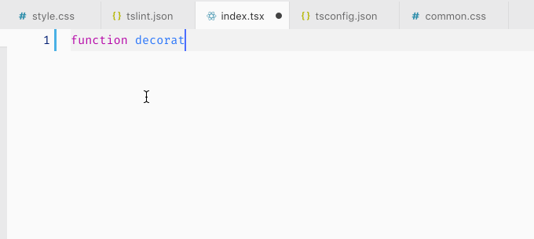
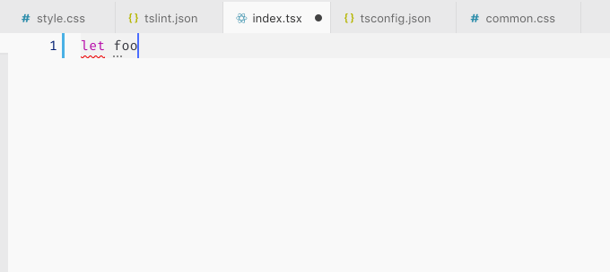
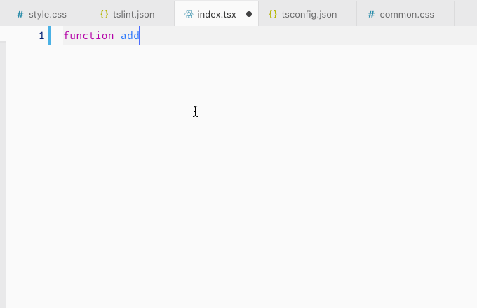
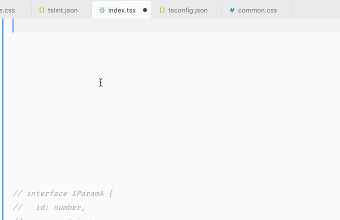
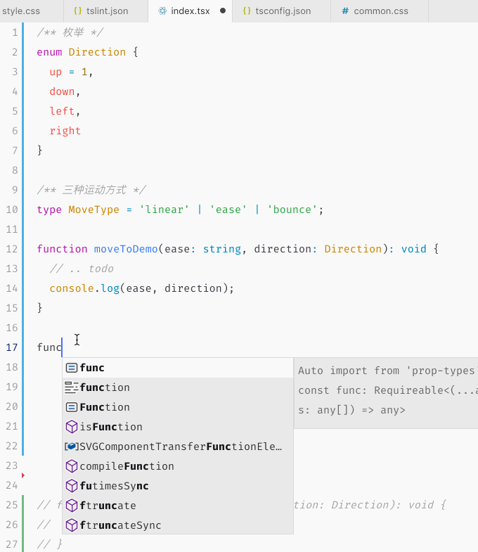
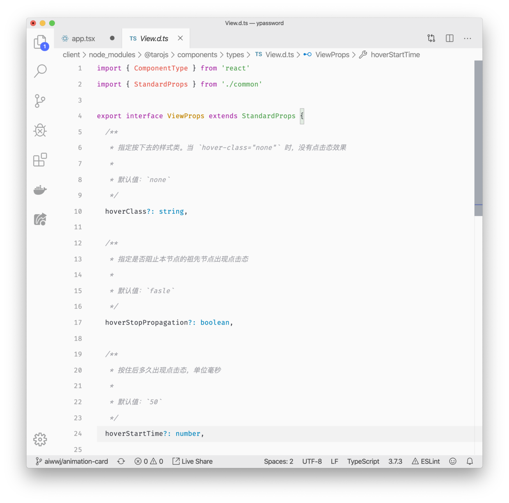

# 60-为什么要学习 TypeScript

因为大家都在说要掌握？当然不是！

或者换一个问题，为什么在项目中，我们要选择使用 typescript？也许你还不知道，一起跟着我的思路捋一捋。

## 01-基础动因

对 JS 执行原理有过了解的同学应该知道，JS 代码边解析边执行，也就意味着，**JS 的语法规则检测，是在执行过程中才会进行的一个步骤**。

带来的后果就是，在开发过程中的所有语法错误，我们都没办法通过某种方式去完全预知到，而必须在浏览器里执行一次看到报错之后才知道自己某个地方写错了。

当项目稍微复杂一点，无法预知语法错误可以说是一场灾难。一个单词拼错，就足以让你陷入困境。

JS 同时也是一门弱类型语言。我们声明一个变量之后，它可以是任意类型，可以在任何时候修改为别的类型。这极大的提高 JS 代码灵活性的同时，带来的副作用也同样明显，**一个变量在我们的应用中无法预知它扮演的角色，维护成本远超想象。**

在复杂项目中，我们无法承受 JS 弱类型的副作用，这是 typescript 出现的基础动因，它让 JavaScript 具备了强类型语言的特征。当然，除了解决这些基础问题，ts 还有许多别的特性。

## 02-什么是 typescript 「后面简称 ts」

官方文档解释说，**ts 是 JavaScript 的超集，它可以编译成纯 JavaScript**。

估计一看这个解释有的同学不太能理解。可以做一个简单的类比，我们在实践开发中，通常使用 ES6 开发，并且编译成 ES5 的代码给浏览器执行。所以 ES6 和 ts 扮演的角色比较类似。之所以说是 JavaScript 的超集，就是在 JavaScript 的语法基础上，新增了更多的语法规则，让 JavaScript 具备我们期望的特性。**所以我们学习 ts，其实就是学习这些新的特性，和新特性的应用场景。**

总的来说，ts 是一套语法规则，也是一套语法规范，它能帮助我们约束自己的代码，以具备更强的可维护性和健壮性。

## 03-作用 1：直接在开发过程中暴露错误

如图所示。

试图修改 const 声明的常量


执行未定义的函数，通常是拼错了已经定义的方法名



与 eslint 类似，具体的报错语法我们可以通过 `tslint` 来配置规则。

## 04-作用 2：约束变量类型

当我们给变量 foo 设定为 number 之后，如果我们试图将其他类型的值赋值给变量 foo，那么编辑器就会抛出异常，因为这违反了类型约束的规定。



## 05-作用 3：描述函数规则，即明确的告诉使用者该函数的参数类型与返回值类型

当我们定义了 add 函数，要求传入该函数的参数分别为 2 个 number 类型，并且返回值也为 number 类型。那么在使用时，不符合这个规则的用法都会报错。

- error: 传入非 number 类型的参数
- error: 传入了 3 个参数



在这个点上，ts 还有一个隐性的好处就是简化代码判断边界逻辑。

如果我们用 js 声明一个函数，为了确保函数总能正常执行，往往需要对传入的参数类型进行判断

```typescript
function add(a, b) {
  if (typeof a != 'number') {
    // ...
  }

  if (typeof b != 'number') {
    // ...
  }
}
```

使用 ts 对参数进行限制之后，我们就可以不需要做这些判断，在使用时，就能够提示我们，传入的参数类型不对而确保函数总能正确执行

```ts
function add(a: number, b: number): number {
  return a + b
}
```

**代码习惯不好的人，就不会觉得应该做这样的判断，所以他们无法感知 ts 的好处，他们写出来的代码，往往也禁不住考验。**

## 06 作用 4：使用 interface 描述复杂数据

```typescript
interface IParamA {
  id: number
  name: string
}

function fetchList(params: IParamA): Promise<void> {
  return axios.get('/api/demo', params)
}

fetchList({ id: 1, name: 'alex' })
```

如上所示的例子，当我们定义 `fetchList` 时，会传入一个 JSON 对象作为参数，此时我们需要描述该参数的数据类型，借助 `interface` 即可做到，当传入的参数不符合描述的规则时，会抛出对应的错误。



在实践中，数据的复杂程度远不止于此，因此我们还需要借助更多的知识点来描述不同的参数类型，这也是我们学习 ts 的 5 重点与难点。

例如枚举类型。

```typescript
/** 枚举 */
enum Direction {
  up = 1,
  down,
  left,
  right,
}

/** 三种运动方式 */
type MoveType = 'linear' | 'ease' | 'bounce'

function moveToDemo(ease: string, direction: Direction): void {
  // .. todo
  console.log(ease, direction)
}

function moveTo(ease: MoveType, direction: Direction): void {
  console.log(ease, direction)
}

moveTo('bounce', Direction.down)
```

上面这个例子中，我们自定义了一个函数 moveTo，该函数接收两个参数

- **运动的动画曲线类型**，我们期望在使用该函数时只能传入 `linear, ease, bounce`中的一个
- 运动方向， 我们期望只能传入上下左右四个方向值

这里我们借助了 `type` 语法与 `枚举enum` 语法实现了类似的效果。



## 07-描述 class 对象

与 ES6 语法几乎一样。

```typescript
class Person {
  private name: string
  private age: number
  constructor(name: string, age: number) {
    this.name = name
    this.age = age
  }

  public getName(): string {
    return this.name
  }

  public getAge(): number {
    return this.age
  }
}
const p1 = new Person('alex', 20)
p1.getAge()
p1.getName()
```


## 08-总结：**ts 的主要作用在于约束**

通过上面的几个简单的例子，我们可以知道，ts 的主要作用在于通过各种方式约束我们的代码。也可以这样理解：**ts 是一套约束规则**。而我们只要掌握了这套约束规则，必然的，我们的代码习惯就会变得更好，除此之外，另一个好处就是，我们可以更加容易的读懂别人的代码。

也正因为约束规则的存在，IDE「例如 vscode」就可以很容易的做到智能提示，这也是我们要在实践中使用 ts 的另一个重要原因。

因此，我们学习 ts 的过程，其实就是学习一套约束规则的过程。

## 09-快速读懂别人的代码

完善的类型约束与友好的声明文件，能够非常完整的表达一个函数一个组件的作用，因此我们能够非常轻松的读懂别人的代码想要做的事情。更高的可读性，必然也带来的维护成本的降低。bug 修改速度加快。



## 10-typescript 的重要性

在团队协作中，衡量一个人代码水平最重要的因素是**代码可读性**。在我看来，它是比性能和技巧更为重要的一个标准。

而 typescript 在复杂项目中，对于代码可读性带来的增强是非常具有吸引力的。因此越来越多的团队在项目中深度使用 ts。甚至在 angular 团队中，整个`angular`都是直接使用 ts 开发。vue3 也是。

typescript 已经成为了前端开发者的必备技能之一。

而由于 WebAssembly 的原因，typescript 可以轻松编译成 WebAssembly 字节码格式，ts 甚至将会是 JavaScript 的未来。

## 11-代价

是约束，就会有代价。

正如写文档一样，所有人都知道文档有无穷的好处，可是，写文档无疑带来了额外的工作量。ts 也一样，带来更高可读性的同时，必然会带来更多的代码量。

总体来说，我们需要手写的额外的代码量并不少。

但是根据我的工作经验，这些额外的工作量，并不会影响我们的开发进度，反而因为减少了错误，大大增加了开发效率。所以建议大家，接受这样的代码。

除此之外，对于大多数人而言，更多的时间代价，是在如何解决 ts 的语法报错上。因此，很多人将 ts 使用成了 anyScript，不过这基本上都是由于无法明白 ts 真实含义以及掌握不够熟练导致。
