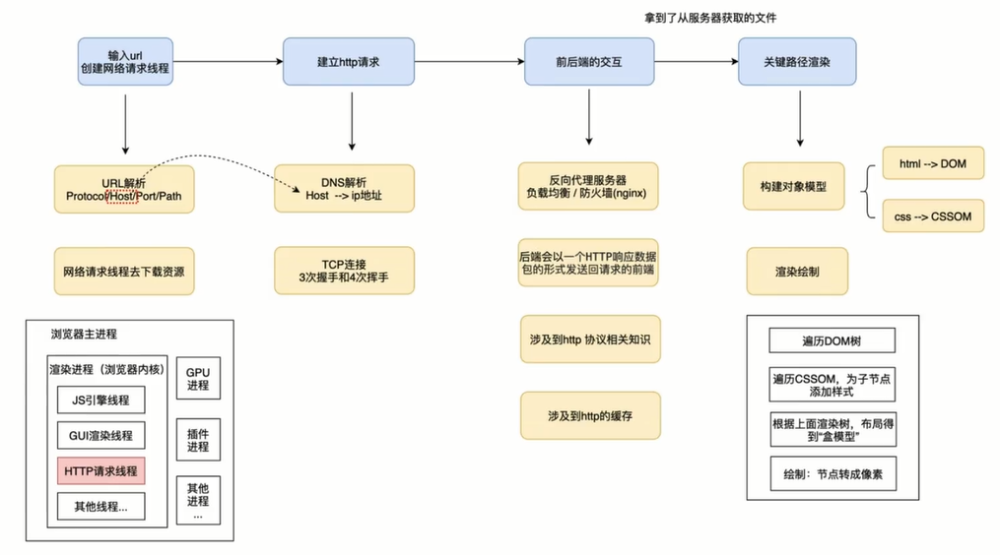
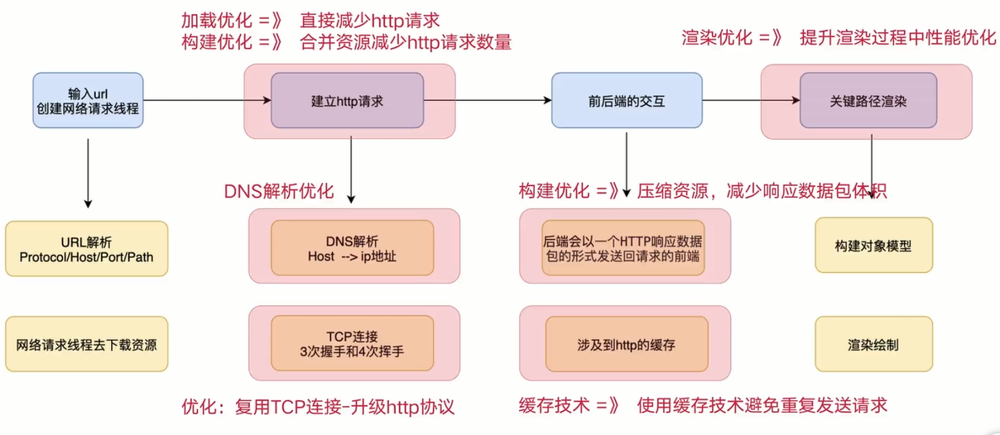

# 02-了解页面生命周期，发现导致性能变慢的原因及解决方案

## 01：通过发送请求到页面渲染理解页面的生命周期

### 抛出一个问题

- 从浏览器地址栏输入 URL 后，到页面渲染出来，整个过程都发生了什么？

### 给出的一些回答

- 初级：首先浏览器发起请求，然后服务器返回数据，最后浏览器执行脚本和页面渲染

- 中级：知道浏览器输入 URL 后会建立 TCP 链接，进行 HTTPS 的请求和响应，在浏览器接收到服务器返回数据之后了解到 Html Css 构建渲染树以及 JS 引擎解析和执行等

- **高级：如何回答？**

### 看一张图：整个链路的流转过程

### 为什么要了解页面恒明周期

#### 不了解

- 不能准确定位哪个链路导致性能变差

#### 只是会具体的性能方法

- 会部分性能优化方法，但是缺乏全面的知识体系----管中窥豹，只见一斑

## 02: 根据生命周期分析性能变慢的原因及性能分析方案

### 页面生命周期-性能分析方案

### 列举一些性能优化方法

- **加载优化**：通过懒加载可以直接减少 HTTP 请求，减少不需要在首屏展示的非关键性信息占用了页面加载时间

- **构建优化**：结合主流的构建工具 webpack，可以合并资源，压缩资源等减少 http 请求数量以及数据包体积

### 总结

- 招式 => 具体的性能优化方案

- 内力 => 理解页面生命周期

- 招式 + 内力 => "性能高手"
