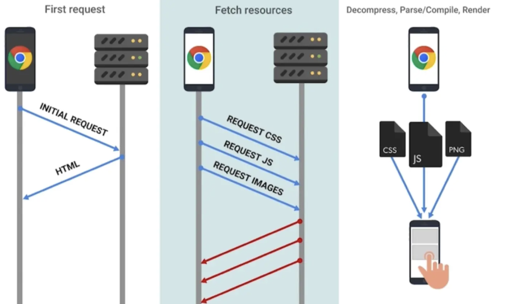
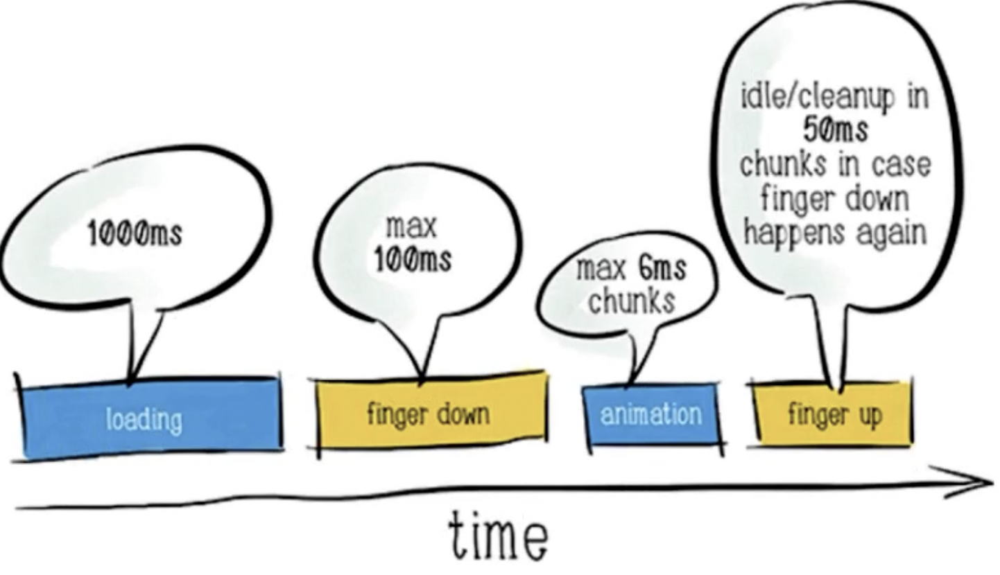

# 01-课程介绍

[推荐阅读：聊一聊前端性能优化](https://juejin.cn/post/6911472693405548557#heading-21)

[「前端性能」避免回流和重绘的必要性](https://juejin.cn/post/6953029989306466317)

[性能优化思维导图](https://docs.qq.com/mind/DWnljWm52eEVjWWNE)

### 这门课程的初衷

* 帮助大家系统的整理和学习性能优化额知识点
* 平凡程序员和大牛程序员、架构师的分数岭
* 怎么样做出高性能的工程，达到大厂的产品水平
* 提高自身含金量，一线大厂面试的敲门砖
* 目标：使用流行的性能优化技术，快速提高 Web 性能

### 性能优化意义何在

* [WPOStats](https://wpostats.com/) 性能优化案例库 - 业界经验

  

### 性能优化做些什么

### 行动的标准是什么？

### 性能优化思维导图

