# 02- 性能优化的指标和工具

> 告别前端小白，成为大神的必经之路

## 01: 为什么要进行 Web 性能优化【企业刚需】

- 性能 - Web 网站和应用的支柱

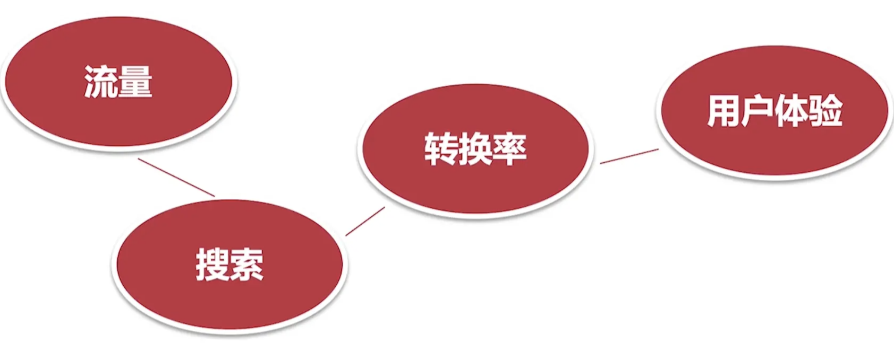

推荐阅读：Amoza 发现每 100ms 的延迟导致 1％ 的销量损失

### 寻找性能瓶颈

- 了解性能指标 – 多快才算快
- 利用测量工具和 APIS
- 优化问题，重新测量（迭代）

### 移动端挑战多

- 设备硬件、网速、屏幕尺寸、交互方式
- 移动端用户更加缺少耐心，> 3 秒加载导致 53% 的跳出率(bounce rate)
- 持续增长的移动用户和移动电商业务

## 02:性能指标和优化目标【了解行业标准】

### network 选项卡

打开 [https://ai.taobao.com/](https://ai.taobao.com/) 在控制台 network 中可以看到如下

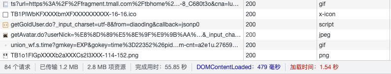 

随便找一个文件，查看该文件的一个加载瀑布流，如下，可以看到如下信息

**横着看**

* 文件并不是立即进行下载的，会根据优先级，进行一个排队等待
* 然后会根据资源域名找到 ip 找到对应的地址，然后进行连接（比如 DNS 查询、TCP链接、如果使用 https 还要进行 ssl 证书验证）
* 之后才会真正发送请求，然后响应（注意这里的正在等待服务器响应时间，这里尽量短），
* 然后是下载内容时间，尽量短（就是文件不要过大）

tips: 优化点，就是尽量采用并行加载

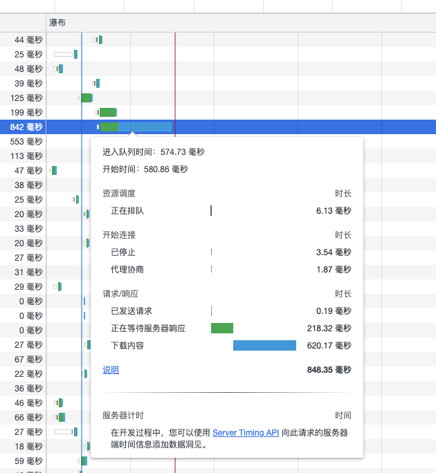

**竖着看**

* 如下图，蓝色的竖线，表示 DOM 加载的时间，红色的页面中所有的资源加载的时间

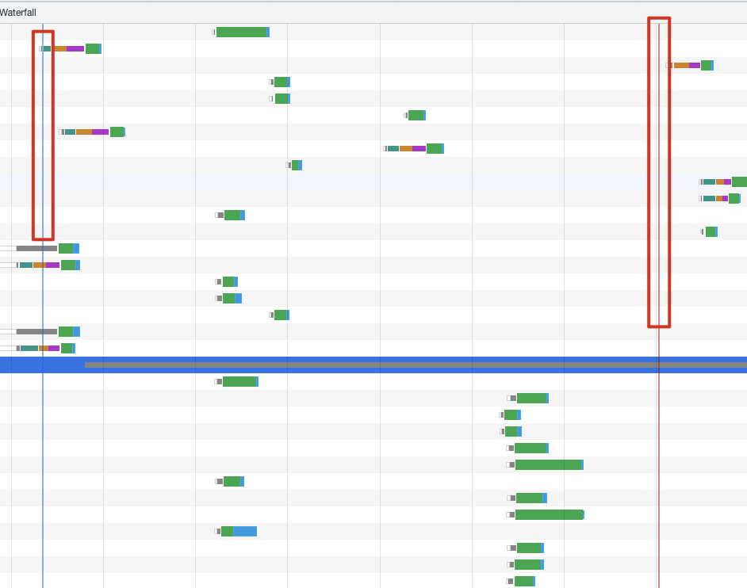

如果一次性分析不完，我们可以点击右键 => 保存为 har 格式，如下图

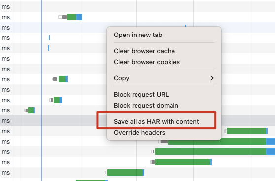

### lightHouse 选项卡

> 集成到 chrome 中的性能测量工具

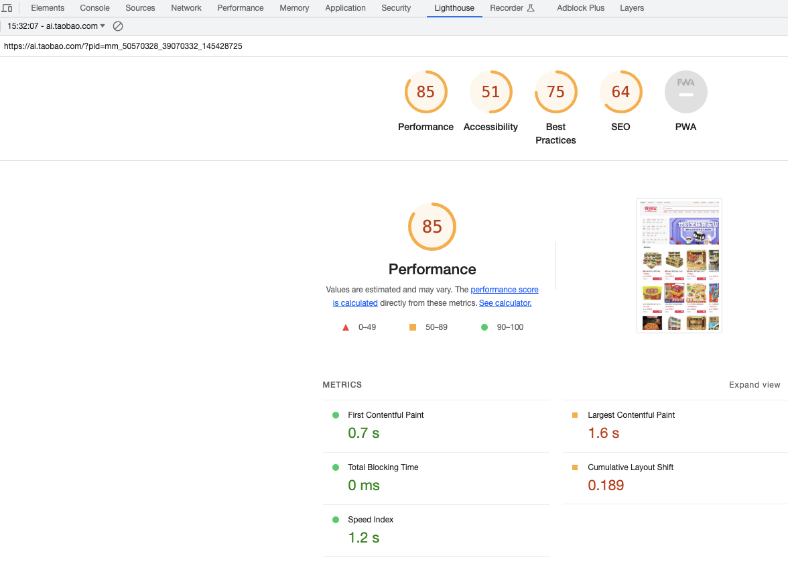

* first contentful paint: 可以简单的理解为白屏时间
* Speed Index： 首屏展现平均值 
  * 绿色（良好）—— 0 到 3.4 秒
  * 橙色（中等）—— 3.4 到 5.8 秒
  * 红色（慢） —— 超过 5.8 秒

### 交互响应要足够快

### 画面要足够流畅

>  mac: 使用 command  + shift + p 选择 show frames per second FPS meter


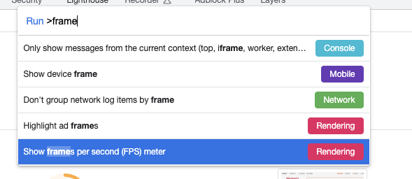

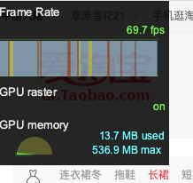

### 所有的异步数据要足够快

* 希望能在 1s 之内能把数据返回回来，如果不能，就进行压缩，那就可以考虑交互上进行优化（比如加 loading 动画）

### 总结：性能优化-加载

* 理解加载瀑布流
* 基于 HAR 存储与重建性能信息
* 速度指数（Speed Index）
* 重要测量指标
  * 性能优化：加载
    * speed Index
    * TTFB
    * 页面加载时间
    * 首次渲染：first contentful paint
  * 性能优化：响应
    * 交互动作的反馈时间
    * 帧率 FPS
    * 异步请求的完成时间

## 03: RAIL 测量模型【黄金指南】

[推荐阅读：使用 RAIL 模型衡量性能](https://web.dev/rail/)

### 什么是 RAIL

RAIL, 是 `Response（响应）`, `Animation（动画）`, `Idle（空闲）`, 和 `Load（加载）` 的首字母缩写, 是一种由Google Chrome团队与2015年提出的性能模型, 用于提升浏览器内的用户体验和性能. RAIL模型的理念是 "以用户为中心；最终目标不是让您的网站在任何特定设备上都能运行很快，而是使用户满意。

### RAIL 的目标

* 让良好的用户体验成为性能优化的目标

### RAIL评估标准

#### Response 响应：处理事件应在 50ms 以内完成

> 用户的输入到响应的时间不超过100ms，给用户的感受是瞬间就完成了。

- 事件处理函数在50ms内完成，考虑到 idle task 的情况，事件会排队，等待时间大概在50ms。适用于click，toggle，starting animations等，不适用于drag 和 scroll。

  > idle task：除了要处理输入事件，浏览器还有其它任务要做，这些任务会占用部分时间，一般情况会花费50ms的时间，输入事件的响应则排在其后。

- 复杂的 js 计算尽可能放在后台，如web worker，避免对用户输入造成阻塞

- 超过 50ms 的响应，一定要提供反馈，比如倒计时，进度百分比等。

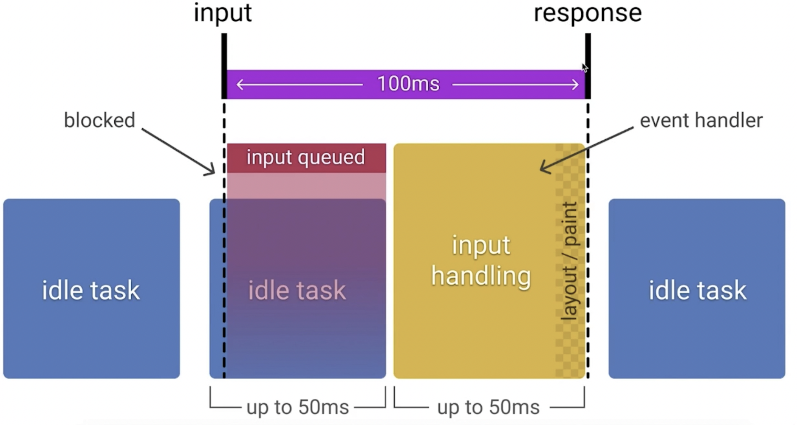

#### Animation 动画：每 10ms 产生一帧

**目标**

- 产生每一帧的时间不要超过10ms，为了保证浏览器60帧，每一帧的时间在16ms左右，但浏览器需要用6ms来渲染每一帧。
- 旨在视觉上的平滑。用户对帧率变化感知很敏感。

**优化方案**

- 在一些高压点上，比如动画，不要去挑战cpu，尽可能地少做事，如：取offset，设置style等操作。尽可能地保证60帧的体验。
- 在渲染性能上，针对不同的动画做一些特定优化

> 动画不只是UI的视觉效果，以下行为都属于
>
> - 视觉动画，如渐隐渐显，tweens，loading等
> - 滚动，包含弹性滚动，松开手指后，滚动会持续一段距离
> - 拖拽，缩放，经常伴随着用户行为

### IDLE 空闲：最大化空闲时间

**目标**

- 最大化空闲时间，以增大50ms内响应用户输入的几率

**优化方案**

- 用空闲时间来完成一些延后的工作，如先加载页面可见的部分，然后利用空闲时间加载剩余部分，此处可以使用 [requestIdleCallback API](https://link.juejin.cn?target=https%3A%2F%2Fdeveloper.mozilla.org%2Fen-US%2Fdocs%2FWeb%2FAPI%2FWindow%2FrequestIdleCallback)

* 在空闲时间内执行的任务尽量控制在50ms以内，如果更长的话，会影响input handle的pending时间
* 如果用户在空闲时间任务进行时进行交互，必须以此为最高优先级，并暂停空闲时间的任务

### Load 加载：传输内容到页面可交互的时间不超过5秒

> 如果页面加载比较慢，用户的交点可能会离开。加载很快的页面，用户平均停留时间会变长，跳出率会更低，也就有更高的广告查看率

**目标**

- 优化加载速度，可以根据设备、网络等条件。目前，比较好的一个方式是，让你的页面在一个中配的3G网络手机上打开时间不超过5秒
- 对于第二次打开，尽量不超过2秒

**优化方案**

* 在手机设备上测试加载性能，选用中配的3G网络（400kb/s，400ms RTT），可以使用 [WebPageTest](https://link.juejin.cn?target=https%3A%2F%2Fwww.webpagetest.org%2Feasy) 来测试
* 要注意的是，即使用户的网络是4G，但因为丢包或者网络波动，可能会比预期的更慢
* [禁用渲染阻塞的资源，延后加载](https://link.juejin.cn?target=https%3A%2F%2Fweb.dev%2Frender-blocking-resources%2F)
* 可以采用 [lazy load](https://link.juejin.cn?target=https%3A%2F%2Fweb.dev%2Fnative-lazy-loading%2F)，[code-splitting](https://link.juejin.cn?target=https%3A%2F%2Fweb.dev%2Freduce-javascript-payloads-with-code-splitting%2F) 等 [其他优化](https://link.juejin.cn?target=https%3A%2F%2Fweb.dev%2Ffast%2F) 手段，让第一次加载的资源更少

### 性能测量工具

* [Chrome DevTools](https://link.juejin.cn/?target=https%3A%2F%2Fdevelopers.google.com%2Fweb%2Ftools%2Fchrome-devtools)：开发调试、新能评测
* [Lighthouse](https://link.juejin.cn/?target=https%3A%2F%2Fweb.dev%2Fmeasure%2F)：网站整体质量评估
* [WebPageTest](https://link.juejin.cn/?target=https%3A%2F%2Fwebpagetest.org%2Feasy)：多测试地点、全面性能报告

### 总结

RAIL是一个旅程，为了提升用户在网站的交互体验而不断探索。你需要去理解用户如何感知你的站点，这样才能设置最佳的性能目标

- 聚焦用户
- 100ms内响应用户的输入
- 10ms内产生1帧，在滚动或者动画执行时
- 最大化主线程的空闲时间
- 5s内让网页变得可交互

## 04: 使用 WebPageTest 评估 Web 网站性能

> 【快捷好用的在线分析工具】

[官网：https://www.webpagetest.org/](https://www.webpagetest.org/)

以下是对 淘宝网的一个测试

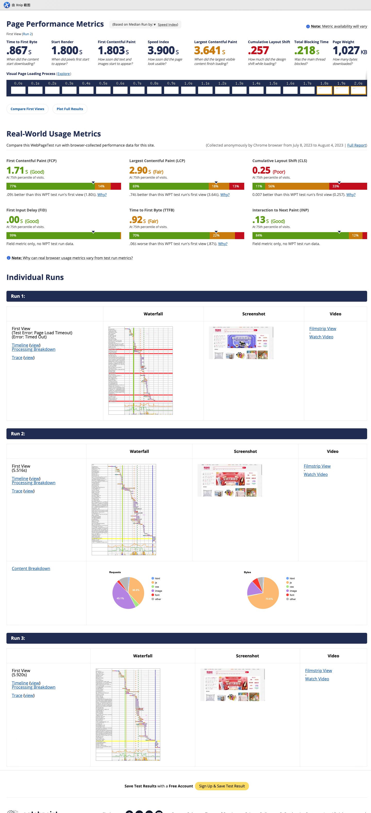

### 解读 WebpageTest 的报告

* waterfall chart 请求瀑布图
* first view 首次访问
* repeat vew 二次访问

### 如何本地部署 WebpageTest 工具

* 安装 docker

* docker 安装 

  ```bash
  docker pull webpagetest/server
  docker pull webpagetest/agent
  ```

* 自定义

  ```bash
  /mkdir wpt-mac-server
  cd wpt-mac-server
  vim Dockerfile
  // 粘贴如下内容
  FROM webpageTest/server
  ADD location.ini /var/www/html/settings/
  
  // 创建配置文件
  vim  location.ini
  // 如下内容
  [location]
  1=Test_loc
  [Test_loc]
  1=Test
  label=Test Location
  group=Desktop
  [Test]
  browser=Chroomm,Firefox
  label="Test Location"
  connectivity=LAN
  
  // 保存退出，执行以下命令
  docker build -t wpt-mac-server ./
  ```

  ```bash
  mkdir wpt-mac-agent
  cd wpt-mac-agent
  vim Dockerfile
  // 粘贴如下内容
  FROM webpageTest/agent
  ADD script.sh
  ENTRYPOINT /script.sh
  
  vim script/sh
  // 内容如下
  #!/bin/bash
  set -e
  if [ -z "$SERVER_URL" ];then
  	echo >&2 'SERVER_URL not set'
  	exit 1
  fi
  if [ -z "$LOCATION"]; then
  	echo >&2 'LOCATION not set'
  	exit 1
  fi
  EXTRA_ARGS=""
  if [ -n "$NAME" ];then
  	EXTRA_ARGS="$EXTRA_ARGS --name $NAME"
  fi
  python /wptagent/wptagent.py --server $SERVER_URL --location $LOCATION $EXTRA_ARGS --xvfb --dockerized -vvvvv --shaper none
  
  // 添加权限
  chmod u+x script.sh
  // 进行打包
  docker build -t wpt-mac-agent
  ```

  ```bash
  // 查看正在运行的 docker 实例
  docker ps
  // 根据上述 id 停掉对应的服务
  docker stop xxx xxx
  // 然后运行新的镜像
  docker run -d -p 4000:80 wpt-mac-server 
  // 接着继续运行
  docker run -d -p 4001:80 --network="host" -e "SERVER_URL=http://localhost:4000/work/" -e "LOCATION=test" wpt-mac-agent 
  
  // 然后就可以运行相应的页面进行测试查看性能了
  ```

## 05:【讨论题】谈谈对性能优化的一些想法


## 06: 使用 LightHouse 分析性能

> 【一站式全面呈现性能指标】

安装

```bash
npm install -g lighthouse
```

使用

```bash
lighthouse http://xxxx.com
例如

lighthouse https://www.bilibili.com/ // 它会自动绑你打开页面

测试完成后，会管理页面，然后在本地生成一份 m.bilibili.com_2023-08-06_18-47-47.report.html ，然后打开就可以看到结果
```

结果如下

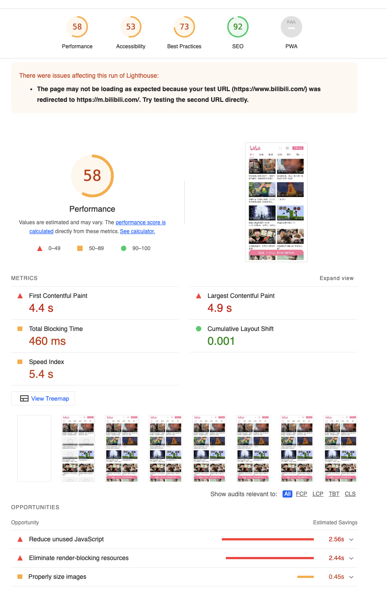


### 总结：lighthouse 的安装以及使用

* 本地 npm 安装 lighthouse
* Chrome DevTools 中使用
* 通过 chrome web store 安装插件

## 07: 使用 Chrome DevTools 分析性能【最大法宝】

1. 打开一个项目或者网页，运行后，查看 network 标签页中的加载资源状况，（打开一个网页，结果类似下图）

   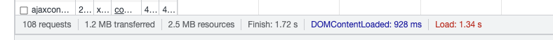

2. 可以看到总体请求了 1.2 M，我们可以根据大小进行排序，然后针对大的文件进行分析处理

   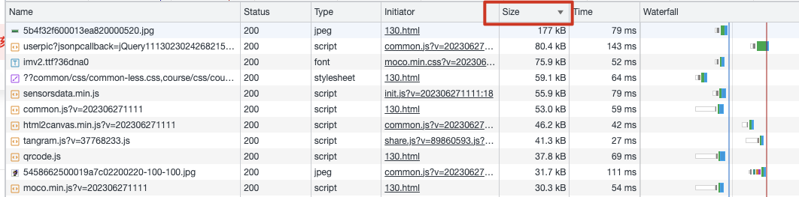

3. 鼠标悬浮在文件大小上，可以看到如下内容（文件大小和传输大小，可以知道他们两个不一定是相等的，我们可以采用压缩处理来使其降低）

   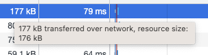

4. 如果使用 node js，可以使用 compression

   ```javascript
   // 类似代码如下
   const compression = require("compression")
   
   app.use(compression)
   app.use(express.static("build"))
   ```

5. 接着我们可以使用 performance 选项卡，来进一步查看性能（注意其中的 Timings 和 Main）

   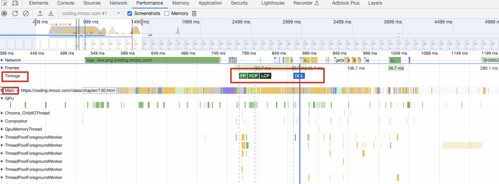

6. 我们还可以在 network 中选择 disabled cache 或者 增加 网络情况（自定义 网速 xxk/s）

### 总结：

* Audit(Lighthoust)
* Throttling 调整网络吞吐
* Performance 性能分析
* Network 网络加载分析

## 08: 常用的性能测量 APIs

> 【不可不知，打开精细化、自定义测量的大门】

### performance.timing属性介绍:

1. navigationStart 加载起始时间
2. redirectStart 重定向开始时间（如果发生了HTTP重定向，每次重定向都和当前文档同域的话，就返回开始重定向的fetchStart的值。其他情况，则返回0）
3. redirectEnd 重定向结束时间（如果发生了HTTP重定向，每次重定向都和当前文档同域的话，就返回最后一次重定向接受完数据的时间。其他情况则返回0）
4. fetchStart 浏览器发起资源请求时，如果有缓存，则返回读取缓存的开始时间
5. domainLookupStart查询DNS的开始时间。如果请求没有发起DNS请求，如keep-alive，缓存等，则返回fetchStart
6. domainLookupEnd 查询DNS的结束时间。如果没有发起DNS请求，同上
7. connectStart 开始建立TCP请求的时间。如果请求是keep-alive，缓存等，则返回domainLookupEnd,(secureConnectionStart) 如果在进行TLS或SSL，则返回握手时间
8. connectEnd 完成TCP链接的时间。如果是keep-alive，缓存等，同connectStart
9. requestStart 发起请求的时间
10. responseStart 服务器开始响应的时间
11. unloadEventStart unload事件触发的时间
12. unloadEventEnd unload事件执行完的时

### 主要性能指标：

DNS 解析耗时: domainLookupEnd - domainLookupStart

TCP 连接耗时: connectEnd - connectStart

SSL 安全连接耗时: connectEnd - secureConnectionStart

网络请求耗时 (TTFB): responseStart - requestStart

数据传输耗时: responseEnd - responseStart

DOM 解析耗时: domInteractive - responseEnd

资源加载耗时: loadEventStart - domContentLoadedEventEnd

First Byte时间: responseStart - domainLookupStart

白屏时间: responseEnd - fetchStart

首次可交互时间: domInteractive - fetchStart

DOM Ready 时间: domContentLoadEventEnd - fetchStart

页面完全加载时间: loadEventStart - fetchStart

http 头部大小： transferSize - encodedBodySize

重定向次数：performance.navigation.redirectCount

重定向耗时: redirectEnd - redirectStart

### Web 标准 APIs

* 关键时间节点（Navigation Timing, Resource Timing）
* 网络状态（Network APIs）
* 客户端服务端协商（Http Client Hints） & 网页显示状态（UI APIs）

```javascript
window.addEventListener('load', function(){
  // Time to Interactive 可交互时间
  let timing = performance.getEntriesByType('navigation')[0]
  // 计算 tti = domInteractive - fetchStart
  let tti = timing.domInteractive - timing.fetchStart
  console.log('TTI', tti)
})
```

监听大文件的一个响应时间

```javascript
const observer = new PerformanceObserver((list) => {
  for(const entry of list.getEntries()) {
    console.log(entry)
  }
})
observer.observe({ entryTypes: ['longtask'] })
```

监听页面是否隐层、显示

```javascript
var hidden, visibilityChange;
if (typeof document.hidden !== "undefined") {
  hidden = "hidden";
  visibilityChange = "visibilitychange";
} else if (typeof document.mozHidden !== "undefined") {
  hidden = "mozHidden";
  visibilityChange = "mozvisibilitychange";
} else if (typeof document.msHidden !== "undefined") {
  hidden = "msHidden";
  visibilityChange = "msvisibilitychange";
} else if (typeof document.webkitHidden !== "undefined") {
  hidden = "webkitHidden";
  visibilityChange = "webkitvisibilitychange";
}
 
// 添加监听器
document.addEventListener(visibilityChange, function() {
  console.log("当前页面是否被隐藏：" + document[hidden]);
}, false);
```

监听网络状态

**navigator.onLine**：返回的是`布尔值`。`true`表示在线，`false`表示离线。只能简单判断网络的断开和连接状态

```javascript
function updateOnline() {
    console.log(navigator.onLine ? 'online' : 'offline');
}

window.addEventListener('online', updateOnline);
window.addEventListener('offline', updateOnline);
```

**navigator.connection**：能监听到具体的网络变化（例如从4g变化到了3g），但不能监听到是离线状态还是在线状态

```javascript
const connection = navigator.connection || navigator.mozConnection || navigator.webkitConnection;
const type = connection.effectiveType
connection.addEventListener('change', () => {
	// connection.effectiveType返回的是具体的网络状态：4g/3g/2g
  console.log('connection type changed from ' + type + ' to ' + connection.effectiveType)
});
```

