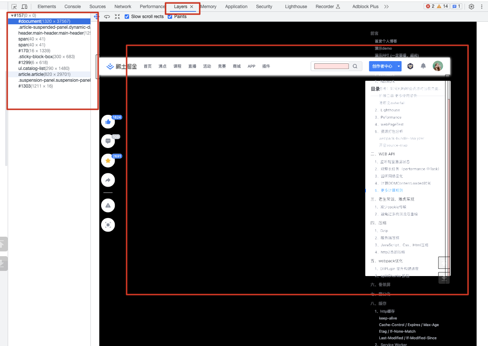
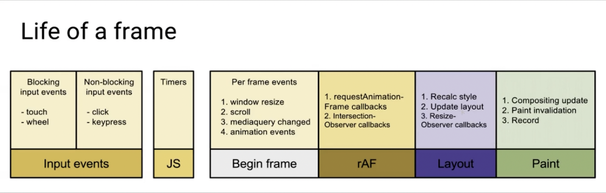

# 03- 渲染优化

>  与浏览器为友，共进退

## 01: 浏览器渲染原理和关键渲染路径
> 【大厂前端面试必考】

### 浏览器的渲染流程


### 浏览器构建对象模型

* 构建 DOM 对象

  HTML => DOM

* 构建 CSSOM 对象

  CSS => CSSOM

### 浏览器构建渲染树

DOM + CSSOM => Render Tree

Javascript  => style => layout => paint => Composite

## 02：回流与重绘, 如何避免布局抖动

[重排(reflow)和重绘(repaint)](https://juejin.cn/post/6844904083212468238)

### 布局与绘制

* 渲染树只包含网页需要的节点
* 布局计算每个节点精确的位置和大小 - “盒模型”
* 绘制是像素画每个节点的过程

### 影响回流(重排)的操作

* 添加、删除元素
* 操作 styles
* display: none
* offsetLeft、scrollTop、clientWidth
* 移动元素位置
* 修改浏览器大小，字体大小

### 避免 layout thrashing

* 避免回流，尽量批量操作
* 读写分离

## 03: 使用FastDom【防止布局抖动的利器】

[https://github.com/wilsonpage/fastdom](https://github.com/wilsonpage/fastdom)

```javascript
fastdom.measure(() => {
  console.log('measure');
});

fastdom.mutate(() => {
  console.log('mutate');
});

fastdom.measure(() => {
  console.log('measure');
});

fastdom.mutate(() => {
  console.log('mutate');
});

// 输出结果
measure
measure
mutate
mutate
```

- [Animation example](http://wilsonpage.github.io/fastdom/examples/animation.html) 官方文档里面的例子也可以展示出使用了 fastDom 后的优化效果

### 案例

业务场景：给页面上的card设置图片宽度。

#### 未使用fastDOM

```javascript
// 获取所有的卡片
let cards = documentdocument.getElementsByClassName("MuiCardMedia");

// 轮循更新卡片的图片宽度
const update = (timestamp) => {
	for (let i = 0; i < cards.length; i++ ){
		// 获取offsetTop,设置新的width
		cards[i].style.width = ((math.sin(cards[i].offsetTop + timestamp / 1000 ) + 1) * 500) + 'px';
	}

	window.requestAnimationFrame(update);
}
```

上述代码会不停的回流和重绘。

在performance中会看到类似下图中的很多的长任务。


#### 使用fastDOM

**使用npm安装或者直接script引入到代码中**

```javascript
// 获取所有的卡片
let cards = documentdocument.getElementsByClassName("MuiCardMedia");

// 轮循更新卡片的图片宽度
const update = (timestamp) => {
	for (let i = 0; i < cards.length; i++ ){
		fastdom.measure(function() {
     // 读取top值
     let top = cards[i].offsetTop;
      // 写入新的width值
      fastdom.mutate(function() {
        cards[i].style.width = ((math.sin( top + timestamp / 1000 ) + 1) * 500) + 'px';
      });
		});
	}
	window.requestAnimationFrame(update);
}
```

再次查看 performance 后，就可以看到已经没有警告了

### 总结

* 什么是 FastDom
* 如何使用 FastDom 的 APIs

## 04: 复合线程与图层【深入渲染流水线的最后一站】

### 符合线程做什么

* 将页面拆分图层进行绘制在进行复合
* 利用 DevTools 了解网页的图层拆分情况
* 哪些样式仅仅影响复合线程：使用 transform、opactity




## 05: 避免重绘 repain【必学，加速页面呈现】

尽可能动画时候使用 transform 并把要做动画的元素单独设置为一个图层上，使用属性 will-change: true

### 减少重绘的方案

* 利用 DevTools 是被 paint 的瓶颈
* 利用 will-change 创建新的图层（需要考虑有没有必要创建图层，不要滥用）
* 尽量使用 transform 或者 opacity 来达到动画，提高渲染效率的目的

## 06: 高频事件防抖【解救页面卡顿的秘药】

使用 `requestAnimationFrame`

每一帧的生命周期



## 07: React 时间调度实现【中高级前端需要了解的React调度原理】

[React源码细读-深入了解scheduler"时间管理大师"](https://zhuanlan.zhihu.com/p/384525799)

### 基本原理

* requestIdleCallback 的问题
* 通过 rAF 模拟 rIC


