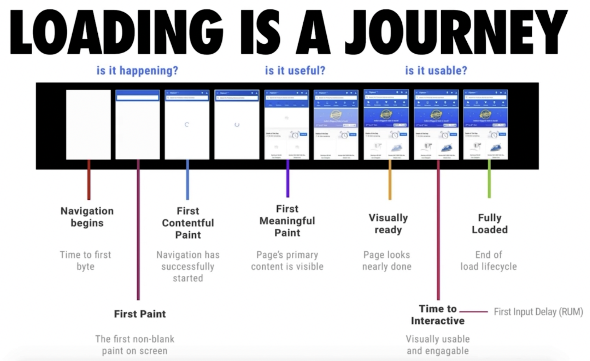

# 04-代码优化 (快来看看怎样写出真正高性能的代码)

## 01:JS 开销和如何缩短解析时间【为什么我的 JS 运行慢】

### 开销在哪里

- 加载
- 解析 & 编译
- 执行

> 如下如，对于同样大小的 图片和 js 文件，网络传输耗时一样，资源加载耗时就不一致了，对于 js 文件 花费了 2s 左右的解析编译，又花费了 1.5 的执行时间，而对于图片下载完成后，直接在 0.064s 内完成了图片编码，又花费了 0.028s 的绘制


对于 Reddit.com 下图可以看出，对于 js 代码还是压缩后的，花费了 1/3 左右的时间


### 解决方案

- Code splitting 代码拆分，按需加载
- Tree shaking 代码减重

### 减少主线程工作量

- 避免长任务
- 避免超过 1kb 的行间脚本
- 使用 rAf 和 rIc 进行时间调度

### Progressive Bootstrapping

- 可见不可交互 vs 最小可交互资源集



## 02: 配合 V8 有效优化代码【路走对了才能快】

### V8 编译原理

> js -> Parse it -> AST(Abstract Syntax Tree) 抽象语法树 -> Interpreter （解释器理解抽象语法树）-> Optimising Compiler（编译器优化）[1]-> machine Code -> Bytecode

> 拿到你的 js 字符，解析处理，变为抽象语法树 AST，所有的编程语言都有这样一个过程。先把你的文本，识别成字符，然后把里面重要的信息提取出来，变为一些节点，存储在一定的数据结构里。然后在这个数据结构里，进行理解解释是什么意义。这就是接下来，解释器要做的事情。然后呢，再把我们的代码变为机器码去运行之前，这个编译器会进行一些优化工作，也就是 Optimising Compiler. 当然，他做的优化工作不一定合适，如果它发现不合适，这时会发生一个逆优化过程。这样就造成一些不必要的开销，所以我们要注意的就是按照他优化的方式、按照它期望的方式，并且回顾可能让他出现逆优化的过程的方式，进行书写代码。


```javascript
// node.js
const { performance, PerformanceObserver } = require('perf_hooks')

const add = (a, b) => a + b

const num1 = 1
const num2 = 2

performance.mark('start')

for (let i = 0; i < 1000000; i++) {
  add(num1, num2)
}

add(num1, 's') // 这里注意：类型发生变化！类型发生变化！类型发生变化！

for (let i = 0; i < 1000000; i++) {
  add(num1, num2)
}

performance.mark('end')

const observer = new PerformanceObserver((list) => {
  console.log(list.getEntries()[0])
})

observer.observe({ entryTypes: ['measure'] })
performance.measure('测量1', 'start', 'end')
```

**类型发生变化时 运行耗时**

```shell
PerformanceMeasure {
  name: '测量1',
  entryType: 'measure',
  startTime: 20.10079099982977,
  duration: 5.206250000745058,
  detail: null
}
```


**类型未发生变化时 运行耗时**

> 我们上面类型变化的代码 注释掉，再重新运行，得出如下结果
>
> 注：单次执行可能存在误差，可以多执行几次，取平均值

```shell
PerformanceMeasure {
  name: '测量1',
  entryType: 'measure',
  startTime: 21.454458000138402,
  duration: 3.105374999344349,
  detail: null
}
```

可以看明显的速度提升，同样进行多次相加，但是类型没有发生变化，对代码进行了优化 如果类型发生了变化，会触发 V8 的反优化，增加耗时。

### 抽象语法树

- 源码 => 抽象语法树 => 字节码 Bytecode => 机器码
- 编译过程会进行优化
- 运行过程可能发生优化

### V8 优化机制

- 脚本流：

  > 下载过程中就开始解析。
  >
  > 当下载超过 30kb 的时候就新开单独线程去解析，等全部加载好之后，在进行解析时，之前的已经解析过的合并过来，减少解析时间。

- 字节码缓存

  > 源码翻译成字节码之后，例如在不同页面存在`部分相同的片段`,就把它缓存起来

- 懒解析

  > 针对函数，先不解析内部逻辑，真正用时再解析。

说到这里，大家可以检查下自己的代码中时候有类型的代码，可以进行优化下·～～

这里也可以看出，ts 的引入会让我们解决一些类型转换的问题。。

## 03: 函数优化【必会】

[“解析 JavaScript — lazy 是否比 eager 更好?”](https://blog.csdn.net/szengtal/article/details/78924931)

### 函数的解析方式

- `lazy parsing` 懒解析 VS `eager parsing` 饥饿解析
- 利用 `Optimize.js` 优化初次加载时间

() 括号包裹函数，告诉解析器这是一个 eager parsing 饥饿解析。

如果知道该函数在解析期间会被调用，则使用 eager parsing，如果不调用，使用 lazy parsing。 因为使用立刻会被调用的情况下，如果使用 lazy parsing，会导致之前的优化无效，还需要重新反优化，增加时间。

压缩的过程中，（）会被去掉，通过 optimize.js 来解决

```javascript
// test.js
export default () => {
  const add = (a, b) => a * b // 懒解析，这里先记住函数，并不进行解析
  const num1 = 1
  const num2 = 2
  add(num1, num2)
}
```

我们使用 webpack 对上面代码进行打包 为了方便定位，进行下面的配置，把 test.js 打包到单独的文件中


**打包出来的结果**


**实际项目中的时常**


**代码解读**

```javascript
// test.js
export default () => {
  const add = (a, b) => a * b // 懒解析，这里先记住函数，并不进行解析
  // 让add 函数 饥饿解析的方式 如下
  // const add = ((a, b) => a*b); // 饥饿解析

  const num1 = 1
  const num2 = 2
  add(num1, num2)
}
```

实际 webpack 打包压缩(Uglify)的过程中，会把我们的括号去掉，就不能进行饥饿解析了

[ParalleUglifyPlugin 多进程代码压缩](https://juejin.cn/post/6857145619157368839#heading-14)

### 利用 Optimize.js 优化初次加载时间

[github.com/nolanlawson…](https://link.juejin.cn/?target=https%3A%2F%2Fgithub.com%2Fnolanlawson%2Foptimize-js)

可以把压缩后的省略的括号找回来

> optimize-js input.js > output.js

Example input:

```javascript
!(function () {})()
function runIt(fun) {
  fun()
}
runIt(function () {})
```

Example output:

```javascript
!(function () {})()
function runIt(fun) {
  fun()
}
runIt(function () {})
```

**官方给的速度提升的数据**

| Browser    | Typical speed boost/regression using optimize-js |
| ---------- | ------------------------------------------------ |
| Chrome 55  | 20.63%                                           |
| Edge 14    | 13.52%                                           |
| Firefox 50 | 8.26%                                            |
| Safari 10  | -1.04%                                           |

### 重要

后面 webpack4 包括 Uglify，已经把上面的(括号省略等)问题处理了。

可能更早的项目需要做一些兼顾

> 问：变 lazy parsing 为 eager parsing，webpack 它处理了吗，如果有，是怎么做到的 ？
>
> 答：是的，Webpack 可以处理将 lazy parsing 转换为 eager parsing 的需求。在 Webpack 中，可以通过配置文件或者在代码中使用特定的语法来实现。
>
> 在配置文件中，可以使用 `optimization.splitChunks` 选项来配置代码分割的行为。通过设置 `splitChunks.chunks` 为 `'all'`，Webpack 将会对所有模块进行代码分割，将公共的部分提取出来，从而实现 eager parsing。
>
> 另外，在代码中，可以使用 `import()` 函数来实现动态导入模块的功能。通过使用 `import()` 函数，Webpack 将会自动将模块进行代码分割，并在需要的时候进行加载，从而实现 eager parsing。
>
> 需要注意的是，Webpack 的代码分割功能需要配合其他优化选项一起使用，例如使用 `optimization.runtimeChunk` 选项来提取运行时代码，以及使用 `optimization.splitChunks.cacheGroups` 选项来配置代码分割的规则。
>
> 总之，Webpack 提供了多种方式来处理 lazy parsing，可以根据具体的需求选择合适的方式进行配置。

另外

> webpack 可以处理 lazy parsing 和 eager parsing，通过配置和插件可以实现。Lazy parsing 是指在运行时按需加载模块，而 eager parsing 是指在编译时预先加载所有模块。 要启用 eager parsing，你可以在 webpack 配置文件中设置`optimization.moduleIds`属性为`'deterministic'`，这将使 webpack 使用模块路径来生成模块标识，从而实现 eager parsing。此外，你还可以设置`optimization.chunkIds`属性为`'deterministic'`来生成可预测的块标识。
>
> 除了配置，webpack 还提供了一些插件来优化模块加载。例如，使用`PrefetchPlugin`和`PreloadPlugin`插件可以预先加载代码块，以提高应用程序的性能。这些插件可以通过配置手动添加，也可以使用相关的插件或工具自动分析和添加。
>
> 总之，通过适当的配置和插件，webpack 可以实现 lazy parsing 和 eager parsing 的处理，以优化模块加载和应用程序性能。

## 04: 对象优化【JS 对象避坑地图】

### 对象优化可以做哪些？

> 做这些优化的根据是迎合 V8 引擎进行解析，把你的代码进行优化，它也是用代码写的，它所做的优化其实也是代码实现的一些规则，如果我们写的代码可以迎合这些规则，就可以帮你去优化，代码效率可以得到提升

- 以相同顺序初始化对象成员，避免隐藏类的调整

  > 以相同顺序初始化对象成员，避免隐藏类的调整 js 是动态、弱类型语言，写的时候不会声明和强调它变量的类型，但是对于编辑器而言，实际上还是需要知道确定的类型，在解析时，它根据自己的推断，它会给这些变量赋一个具体的类型，它有多达 21 种的类型，我们管这些类型叫隐藏类型（hidden class），之后它所做的优化都是基于 hidden class 进行的

  ```javascript
  class RectArea {
    // HC0
    constructor(l, w) {
      this.l = l // HC1
      this.w = w // HC2
    }
  }
  // 当声明了矩形面积类之后，会创建第一个hidden class（HC0），
  const rect1 = new RectArea(3, 4) // 创建了隐藏类HC0, HC1, HC2
  // 对于编辑器而言，它会做相关的优化，你在接下来再创建的时候，还能按照这个顺序做，那么就可以复用这三个隐藏类，所做的优化可以被重用
  const rect2 = new RectArea(5, 6) // 相同的对象结构，可复用之前的所有隐藏类

  const car1 = { color: 'red' } // HC0，car1声明对象的时候附带会创建一个隐藏类型
  car1.seats = 4 // HC1，追加个属性再创建个隐藏类型

  const car2 = { seats: 2 } // 没有可复用的隐藏类，创建HC2，car2声明时，HC0的属性是关于color的属性，car2声明的是关于seats的属性，所以没办法复用，只能再创建个HC2；HC1不是只包含seats的属性，是包含了color和seats两个属性，也会强调顺序，隐藏类型底层会以描述的数组进行存储，数组里会去强调所有属性声明的顺序，或者说索引，索引的位置
  car2.color = 'blue' // 没有可复用的隐藏类，创建HC3
  ```

  **由于每次的初始化顺序不一样,导致 v8 内部创建的 HC 不能复用,每次都会重新创建**

- 实例化后避免添加新属性

  ```javascript
  const p1 = {
    name: 'nordon', // 此时声明的属性 是 In-object属性
  }
  p1.age = 18 // 此时声明的属性是 Normal/Fast 属性,存储在 property store里, 需要通过描述数组间接查找
  ```

- 尽量使用 Array 代替 arry-like 对象

  > 尽量使用 Array 代替 array-like 对象 array-like 对象：js 里都有一个 arguments 这样的对象，它包含了函数参数变量的信息，本身是一个对象，但是可以通过索引去访问里面的属性，它还有 length 的属性，像是一个数组，但它又不是数组，不具备数组带的一些方法，比如说 foreach 如果本身真的是数组，v8 引擎会对这个数组进行极大性能的优化，只是 array-like 的话，它做不了这些事情，在调用 array 方法时，通过间接的手段可以达到遍历 array-like 对象，但是效率没有在真实数组上高
  >
  > 作者：搞定
  > 链接：<https://juejin.cn/post/7022245324563415076>
  > 来源：稀土掘金
  > 著作权归作者所有。商业转载请联系作者获得授权，非商业转载请注明出处。

  ```javascript
  Array.prototype.forEach.call(arrObj, (value, index) => {
    // 不如在真实数组上效率高
    console.log(`${index}: ${value}`)
  })

  // 将类数组先转成数组，再进行遍历，转换也是有代价的，这个开销与后面性能优化对比怎么样？
  // v8做了实践，得出结论：将类数组先转成数组，再进行遍历比不转换直接使用效率要高，所以我们也最好遵循它的要求
  const arr = Array.prototype.slice.call(arrObj, 0) // 转换的代价比影响优化小
  arr.forEach((value, index) => {
    console.log(`${index}: ${value}`)
  })
  ```

- 避免读取超过数组的长度

  > 这是讲越界的问题，js 里不容易发现这越界问题，越界了也不一定报错 越界比较的话会造成沿原型链额外的查找，这个能相差到 6 倍

  ```javascript
  function foo(array) {
    // 越界比较，正常是<,这边是<=，超过边界的值也会比较进来，
    for (let i = 0; i <= array.length; i++) {
      if (array[i] > 1000) {
        // 1.造成array[3]的值 undefined 与数进行比较
        // 2.数组本身也是一个对象，在数组对象里找不到要的属性之后，会沿原型链向上查找，会造成额外的开销
        console.log(array[i]) // 这个数据是无效的，会造成业务上无效、出错
      }
    }
  }
  // [10,100,1000]
  ```

- 避免元素类型转换

  ```javascript
  const array = [3, 2, 1]; // PACKED_SMI_ELEMENTS，满的整型元素
  
  array.push(4.4); 
  // PACKED_DOUBLE_ELEMENTS，之前对数组具体到PACKED_SMI_ELEMENTS类型所做的优化全都无效，需要对数组类型进行一次更改，变成PACKED_DOUBLE_ELEMENTS类型，会造成额外的开销，编辑器效率就不高了
  ```

  

  > 类型越具体，编辑器能做的优化就越多，如果变得越通用，能做的优化余地就越少

**除了以上这些，还有很多，可以去v8官方看看技术博客，会经常更新它们的优化方案，我们如果可以不断配合他们的优化方案，可以让我们代码的效率不断提高**

## 05: HTML 优化【必会】

> html优化空间比较小，html大小在整个页面所有资源里占比比较小，但是也不能忽视，优化工作要做到极致，即使1kb也不能放弃，


在html里，有很多没有用的空间，还有一些可以省略的元素，就类似上图中的企鹅群，大家可以再挤一挤，挤在一起就可以达到优化的目的

### HTML 优化也很重要

- 减少 iframes 使用

  > 使用 iframes 额外添加了文档，需要加载的过程，也会阻碍父文档的加载过程，**如果它加载不完成，父文档本身的onload事件就不会触发**，一直等着它，在iframe里创建的元素，比在父文档创建同样的元素，开销要高出很多；
  >
  > 非要用iframe的话，可以做个延时加载，不要一上来就加载iframe，声明一个iframe，在父文档加载完成之后，再拿到iframe，再对src赋值，让它做加载，达到延迟的目的，不会影响刚开始页面的加载过程

  ```html
  <iframe id="a"></iframe>
  <script>
    document.addEventListener("DOMContentLoaded" , function(){
      document.getElementById('a').setAttribute('src', url);
    })
  </script>
  ```

- 压缩空白符

  > 编程的时候，为了方便阅读，会留空白或者空行，这些空白符也是占空间的，最后打包时要把空白符去掉

- 避免节点深层级嵌套

  > 嵌套越深消耗越高，节点越多最后生成dom树占有内存会比较高，有个遍历，嵌套越深遍历就越慢

  

- 避免使用table布局

  > table布局本身有很多问题，使用起来没有那么灵活，造成的开销非常大，同样实现一种布局的方式，用table布局开发和维护起来，相对而言都更麻烦

- 删除注释

  > 把无效内容去掉，减少大小

- CSS & Javascript 尽量外链

  > CSS 和 Javascript 直接写在行间，会造成html文档过大，对于引擎来说，后续也不好做优化，
  >
  > css 和 Javascript 有时确实要做在行间，这个和偷懒写在行间是两码事

- 删除元素默认属性

  > 本身默认那个值，没有必要写出来，写出来就添加了额外的字符，要通过网络传送给客户端，这就是一些浪费

### HTML 最佳实践

- **head 里有很多 meta，每个 meta 要清楚对应的作用，没有用的不要写上去，都是浪费 css 通过外部 css 进行引入**

  

- body部分多使用html5的语义标签，方便浏览器理解你写的内容是什么，可以进行相关的优化

- 有一些元素，前面有open tag，后面有 closing tag，并不是所有元素需要 closing tag，比如img、li

  

- 考虑可访问性，video，浏览器支持或者不支持，还有支持的视频格式都要进行考虑

- js要放在body的尾部进行加载，为了防止影响dom的加载，js是阻塞的，如果开始就进行加载，它的加载解析就会影响后面dom的加载

  

### 借助工具

- html-minifier

## 06: CSS 对性能的影响 【必会】

### 样式计算开销

- 利用 DevTools 测量样式计算开销

  

  

- 复杂度计算，降低计算的复杂度，对元素进行定义样式，尽量定义单一的样式类去描述它的样式，尽量不要使用过于复杂的伪类，多层级联，去锁定这个元素进行样式描述 css解析的原则是自右向左去读，先会找出最具体的元素，把所有的a全都找出来，再根据#box进行过滤，再进行过滤，再进行过滤，直到把所有受到影响的元素全都过滤出来，然后运用这个样式，**随着浏览器解析不断进步，现在这种复杂度的计算已经不是最主要的问题**

### CSS优化

- 降低CSS对渲染的阻塞

  > 由于CSS对渲染的阻塞是无法进行避免的，所以我们从两个角度进行优化：
  >
  > 1. 尽量早的完成css的下载，尽早的进行解析；
  > 2. 降低css的大小，首次加载时，只加载当前路径或者首屏有用的css，用不到的进行推迟加载，把影响降到最低

- 利用 GPU 进行完成动画

- 使用 `contain` 属性

  

  从上图可以看出，没有使用contain布局消耗的时间大概是56.89ms，使用之后可以降低到0.04ms，这是一个非常大的优化

  

  contain有多个值，layout是其中一个，是现在目前主流浏览器支持比较好的值，作用也比较大 上图是新闻的一个展示页，如果想在第一条内容里插入其他一些内容，对于我们关键渲染路径而言，浏览器并不能知道你插入的东西会不会影响到其他元素的布局，这个时候它就需要对这个页面上的元素进行重新的检查，重新的计算，开销很大，这里有将近10000条的新闻，将近10000个元素要受到影响，如何降低影响？因为我们只是想在第一条里去插入一个东西，后面这些元素本身是不会受到影响的，形状和大小都不会变，这个时候我们就用到contain，contain是开发者和浏览器进行沟通的一个属性，通过contain:layout告诉浏览器，相当于你可以把它看成一个盒子，盒子里所有的子元素和盒子外面的元素之间没有任何布局上的关系，也就是说里面无论我怎么变化不会影响外面，外面怎么变化也不会影响盒子里面，这样浏览器就非常清楚了，盒子里面的元素如果有任何的变化，我会单独的处理，不需要管理页面上其他的部分，这样我们就可以大大减少重新去进行回流或者布局时的计算，这就是 contain:layout 的作用

- 使用font-display属性

  > 可以帮助我们让我们的文字更早的显示在页面上，同时可以适当减轻文字闪动的问题
