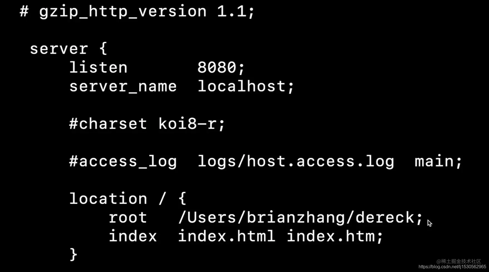
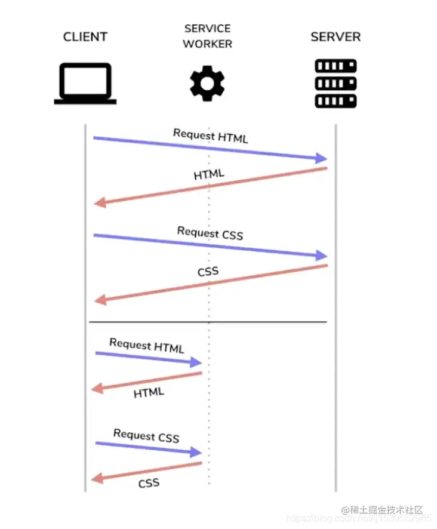
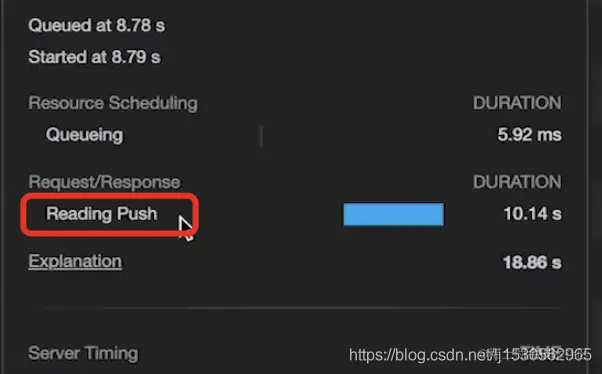

# 07-传输加载优化（前沿技术解决高访问量网站性能优化问题）

> 本章包括了前沿的网络加载优化技术，从了解现代网络上的问题和多样的流行技术解决方案，给大型、高访问量的网站带来质的飞跃。

## 01: 启用压缩Gzip【必会的传输压缩方案】

Gzip 是用来做网络资源压缩，帮我们减小资源文件在网络传输大小的技术，网络传输的过程中，去进行这种实时的动态的一个压缩，这个可以说是我们唯一可以选择的一个技术，Gzip 压缩比和压缩效率比较高 在传输层进行的动态压缩和我们之前讲的对资源文件的压缩是不同的概念

### Gzip

* 对传输资源进行体积压缩，可高达 90%
* 如何配置 Nginx 启用 Gzip

### 安装 ngnix

* 安装homebrew [brew.sh/](https://brew.sh/)

* 安装 ngnix

  ```shell
  brew install nginx
  ```

* 运行 ngnix

  ```shell
  sudo brew services start nginx
  ```

* 查看配置文件

  ```shell
  vim /usr/local/etc/nginx/nginx.conf
  ```

  看配置文件默认端口时 8080 访问 localhost:8080 在用户名目录下新建文件夹，把打包后的内容放到文件夹里，建议不要放到 Documents下，因为这样会引起一些权限的问题，还要对权限进行相关的调整 然后修改配置文件的路径

  

  **配置gzip**

  ```txt
  gzip on;// 开启gzip
  gzip_min_length 1k; //文件至少1k才进行压缩
  gzip_comp_level 6; //压缩级别，有1-9，这边使用6，压缩比例越高，对cpu的消耗也越高，权衡下取6，比较合适的值
  gzip_types text/plain application/javascript application/x-javascript text/css application/xml text/xml text/javascript application/json;//压缩文件类型，通常对文本类文件进行压缩，压缩效果会比较好，图片类一般不进行压缩，消耗资源比较大，效果不是很好
  gzip_static on;// 对gzip已经压缩的静态资源直接利用
  gzip_vary on;//会在响应头部添加vary的属性，告诉客户端我们是否启用了gzip压缩
  gzip_buffers 4 16k;// buffer优化压缩过程
  gzip_http_version 1.1;//压缩使用的http版本
  ```

  保存退出，重启 ngnix

  ```shell
  sudo brew services start nginx
  ```


## 02: 启用Keep Alive【通过一个参数提速连接】

这个技术可以帮助对 TCP链接 进行复用，当我们和一台服务器进行 TCP 建立连接之后，接下来的请求就不需要进行重复建立链接了，这样对于请求量比较高的网站，就可以大大节约我们在网络加载时候的开销 它是我们 http标准 中的一部分，因为它多数情况下是有益无害，所以在 http1.1 开始，Keep Alive 参数默认进行开启 第一个资源有下图的 Initial connection，此为TCP链接的建立，后面的资源加载就没有 Initial connection


下图头部可以看到 keep-alive 参数


curl -v  <http://127.0.0.1:8080> 可以查看请求和响应的详细信息]


和 Keep Alive 相关的还有两个比较重要的参数，通常我们要根据网站实际的请求量和用户量进行相关配置，打开 ng配置文件

```txt
keepalive_timeout 65;
//超时时间，当客户端和服务端进行tcp链接建立后，服务端会尽量保持住tcp链接，但是一直不用的话，是需要进行超时关掉的，65秒都没使用tcp链接，就会把它关闭掉，如果设置为0，指的是不启用keepalive，每一个请求都必须建立自己的tcp链接，65这个值是否够用，如果做的是面向用户的网站，这个值是绰绰有余的，如果65秒你的页面还未加载完，这是非常可怕的，要根据实际情况，看下这个服务一共要花多长时间完成这些请求，请求数据量的情况，要找到上限，在这个时间之内，可以保证我所有的请求能充分复用一个tcp链接，完成我这次服务所需要请求到的数据就可以了
keepalive_requests 100;
//当客户端和服务端进行tcp链接建立后，会开始一个计数，有个技术限，利用这个tcp链接一共可以发送多少个请求，比如这边100之后就会关闭tcp链接，第101个请求需要重新建立tcp链接
```

为什么要设置以上的值呢？

一直开启不可以吗？每个东西都是有开销的，一个客户端和服务端建立tcp链接，考虑用户规模，上万、十万、百万、千万，服务器上要给这些用户都保持住tcp链接，这个开销还是非常大的，所以资源不再使用就要退出，以上参数要根据实际情况配置

### Keep Alive

* 一个持久的TCP连接，节省了连接创建时间
* Nginx默认开启keep alive


## 03: HTTP资源缓存【必会的HTTP缓存方法】

* 提高重复访问时资源加载的速度

  

* Cache-Control/Expires

* Last-Modified+If-Modified-Since

  > 与Etag+If-None-Match是等价的，Last-Modified+If-Modified-Since与时间相关，时间的精准性，客户端服务端时间不同步，会带来一些问题，要求不高可以使用，它们对http1.0是更兼容的

* Etag+If-None-Match


第一个是匹配html，我们现在主要都是单页应用，所有的资源文件都是通过html进行后续的加载，如果html缓存了，更新时缓存如果没有过期就会通过html拿到旧的js、css，html不希望进行缓存，希望用户始终拿到最新的html，这个文件本身也不大

Cache-Control 是 http1.1的标准，不需要进行缓存，需要这个文件时去服务端重新获取，获取完要进行重新验证

配后面两个是为了兼容性问题，老版本浏览器不支持http1.1，要考虑 http1.0里Cache-Control 没有很好的实现，就需要 Pragma 参数，告诉只支持http1.0 的浏览器也不要进行缓存，Expires配置0或者是负数的话，相当于无效值，告诉浏览器你这个文件立即就过期，下次再用时一定得去服务端拿

js、css 7天内浏览器都缓存住，用户重新去访问时，直接去缓存去，不用来服务端取，结合webpack的缓存技术，js、css都用了hash的命名方法，当html进行有效更新后，html 指向的 css、js 的 url 发生变化，这里过期时间就不重要了，url发生变化，浏览器就认为是新的资源文件，需要去服务器拿新的资源文件，旧的文件就被丢弃掉了，那能拿到的 css、js 也是最新的资源


虽然 html 没有缓存，但状态是 304，会向服务器做请求，我要用的文件需不需要从你那拿，服务器告诉它你这个文件未发生变化，可以从缓存里拿，服务器就返回状态304，浏览器就知道未发生变化，还可以用之前的缓存 服务端如何知道客户端要请求的资源对客户端而言有没有发生变化


Etag（Response Headers）相当于是文件资源的唯一标识，是在服务端生成的，会告诉客户端我们这个资源标识是什么，在第一次请求时就会把这个信息带过来，再次进行请求时，会问下服务端我的 Etag 还匹不匹配（If-None-Match（Request Headers）），不匹配我就从你那拿最新的资源，还匹配就告诉我 304，我就从缓存离直接取


Etag 刚 ng配置 里没有配，ng 是**默认开启** Etag 缓存技术


js 从磁盘的缓存里进行加载，有时候是内存缓存，这根据缓存策略不同


Expires（Response Headers）7天都从缓存去取，Date 拿的日期是7月9日，过期时间 Expires是7月16日

### 看看第三方如何缓存的

* 天猫

  

  max-age 设置正数，表示当前资源文件经过多少秒之后失效，0 表示通过第一次获取立即失效 s-maxage 不是给浏览器进行设置的，是给到达浏览器之前的一些中间的一些缓存或者说是代理服务器进行缓存的设置

* 知乎

  

  默认是 public，public 认为中间层或者代理服务器可以做一级缓存，也就是说，所有的用户已经在代理啊服务器上进行了缓存，所有的用户可以去向代理服务器获取已经缓存的资源文件，private 这个缓存只能在浏览器或者用户的层面上，不可以去获取一个代理服务器或者中间的缓存层上一个共享的缓存；再次进行访问时状态还是 200，不是 304，因为它这边不是设置no-cache，设置的是更强的缓存策略no-store，并不关心文件有没有发生变化，始终要跟服务器获取最新的文件，强制让你的缓存失效，而且不使用任何重新验证的策略，所以这边 must-revalidate 可能时没有必要的，下面也没有 Etag + If-None-Match 的设置了

* google

  

  重新访问状态也是200，不过这个200不是从服务器来的，而是从 ServiceWorker，ServiceWorker 是一个缓存机制，在浏览器端建立了一个中间的缓存，后续的请求都是从这个中间的缓存里进行获取，虽然 Cache-Control 设置了 no-cache，no-cache 是和服务器重新验证下我这个资源有没有过期，但是它并没有真正去进行和服务器这样的一个确认，因为它通过了 ServiceWorker，ServiceWorker 直接告诉它这是命中的缓存，你可以直接去使用，不需要和服务器进行重新的确认，也是因为 Cache-Control 默认是 public，才会有这样的效果

[更多参数：https://developer.mozilla.org/en-US/docs/Web/HTTP/Headers](https://developer.mozilla.org/en-US/docs/Web/HTTP/Headers)


## 04: 一次性理解Service workers技术，给网站提速

### Service workers作用

* 加速重复访问

* 离线支持

  > 用户没有网络的情况下也可以让用户访问到我们的网页

  

* 将网络情况切换到 offline，网页仍然可以正常访问

  > 如果建工程是使用 create-react-app 这个脚手架工程的话，默认会获得 serviceWorker 的功能，使用很简单，不需要进行配置或者实现，serviceWorker 也有自己的生命周期，首先要注册安装激活才可以使用 打包后的目录有个asset-manifest.json 里定义了哪些资源要进行缓存，以及缓存文件的文件名
  >
  > 相关的版本信息会存在precache-manifest里，每个文件都有相关的版本信息，这些文件不可能手工去生成，会很复杂 需要借用webpack插件帮我们做这些事情，google帮我们去做了相关的实现

  

  ```javascript
  //webpack.config.js
  const WorkboxWebpackPlugin = require('workbox-webpack-plugin');
  const ManifestPlugin = require('webpack-manifest-plugin');
  module.exports = {
    plugins: [
      new WorkboxWebpackPlugin.GenerateSW({
        clientsClaim: true,
        exclude: [/\.map$/, /asset-manifest\.json$/],
        importWorkboxFrom: 'cdn',
        navigateFallback: paths.publicUrlOrPath + 'index.html',
        navigateFallbackBlacklist: [
          // Exclude URLs starting with /_, as they're likely an API call
          new RegExp('^/_'),
          // Exclude any URLs whose last part seems to be a file extension
          // as they're likely a resource and not a SPA route.
          // URLs containing a "?" character won't be blacklisted as they're likely
          // a route with query params (e.g. auth callbacks).
          new RegExp('/[^/?]+\\.[^/]+$'),
        ],
      }),
  
      new ManifestPlugin({
        fileName: 'asset-manifest.json',
        publicPath: paths.publicUrlOrPath,
        generate: (seed, files, entrypoints) => {
          const manifestFiles = files.reduce((manifest, file) => {
              manifest[file.name] = file.path;
              return manifest;
          }, seed);
          const entrypointFiles = entrypoints.app.filter(
              fileName => !fileName.endsWith('.map')
          );
          //  从入口文件开始把所有涉及到的包括代码拆分后的文件全都加到asset-manifest.json里，之前是entrypoints.main，这里改成了entrypoints.app，是因为默认入口文件命名不一致，这边要看下入口文件的命名做相应修改，不然是取不出来的
          return {
            files: manifestFiles,
            entrypoints: entrypointFiles,
          };
        },
      }),
    ]
  }
  ```

  我们只需使用两个插件，就可以生成 serviceWorker 和相关的配置文件

  一个叫 `WorkboxWebpackPlugin`，这是webpack插件，适用性和框架本身无关，

  另一个是 `ManifestPlugin`，这里主要用它生成asset-manifest.json，决定哪些资源要进行缓存

  会把所有静态资源html、css、js全都进行缓存，你想在离线的时候进行使用，这些资源都是必须的，比较大的图片或者视频资源不会考虑在内，serviceWorker 也要占用系统资源的，如果是用户的移动设备，对资源是非常宝贵，如果存了很多很大的内容到serviceWorker，相当于给用户手机安装了很大的app，对用户设备带来很大的压力

  ```javascript
  // serviceWorker.js
  // This optional code is used to register a service worker.
  // register() is not called by default.
  
  // This lets the app load faster on subsequent visits in production, and gives
  // it offline capabilities. However, it also means that developers (and users)
  // will only see deployed updates on subsequent visits to a page, after all the
  // existing tabs open on the page have been closed, since previously cached
  // resources are updated in the background.
  
  // To learn more about the benefits of this model and instructions on how to
  // opt-in, read https://bit.ly/CRA-PWA
  
  const isLocalhost = Boolean(
    window.location.hostname === 'localhost' ||
      // [::1] is the IPv6 localhost address.
      window.location.hostname === '[::1]' ||
      // 127.0.0.0/8 are considered localhost for IPv4.
      window.location.hostname.match(
        /^127(?:\.(?:25[0-5]|2[0-4][0-9]|[01]?[0-9][0-9]?)){3}$/
      )
  );
  
  export function register(config) {
    if (process.env.NODE_ENV === 'production' && 'serviceWorker' in navigator) {
      // The URL constructor is available in all browsers that support SW.
      const publicUrl = new URL(process.env.PUBLIC_URL, window.location.href);
      if (publicUrl.origin !== window.location.origin) {
        // Our service worker won't work if PUBLIC_URL is on a different origin
        // from what our page is served on. This might happen if a CDN is used to
        // serve assets; see https://github.com/facebook/create-react-app/issues/2374
        return;
      }
  
      window.addEventListener('load', () => {
        const swUrl = `${process.env.PUBLIC_URL}/service-worker.js`;
  
        if (isLocalhost) {
          // This is running on localhost. Let's check if a service worker still exists or not.
          checkValidServiceWorker(swUrl, config);
  
          // Add some additional logging to localhost, pointing developers to the
          // service worker/PWA documentation.
          navigator.serviceWorker.ready.then(() => {
            console.log(
              'This web app is being served cache-first by a service ' +
                'worker. To learn more, visit https://bit.ly/CRA-PWA'
            );
          });
        } else {
          // Is not localhost. Just register service worker
          registerValidSW(swUrl, config);
        }
      });
    }
  }
  
  function registerValidSW(swUrl, config) {
    navigator.serviceWorker
      .register(swUrl)
      .then(registration => {
        registration.onupdatefound = () => {
          const installingWorker = registration.installing;
          if (installingWorker == null) {
            return;
          }
          installingWorker.onstatechange = () => {
            if (installingWorker.state === 'installed') {
              if (navigator.serviceWorker.controller) {
                // At this point, the updated precached content has been fetched,
                // but the previous service worker will still serve the older
                // content until all client tabs are closed.
                console.log(
                  'New content is available and will be used when all ' +
                    'tabs for this page are closed. See https://bit.ly/CRA-PWA.'
                );
  
                // Execute callback
                if (config && config.onUpdate) {
                  config.onUpdate(registration);
                }
              } else {
                // At this point, everything has been precached.
                // It's the perfect time to display a
                // "Content is cached for offline use." message.
                console.log('Content is cached for offline use.');
  
                // Execute callback
                if (config && config.onSuccess) {
                  config.onSuccess(registration);
                }
              }
            }
          };
        };
      })
      .catch(error => {
        console.error('Error during service worker registration:', error);
      });
  }
  
  function checkValidServiceWorker(swUrl, config) {
    // Check if the service worker can be found. If it can't reload the page.
    fetch(swUrl, {
      headers: { 'Service-Worker': 'script' },
    })
      .then(response => {
        // Ensure service worker exists, and that we really are getting a JS file.
        const contentType = response.headers.get('content-type');
        if (
          response.status === 404 ||
          (contentType != null && contentType.indexOf('javascript') === -1)
        ) {
          // No service worker found. Probably a different app. Reload the page.
          navigator.serviceWorker.ready.then(registration => {
            registration.unregister().then(() => {
              window.location.reload();
            });
          });
        } else {
          // Service worker found. Proceed as normal.
          registerValidSW(swUrl, config);
        }
      })
      .catch(() => {
        console.log(
          'No internet connection found. App is running in offline mode.'
        );
      });
  }
  
  export function unregister() {
    if ('serviceWorker' in navigator) {
      navigator.serviceWorker.ready
        .then(registration => {
          registration.unregister();
        })
        .catch(error => {
          console.error(error.message);
        });
    }
  }
  ```

  主入口要进行引入

  ```javascript
  // index.jsx
  import * as serviceWorker from './serviceWorker';
  // If you want your app to work offline and load faster, you can change
  // unregister() to register() below. Note this comes with some pitfalls.
  // Learn more about service workers: https://bit.ly/CRA-PWA
  serviceWorker.register(); // 注册serviceWorker
  ```

### Service workers原理



客户端和服务端之间建立一个中间层，做了个存储，即使抛开 server之后，客户端还可以正常工作和使用，因为从 Service workers拿资源，Service workers所在的位置是我们的客户端

### Service workers注意

* 延长了首屏时间，但页面总加载时间减少

* 兼容性

  

* 只能在 `localhost`  或者 `https`  下使用 为了保证安全性


## 05: 【讨论题】缓存方法

1. http 缓存

2. websql

3. indexDB

4. cookie

5. localstorage

6. sessionstorage

7. application cache

8. cacheStorage

9. flash缓存

## 06: HTTP 2的性能提升

### HTTP/2的优势

* 二进制传输

  > http1.0 和 1.1是基于文本的，这种效率比较低，而且不安全，所以 http2 是二进制编码传输，即安全而且进行了很好的压缩，提高了传输效率； 对头部做了压缩，也可以保证传输更快

* 请求响应多路复用

* Server push（服务器推送）

### 开启http2

打开ng配置文件


服务监听端口 843，默认 443 也是可以的 开启ssl，https的证书，如何生成自签名的证书，https是我们使用 http2 必须要求的条件，只能在 https 下开启 http2

### 做自签名的证书

作为前端工程师必备的技能，很多新技术对安全性有很大的要求，限制我们使用这些技术必须在https下使用，这证书购买需要花费比较高的价格，作为开发者，我们可以做个自签名的证书，作为开发用，生成证书只要下面 4条 指令就可以

```shell
openssl genrsa -des3 -passout pass:x -out server.pass.key 2048

openssl rsa -passin pass:x -in server.pass.key -out server.key 

openssl req -new -key server.key -out server.csr 

openssl x509 -req -sha256 -days 3650 -in server.csr -signkey server.key -out server.crt 
```


执行后得到 server.crt 和 server.key ，在工程目录下新建 ssl文件夹，把 server.crt 和 server.key 拷贝到文件夹下，ng 进行配置


访问 `<https://localhost:843>` 会出现如下提示，因为我们使用的是自签名的证书，chrome认为你这个证书本身不安全，怀疑这个地方是不是被人劫持


这是直接键盘输入 thisisunsafe，页面就可以绕过证书的验证，直接出来

show overview 显示概览图，就是下面条形的图，可以选中局部查看局部网络加载的情况，这几张图片都是通过 http1.1 进行加载的，概览图中可以看到这里开启了多个请求去完成图片的加载，如果页面上资源量比较多的话，会有很高的请求量，网络压力比较大


### 开启http2

打开ng，输入如下 http2


保存退出，重启服务


所有的网络资源都变成 http2 的协议了，还有h3，h3都是对 google 外部资源的请求，google 已经全面部署了 http3，只不过 http3 还未正式发布

这里图片变成只有两个请求被发起，所有的图片是通过一个请求去完成的，另外个请求是对 goofle 外部图片进行的请求，所以 http2 在网络请求了进行了减少，这就是 http2的优势：多路复用（Multiplexing）：如下图


http1.1虽然可以用keep-alive复用同个tcp链接，但是资源还是有一个这样的顺序，会形成这样的堵塞问题，但在 http2 里，这不再是问题，真正做到了异步或并发的对资源进行传输，同一个时刻可以发起对多个资源的请求，同一时刻可以将不同资源的信息同时通过网络传回到浏览器


### Server push（服务器推送）

正常客户端向服务器请求，服务端再把资源推送给客户端，这来回都是有消耗的，也就是常说的 TTFB，如果能消除这过程中的一些时间，可以节约网络开销，作为开发者，了解哪些资源是非常重要，哪些资源是接下来需要，能不能提前让服务器把这些东西推送到我们客户端，这样的话我们就不需要进行请求了，在接下来我们需要它的时候，浏览器已经拿到了它，就可以直接用 ng配置 好后保存退出


重启ng服务，发现这三张图片没有绿色部分，就是TTFB，没有请求返还回路这样的过程




资源是 Reading push Initiator 图片为Push，这种资源是通过 server push 提前push到我们浏览器的，浏览器把他们放在缓存里，需要的时候直接从缓存里进行读取

如果没有发现，可以通过右键可以勾选显示哪些信息


当网站比较大，请求量很高，请求数很多，用户网络环境普遍不是很好的情况下，http2才可以发挥比较大的功效

### 搭建 HTTP/2 服务适用场景

* HTTPS HTTP/2 只能工作在https下
* 适合较高的请求量


## 07: 用流行的SSR技术给前端减负

### 服务端渲染SSR的好处

* 加速首屏加载
* 更好的SEO,搜索引擎优化

### 客户端渲染 vs 服务端渲染

> 那我们在客户端去渲染的时候呢，我们需要把这个页面先请求过来，然后再去看页面上它所关联的所有的js，然后加载这些js再进行解析，然后才能让用户看到我们这个页面上，真正要显示的内容，这个过程势必会延迟我们的这个首屏时间
>
> 我们如果使用服务端渲染的话。这个过程可以大大的提前，从服务端渲染完的页面再传到前端的时候，已经是渲染之后的html了，就不需要再经过我们客户端渲染的这样的一个复杂的过程了，很快就可以把这个内容呈现给用户，
>
> 另外就是由于我们同服务端传到我们前端已经是现成的html，所以搜索引擎啊，可以很好地去进行索引


### React SSR

* 基于 Next.js 实现SSR, npm init 创建个新工程，

  ```shell
  npm install next react react-dom
  ```

* 添加脚本

// package.json
  ```json
  {
    "scripts": {
      "dev": "next"
    }
  }
  ```

  这边写组件和我们之前在客户端渲染时没有太大的差别，不同在于现在我们写完的内容是通过 next 在后端先进行渲染，渲染好之后的内容变成 html 才传回我们前端去执行，给到我们浏览器, 执行脚本 `npm run dev`

  

  服务端渲染把所有页面上显示的内容都有，都在html里

  

  前端渲染只有 id 为 mian 的 div，后面看不到页面显示的内容，所有页面上的内容都是动态渲染出来的，js解析之后会根据我们的需要，再对body下面的main进行相关的替换或者插入相关的内容；服务端渲染时这些内容已经在服务端渲染好了，后端直接把html返回给前端，前端会显示得更快，因为可以直接立即给用户显示

  

  前端渲染时路由可以带给我们很好的跳转体验，跳转的时候不会感觉重新刷新的感觉，改成服务端渲染，next 有提供 Link，也可以做到这一点

  

  使用 next.js 进行后端渲染，相当于做了个重构的应用，前端渲染、后端渲染可以做到无缝的衔接

### 是否使用SSR

* 架构-大型，动态页面，面向公众用户 是否去用这个服务端渲染？

  > 其实还是围绕他的主要的两个优势，你是不是**非常关心首屏速度**，那这个首屏速度其实也受你项目规模的影响，如果你要考虑服务端渲染，最最开始就要做好这个架构的决定，如果说我们做的这个项目是一个比较大型的项目，然后你这个页面上面的内容其实都是一些动态的内容的话，最好是选择这个服务端渲染
  >
  > 所谓动态内容就是还要去进行数据库查询，然后把这些数据拿出来重新进行组织，然后再把它渲染到页面上，这种数据用客户端渲染，还要再发单独的请求，然后再去进行渲染，不如在服务端把这些都做好直接形成一个页面再返回到浏览器效率高

* 搜索引擎排名很重要

  > 有的前面的页面使用静态页面，后面的页面再用 react、vue 去实现动态加载

## 08:【讨论题】前端渲染和服务端渲染各有利弊

[关于SSR（ 服务端渲染 ）其利与弊](https://blog.csdn.net/muxi_luo/article/details/107998570?utm_medium=distribute.pc_category.none-task-blog-hot-18.nonecase&depth_1-utm_source=distribute.pc_category.none-task-blog-hot-18.nonecase&request_id=)

### 客户端渲染 CSR


#### 是什么？

> 随着前端页面的复杂性提高，前端就不仅仅是普通的页面展示了，可能是添加更多功能的组件，复杂性更大，另外，此时 ajax 的兴起，使得页面就开始崇拜前后端分离的开发模式，即后端不提供完整的 html 页面，而是提供一些 api 使得前端可以获取 json 数据，然后前端拿到 json 数据之后再在前端进行 html 页面的拼接，然后展示在浏览器上，这就是所谓的客户端渲染

#### 优势

1. 节省后端资源。
2. 便于前后端分离。
3. 用户体验更好。

#### 弊端

1. 前端响应较慢

   > 客户端渲染、由于页面显示过程要进行 JS文件拉取 和 React代码执行，前端还需要进行拼接字符串的过程，需要耗费额外的时间，不如服务器渲染的速度快。

2. 不利于SEO

   > 对于SEO (Search Engine Optimazition,即搜索引擎优化)，完全无能为力，因为搜索引擎爬虫只认识html结构的内容，而不能识别JS代码内容。

### 服务端渲染 SSR


#### 是什么？

> 用户使用的浏览器浏览的都是一些没有复杂逻辑的、简单的页面，这些页面都是在后端将 html 拼接好的，然后返回给前端完整的 html 文件，浏览器拿到这个 html 文件之后就可以直接解析展示了，这也就是所谓的服务器端渲染。
> 将组件或页面**通过服务器生成**HTML字符串，在发送到游览器，最后将静态标记 “混合”为客户端上完全交互的应用程序。

#### 优势

1. 容易 SEO
2. 首屏加载快

#### 弊端

1. 服务端压力较大

   > * 本来是通过客户端完成渲染，现在统一到服务端node服务去做。尤其是高并发访问的情况，会大量占用服务端CPU资源；
   > * 渲染过程在后端完成，那么肯定会耗费后端资源。费流量，即使局部页面的变化也需要重新发送整个页面。不利于前后端分离，开发效率低。

2. 开发环境受限

   > 在服务端渲染中，只会执行到 componentDidMount 之前的生命周期钩子，因此项目引用的第三方的库也不可用其它生命周期钩子，这对引用库的选择产生了很大的限制；

### 区别及适用场景

**CSR和SSR最大的区别在于：**

前者的页面渲染是JS负责进行的，而后者是服务器端直接返回HTML让浏览器直接渲染。

**CSR和SSR重要的区别在于：**

究竟是谁来完成html文件的完整拼接

**适用场景**

**不谈业务场景而盲目选择使用何种渲染方式都是耍流氓。**

1. 比如企业级网站

   > 主要功能是展示而没有复杂的交互，并且需要良好的SEO，则这时我们就需要使用服务器端渲染；

2. 类似后台管理页面，

   > 交互性比较强，不需要seo的考虑，那么就可以使用客户端渲染。

3. 具体使用何种渲染方法并不是绝对的

   > 比如现在一些网站采用了首屏服务器端渲染，即对于用户最开始打开的那个页面采用的是服务器端渲染，这样就保证了渲染速度，而其他的页面采用客户端渲染，这样就完成了前后端分离。
