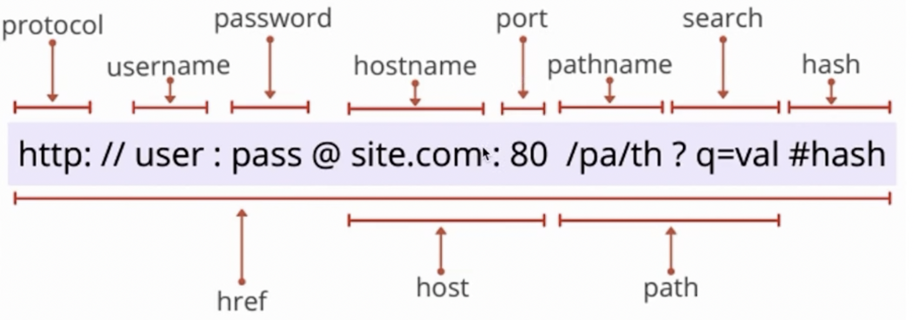
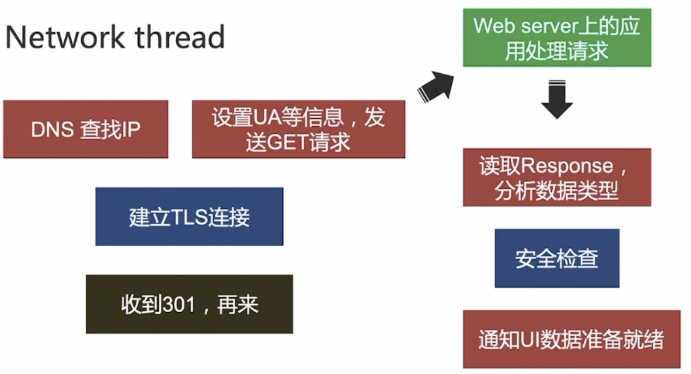
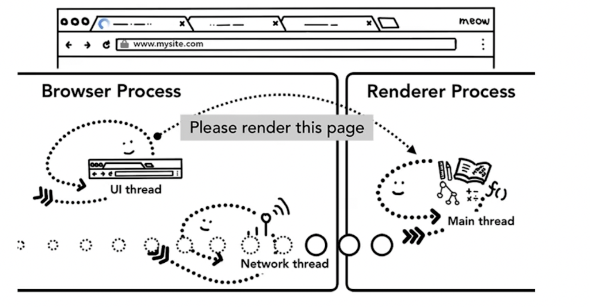
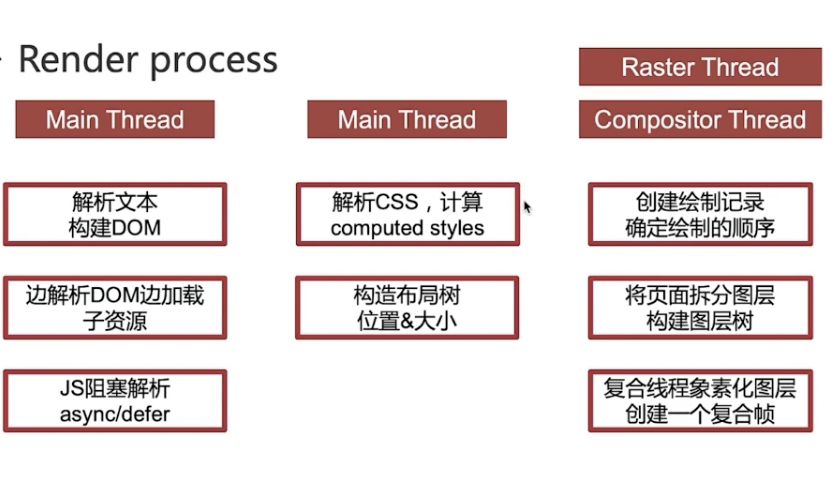
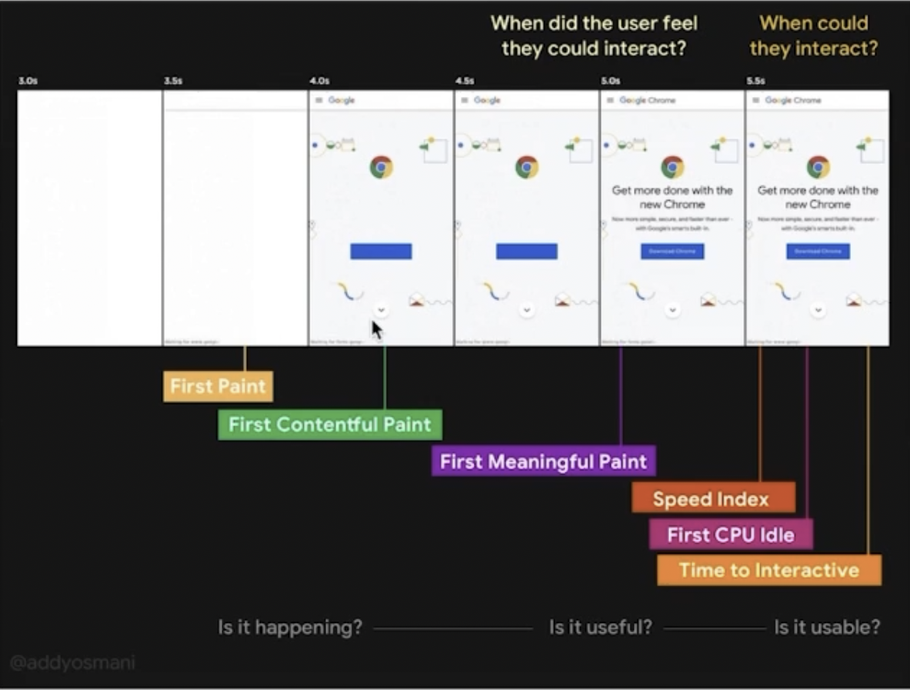
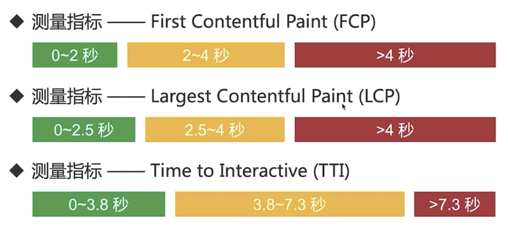

# 09-性能优化问题面试指南【能胸有成竹的一步】

## 01：Web加载&渲染基本原理

### 问题

从输入url到页面加载显示完成都发生了什么？

### 分析

* 知识点广，区分度高
* 自己擅长的点可以适当展开
* 渲染过程是重点

### 解答

* UI thread：搜索 or url？ -> 搜索引擎 or 请求的站点

  

* Network thread

  

* Renderer process

  

  

## 02：首屏加载优化

### 问题

什么是首屏加载？怎么优化？

### 分析

* web 增量加载的特点决定了首屏性能不会完美
* 过长的白屏影响用户体验和留存
* 首屏（above the fold） -> 初次印象

### 解答

* 首屏：用户加载体验的3个关键时刻

  

* 测量指标：

  

### 解答

* 资源体积太大

  > 资源压缩，传输压缩，代码拆分，tree shaking，http/2，缓存

* 首页内容太多

  > 路由/组件/内容lazy-loading，预渲染/ssr，inline css

* 加载顺序不合适

  > prefetch，preload

## 03: JavaScript 内存管理

### 问题

js是怎样管理内存的？什么情况会造成内存泄漏？

### 分析

* 内存泄漏严重影响性能
* 高级语言 != 不需要管理内存

### 解答

* 变量创建时自动分配内存，不使用时“自动”释放内存（GC）
* 内存释放的主要问题是如何确定不再需要使用的内存
* 所有的 GC 都是近似实现，只能通过判断变量是否还能再次访问到
* 局部变量，函数执行完，没有闭包引用，就会被标记回收
* 全局变量，直至浏览器卸载页面时释放
* 引用计数（无法解决循环引用的问题）
* 标记清除
* 避免意外的全局变量产生
* 避免反复运行引发大量闭包
* 避免脱离的dom元素
