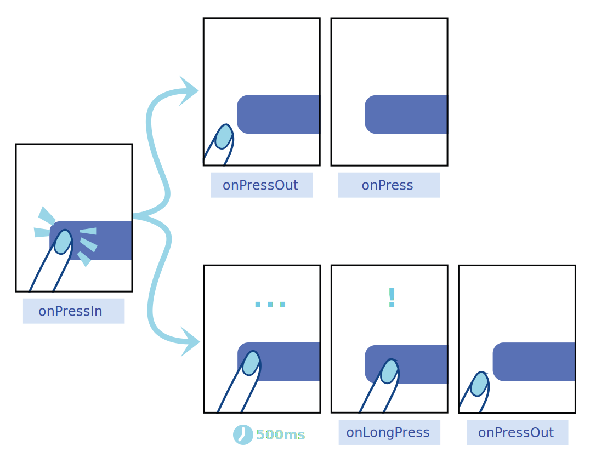
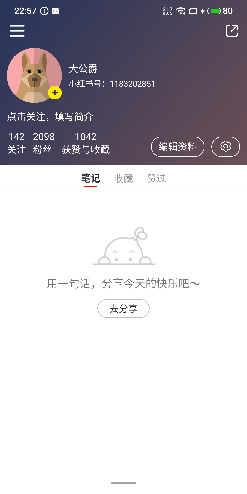

# 06-全面掌握系统组件的使用方法以及各种属性的应用场景

## 01: 详解系统组件用法

- `View`: UI 构建的基石，一切页面的起点
- `Text`：使用占比最高的组件，使用简单，深入复杂
- `Image`：精美的 UI 从使用图片开始
- `ImageBackground`：View 和 Image 的合体
- `TextInput`：唯一且强大的输入组件
- `TouchableOpacity`：最好用的点击组件
- `TouchableHighlight`：稍显麻烦但是效果丰富的点击组件
- `TouchableWithoutFeedback`：使用很少的点击组件
- `Button`：固定样式的点击按钮组件，优点是使用简单
- 强大的 `Pressable`, 帮你实现复杂的交互效果（新）
- `ScrollView`：基础滚动组件，快速实现列表渲染
- `FlatList`：一个高性能的列表组件
- `SectionList`：强中之强，多类型分组列表
- `RefreshControl`: 下拉刷新，上拉加载
- `Modal`：实现不同样式的弹窗
- `StatusBar`: 状态栏适配的难题交给我
- `Switch`：开关切换，一键搞定
- 作业：个人信息页练习

## 02: View: UI 构建的基石，一切页面的起点

- `flexDirection`: 横向纵向布局
- `flexGrow` 和 `flex` 的区别
- 尺寸属性传百分比和数值
- `position`: `absolute` 绝对定位下仍然受父级属性的影响
- `onLayout`: 布局信息的回调
- `setNativeProps`: 性能瓶颈下的选择余地

## 03: Text：使用占比最高的组件

- 字体属性: `fontSize`、`fontFamily`、`fontWeight`
- 行数以及修饰模式：`numberOfLines`、`ellipsizeMode`
- 是否可选中以及选中颜色：`selectable`、`selectionColor`
- 点击和长按：`onPress`、`onLongPress`
- 跟随系统字号：`allowFontScaling`
- 文字嵌套以及注意事项：嵌套时候部分样式不生效，比如 `marginLeft`等
- 文本对齐：`textAlign`、`textAlignVertical`
- 文本装饰：`textDecorationStyle`、`textDecorationLine`
- 文字阴影：`textShadowColor`、`textShadowOffset`、`textShadowRadius`一起使用

## 04: Image：精美的 UI 从使用图片开始

- 图片源的两种类型：`source`
- 缩放模式：`resizeMode`
- `blurRadius`: 曾经的难题现在如此简单
- 占位图片：`defaultSource`
- 渐入动画时间：`fadeDuration`
- 加载成功和加载失败：`onLoad`、`onError`
- 加载开始与加载结束：`onLoadStart`、`onLoadEnd`
- 着色：`tintColor`
- api: `Image.getSize()`、`Image.prefetch()`

## 05: ImageBackground-View 和 Image 的结合

## 06: TextInput：唯一且强大的输入组件

- 字体样式：与 `Text` 一致
- 自动聚焦：`autoFocus`: 布尔值 和 focus()
- 自动失焦：`blurOnSubmit`: 布尔值 和 blur()
- 隐藏光标：`caretHidden`
- 默认值：`defaultValue`
- 可编辑性：`editable`
- 键盘类型：`keyboardType`
  - `default`
  - `number-pad`
  - `decimal-pad`
  - `numeric`
  - `email-address`
  - `phone-pad`
- 确定键配置：`returnKeyType`
  - `done`
  - `go`
  - `next`
  - `search`
  - `send`
- 最大长度：`maxLength`
- 多行输入：`multiline` 和 `numberOfLines`
- 焦点回调：`onBlur` 和 `onFocus`
- 内容回调：`onChange` 和 `onChangeText`
- 选中相关：`selection`、`selectionColor`、`selectTextOnFocus`
- 对齐方式：`textAlign` 和 `textAlignVertical`
- 安全模式：`secureTextEntry`(),输入后前面输入的变为…
  - 注意：不能和 `multiline` 同时使用

## 07: TouchableOpacity 最好用的点击组件

- 透明度渐变阈值：`activeOpacity`
- 点击事件：onPress、onLongPress、delayLongPress
- 点击事件起止：onPressIn、onPressout

```jsx
import React from 'react'
import { View, TouchableOpacity, StyleSheet, Text } from 'react-native'

const styles = StyleSheet.create({
  root: {
    width: '100%',
    height: '100vh',
    backgroundColor: '#F0F0F0',
  },
  button: {
    width: 300,
    height: 65,
    backgroundColor: '#2030FF',
    display: 'flex',
    alignItems: 'center',
    justifyContent: 'center',
  },
  txt: {
    fontSize: 20,
    color: 'white',
    fontWeight: 'bold',
  },
})
export default function TouchableOpacityDemo(props) {
  return (
    <View style={styles.root}>
      <TouchableOpacity
        activeOpacity={0.4}
        style={styles.button}
        onPress={() => {
          console.log('onPress')
        }}
        onLongPress={() => {
          console.log('onLongPress')
        }}
        delayLongPress={1000}
        onPressIn={() => {
          console.log('onPressIn')
        }}
        onPressOut={() => {
          console.log('onPressOut')
        }}
      >
        <Text style={styles.txt}>点击我</Text>
      </TouchableOpacity>
    </View>
  )
}
```

点击后执行顺序如下

```txt
onPressIn
onPressOut
onPress
```

长按后执行顺序如下

```txt
onPressIn
onLongPress
onPressOut
```

## 08: TouchableHighlight 使用略显麻烦的点击组件

> 用的不过，使用略显麻烦

- 所有点击类事件和 TouchableOpacity 相同
- 只支持一个子节点，且必须有一个子节点
- 使用陷阱：必须复写 onPress
- underlayColor: 指定点击时高亮的颜色

```jsx
import React from 'react'
import { View, TouchableHighlight, StyleSheet, Text } from 'react-native'

const styles = StyleSheet.create({
  root: {
    width: '100%',
    height: '100vh',
    backgroundColor: '#F0F0F0',
  },
  button: {
    width: 300,
    height: 65,
    backgroundColor: '#2030FF',
    display: 'flex',
    alignItems: 'center',
    justifyContent: 'center',
  },
  txt: {
    fontSize: 20,
    color: 'white',
    fontWeight: 'bold',
  },
})
export default function TouchableOpacityDemo(props) {
  return (
    <View style={styles.root}>
      <TouchableHighlight
        activeOpacity={0.4}
        style={styles.button}
        underlayColor='#00bcd4' // 指定点击时，高亮的颜色
        onPress={() => {
          console.log('onPress')
        }}
        onLongPress={() => {
          console.log('onLongPress')
        }}
        delayLongPress={1000}
        onPressIn={() => {
          console.log('onPressIn')
        }}
        onPressOut={() => {
          console.log('onPressOut')
        }}
      >
        <Text style={styles.txt}>点击我</Text>
      </TouchableHighlight>
    </View>
  )
}
```

点击后日志如下

```txt
onPressIn
onPressOut
onPress
```

## 09: TouchableWithoutFeedback 几乎不用的

> 官方文档：除非你有一个很好的理由 ，否则不要使用这个组件。所有能够响应触屏操作的元素在触屏后都应该有一个视觉上的反馈
>
> 只支持一个子节点，且自身不支持样式

```jsx
import React from 'react'
import { View, TouchableWithoutFeedback, StyleSheet, Text } from 'react-native'

const styles = StyleSheet.create({
  root: {
    width: '100%',
    height: '100vh',
    backgroundColor: '#F0F0F0',
  },
  button: {
    width: 300,
    height: 65,
    backgroundColor: '#2030FF',
    display: 'flex',
    alignItems: 'center',
    justifyContent: 'center',
  },
  txt: {
    fontSize: 20,
    color: 'white',
    fontWeight: 'bold',
  },
})
export default function TouchableOpacityDemo(props) {
  return (
    <View style={styles.root}>
      <TouchableWithoutFeedback>
        <View style={styles.button}>
          <Text style={styles.txt}>点击我</Text>
        </View>
      </TouchableWithoutFeedback>
    </View>
  )
}
```

## 10: Button: 使用简单，但是样式固定（不能定制）

- title: 设置按钮显示文字(必须声明)
- color: 设置按钮颜色
- disabled: 设置按钮不可点击
- onPress: 设置按钮点击事件
- 需要定制样式的话，使用 TouchableOpacity，如果对按钮没有样式要求可以使用

```jsx
import React from 'react'
import { View, Button, StyleSheet, Text } from 'react-native'

const styles = StyleSheet.create({
  root: {
    width: '100%',
    height: '100vh',
    backgroundColor: '#F0F0F0',
  },
  button: {
    width: 200,
    height: 300,
    backgroundColor: 'red',
  },
})

export default function ButtonDemo() {
  return (
    <View style={styles.root}>
      <Button
        style={styles.button} // 并不能生效
        title='按钮'
        color={'green'}
        onPress={() => {
          console.log('onPress')
        }}
        disabled={false}
      />
    </View>
  )
}
```

## 11: 强大的 Pressable

> 可以实现未点击、点击时不一样的样式效果

- 点击类事件和其他点击组件一样
- 带状态样式与带装填子节点
- 代码简写



```jsx
import React, { useEffect, useState } from 'react'
import { Text, Pressable, View, StyleSheet } from 'react-native'

const styles = StyleSheet.create({
  root: {
    width: '100%',
    height: '100vh',
    backgroundColor: '#F0F0F0',
  },
  text: { color: 'white' },
  textPressed: {
    color: 'blue',
  },
})
export default function PressableDemo() {
  return (
    <View style={styles.root}>
      <Pressable
        style={(state) => {
          const { pressed } = state
          return {
            width: 300,
            height: 65,
            backgroundColor: pressed ? 'white' : '#2030FF',
            borderRadius: 10,
            justifyContent: 'center',
            alignItems: 'center',
          }
        }}
      >
        {(state) => {
          const { pressed } = state
          return (
            <Text style={pressed ? styles.textPressed : styles.text}>按钮</Text>
          )
        }}
      </Pressable>
    </View>
  )
}
```

## 12: ScrollView 基础滚动组件

- 添加子节点：固定子元素、列表渲染、数组渲染
- 内容包裹样式：contentContainerStyle
- 滚动键盘消失：keyboardDismissMode
- 点击收起键盘：keyboardShouldPersisTaps
- 滚动开始与结束: onMomentumScrollBegin/End
- 滚动距离监听：onScroll (IOS: scrollEventThrottle ios 中需要配合这个属性，不然只会触发一次)
- 超过滚动：overScrollMode
- 分页滚动：pagingEnable 滚动方向：horizontal
- 滚动开关：scrollEnable
- 初始滚动：contentOffset
- 是否展示滚动条：showsVerticalScrollIndicator、showsHorizontalScrollIndicator
- 吸顶元素：stickyHeaderIndices: 是一个数组，包含要吸顶元素的索引
- api: scrollTo()、scrollEnd()

```jsx
import React, { useRef } from 'react'
import {
  Text,
  ScrollView,
  StyleSheet,
  TextInput,
  View,
  Dimensions,
  Button,
} from 'react-native'
const { width, height } = Dimensions.get('screen')
const styles = StyleSheet.create({
  root1: {
    width: '100%',
    height: 700,
    backgroundColor: 'white',
    // display: 'none',
  },
  root2: {
    width: '100%',
    height: 200,
  },
  contentContainer: {
    paddingHorizontal: 16,
    backgroundColor: '#E0E0E0',
    paddingTop: 20,
  },
  text: {
    width: '100%',
    height: 56,
    textAlignVertical: 'center',
    fontSize: 24,
    color: 'black',
    backgroundColor: 'gray',
    marginBottom: 10,
  },
  input: {
    width: '100%',
    height: 60,
    backgroundColor: 'white',
  },
})

export default function ScrollViewDemo() {
  const scrollViewRef = useRef(null)
  const array = [8, 9, 10, 11, 12, 13, 14, 15, 16]
  const buildListView = () => {
    const newArray = []
    for (let index = 20; index <= 40; index++) {
      newArray.push(
        <Text key={'item-' + index} style={styles.text}>
          List Item{index}
        </Text>,
      )
    }
    return newArray
  }
  return (
    <View>
      <ScrollView
        ref={scrollViewRef}
        style={styles.root1}
        showsVerticalScrollIndicator={false}
        contentOffset={{ y: 100 }} // 指定初始时滚动位置
        keyboardDismissMode='none'
        keyboardShouldPersistTaps='on-drags'
        onScroll={(event) => {
          console.log(event.nativeEvent.contentOffset.y)
        }}
        scrollEnabled={true}
        stickyHeaderIndices={[0]}
        contentContainerStyle={styles.contentContainer}
      >
        <Button
          title='按钮'
          onPress={() => {
            // scrollViewRef.current.scrollTo({y: 500, animated: true});
            scrollViewRef.current.scrollToEnd({ animated: true })
          }}
        />
        <Text style={styles.text}>1</Text>
        <Text style={styles.text}>2</Text>
        <Text style={styles.text}>3</Text>
        <Text style={styles.text}>45</Text>
        <Text style={styles.text}>5</Text>
        <Text style={styles.text}>6</Text>
        <Text style={styles.text}>7</Text>
        <TextInput style={styles.input} />
        {array.map((item) => {
          return (
            <Text key={item} style={styles.text}>
              List item {item}
            </Text>
          )
        })}
        {buildListView()}
      </ScrollView>
      {/* 横向类似轮播 */}
      {/* <ScrollView horizontal={true} style={styles.root2} pagingEnabled={true}>
        <View style={{width, height: 200, backgroundColor: 'red'}} />
        <View style={{width, height: 200, backgroundColor: 'blue'}} />
        <View style={{width, height: 200, backgroundColor: 'green'}} />
      </ScrollView> */}
    </View>
  )
}
```

## 13: FlatList 高性能列表组件

- 基础使用: data、renderItem、keyExtractor
- ScrollView 属性：内容容器、滚动条、滚动监听、键盘模式等
  - showsVerticalScrollIndicator： 是否显示竖直滚动条
  - showsHorizontalScrollIndicator: 是否显示横向滚动条
  - 滚动监听：onScroll
  - 键盘模式：keyboardDismissMode、keyboardShouldPersistTaps
- 横向纵向：horizontal
- 列表头部：ListHeaderComponent
- 列表尾部：ListFooterComponent
- 空元素：ListEmptyComponent，列表无数据时候显示的内容
- 分割线元素：ItemSeparatorComponent
- 初始渲染元素：initialNumToRender: number | undefined
- 反向：inverted
- 多列排布：numColumns
- 可见元素回调：onViewableItemsChanged， 可以获得那些元素是可见的，滚动时也会触发
- 滚动到指定元素：scrollToIndex()、scrollToItem()后者不推荐，因为需要遍历元素并找到元素。前者是索引，后者是元素
- 滚动到指定距离：scrollToOffset
- 滚动到底：scrollToEnd

```jsx
import React, { useEffect, useRef } from 'react'
import { FlatList, StyleSheet, Text, View } from 'react-native'

const styles = StyleSheet.create({
  root: {
    width: '100%',
    height: '100%',
  },
  container: {
    width: '100%',
    height: '50%',
  },
  text: {
    width: '50%',
    height: 56,
    fontSize: 24,
    color: 'black',
  },
  text2: {
    width: 100,
    height: 56,
    fontSize: 24,
    color: 'black',
  },
  containerStyle: {
    paddingHorizontal: 16,
    paddingTop: 20,
  },
  header: {
    width: '100%',
    height: 40,
    backgroundColor: 'green',
    justifyContent: 'center',
    alignItems: 'center',
  },
  headerText: {
    fontSize: 24,
    color: 'black',
  },
  footer: {
    width: '100%',
    height: 40,
    backgroundColor: 'pink',
    justifyContent: 'center',
    alignItems: 'center',
  },
  empty: {
    width: '100%',
    height: 200,
    backgroundColor: 'white',
    justifyContent: 'center',
    alignItems: 'center',
  },
  listSeparator: {
    width: '100%',
    height: 1,
    backgroundColor: '#D0D0D0',
  },
})
const data = [
  1, 2, 3, 4, 5, 6, 7, 8, 9, 10, 11, 12, 13, 14, 15, 16, 17, 18, 19, 20, 21, 22,
  23, 24, 25, 26, 27, 28, 29, 30, 31, 32, 33, 34,
]
const data2 = [1, 2, 3, 4, 5, 6, 7, 8, 9, 10]
const renderItem = ({ item, info }) => {
  return <Text style={styles.text}>{item}</Text>
}
const renderItem2 = ({ item, info }) => {
  return <Text style={styles.text2}>{item}</Text>
}
const ListHeader = () => (
  <View style={styles.header}>
    <Text style={styles.headerText}>ListHeader</Text>
  </View>
)
const ListFooter = () => (
  <View style={styles.footer}>
    <Text style={styles.headerText}>ListFooter</Text>
  </View>
)
const ListEmpty = () => (
  <View style={styles.empty}>
    <Text style={styles.headerText}>暂时无数据哦~</Text>
  </View>
)
export default function FlatListDemo() {
  const flatListRef = useRef(null)
  useEffect(() => {
    setTimeout(() => {
      // flatListRef.current.scrollToIndex({
      //   index: 5,
      //   viewPosition: 0, // 0 是屏幕顶部，1是屏幕底部，0.5 是屏幕中间
      //   animated: true,
      // });
      // flatListRef.current.scrollToItem({
      //   item: 11,
      //   viewPosition: 0,
      //   animated: true,
      // });
      //
      // flatListRef.current.scrollToOffset({
      //   offset: 200,
      // });
      flatListRef.current.scrollToEnd({
        animated: true,
      })
    }, 2000)
  }, [])

  return (
    <View style={styles.root}>
      <FlatList
        ref={flatListRef}
        style={styles.container}
        // data={[] || data}
        data={data}
        keyExtractor={(item, index) => `item-${index}`}
        renderItem={renderItem}
        contentContainerStyle={styles.containerStyle}
        showsVerticalScrollIndicator={false}
        onScroll={(event) => {
          console.log(event.nativeEvent.contentOffset.y)
        }}
        keyboardDismissMode='on-drag'
        keyboardShouldPersistTaps='handled'
        horizontal={false}
        ListHeaderComponent={ListHeader}
        ListFooterComponent={ListFooter}
        ListEmptyComponent={ListEmpty}
        ItemSeparatorComponent={<View style={styles.listSeparator} />}
        initialNumToRender={15}
        inverted={false}
        numColumns={2}
        onViewableItemsChanged={(info) => {
          // 可以获得滚动到哪个元素
          console.log(info.viewableItems)
        }}
      />
      {true && (
        <FlatList
          style={styles.container}
          data={data2}
          keyExtractor={(item, index) => `item-${index}`}
          renderItem={renderItem2}
          showsHorizontalScrollIndicator={false}
          onScroll={(event) => {
            console.log(event.nativeEvent.contentOffset.x)
          }}
          keyboardDismissMode='on-drag'
          keyboardShouldPersistTaps='handled'
          horizontal={true}
        />
      )}
    </View>
  )
}
```

## 14: SectionList 多类型分组列表

- 基础使用：sections、renderItem、keyExtractor
- ScrollView 属性：内容容器、滚动条、滚动监听、键盘模式等
- 列表头部：ListHeaderComponent
- 列表尾部：ListFooterComponent
- 分组头部：renderSectionHeader
- 分割线元素：ItemSeparatorComponent
- 分组吸顶：stickySectionHeadersEnabled, 与 renderSectionHeader 配合使用
- 滚动 api: scrollToLocation()

```jsx
import React, { useEffect, useRef } from 'react'
import { View, SectionList, Text, StyleSheet } from 'react-native'

const styles = StyleSheet.create({
  sectionList: {
    width: '100%',
    height: '100%',
  },
  txt: {
    width: '100%',
    height: 56,
    fontSize: 20,
    color: '#333',
    textAlignVertical: 'center',
  },
  sectionHederTxt: {
    width: '100%',
    height: 36,
    backgroundColor: '#DDDDDD',
    textAlignVertical: 'center',
    paddingLeft: 16,
    fontSize: 20,
    color: '#333',
  },
  contentContainer: {
    // paddingLeft: 16,
    backgroundColor: 'white',
  },
  listSeparator: {
    width: '100%',
    height: 1,
    backgroundColor: '#D0D0D0',
  },
})

const SectionData = [
  { type: 'A', data: ['唐僧', '猪八戒', '孙悟空'] },
  {
    type: 'B',
    data: ['包青天', '公孙策', '展昭', '王朝', '马汉', '张龙', '赵虎'],
  },
  {
    type: 'C',
    data: ['包青天2', '公孙策2', '展昭2', '王朝2', '马汉2', '张龙2', '赵虎2'],
  },
]
const renderItem = ({ item, index, section }) => {
  return (
    <View>
      <Text style={styles.txt}>{item}</Text>
    </View>
  )
}
const renderSectionHeader = ({ section }) => {
  return <Text style={styles.sectionHederTxt}>{section.type}</Text>
}
export default function SectionListDemo() {
  const sectionListRef = useRef(null)

  useEffect(() => {
    setTimeout(() => {
      sectionListRef.current.scrollToLocation({
        sectionIndex: 1,
        itemIndex: 3,
        viewPosition: 0,
        animated: true,
      })
    }, 2000)
  }, [])

  return (
    <SectionList
      ref={sectionListRef}
      sections={SectionData}
      renderItem={renderItem}
      style={styles.sectionList}
      keyExtractor={(item, index) => `${item}-${index}`}
      contentContainerStyle={styles.contentContainer}
      renderSectionHeader={renderSectionHeader}
      ItemSeparatorComponent={() => <View style={styles.listSeparator} />}
      stickySectionHeadersEnabled={true}
    />
  )
}
```

## 15: RefreshControl:下拉刷新

- 下拉刷新：refreshing、onRefresh
- 上拉加载：onEndReached、onEndReachedThreshold

```jsx
import React, { useEffect, useRef, useState } from 'react'
import {
  View,
  SectionList,
  Text,
  StyleSheet,
  RefreshControl,
} from 'react-native'

const styles = StyleSheet.create({
  sectionList: {
    width: '100%',
    height: '100%',
  },
  txt: {
    width: '100%',
    height: 56,
    fontSize: 20,
    color: '#333',
    textAlignVertical: 'center',
  },
  sectionHederTxt: {
    width: '100%',
    height: 36,
    backgroundColor: '#DDDDDD',
    textAlignVertical: 'center',
    paddingLeft: 16,
    fontSize: 20,
    color: '#333',
  },
  contentContainer: {
    // paddingLeft: 16,
    backgroundColor: 'white',
  },
  listSeparator: {
    width: '100%',
    height: 1,
    backgroundColor: '#D0D0D0',
  },
})

const SectionData = [
  { type: 'A', data: ['唐僧', '猪八戒', '孙悟空'] },
  {
    type: 'B',
    data: ['包青天', '公孙策', '展昭', '王朝', '马汉', '张龙', '赵虎'],
  },
  {
    type: 'C',
    data: ['包青天2', '公孙策2', '展昭2', '王朝2', '马汉2', '张龙2', '赵虎2'],
  },
]
const renderItem = ({ item, index, section }) => {
  return (
    <View>
      <Text style={styles.txt}>{item}</Text>
    </View>
  )
}
const renderSectionHeader = ({ section }) => {
  return <Text style={styles.sectionHederTxt}>{section.type}</Text>
}
export default function SectionListDemo() {
  const sectionListRef = useRef(null)
  const [refreshing, setRefreshing] = useState(false)
  useEffect(() => {
    setTimeout(() => {
      //   sectionListRef.current.scrollToLocation({
      //     sectionIndex: 1,
      //     itemIndex: 3,
      //     viewPosition: 0,
      //     animated: true,
      //   });
    }, 2000)
  }, [])

  return (
    <SectionList
      ref={sectionListRef}
      sections={SectionData}
      renderItem={renderItem}
      style={styles.sectionList}
      keyExtractor={(item, index) => `${item}-${index}`}
      contentContainerStyle={styles.contentContainer}
      renderSectionHeader={renderSectionHeader}
      ItemSeparatorComponent={() => <View style={styles.listSeparator} />}
      stickySectionHeadersEnabled={true}
      refreshControl={
        <RefreshControl
          refreshing={refreshing}
          onRefresh={() => {
            setRefreshing(true)
            console.log('onRefreshing ,,, do some request new data')
            setTimeout(() => {
              setRefreshing(false)
            }, 3000)
          }}
        />
      }
      onEndReached={() => {
        console.log('onEndReached,,,')
        //  to do something request next page data
      }}
      onEndReachedThreshold={0.2} // 取值：0-1,屏幕高度的百分比
    />
  )
}
```

## 16: Modal 自定义弹窗

- 控制显示：visible
- 渲染内容：children
- 安卓返回关闭：onRequestClose
- 背景透明：transparent
- 状态栏透明：statusBarTranslucent
- 动画方式：animationType： fade | none | slide
- 状态回调：onShow、onDismiss
- 背景动画：伏笔（顶部的蒙灰层比较突兀，一直从底部弹到顶部）

```jsx
import React, { useState } from 'react'
import {
  View,
  StyleSheet,
  Modal,
  SectionList,
  Text,
  Button,
} from 'react-native'
const styles = StyleSheet.create({
  root: {
    width: '100%',
    height: '100%',
    paddingHorizontal: 16,
  },
  content: {
    width: '100%',
    height: '90%',
    backgroundColor: '#ff00030',
  },
  sectionList: {
    width: '100%',
    height: '100%',
  },
  blank: {
    width: '100%',
    height: '10%',
    backgroundColor: '#00000050',
  },
  txt: {
    width: '100%',
    height: 56,
    fontSize: 20,
    color: '#333',
    textAlignVertical: 'center',
  },
  contentContainer: {
    // paddingLeft: 16,
    backgroundColor: 'white',
  },
  listSeparator: {
    width: '100%',
    height: 1,
    backgroundColor: '#D0D0D0',
  },
})
const SectionData = [
  { type: 'A', data: ['唐僧', '猪八戒', '孙悟空'] },
  {
    type: 'B',
    data: ['包青天', '公孙策', '展昭', '王朝', '马汉', '张龙', '赵虎'],
  },
  {
    type: 'C',
    data: ['包青天2', '公孙策2', '展昭2', '王朝2', '马汉2', '张龙2', '赵虎2'],
  },
]
const renderItem = ({ item, index, section }) => {
  return (
    <View>
      <Text style={styles.txt}>{item}</Text>
    </View>
  )
}
const renderSectionHeader = ({ section }) => {
  return <Text style={styles.sectionHederTxt}>{section.type}</Text>
}
export default function ModalDemo() {
  const [visible, setVisible] = useState(false)
  return (
    <View style={styles.root}>
      <Button
        title='按钮'
        onPress={() => {
          setVisible(true)
        }}
      />
      <Modal
        animationType='slide'
        visible={visible}
        transparent={true}
        onShow={() => {
          console.log('onSHow')
        }}
        onDismiss={() => {
          console.log('onDismiss') // 有 bug 不会触发
        }}
        statusBarTranslucent={true}
        onRequestClose={() => {
          // ios 没有物理返回键，可以通过 表头设置返回键，点击触发关闭操作
          setVisible(false)
        }}
      >
        <View style={styles.blank} />
        <View style={styles.content}>
          <SectionList
            sections={SectionData}
            renderItem={renderItem}
            style={styles.sectionList}
            keyExtractor={(item, index) => `${item}-${index}`}
            contentContainerStyle={styles.contentContainer}
            renderSectionHeader={renderSectionHeader}
            ItemSeparatorComponent={() => <View style={styles.listSeparator} />}
            stickySectionHeadersEnabled={true}
          />
        </View>
      </Modal>
    </View>
  )
}
```

## 17：StatusBar: 适配状态栏

- 内容深浅模式：barStyle：'default' | 'light-content' | 'dark-content'; 指的是状态栏图标颜色
- 背景颜色：backgroundColor
- 动画切换: animated
- 透明悬浮：translucent，其实就是是否通顶
- 隐藏状态栏: hidden
- api: setBackgroundColor()、setBarStyle()、setHidden()、setTranslucent()

```jsx
import React, { useEffect, useRef } from 'react'
import { View, SectionList, Text, StyleSheet, StatusBar } from 'react-native'

const styles = StyleSheet.create({
  root: {
    width: '100%',
    height: '100%',
  },
  sectionList: {
    width: '100%',
    height: '100%',
  },
  txt: {
    width: '100%',
    height: 56,
    fontSize: 20,
    color: '#333',
    textAlignVertical: 'center',
  },
  sectionHederTxt: {
    width: '100%',
    height: 36,
    backgroundColor: '#DDDDDD',
    textAlignVertical: 'center',
    paddingLeft: 16,
    fontSize: 20,
    color: '#333',
  },
  contentContainer: {
    // paddingLeft: 16,
    backgroundColor: 'white',
  },
  listSeparator: {
    width: '100%',
    height: 1,
    backgroundColor: '#D0D0D0',
  },
})

const SectionData = [
  { type: 'A', data: ['唐僧', '猪八戒', '孙悟空'] },
  {
    type: 'B',
    data: ['包青天', '公孙策', '展昭', '王朝', '马汉', '张龙', '赵虎'],
  },
  {
    type: 'C',
    data: ['包青天2', '公孙策2', '展昭2', '王朝2', '马汉2', '张龙2', '赵虎2'],
  },
]
const renderItem = ({ item, index, section }) => {
  return (
    <View>
      <Text style={styles.txt}>{item}</Text>
    </View>
  )
}
const renderSectionHeader = ({ section }) => {
  return <Text style={styles.sectionHederTxt}>{section.type}</Text>
}
export default function SectionListDemo() {
  const sectionListRef = useRef(null)

  useEffect(() => {
    setTimeout(() => {
      sectionListRef.current.scrollToLocation({
        sectionIndex: 1,
        itemIndex: 3,
        viewPosition: 0,
        animated: true,
      })
    }, 2000)
  }, [])

  return (
    <View style={styles.root}>
      <StatusBar
        barStyle='light-content'
        backgroundColor='#303030'
        animated={true}
        translucent={true} // 通顶
        hidden={true}
      />
      <SectionList
        ref={sectionListRef}
        sections={SectionData}
        renderItem={renderItem}
        style={styles.sectionList}
        keyExtractor={(item, index) => `${item}-${index}`}
        contentContainerStyle={styles.contentContainer}
        renderSectionHeader={renderSectionHeader}
        ItemSeparatorComponent={() => <View style={styles.listSeparator} />}
        stickySectionHeadersEnabled={true}
      />
    </View>
  )
}
```

## 18: Switch 开关切换

- 指定开关：value
- 状态回调：onValueChange
- 禁用属性：disabled
- 背景颜色：trackColor
- 前景颜色：thumbColor

```jsx
import React, { useEffect, useState } from 'react'
import { Text, Switch } from 'react-native'

export default function () {
  const [switchState, setSwitchState] = useState(false)
  return (
    <Switch
      value={switchState}
      onValueChange={(value) => {
        setSwitchState(value)
      }}
      trackColor={{
        true: 'red',
        false: 'blue',
      }}
      thumbColor={switchState ? '#2030ff' : '#303030'}
      // disabled={true}
    />
  )
}
```

## 19: 课后作业

```jsx
import React, { useState } from 'react'
import {
  View,
  Text,
  StyleSheet,
  ImageBackground,
  Image,
  StatusBar,
  ScrollView,
  TouchableOpacity,
} from 'react-native'
import IconBg from '../assets/images/icon_bg.png'
import IconMenu from '../assets/images/icon_menu.png'
import IconShare from '../assets/images/icon_share.png'
import DefaultAvatar from '../assets/images/default_avatar.png'
import IconAdd from '../assets/images/icon_add.png'
import IconSetting from '../assets/images/icon_setting.png'
import Icon_1 from '../assets/images/icon_1.png'
import Icon_2 from '../assets/images/icon_2.png'
import Icon_3 from '../assets/images/icon_3.png'

const styles = StyleSheet.create({
  root: {
    width: '100%',
    height: '100%',
    paddingTop: 240,
  },
  header: {
    width: '100%',
    flexDirection: 'column',
    position: 'absolute',
    top: 0,
    left: 0,
    zIndex: 10,
  },

  headerImg: {
    width: '100%',
    flexDirection: 'column',
    height: 250,
    paddingTop: 20,
  },
  headerTop: {
    width: '100%',
    height: 50,
    paddingLeft: 10,
    paddingRight: 10,
    flexDirection: 'row',
    alignItems: 'center',
    justifyContent: 'space-between',
  },
  headerMiddle: {
    width: '100%',
    height: 80,
    flexDirection: 'row',
    position: 'relative',
    alignItems: 'center',
  },
  middleImg: {
    width: 80,
    height: 80,
    borderRadius: 40,
    marginLeft: 10,
    marginRight: 10,
  },
  middleImgAdd: {
    width: 20,
    height: 20,
    position: 'absolute',
    bottom: 5,
    left: 70,
  },
  middleTitle: {
    color: 'white',
    marginBottom: 4,
  },
  middleCode: {
    color: 'white',
    fontSize: 12,
  },
  middleTips: {
    color: 'white',
    margin: 10,
  },
  headerFooter: {
    display: 'flex',
    flexDirection: 'row',
    justifyContent: 'space-between',
  },
  footerLeft: {
    flexDirection: 'row',
  },
  footerRight: {
    marginRight: 10,
    flexDirection: 'row',
  },
  footerItem: {
    color: 'white',
    height: 50,
    marginLeft: 10,
  },
  footerRightBtn: {
    borderWidth: 1,
    borderRadius: 20,
    borderColor: 'white',
    alignSelf: 'center',
    justifyContent: 'center',
    height: 30,
    paddingBottom: 2,
    paddingLeft: 10,
    paddingRight: 10,
    marginLeft: 10,
  },
  btnText: {
    color: 'white',
  },
  itemNum: {
    color: 'white',
    textAlign: 'center',
  },
  itemText: {
    color: 'white',
  },
  rightSetIcon: {
    width: 20,
    height: 20,
  },
  shareIcon: {
    width: 24,
    height: 24,
  },
  hederIcon: {
    width: 30,
    height: 30,
  },
  content: {
    width: '100%',
    flex: 2,
    backgroundColor: 'white',
    borderTopLeftRadius: 10,
    borderTopRightRadius: 10,
  },
  scrollContentStyle: {
    padding: 10,
  },
  tabBar: {
    width: '100%',
    height: 40,
    backgroundColor: 'white',
    flexDirection: 'row',
    alignItems: 'center',
    justifyContent: 'center',
    borderBottomWidth: 1,
    borderBottomColor: '#f8f8f8',
  },
  barItemText: {
    color: '#999',
  },
  mr20: {
    marginRight: 20,
    position: 'relative',
    textAlign: 'center',
  },
  active: {
    width: '70%',
    height: 2,
    left: '15%',
    backgroundColor: 'red',
    position: 'absolute',
    bottom: -4,
  },
  activeText: {
    fontWeight: 'bold',
    color: '#333',
  },
})

const contentStyles = StyleSheet.create({
  icon: {
    width: 96,
    height: 96,
    resizeMode: 'contain',
  },
  desc: {
    fontSize: 16,
    marginTop: 16,
  },
  noDateItem: {
    width: '100%',
    alignItems: 'center',
  },
  button: {
    width: 76,
    height: 28,
    borderRadius: 14,
    borderWidth: 1,
    borderColor: '#C0C0C0',
    textAlign: 'center',
    textAlignVertical: 'center',
    marginTop: 12,
    color: '#333333',
  },
})

export default function UserInfoPage() {
  const [selectIndex, setSelectIndex] = useState(0)
  return (
    <View style={styles.root}>
      <StatusBar translucent={true} backgroundColor='transparent' />
      <View style={styles.header}>
        <ImageBackground style={styles.headerImg} source={IconBg}>
          <View style={styles.headerTop}>
            <Image style={styles.hederIcon} source={IconMenu} />
            <Image
              style={[styles.hederIcon, styles.shareIcon]}
              source={IconShare}
            />
          </View>
          <View style={styles.headerMiddle}>
            <Image style={styles.middleImg} source={DefaultAvatar} />
            <Image style={styles.middleImgAdd} source={IconAdd} />
            <View>
              <Text style={styles.middleTitle}>大公爵</Text>
              <Text style={styles.middleCode}>小红书号：1183202851</Text>
            </View>
          </View>
          <Text style={styles.middleTips}>点击关注，填写简介</Text>
          <View style={styles.headerFooter}>
            <View style={styles.footerLeft}>
              <View style={styles.footerItem}>
                <Text style={styles.itemNum}>142</Text>
                <Text style={styles.itemText}>关注</Text>
              </View>
              <View style={styles.footerItem}>
                <Text style={styles.itemNum}>2098</Text>
                <Text style={styles.itemText}>粉丝</Text>
              </View>
              <View style={styles.footerItem}>
                <Text style={styles.itemNum}>1042</Text>
                <Text style={styles.itemText}>获赞与收藏</Text>
              </View>
            </View>
            <View style={styles.footerRight}>
              <View style={styles.footerRightBtn}>
                <Text style={styles.btnText}>编辑资料</Text>
              </View>
              <View style={styles.footerRightBtn}>
                <Image
                  tintColor='white'
                  style={styles.rightSetIcon}
                  source={IconSetting}
                />
              </View>
            </View>
          </View>
        </ImageBackground>
      </View>
      <View style={styles.content}>
        <View style={styles.tabBar}>
          <TouchableOpacity
            activeOpacity={1}
            style={styles.mr20}
            onPress={() => {
              setSelectIndex(0)
            }}
          >
            <Text
              style={[
                styles.barItemText,
                selectIndex === 0 ? styles.activeText : '',
              ]}
            >
              笔记
            </Text>
            <View style={selectIndex === 0 ? styles.active : ''} />
          </TouchableOpacity>
          <TouchableOpacity
            activeOpacity={1}
            style={styles.mr20}
            onPress={() => {
              setSelectIndex(1)
            }}
          >
            <Text
              style={[
                styles.barItemText,
                selectIndex === 1 ? styles.activeText : '',
              ]}
            >
              收藏
            </Text>
            <View style={selectIndex === 1 ? styles.active : ''} />
          </TouchableOpacity>
          <TouchableOpacity
            activeOpacity={1}
            onPress={() => {
              setSelectIndex(2)
            }}
          >
            <Text
              style={[
                styles.barItemText,
                selectIndex === 2 ? styles.activeText : '',
              ]}
            >
              赞过
            </Text>
            <View style={selectIndex === 2 ? styles.active : ''} />
          </TouchableOpacity>
        </View>
        <ScrollView contentContainerStyle={styles.scrollContentStyle}>
          {selectIndex === 0 && (
            <View style={contentStyles.noDateItem}>
              <Image style={contentStyles.icon} source={Icon_1} />
              <Text style={contentStyles.desc}>
                用一句话，分享今天的快乐吧～
              </Text>
              <Text style={contentStyles.button}>去分享</Text>
            </View>
          )}
          {selectIndex === 1 && (
            <View style={contentStyles.noDateItem}>
              <Image style={contentStyles.icon} source={Icon_2} />
              <Text style={contentStyles.desc}>快去收藏你喜欢的作品吧～</Text>
              <Text style={contentStyles.button}>去收藏</Text>
            </View>
          )}
          {selectIndex === 2 && (
            <View style={contentStyles.noDateItem}>
              <Image style={contentStyles.icon} source={Icon_3} />
              <Text style={contentStyles.desc}>你还没有给作品点赞哦～</Text>
              <Text style={contentStyles.button}>去点赞</Text>
            </View>
          )}
        </ScrollView>
      </View>
    </View>
  )
}
```

老师给出的答案

```jsx
import React, { useState } from 'react'
import {
  StyleSheet,
  View,
  ImageBackground,
  Image,
  Text,
  TouchableOpacity,
  SectionList,
  Modal,
  StatusBar,
} from 'react-native'

import icon_bg from '../assets/images/icon_bg.png'
import icon_menu from '../assets/images/icon_menu.png'
import icon_share from '../assets/images/icon_share.png'
import avatar from '../assets/images/default_avatar.png'
import icon_add from '../assets/images/icon_add.png'
import icon_code from '../assets/images/icon_code.png'
import icon_male from '../assets/images/icon_male.png'
import icon_setting from '../assets/images/icon_setting.png'

import icon_1 from '../assets/images/icon_1.png'
import icon_2 from '../assets/images/icon_2.png'
import icon_3 from '../assets/images/icon_3.png'
import icon_close_modal from '../assets/images/icon_close_modal.png'

import { SectionData } from '../constants/Data'

export default () => {
  const [tabIndex, setTabIndex] = useState(0)
  const [visible, setVisible] = useState(false)

  const getContent = () => {
    const contentStyles = StyleSheet.create({
      icon: {
        width: 96,
        height: 96,
        resizeMode: 'contain',
      },
      desc: {
        fontSize: 16,
        marginTop: 16,
      },
      button: {
        width: 76,
        height: 28,
        borderRadius: 14,
        borderWidth: 1,
        borderColor: '#C0C0C0',
        textAlign: 'center',
        textAlignVertical: 'center',
        marginTop: 12,
        color: '#333333',
      },
    })
    const array = []
    array[0] = (
      <>
        <Image style={contentStyles.icon} source={icon_1} />
        <Text style={contentStyles.desc}>用一句话，分享今天的快乐吧～</Text>
        <Text style={contentStyles.button}>去分享</Text>
      </>
    )
    array[1] = (
      <>
        <Image style={contentStyles.icon} source={icon_2} />
        <Text style={contentStyles.desc}>快去收藏你喜欢的作品吧～</Text>
        <Text style={contentStyles.button}>去收藏</Text>
      </>
    )
    array[2] = (
      <>
        <Image style={contentStyles.icon} source={icon_3} />
        <Text style={contentStyles.desc}>你还没有给作品点赞哦～</Text>
        <Text style={contentStyles.button}>去点赞</Text>
      </>
    )
    return array
  }

  const renderModal = () => {
    const modalStyles = StyleSheet.create({
      root: {
        width: '100%',
        height: '100%',
        backgroundColor: 'transparent',
        flexDirection: 'column',
      },
      content: {
        width: '100%',
        height: '90%',
        backgroundColor: 'white',
      },
      nameTxt: {
        width: '100%',
        height: 46,
        textAlignVertical: 'center',
        paddingLeft: 16,
        fontSize: 16,
        color: '#333333',
      },
      typeTxt: {
        width: '100%',
        height: 36,
        backgroundColor: '#E0E0E0',
        textAlignVertical: 'center',
        paddingLeft: 16,
        fontSize: 16,
        color: '#666666',
      },
      listHeader: {
        width: '100%',
        flexDirection: 'column',
        paddingTop: 96,
      },
      titleLayout: {
        width: '100%',
        height: 46,
        backgroundColor: 'white',
        borderTopLeftRadius: 12,
        borderTopRightRadius: 12,
        justifyContent: 'center',
        alignItems: 'center',
      },
      titleTxt: {
        fontSize: 18,
        color: '#333333',
        fontWeight: 'bold',
      },
      closeButton: {
        position: 'absolute',
        right: 16,
      },
      closeImg: {
        width: 24,
        height: 24,
      },
    })
    return (
      <Modal
        visible={visible}
        onRequestClose={() => setVisible(false)}
        transparent={true}
        animationType='slide'
        statusBarTranslucent={true}
      >
        <View style={modalStyles.root}>
          <View style={modalStyles.listHeader}>
            <View style={modalStyles.titleLayout}>
              <Text style={modalStyles.titleTxt}>粉丝列表</Text>
              <TouchableOpacity
                style={modalStyles.closeButton}
                onPress={() => setVisible(false)}
              >
                <Image style={modalStyles.closeImg} source={icon_close_modal} />
              </TouchableOpacity>
            </View>
          </View>
          <View style={modalStyles.content}>
            <SectionList
              sections={SectionData}
              renderItem={({ item }) => (
                <Text style={modalStyles.nameTxt}>{item}</Text>
              )}
              keyExtractor={(item, index) => `${item}-${index}`}
              renderSectionHeader={({ section }) => (
                <Text style={modalStyles.typeTxt}>{section.type}</Text>
              )}
            />
          </View>
        </View>
      </Modal>
    )
  }

  const renderDashboard = () => {
    return (
      <ImageBackground
        style={styles.imgBg}
        source={icon_bg}
        imageStyle={styles.bgImg}
      >
        <View style={styles.titleBar}>
          <Image style={styles.iconMenu} source={icon_menu} />
          <Image style={styles.iconShare} source={icon_share} />
        </View>
        <View style={styles.infoLayout}>
          <View style={styles.avatarLayout}>
            <Image style={styles.avatarImg} source={avatar} />
            <Image style={styles.iconAdd} source={icon_add} />
            <View style={styles.nameLayout}>
              <Text style={styles.nameTxt}>大公爵</Text>
              <View style={styles.idLayout}>
                <Text style={styles.idTxt}>小红书号：118302851</Text>
                <Image style={styles.iconCode} source={icon_code} />
              </View>
            </View>
          </View>
        </View>

        <Text style={styles.descTxt}>点击关注，填写简介</Text>

        <View style={styles.sexView}>
          <Image style={styles.sexImg} source={icon_male} />
        </View>

        <View style={styles.countLayout}>
          <TouchableOpacity
            style={styles.itemLayout}
            onPress={() => setVisible(true)}
          >
            <Text style={styles.itemCount}>142</Text>
            <Text style={styles.itemLabel}>关注</Text>
          </TouchableOpacity>
          <View style={styles.itemLayout}>
            <Text style={styles.itemCount}>2098</Text>
            <Text style={styles.itemLabel}>粉丝</Text>
          </View>
          <View style={styles.itemLayout}>
            <Text style={styles.itemCount}>1042</Text>
            <Text style={styles.itemLabel}>获赞与收藏</Text>
          </View>

          <View style={{ flex: 1 }} />

          <TouchableOpacity style={styles.editButton} activeOpacity={0.5}>
            <Text style={styles.editTxt}>编辑资料</Text>
          </TouchableOpacity>

          <TouchableOpacity style={styles.settingButton} activeOpacity={0.5}>
            <Image style={styles.iconSetting} source={icon_setting} />
          </TouchableOpacity>
        </View>
      </ImageBackground>
    )
  }

  const renderTabs = () => {
    return (
      <>
        <View style={styles.tabsLayout}>
          <TouchableOpacity style={styles.tab} onPress={() => setTabIndex(0)}>
            <Text
              style={tabIndex === 0 ? styles.tabTxtSelected : styles.tabTxt}
            >
              笔记
            </Text>
            <View style={[styles.tabLine, tabIndex !== 0 && styles.hide]} />
          </TouchableOpacity>

          <TouchableOpacity style={styles.tab} onPress={() => setTabIndex(1)}>
            <Text
              style={tabIndex === 1 ? styles.tabTxtSelected : styles.tabTxt}
            >
              收藏
            </Text>
            <View style={[styles.tabLine, , tabIndex !== 1 && styles.hide]} />
          </TouchableOpacity>

          <TouchableOpacity style={styles.tab} onPress={() => setTabIndex(2)}>
            <Text
              style={tabIndex === 2 ? styles.tabTxtSelected : styles.tabTxt}
            >
              赞过
            </Text>
            <View style={[styles.tabLine, , tabIndex !== 2 && styles.hide]} />
          </TouchableOpacity>
        </View>

        <View style={styles.contentLayout}>{getContent()[tabIndex]}</View>
      </>
    )
  }

  return (
    <View style={styles.root}>
      <StatusBar
        barStyle='light-content'
        translucent={true}
        backgroundColor='transparent'
      />
      {renderDashboard()}
      {renderTabs()}
      {renderModal()}
    </View>
  )
}

const styles = StyleSheet.create({
  root: {
    width: '100%',
    height: '100%',
    backgroundColor: '#F5F5F5',
  },
  imgBg: {
    width: '100%',
    paddingTop: 20,
  },
  bgImg: {
    resizeMode: 'stretch',
  },
  titleBar: {
    width: '100%',
    flexDirection: 'row',
    alignItems: 'center',
    marginBottom: 8,
    marginTop: 16,
  },
  iconMenu: {
    width: 25,
    height: 25,
    resizeMode: 'contain',
    marginHorizontal: 16,
  },
  iconShare: {
    width: 25,
    height: 25,
    resizeMode: 'contain',
    position: 'absolute',
    right: 16,
  },
  infoLayout: {
    flexDirection: 'column',
    padding: 16,
  },
  avatarLayout: {
    width: '100%',
    flexDirection: 'row',
    alignItems: 'flex-end',
  },
  avatarImg: {
    width: 86,
    height: 86,
    borderRadius: 48,
    backgroundColor: 'white',
  },
  iconAdd: {
    width: 24,
    height: 24,
    marginLeft: -20,
    marginBottom: 2,
  },
  nameLayout: {
    flexDirection: 'column',
    marginBottom: 16,
    marginLeft: 8,
  },
  nameTxt: {
    fontSize: 22,
    color: 'white',
    fontWeight: 'bold',
  },
  idLayout: {
    flexDirection: 'row',
    alignItems: 'center',
    marginTop: 12,
  },
  idTxt: {
    fontSize: 14,
    color: 'white',
  },
  iconCode: {
    width: 12,
    height: 12,
    marginLeft: 4,
    tintColor: 'white',
  },
  descTxt: {
    fontSize: 16,
    color: 'white',
    marginLeft: 16,
    marginBottom: 8,
  },
  sexView: {
    marginTop: 6,
    width: 24,
    height: 18,
    backgroundColor: '#ffffff60',
    borderRadius: 9,
    justifyContent: 'center',
    alignItems: 'center',
    marginBottom: 16,
    marginLeft: 16,
  },
  sexImg: {
    width: 12,
    height: 12,
    resizeMode: 'contain',
    tintColor: '#1876ff',
  },
  countLayout: {
    width: '100%',
    flexDirection: 'row',
    alignItems: 'center',
    paddingHorizontal: 16,
    marginBottom: 28,
  },
  itemLayout: {
    flexDirection: 'column',
    alignItems: 'center',
    marginRight: 16,
  },
  itemCount: {
    fontSize: 16,
    color: 'white',
  },
  itemLabel: {
    fontSize: 14,
    color: '#ffffffc0',
    marginTop: 3,
  },
  editButton: {
    width: 80,
    height: 32,
    borderRadius: 16,
    borderColor: 'white',
    borderWidth: 1,
    justifyContent: 'center',
    alignItems: 'center',
  },
  editTxt: {
    fontSize: 14,
    color: '#ffffffE0',
  },
  settingButton: {
    width: 46,
    height: 32,
    borderRadius: 16,
    marginLeft: 12,
    borderColor: 'white',
    borderWidth: 1,
    justifyContent: 'center',
    alignItems: 'center',
  },
  iconSetting: {
    width: 20,
    height: 20,
    resizeMode: 'contain',
    tintColor: 'white',
  },
  tabsLayout: {
    width: '100%',
    height: 46,
    flexDirection: 'row',
    backgroundColor: 'white',
    borderTopLeftRadius: 12,
    borderTopRightRadius: 12,
    borderBottomWidth: 1,
    borderBottomColor: '#E0E0E0',
    justifyContent: 'center',
    alignItems: 'center',
    marginTop: -12,
    paddingTop: 4,
  },
  tab: {
    flexDirection: 'column',
    width: 64,
    height: '100%',
    justifyContent: 'center',
    alignItems: 'center',
  },
  tabTxt: {
    fontSize: 18,
    fontWeight: 'bold',
    color: '#909090',
  },
  tabTxtSelected: {
    fontSize: 18,
    fontWeight: 'bold',
    color: '#333333',
  },
  tabLine: {
    width: 28,
    height: 2,
    backgroundColor: '#f05856',
    marginTop: 4,
  },
  hide: {
    backgroundColor: 'transparent',
  },
  contentLayout: {
    width: '100%',
    flexGrow: 1,
    backgroundColor: '#FAFAFA',
    flexDirection: 'column',
    alignItems: 'center',
    paddingTop: 64,
  },
})
```

效果图如下：


