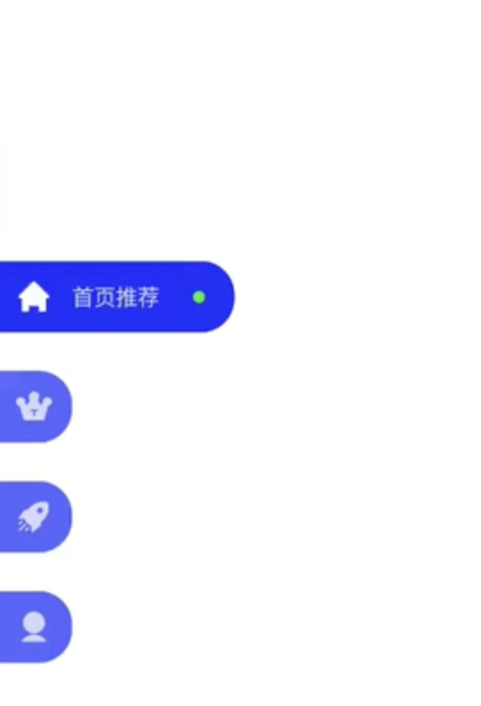

# 08-【夯实基础-RN动画系统】全面掌握RN动画所有技巧

## 01: 简单示例学习基础动画方法

* 演示一个简单的平移动画效果
* 使用 Animated.View、Animated.Value、UseRef

```jsx
import React, {useRef} from 'react';
import {Button, View, StyleSheet, Animated} from 'react-native';

const styles = StyleSheet.create({
  root: {
    width: '100%',
    height: '100%',
  },
  view1: {
    width: 100,
    height: 100,
    backgroundColor: 'red',
    marginTop: 10,
  },
});

export default function Anim1Demo() {
  const marginLeft = useRef(new Animated.Value(0)).current;
  const onPress = () => {
    Animated.timing(marginLeft, {
      toValue: 200,
      duration: 1000,
      // 是否启用原生驱动
      useNativeDriver: false,
    }).start();
  };

  return (
    <View style={styles.root}>
      <Button title="按钮" onPress={onPress} />
      {/* Animated.View 在布局上就可以当做 View */}
      <Animated.View style={[styles.view1, {marginLeft: marginLeft}]} />
    </View>
  );
}
```

## 02: 四大动画类型

### 平移

上节已经讲过了

### 旋转

```jsx
import React, {useRef} from 'react';
import {Button, View, StyleSheet, Animated} from 'react-native';

const styles = StyleSheet.create({
  root: {
    width: '100%',
    height: '100%',
  },
  view1: {
    width: 100,
    height: 100,
    backgroundColor: 'red',
    marginTop: 10,
  },
});

export default function Anim1Demo() {
  const rotate = useRef(new Animated.Value(0)).current;
  const rotateValue = rotate.interpolate({
    inputRange: [0, 30],
    outputRange: ['0deg', '30deg'],
  });
  const onPress = () => {
    Animated.timing(rotate, {
      toValue: 30,
      duration: 1000,
      // 是否启用原生驱动
      useNativeDriver: false,
    }).start();
  };

  return (
    <View style={styles.root}>
      <Button title="按钮" onPress={onPress} />
      {/* Animated.View 在布局上就可以当做 View */}
      <Animated.View
        style={[styles.view1, {transform: [{rotate: rotateValue}]}]}
      />
    </View>
  );
}

```

### 缩放

```jsx
import React, {useRef} from 'react';
import {Button, View, StyleSheet, Animated} from 'react-native';

const styles = StyleSheet.create({
  root: {
    width: '100%',
    height: '100%',
  },
  view1: {
    width: 100,
    height: 100,
    backgroundColor: 'red',
    marginTop: 100,
  },
});

export default function Anim1Demo() {
  const scale = useRef(new Animated.Value(1)).current;

  const onPress = () => {
    Animated.timing(scale, {
      toValue: 2.5,
      duration: 1000,
      // 是否启用原生驱动
      useNativeDriver: false,
    }).start();

    setTimeout(() => {
      Animated.timing(scale, {
        toValue: 0.5,
        duration: 1000,
        // 是否启用原生驱动
        useNativeDriver: false,
      }).start();
    }, 3000);
  };

  return (
    <View style={styles.root}>
      <Button title="按钮" onPress={onPress} />
      {/* Animated.View 在布局上就可以当做 View */}
      <Animated.View
        style={[
          styles.view1,
          {
            transform: [
              {
                scale: scale,
              },
            ],
          },
        ]}
      />
    </View>
  );
}

```

### 渐变

```jsx
import React, {useRef} from 'react';
import {Button, View, StyleSheet, Animated} from 'react-native';

const styles = StyleSheet.create({
  root: {
    width: '100%',
    height: '100%',
  },
  view1: {
    width: 100,
    height: 100,
    backgroundColor: 'red',
    marginTop: 10,
  },
});

export default function Anim1Demo() {
  const opacity = useRef(new Animated.Value(1)).current;
  const onPress = () => {
    Animated.timing(opacity, {
      toValue: 0.1,
      duration: 1000,
      // 是否启用原生驱动
      useNativeDriver: false,
    }).start();
  };

  return (
    <View style={styles.root}>
      <Button title="按钮" onPress={onPress} />
      {/* Animated.View 在布局上就可以当做 View */}
      <Animated.View style={[styles.view1, {opacity: opacity}]} />
    </View>
  );
}
```

## 03：六种支持动画的组件

### Animated.Image

### Animated.ScrollView

### Animated.Text

### Animated.View

### Animated.FlatList

### Animated.SectionList

## 04: 平移动画的多种属性支持

* marginLeft、marginRight、marginTop、marginBottom
* translateX、translateY
* top、right、bottom、left

## 05：Animated.decay衰减动画函数

### 三大动画函数

* Anmiated.decay(): 衰减动画函数
* Animated.spring(): 弹性动画函数
* Animated.timing(): 时间动画函数

### Anmiated.decay(): 衰减动画函数

* veloctiy: 初始速度
* deceleration: 衰减系数

```jsx
import React, {useRef} from 'react';
import {Button, View, StyleSheet, Animated} from 'react-native';

const styles = StyleSheet.create({
  root: {
    width: '100%',
    height: '100%',
  },
  view1: {
    width: 100,
    height: 100,
    backgroundColor: 'red',
    marginTop: 10,
  },
});

export default function Anim1Demo() {
  const marginLeft = useRef(new Animated.Value(0)).current;
  const onPress = () => {
    Animated.decay(marginLeft, {
      velocity: 1,
      deceleration: 0.997, // 减速系数，系数越大，速度变化越小，最后接近静止
      useNativeDriver: false,
    }).start();
  };

  return (
    <View style={styles.root}>
      <Button title="按钮" onPress={onPress} />
      {/* Animated.View 在布局上就可以当做 View */}
      <Animated.View style={[styles.view1, {marginLeft: marginLeft}]} />
    </View>
  );
}
```

## 06: Animated.spring 弹性动画函数

* toValue: 目标值

* ### 弹性配置：三组配置

  * bounciness、speed、
  * tension、friction
  * stiffness、damping、mass

弹性模型配置参数(第一组)

* bounciness(弹性)：控制弹性，越大越弹，默认值 8
* speed(速度)：控制弹的速度，默认值 12

弹性模型配置参数(第二组)

* tension（张力）：控制速度，越大速度越快，默认值 40
* friction（摩擦）：控制弹性与过冲，越小越弹，默认值 7

弹性模型配置参数(第三组)

* stiffness(刚度)：弹簧刚度系数，越大越弹，默认为100
* damping（阻尼）：弹簧运动因摩擦力而受到阻尼，越小越弹，默认值为10
* mass（质量）：附着在弹簧末端的物体的质量，越大惯性越大，动画越难停下，越小惯性越小，动画很快停下，默认值为1

对应三种物理模型

### 其他弹性系数

* velocity(速度): 附着在弹簧上物体的初始速度，默认值为0
* overshootClamping(过冲)：弹簧是否应该夹紧而不应该弹跳，默认值为false
* restDisplacementThreshold(恢复位移阈值)：从静止状态开始的位移阈值，低于该阈值，弹簧应该被视为静止状态，默认值为0.001
* restSpeedthreshold(弹簧静止速度)，单位为像素/秒，默认值为 0.001
* delay(延迟)：延迟后启动动画，默认值为 0

```jsx
import React, {useRef} from 'react';
import {Button, View, StyleSheet, Animated} from 'react-native';

const styles = StyleSheet.create({
  root: {
    width: '100%',
    height: '100%',
  },
  view1: {
    width: 100,
    height: 100,
    backgroundColor: 'red',
    marginTop: 10,
  },
});

export default function Anim1Demo() {
  const marginLeft = useRef(new Animated.Value(0)).current;
  const onPress = () => {
    Animated.spring(marginLeft, {
      toValue: 200,
      useNativeDriver: false,
      // 第一组配置
      // bounciness: 10,
      // speed: 28,
      // 第二组配置
      // tension: 10,
      // friction: 5,
      // 第三组配置
      stiffness: 20,
      damping: 40,
      mass: 10,
    }).start();
  };

  return (
    <View style={styles.root}>
      <Button title="按钮" onPress={onPress} />
      {/* Animated.View 在布局上就可以当做 View */}
      <Animated.View style={[styles.view1, {marginLeft: marginLeft}]} />
    </View>
  );
}
```

## 07: Animated.timing 时间动画函数

* easing: 时间动画函数

### 四种内置动画

* Easing.back(3), 回拉幅度
* Easing.bounce：弹跳
* Easing.ease：平缓
* Easing.elastic(3)：弹性（弹跳次数）

### 三种标准函数：

* Easing.linear： 一次方函数
* Easing.quad：二次方函数
* Easing.cubic：三次方函数

### 四种补充函数

* Easing.bezier(0,0,1,1):贝塞尔曲线
* Easing.circle：环形
* Easing.sin：正弦
* Easing.exp：指数

```jsx
import React, {useRef} from 'react';
import {Button, View, StyleSheet, Animated, Easing} from 'react-native';

const styles = StyleSheet.create({
  root: {
    width: '100%',
    height: '100%',
  },
  view1: {
    width: 100,
    height: 100,
    backgroundColor: 'red',
    marginTop: 10,
  },
});

export default function Anim1Demo() {
  const marginLeft = useRef(new Animated.Value(0)).current;
  const onPress = () => {
    Animated.timing(marginLeft, {
      toValue: 200,
      duration: 1000,
      useNativeDriver: false,
      // easing: Easing.elastic(3),
      // easing: Easing.cubic,
      easing: Easing.exp,
      // easing: Easing.sin,
      // easing: Easing.bezier(0.25, 0.1, 0.25, 1),
    }).start();
  };

  return (
    <View style={styles.root}>
      <Button title="按钮" onPress={onPress} />
      {/* Animated.View 在布局上就可以当做 View */}
      <Animated.View style={[styles.view1, {marginLeft: marginLeft}]} />
    </View>
  );
}
```

### 自由组合函数

* Easing.in(Easing.bounce): 加速 + 弹跳
* Easing.out(Easing.exp): 减速 + 指数
* Easing.inOut(Easing.elastic(1)): 加减速 + 弹性

### 所有组合函数效果

* [https://easings.net/#](https://easings.net/#)

## 08: Animated.ValueXY 矢量动画

* 矢量属性：ValueXY

```jsx
import React, {useRef} from 'react';
import {Button, View, StyleSheet, Animated, Easing} from 'react-native';

const styles = StyleSheet.create({
  root: {
    width: '100%',
    height: '100%',
  },
  view1: {
    width: 100,
    height: 100,
    backgroundColor: 'red',
    marginTop: 10,
  },
});

export default function Anim1Demo() {
  const vector = useRef(
    new Animated.ValueXY({
      x: 0,
      y: 0,
    }),
  ).current;
  const onPress = () => {
    Animated.timing(vector, {
      toValue: {
        x: 300,
        y: 400,
      },
      duration: 1000,
      useNativeDriver: false,
    }).start();
  };

  return (
    <View style={styles.root}>
      <Button title="按钮" onPress={onPress} />
      {/* Animated.View 在布局上就可以当做 View */}
      <Animated.View
        style={[styles.view1, {marginLeft: vector.x, marginTop: vector.y}]}
      />
    </View>
  );
}
```

## 09: 四种组合动画

* Animated.parallel(): 并发
* Animated.sequence(): 序列
* Animated.stagger(): 有序/交错
* Animated.delay(): 延迟

```jsx
import React, {useRef} from 'react';
import {Button, View, StyleSheet, Animated} from 'react-native';

const styles = StyleSheet.create({
  root: {
    width: '100%',
    height: '100%',
  },
  view1: {
    width: 100,
    height: 100,
    backgroundColor: 'red',
    marginTop: 10,
  },
});

export default function Anim1Demo() {
  const marginLeft = useRef(new Animated.Value(0)).current;
  const marginTop = useRef(new Animated.Value(0)).current;
  const scale = useRef(new Animated.Value(1)).current;
  const onPress = () => {
    const moveX = Animated.timing(marginLeft, {
      toValue: 200,
      duration: 500,
      useNativeDriver: false,
    });
    const moveY = Animated.timing(marginTop, {
      toValue: 200,
      duration: 500,
      useNativeDriver: false,
    });
    const scaleAnim = Animated.timing(scale, {
      toValue: 1.5,
      duration: 500,
      useNativeDriver: false,
    });
    // 并发
    // Animated.parallel([moveX, moveY, scaleAnim]).start();
    // 序列
    // Animated.sequence([moveX, moveY, scaleAnim]).start();
    // 间隔
    // Animated.stagger(1500, [moveX, moveY, scaleAnim]).start();
    // 延迟
    Animated.sequence([
      moveX,
      Animated.delay(1000),
      moveY,
      Animated.delay(1000),
      scaleAnim,
    ]).start();
  };

  return (
    <View style={styles.root}>
      <Button title="按钮" onPress={onPress} />
      {/* Animated.View 在布局上就可以当做 View */}
      <Animated.View
        style={[
          styles.view1,
          {
            transform: [
              {scale: scale},
              {translateY: marginTop},
              {translateX: marginLeft},
            ],
          },
        ]}
      />
    </View>
  );
}
```

## 10: 跟随动画延迟难题

* 传统写法问题所在
* 跟随动画零延迟的实现

> 以下是传统的跟随动画写法，问题是：右边滚动时候，触发 state 改变，然后再进行绘制左边的滚动。会存在一定的延迟。如果不在意，可以忽略，如果在意，需要进行优化处理
>
> 注释部分是优化代码

```jsx
import React, {useState, useRef} from 'react';
import {StyleSheet, View, ScrollView, Animated} from 'react-native';

const colors = ['red', 'green', 'blue', 'yellow', 'orange'];

export default () => {
  const [scrollY, setScrollY] = useState(0);
  //   const scrollY = useRef(new Animated.Value(0)).current;

  const viewList = () => {
    const array = [
      1, 2, 3, 4, 5, 6, 7, 8, 9, 10, 11, 12, 13, 14, 15, 16, 17, 18, 19, 20,
    ];
    return (
      <>
        {array.map((item, index) => (
          <View
            key={item}
            style={{
              width: 60,
              height: 100,
              backgroundColor: colors[index % 5],
            }}
          />
        ))}
      </>
    );
  };

  return (
    <View style={styles.root}>
      <View style={styles.leftLayout}>
        <Animated.View
          style={{
            width: 60,
            transform: [
              {translateY: -scrollY}
              // {translateY: Animated.multiply(-1, scrollY)},
            ],
          }}>
          {viewList()}
        </Animated.View>
      </View>

      <View style={styles.rightLayout}>
        <Animated.ScrollView
          showsVerticalScrollIndicator={false}
          onScroll={event => {
            setScrollY(event.nativeEvent.contentOffset.y);
          }}
          //   onScroll={Animated.event(
          //     [
          //       {
          //         nativeEvent: {
          //           contentOffset: {y: scrollY},
          //         },
          //       },
          //     ],
          //     {useNativeDriver: true},
          //   )}
        >
          {viewList()}
        </Animated.ScrollView>
      </View>
    </View>
  );
};

const styles = StyleSheet.create({
  root: {
    width: '100%',
    height: '100%',
    flexDirection: 'row',
    justifyContent: 'center',
  },
  leftLayout: {
    width: 60,
    backgroundColor: '#00FF0030',
    flexDirection: 'column',
  },
  rightLayout: {
    width: 60,
    height: '100%',
    backgroundColor: '#0000FF30',
    marginLeft: 100,
  },
});
```

## 11: 自定义 Modal 背景动画

* slide动画，自动以渐变
* fade 动画，自定义平移

```jsx
import React, {useState, useRef} from 'react';
import {
  StyleSheet,
  View,
  Modal,
  Text,
  Button,
  SectionList,
  TouchableOpacity,
  Image,
  Animated,
  Dimensions,
} from 'react-native';
import icon_close_modal from '../assets/images/icon_close_modal.png';

import {SectionData} from '../constants/Data';

const {height: WINDOW_HEIGHT} = Dimensions.get('window');

export default () => {
  const [visible, setVisible] = useState(false);

  const marginTop = useRef(new Animated.Value(WINDOW_HEIGHT)).current;

  const showModal = () => {
    setVisible(true);
    Animated.timing(marginTop, {
      toValue: 0,
      duration: 500,
      useNativeDriver: false,
    }).start();
  };

  const hideModal = () => {
    Animated.timing(marginTop, {
      toValue: WINDOW_HEIGHT,
      duration: 500,
      useNativeDriver: false,
    }).start(() => {
      // 动画结束回调
      setVisible(false);
    });
  };

  const renderItem = ({item, index, section}) => {
    return <Text style={styles.txt}>{item}</Text>;
  };

  const ListHeader = (
    <View style={styles.header}>
      <Text style={styles.extraTxt}>列表头部</Text>
      <TouchableOpacity style={styles.closeButton} onPress={() => hideModal()}>
        <Image style={styles.closeImg} source={icon_close_modal} />
      </TouchableOpacity>
    </View>
  );

  const ListFooter = (
    <View style={[styles.header, styles.footer]}>
      <Text style={styles.extraTxt}>列表尾部</Text>
    </View>
  );

  const renderSectionHeader = ({section}) => {
    return <Text style={styles.sectionHeaderTxt}>{section.type}</Text>;
  };

  return (
    <View style={styles.root}>
      <Button title="按钮" onPress={() => showModal()} />

      <Modal
        visible={visible}
        onRequestClose={() => hideModal()}
        transparent={true}
        statusBarTranslucent={true}
        animationType="fade">
        <View style={styles.container}>
          <Animated.View
            style={[
              styles.contentView,
              {
                marginTop: marginTop,
              },
            ]}>
            <SectionList
              style={styles.sectionList}
              contentContainerStyle={styles.containerStyle}
              sections={SectionData}
              renderItem={renderItem}
              keyExtractor={(item, index) => `${item}-${index}`}
              showsVerticalScrollIndicator={false}
              ListHeaderComponent={ListHeader}
              ListFooterComponent={ListFooter}
              renderSectionHeader={renderSectionHeader}
              ItemSeparatorComponent={() => <View style={styles.separator} />}
              stickySectionHeadersEnabled={true}
            />
          </Animated.View>
        </View>
      </Modal>
    </View>
  );
};

const styles = StyleSheet.create({
  root: {
    width: '100%',
    height: '100%',
    paddingHorizontal: 16,
  },
  container: {
    width: '100%',
    height: '100%',
    backgroundColor: '#00000060',
  },
  contentView: {
    width: '100%',
    height: '100%',
    paddingTop: '30%',
  },
  sectionList: {
    width: '100%',
    height: '80%',
  },
  txt: {
    width: '100%',
    height: 56,
    fontSize: 20,
    color: '#333333',
    textAlignVertical: 'center',
    paddingLeft: 16,
  },
  containerStyle: {
    backgroundColor: '#F5F5F5',
  },
  header: {
    width: '100%',
    height: 48,
    backgroundColor: 'white',
    justifyContent: 'center',
    alignItems: 'center',
  },
  footer: {
    backgroundColor: '#ff000030',
  },
  extraTxt: {
    fontSize: 20,
    color: '#666666',
    textAlignVertical: 'center',
  },
  sectionHeaderTxt: {
    width: '100%',
    height: 36,
    backgroundColor: '#DDDDDD',
    textAlignVertical: 'center',
    paddingLeft: 16,
    fontSize: 20,
    color: '#333333',
    fontWeight: 'bold',
  },
  separator: {
    width: '100%',
    height: 2,
    backgroundColor: '#D0D0D0',
  },
  closeButton: {
    width: 24,
    height: 24,
    position: 'absolute',
    right: 16,
  },
  closeImg: {
    width: 24,
    height: 24,
  },
});
```

## 12: LayoutAnimation超级简单又强大的布局动画

* 安卓手动启动布局动画

  ```jsx
  // index.js
  /**
   * @format
   */
  
  import {AppRegistry, UIManager, Platform} from 'react-native';
  import App from './App';
  import {name as appName} from './app.json';
  
  // 如果平台是 安卓
  if (Platform.OS === 'android') {
    if (UIManager.setLayoutAnimationEnabledExperimental) {
      console.log('enable ...');
      UIManager.setLayoutAnimationEnabledExperimental(true);
    }
  }
  
  AppRegistry.registerComponent(appName, () => App);
  ```

* 布局动画的应用场景和优势

* 学习几个演示案例

```jsx
// 案例一：
import React, {useState} from 'react';
import {Button, View, StyleSheet, LayoutAnimation} from 'react-native';

const styles = StyleSheet.create({
  root: {
    width: '100%',
    height: '100%',
    alignItems: 'center',
    justifyContent: 'center',
  },
  view1: {
    width: 100,
    height: 100,
    backgroundColor: 'red',
    marginTop: 10,
  },
});

export default function Anim1Demo() {
  const [showView, setShowView] = useState(false);

  return (
    <View style={styles.root}>
      <Button
        title="按钮"
        onPress={() => {
          LayoutAnimation.configureNext(
            // LayoutAnimation.Presets.linear
            // LayoutAnimation.Presets.spring, // 弹跳
            LayoutAnimation.Presets.easeInEaseOut, // 平缓
            () => {
              console.log('动画执行完毕');
            },
            () => {
              console.log('动画执行异常');
            },
          );
          setShowView(!showView);
        }}
      />
      {/* Animated.View 在布局上就可以当做 View */}
      {showView && <View style={[styles.view1]} />}
    </View>
  );
}
```

```jsx
// 案例二
import React, {useState} from 'react';
import {
  Button,
  View,
  StyleSheet,
  Text,
  LayoutAnimation,
  Image,
} from 'react-native';
import IconAvatar from '../assets/images/default_avatar.png';
const styles = StyleSheet.create({
  root: {
    width: '100%',
    height: '100%',
    alignItems: 'center',
    justifyContent: 'center',
  },
  view1: {
    width: '100%',
    height: 100,
    backgroundColor: '#F0F0F0',
    marginTop: 10,
    flexDirection: 'row',
    alignItems: 'center',
    paddingHorizontal: 16,
  },
  img: {
    width: 64,
    height: 64,
    borderRadius: 32,
  },
  txt: {
    fontSize: 20,
    color: '#303030',
    fontWeight: 'bold',
    marginHorizontal: 16,
  },
});

export default function Anim1Demo() {
  const [showRight, setShowRight] = useState(false);

  return (
    <View style={styles.root}>
      <Button
        title="按钮"
        onPress={() => {
          LayoutAnimation.configureNext(
            // LayoutAnimation.Presets.linear
            // LayoutAnimation.Presets.spring, // 弹跳
            LayoutAnimation.Presets.easeInEaseOut, // 平缓
            () => {
              console.log('动画执行完毕');
            },
            () => {
              console.log('动画执行异常');
            },
          );
          setShowRight(!showRight);
        }}
      />
      {/* Animated.View 在布局上就可以当做 View */}
      {/* {showView && <View style={[styles.view1]} />} */}

      <View
        style={[
          styles.view1,
          {
            flexDirection: !showRight ? 'row' : 'row-reverse',
          },
        ]}>
        <Image style={styles.img} source={IconAvatar} />
        <Text style={styles.txt}>这是一行自我介绍文本</Text>
      </View>
    </View>
  );
}
```

```jsx
// 案例三
import React, {useState} from 'react';
import {
  Button,
  View,
  StyleSheet,
  Text,
  LayoutAnimation,
  Image,
} from 'react-native';
import IconAvatar from '../assets/images/default_avatar.png';
const styles = StyleSheet.create({
  root: {
    width: '100%',
    height: '100%',
    alignItems: 'center',
    justifyContent: 'center',
  },
  view1: {
    width: '100%',
    height: 100,
    backgroundColor: '#F0F0F0',
    marginTop: 10,
    flexDirection: 'row',
    alignItems: 'center',
    paddingHorizontal: 16,
  },
  img: {
    width: 64,
    height: 64,
    borderRadius: 32,
  },
  txt: {
    fontSize: 20,
    color: '#303030',
    fontWeight: 'bold',
    marginHorizontal: 16,
  },
});

export default function Anim1Demo() {
  const [showRight, setShowRight] = useState(false);

  return (
    <View style={styles.root}>
      <Button
        title="按钮"
        onPress={() => {
          // LayoutAnimation.configureNext(
          //   // LayoutAnimation.Presets.linear
          //   // LayoutAnimation.Presets.spring, // 弹跳
          //   LayoutAnimation.Presets.easeInEaseOut, // 平缓
          //   () => {
          //     console.log('动画执行完毕');
          //   },
          //   () => {
          //     console.log('动画执行异常');
          //   },
          // );
          // LayoutAnimation.linear();
          LayoutAnimation.easeInEaseOut();
          // LayoutAnimation.spring();
          setShowRight(!showRight);
        }}
      />
      {/* Animated.View 在布局上就可以当做 View */}
      {/* {showView && <View style={[styles.view1]} />} */}

      <View
        style={[
          styles.view1,
          {
            flexDirection: !showRight ? 'row' : 'row-reverse',
          },
        ]}>
        <Image style={styles.img} source={IconAvatar} />
        <Text style={styles.txt}>这是一行自我介绍文本</Text>
      </View>
    </View>
  );
}
```

## 13: 动画作业



```jsx
import React, {useState, useRef, useEffect} from 'react';
import {
  View,
  Text,
  StyleSheet,
  Image,
  TouchableOpacity,
  Animated,
} from 'react-native';
import IconHome from '../assets/images/icon_home.png';
import IconGift from '../assets/images/icon_gift.png';
import IconMine from '../assets/images/icon_mine.png';
import IconShow from '../assets/images/icon_show.png';

const styles = StyleSheet.create({
  root: {
    width: '100%',
    height: '100%',
    backgroundColor: 'white',
  },
  menuItem: {
    height: 50,
    backgroundColor: 'blue',
    borderTopRightRadius: 20,
    borderBottomRightRadius: 20,
    paddingLeft: 10,
    paddingRight: 10,
    flexDirection: 'row',
    alignItems: 'center',
    marginTop: 20,
    width: 50,
  },
  active: {
    width: 150,
  },
  text: {
    fontSize: 18,
    color: 'white',
    marginTop: -4,
  },
  imageIcon: {
    width: 20,
    height: 20,
    marginRight: 10,
  },
});
const ORIGIN_WIDTH = 40;
const AFTER_WIDTH = 150;
export default function AnimateMenu() {
  const [activeIndex, setActiveIndex] = useState(0);
  const widthValue0 = useRef(new Animated.Value(AFTER_WIDTH)).current;
  const widthValue1 = useRef(new Animated.Value(ORIGIN_WIDTH)).current;
  const widthValue2 = useRef(new Animated.Value(ORIGIN_WIDTH)).current;
  const widthValue3 = useRef(new Animated.Value(ORIGIN_WIDTH)).current;
  const onPress = number => {
    setActiveIndex(number);
  };
  useEffect(() => {
    commonAnimated(widthValue0, activeIndex === 0);
    commonAnimated(widthValue1, activeIndex === 1);
    commonAnimated(widthValue2, activeIndex === 2);
    commonAnimated(widthValue3, activeIndex === 3);
  }, [activeIndex, widthValue0, widthValue1, widthValue2, widthValue3]);
  const commonAnimated = (widthValueType, isTargetNumber) => {
    Animated.timing(widthValueType, {
      toValue: isTargetNumber ? AFTER_WIDTH : ORIGIN_WIDTH,
      duration: 500,
      useNativeDriver: false,
    }).start();
  };
  return (
    <View style={[styles.root]}>
      <TouchableOpacity onPress={() => onPress(0)}>
        <Animated.View style={[styles.menuItem, {width: widthValue0}]}>
          <Image style={styles.imageIcon} source={IconHome} />
          <Text ellipsizeMode="clip" numberOfLines={1} style={styles.text}>
            首页推荐
          </Text>
        </Animated.View>
      </TouchableOpacity>
      <TouchableOpacity onPress={() => onPress(1)}>
        <Animated.View style={[styles.menuItem, {width: widthValue1}]}>
          <Image style={styles.imageIcon} source={IconShow} />
          <Text ellipsizeMode="clip" numberOfLines={1} style={styles.text}>
            精选活动
          </Text>
        </Animated.View>
      </TouchableOpacity>
      <TouchableOpacity onPress={() => onPress(2)}>
        <Animated.View style={[styles.menuItem, {width: widthValue2}]}>
          <Image style={styles.imageIcon} source={IconGift} />
          <Text ellipsizeMode="clip" numberOfLines={1} style={styles.text}>
            活动
          </Text>
        </Animated.View>
      </TouchableOpacity>
      <TouchableOpacity onPress={() => onPress(3)}>
        <Animated.View style={[styles.menuItem, {width: widthValue3}]}>
          <Image style={styles.imageIcon} source={IconMine} />
          <Text ellipsizeMode="clip" numberOfLines={1} style={styles.text}>
            我的
          </Text>
        </Animated.View>
      </TouchableOpacity>
    </View>
  );
}
```