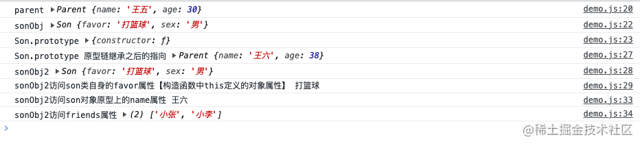
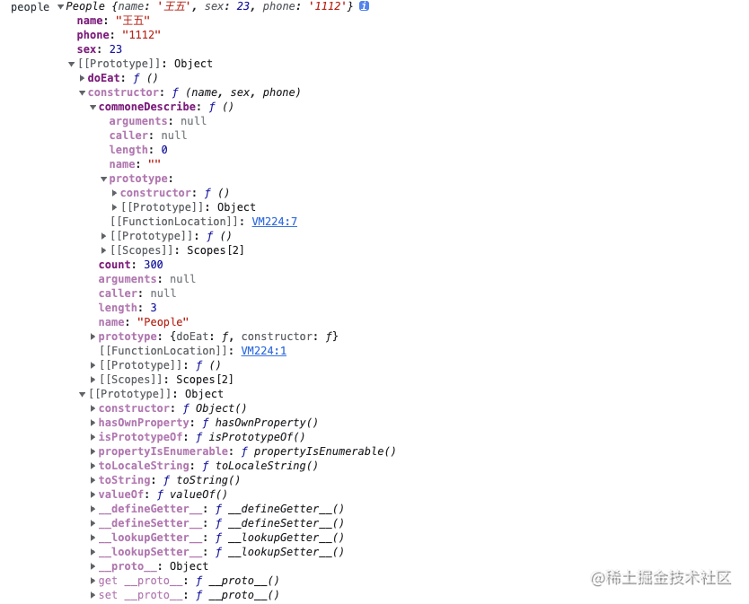

# 05-TS 继承深入+手写优化底层源码

## 01:【TS 继承】前端深度掌握 TS 继承的重要+长远意义

### 练就更深厚的 js 原型 原型链功底

TS 编译后的 JS 中有经典的 JS 原型和原型链的源码实现，虽然稍显复杂，但源码并不长，这将是 练就 更深厚的 JS 原型，原型链功底的绝佳场景。通过这几次课的认真磨练，大家将拥有更深厚的 JS 原型，原型链功底[当然你必须认真看完，多练方可]。这不仅让你日后面试大受益，而且也为你能问读 Vue3,React 源码或其他流行框架源码铺路，因为不管是那种源码，JS 原型链续承一定会用到，再加上你的 TS 功底，那么这些都成让你日后前端之路走的更远，走的更高!

### 提升前端项目架构的根基技术

如果要你现在用开发一个工具库，组件库，你打算怎么开发?可以写出 n 多个版本的代码，都可以实现，但版本和版本之间的价值却差别巨大，你可以用 JS 原型写出 1 年左右工作经验的前端水准的代码，当然，上乘之选肯定是用 TS 来开发，你也可以灵活运用 TS 继承，多态等多种技术写出高水准的代码。但如果你不具备后端思维能力，就算你工作了 5 年，你也不一定能有这样的思维，甚至随时有可能被一个拥有了后端思维的只有 1 到 2 年工作经验水准的前端工程师超越。

### 突破前段技术瓶颈之一的技能，晋级中、高级前端工程师必会技能

如果你只掌握了单个类的使用，而不知道如何运用继承，那这也是技能缺失，将会限制你日后技术发展的高度，限制你的技术视野，让你的前端变得过于前端化。

说深度掌握了 TS 继承就能突破所有的前端技术瓶颈，那很显然是夸大其词，但更想突破前端技术瓶颈，深度学握继承必然是其中一项技能，而目是根基技术之一，可见继承的重要性不言而喻，

比如一个简单的汽车租赁项目，让你来实现，你把前端功能实现了，展示在页面上了，但是打开你用 TS 写的 Vuex 代码，用 T5 写的 Nodeis 代码，过于前端化的思维让你编写的代码可能让人不堪入目。这里不单单是说用到封装继承，多态，解耦这些技术，更多的是你过于前端化的思维编写的项目可扩展性将非带差，可读性也差，可重复用【复用性】也低，而这些是评判一个项目是否值钱的关键因素

如果你希望未来职业生涯拥有更广阔的技术视野，更远的未来你甚至希望自己能胜任技术总监，那么你就一定要从一个更广阔的技术视野来提升自己的技术能力，不能让自己被框在过于前端化的路上

虽然老师不能三言两语给同学们描述出什么才叫做完全突破前端瓶颈，但有一点是可以肯定的，就是要有一定的后端思维能力，这里当然不是要拥有 java 后端能力，而是起码具备 nodejs 后端的项目架构能力，NodeJs 可以是前端工程师提升晋级一定要掌握的技能。而深度掌握了 TS 继承已经为突破前端技术瓶颈开了一个好头

## 02：【TS 继承准备】原型链继承+重要的一步

```javascript
function Parent(name, age) {
  this.name = name
  this.age = age
}
Parent.prototype.friends = ['小张', '小李']
Parent.prototype.eat = function () {
  console.log(this.name)
}

function Son(favor, sex) {
  this.favor = favor
  this.sex = sex
}
const parent = new Parent('王五', 30)
console.log('parent', parent)
const sonObj = new Son('打篮球', '男')
console.log('sonObj', sonObj)
console.log('Son.prototype', Son.prototype)

// 原型链继承
//继承带来的好处
// 子类可以访问父类的实例属性
// 子类访问访问父类原型对象空间中的属性和方法
Son.prototype = new Parent('王六', 38)
let sonObj2 = new Son('打篮球', '男')
console.log('Son.prototype 原型链继承之后的指向', Son.prototype)
console.log('sonObj2', sonObj2)
console.log(
  'sonObj2访问son类自身的favor属性【构造函数中this定义的对象属性】',
  sonObj2.favor,
)
console.log('sonObj2访问son对象原型上的name属性', sonObj2.name)
console.log('sonObj2访问friends属性', sonObj2.friends)
```



1. 原型链继承实现的本质是改变 Son 构造函数的原型对象变量的指向【就是 Son.prototype 的指向】，Son.prototype = new Parent() 那么 Son.prototype 可以访问 Parent 对象空间中的属性和方法，所以顺着 【\_\_proto\_\_】属性，Son 类也可以访问 Parent 类的原型对象空间中的所有属性和方法

   **原型链继承的完整描述**：子对象首先在自己的对象空间中查找要访问的属性或者方法，如果找到，就调用输出，如果没有，就沿着子对象的\_\_proto\_\_属性指向的原型对象空间中去查找有没有这个属性或者方法，如果找到就输出，如果没有，就需要往上查找，直到找到 Object.prototype 原型对象属性指向的原型对象空间为止，如果找不到，返回 null

2. **原型链继承实现容易被遗忘的重要一步**

   ```javascript
   Son.prototype.constructor = Son // 让 Son 类的对象或者函数原型.prototype 指向的原型对象空间【new Parent()对象空间】有一个 Constructor 属性 指向了Son构造函数对象空间
   ```

3. **原型链继承常见疑问**

   Son.prototype = Parent.prototype 这样作为原型链继承的模式和 Son.prototype = new Parent(...) 又有什么区别呢？

   ```javascript
   Son.prototype = Parent.prototype
   Son.prototype.constructor = Son
   // 这样会导致所有 Parent 的子类的 constructor 都指向 Son
   // 这样执行后会让 Son.prototype 和 Parent.prototype 和 其他 Parent 子类的 __proto__指向的原型对象空间[Parent.prototype指向的原型对象空间]均指向Son 构造函数对象空间
   // 这违背了 Parent 原型对象空间中的 constructor属性必须指向 Parent 自身的构造函数的对象
   ```

4. **原型链继承的不足**

   局限性：不能通过子类构造函数向父类构造函数传递参数

## 03: 借用构造函数（冒充对象继承)

1. 借用构造函数继承如何解决原型链继承的局限性

   > 借用构造函数继承思想就是在子类【ChinesePeople 构造函数】的内部借助 apply call 方法调用并传递参数给父类 【People 函数】

   ```javascript
   // People父类构造函数：看成是一个父类
   function People(name, sex, phone) {
     this.name = name // 实例属性
     this.sex = sex
     this.phone = phone
   }

   People.prototype.doEat = function () {
     console.log(this.name + '吃饭...')
   }

   // ChinesePeople 子构造函数【看成一个子类】
   function ChinesePeople(name, sex, phone, national) {
     People.apply(this, [name, sex, phone]) // 借用父类构造函数
     this.national = national // 名族
   }

   const chinesePeople = new ChinesePeople('王五', '男', '123', '汉')
   ```

2. 借用构造函数继承的不足

   > 借用构造函数实现了子类构造函数向父类构造函数传递参数，但没有继承父类原型的属性和方法，无法访问父类原型上的属性和方法

## 04：【TS 继承准备】借用构造函数+原型链继承组合模式

### 借用构造函数+原型链继承组合模式的优势

优势 1：具备借用构造函数的优点：子类【ChinesePeople 构造函数】的内部可以向父类【People 构造函数】传递参数

优势 2：具备原型链继承的优点：ChinesePeople.prototype 和 new ChinesePeople() 出来的实例对象变量和实例都可以访问父类【People 构造函数】原型对象上的属性和方法

```javascript
// People父类构造函数：看成是一个父类
function People(name, sex, phone) {
  this.name = name // 实例属性
  this.sex = sex
  this.phone = phone
}

People.prototype.doEat = function () {
  console.log(this.name + '吃饭...')
}

// ChinesePeople 子构造函数【看成一个子类】
function ChinesePeople(name, sex, phone, national) {
  People.apply(this, [name, sex, phone]) // 借用父类构造函数
  this.national = national // 名族
}
ChinesePeople.prototype = new People('王五', '男', '123')
```

### 借用构造函数+原型链继承组合模式的不足

缺点：调用了两次父类构造函数【People 构造函数】new People 调用构造函数带来问题：

1. 进入 People 构造函数为属性赋值，分配内存空间，浪费内存
2. 赋值导致效率下降一些，关键是 new People 赋的值无意义，出现代码冗余，new ChinesePeople 出来的对象和这些值不相干，是通过子类 ChinesePeople 构造函数中的 apply 来向父类 People 构造函数赋值

## 05:【TS 继承准备】寄生组合继承实现方式【最佳继承模式】

### 寄生组合继承实现方式

```javascript
// People父类构造函数：看成是一个父类
function People(name, sex, phone) {
  this.name = name // 实例属性
  this.sex = sex
  this.phone = phone
}

People.prototype.doEat = function () {
  console.log(this.name + '吃饭...')
}

// ChinesePeople 子构造函数【看成一个子类】
function ChinesePeople(name, sex, phone, national) {
  People.apply(this, [name, sex, phone]) // 借用父类构造函数
  this.national = national // 名族
}
// 第一步：创建一个寄生构造函数
function Middle() {
  // 此处毫无意义，只是为了测试
  this.count = 1
}
Middle.prototype = People.prototype
// 第二步：创建一个寄生新创建的构造函数的对象
const middle = new Middle()
// 第三步：ChinesePeople 子类的原型对象属性指向第二步的新创建的构造函数的对象
ChinesePeople.prototype = middle
ChinesePeople.prototype.constructor = ChinesePeople

const chinesePeopleOne = new ChinesePeople('王海', '女', 1111, '汉族')
console.log(chinesePeopleOne)
```


### 构建一个公共的寄生组合继承

```javascript
// 公共的寄生组合继承
function _extends(parent, son) {
  function Middle() {
    this.count = 1 // 此处毫无意义，只是为了测试
    this.constructor = son // 代替上一小节中的 ChinesePeople.prototype.constructor = ChinesePeople
  }

  Middle.prototype = parent.prototype
  return new Middle()
}

// People父类构造函数：看成是一个父类
function People(name, sex, phone) {
  this.name = name // 实例属性
  this.sex = sex
  this.phone = phone
}

People.prototype.doEat = function () {
  console.log(this.name + '吃饭...')
}

// ChinesePeople 子构造函数【看成一个子类】
function ChinesePeople(name, sex, phone, national) {
  People.apply(this, [name, sex, phone]) // 借用父类构造函数
  this.national = national // 名族
}

ChinesePeople.prototype = _extends(People, ChinesePeople)
const chinesePeopleOne = new ChinesePeople('王海', '女', 1111, '汉族')
console.log(chinesePeopleOne) // 结果同上
```

### “克隆”对象其他实现方式

### “克隆”对象实现方式 2

```javascript
// s99 行效果  = s102 + s103 相当用 People 类【父构造器函数】的原型对象“克隆”了一个对象
const cloneOneParentObj = Object.create(People.prototype) // s99
ChinesePeople.prototype = cloneOneParentObj //  s100
ChinesePeople.prototype.constructor = ChinesePeople // s101

// 写成通用方法就如下
function _extends(parent) {
  let middle = Object.create(parent.prototype, {
    count: {
      writable: true,
      value: 23,
    },
  })
  return middle
}
ChinesePeople.prototype = _extends(People)
// 需要增加这一行
ChinesePeople.prototype.constructor = ChinesePeople
```

### “克隆”对象实现方式 3

```javascript
let cloneOneParentObj2 = {} // s102
cloneOneParentObj2.__proto__ = People.prototype // s103
ChinesePeople.prototype = cloneOneParentObj // s104
ChinesePeople.prototype.constructor = ChinesePeople // s105
```

## 06:【TS 继承应用】用全栈眼光深度掌握 TS 继承+TS 继承好处【企业真项目应用场景】

### 1.理解子类

#### (1) 什么是子类?

有两个类，比如 A 类和 B 类，如果满足 A 类 is a kind of B 类，那么 A 类就是 B 类的子类比如: A 类是顾客类，B 类是人类，因为顾客类 a kind of 人类成立【顾客类是人类的一种】，所以顾客类类的子类。

#### (2) 子类如何继承父类的属性和方法?

以顾客类为例子:顾客类继承了父类【人类】的非私有的属性和方法，也具备子类独有的属性和方法。顾客类继承父类【人类】的全部非私有的属性和方法外，还有哪些独有的属性和方法呢?

顾客类独有属性: 顾客等级，顾客编号
顾客类独省方法：购买

#### (3) 初步理解为什么要用继承?

举例: 宠物管理项目中的狗狗类，兔子类，小猫类都是宠物，尽管每个宠物都有独有属性和方法，比如狗狗类的品种，看家方法;兔子类的肤色属性等。但这些类都包含了 name, buymoney【购买价格】，healthstatus【健康状况】，friendshipstar【和主人的友谊星级数】这些属性，如果每一个类都写这些属性，那么就非常臃肿，可以把这些属性提取出来放到一个宠物类中，其他类都继承这个宠物类。当然继承还有更多好处，下面借助汽车租赁功能的实现来更深度的掌握继承。

#### (4) 汽车租赁管理功能【深度掌握继承】

需求 1: 汽车租赁功能实现: 有小轿车,大巴,卡车三种类型的车,顾客可以租任意一种或多种不同类型的车,按照租用的天计算租金，同时为了响应国家对各类车安全的管理，对在租赁期内有过各种超载，超乘客数，酒家等违规的车需额外支付一定的费用。

需求 2: 计算退回费用: 最终退回顾客的费用为押金扣除使用天数，如押金不足需额外支付不足部分。

```javascript
// 父类 Vechile 交通工具类
class Vechile {
  public brand: string // 品牌
  public vechileNo: string // 车牌号
  public days: number //租赁天数
  public total: number = 0 // 支付的租赁总费用
  public deposit: number // 押金
  constructor(
    _brand: string,
    _vechileNo: string,
    _days: number,
    _deposit: number,
  ) {
    this.brand = _brand
    this.vechileNo = _vechileNo
    this.days = _days
    this.deposit = _deposit
  }
  // 计算租赁车的价格
  public calculateRent() {
    console.log(this.brand + ' 车牌号为：' + this.vechileNo + '开始被租')
    return 0
  }
  // 支付押金的方法
  public payDesposit() {
    console.log(
      this.brand + ' 车牌号：' + this.vechileNo + ' 支付了' + this.deposit,
    )
  }
  // 安全监测方法
  public safeShow() {
    console.log('车违规了')
    console.log(this.brand + ' 车牌号：' + this.vechileNo + '违规了')
  }
}

// 子类： Car
class Car extends Vechile {
  public type: string
  constructor(
    _brand: string,
    _vechileNo: string,
    _days: number,
    _deposit: number,
    _type: string,
  ) {
    super(_brand, _vechileNo, _days, _deposit) // 相当于之前的 call 方法
    this.type = _type
  }
  //根据租车型号获取租赁一天的价格
  public getPriceByType() {
    let rentMoneyByDay: number = 0 // 每天的租金
    if (this.type === '普拉多巡洋舰') {
      rentMoneyByDay = 800
    } else if (this.type === '凯美瑞旗舰版') {
      rentMoneyByDay = 400
    } else if (this.type === '威驰智行版') {
      rentMoneyByDay = 200
    }
    return rentMoneyByDay
  }

  // 计算租赁车的价格
  public calculateRent() { // 方法重写【override】
    return this.days * this.getPriceByType()
  }
}

const car = new Car('普拉多', '京3A556', 3, 1000, '普拉多巡洋舰')
console.log(car.calculateRent())

// 子类：Bus
class Bus extends Vechile {
  public seatNum: number // 座位数
  constructor(
    _brand: string,
    _vechileNo: string,
    _days: number,
    _deposit: number,
    _seatNum: number,
  ) {
    super(_brand, _vechileNo, _days, _deposit)
    this.seatNum = _seatNum
  }

  public getPriceBySeatNum() {
    let rentMoneyByDay: number = 0 // 计算每天的租金
    if (this.seatNum <= 16) {
      rentMoneyByDay = 800
    } else if (this.seatNum > 16) {
      rentMoneyByDay = 1600
    }
    return rentMoneyByDay
  }

  public calculateRent(): number { // 方法重写【override】
    return this.days * this.getPriceBySeatNum()
  }
}
```

## 07:【TS 继承应用】深入 super+方法重写+真实应用场景

### 方法重写（override)

**条件**：一定要发生在继承中

**位置**：子类中重写父类的方法

**应用场景**：当父类中方法的视线不能满足子类功能需要或者不能完全满足子类功能需要时，就需要在子类中进行方法重写

**方法重写的好处**：让所有子类共用父类中方法已经实现了一部分功能的代码【父类方法代码在各个子类中得到了复用】

**定义规则**：

1. 和父类方法同名
2. 参数和父类形同，如果是引用类型的参数，需要依据具体类型来定义
3. 父类方法的访问范围【访问修饰符】必须小于子类方法中重写的访问范围【访问修饰符】，且父类方法不能是 private

- **public**: 可以被子类、父类中使用，也可以在类的外部调用，默认是 **public**
- **private**: 父类中 private 修饰的方法不能被继承（如果父类方法中被 private 修饰，子类中同名方法必须是 private protected 等 不能是 public，以此类推）
- **protected**: 允许子类继承，但是不能再外部调用（可以被本类和子类中使用）

### super 的三种用法总结

含义：代表父类

作用 在子类中：

1. super.属性：调用父类非私有化的成员变量
2. super.方法：调用父类非私有化的成员方法
3. super()：调用父类非私有化的构造方法

#### 错误用法

1. 当子类和父类有同名属性时，可以在子类中用 super 来获取父类的同名属性吗？：：：**不能**，

## 08:【TS 继承源码】逐行深剖，手写 TS 继承 JS 源码

### 技术准备

#### 1. **相关技术**：`setPrototypeOf` 使用 + `Object.create` 的区别

> ES6 Object.setPrototypeOf 方法
>
> Object.setPrototypeOf 为现有对象设置原型，返回一个新对象，接收两个参数：第一个是现有对象，第二个是原型对象，返回的新对象 newMiddle 和第二个原型对象关系为 newMiddle.\_\_proto = parent.prototype
>
> 由于 setPrototype 的作用： middle.\_\_proto\_\_ = parent.prototype ，newMiddle 的最终结果就是 middle

```javascript
function _extends(parent) {
  let middle = { count: 1 }
  return Object.setPrototypeOf(middle, parent.prototype)
}

ChinesePeople.prototype = _extends(People) // 这句话会导致 ChinesePeople.prototype 中定义的其他方法失效
ChinesePeople.prototype.constructor = ChinesePeople // 需要额外增加子构造函数指向

// 那么如何保存下来   ChinesePeople.prototype 中定义的其他方法呢？
// 改为如下结果

function _extends(parent, son) {
  return Object.setPrototypeOf(son.prototype, parent.prototype)
}
_extends(People, ChinesePeople) // 这句话执行完，建立的关系如下：ChinesePeople.prototype.__proot__ = People.prototype
// 这样就保留了 ChinesePeople.prototype 中定义的其他方法
```

#### 2.**父类静态方法和属性在子类中的继承**：`setPrototypeOf` 分别实现

```javascript
let People = function (name, sex, phone) {
  this.name = name
  this.sex = sex
  this.phone = phone
}
People.count = 300 // 静态属性相当于 TS 类中的 static 属性
People.commoneDescribe = function () {
  // 静态方法，相当于 TS 继承中的 static 方法
  console.log('需要守法')
}
People.prototype.doEat = function () {
  console.log(this.name + '吃饭...')
}
let people = new People('王五', 23, '1112')
console.log('people', people)
```



#### 3. **深度掌握+手写+优化底层 extendsStatics 方法的实现**：

`extendsStatic` 方法的作用：完成父类静态方法和属性在子类中的继承

#### 4. 深度掌握 `extends` 方法

### 源码实现

```javascript

```
