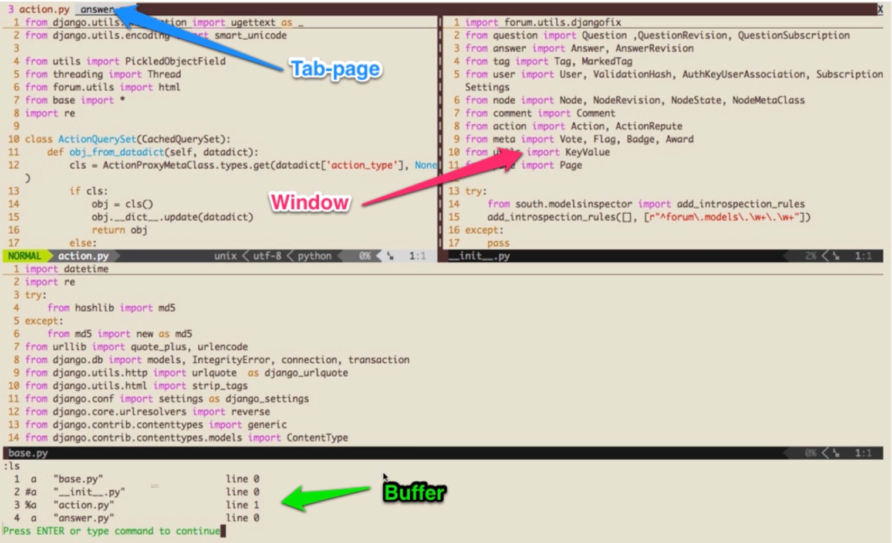

# 02-初识 Vim，想说爱你不容易

## 01: 初识 Vim，想说爱你不容易

### 下载与安装

**作为开发者的你，安装 Vim 应该很简单**

- Linux/Unix(Mac) 自带 Vim, 直接终端里输入 Vim 即可进入
- Windows 用户可以下载 GVim 等安装和体验
- 建议 Windows 用户可以尝试使用虚拟机来体验 Linux 下的 Vim

### 初始 Vim

**据说 Stackoverflow 帮助过上百万开发者退出 Vim**

- 输入 Vim 似乎没法输入东西，起始模式进去是 normal 模式
- 使用 :q 可以退出 Vim

### 开始编辑

**进入编辑模式就可以像其他编辑器一样编辑了**

- 使用 i 进入编辑模式，开始输入文字
- i 表示 insert, a(append), o(open a line below)
- 使用 Esc 又可以回到 normal 模式，使用 :wq 保存退出
- i: 在光标所在字符前开始插入
- a: 在光标所在字符后开始插入
- o: 在光标所在行的下面另起一新行插入
- s: 删除光标所在的字符并开始插入
- r: 替换光标后的一个字符
- I: 在光标所在行的行首开始插入 如果行首有空格则在空格之后插入（insert before line）
- A: 在光标所在你行的行尾开始插入（append after line）
- O: 在光标所在行的上面另起一行开始插入（open a line above）
- S: 删除光标所在行并开始插入
- R: 替换光标所在行的所有字符

## 02: Vim，为什么你有这么多模式

### “怪异”的 Vim 模式

**Vim 和其他很多编辑器的区别在于多种模式**

- 进入 Vim 默认是 normal（普通）模式？为什么不是编辑模式呢 ？
- 使用 a(append) i(insert) 等进入编辑模式
- 还是有 :cmd 命令模式和 visual 可视化模式

### 进入 Vim 默认是 normal（普通）模式？为什么不是编辑模式呢 ？

**奇怪的是，为什么 Vim 进入之后不像其他编辑器一样直接插入？**

- 进入 Vim 模式默认是 normal 普通模式。使用 Esc 从插入回到普通模式
- 普通模式下可以进行各种命令操作和移动
- 大部分情况下你是在浏览而不是编辑，所以 Vim 默认是 normal

### Insert -插入模式

**插入模式下 Vim 可以直接编辑，和其他编辑器一样**

- 使用 i(insert) a(append) o(open a line below)进入插入模式
- 使用 Esc 退出插入模式到 normal 模式
- 你来试试 I A O 如何进入插入模式的 ？

### Command(命令)模式

**Normal 模式下输入：之后执行命令，比如保存退出:wq 一气呵成**

- 顾名思义，执行 Vim 命令，比如保存 :w ，退出 :q
- 比如分屏 :vs(vertical split) :sp(split)
- 比如使用 :% s/foo/bar/g 全局替换

### Visual 可视化模式

**Visual 模式一般用来块状选择文本**

- Normal 模式下使用 v 进入 visual 选择
- 使用 V 选择行
- 使用 ctrl + v 进行方块选择

## 03: Vim 插入模式小技巧

### 如何快速纠错

**代码就像人生，总是经常出错，需要我们快速修正**

- 进入 Vim 之后首先使用 a/i/o 之一进入插入模式
- ctrl + h 删除上一个字符，ctrl + w 删除上一个单词，ctrl + u 删除当前行
- 以上几个快捷键可以用在很多地方，比如终端

### 快速切换 insert 和 normal 模式

**很多键盘的键位设置，Esc 按起来不方便，不方便切换到 normal**

- 使用 ctrl + c 代替 Esc（但是可能会中断某些插件）或者 ctrl + [
- 使用 gi 快速跳转至最后一次编辑的地方并进入插入模式
- 在配置章节我们会讲解如何映射方便的快捷键来替代 Esc

### 让键盘适用工具

**键盘的选择会影响你的编辑速度**

- 选择 Esc 和 Ctrl 比较容易碰到的键盘
- 使用 Vim 你可以使用 HHKB 或者 poker2 这种迷你键盘
- 使用软件修改键位，比如 CapsLock 改成频繁使用到的 Ctrl

### 熟能生巧

**让你的肌肉形成记忆**

- Linux 和 Vim 下有非常多的快捷键简化工具
- 尝试抛弃你的退格键，使用 ctrl 快捷键来完成编辑工具
- 尝试修改而不是强迫自己适应难用键位设置

## 04: Vim 快速移动大法

### 反人类的 hjkl

**众所周知，vim normal 模式使用了反人类的 hjkl 来移动**

- 据说编辑器作者在编写 vim 的时候键盘还没有流行上下左右按键
- 左 h 下 j 上 k 右 l 移动也不会让手指脱离主键盘区

### 在单词之间【飞舞】

**在单词之间移动是我们浏览操作中最常用的命令**

- w/W 移动到下一个 word/WORD 开头。e/E 下一个 word/WORD 尾
- b/B 回到上一个 word/WORD 开头，可以理解为 backword
- word 指的是以非空白符分割的单词，WORD 以空白符分割的单词

### 行间搜索移动

**同一行快速移动的方式其实是搜索一个字符并且移动到该字符**

- 使用 f{char} 可以移动到 char 字符上，t 移动到 char 的前一个字符
- 如果第一次没有搜到，可以使用分号; 逗号, 继续搜该行下一个/上一个
- 大写的 F 表示反过来搜前面的字符

### Vim 水平移动

**如何快速移动到一行的行首或者行尾呢？**

- 0 移动到行首第一个字符，^ 移动到第一个非空白字符
- $ 移动到行尾，g\_ 移动到行尾非空白字符
- 记住常用的 0 和 $ 就可以满足日常需求了

### Vim 垂直移动

**我们还可以在句子（sentence）和段落（paragraph）间移动（不常用）**

- 使用括号（）在句子间移动，你可以用 :help（ 来查看帮助
- 使用 {} 在段落之间移动
- 插件章节我们会讲如何使用 easy-motion 插件移动，这些命令就都不用记忆啦

### Vim 页面移动

**翻页命令太多，2/8 定律，记住常见的就能满足需求**

- gg/G 移动到文件开头/结尾，你可以使用 ctrl + o 快速返回
- H/M/L 跳转到屏幕的开头 Head 中间/ Middle / 末尾 Lower
- Ctrl+u ctrl+f 上下翻页（upword/forward） zz 把屏幕置为中间

### 练习到形成条件反射

**站在【岸上】学不会游泳，光学不练学不会 Vim**

- 这一张讲了 normal 模式下非常多的命令，是不是头大了
- 知道为啥 Vim 默认是 normal 模式了吧？它提供了强大的命令来移动
- 清醒一下大脑，回顾下本章内容，操练起你的 Vim 吧。如果讲完了本章节你还在用上下左右这种低效的方式移动，本章就白看了！

## 05: Vim 快速增删改查

### Vim 增加字符

**增加字符就是进入插入模式，开始敲键盘吧**

- 进入插入模式编辑文本
- 使用 a/i/o 进入插入模式
- 还记得 A/I/O 是什么作用么？

### Vim 快速删除

**如何快速删除一个字符或者单词呢？**

- Vim 在 normal 模式下使用 x 快速删除一个字符
- 使用 d(delete) 配合文本对象快速删除一个单词 daw(d around word)
- d 和 x 都可以搭配数字来执行多次（2dd:删除两行、4x:删除四个字符）

### Vim 快速修改

**相比删除，更常用修改，一般都是删除之后改成我们期望的文本**

- 常用有三个，r(replace)、c(change)、s(substitute)
- normal 模式下，使用 r 可以替换一个字符，s 替换并进入插入模式
- 使用 c 配合文本对象，我们可以快速进行修改

### Vim 查询

**查询单词也是一个常用操作**

- 使用 / 或者 ？ 进行前向或者反向搜索
- 使用 n/N 跳转到下一个或者上一个匹配
- 使用 \* 或者 # 进行当前单词的前向和后向匹配

### 课后练习

**改变你低效的 Vim 操作习惯**

- 本章讲了很多方便的增删改查命令，请课后练习
- 替换你的低效操作，比如想修改一个单词可以直接 caw
- 使用助记符比如 c(change)、d(delete)、r(replace) 来帮助记忆

## 06: Vim 如何搜索替换

### Vim 替换命令

**substitute 命令允许我们查找并且替换文本，并且支持正则表达式**

- :[rang]s[ubstitute]/{pattern}/{string}/[flags]
- range 表示范围，比如:10，20 表示 10-20 行，% 表示全部
- pattern 是要替换的模式，string 是替换后文本

### 替换标志位

**Flags 有几个常用的标志**

- g(global) 表示全局范围内执行
- c(confirm)表示确认，可以确认或者拒绝修改
- n(number)报告匹配到的次数而不替换，可以用来查询匹配次数

## 07: Vim 多文件操作

### Buffer Window Tab

**我们先来介绍几个多文件操作相关的概念**

- Buffer 是打开的一个文件的内存缓冲区
- 窗口是 Buffer 可视化的分割区域
- Tab 可以组织窗口为一个工作区 npm
  

### Buffer

**Buffer - 什么是缓冲区？**

- Vim 打开一个文件后会加载文件内容到缓冲区中
- 之后的修改都是针对内存中的缓冲区，并不会直接保存到文件
- 直到我们执行 :w(write) 的时候才会把修改的内容写入到文件里

### Buffer 切换

**那如何在 Buffer 之间切换呢？**

- 使用 :ls 会列举当前缓冲区，然后使用 :b n 跳转到第 n 个缓冲区
- :bpre :bnext :bfirst :blast
- 或者用 :b buffer_name 加上 tab 补全来跳转

### Window 窗口

**窗口是可视化的分割区域**

- 一个缓冲区可以分割成多个窗口，每个窗口也可以打开不同缓冲区
- `<ctrl + w>s`水平分割，`<ctrl + w>v` 垂直分割，或者 :sp 和 :vs
- 每个窗口可以继续被无限分割（看你屏幕是否够大）

### 如何切换窗口

**切换窗口的命令都是使用 Ctrl + w(window) 作为前缀**

| 命令          | 用途             |
| ------------- | ---------------- |
| `<ctrl + w>w` | 在窗口间循环切换 |
| `<ctrl + w>h` | 切换到左边的窗户 |
| `<ctrl + w>j` | 切换到下边的窗户 |
| `<ctrl + w>k` | 切换到上边的窗户 |
| `<ctrl + w>l` | 切换到右边的窗户 |

### 如何重排窗口？

**重排窗口可以改变窗口的大小：h window-resize 查看文档**

| 命令              | 用途                      |
| ----------------- | ------------------------- |
| `<ctrl + w>=`     | 使所有窗口等宽、等高      |
| `<ctrl + w>_`     | 最大化活动窗口的高度      |
| `<ctrl + w>\|`    | 最大化活动窗口的宽度      |
| `[N]<ctrl + w>_`  | 把活动窗口的高度设为[N]行 |
| `[N]<ctrl + w>\|` | 把活动窗口的宽度设为[N]行 |

### Tab(标签页)将窗口分组

**Tab 是可以容纳一系列窗口的容器(h:tabpage)**

- Vim 的 Tab 和其他编辑器不太一样，可以想象成 Linux 的虚拟桌面
- 比如一个 Tab 全用来编辑 Python 文件，一个 Tab 全是 Html 文件
- 相比窗口，Tab 一般用的比较少，Tab 太多管理起来也比较麻烦

### Tab(标签页)操作

**Tab 使用不多，简单了解一下常用操作就好**

| 命令                   | 用途                                 |
| ---------------------- | ------------------------------------ |
| :table[dit] {filename} | 在新标签页中打开 {filename}          |
| `<ctrl + w>T`          | 把当前窗口移动到一个新标签页         |
| :tabc[lose]            | 关闭当前标签页及其中的所有窗口       |
| :tabo[nly]             | 只保留活动标签页，关闭所有其他标签页 |

### Tab(标签页)切换操作

**如何切换不同的标签页，一般建立两个就好，太多不好操作**

| 命令           | 普通模式命令 | 用途                    |
| -------------- | ------------ | ----------------------- |
| :tabn[ext] {N} | `{N}gt`      | 切换到编号为{N}的标签页 |
| :tabn[ext]     | `gt`         | 切换到下一个标签页      |
| :tabp[revious] | `gt`         | 切换到上一个标签页      |

### 课后练习

**只要你的屏幕足够大，多文件操作会很方便，脱离鼠标就可以实现**

- 尝试打开 Vim 一次操作多个文件
- 窗口分割可以非常方便地查看代码，比如查看整个调用链
- 延伸：插件篇我们会配合 ctrlp 插件和 nerdtree 快速操作多个文件

## 08: 什么是 Vim 的 text object

### Text Object(文本对象)

**如果你学过主流的编程语言，一定知道面象对象编程**

* Vim 里文本也有对象的概念，比如一个单词，一段句子，一个段落
* 很多其他编辑器经常只能操作单个字符来修改文本，比较低效
* 通过操作文本对象来修改要比只操作单个字符高效

### 文本对象操作方式

**之前我们已经使用过文本对象了，回忆下 dw(删除一个单词)**

* `[number]<command>[text object]`
* number 表示次数，command 是命令,d(elete), c(hange), y(yank)
* text object 是要操作的文本对象，比如单词w，句子s，段落p

## 09: Vim 复制粘贴与寄存器的使用

## 10: Vim 如何用宏完成强大的批量操作

## 11: Vim 补全大法

## 12: 给 Vim 换个配色

## 13: 本章小结：裸 Vim 也很强
