相信大家在挑选组件库的时候，样式风格都是一个非常重要的考量目标。这节课的任务是给组件库添加样式系统，让组件库可以拥有一套统一风格的样式。

大家可以先看看成品的效果。

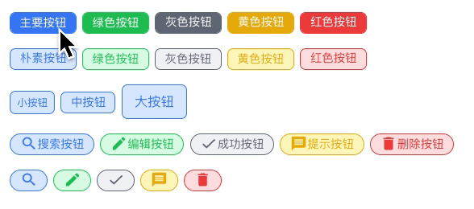

本章参考代码： https://github.com/smarty-team/smarty-admin/tree/chapter03/packages/smarty-ui-vite

## 用户故事(UserStory)：

通过UnoCSS为组件库添加样式系统，可以通过属性定制组件样式。

## 任务分解(Task)

-   引入 UnoCSS 样式；
-   实现组件属性定制按钮样式；
-   实现【Icon图标按钮】。

## 「Atomic/Utility-First CSS」与「Semantic CSS 」的选择

每个组件库都有一套完备的样式系统，确保组件样式风格的统一。经典的组件库 (ElementUI) 的样式系统都是遵循「Semantic CSS 」(语义化 CSS )搭建的。

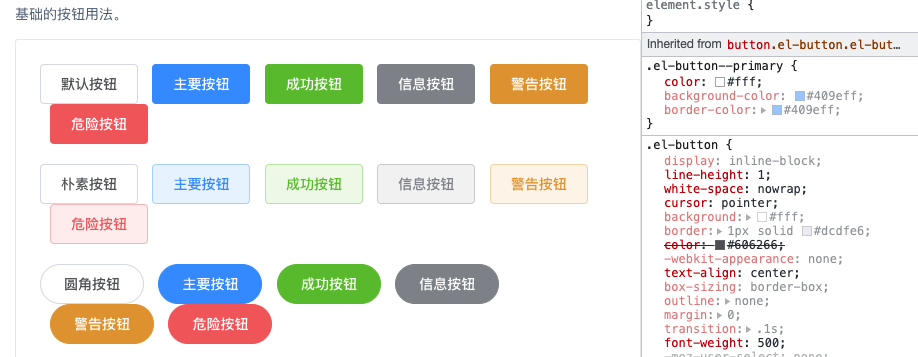

组件库通常都需要搭建一个 CSS 子工程，用于实现自己的类型系统。比如 Element 就是基于 Sass + Gulp 搭建的。不过随着原子样式的出现，有了一些替代方案，无需搭建样式系统也可以完成类似效果。首先先简单介绍一个原子样式是什么。

2020年一种叫做AtomicCSS的组件风格横空出世，代表作就是 TailwindCSS。最近两年，TailwindCSS 一直保持高热度。

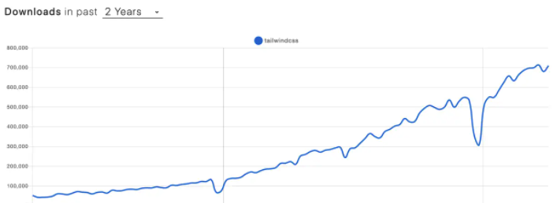

大家可以看一下 Vite 的社区模板库，tailwind 几乎就是标配。

<https://github.com/vitejs/awesome-vite#templates>

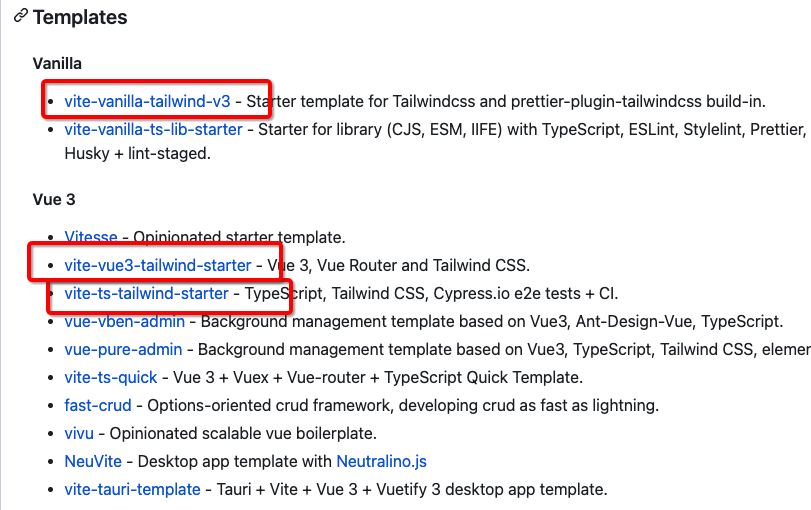

从组件库开发角度讲，使用 Tailwind 提供的样式系统，可以很好地降低 UI 库的开发难度。**利用原子化风格*** *，****完全就可以高效完成样式的定制****，****未必一定需要定制一套语义化样式系统。**

## 为什么选 UnoCSS 实现 AtomicCSS？

[UnoCSS的github地址](https://github.com/unocss/unocss)

原子样式也有很多选择，最著名的就是 Tailwind。 Tailwind 虽然好，但是性能上有一些不足。由于Tailwind 会生成大量样式定义。全量的 CSS 文件往往体积会多至数 MB。这个对于页面性能是完全不可接受的。如果在开发时进行动态的按需剪裁，又会影响编译性能，降低开发体验。为了解决性能问题，开源界一个叫做 Antfu 的大神设计了 UnoCSS。UnoCSS 是一个拥有高性能且具灵活性的即时原子化 CSS 引擎，可以兼顾产物体积和开发性能。

除此以外UnoCSS还可以有更强的可定制性和易用性。

-   [完全可定制](https://github.com/antfu/unocss#configurations) - 没有核心实用程序，所有功能都通过预设提供。
-   无需解析、无需 AST、无需扫描，它是**即时的**（比 Windi CSS 或 Tailwind JIT 快 200 倍）
-   ~3.5kb min+gzip - 零依赖和浏览器友好。
-   [快捷方式](https://github.com/antfu/unocss#shortcuts) - 动态别名实用程序。
-   [属性模式](https://github.com/antfu/unocss/tree/main/packages/preset-attributify/) - 在属性中分组实用程序
-   [纯 CSS 图标](https://github.com/antfu/unocss/tree/main/packages/preset-icons/) - 使用任何图标作为单个类。
-   [检查器](https://github.com/antfu/unocss#inspector) - 以交互方式检查和调试。
-   [CSS-in-JS 运行时版本](https://github.com/antfu/unocss/tree/main/packages/runtime)。
-   [CSS Scoping](https://github.com/antfu/unocss#css-scoping)。
-   CSS 代码拆分 - 为 MPA 提供最小的 CSS。
-   库友好 - 随你的组件库提供原子样式并安全地限定范围。

另外基于 Vite 良好的支持，也是选择UnoCSS的一个重要原因。我认为 UnoCSS 也可以算是 Vite 社区的一个重要的产品。

## 功能实现

<https://github.com/unocss/unocss>

首先通过 Vite 插件的形式引入 UnoCSS。

### 引入UnoCSS

安装 UnoCSS 库。

```
pnpm i -D unocss@"0.45.6"
pnpm i -D @iconify-json/ic@"1.1.4"
```

在 Vite 中添加 UnoCSS 插件。

```
import { presetUno, presetAttributify, presetIcons } from "unocss";
import Unocss from "unocss/vite";
export default defineConfig({
  plugins: [
    ...
    // 添加UnoCSS插件
    Unocss({
        presets: [presetUno(), presetAttributify(), presetIcons()],
    })
  ],
});
```

下面就可以在插件中引入 UnoCSS 了。加载 Unocss 插件后，Vite 会通过分析 class 的使用状况提供相应的样式定义。

在 Button 组件中引入 UnoCSS。

/src/button/index.tsx

> 注意: 这个地方文件名已经从 index.ts变为 index.tsx


```
import { defineComponent,PropType,toRefs} from "vue";
import "uno.css";
export default defineComponent({
  name: "SButton",
  setup(props, {slots}) {
    return () => <button 
      class={`
      py-2 
      px-4 
      font-semibold 
      rounded-lg 
      shadow-md 
      text-white 
      bg-green-500 
      hover:bg-green-700 
      border-none 
      cursor-pointer 
      `}
        > 
        {slots.default ? slots.default() : ''}
     </button>
  }
});
```

在 index.ts 中添加一个测试代码。

```
createApp({
        template:`
            <div>
                <SButton>普通按钮</SButton>
            </div>
        `
    })
.use(SmartyUI)
.mount("#app");
```

最终呈现的效果：


到此为止，说明 UnoCSS 已经正常引入了。

### 实现组件属性定制按钮样式

下面要实现根据属性定制按钮样式功能。比如，通过color属性定制颜色。

```
 <div>
  <SButton color="blue">蓝色按钮</SButton>
  <SButton color="green">绿色按钮</SButton>
  <SButton color="gray">灰色按钮</SButton>
  <SButton color="yellow">黄色按钮</SButton>
  <SButton color="red">红色按钮</SButton>
 </div>
```

首先需要定义组件的属性类型。

```
import { defineComponent,PropType,toRefs} from "vue";
import "uno.css";

export type IColor = 'black' | 'gray' | 'red' | 'yellow' | 'green'|'blue'|'indigo'|'purple'|'pink'
export const props = {
  color: {
    type: String as PropType<IColor>,
    default: 'blue'  // 设定默认颜色
  },
}
export default defineComponent({
  name: "SButton",
  props,  // 注册属性
  ...
  }
});
```

下面就可以用属性变量拼装 UnoCSS。看到这里大家就可以感受到原子 CSS 的好处。基本常用的属性定义都可以通过简单的字符串拼装完成。

```
export default defineComponent({
  name: "SButton",
  props,
  setup(props, {slots}) {
    return () => <button 
        class={`
          py-2 
          px-4 
          font-semibold 
          rounded-lg 
          shadow-md 
          text-white 
          bg-${props.color}-500 
          hover:bg-${props.color}-700 
          border-none 
          cursor-pointer 
          m-1
          `}
        > 
        {slots.default ? slots.default() : ''}
     </button>
  }
});
```

下面看一下效果：

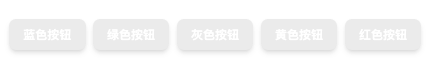

嗯，怎么没看见颜色呢？？出了什么事情。

仔细研究 UnoCSS 的文档才发现问题。主要原因是 UnoCSS 默认是按需生成方式。也就是说只生成代码中使用过的样式。那如果在 class 属性中使用变量，是无法分析变量的取值的。这样也就无法动态生成样式了。

为了解决这个问题，UnoCSS 提供了安全列表选项。也就是说，把样式定义中变量的取值添加到 Safelist 中去。这样 UnoCSS 就会根据 Safelist 生成样式了。

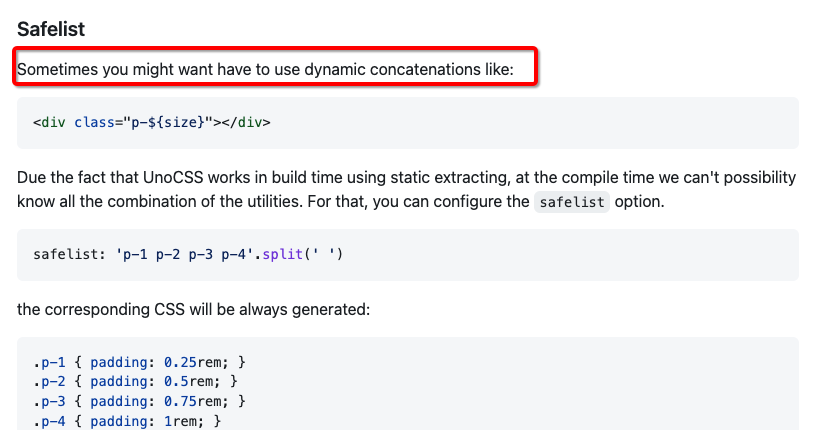

下面开始定制安全列表。安全列表属性应该定义在 UnoCSS 插件的配置中。

这里面要做一个配置上的重构。考虑到后续会在 Safelist 中添加大量配置，所以我们将 UnoCSS 配置拆成一个新的 ts 模块，然后引用到 vite.config.ts 中。

项目在搭建的过程中会不断地进行重构。希望大家在开发的过程中，一定要积极思考如何编写更加合理易于维护的代码。

config/unocss.ts

```
import { presetUno, presetAttributify, presetIcons } from "unocss";
import Unocss from "unocss/vite";

const colors = [
  "white",
  "black",
  "gray",
  "red",
  "yellow",
  "green",
  "blue",
  "indigo",
  "purple",
  "pink",
];

const safelist = [

  ...colors.map((v) => `bg-${v}-500`),
  ...colors.map((v) => `hover:bg-${v}-700`),
];

export default () =>
  Unocss({
    safelist,
    presets: [presetUno(), presetAttributify(), presetIcons()],
  });
```

vite.config.ts

```
import Unocss from "./config/unocss";

export default defineConfig({

  plugins: [

    Unocss(),
  ],

})
```

最后看看是不是缤纷的颜色已经出现了。

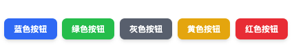

参考代码放在这 ：<https://github.com/smarty-team/smarty-admin/>

使用同样的方式，给按钮定制各种样式。这里面就不赘述。最后看一下效果。

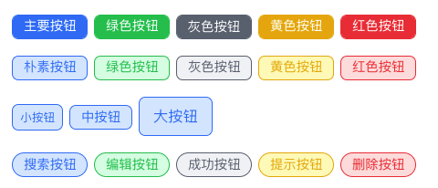

### 【 Icon 图标按钮】实现

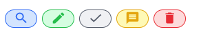

接下来要给按钮增加图标定制功能。实现图标按钮，首先需要引入字体图标库。

在 UnoCSS 中引入图标，只需要加载 @unocss/preset-icons 预设就可以了。它提供了 iconify 图标框架中大量的图表集。

引入的过程是以下这样的。

在 [iconfy](https://icones.js.org/) 网站中有上万个字体图标可以选择。

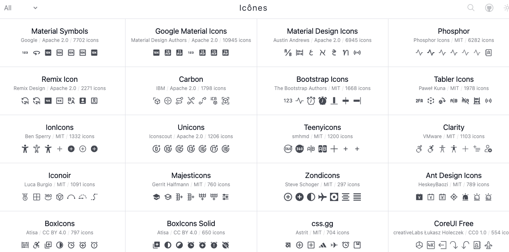

如果你想使用一个 【 🔍 】 搜索，首先可以在 [iconfy](https://icones.js.org/) 使用【search】搜索，然后选择一个心仪的图标。

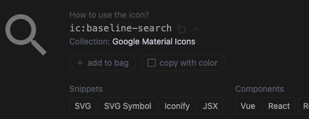

然后根据页面信息，Uno中使用 class="i-ic-baseline-search"，系统就会自动引用这个图标，非常的方便。

下面开始引入这个功能，首先在 Unocss 插件中添加 presetIcons 预设。

/config/unocss.ts

```
export default () =>
  Unocss({
    safelist,
    presets: [
        presetUno(),   
        presetAttributify(), 
        presetIcons(),  // 添加图标预设
    ]
  });
```

为了能够在 UnoCSS 中使用变量定义字体图标，需要将使用的图标名加入到 safelist 中。

/config/unocss.ts

```
const safelist = [
  ...[
    "search",
    "edit",
    "check",
    "message",
    "star-off",
    "delete",
    "add",
    "share",
  ].map((v) => `i-ic-baseline-${v}`),
];
```

最后在 Button 中添加字体图标。

```
return () => <button 
        class={`

          py-${size[props.size].y}
            ...
          mx-1
          `}
        > 
        { props.icon !== "" ? <i class={`i-ic-baseline-${props.icon} p-3`}></i> : ""}
        {slots.default ? slots.default() : ''}
 </button>
```

最后编写一行测试代码实验一下效果。

index.ts

```
     <div>
         <SButton color="blue" round plain icon="search" ></SButton>
         <SButton color="green" round plain icon="edit" ></SButton>
         <SButton color="gray" round plain icon="check" ></SButton>
         <SButton color="yellow" round plain icon="message" ></SButton>
         <SButton color="red" round plain icon="delete" ></SButton>
     </div>
```


### Build 时单独导出 CSS
使用 unocss 后，如果运行 pnpm build 的时候会报错。

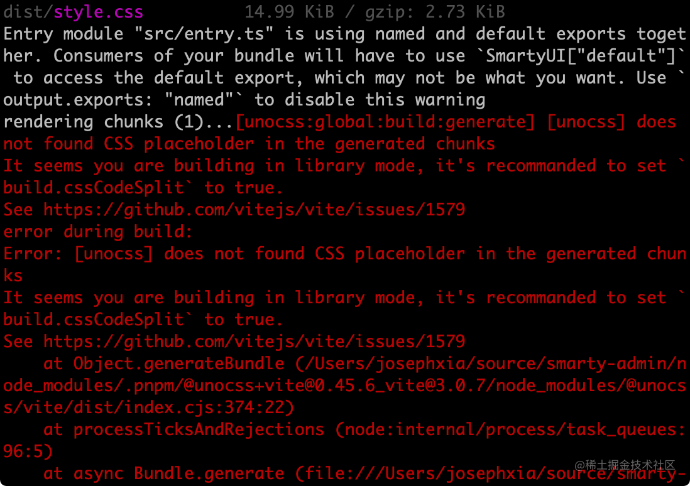

解决办法是根据提示增加编译选项 cssCodeSplit
vite.config.ts
```ts
  build: {
    ...
    cssCodeSplit: true,   // 追加
    ...
  },

```
简单解释一下原因： 
cssCodeSplit 这个选项是为了决定在编译的时候是否要独立输出 css。显然这里面应该选择为 true。

同样在调用组件库的时候需要引入 style.css 才可以让样式生效。

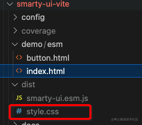


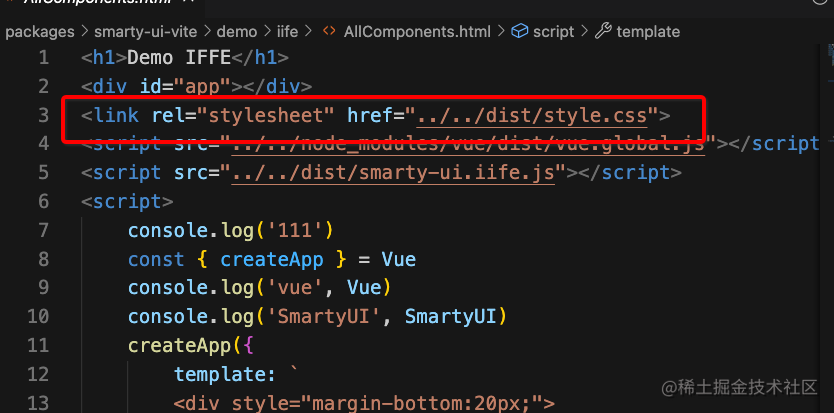


本章参考代码： https://github.com/smarty-team/smarty-admin/tree/chapter03/packages/smarty-ui-vite

## 复盘

这节课主要的内容是为组件库添加样式系统。我们是通过引入 UnoCSS 来实现的。

总结如下：

1.  引入UnoCSS实现原子化CSS样式；
1.  使用安全列表实现在UnoCSS中使用变量定制样式；
1.  引入 @unocss/preset-icons预设实现字体图标按钮

随着技术的进步，出现了 UnoCSS 这样的原子化 CSS 引擎，可以让我们类型系统构建变得更加轻松。UnoCSS 配合 JSX 语法也非常具有可读性。

最后留一些思考题帮助大家复习，也欢迎在留言区讨论。

-   Tailwind 与 UnoCSS 的关系 ？
-   怎样在 UnoCSS 中使用变量定制样式 ？
-   怎样在 UnoCSS 中引入字体图标 ？

下节课，我们将给组件库添加文档系统，下节课见。

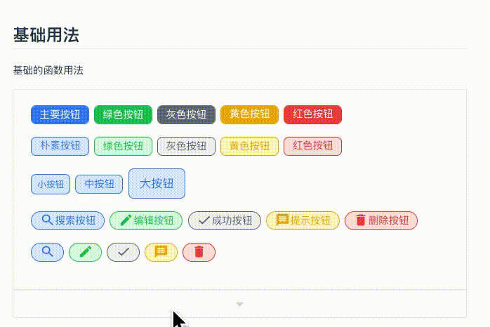