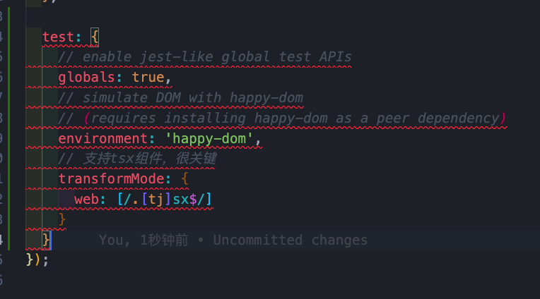
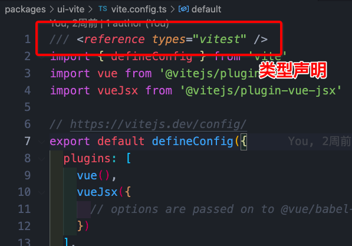
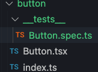
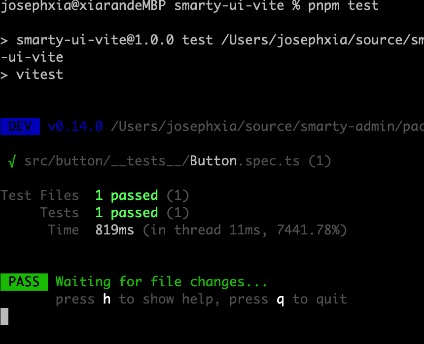
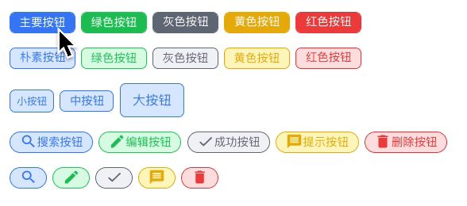

这节课，我们来学习如何给组件库添加单元测试。


在 Vite 栈的项目中，我首推 Vitest 作为测试框架。

## 为什么要选择 Vitest？

在 Vitest 之前，前端普遍的测试框架是 Jest。Jest 是由 Facebook 开源的一款测试框架，它本身集成了断言库、mock、快照测试、覆盖率报告等功能。比如 Vue3.0 还有流行的 ElementUI 组件库都是使用 Jest 完成的单元测试。

Vitest 是一个基于 Vite 的测试框架，它可以做到与 Vite 通用配置。也就是说，如果你在 Vite 中使用插件支持了JSX语法，做单元测试的时候就无需再配置一遍了，这点非常重要。并且 Vite 兼容了大部分 Jest 的使用方法，这样以往 Jest 的使用经验依然可以用在 Vitest 中使用，没有太多的重复学习过程。另外 Vitest 更加注重性能，尽可能多地使用 Worker 线程并发执行，可以提高测试的运行效率。

总结一下 Vitest 的优点：

-   Vite 同配置；

-   大量兼容 JestAPI；

-   高执行效率。

本章节代码分支： https://github.com/smarty-team/smarty-admin/tree/chapter06/packages/smarty-ui-vite

## 用户故事(UserStory)

通过VItest实现对组件的单元测试。

## 任务分解(Task)

-   搭建Vitest单元测试环境。

## 任务实现

### 搭建测试环境

```
pnpm i -D vitest@"0.21.1" happy-dom@"6.0.4" @vue/test-utils@"2.0.2"
```

配置 Vitest 测试组件库需要以下三个库：

-   vitest ：测试框架，用于执行整个测试过程并提供断言库、mock、覆盖率；

-   happy-dom：是用于提供在 Node 环境中的 Dom 仿真模型；

-   @vue/test-utils 工具库： Vue推荐的测试工具库。

@vue/test-utils 工具库是为了简化vue的测试过程而设计的。实际上使用 jest 或者 vitest 也可以直接对 vue 的进行测试。但是如果每次都需要编写初始化vue实例、渲染组件等操作，并且对Dom 断言也比较繁琐。比较好的办法是将这些针对 vue 测试的过程进程封装。当然这些封装是针对虽有vue项目通用的。这也就是 @vue/test-utils 的来历。

[@vue/test-utils 的文档地址](https://v1.test-utils.vuejs.org/zh/installation/choosing-a-test-runner.html)

首先、需要在vite.config.ts 中增加Vitest配置。

vite.config.ts

```
import { defineConfig } from 'vite'

export default defineConfig({
  // ...
  test: {
    // enable jest-like global test APIs
    globals: true,
    // simulate DOM with happy-dom
    // (requires installing happy-dom as a peer dependency)
    environment: 'happy-dom',
    // 支持tsx组件，很关键
    transformMode: {
      web: [/.[tj]sx$/]
    }
  }
})
```

其中的重要属性，我们需要讲解一下。

enviroment属性中配置了 happy-dom，用于提供测试所需要的 Dom 仿真。测试是在 node 环境中运行的，而不是浏览器中，需要提供一个 Dom 对象的仿真。然后就是 transformMode，由于代码中使用的 TSX 语法，所以需要设置转换处理。

在配置时，我们发现 ts文件会报错。这是由于 test 属性属于 Vitest 的扩展属性，vite 原生配置中并没有定义这个属性。



解决的办法就是在 vite.config.ts 中增加一个类型定义声明



代码如下：

```
/// <reference types="vitest" />
import { defineConfig } from 'vite'
import vue from '@vitejs/plugin-vue'
import vueJsx from '@vitejs/plugin-vue-jsx'
​
// https://vitejs.dev/config/
export default defineConfig({
    ...
})
```

这样的话报警就可以取消了。

### 代码的小重构
测试之前做一个代码的小重构。就是给每一个组件添加一个入口 index.ts。
将原来的 index.tsx => Button.tsx
新建一个 index.ts
```ts
import Button from "./Button";

// 导出Button组件
export default Button ;
```

### 编写测试用例

在 /src/button/**test** 中添加 Button.spec.ts：



Button.spec.ts

```js
import Button from "../Button";

import { shallowMount } from "@vue/test-utils";
import { describe, expect, test } from "vitest";
// 测试分组
describe('Button', () => {
 // mount
 test("mount  @vue/test-utils", () => {
  // @vue/test-utils
  const wrapper = shallowMount(Button, {
   slots: {
    default: 'Button'
    }
   });
  
  // 断言
  expect(wrapper.text()).toBe("Button");

});
 })
```

在测试文件中创建一个 describe 分组。在第一个参数中输入【Button】，表明是针对 Button 的测试。编写测试用例 test ，使用 shallowMount 初始化组件，测试按钮是否工作正常，只需要断言判断按钮中的字符串是否正确就可以了。

下面增加测试运行脚本。

package.json

```json
  {
      "scripts": {
          "test": "vitest",
      }
 }
```

启动单元测试：

```bash
pnpm test
```



上面的测试只是测试了按钮的默认状态。对于按钮组件来讲，它的主要逻辑是根据不同的 props 属性来定制不同的样式。下面我们针对这些逻辑继续编写测试。



比如： color 属性是根据传入的不同条件定义不同的颜色，只需要让断言判断是否加载不同的属性就行了。

-   Color: default


| 输入：color | 输出：css      |
| -------- | ----------- |
| 空(默认)  | bg-blue-500 |
| red      | bg-red-500     |


```
  describe('color', () => {
    test("default", () => {
      const wrapper = shallowMount(Button, {
        slots: {
          default: 'Button'
        }
      });
      expect(wrapper.classes().map(v => v.replace('\n','')).includes('bg-blue-500')).toBe(true)
    });
    test("red", () => {
      const wrapper = shallowMount(Button, {
        slots: {
          default: 'Button'
        },
        props: {
          color: 'red'
        }
      });
      expect(wrapper.classes().map(v => v.replace('\n','')).includes('bg-red-500')).toBe(true)
    });
  })
```

编写测试的时候，使用 describe 创建一个子分组，用于测试 color 属性。然后设置不同的 color 属性值，用断言来判断是否输出对应的 css 样式。

剩余的属性测试和 color 的测试非常类似，我们就不再赘述。**在代码编写阶段，建议只对重点功能进行测试，没必要一定追求过高的测试覆盖率**，因为前期过度地测试也会提高开发成本，拖慢开发进度。关于测试覆盖率的问题，我们会在后续章节介绍。

到目前为止，已经把组件库的测试框架搭好了。

本章节代码分支： https://github.com/smarty-team/smarty-admin/tree/chapter06/packages/smarty-ui-vite

## 复盘

这节课我们主要讲了组件库添加测试环境，引入Vitest 实现，整体上 Vitest 和 Jest 风格非常类似。基本上可以 0 学习成本切换。而且得益于通属于 Vite 生态，可以做到通用配置和更好的执行效率。

对于 Vue 框架开发代码的测试，当然可以使用原始的的测试框架进行测试。但是，为了简化测试，也会有人将执行过程和测试断言做进一步的封装， 比如 Vue Test Unit 这样的工具库，利用工具库封装了执行过程可以简化单元测试的编写。

最会要总结的就是，要认真编写描述字符串和合理的使用 describe 测试分组。描述字符串会在测试不通过的时候直接显示到命令行中，直接告诉你哪个组件的什么功能没有通过测试。而更好的测试分组可以有效提高测试的可读性。

最后留一些思考题帮助大家复习，也欢迎在留言区讨论。

-   如何配置 Vitest 环境？
-   如何使用 @vue/test-utils 完成 Vue3 项目的测试？

下节课，我们将给大家讲解如何配置自动化检查工具，下节课见。