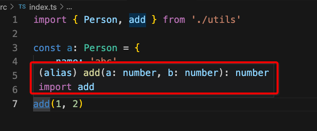
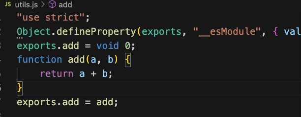
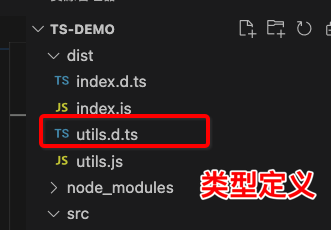
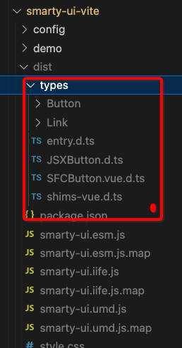
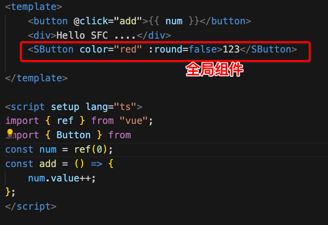
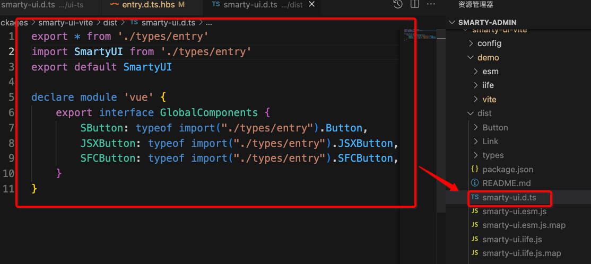
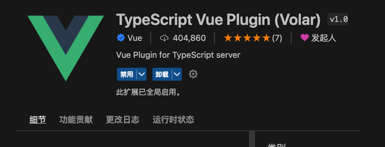

随着前端技术日趋复杂化，越来越多的项目都会选择使用TypeScript语言。TypeScript语言最显著的特点是提供了类型系统的支持。 类型系统有助于增加大型项目的可维护性。利用类型检查机制在编译期阶段可以发现更多的错误。从开发理论上讲，越早发现错误，解决错误的成本就会越低。这样的话就会使编写效率明显提高。这样的话也就可以更早下班，陪家人。

当然使用Typescript也不是只有好处。最大的问题是需要付出相应的学习成本，和多余的工作量用于定义类型系统。，因为对于使用Typescript 多了一套类型定义的心智负担。简单的类型还没什么也许只是给变量设置 string 或 number。其实也不跟你没什么卵用。

复杂的类型系统包含复杂的类型推导，泛型等内容，以下是 Vue 源码中 ractive 的返回对象。给大家一个截图大家可以感受一下。


很多小伙伴都在过度迷恋强类型语言，其实大可不必。弱类型语言晚于强类型语言出现的。也就是说弱类型语言是强类型语言的进化版。就是为了增加开发效率才会引入弱类型。我的观点是，对于业务逻辑型开发并不太适合使用Typescript。

实际上，未必使用Typescript编写逻辑才能体现类型检查机制的好处。即使你使用 Javascript 语言开发，使用可 Typescript 编写的库也可以同样享受类型的收益。连接两者的的桥梁就是类型定义文件 d.ts。好了下面就到我们这节课的主题了为组件库添加类型定义。

## 前置知识

### 类型定义文件的作用

下面我们用一个简单的例子来演示类型定义的作用。

创建一个文件 utils.ts

首先使用 Typescript 创建一个函数。

```
function add(a: number, b: number): number {
    return a + b
}
​
interface Person {
    name: string,
    age?: number
}
​
export { add, Person }
```

如果在 index.ts 引用这个库，可以得到明确的类型提示。

```
import { Person, add } from './utils'
​
const a: Person = {
    name: 'abc'
}
​
add(1, 2)
```

并且可以正常的进行类型检查的。



但是如果将 utils.ts 编译为 utils.js 文件。这个时候类型定义就会丢失。



那调用的时候自然也不会有类型检查。


可以看到调用 add 方法的时候，类型是 any。

如果想要保留类型定义，就需要生成类型定义文件，将类型保留到类型定义文件中 d.ts。这个时候编辑器就可以依据类型定义文件进行类型检查了。



utils.ts

```
declare function add(a: number, b: number): number;
interface Person {
    name: string;
    age?: number;
}
export { add, Person };
```

这个时候，在使用index.js的时候就可以看到类型定义了。


最后的结论，就是想得到类型定义的恩惠，未必一定要使用Typescript作为开发语言。比如： 使用 Javascript 语言开发，只要使用了Typescript 开发的库，一样可以享受到类型系统提示和检查。

### Typescript导出类型定义

一个标准的 Typescript 项目导出类型定义，只需要在 tsconfig.json 中添加declaration 选项就可以实现。


这个时候使用 tsc 编译的时候就可以导出类型定义。

## 用户故事(UserStory)

为组件库添加类型定义，使组件具备类型提示功能

## 任务分解(Task)

-   配置 vite-plugin-dts 插件

<!---->

-   生成软件包的类型定义入口

<!---->

-   注册全局组件

<!---->

-   编写模版脚本

<!---->

-   测试类型系统

### 配置vite-plugin-dts插件

想让组件库具有类型定义，第一步必须要将组件库源码中的类型定义导出。虽然可以使用 tsc 导出类型定义。但是组件涉及 .vue 文件。所以需要 vite-plugin-dts 插件来完成。

在 vite.config.ts 中增加插件

```
pnpm i vite-plugin-dts
import dts from "vite-plugin-dts";
export const config = {
  plugins: [
    // ...
    dts({
      outputDir: "./dist/types",
      insertTypesEntry: false, // 插入TS 入口
      copyDtsFiles: true, // 是否将源码里的 .d.ts 文件复制到 outputDir
    }),
  ],
  }
```

这里面有三个配置

-   outputDir： 是为了设置类型定义的位置

<!---->

-   insertTypesEntry： 这个选项是为了生成入口，由于默认入口还不能完全满足要求所以选择 false。不接受导出。 后续会通过自定义脚本生成。

<!---->

-   copyDtsFiles： 目的是可以自动复制源码中的类型定义，这个需要有。

    -   增加插件定义后，重新执行build后的效果
    -   ```
        pnpm build
        ```
    -   

### 定义类型定义入口

类型定义入口文件是靠编写编译脚本实现的。如何编写这个脚本在后面介绍。现在大家先弄清生成后的样子。对于一个软件包来讲，类型定义文件的位置通过 package.json 的 types 属性确定。


入口文件 smarty-ui.d.ts 其实就是引用了 entry.d.ts 。

```
export * from './types/entry'
import SmartyUI from './types/entry'
export default SmartyUI
```

### 注册全局组件

什么是注册全局组件呢。举一个例子，在 Typescript 中一切变量都不能凭空捏造。比如在 node 全局作用域中需要某个全局变量的存在，也需要在全局作用域中注册。这样 Typescript 才认为他是合法的。对于组件库的组件，本来在全局进行注册，依然需要一个类型定义的声明。这样才可以，在 vue 文件中使用的时候可以找到对应的类型定义。这个声明的意思大概就是在所有的 vue 文件中存在某些全局组件。

以组件库为例，其中的 SButton 需要在 vue 文件中使用， 就需要注册为全局组件。实际上组件库中的所有组件都需要注册为全局组件。



具体写法为


这段描述，需要增加到类型定义中。

综合考虑前面需要生成类型入口，从实现上考虑这段代码比较适合写在入口文件中。这样便于脚本的编写。

### 编写模版脚本

上面搞清了类型定义的格式，就需要编写一个脚本自动生成这部分代码。这部分代码主要围绕着入口文件的生成展开，其实就是利用模版来生成代码，方法和 CLI 工具章节中的模版生成代码方法一致这里就不赘述。

第一步，要实现声明全局组件。

首先需要获取全局组件的列表。这个功能可以通过对 entry.ts 的反射遍历完成。

type.ts

```
/**
 * 获取组件列表
 * 通过解析entry.ts模块获取组件数据
 */
async function getComponents(input) {
    const entry = await import(input)
    return Object.keys(entry)
        .filter(k => k !== 'default')
        .map(k => ({
            name: entry[k].name,
            component: k
        }))
}
```

然后是编写一个入口代码模板，这个模版主要是需要遍历组件列表生成全局组件接口。

entry.d.ts.hbs

```
export * from './types/entry'
import SmartyUI from './types/entry'
export default SmartyUI
​
declare module 'vue' {
    export interface GlobalComponents {
        {{#each components}}
            {{name}}: typeof import("./types/entry").{{component}},
        {{/each}}
    }
}
```

下一步是编写脚本生成类型定义文件。

type.ts

```
/**
 * 生成类型定义文件 d.ts
 * @param components 
 */
export async function generateDTS(entryPath) {
​
    const template = resolve(__dirname, './entry.d.ts.hbs')
    const dts = resolve(__dirname, entryPath.replace('.esm.js', '.d.ts'))
​
    // 组件库数据
    const components = await getComponents(entryPath)
    // console.log('list', list)
​
    // 生成模版
    generateCode({
        components
    }, dts, template)
}
```

然后把完成的入口生成函数加入到 build.ts 文件中。顺便增加入口的位置定义。

build.ts

```
// ...
 packageJson.types = "smarty-ui.d.ts";
// ...
  // 生成配置DTS配置文件入口
  generateDTS(path.resolve(config.build.outDir, `smarty-ui.esm.js`),)
```

最后的效果



## 测试类型提示

Typescript的类型提示支持VsCode原生。但是如果让 Vue 单文件也得到类型提示，就需要安装相应的插件。比如使用的 Volar 插件。

**这个插件目前我测试的结果仅支持 TS版本的Vue项目。这个大家一定要注意。** 这是插件的限制并不是 Typescript 类型系统的限制。实际上是完全有可能实现 JS 项目中也具备 Vue 文件的类型提示。



首先需要把新版本发布上线。

然后可以使用前面章节创建的 create-smarty 创建一个模版项目。当然这里面还需要升级模版项目引用最新版的 smary-ui-vite。这些过程就不再赘述。

这时候在新创建的项目中就可以看到类型提示了。


## 复盘

这节课我们主要讲了如何给组件库添加类型定义。类型定义可以在使用组件库的时候获得类型提示。提高使用者的开发体验。从而充分的享受 Typescript 类型系统带来的恩惠。

当然这个章节还有遗憾，就是现有版本只能支持对全量组件引入的类型提示。并不支持在分包下的类型提示。这个地方然叔就留给读者去考虑一下如何去实现。实际上原理是一致的，难点在于如何合理用脚本实现。也欢迎同学们将这个答案 PR 到咱们的项目中。

<https://github.com/smarty-team/smarty-admin>

最后留一些思考题帮助大家复习，也欢迎在留言区讨论。

-   类型定义文件的作用 ？

<!---->

-   如何确定软件包 package 中的类型定义入口？