# 06-静态资源: 如何在 Vite 中处理各种静态资源？

静态资源处理是前端工程经常遇到的问题，在真实的工程中不仅仅包含了动态执行的代码，也不可避免地要引入各种静态资源，如`图片`、`JSON`、`Worker 文件`、`Web Assembly 文件`等等。

而静态资源本身并不是标准意义上的模块，因此对它们的处理和普通的代码是需要区别对待的。一方面我们需要解决**资源加载**的问题，对 Vite 来说就是如何将静态资源解析并加载为一个 ES 模块的问题；另一方面在**生产环境**下我们还需要考虑静态资源的部署问题、体积问题、网络性能问题，并采取相应的方案来进行优化。

在本小节，我将与你就这两方面的问题展开探讨，结合 Vite 自身的能力及其生态，来解决项目中静态资源处理的各个疑难点，同时也能继续完善目前的 Vite 脚手架工程。

## 1. 图片加载

图片是项目中最常用的静态资源之一，本身包括了非常多的格式，诸如 png、jpeg、webp、avif、gif，当然，也包括经常用作图标的 svg 格式。这一部分我们主要讨论的是如何加载图片，也就是说怎么让图片在页面中**正常显示**。

### 1.1. **使用场景**

在日常的项目开发过程中，我们一般会遇到三种加载图片的场景:

1. 在 HTML 或者 JSX 中，通过 img 标签来加载图片，如:

```javascript
</img>
```

1. 在 CSS 中通过 background 属性加载图片，如:

```javascript
background: url('../../assets/b.png') norepeat;
```

1. 在 JavaScript 中，通过脚本的方式动态指定图片的`src`属性，如:

```javascript
document.getElementById('hero-img').src = '../../assets/c.png'
```

当然，大家一般还会有别名路径的需求，比如地址前缀直接换成`@assets`，这样就不用开发人员手动寻址，降低开发时的心智负担。

### 1.2. 在 Vite 中使用

接下来让我们在目前的脚手架项目来进行实际的编码，你可以在 Vite 的配置文件中配置一下别名，方便后续的图片引入:

```plain
// vite.config.ts
import path from 'path';

{
  resolve: {
    // 别名配置
    alias: {
      '@assets': path.join(__dirname, 'src/assets')
    }
  }
}
```

这样 Vite 在遇到`@assets`路径的时候，会自动帮我们定位至根目录下的`src/assets`目录。值得注意的是，alias 别名配置不仅在 JavaScript 的 import 语句中生效，在 CSS 代码的 `@import` 和 `url`导入语句中也同样生效。

现在 `src/assets` 目录的内容如下:

```plain
.
├── icons
│   ├── favicon.svg
│   ├── logo-1.svg
│   ├── logo-2.svg
│   ├── logo-3.svg
│   ├── logo-4.svg
│   ├── logo-5.svg
│   └── logo.svg
└── imgs
    ├── background.png
    └── vite.png
```

接下来我们在 Header 组件中引入 `vite.png`这张图片:

```plain
// Header/index.tsx
import React, { useEffect } from 'react';
import { devDependencies } from '../../../package.json';
import styles from './index.module.scss';
// 1. 导入图片
import logoSrc from '@assets/imgs/vite.png';

// 方式一
export function Header() {
  return (
    <div className={`p-20px text-center ${styles.header}`}>
      <!-- 省略前面的组件内容 -->
      <!-- 使用图片 -->
      
    </div>
  );
}

// 方式二
export function Header() {
  useEffect(() => {
    const img = document.getElementById('logo') as HTMLImageElement;
    img.src = logoSrc;
  }, []);
  return (
    <div className={`p-20px text-center ${styles.header}`}>
      <!-- 省略前面的组件内容 -->
      <!-- 使用图片 -->
      
    </div>
  );
}
```

可以发现图片能够正常显示:


而图片路径也被解析为了正确的格式(`/`表示项目根路径):


OK，现在让我们进入 Header 组件的样式文件中添加`background`属性:

```plain
.header {
  // 前面的样式代码省略
  background: url('@assets/imgs/background.png') no-repeat;
}
```

再次回到浏览器，可以看到生效后的背景如下:

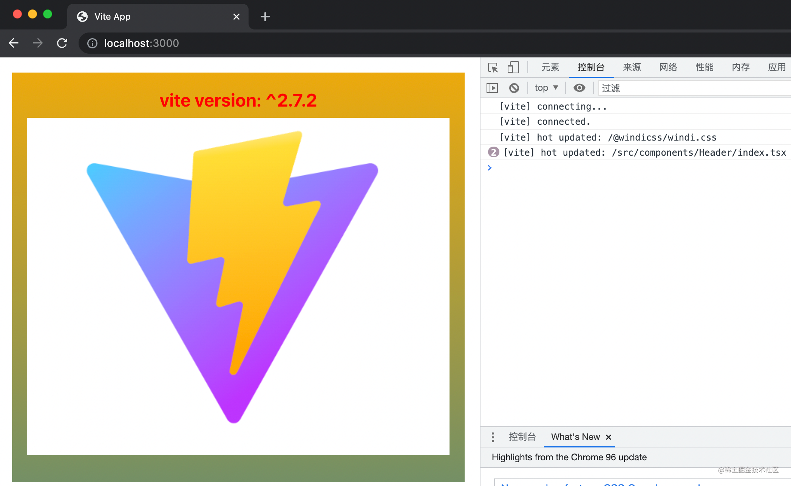

### 1.3. SVG 组件方式加载

刚才我们成功地在 Vite 中实现了图片的加载，上述这些加载的方式对于 svg 格式来说依然是适用的。不过，我们通常也希望能将 svg 当做一个组件来引入，这样我们可以很方便地修改 svg 的各种属性，而且比 img 标签的引入方式更加优雅。

SVG 组件加载在不同的前端框架中的实现不太相同，社区中也已经了有了对应的插件支持:

- Vue2 项目中可以使用 [vite-plugin-vue2-svg](https://github.com/pakholeung37/vite-plugin-vue2-svg)插件。
- Vue3 项目中可以引入 [vite-svg-loader](https://github.com/jpkleemans/vite-svg-loader)。
- React 项目使用 [vite-plugin-svgr](https://github.com/pd4d10/vite-plugin-svgr)插件。

现在让我们在 React 脚手架项目中安装对应的依赖:

pnpm i vite-plugin-svgr -D

然后需要在 vite 配置文件添加这个插件:

```plain
// vite.config.ts
import svgr from 'vite-plugin-svgr';

{
  plugins: [
    // 其它插件省略
    svgr()
  ]
}
```

随后注意要在 `tsconfig.json` 添加如下配置，否则会有类型错误:

```plain
{
  "compilerOptions": {
    // 省略其它配置
    "types": ["vite-plugin-svgr/client"]
  }
}
```

接下来让我们在项目中使用 svg 组件:

```plain
import { ReactComponent as ReactLogo } from '@assets/icons/logo.svg';

export function Header() {
  return (
    // 其他组件内容省略
     <ReactLogo />
  )
}
```

回到浏览器中，你可以看到 svg 已经成功渲染:

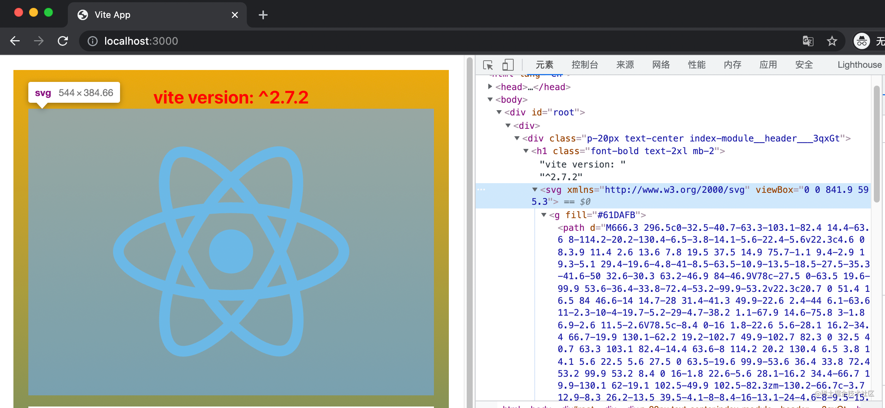

## 2. JSON 加载

Vite 中已经内置了对于 JSON 文件的解析，底层使用`@rollup/pluginutils` 的 `dataToEsm` 方法将 JSON 对象转换为一个包含各种具名导出的 ES 模块，使用姿势如下:

import { version } from '../../../package.json';

不过你也可以在配置文件禁用按名导入的方式:

```plain
// vite.config.ts

{
  json: {
    stringify: true
  }
}
```

这样会将 JSON 的内容解析为`export default JSON.parse("xxx")`，这样会失去`按名导出`的能力，不过在 JSON 数据量比较大的时候，可以优化解析性能。

## 3. Web Worker 脚本

Vite 中使用 Web Worker 也非常简单，我们可以在新建`Header/example.js`文件:

```plain
const start = () => {
  let count = 0;
  setInterval(() => {
    // 给主线程传值
    postMessage(++count);
  }, 2000);
};

start();
```

然后在 Header 组件中引入，引入的时候注意加上`?worker`后缀，相当于告诉 Vite 这是一个 Web Worker 脚本文件:

```plain
import Worker from './example.js?worker';
// 1. 初始化 Worker 实例
const worker = new Worker();
// 2. 主线程监听 worker 的信息
worker.addEventListener('message', (e) => {
  console.log(e);
});
```

打开浏览器的控制面板，你可以看到 Worker 传给主线程的信息已经成功打印:

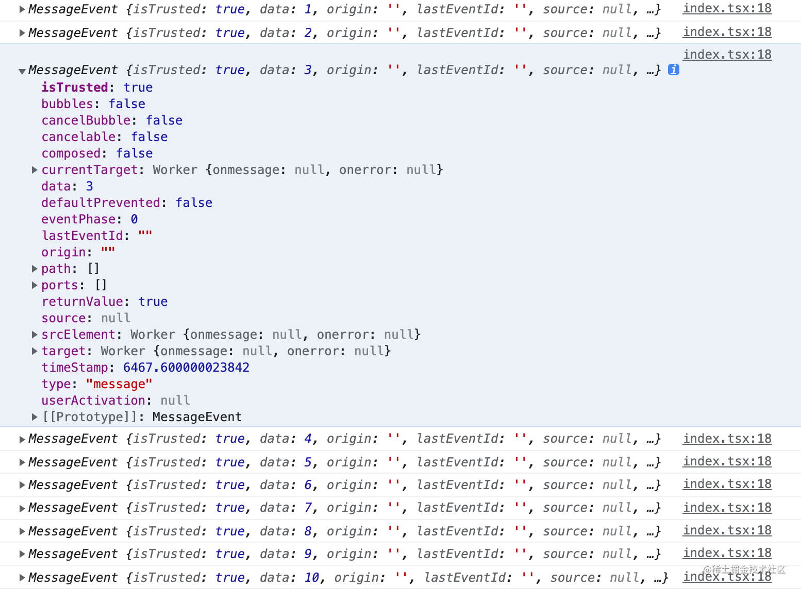

说明 Web Worker 脚本已经成功执行，也能与主线程正常通信。

## 4. Web Assembly 文件

Vite 对于 `.wasm` 文件也提供了开箱即用的支持，我们拿一个斐波拉契的 `.wasm` 文件(原文件已经放到[Github 仓库](https://github.com/sanyuan0704/juejin-book-vite/tree/main/4~7-vite-project-framework/src/components/Header)中)来进行一下实际操作，对应的 JavaScript 原文件如下:

```plain
export function fib(n) {
  var a = 0,
    b = 1;
  if (n > 0) {
    while (--n) {
      let t = a + b;
      a = b;
      b = t;
    }
    return b;
  }
  return a;
}
```

让我们在组件中导入`fib.wasm`文件:

```plain
// Header/index.tsx
import init from './fib.wasm?init';

type FibFunc = (num: number) => number;

init({}).then((instance) => {
  const fibFunc = instance.exports.fib as FibFunc;
  console.log('Fib result:', fibFunc(10));
});
```

Vite 会对`.wasm`文件的内容进行封装，默认导出为 init 函数，这个函数返回一个 Promise，因此我们可以在其 then 方法中拿到其导出的成员——`fib`方法。

回到浏览器，我们可以查看到计算结果，说明 .wasm 文件已经被成功执行:

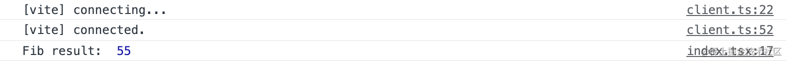

## 5. 其它静态资源

除了上述的一些资源格式，Vite 也对下面几类格式提供了内置的支持:

- 媒体类文件，包括`mp4`、`webm`、`ogg`、`mp3`、`wav`、`flac`和`aac`。
- 字体类文件。包括`woff`、`woff2`、`eot`、`ttf` 和 `otf`。
- 文本类。包括`webmanifest`、`pdf`和`txt`。

也就是说，你可以在 Vite 将这些类型的文件当做一个 ES 模块来导入使用。如果你的项目中还存在其它格式的静态资源，你可以通过`assetsInclude`配置让 Vite 来支持加载:

```plain
// vite.config.ts

{
  assetsInclude: ['.gltf']
}
```

## 6. 特殊资源后缀

Vite 中引入静态资源时，也支持在路径最后加上一些特殊的 query 后缀，包括:

- `?url`: 表示获取资源的路径，这在只想获取文件路径而不是内容的场景将会很有用。
- `?raw`: 表示获取资源的字符串内容，如果你只想拿到资源的原始内容，可以使用这个后缀。
- `?inline`: 表示资源强制内联，而不是打包成单独的文件。

## 7. 生产环境处理

在前面的内容中，我们围绕着如何加载静态资源这个问题，在 Vite 中进行具体的编码实践，相信对于 Vite 中各种静态资源的使用你已经比较熟悉了。但另一方面，在生产环境下，我们又面临着一些新的问题。

- 部署域名怎么配置？
- 资源打包成单文件还是作为 Base64 格式内联?
- 图片太大了怎么压缩？
- svg 请求数量太多了怎么优化？

### 7.1. 自定义部署域名

一般在我们访问线上的站点时，站点里面一些静态资源的地址都包含了相应域名的前缀，如:

```html

```

以上面这个地址例子，`https://sanyuan.cos.ap-beijing.myqcloud.com`是 CDN 地址前缀，`/logo.png`则是我们开发阶段使用的路径。那么，我们是不是需要在上线前把图片先上传到 CDN，然后将代码中的地址手动替换成线上地址呢？这样就太麻烦了！

在 Vite 中我们可以有更加自动化的方式来实现地址的替换，只需要在配置文件中指定`base`参数即可:

```typescript
// vite.config.ts
// 是否为生产环境，在生产环境一般会注入 NODE_ENV 这个环境变量，见下面的环境变量文件配置
const isProduction = process.env.NODE_ENV === 'production';
// 填入项目的 CDN 域名地址
const CDN_URL = 'xxxxxx';

// 具体配置
{
  base: isProduction ? CDN_URL: '/'
}

// .env.development
NODE_ENV=development

// .env.production
NODE_ENV=production
```

注意在项目根目录新增的两个环境变量文件`.env.development`和`.env.production`，顾名思义，即分别在开发环境和生产环境注入一些环境变量，这里为了区分不同环境我们加上了`NODE_ENV`，你也可以根据需要添加别的环境变量。

打包的时候 Vite 会自动将这些环境变量替换为相应的字符串。

接着执行`pnpm run build`，可以发现产物中的静态资源地址已经自动加上了 CDN 地址前缀:

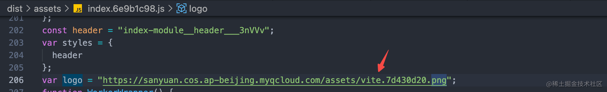

当然，HTML 中的一些 JS、CSS 资源链接也一起加上了 CDN 地址前缀:


当然，有时候可能项目中的某些图片需要存放到另外的存储服务，一种直接的方案是将完整地址写死到 src 属性中，如:

```html

```

这样做显然是不太优雅的，我们可以通过定义环境变量的方式来解决这个问题，在项目根目录新增`.env`文件:

```plain
// 开发环境优先级: .env.development > .env
// 生产环境优先级: .env.production > .env
// .env 文件
VITE_IMG_BASE_URL=https://my-image-cdn.com
```

然后进入 `src/vite-env.d.ts`增加类型声明:

```plain
/// <reference types="vite/client" />

interface ImportMetaEnv {
  readonly VITE_APP_TITLE: string;
  // 自定义的环境变量
  readonly VITE_IMG_BASE_URL: string;
}

interface ImportMeta {
  readonly env: ImportMetaEnv;
}
```

值得注意的是，如果某个环境变量要在 Vite 中通过 `import.meta.env` 访问，那么它必须以`VITE_`开头，如`VITE_IMG_BASE_URL`。接下来我们在组件中来使用这个环境变量:


接下来在`开发环境`启动项目或者`生产环境`打包后可以看到环境变量已经被替换，地址能够正常显示:

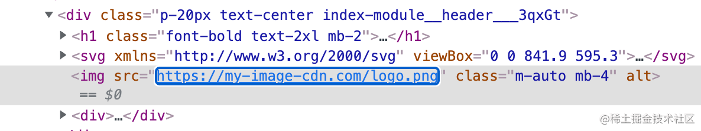

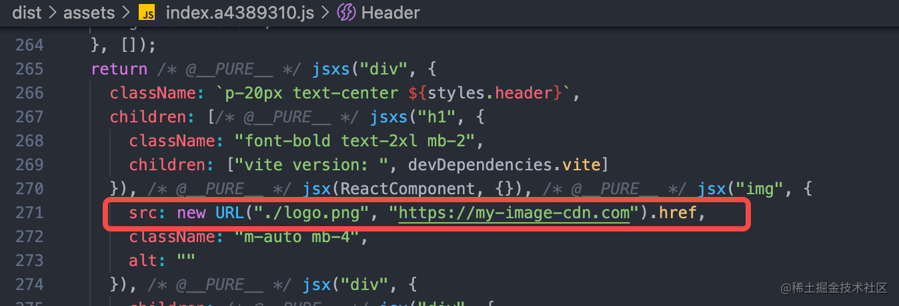

至此，我们就彻底解决了图片资源生产环境域名替换的问题。

### 7.2. 单文件 or 内联？

在 Vite 中，所有的静态资源都有两种构建方式，一种是打包成一个单文件，另一种是通过 base64 编码的格式内嵌到代码中。

这两种方案到底应该如何来选择呢？

对于比较小的资源，适合内联到代码中，一方面对`代码体积`的影响很小，另一方面可以减少不必要的网络请求，`优化网络性能`。而对于比较大的资源，就推荐单独打包成一个文件，而不是内联了，否则可能导致上 MB 的 base64 字符串内嵌到代码中，导致代码体积瞬间庞大，页面加载性能直线下降。

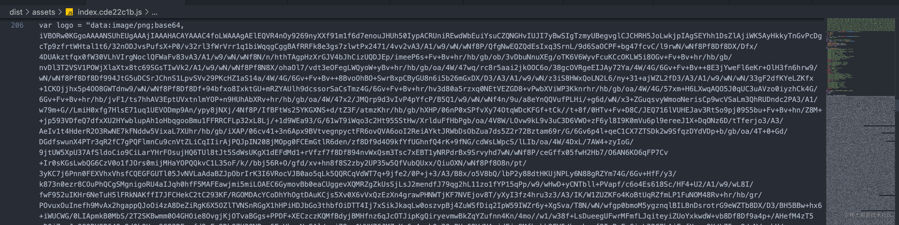

Vite 中内置的优化方案是下面这样的:

- 如果静态资源体积 >= 4KB，则提取成单独的文件
- 如果静态资源体积 < 4KB，则作为 base64 格式的字符串内联

上述的`4 KB`即为提取成单文件的临界值，当然，这个临界值你可以通过`build.assetsInlineLimit`自行配置，如下代码所示:

```plain
// vite.config.ts
{
  build: {
    // 8 KB
    assetsInlineLimit: 8 * 1024
  }
}
```

svg 格式的文件不受这个临时值的影响，始终会打包成单独的文件，因为它和普通格式的图片不一样，需要动态设置一些属性

### 7.3. 图片压缩

图片资源的体积往往是项目产物体积的大头，如果能尽可能精简图片的体积，那么对项目整体打包产物体积的优化将会是非常明显的。在 JavaScript 领域有一个非常知名的图片压缩库[imagemin](https://www.npmjs.com/package/imagemin)，作为一个底层的压缩工具，前端的项目中经常基于它来进行图片压缩，比如 Webpack 中大名鼎鼎的`image-webpack-loader`。社区当中也已经有了开箱即用的 Vite 插件——`vite-plugin-imagemin`，首先让我们来安装它:

pnpm i vite-plugin-imagemin -D

随后在 Vite 配置文件中引入:

```plain
//vite.config.ts
import viteImagemin from 'vite-plugin-imagemin';

{
  plugins: [
    // 忽略前面的插件
    viteImagemin({
      // 无损压缩配置，无损压缩下图片质量不会变差
      optipng: {
        optimizationLevel: 7
      },
      // 有损压缩配置，有损压缩下图片质量可能会变差
      pngquant: {
        quality: [0.8, 0.9],
      },
      // svg 优化
      svgo: {
        plugins: [
          {
            name: 'removeViewBox'
          },
          {
            name: 'removeEmptyAttrs',
            active: false
          }
        ]
      }
    })
  ]
}
```

接下来我们可以尝试执行`pnpm run build`进行打包:

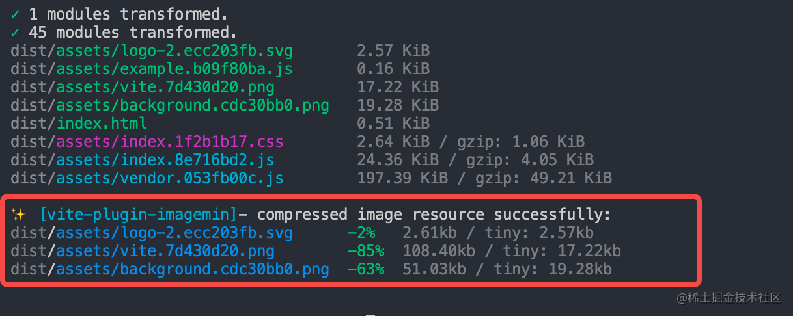

Vite 插件已经自动帮助我们调用 `imagemin` 进行项目图片的压缩，可以看到压缩的效果非常明显，强烈推荐大家在项目中使用。

### 7.4. 雪碧图优化

在实际的项目中我们还会经常用到各种各样的 svg 图标，虽然 svg 文件一般体积不大，但 Vite 中对于 svg 文件会始终打包成单文件，大量的图标引入之后会导致网络请求增加，大量的 HTTP 请求会导致网络解析耗时变长，页面加载性能直接受到影响。这个问题怎么解决呢？

HTTP2 的多路复用设计可以解决大量 HTTP 的请求导致的网络加载性能问题，因此雪碧图技术在 HTTP2 并没有明显的优化效果，这个技术更适合在传统的 HTTP 1.1 场景下使用(比如本地的 Dev Server)。

比如在 Header 中分别引入 5 个 svg 文件:

```plain
import Logo1 from '@assets/icons/logo-1.svg';
import Logo2 from '@assets/icons/logo-2.svg';
import Logo3 from '@assets/icons/logo-3.svg';
import Logo4 from '@assets/icons/logo-4.svg';
import Logo5 from '@assets/icons/logo-5.svg';
```

这里顺便说一句，Vite 中提供了`import.meta.glob`的语法糖来解决这种**批量导入**的问题，如上述的 import 语句可以写成下面这样:

const icons = import.meta.glob('../../assets/icons/logo-*.svg');

结果如下:

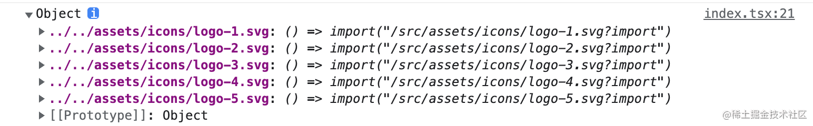

可以看到对象的 value 都是动态 import，适合按需加载的场景。在这里我们只需要同步加载即可，可以使用 `import.meta.globEager`来完成:

const icons = import.meta.globEager('../../assets/icons/logo-*.svg');

`icons`的结果打印如下: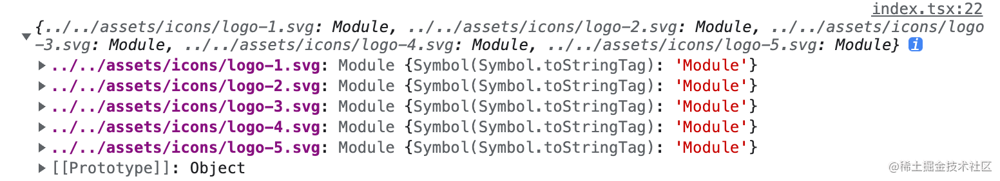

接下来我们稍作解析，然后将 svg 应用到组件当中:

```plain
// Header/index.tsx
const iconUrls = Object.values(icons).map(mod => mod.default);

// 组件返回内容添加如下
{iconUrls.map((item) => (
  
))}
```

回到页面中，我们发现浏览器分别发出了 5 个 svg 的请求:

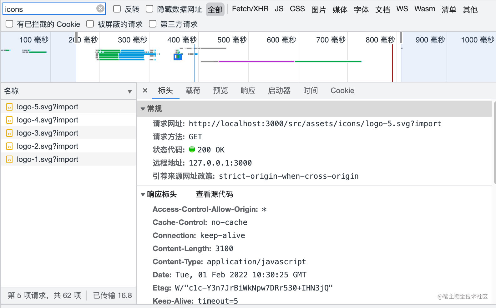

假设页面有 100 个 svg 图标，将会多出 100 个 HTTP 请求，依此类推。我们能不能把这些 svg 合并到一起，从而大幅减少网络请求呢？

答案是可以的。这种合并图标的方案也叫`雪碧图`，我们可以通过`vite-plugin-svg-icons`来实现这个方案，首先安装一下这个插件:

pnpm i vite-plugin-svg-icons -D

接着在 Vite 配置文件中增加如下内容:

```plain
// vite.config.ts
import { createSvgIconsPlugin } from 'vite-plugin-svg-icons';

{
  plugins: [
    // 省略其它插件
    createSvgIconsPlugin({
      iconDirs: [path.join(__dirname, 'src/assets/icons')]
    })
  ]
}
```

在 `src/components`目录下新建`SvgIcon`组件:

```plain
// SvgIcon/index.tsx
export interface SvgIconProps {
  name?: string;
  prefix: string;
  color: string;
  [key: string]: string;
}

export default function SvgIcon({
  name,
  prefix = 'icon',
  color = '#333',
  ...props
}: SvgIconProps) {
  const symbolId = `#${prefix}-${name}`;

  return (
    <svg {...props} aria-hidden="true">
      <use href={symbolId} fill={color} />
    </svg>
  );
}
```

现在我们回到 Header 组件中，稍作修改:

```plain
// index.tsx
const icons = import.meta.globEager('../../assets/icons/logo-*.svg');
const iconUrls = Object.values(icons).map((mod) => {
  // 如 ../../assets/icons/logo-1.svg -> logo-1
  const fileName = mod.default.split('/').pop();
  const [svgName] = fileName.split('.');
  return svgName;
});

// 渲染 svg 组件
{iconUrls.map((item) => (
  <SvgIcon name={item} key={item} width="50" height="50" />
))}
```

最后在`src/main.tsx`文件中添加一行代码:

import 'virtual:svg-icons-register';

现在回到浏览器的页面中，发现雪碧图已经生成:

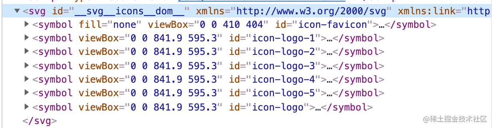

雪碧图包含了所有图标的具体内容，而对于页面每个具体的图标，则通过 `use` 属性来引用雪碧图的对应内容:

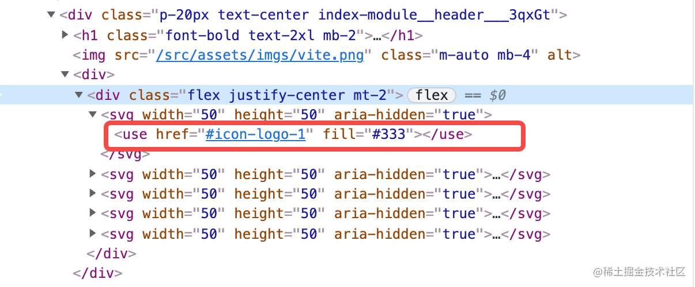

如此一来，我们就能将所有的 svg 内容都内联到 HTML 中，省去了大量 svg 的网络请求。

## 8. 小结

恭喜你，学习完了本节的内容。在这一节，你需要重点掌握在**Vite 如何加载静态资源**和**如何在生产环境中对静态资源进行优化**。

首先是如何加载各种静态资源，如图片、svg(组件形式)、JSON、Web Worker 脚本、Web Asssembly 文件等等格式，并通过一些示例带大家进行实际的操作。

其次，我们会把关注点放到**生产环境**，对`自定义部署域名`、`是否应该内联`、`图片压缩`、`svg 雪碧图`等问题进行了详细的探讨和实践，对于如何解决这些问题，相信你也有了自己的答案。

当然，在编码实操的过程当中，我也给你穿插了一些 Vite 其他的知识点，比如如何`定义环境变量文件`、`如何使用 Glob 导入`的语法糖。相信在学习本节的过程中你能更加体会到 Vite 给项目开发带来的便利，同时也对 Vite 的掌握更深入了一步。

本节的内容就到这里了，感谢你的阅读，我们下一节再见👋🏻！