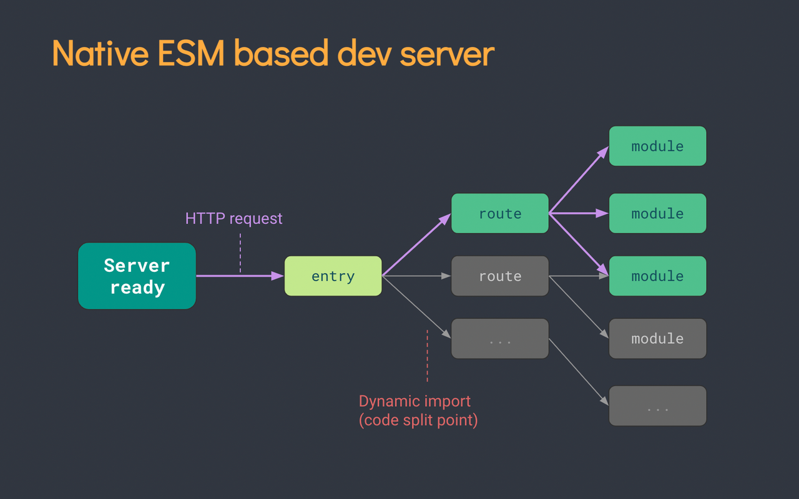
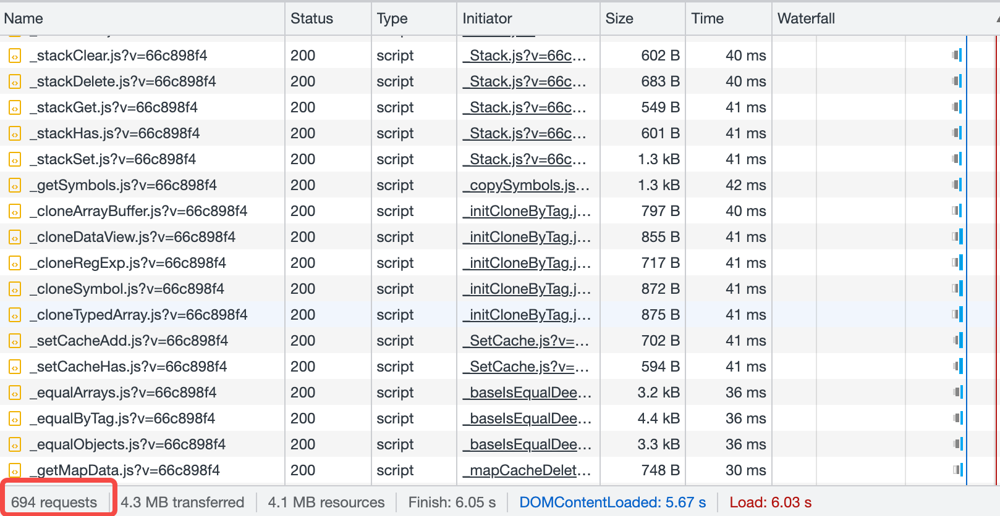
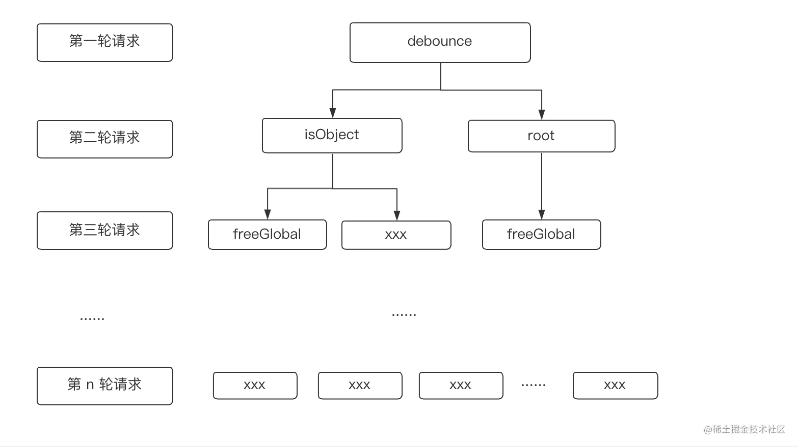
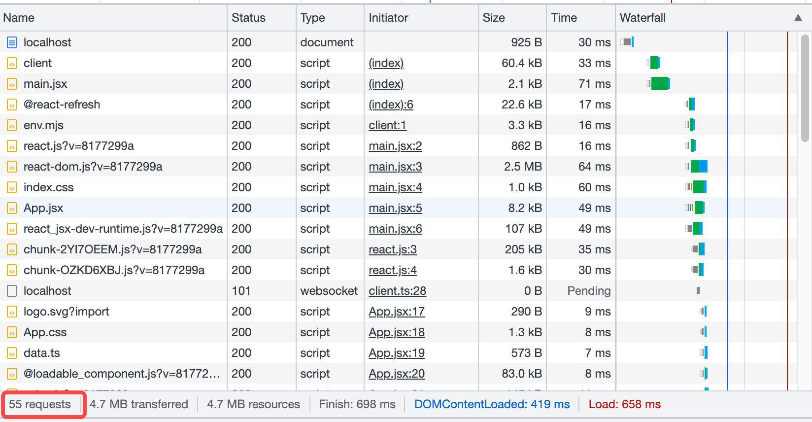
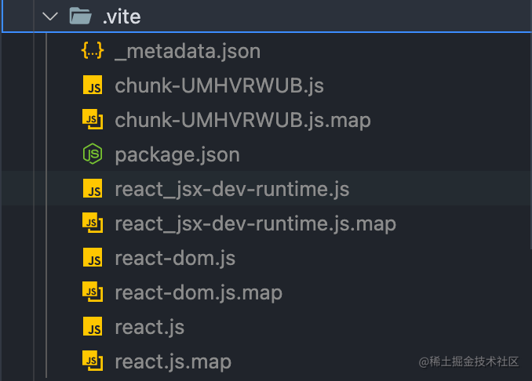
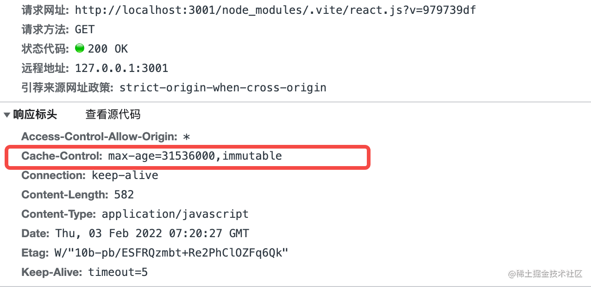

# 07-预构建: 如何玩转秒级依赖预构建的能力？

大家都知道， Vite 是一个提倡 `no-bundle` 的构建工具，相比于传统的 Webpack，能做到开发时的模块按需编译，而不用先打包完再加载。这一点我们在`快速上手`这一节已经具体地分析过了。

需要注意的是，我们所说的模块代码其实分为两部分，一部分是源代码，也就是业务代码，另一部分是第三方依赖的代码，即`node_modules`中的代码。所谓的`no-bundle`**只是对于源代码而言**，对于第三方依赖而言，Vite 还是选择 bundle(打包)，并且使用速度极快的打包器 Esbuild 来完成这一过程，达到秒级的依赖编译速度。

这一小节，我将带你一起熟悉 Vite 的预构建功能，深入体会各个配置的应用场景和使用姿势，学会在实战中驾驭预构建的能力。

## 1. 为什么需要预构建?

在介绍使用姿势之前，我想先问你一个问题：为什么在开发阶段我们要对第三方依赖进行预构建? 如果不进行预构建会怎么样？

首先 Vite 是基于浏览器原生 ES 模块规范实现的 Dev Server，不论是应用代码，还是第三方依赖的代码，理应符合 ESM 规范才能够正常运行。



但可惜，我们没有办法控制第三方的打包规范。就目前来看，还有相当多的第三方库仍然没有 ES 版本的产物，比如大名鼎鼎的 `react`:

```plain
// react 入口文件
// 只有 CommonJS 格式

if (process.env.NODE_ENV === "production") {
  module.exports = require("./cjs/react.production.min.js");
} else {
  module.exports = require("./cjs/react.development.js");
}
```

这种 CommonJS 格式的代码在 Vite 当中无法直接运行，我们需要将它转换成 ESM 格式的产物。

此外，还有一个比较重要的问题——**请求瀑布流问题**。比如说，知名的`loadsh-es`库本身是有 ES 版本产物的，可以在 Vite 中直接运行。但实际上，它在加载时会发出特别多的请求，导致页面加载的前几秒几都乎处于卡顿状态，拿一个简单的 demo 项目举例，请求情况如下图所示:



我在应用代码中调用了`debounce`方法，这个方法会依赖很多工具函数，如下图所示:



每个`import`都会触发一次新的文件请求，因此在这种`依赖层级深`、`涉及模块数量多`的情况下，会触发成百上千个网络请求，巨大的请求量加上 Chrome 对同一个域名下只能同时支持 `6` 个 HTTP 并发请求的限制，导致页面加载十分缓慢，与 Vite 主导性能优势的初衷背道而驰。不过，在进行**依赖的预构建**之后，`lodash-es`这个库的代码被打包成了一个文件，这样请求的数量会骤然减少，页面加载也快了许多。下图是进行预构建之后的请求情况，你可以对照看看:



总之，依赖预构建主要做了两件事情：

一是将其他格式(如 UMD 和 CommonJS)的产物转换为 ESM 格式，使其在浏览器通过 `<script type="module"><script>`的方式正常加载。

二是打包第三方库的代码，将各个第三方库分散的文件合并到一起，减少 HTTP 请求数量，避免页面加载性能劣化。

而这两件事情全部由性能优异的 `Esbuild` (基于 Golang 开发)完成，而不是传统的 Webpack/Rollup，所以也不会有明显的打包性能问题，反而是 Vite 项目启动飞快(秒级启动)的一个核心原因。

ps: Vite 1.x 使用了 Rollup 来进行依赖预构建，在 2.x 版本将 Rollup 换成了 Esbuild，编译速度提升了[近 100 倍](https://esbuild.github.io/)！

## 2. 如何开启预构建？

在 Vite 中有两种开启预构建的方式，分别是`自动开启`和`手动开启`。

### 2.1. 自动开启

首先是`自动开启`。当我们在第一次启动项目的时候，可以在命令行窗口看见如下的信息:


同时，在项目启动成功后，你可以在根目录下的`node_modules`中发现`.vite`目录，这就是预构建产物文件存放的目录，内容如下:



在浏览器访问页面后，打开 `Dev Tools` 中的网络调试面板，你可以发现第三方包的引入路径已经被重写:

```plain
import React from "react";
// 路径被重写，定向到预构建产物文件中
import __vite__cjsImport0_react from "/node_modules/.vite/react.js?v=979739df";
const React = __vite__cjsImport0_react.__esModule
  ? __vite__cjsImport0_react.default
  : __vite__cjsImport0_react;
```

并且对于依赖的请求结果，Vite 的 Dev Server 会设置强缓存:



缓存过期时间被设置为一年，表示缓存过期前浏览器对 react 预构建产物的请求不会再经过 Vite Dev Server，直接用缓存结果。

当然，除了 HTTP 缓存，Vite 还设置了本地文件系统的缓存，所有的预构建产物默认缓存在`node_modules/.vite`目录中。如果以下 3 个地方都没有改动，Vite 将一直使用缓存文件:

1. package.json 的 `dependencies` 字段
2. 各种包管理器的 lock 文件
3. `optimizeDeps` 配置内容

### 2.2. 手动开启

上面提到了预构建中本地文件系统的产物缓存机制，而少数场景下我们不希望用本地的缓存文件，比如需要调试某个包的预构建结果，我推荐使用下面任意一种方法清除缓存:

1. 删除`node_modules/.vite`目录。
2. 在 Vite 配置文件中，将`server.force`设为`true`。(注意，Vite 3.0 中配置项有所更新，你需要将 `optimizeDeps.force` 设为`true`)
3. 命令行执行`npx vite --force`或者`npx vite optimize`。

Vite 项目的启动可以分为两步，第一步是依赖预构建，第二步才是 Dev Server 的启动，`npx vite optimize`相比于其它的方案，仅仅完成第一步的功能。

## 3. 自定义配置详解

前面说到了如何启动预构建的问题，现在我们来谈谈怎样通过 Vite 提供的配置项来定制预构建的过程。Vite 将预构建相关的配置项都集中在`optimizeDeps`属性上，我们来一一拆解这些子配置项背后的含义和应用场景。

### 3.1. 入口文件——entries

第一个是参数是`optimizeDeps.entries`，通过这个参数你可以自定义预构建的入口文件。

实际上，在项目第一次启动时，Vite 会默认抓取项目中所有的 HTML 文件（如当前脚手架项目中的`index.html`），将 HTML 文件作为应用入口，然后根据入口文件扫描出项目中用到的第三方依赖，最后对这些依赖逐个进行编译。

那么，当默认扫描 HTML 文件的行为无法满足需求的时候，比如项目入口为`vue`格式文件时，你可以通过 entries 参数来配置:

```javascript
// vite.config.ts
{
  optimizeDeps: {
    // 为一个字符串数组
    entries: ["./src/main.vue"];
  }
}
```

当然，entries 配置也支持 [glob 语法](https://github.com/mrmlnc/fast-glob)，非常灵活，如:

```javascript
// 将所有的 .vue 文件作为扫描入口
entries: ["**/*.vue"];
```

不光是`.vue`文件，Vite 同时还支持各种格式的入口，包括: `html`、`svelte`、`astro`、`js`、`jsx`、`ts`和`tsx`。可以看到，只要可能存在`import`语句的地方，Vite 都可以解析，并通过内置的扫描机制搜集到项目中用到的依赖，通用性很强。

### 3.2. 添加一些依赖——include

除了 `entries`，`include` 也是一个很常用的配置，它决定了可以强制预构建的依赖项，使用方式很简单:

```typescript
// vite.config.ts
optimizeDeps: {
  // 配置为一个字符串数组，将 `lodash-es` 和 `vue`两个包强制进行预构建
  include: ["lodash-es", "vue"];
}
```

它在使用上并不难，真正难的地方在于，如何找到合适它的使用场景。前文中我们提到，Vite 会根据应用入口(`entries`)自动搜集依赖，然后进行预构建，这是不是说明 Vite 可以百分百准确地搜集到所有的依赖呢？事实上并不是，某些情况下 Vite 默认的扫描行为并不完全可靠，这就需要联合配置`include`来达到完美的预构建效果了。接下来，我们好好梳理一下到底有哪些需要配置`include`的场景。

#### 3.2.1. 场景一: 动态 import

在某些动态 import 的场景下，由于 Vite 天然按需加载的特性，经常会导致某些依赖只能在运行时被识别出来。

```javascript
// src/locales/zh_CN.js
import objectAssign from "object-assign";
console.log(objectAssign);

// main.tsx
const importModule = (m) => import(`./locales/${m}.ts`);
importModule("zh_CN");
```

在这个例子中，动态 import 的路径只有运行时才能确定，无法在预构建阶段被扫描出来。因此，我们在访问项目时控制台会出现下面的日志信息:


这段 log 的意思是: Vite 运行时发现了新的依赖，随之重新进行依赖预构建，并刷新页面。这个过程也叫**二次预构建**。在一些比较复杂的项目中，这个过程会执行很多次，如下面的日志信息所示:

```plain
[vite] new dependencies found: @material-ui/icons/Dehaze, @material-ui/core/Box, @material-ui/core/Checkbox, updating...
[vite] ✨ dependencies updated, reloading page...
[vite] new dependencies found: @material-ui/core/Dialog, @material-ui/core/DialogActions, updating...
[vite] ✨ dependencies updated, reloading page...
[vite] new dependencies found: @material-ui/core/Accordion, @material-ui/core/AccordionSummary, updating...
[vite] ✨ dependencies updated, reloading page...
```

然而，二次预构建的成本也比较大。我们不仅需要把预构建的流程重新运行一遍，还得重新刷新页面，并且需要重新请求所有的模块。尤其是在大型项目中，这个过程会严重拖慢应用的加载速度！因此，我们要尽力避免运行时的**二次预构建**。具体怎么做呢？你可以通过`include`参数提前声明需要按需加载的依赖:

```typescript
// vite.config.ts
{
  optimizeDeps: {
    include: [
      // 按需加载的依赖都可以声明到这个数组里
      "object-assign",
    ];
  }
}
```

#### 3.2.2. 场景二: 某些包被手动 exclude

`exclude` 是`optimizeDeps`中的另一个配置项，与`include`相对，用于将某些依赖从预构建的过程中排除。不过这个配置并不常用，也不推荐大家使用。如果真遇到了要在预构建中排除某个包的情况，需要注意`它所依赖的包`是否具有 ESM 格式，如下面这个例子:

```typescript
// vite.config.ts
{
  optimizeDeps: {
    exclude: ["@loadable/component"];
  }
}
```

可以看到浏览器控制台会出现如下的报错:


这是为什么呢? 我们刚刚手动 exclude 的包`@loadable/component`本身具有 ESM 格式的产物，但它的某个依赖`hoist-non-react-statics`的产物并没有提供 ESM 格式，导致运行时加载失败。

这个时候`include`配置就派上用场了，我们可以强制对`hoist-non-react-statics`这个间接依赖进行预构建:

```typescript
// vite.config.ts
{
  optimizeDeps: {
    include: [
      // 间接依赖的声明语法，通过`>`分开, 如`a > b`表示 a 中依赖的 b
      "@loadable/component > hoist-non-react-statics",
    ];
  }
}
```

在`include`参数中，我们将所有不具备 ESM 格式产物包都声明一遍，这样再次启动项目就没有问题了。

### 3.3. 自定义 Esbuild 行为

Vite 提供了`esbuildOptions` 参数来让我们自定义 Esbuild 本身的配置，常用的场景是加入一些 Esbuild 插件:

```typescript
// vite.config.ts
{
  optimizeDeps: {
    esbuildOptions: {
      plugins: [
        // 加入 Esbuild 插件
      ];
    }
  }
}
```

这个配置主要是处理一些特殊情况，如某个第三方包本身的代码出现问题了。接下来，我们就来讨论一下。

## 4. 特殊情况: 第三方包出现问题怎么办？

由于我们无法保证第三方包的代码质量，在某些情况下我们会遇到莫名的第三方库报错。我举一个常见的案例——`react-virtualized`库。这个库被许多组件库用到，但它的 ESM 格式产物有明显的问题，在 Vite 进行预构建的时候会直接抛出这个错误：


原因是这个库的 ES 产物莫名其妙多出了一行无用的代码:

```javascript
// WindowScroller.js 并没有导出这个模块
import { bpfrpt_proptype_WindowScroller } from "../WindowScroller.js";
```

其实我们并不需要这行代码，但它却导致 Esbuild 预构建的时候直接报错退出了。那这一类的问题如何解决呢？

### 4.1. 改第三方库代码

首先，我们能想到的思路是**直接修改第三方库的代码**，不过这会带来团队协作的问题，你的改动需要同步到团队所有成员，比较麻烦。

好在，我们可以使用`patch-package`这个库来解决这类问题。一方面，它能记录第三方库代码的改动，另一方面也能将改动同步到团队每个成员。

`patch-package` 官方只支持 npm 和 yarn，而不支持 pnpm，不过社区中已经提供了支持`pnpm`的版本，这里我们来安装一下相应的包:

pnpm i @milahu/patch-package -D

注意: 要改动的包在 package.json 中必须声明确定的版本，不能有`~`或者`^`的前缀。

接着，我们进入第三方库的代码中进行修改，先删掉无用的 import 语句，再在命令行输入:

npx patch-package react-virtualized

现在根目录会多出`patches`目录记录第三方包内容的更改，随后我们在`package.json`的`scripts`中增加如下内容：

```plain
{
  "scripts": {
    // 省略其它 script
    "postinstall": "patch-package"
  }
}
```

这样一来，每次安装依赖的时候都会通过 `postinstall` 脚本自动应用 patches 的修改，解决了团队协作的问题。

### 4.2. 加入 Esbuild 插件

第二种方式是通过 Esbuild 插件修改指定模块的内容，这里我给大家展示一下新增的配置内容:

关于 Esbuild 插件的实现细节，大家不用深究，我们将在**底层双引擎**的部分给大家展开介绍

```typescript
// vite.config.ts
const esbuildPatchPlugin = {
  name: "react-virtualized-patch",
  setup(build) {
    build.onLoad(
      {
        filter:
          /react-virtualized\/dist\/es\/WindowScroller\/utils\/onScroll.js$/,
      },
      async (args) => {
        const text = await fs.promises.readFile(args.path, "utf8");

        return {
          contents: text.replace(
            'import { bpfrpt_proptype_WindowScroller } from "../WindowScroller.js";',
            ""
          ),
        };
      }
    );
  },
};

// 插件加入 Vite 预构建配置
{
  optimizeDeps: {
    esbuildOptions: {
      plugins: [esbuildPatchPlugin];
    }
  }
}
```

## 5. 小结

好，本节的内容到这里就接近尾声了。在这一节，你需要重点掌握 **Vite 预构建技术的作用**和**预构建相关配置的使用**。

Vite 中的依赖预构建技术主要解决了 2 个问题，即模块格式兼容问题和海量模块请求的问题。而 Vite 中开启预构建有 2 种方式，并梳理了预构建产物的缓存策略，推荐了一些手动清除缓存的方法。

接着，我们正式学习了预构建的相关配置——`entries`、`include`、`exclude`和`esbuldOptions`，并且重点介绍了`include`配置的各种使用场景和使用姿势。最后，我们讨论了一类特殊情况，即第三方包出现了问题该怎么办，分别给你介绍了两个解决思路: 通过`patch-package`修改库代码和编写 `Esbuild 插件`修改模块加载的内容。

本小节的内容覆盖了 Vite 预构建绝大多数的应用场景，相信现在的你已经对预构建有了更深入的掌握。欢迎在评论区把自己在使用预构建时踩过的坑分享出来，跟大家一起讨论，也欢迎大家集思广益，分享更多的解决思路。感谢你的阅读，我们下一节再见！
