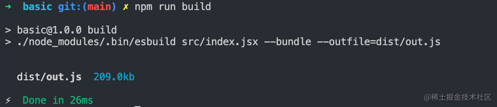
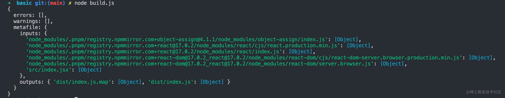
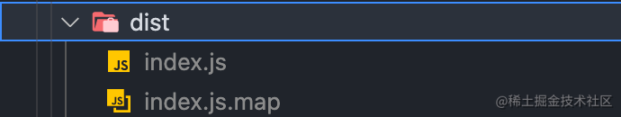
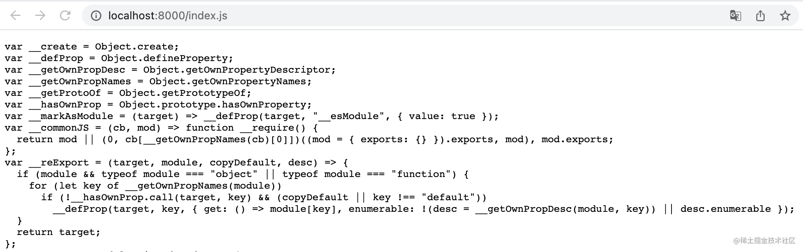
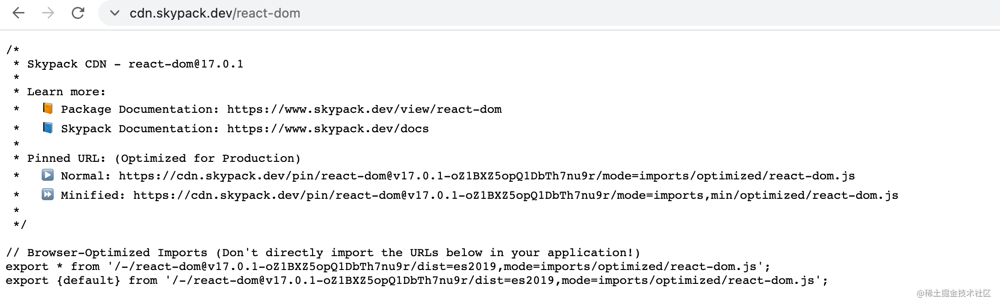
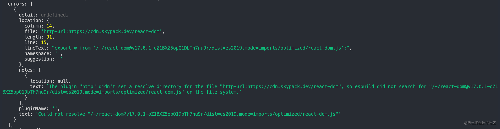
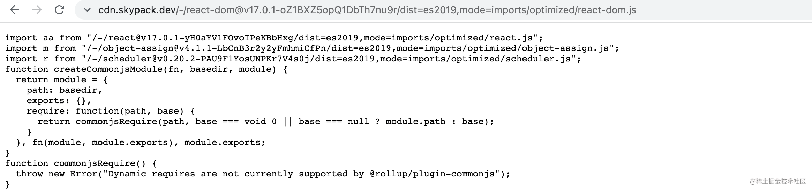
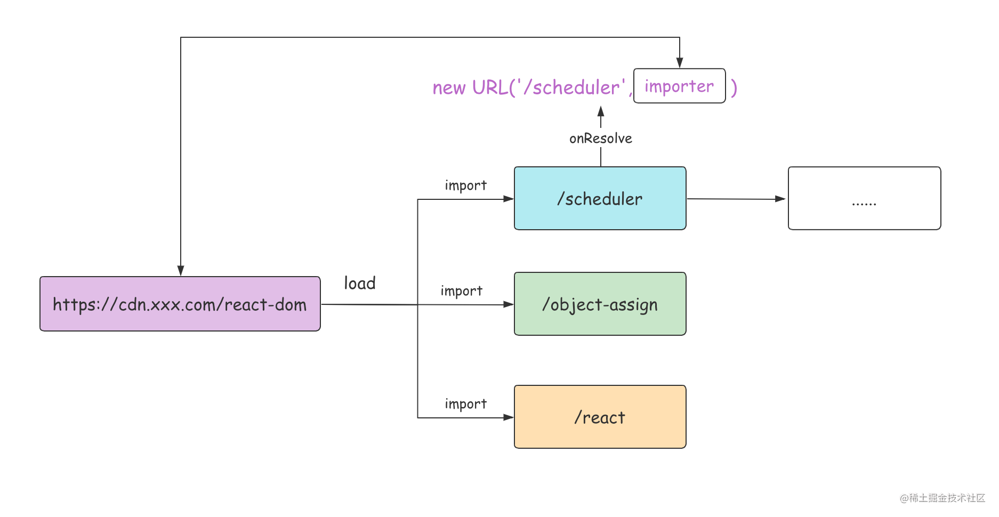
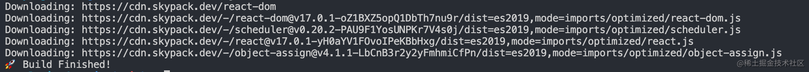
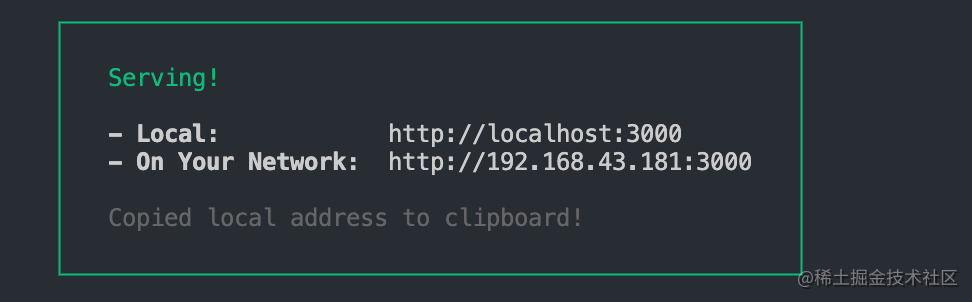

# 09-得力的性能推手: Esbuild 功能使用与插件开发实战

上一小节，我们介绍了 Vite 的双引擎架构。不可否认，作为 Vite 的双引擎之一，Esbuild 在很多关键的构建阶段(如`依赖预编译`、`TS 语法转译`、`代码压缩`)让 Vite 获得了相当优异的性能，是 Vite 高性能的得力助手。无论是在 Vite 的配置项还是源码实现中，都包含了不少 Esbuild 本身的基本概念和高阶用法。因此，要深入掌握 Vite，学习 Esbuild 必不可少。

本小节，我们将专注于 Esbuild 本身，一起学习它的基本概念和功能使用，同时实战开发一个完整的 Esbuild 插件。

## 1. 为什么 Esbuild 性能极高？

Esbuild 是由 Figma 的 CTO 「Evan Wallace」基于 Golang 开发的一款打包工具，相比传统的打包工具，主打性能优势，在构建速度上可以比传统工具快 `10~100` 倍。那么，它是如何达到这样超高的构建性能的呢？主要原因可以概括为 4 点。

1. **使用 Golang 开发**，构建逻辑代码直接被编译为原生机器码，而不用像 JS 一样先代码解析为字节码，然后转换为机器码，大大节省了程序运行时间。
2. **多核并行**。内部打包算法充分利用多核 CPU 优势，所有的步骤尽可能并行，这也是得益于 Go 当中多线程共享内存的优势。
3. **从零造轮子**。 几乎没有使用任何第三方库，所有逻辑自己编写，大到 AST 解析，小到字符串的操作，保证极致的代码性能。
4. **高效的内存利用**。Esbuild 中从头到尾尽可能地复用一份 AST 节点数据，而不用像 JS 打包工具中频繁地解析和传递 AST 数据（如 string -> TS -> JS -> string)，造成内存的大量浪费。

## 2. Esbuild 功能使用

接下来我们正式学习 Esbuild 的功能使用。首先我们执行`pnpm init`新建一个项目, 然后通过如下的命令完成 Esbuild 的安装:

pnpm i esbuild@0.14.18

使用 Esbuild 有 2 种方式，分别是 **命令行调用**和**代码调用**。

### 2.1. 命令行调用

命令行方式调用也是最简单的使用方式。我们先来写一些示例代码，新建`src/index.jsx`文件，内容如下:

```jsx
// src/index.jsx
import Server from "react-dom/server";

let Greet = () => <h1>Hello, juejin!</h1>;
console.log(Server.renderToString(<Greet />));
```

注意安装一下所需的依赖，在终端执行如下的命令:

pnpm install react react-dom

接着到`package.json`中添加`build`脚本:

```javascript
"scripts": {
  "build": "./node_modules/.bin/esbuild src/index.jsx --bundle --outfile=dist/out.js"
},
```

现在，你可以在终端执行`pnpm run build`，可以发现如下的日志信息:



说明我们已经成功通过命令行完成了 Esbuild 打包！但命令行的使用方式不够灵活，只能传入一些简单的命令行参数，稍微复杂的场景就不适用了，所以一般情况下我们还是会用代码调用的方式。

### 2.2. 代码调用

Esbuild 对外暴露了一系列的 API，主要包括两类: `Build API`和`Transform API`，我们可以在 Nodejs 代码中通过调用这些 API 来使用 Esbuild 的各种功能。

#### 2.2.1. 项目打包—Build API

`Build API`主要用来进行项目打包，包括`build`、`buildSync`和`serve`三个方法。

首先我们来试着在 Node.js 中使用`build` 方法。你可以在项目根目录新建`build.js`文件，内容如下:

```javascript
const { build, buildSync, serve } = require("esbuild");

async function runBuild() {
  // 异步方法，返回一个 Promise
  const result = await build({
    // ----  如下是一些常见的配置  --- 
    // 当前项目根目录
    absWorkingDir: process.cwd(),
    // 入口文件列表，为一个数组
    entryPoints: ["./src/index.jsx"],
    // 打包产物目录
    outdir: "dist",
    // 是否需要打包，一般设为 true
    bundle: true,
    // 模块格式，包括`esm`、`commonjs`和`iife`
    format: "esm",
    // 需要排除打包的依赖列表
    external: [],
    // 是否开启自动拆包
    splitting: true,
    // 是否生成 SourceMap 文件
    sourcemap: true,
    // 是否生成打包的元信息文件
    metafile: true,
    // 是否进行代码压缩
    minify: false,
    // 是否开启 watch 模式，在 watch 模式下代码变动则会触发重新打包
    watch: false,
    // 是否将产物写入磁盘
    write: true,
    // Esbuild 内置了一系列的 loader，包括 base64、binary、css、dataurl、file、js(x)、ts(x)、text、json
    // 针对一些特殊的文件，调用不同的 loader 进行加载
    loader: {
      '.png': 'base64',
    }
  });
  console.log(result);
}

runBuild();
```

随后，你在命令行执行`node build.js`，就能在控制台发现如下日志信息:



以上就是 Esbuild 打包的元信息，这对我们编写插件扩展 Esbuild 能力非常有用。

接着，我们再观察一下 dist 目录，发现打包产物和相应的 SourceMap 文件也已经成功写入磁盘:



其实`buildSync`方法的使用几乎相同，如下代码所示:

```javascript
function runBuild() {
  // 同步方法
  const result = buildSync({
    // 省略一系列的配置
  });
  console.log(result);
}

runBuild();
```

但我并不推荐大家使用 `buildSync` 这种同步的 API，它们会导致两方面不良后果。一方面容易使 Esbuild 在当前线程阻塞，丧失`并发任务处理`的优势。另一方面，Esbuild 所有插件中都不能使用任何异步操作，这给`插件开发`增加了限制。

因此我更推荐大家使用`build`这个异步 API，它可以很好地避免上述问题。

在项目打包方面，除了`build`和`buildSync`，Esbuild 还提供了另外一个比较强大的 API——`serve`。这个 API 有 3 个特点。

1. 开启 serve 模式后，将在指定的端口和目录上搭建一个`静态文件服务`，这个服务器用原生 Go 语言实现，性能比 Nodejs 更高。
2. 类似 webpack-dev-server，所有的产物文件都默认不会写到磁盘，而是放在内存中，通过请求服务来访问。
3. **每次请求**到来时，都会进行重新构建(`rebuild`)，永远返回新的产物。

值得注意的是，触发 rebuild 的条件并不是代码改动，而是新的请求到来。

下面，我们通过一个具体例子来感受一下。

```javascript
// build.js
const { build, buildSync, serve } = require("esbuild");

function runBuild() {
  serve(
    {
      port: 8000,
      // 静态资源目录
      servedir: './dist'
    },
    {
      absWorkingDir: process.cwd(),
      entryPoints: ["./src/index.jsx"],
      bundle: true,
      format: "esm",
      splitting: true,
      sourcemap: true,
      ignoreAnnotations: true,
      metafile: true,
    }
  ).then((server) => {
    console.log("HTTP Server starts at port", server.port);
  });
}

runBuild();
```

我们在浏览器访问`localhost:8000`可以看到 Esbuild 服务器返回的编译产物如下所示：



后续每次在浏览器请求都会触发 Esbuild 重新构建，而每次重新构建都是一个增量构建的过程，耗时也会比首次构建少很多(一般能减少 70% 左右)。

Serve API 只适合在开发阶段使用，不适用于生产环境。

#### 2.2.2. 单文件转译—Transform API

除了项目的打包功能之后，Esbuild 还专门提供了单文件编译的能力，即`Transform API`，与 `Build API` 类似，它也包含了同步和异步的两个方法，分别是`transformSync`和`transform`。下面，我们具体使用下这些方法。

首先，在项目根目录新建`transform.js`，内容如下:

```javascript
// transform.js
const { transform, transformSync } = require("esbuild");

async function runTransform() {
  // 第一个参数是代码字符串，第二个参数为编译配置
  const content = await transform(
    "const isNull = (str: string): boolean => str.length > 0;",
    {
      sourcemap: true,
      loader: "tsx",
    }
  );
  console.log(content);
}

runTransform();
```

`transformSync` 的用法类似，换成同步的调用方式即可。

```javascript
function runTransform {
  const content = await transformSync(/* 参数和 transform 相同 */)
  console.log(content);
}
```

不过由于同步的 API 会使 Esbuild 丧失`并发任务处理`的优势（`Build API`的部分已经分析过），我同样也不推荐大家使用`transformSync`。出于性能考虑，Vite 的底层实现也是采用 `transform`这个异步的 API 进行 TS 及 JSX 的单文件转译的。

## 3. Esbuild 插件开发

我们在使用 Esbuild 的时候难免会遇到一些需要加上自定义插件的场景，并且 Vite 依赖预编译的实现中大量应用了 Esbuild 插件的逻辑。因此，插件开发是 Esbuild 中非常重要的内容，

接下来，我们就一起来完成 Esbuild 的插件开发，带你掌握若干个关键的钩子使用。

### 3.1. 基本概念

插件开发其实就是基于原有的体系结构中进行`扩展`和`自定义`。 Esbuild 插件也不例外，通过 Esbuild 插件我们可以扩展 Esbuild 原有的路径解析、模块加载等方面的能力，并在 Esbuild 的构建过程中执行一系列自定义的逻辑。

`Esbuild` 插件结构被设计为一个对象，里面有`name`和`setup`两个属性，`name`是插件的名称，`setup`是一个函数，其中入参是一个 `build` 对象，这个对象上挂载了一些钩子可供我们自定义一些钩子函数逻辑。以下是一个简单的`Esbuild`插件示例:

```javascript
let envPlugin = {
  name: 'env',
  setup(build) {
    build.onResolve({ filter: /^env$/ }, args => ({
      path: args.path,
      namespace: 'env-ns',
    }))

    build.onLoad({ filter: /.*/, namespace: 'env-ns' }, () => ({
      contents: JSON.stringify(process.env),
      loader: 'json',
    }))
  },
}

require('esbuild').build({
  entryPoints: ['src/index.jsx'],
  bundle: true,
  outfile: 'out.js',
  // 应用插件
  plugins: [envPlugin],
}).catch(() => process.exit(1))
```

使用插件后效果如下:

```javascript
// 应用了 env 插件后，构建时将会被替换成 process.env 对象
import { PATH } from 'env'

console.log(`PATH is ${PATH}`)
```

那么，`build`对象上的各种钩子函数是如何使用的呢？

### 3.2. 钩子函数的使用

#### 3.2.1. `onResolve` 钩子 和 `onLoad`钩子

在 Esbuild 插件中，`onResolve` 和 `onload`是两个非常重要的钩子，分别控制路径解析和模块内容加载的过程。

首先，我们来说说上面插件示例中的两个钩子该如何使用。

```javascript
// build 对象在上文的 setup 钩子已经引入，这里不再重复引入

build.onResolve({ filter: /^env$/ }, args => ({
  path: args.path,
  namespace: 'env-ns',
}));
build.onLoad({ filter: /.*/, namespace: 'env-ns' }, () => ({
  contents: JSON.stringify(process.env),
  loader: 'json',
}));
```

可以发现这两个钩子函数中都需要传入两个参数: `Options` 和 `Callback`。

先说说`Options`。它是一个对象，对于`onResolve` 和 `onload` 都一样，包含`filter`和`namespace`两个属性，类型定义如下:

```javascript
interface Options {
  filter: RegExp;
  namespace?: string;
}
```

`filter` 为必传参数，是一个正则表达式，它决定了要过滤出的特征文件。

📢 注意: 插件中的 `filter` 正则是使用 Go 原生正则实现的，为了不使性能过于劣化，规则应该尽可能严格。同时它本身和 JS 的正则也有所区别，不支持前瞻(?<=)、后顾(?=)和反向引用(\1)这三种规则。

`namespace` 为选填参数，一般在 `onResolve` 钩子中的回调参数返回`namespace`属性作为标识，我们可以在`onLoad`钩子中通过 `namespace` 将模块过滤出来。如上述插件示例就在`onLoad`钩子通过`env-ns`这个 namespace 标识过滤出了要处理的`env`模块。

除了 Options 参数，还有一个回调参数 `Callback`，它的类型根据不同的钩子会有所不同。相比于 Options，Callback 函数入参和返回值的结构复杂得多，涉及很多属性。不过，我们也不需要看懂每个属性的细节，先了解一遍即可，常用的一些属性会在插件实战部分讲解来讲。

在 onResolve 钩子中函数参数和返回值梳理如下:

```javascript
build.onResolve({ filter: /^env$/ }, (args: onResolveArgs): onResolveResult => {
  // 模块路径
  console.log(args.path)
  // 父模块路径
  console.log(args.importer)
  // namespace 标识
  console.log(args.namespace)
  // 基准路径
  console.log(args.resolveDir)
  // 导入方式，如 import、require
  console.log(args.kind)
  // 额外绑定的插件数据
  console.log(args.pluginData)

  return {
    // 错误信息
    errors: [],
    // 是否需要 external
    external: false;
  // namespace 标识
  namespace: 'env-ns';
  // 模块路径
  path: args.path,
    // 额外绑定的插件数据
    pluginData: null,
    // 插件名称
    pluginName: 'xxx',
    // 设置为 false，如果模块没有被用到，模块代码将会在产物中会删除。否则不会这么做
    sideEffects: false,
    // 添加一些路径后缀，如`?xxx`
    suffix: '?xxx',
    // 警告信息
    warnings: [],
    // 仅仅在 Esbuild 开启 watch 模式下生效
    // 告诉 Esbuild 需要额外监听哪些文件/目录的变化
    watchDirs: [],
    watchFiles: []
}
                }
```

在 onLoad 钩子中函数参数和返回值梳理如下:

```javascript
build.onLoad({ filter: /.*/, namespace: 'env-ns' }, (args: OnLoadArgs): OnLoadResult => {
  // 模块路径
  console.log(args.path);
  // namespace 标识
  console.log(args.namespace);
  // 后缀信息
  console.log(args.suffix);
  // 额外的插件数据
  console.log(args.pluginData);

  return {
    // 模块具体内容
    contents: '省略内容',
    // 错误信息
    errors: [],
    // 指定 loader，如`js`、`ts`、`jsx`、`tsx`、`json`等等
    loader: 'json',
    // 额外的插件数据
    pluginData: null,
    // 插件名称
    pluginName: 'xxx',
    // 基准路径
    resolveDir: './dir',
    // 警告信息
    warnings: [],
    // 同上
    watchDirs: [],
    watchFiles: []
  }
});
```

#### 3.2.2. 其他钩子

在 build 对象中，除了`onResolve`和`onLoad`，还有`onStart`和`onEnd`两个钩子用来在构建开启和结束时执行一些自定义的逻辑，使用上比较简单，如下面的例子所示:

```javascript
let examplePlugin = {
  name: 'example',
  setup(build) {
    build.onStart(() => {
      console.log('build started')
    });
    build.onEnd((buildResult) => {
      if (buildResult.errors.length) {
        return;
      }
      // 构建元信息
      // 获取元信息后做一些自定义的事情，比如生成 HTML
      console.log(buildResult.metafile)
    })
  },
}
```

在使用这些钩子的时候，有 2 点需要注意。

1. onStart 的执行时机是在每次 build 的时候，包括触发 `watch` 或者 `serve`模式下的重新构建。
2. onEnd 钩子中如果要拿到 `metafile`，必须将 Esbuild 的构建配置中`metafile`属性设为 `true`。

接下来我们进入插件实战，通过编写一些特定功能的插件来熟悉 Esbuild 插件的开发流程和技巧。

## 4. 实战 1: CDN 依赖拉取插件

Esbuild 原生不支持通过 HTTP 从 CDN 服务上拉取对应的第三方依赖资源，如下代码所示:

```jsx
// src/index.jsx
// react-dom 的内容全部从 CDN 拉取
// 这段代码目前是无法运行的
import { render } from "https://cdn.skypack.dev/react-dom";
import React from 'https://cdn.skypack.dev/react'

let Greet = () => <h1>Hello, juejin!</h1>;

render(<Greet />, document.getElementById("root"));
```

示例代码中我们用到了 `Skypack` 这个提供 npm 第三方包 ESM 产物的 `CDN 服务`，我们可以通过 url 访问第三方包的资源，如下图所示:



现在我们需要通过 Esbuild 插件来识别这样的 url 路径，然后从网络获取模块内容并让 Esbuild 进行加载，甚至不再需要`npm install`安装依赖了，这看上去是不是很酷呢？

顺便提一句，ESM CDN 作为面向未来的前端基础设施，对 Vite 的影响也至关重大，可以极大提升 Vite 在生产环境下的构建性能。这部分内容我们将在**高级应用**这一章展开介绍。

我们先从最简单的版本开始写起:

```javascript
// http-import-plugin.js
module.exports = () => ({
  name: "esbuild:http",
  setup(build) {
    let https = require("https");
    let http = require("http");

    // 1. 拦截 CDN 请求
    build.onResolve({ filter: /^https?:\/\// }, (args) => ({
      path: args.path,
      namespace: "http-url",
    }));

    // 2. 通过 fetch 请求加载 CDN 资源
    build.onLoad({ filter: /.*/, namespace: "http-url" }, async (args) => {
      let contents = await new Promise((resolve, reject) => {
        function fetch(url) {
          console.log(`Downloading: ${url}`);
          let lib = url.startsWith("https") ? https : http;
          let req = lib
            .get(url, (res) => {
              if ([301, 302, 307].includes(res.statusCode)) {
                // 重定向
                fetch(new URL(res.headers.location, url).toString());
                req.abort();
              } else if (res.statusCode === 200) {
                // 响应成功
                let chunks = [];
                res.on("data", (chunk) => chunks.push(chunk));
                res.on("end", () => resolve(Buffer.concat(chunks)));
              } else {
                reject(
                  new Error(`GET ${url} failed: status ${res.statusCode}`)
                );
              }
            })
            .on("error", reject);
        }
        fetch(args.path);
      });
      return { contents };
    });
  },
});
```

然后我们新建`build.js`文件，内容如下:

```javascript
const { build } = require("esbuild");
const httpImport = require("./http-import-plugin");
async function runBuild() {
  build({
    absWorkingDir: process.cwd(),
    entryPoints: ["./src/index.jsx"],
    outdir: "dist",
    bundle: true,
    format: "esm",
    splitting: true,
    sourcemap: true,
    metafile: true,
    plugins: [httpImport()],
  }).then(() => {
    console.log("🚀 Build Finished!");
  });
}

runBuild();
```

通过`node build.js`执行打包脚本，发现插件不能 work，抛出了这样一个错误:



这是为什么呢？你可以回过头观察一下第三方包的响应内容:

```plain
export * from '/-/react-dom@v17.0.1-oZ1BXZ5opQ1DbTh7nu9r/dist=es2019,mode=imports/optimized/react-dom.js';
export {default} from '/-/react-dom@v17.0.1-oZ1BXZ5opQ1DbTh7nu9r/dist=es2019,mode=imports/optimized/react-dom.js';
```

进一步查看还有更多的模块内容:



因此我们可以得出一个结论：除了要解析 react-dom 这种直接依赖的路径，还要解析它依赖的路径，也就是间接依赖的路径。

那如何来实现这个效果呢？我们不妨加入这样一段`onResolve`钩子逻辑:

```javascript
// 拦截间接依赖的路径，并重写路径
// tip: 间接依赖同样会被自动带上 `http-url`的 namespace
build.onResolve({ filter: /.*/, namespace: "http-url" }, (args) => ({
  // 重写路径
  path: new URL(args.path, args.importer).toString(),
  namespace: "http-url",
}));
```

加了这段逻辑后，Esbuild 路径解析的流程如下:



现在我们再次执行`node build.js`，发现依赖已经成功下载并打包了。



## 5. 实战 2: 实现 HTML 构建插件

Esbuild 作为一个前端打包工具，本身并不具备 HTML 的构建能力。也就是说，当它把 js/css 产物打包出来的时候，并不意味着前端的项目可以直接运行了，我们还需要一份对应的入口 HTML 文件。而这份 HTML 文件当然可以手写一个，但手写显得比较麻烦，尤其是产物名称带哈希值的时候，每次打包完都要替换路径。那么，我们能不能通过 Esbuild 插件的方式来自动化地生成 HTML 呢？

刚才我们说了，在 Esbuild 插件的 `onEnd` 钩子中可以拿到 `metafile` 对象的信息。那么，这个对象究竟什么样呢？

```javascript
{
  "inputs": { /* 省略内容 */ },
  "output": {
    "dist/index.js": {
      imports: [],
        exports: [],
        entryPoint: 'src/index.jsx',
        inputs: {
        'http-url:https://cdn.skypack.dev/-/object-assign@v4.1.1-LbCnB3r2y2yFmhmiCfPn/dist=es2019,mode=imports/optimized/object-assign.js': { bytesInOutput: 1792 },
        'http-url:https://cdn.skypack.dev/-/react@v17.0.1-yH0aYV1FOvoIPeKBbHxg/dist=es2019,mode=imports/optimized/react.js': { bytesInOutput: 10396 },
        'http-url:https://cdn.skypack.dev/-/scheduler@v0.20.2-PAU9F1YosUNPKr7V4s0j/dist=es2019,mode=imports/optimized/scheduler.js': { bytesInOutput: 9084 },
        'http-url:https://cdn.skypack.dev/-/react-dom@v17.0.1-oZ1BXZ5opQ1DbTh7nu9r/dist=es2019,mode=imports/optimized/react-dom.js': { bytesInOutput: 183229 },
        'http-url:https://cdn.skypack.dev/react-dom': { bytesInOutput: 0 },
        'src/index.jsx': { bytesInOutput: 178 }
      },
      bytes: 205284
    },
    "dist/index.js.map": { /* 省略内容 */ }
  }
}
```

从`outputs`属性中我们可以看到产物的路径，这意味着我们可以在插件中拿到所有 js 和 css 产物，然后自己组装、生成一个 HTML，实现自动化生成 HTML 的效果。

我们接着来实现一下这个插件的逻辑，首先新建`html-plugin.js`，内容如下:

```javascript
const fs = require("fs/promises");
const path = require("path");
const { createScript, createLink, generateHTML } = require('./util');

module.exports = () => {
  return {
    name: "esbuild:html",
    setup(build) {
      build.onEnd(async (buildResult) => {
        if (buildResult.errors.length) {
          return;
        }
        const { metafile } = buildResult;
        // 1. 拿到 metafile 后获取所有的 js 和 css 产物路径
        const scripts = [];
        const links = [];
        if (metafile) {
          const { outputs } = metafile;
          const assets = Object.keys(outputs);

          assets.forEach((asset) => {
            if (asset.endsWith(".js")) {
              scripts.push(createScript(asset));
            } else if (asset.endsWith(".css")) {
              links.push(createLink(asset));
            }
          });
        }
        // 2. 拼接 HTML 内容
        const templateContent = generateHTML(scripts, links);
        // 3. HTML 写入磁盘
        const templatePath = path.join(process.cwd(), "index.html");
        await fs.writeFile(templatePath, templateContent);
      });
    },
  };
}

// util.js
// 一些工具函数的实现
const createScript = (src) => `<script type="module" src="${src}"></script>`;
const createLink = (src) => `<link rel="stylesheet" href="${src}"></link>`;
const generateHTML = (scripts, links) => `
<!DOCTYPE html>
<html lang="en">

<head>
  <meta charset="UTF-8" />
  <meta name="viewport" content="width=device-width, initial-scale=1.0" />
  <title>Esbuild App</title>
  ${links.join("\n")}
</head>

<body>
  <div id="root"></div>
  ${scripts.join("\n")}
</body>

</html>
`;

module.exports = { createLink, createScript, generateHTML };
```

现在我们在 `build.js` 中引入 html 插件:

```javascript
const html = require("./html-plugin");

// esbuild 配置
plugins: [
  // 省略其它插件
  html()
],
```

然后执行`node build.js`对项目进行打包，你就可以看到 `index.html` 已经成功输出到根目录。接着，我们通过 `serve` 起一个本地静态文件服务器:

```javascript
// 1. 全局安装 serve
npm i -g serve
// 2. 在项目根目录执行
serve .
```

可以看到如下的界面:



再访问`localhost:3000`，会默认访问到 index.html 的内容：


这样一来，应用的内容就成功显示了，也说明 HTML 插件正常生效了。当然，如果要做一个足够通用的 HTML 插件，还需要考虑诸多的因素，比如`自定义 HTML 内容`、`自定义公共前缀(publicPath)`、`自定义 script 标签类型`以及 `多入口打包`等等，大家感兴趣的话可以自行扩展。(可参考[这个开源插件](https://github.com/sanyuan0704/ewas/blob/main/packages/esbuild-plugin-html/src/index.ts))

## 6. 小结

恭喜你，学习完了本节的内容！这一节，我们要重点掌握 Esbuild 的基础使用和插件开发。

首先你可以通过`命令行方式`和`代码调用方式`两种方式来使用 Esbuild。对后者而言，我们需要使用到 Esbuild 中两个重要的 API，分别是`Build API`和`Transform API`，为了避免同步方法所导致的性能问题，我推荐你使用异步方式进行调用。

其次，我用一个简单的`env`插件示例带你学习了 Esbuild 插件的代码结构和基本概念，并进行了插件开发实战，开发了两个复杂度比较高的插件，分别是 `CDN 依赖拉取插件`和`HTML 构建插件`。希望你能通过这些经典的例子好好体会插件的编写方式，并多多实践，提升自己对 Esbuild 的理解。

本文的内容到此就结束了，感谢你的阅读，我们下一节再见！